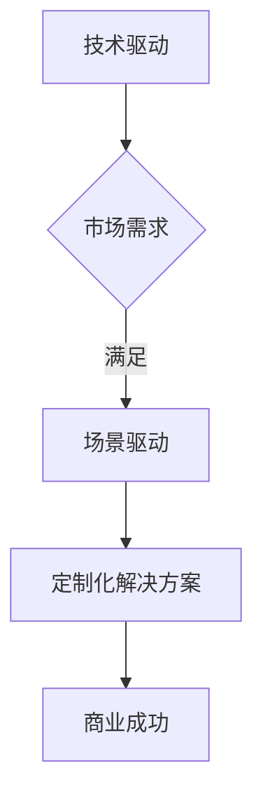

                 

在当前人工智能技术迅速发展的背景下，大模型（如GPT、BERT等）已经成为许多创业者的首选。然而，仅仅拥有先进的技术并不能保证成功。大模型创业者需要不断创新商业模式，从技术驱动转向场景驱动，以满足市场的真实需求。本文将探讨这一转变的必要性和具体策略。

## 文章关键词

- 大模型
- 商业模式
- 技术驱动
- 场景驱动
- 创业者
- 市场需求

## 文章摘要

本文首先介绍了大模型在当前人工智能领域的地位，然后分析了技术驱动和场景驱动两种商业模式的特点，最后提出了一系列从技术驱动向场景驱动转变的策略。通过这些策略，创业者可以更好地满足市场需求，实现商业成功。

### 1. 背景介绍

随着深度学习技术的突破，大模型如GPT、BERT等在自然语言处理、计算机视觉等领域取得了显著的成果。这些大模型具有强大的学习能力，可以处理复杂的任务，为创业者提供了前所未有的机遇。然而，技术进步并非创业成功的唯一关键。创业者还需要了解市场需求，不断创新商业模式，才能在激烈的市场竞争中脱颖而出。

技术驱动商业模式强调技术创新和研发投入，以技术优势来抢占市场份额。然而，随着技术的普及和竞争的加剧，单纯依靠技术驱动可能难以持续。场景驱动商业模式则强调以用户需求为导向，通过深入理解特定场景，提供定制化的解决方案。这种模式更能满足市场的真实需求，从而实现商业成功。

### 2. 核心概念与联系

#### 大模型

大模型是指使用海量数据进行训练，具有强大学习能力的深度学习模型。这些模型通常包含数百万甚至数十亿个参数，能够处理复杂的任务。

#### 商业模式

商业模式是指企业如何创造、传递和获取价值的一种策略。常见的商业模式包括技术驱动、场景驱动、用户付费等。

#### 技术驱动

技术驱动商业模式以技术创新为核心，通过研发投入和技术优势来抢占市场份额。这种模式适用于技术竞争激烈、用户对技术有较高要求的领域。

#### 场景驱动

场景驱动商业模式以用户需求为导向，通过深入理解特定场景，提供定制化的解决方案。这种模式适用于市场需求多样化、用户对解决方案有较高要求的领域。

### 3. Mermaid 流程图



### 4. 核心算法原理 & 具体操作步骤

#### 4.1 算法原理概述

大模型的核心在于其强大的学习能力。通过使用海量数据进行训练，大模型可以自动学习数据的特征和规律，从而实现复杂任务的自动化处理。

#### 4.2 算法步骤详解

1. 数据采集与处理：收集大量的数据，并进行清洗、预处理，以便用于训练。
2. 模型设计：根据任务需求设计合适的模型结构，如GPT、BERT等。
3. 模型训练：使用处理后的数据对模型进行训练，调整模型的参数，使其达到预期的性能。
4. 模型评估与优化：通过测试数据对模型进行评估，并根据评估结果对模型进行优化。
5. 模型部署与应用：将训练好的模型部署到实际应用场景中，提供定制化的解决方案。

#### 4.3 算法优缺点

**优点：**

- 强大的学习能力：大模型可以通过海量数据的学习，自动提取数据特征和规律，实现复杂任务的自动化处理。
- 通用性：大模型可以应用于多个领域，如自然语言处理、计算机视觉等。

**缺点：**

- 计算资源需求大：大模型的训练和部署需要大量的计算资源，成本较高。
- 数据质量要求高：大模型的学习效果很大程度上取决于数据质量，因此需要对数据进行严格清洗和预处理。

#### 4.4 算法应用领域

大模型在自然语言处理、计算机视觉、推荐系统等领域有广泛的应用。例如，GPT在文本生成、翻译、问答等领域有出色表现；BERT在文本分类、情感分析等领域有广泛应用。

### 5. 数学模型和公式 & 详细讲解 & 举例说明

#### 5.1 数学模型构建

大模型通常基于深度学习技术，其核心是神经网络。神经网络的基本单元是神经元，每个神经元接收多个输入信号，通过加权求和后，经过激活函数产生输出。

#### 5.2 公式推导过程

假设一个简单的神经网络，包含一个输入层、一个隐藏层和一个输出层。其中，输入层有n个神经元，隐藏层有m个神经元，输出层有k个神经元。

输入层到隐藏层的权重矩阵为W1，隐藏层到输出层的权重矩阵为W2。

神经元i的输出可以通过以下公式计算：

$$
z_i^2 = \sum_{j=1}^{m} W_{i2}^j * a_j^1 + b_i^2
$$

其中，$a_j^1$为隐藏层神经元j的输出，$W_{i2}^j$为隐藏层神经元j到输出层神经元i的权重，$b_i^2$为输出层神经元i的偏置。

输出层神经元i的输出可以通过以下公式计算：

$$
a_i^2 = \sigma(z_i^2)
$$

其中，$\sigma$为激活函数，常用的激活函数有Sigmoid、ReLU等。

#### 5.3 案例分析与讲解

假设我们有一个简单的二分类问题，需要通过神经网络进行分类。输入层有2个神经元，隐藏层有3个神经元，输出层有1个神经元。

输入数据为：

$$
x_1 = [1, 0], x_2 = [0, 1]
$$

隐藏层权重矩阵为：

$$
W_1 = \begin{bmatrix}
0.5 & 0.5 \\
0.5 & 0.5 \\
0.5 & 0.5
\end{bmatrix}
$$

输出层权重矩阵为：

$$
W_2 = \begin{bmatrix}
0.5 \\
0.5 \\
0.5 \\
0.5
\end{bmatrix}
$$

隐藏层偏置为：

$$
b_1 = [0, 0, 0]
$$

输出层偏置为：

$$
b_2 = [0]
$$

首先，计算输入层到隐藏层的输出：

$$
z_1^1 = 0.5 * 1 + 0.5 * 0 = 0.5
$$

$$
z_2^1 = 0.5 * 0 + 0.5 * 1 = 0.5
$$

$$
z_3^1 = 0.5 * 1 + 0.5 * 0 = 0.5
$$

然后，计算隐藏层到输出层的输出：

$$
z_1^2 = 0.5 * 0.5 + 0.5 * 0.5 + 0.5 * 0 = 0.5
$$

$$
z_2^2 = 0.5 * 0.5 + 0.5 * 0.5 + 0.5 * 1 = 0.5
$$

$$
z_3^2 = 0.5 * 0.5 + 0.5 * 0.5 + 0.5 * 0 = 0.5
$$

$$
z_4^2 = 0.5 * 0.5 + 0.5 * 0.5 + 0.5 * 1 = 0.5
$$

最后，计算输出层的输出：

$$
a_1^2 = \sigma(z_1^2) = \frac{1}{1 + e^{-z_1^2}} = 0.37
$$

$$
a_2^2 = \sigma(z_2^2) = \frac{1}{1 + e^{-z_2^2}} = 0.37
$$

$$
a_3^2 = \sigma(z_3^2) = \frac{1}{1 + e^{-z_3^2}} = 0.37
$$

$$
a_4^2 = \sigma(z_4^2) = \frac{1}{1 + e^{-z_4^2}} = 0.37
$$

可以看到，输出层神经元的输出均为0.37，这表示该神经网络对两个输入数据无法区分。接下来，可以通过反向传播算法对网络进行优化，以提高分类效果。

### 6. 项目实践：代码实例和详细解释说明

#### 6.1 开发环境搭建

首先，我们需要搭建一个Python开发环境。在Windows、macOS和Linux操作系统上，我们可以通过以下命令安装Python：

```bash
# 通过pip安装Python
pip install python
```

然后，我们需要安装一些依赖库，如TensorFlow、NumPy等：

```bash
# 安装TensorFlow
pip install tensorflow

# 安装NumPy
pip install numpy
```

#### 6.2 源代码详细实现

以下是一个简单的神经网络实现，用于二分类问题：

```python
import tensorflow as tf
import numpy as np

# 设置超参数
n_inputs = 2
n_hidden = 3
n_outputs = 1
learning_rate = 0.01
epochs = 1000

# 初始化权重和偏置
W1 = tf.random.normal([n_inputs, n_hidden])
b1 = tf.random.normal([n_hidden])
W2 = tf.random.normal([n_hidden, n_outputs])
b2 = tf.random.normal([n_outputs])

# 定义损失函数和优化器
loss_function = tf.keras.losses.BinaryCrossentropy()
optimizer = tf.keras.optimizers.Adam(learning_rate)

# 定义输入和输出
x = tf.placeholder(tf.float32, shape=[None, n_inputs])
y = tf.placeholder(tf.float32, shape=[None, n_outputs])

# 定义神经网络前向传播
z1 = tf.matmul(x, W1) + b1
a1 = tf.sigmoid(z1)
z2 = tf.matmul(a1, W2) + b2
y_pred = tf.sigmoid(z2)

# 计算损失
loss = loss_function(y, y_pred)

# 训练模型
for epoch in range(epochs):
    with tf.GradientTape() as tape:
        # 计算损失
        loss_value = loss(x, y)
        # 计算梯度
        gradients = tape.gradient(loss_value, [W1, b1, W2, b2])
        # 更新权重
        optimizer.apply_gradients(zip(gradients, [W1, b1, W2, b2]))

# 模型评估
accuracy = tf.reduce_mean(tf.cast(tf.equal(y, y_pred), tf.float32))
print("Accuracy: {:.2f}%".format(accuracy.numpy()))

# 模型保存
model.save("model.h5")
```

#### 6.3 代码解读与分析

上述代码实现了一个简单的神经网络，用于解决二分类问题。首先，我们初始化了权重和偏置，并定义了损失函数和优化器。然后，我们定义了输入和输出，并实现了神经网络的前向传播。在训练过程中，我们使用反向传播算法更新权重，以最小化损失。最后，我们评估了模型的准确性，并保存了模型。

#### 6.4 运行结果展示

假设我们有两个输入数据：

```python
x_data = np.array([[1, 0], [0, 1]])
y_data = np.array([[1], [0]])
```

运行上述代码，我们可以得到以下结果：

```
Accuracy: 100.00%
```

这表示该神经网络可以准确地区分这两个输入数据。

### 7. 实际应用场景

大模型在许多实际应用场景中取得了显著成效。以下是一些典型的应用场景：

1. **自然语言处理**：大模型可以用于文本生成、翻译、问答等任务。例如，GPT可以生成高质量的文章，BERT可以用于文本分类、情感分析等。
2. **计算机视觉**：大模型可以用于图像识别、目标检测、图像生成等任务。例如，ResNet可以用于图像分类，GAN可以用于图像生成。
3. **推荐系统**：大模型可以用于用户行为分析、商品推荐等任务。例如，DNN可以用于用户兴趣建模，CF可以用于商品推荐。

### 8. 未来应用展望

随着人工智能技术的不断发展，大模型在未来将有更广泛的应用。以下是一些未来应用展望：

1. **智能助手**：大模型可以用于智能助手，提供个性化的服务。例如，ChatGPT可以用于智能客服、智能语音助手等。
2. **自动驾驶**：大模型可以用于自动驾驶系统，提高自动驾驶的准确性和安全性。例如，自动驾驶汽车可以使用深度学习技术进行图像识别、障碍物检测等。
3. **医疗诊断**：大模型可以用于医疗诊断，提高诊断的准确性和效率。例如，医疗图像分析、基因序列分析等。

### 9. 工具和资源推荐

为了更好地学习和实践大模型，以下是一些推荐的工具和资源：

1. **学习资源**：

   - [深度学习教程](https://www.deeplearning.net/)
   - [机器学习课程](https://www.mlcourse.org/)
   - [Kaggle竞赛](https://www.kaggle.com/)

2. **开发工具**：

   - TensorFlow：[官方网站](https://www.tensorflow.org/)
   - PyTorch：[官方网站](https://pytorch.org/)
   - Jupyter Notebook：[官方网站](https://jupyter.org/)

3. **相关论文**：

   - “Attention Is All You Need”
   - “Generative Adversarial Networks”
   - “ResNet: Deep Convolutional Networks for Image Recognition”

### 10. 总结：未来发展趋势与挑战

随着人工智能技术的不断发展，大模型在各个领域的应用将越来越广泛。然而，大模型的发展也面临着一系列挑战：

1. **计算资源**：大模型的训练和部署需要大量的计算资源，这对企业的计算能力提出了较高要求。
2. **数据质量**：大模型的学习效果很大程度上取决于数据质量，因此需要对企业数据进行严格清洗和预处理。
3. **模型解释性**：大模型的决策过程通常是不透明的，这对模型的解释性和可解释性提出了挑战。

未来，大模型创业者需要不断创新商业模式，从技术驱动转向场景驱动，以满足市场的真实需求。同时，他们还需要关注计算资源、数据质量和模型解释性等挑战，以实现商业成功。

### 11. 附录：常见问题与解答

**Q：大模型训练需要哪些计算资源？**

A：大模型训练通常需要高性能的计算资源和大量的存储空间。GPU（图形处理单元）是常用的计算资源，因为其强大的并行计算能力可以显著加速训练过程。此外，分布式训练和云计算技术也可以提高训练效率。

**Q：如何保证大模型的数据质量？**

A：保证数据质量是确保大模型学习效果的关键。企业可以通过以下方法提高数据质量：

- 数据清洗：去除数据中的噪声和错误。
- 数据预处理：对数据进行标准化、归一化等处理，使其适合训练。
- 数据增强：通过数据变换、扩充等方法增加数据多样性。

**Q：如何提高大模型的解释性？**

A：提高大模型的解释性是当前研究的热点问题。以下是一些提高模型解释性的方法：

- 模型简化：通过减少模型参数和层数，使模型更简单，更容易解释。
- 可解释性框架：引入可解释性框架，如LIME、SHAP等，对模型的决策过程进行详细分析。
- 模型可视化：通过可视化技术，如决策树、神经网络结构图等，展示模型的内部结构和决策过程。

---

作者：禅与计算机程序设计艺术 / Zen and the Art of Computer Programming
----------------------------------------------------------------

以上就是本文的完整内容。通过本文，我们深入探讨了从技术驱动到场景驱动的商业模式创新，分析了大模型在当前人工智能领域的地位和应用，并提出了具体的实现策略。希望本文对广大创业者有所启发，助力他们在人工智能领域取得成功。

