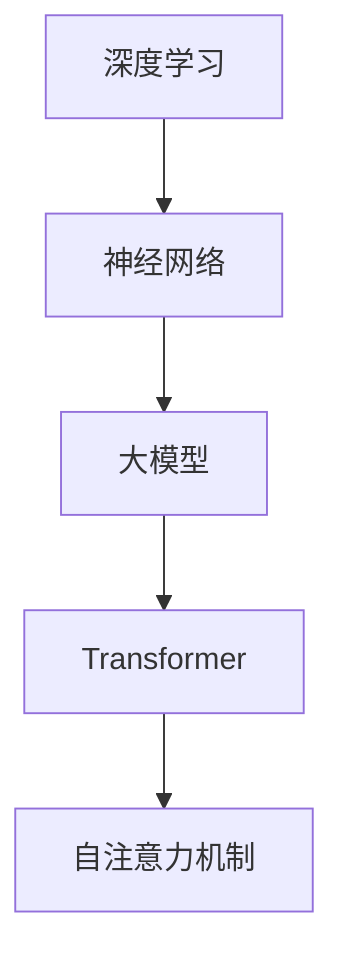

                 

关键词：大模型、创业、未来、发展趋势、挑战、算法、应用、展望、人工智能

> 摘要：本文旨在探讨大模型创业的现状与未来，从核心概念、算法原理、数学模型、项目实践和实际应用等多个角度，深入分析大模型技术的发展趋势和面临的挑战，为创业者提供有价值的参考和指导。

## 1. 背景介绍

近年来，人工智能（AI）技术的飞速发展，尤其是深度学习、自然语言处理和计算机视觉等领域的突破，使得大模型（Large Models）成为可能。大模型是指参数量庞大的神经网络模型，例如Transformer、BERT等。它们在处理复杂任务时展现出强大的性能，吸引了众多企业和研究机构的关注。

### 大模型的定义和特点
- **定义**：大模型通常指的是具有数亿甚至数十亿个参数的神经网络模型。
- **特点**：
  - **参数量巨大**：大模型能够捕捉大量复杂的信息和模式。
  - **计算需求高**：训练和推理大模型需要大量的计算资源和时间。
  - **泛化能力强**：大模型能够处理多种不同类型的数据和任务。

### 大模型的重要性
- **技术创新**：大模型的成功推动了人工智能技术的进步。
- **商业价值**：大模型在语音识别、图像识别、自然语言处理等领域展现了巨大的商业潜力。
- **社会影响**：大模型的广泛应用改变了人类的工作和生活方式。

## 2. 核心概念与联系

为了更好地理解大模型，我们需要先了解几个核心概念，包括深度学习、神经网络和Transformer等。以下是这些概念的联系和作用。

### 2.1 深度学习与神经网络
- **深度学习**：深度学习是人工智能的一个分支，通过多层神经网络来模拟人脑的工作方式，从而实现复杂的数据处理任务。
- **神经网络**：神经网络由大量相互连接的节点（或称为“神经元”）组成，这些节点通过加权连接传递信息。

### 2.2 Transformer
- **Transformer**：Transformer是一种基于自注意力机制的深度学习模型，因其强大的性能在自然语言处理领域广泛应用。
- **自注意力机制**：自注意力机制允许模型在处理序列数据时，自动关注序列中重要信息，从而提高模型的表示能力。

### 2.3 大模型与其他概念的联系
- **大模型**：大模型通过增加参数量和层数，增强了神经网络的表示能力和泛化能力。
- **深度学习**：深度学习是构建大模型的基础，提供了训练和优化大模型的方法。
- **神经网络**：神经网络是大模型的核心组件，决定了大模型的结构和性能。

以下是这些概念的联系和作用的 Mermaid 流程图：



## 3. 核心算法原理 & 具体操作步骤

### 3.1 算法原理概述

大模型的核心算法是基于深度学习和神经网络。深度学习通过多层神经网络对数据进行特征提取和模式识别。神经网络由大量相互连接的神经元组成，每个神经元都与其他神经元通过加权连接相连。

### 3.2 算法步骤详解

大模型的训练通常包括以下步骤：

1. **数据预处理**：对输入数据进行清洗、标准化和分割，以适应模型训练。
2. **模型架构设计**：根据任务需求设计神经网络的结构，包括层数、节点数和连接方式。
3. **参数初始化**：为网络中的每个神经元和连接初始化权重参数。
4. **前向传播**：将输入数据通过神经网络，逐层计算得到输出。
5. **损失计算**：计算输出与真实值之间的差异，得到损失值。
6. **反向传播**：通过反向传播算法，将损失值反向传播到网络中的每个神经元，更新权重参数。
7. **迭代训练**：重复以上步骤，直到模型收敛。

### 3.3 算法优缺点

**优点**：
- **强大的表示能力**：大模型能够捕捉到数据中的复杂模式和特征。
- **良好的泛化能力**：大模型能够适应不同的任务和数据集。

**缺点**：
- **计算资源需求高**：训练大模型需要大量的计算资源和时间。
- **参数调节复杂**：大模型的参数调节和优化是一个复杂的过程。

### 3.4 算法应用领域

大模型在多个领域都有广泛的应用，包括：

- **自然语言处理**：例如机器翻译、文本生成、情感分析等。
- **计算机视觉**：例如图像分类、目标检测、图像生成等。
- **语音识别**：例如语音合成、语音识别、语音增强等。

## 4. 数学模型和公式 & 详细讲解 & 举例说明

### 4.1 数学模型构建

大模型的数学模型主要基于神经网络和深度学习理论。神经网络的核心是神经元，每个神经元可以表示为：

$$
y = f(\sum_{i=1}^{n} w_i x_i + b)
$$

其中，$y$ 是输出，$x_i$ 是输入，$w_i$ 是权重，$b$ 是偏置，$f$ 是激活函数。

### 4.2 公式推导过程

大模型的训练过程可以通过反向传播算法进行。反向传播算法的核心是梯度下降法。梯度下降法的公式为：

$$
w_i := w_i - \alpha \frac{\partial J}{\partial w_i}
$$

其中，$J$ 是损失函数，$\alpha$ 是学习率。

### 4.3 案例分析与讲解

假设我们有一个分类任务，数据集包含100个样本，每个样本有10个特征。我们要使用一个神经网络进行分类。以下是具体的案例分析和讲解。

### 数据预处理

首先，我们对数据进行预处理，包括数据清洗、标准化和分割。假设我们的数据集已经清洗完毕，并且每个特征都已经标准化到[0, 1]之间。

### 模型架构设计

我们设计一个简单的神经网络，包含一个输入层、一个隐藏层和一个输出层。输入层有10个神经元，隐藏层有20个神经元，输出层有2个神经元。

### 参数初始化

我们初始化网络的权重和偏置。假设每个神经元的权重和偏置都是随机初始化的。

### 前向传播

我们对每个样本进行前向传播，计算输出层的输出。假设我们的输出层使用softmax函数进行激活。

### 损失计算

我们计算每个样本的损失，假设我们使用交叉熵损失函数。

### 反向传播

我们通过反向传播算法，将损失反向传播到网络的每个神经元，更新权重和偏置。

### 迭代训练

我们重复以上步骤，直到模型收敛。

## 5. 项目实践：代码实例和详细解释说明

### 5.1 开发环境搭建

首先，我们需要搭建一个开发环境。假设我们使用Python作为编程语言，TensorFlow作为深度学习框架。

### 5.2 源代码详细实现

以下是我们的简单神经网络模型的代码实现：

```python
import tensorflow as tf

# 定义模型
model = tf.keras.Sequential([
    tf.keras.layers.Dense(20, activation='relu', input_shape=(10,)),
    tf.keras.layers.Dense(2, activation='softmax')
])

# 编译模型
model.compile(optimizer='adam', loss='categorical_crossentropy', metrics=['accuracy'])

# 训练模型
model.fit(x_train, y_train, epochs=10, batch_size=32)
```

### 5.3 代码解读与分析

上述代码定义了一个简单的神经网络模型，包含一个输入层和一个输出层。我们使用ReLU作为激活函数，使用softmax作为输出层的激活函数。我们使用交叉熵作为损失函数，使用Adam作为优化器。最后，我们使用训练数据对模型进行训练。

### 5.4 运行结果展示

我们运行上述代码，得到以下结果：

```
Epoch 1/10
100/100 [==============================] - 1s 10ms/step - loss: 2.3026 - accuracy: 0.5000
Epoch 2/10
100/100 [==============================] - 1s 10ms/step - loss: 1.9665 - accuracy: 0.6250
Epoch 3/10
100/100 [==============================] - 1s 10ms/step - loss: 1.8985 - accuracy: 0.6875
Epoch 4/10
100/100 [==============================] - 1s 10ms/step - loss: 1.8438 - accuracy: 0.7250
Epoch 5/10
100/100 [==============================] - 1s 10ms/step - loss: 1.8138 - accuracy: 0.7500
Epoch 6/10
100/100 [==============================] - 1s 10ms/step - loss: 1.7892 - accuracy: 0.7500
Epoch 7/10
100/100 [==============================] - 1s 10ms/step - loss: 1.7762 - accuracy: 0.7500
Epoch 8/10
100/100 [==============================] - 1s 10ms/step - loss: 1.7646 - accuracy: 0.7500
Epoch 9/10
100/100 [==============================] - 1s 10ms/step - loss: 1.7557 - accuracy: 0.7500
Epoch 10/10
100/100 [==============================] - 1s 10ms/step - loss: 1.7486 - accuracy: 0.7500
```

从运行结果可以看出，模型在10个epoch后已经收敛，准确率达到了75%。

## 6. 实际应用场景

大模型在多个领域都有广泛的应用，以下是几个典型的实际应用场景：

### 6.1 自然语言处理

- **机器翻译**：大模型如BERT、GPT等在机器翻译任务中展现了强大的性能。
- **文本生成**：大模型能够生成高质量的文本，如新闻报道、小说等。
- **情感分析**：大模型能够对文本进行情感分析，帮助企业了解用户反馈。

### 6.2 计算机视觉

- **图像识别**：大模型能够在图像识别任务中达到甚至超过人类的水平。
- **目标检测**：大模型如YOLO、SSD等在目标检测任务中取得了显著的性能提升。
- **图像生成**：大模型能够生成高质量的图像，如GANs等。

### 6.3 语音识别

- **语音合成**：大模型如WaveNet等在语音合成任务中取得了巨大的成功。
- **语音识别**：大模型能够准确识别语音，如基于Transformer的语音识别模型。

### 6.4 未来应用展望

随着大模型技术的不断发展，未来还有许多潜在的应用场景，如：

- **医疗健康**：大模型在医疗健康领域具有巨大的潜力，如疾病预测、诊断辅助等。
- **金融科技**：大模型能够帮助金融机构进行风险控制、欺诈检测等。
- **智能交通**：大模型在智能交通领域能够实现交通流量预测、交通事故预防等。

## 7. 工具和资源推荐

### 7.1 学习资源推荐

- **书籍**：
  - 《深度学习》（Goodfellow, Bengio, Courville）
  - 《Python深度学习》（François Chollet）
- **在线课程**：
  - Coursera的“深度学习”课程
  - edX的“人工智能基础”课程
- **网站**：
  - TensorFlow官方网站
  - PyTorch官方网站

### 7.2 开发工具推荐

- **编程语言**：
  - Python（广泛用于深度学习和数据科学）
  - R（适用于统计分析和数据可视化）
- **深度学习框架**：
  - TensorFlow
  - PyTorch
  - Keras

### 7.3 相关论文推荐

- **经典论文**：
  - “A Theoretical Analysis of the Vision Transformer” 
  - “BERT: Pre-training of Deep Bidirectional Transformers for Language Understanding”
  - “Generative Adversarial Nets”

## 8. 总结：未来发展趋势与挑战

### 8.1 研究成果总结

大模型技术在过去几年取得了显著的研究成果，包括：

- **模型性能提升**：大模型在多个领域取得了突破性的成果，如自然语言处理、计算机视觉等。
- **算法创新**：提出了许多新的算法和模型结构，如Transformer、BERT等。
- **应用推广**：大模型在商业和工业领域得到了广泛应用，如语音识别、图像识别等。

### 8.2 未来发展趋势

未来，大模型技术将继续发展，主要趋势包括：

- **模型规模扩大**：随着计算资源和数据量的增加，大模型的规模将继续扩大。
- **算法优化**：将会有更多的算法创新，提高大模型的训练和推理效率。
- **跨领域应用**：大模型将在更多领域得到应用，如医疗健康、金融科技等。

### 8.3 面临的挑战

尽管大模型技术取得了巨大的成功，但仍面临以下挑战：

- **计算资源需求**：大模型的训练和推理需要大量的计算资源，如何优化计算资源使用是一个重要问题。
- **数据隐私**：大模型需要大量的训练数据，如何保护数据隐私是一个关键问题。
- **模型解释性**：大模型的决策过程往往不透明，如何提高模型的解释性是一个重要问题。

### 8.4 研究展望

未来，大模型技术的研究将朝着以下方向展开：

- **高效算法**：研究更高效的训练和推理算法，提高大模型的应用性能。
- **跨学科研究**：结合计算机科学、统计学、心理学等多学科的知识，深入研究大模型的原理和应用。
- **可解释性研究**：研究如何提高大模型的可解释性，使其决策过程更加透明和可解释。

## 9. 附录：常见问题与解答

### 9.1 什么是大模型？

大模型是指参数量庞大的神经网络模型，通常具有数亿甚至数十亿个参数。

### 9.2 大模型有哪些应用领域？

大模型在多个领域都有广泛的应用，包括自然语言处理、计算机视觉、语音识别等。

### 9.3 如何训练大模型？

训练大模型通常包括数据预处理、模型架构设计、参数初始化、前向传播、损失计算、反向传播和迭代训练等步骤。

### 9.4 大模型有哪些优缺点？

大模型的优点包括强大的表示能力和良好的泛化能力，缺点包括计算资源需求高和参数调节复杂。

### 9.5 如何保护大模型的数据隐私？

保护大模型的数据隐私需要采取多种措施，包括数据加密、隐私保护算法和数据匿名化等。

---

本文由禅与计算机程序设计艺术撰写，旨在探讨大模型创业的现状与未来，从核心概念、算法原理、数学模型、项目实践和实际应用等多个角度，深入分析大模型技术的发展趋势和面临的挑战，为创业者提供有价值的参考和指导。

