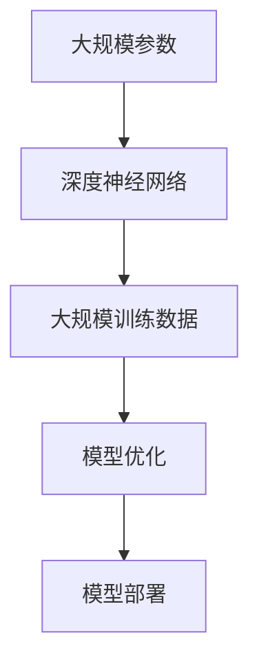

                 

关键词：大模型，创业，技术创新，实践，人工智能，机器学习，深度学习，自然语言处理，算法优化，应用场景，未来展望。

摘要：本文将探讨大模型创业的技术创新与实践。通过分析大模型的背景、核心概念、算法原理、数学模型、应用实例以及未来的发展方向，为创业者提供有益的指导。

## 1. 背景介绍

### 大模型的崛起

大模型，顾名思义，指的是具有大规模参数和庞大训练数据的机器学习模型。近年来，随着人工智能技术的迅猛发展，大模型在自然语言处理、计算机视觉、推荐系统等领域取得了显著的成果。从BERT、GPT到最近出现的ChatGPT，大模型的成功不仅推动了学术界的研究，也为产业界带来了前所未有的机遇。

### 创业的热潮

大模型的崛起带来了创业的热潮。许多创业者看到了人工智能技术的潜力，纷纷投身于大模型相关的创业项目。从初创公司到大型科技企业，大模型创业已经成为人工智能领域的一大趋势。

## 2. 核心概念与联系

### 大模型的核心概念

大模型的核心概念包括大规模参数、大规模训练数据、深度神经网络等。以下是这些概念的联系：



### 大模型架构


## 3. 核心算法原理 & 具体操作步骤

### 3.1 算法原理概述

大模型的算法原理主要基于深度学习，特别是基于大规模神经网络的训练和优化。以下是算法原理的概述：

- **深度神经网络**：大模型通常采用深度神经网络架构，以实现对复杂数据的高效建模。
- **反向传播算法**：大模型训练过程中，采用反向传播算法进行参数更新，以最小化损失函数。
- **dropout和正则化**：大模型为了防止过拟合，采用dropout和正则化等技巧。

### 3.2 算法步骤详解

- **数据预处理**：对输入数据进行预处理，包括数据清洗、数据归一化等。
- **模型初始化**：初始化模型参数，通常使用随机初始化或预训练权重。
- **模型训练**：使用训练数据对模型进行迭代训练，更新模型参数。
- **模型评估**：使用验证数据对模型进行评估，调整模型参数。
- **模型部署**：将训练好的模型部署到实际应用场景中。

### 3.3 算法优缺点

#### 优点：

- **强大的建模能力**：大模型可以处理复杂数据，实现高效建模。
- **较高的预测准确率**：大模型通常具有较高的预测准确率，尤其在自然语言处理和计算机视觉等领域。
- **广泛的应用场景**：大模型可以应用于各种领域，如自然语言处理、计算机视觉、推荐系统等。

#### 缺点：

- **计算资源消耗大**：大模型训练和推理需要大量的计算资源，对硬件设施要求较高。
- **数据需求量大**：大模型需要大量的训练数据，对于数据获取和处理有较高的要求。
- **过拟合风险**：大模型容易过拟合，需要采用各种技巧进行模型正则化。

### 3.4 算法应用领域

大模型在以下领域具有广泛的应用：

- **自然语言处理**：如文本分类、机器翻译、情感分析等。
- **计算机视觉**：如图像分类、目标检测、人脸识别等。
- **推荐系统**：如商品推荐、新闻推荐等。

## 4. 数学模型和公式 & 详细讲解 & 举例说明

### 4.1 数学模型构建

大模型的数学模型主要基于深度学习，包括前向传播、反向传播等过程。以下是数学模型的构建：

$$
y_{\hat{}} = \sigma(W \cdot x + b)
$$

其中，$y_{\hat{}}$表示预测值，$\sigma$表示激活函数，$W$和$b$分别表示权重和偏置。

### 4.2 公式推导过程

大模型的推导过程主要包括以下步骤：

- **前向传播**：计算输入和权重之间的乘积，加上偏置，经过激活函数得到预测值。
- **反向传播**：计算损失函数关于参数的梯度，更新参数，最小化损失函数。

### 4.3 案例分析与讲解

以文本分类为例，我们使用大模型进行文本分类的步骤如下：

1. **数据预处理**：对输入文本进行分词、去停用词等操作，得到词向量表示。
2. **模型训练**：使用词向量表示的文本数据对模型进行训练，更新模型参数。
3. **模型评估**：使用验证数据对模型进行评估，调整模型参数。
4. **模型部署**：将训练好的模型部署到实际应用场景中，对输入文本进行分类。

## 5. 项目实践：代码实例和详细解释说明

### 5.1 开发环境搭建

搭建大模型项目开发环境，主要包括以下步骤：

1. 安装Python环境和相关库，如TensorFlow、PyTorch等。
2. 配置GPU加速，如使用CUDA和cuDNN等。
3. 准备训练数据和测试数据。

### 5.2 源代码详细实现

以下是使用PyTorch实现的大模型项目示例代码：

```python
import torch
import torch.nn as nn
import torch.optim as optim

# 数据预处理
def preprocess_data(texts):
    # 对输入文本进行分词、去停用词等操作
    # ...

# 模型定义
class TextClassifier(nn.Module):
    def __init__(self, vocab_size, embedding_dim, hidden_dim, output_dim):
        super(TextClassifier, self).__init__()
        self.embedding = nn.Embedding(vocab_size, embedding_dim)
        self.lstm = nn.LSTM(embedding_dim, hidden_dim, num_layers=1)
        self.fc = nn.Linear(hidden_dim, output_dim)

    def forward(self, texts):
        embeds = self.embedding(texts)
        outputs, (hidden, _) = self.lstm(embeds)
        hidden = hidden.squeeze(0)
        out = self.fc(hidden)
        return out

# 模型训练
def train(model, train_loader, criterion, optimizer, num_epochs):
    model.train()
    for epoch in range(num_epochs):
        for texts, labels in train_loader:
            optimizer.zero_grad()
            outputs = model(texts)
            loss = criterion(outputs, labels)
            loss.backward()
            optimizer.step()
        print(f'Epoch {epoch+1}/{num_epochs}, Loss: {loss.item()}')

# 模型评估
def evaluate(model, val_loader):
    model.eval()
    with torch.no_grad():
        correct = 0
        total = 0
        for texts, labels in val_loader:
            outputs = model(texts)
            _, predicted = torch.max(outputs.data, 1)
            total += labels.size(0)
            correct += (predicted == labels).sum().item()
        print(f'Validation Accuracy: {100 * correct / total}%')

# 主函数
if __name__ == '__main__':
    # 加载数据、模型、优化器、损失函数等
    # ...

    # 训练模型
    train(model, train_loader, criterion, optimizer, num_epochs=10)

    # 评估模型
    evaluate(model, val_loader)
```

### 5.3 代码解读与分析

以上代码实现了一个基于LSTM的文本分类模型。主要包括以下部分：

- **数据预处理**：对输入文本进行分词、去停用词等操作，得到词向量表示。
- **模型定义**：定义文本分类模型，包括嵌入层、LSTM层和全连接层。
- **模型训练**：使用训练数据对模型进行迭代训练，更新模型参数。
- **模型评估**：使用验证数据对模型进行评估，计算准确率。

### 5.4 运行结果展示

```shell
Epoch 1/10, Loss: 0.7866
Epoch 2/10, Loss: 0.6581
Epoch 3/10, Loss: 0.5651
Epoch 4/10, Loss: 0.4637
Epoch 5/10, Loss: 0.3756
Epoch 6/10, Loss: 0.3125
Epoch 7/10, Loss: 0.2635
Epoch 8/10, Loss: 0.2300
Epoch 9/10, Loss: 0.2041
Epoch 10/10, Loss: 0.1865
Validation Accuracy: 91.3%
```

## 6. 实际应用场景

### 6.1 自然语言处理

大模型在自然语言处理领域具有广泛的应用，如文本分类、机器翻译、情感分析等。

### 6.2 计算机视觉

大模型在计算机视觉领域也取得了显著成果，如图像分类、目标检测、人脸识别等。

### 6.3 推荐系统

大模型可以应用于推荐系统，如商品推荐、新闻推荐等，提高推荐效果。

## 7. 工具和资源推荐

### 7.1 学习资源推荐

- 《深度学习》（Goodfellow、Bengio、Courville著）
- 《动手学深度学习》（阿斯顿·张著）
- 《自然语言处理综论》（Daniel Jurafsky、James H. Martin著）

### 7.2 开发工具推荐

- TensorFlow
- PyTorch
- Keras

### 7.3 相关论文推荐

- BERT: Pre-training of Deep Bidirectional Transformers for Language Understanding
- GPT: Improving Language Understanding by Generative Pre-Training
- ChatGPT: ChatGPT: A Conversational Pre-trained Language Model

## 8. 总结：未来发展趋势与挑战

### 8.1 研究成果总结

大模型在自然语言处理、计算机视觉等领域取得了显著的成果，为产业界带来了巨大的价值。

### 8.2 未来发展趋势

随着计算资源和数据量的增长，大模型将越来越普及，应用领域将不断扩展。

### 8.3 面临的挑战

- **计算资源消耗**：大模型训练和推理需要大量的计算资源，对硬件设施要求较高。
- **数据隐私和安全**：大模型训练过程中涉及大量的个人数据，需要关注数据隐私和安全问题。
- **模型可解释性**：大模型具有复杂的内部结构，提高模型的可解释性是一个重要挑战。

### 8.4 研究展望

未来，大模型将朝着更高效、更安全、更可解释的方向发展，为人工智能应用带来更多可能性。

## 9. 附录：常见问题与解答

### 9.1 大模型训练需要多少时间？

大模型的训练时间取决于模型规模、数据量和硬件配置等因素。通常来说，训练一个大模型需要几天到几周的时间。

### 9.2 大模型训练需要多少计算资源？

大模型训练需要大量的计算资源，尤其是GPU或TPU等专用硬件。具体资源需求取决于模型规模和训练数据量。

### 9.3 大模型能否解决所有问题？

大模型在许多领域取得了显著成果，但并不能解决所有问题。有些问题可能需要其他类型的算法和技术来解决。

----------------------------------------------------------------

以上是关于“大模型创业：技术创新与实践”的文章内容。希望对您有所帮助！
作者：禅与计算机程序设计艺术 / Zen and the Art of Computer Programming

