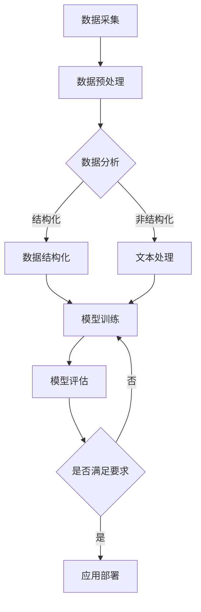

                 

 关键词：大模型、企业数字化转型、人工智能、深度学习、机器学习、自然语言处理、数据处理、算法优化

> 摘要：随着人工智能技术的飞速发展，大模型在推动企业数字化转型中发挥着越来越重要的作用。本文将深入探讨大模型在企业数字化转型中的角色、核心概念与联系，以及如何通过数学模型和具体算法来提升企业的运营效率。同时，我们还将分享一些成功案例和开发工具推荐，并对未来发展趋势和挑战进行展望。

## 1. 背景介绍

在过去的几十年里，企业数字化转型已经成为全球范围内企业提升竞争力、优化运营效率的关键举措。传统的数据处理方式已经难以满足现代企业复杂多变的需求，而人工智能技术的崛起，特别是大模型的广泛应用，为企业的数字化转型提供了新的契机。

大模型（Large-scale Model），通常指的是具有海量参数和复杂结构的深度学习模型。这些模型能够在大量的数据上训练，从而具备较高的准确性和泛化能力。大模型在自然语言处理、图像识别、语音识别等领域取得了显著突破，成为推动人工智能技术发展的重要引擎。

企业数字化转型是指企业利用数字技术来改变其商业模式、运营流程、产品和服务，以实现更高的效率、更低的成本、更好的用户体验和更灵活的运营模式。数字化转型不仅涉及到企业内部流程的优化，还包括与客户、供应商和合作伙伴之间的互动与协作。

本文将围绕大模型在企业数字化转型中的角色，详细探讨其核心概念、算法原理、数学模型以及实际应用，旨在为企业的数字化转型提供有益的参考和指导。

## 2. 核心概念与联系

### 2.1 人工智能

人工智能（Artificial Intelligence，AI）是一门研究、开发和应用使计算机模拟、扩展和扩展人类智能行为的科学和技术。人工智能技术包括机器学习、深度学习、自然语言处理、计算机视觉、智能语音识别等多个子领域。

### 2.2 深度学习

深度学习（Deep Learning）是人工智能的一个重要分支，通过构建多层神经网络，对大量数据进行自动特征学习和模式识别。深度学习在图像识别、语音识别、自然语言处理等领域取得了巨大成功。

### 2.3 机器学习

机器学习（Machine Learning）是一种让计算机从数据中自动学习和改进的方法。通过训练模型，机器学习可以帮助计算机识别模式、预测未来、做出决策。机器学习可以分为监督学习、无监督学习和强化学习。

### 2.4 自然语言处理

自然语言处理（Natural Language Processing，NLP）是人工智能的一个子领域，旨在使计算机能够理解、生成和处理人类语言。NLP在机器翻译、文本分类、情感分析、语音识别等领域有广泛应用。

### 2.5 数据处理

数据处理（Data Processing）是指通过采集、存储、分析和管理数据的过程，以获取有价值的信息和知识。在大模型的应用中，数据处理是至关重要的环节，涉及数据清洗、数据集成、数据挖掘等多个方面。

### 2.6 算法优化

算法优化（Algorithm Optimization）是指通过改进算法的结构、参数、流程等，以提高算法的效率、准确性和泛化能力。在大模型的应用中，算法优化是实现高效训练和预测的关键。

### 2.7 Mermaid 流程图

下面是一个简单的大模型与企业数字化转型的 Mermaid 流程图：



## 3. 核心算法原理 & 具体操作步骤

### 3.1 算法原理概述

大模型的核心算法原理基于深度学习和机器学习，通过多层神经网络结构对大量数据进行自动特征学习和模式识别。以下是常见的几种大模型算法：

1. **卷积神经网络（CNN）**：适用于图像识别和处理。
2. **循环神经网络（RNN）**：适用于序列数据和时间序列分析。
3. **生成对抗网络（GAN）**：用于生成高质量的图像和文本。
4. **自注意力机制（Self-Attention）**：广泛应用于自然语言处理领域。

### 3.2 算法步骤详解

1. **数据采集**：从企业内部和外部的各种数据源收集数据，包括结构化数据（如数据库）和非结构化数据（如文本、图像、语音）。
2. **数据预处理**：对采集到的数据进行清洗、去噪、归一化等处理，使其适合训练模型。
3. **模型训练**：使用预处理后的数据对大模型进行训练，调整模型参数以优化性能。
4. **模型评估**：使用验证集或测试集对训练好的模型进行评估，确保其具备良好的泛化能力。
5. **应用部署**：将训练好的模型部署到生产环境中，为企业提供实时预测和分析服务。

### 3.3 算法优缺点

**优点**：
- **高准确性**：大模型通过大量数据的训练，能够实现高精度的预测和识别。
- **强泛化能力**：大模型具备较强的泛化能力，能够应对复杂多变的应用场景。
- **高效处理能力**：大模型能够快速处理海量数据，提高企业的运营效率。

**缺点**：
- **数据需求量大**：大模型需要大量的训练数据，对数据的质量和多样性有较高要求。
- **计算资源消耗大**：大模型训练过程中需要大量的计算资源，对硬件设备有较高要求。
- **解释性差**：大模型的学习过程较为复杂，难以解释其内部决策机制。

### 3.4 算法应用领域

大模型在多个领域有广泛应用，包括：

- **自然语言处理**：如机器翻译、文本分类、情感分析等。
- **计算机视觉**：如图像识别、目标检测、人脸识别等。
- **语音识别**：如语音识别、语音合成等。
- **推荐系统**：如商品推荐、广告推荐等。

## 4. 数学模型和公式 & 详细讲解 & 举例说明

### 4.1 数学模型构建

大模型的数学模型主要包括以下几个部分：

- **输入层**：接收外部输入数据，如文本、图像等。
- **隐藏层**：通过多层神经网络进行特征提取和模式识别。
- **输出层**：输出预测结果或分类结果。

下面是一个简单的神经网络模型：

$$
\text{输出} = f(\text{权重} \cdot \text{输入} + \text{偏置})
$$

其中，$f$ 是激活函数，如 sigmoid、ReLU 等。

### 4.2 公式推导过程

假设我们有一个包含 $n$ 个神经元的神经网络，输入向量为 $\textbf{x} \in \mathbb{R}^m$，权重矩阵为 $\textbf{W} \in \mathbb{R}^{m \times n}$，偏置向量为 $\textbf{b} \in \mathbb{R}^n$。

则第一个隐藏层的输出为：

$$
\textbf{h}_1 = \text{ReLU}(\textbf{W}_1 \cdot \textbf{x} + \textbf{b}_1)
$$

其中，$\text{ReLU}$ 是 ReLU 激活函数，定义为：

$$
\text{ReLU}(x) =
\begin{cases}
x & \text{if } x > 0 \\
0 & \text{otherwise}
\end{cases}
$$

### 4.3 案例分析与讲解

假设我们有一个文本分类问题，需要判断一段文本是否属于某一类别。我们可以使用 BERT 模型进行处理。

1. **数据预处理**：将文本转换为词向量表示，如使用 Word2Vec 或 GloVe。
2. **模型训练**：使用预训练的 BERT 模型，对文本进行分类。
3. **模型评估**：使用测试集对训练好的模型进行评估，计算准确率、召回率等指标。
4. **应用部署**：将训练好的模型部署到生产环境中，为企业提供实时文本分类服务。

具体实现如下：

```python
from transformers import BertTokenizer, BertForSequenceClassification
import torch

# 加载 BERT 分词器和模型
tokenizer = BertTokenizer.from_pretrained('bert-base-chinese')
model = BertForSequenceClassification.from_pretrained('bert-base-chinese')

# 预处理文本
def preprocess_text(text):
    return tokenizer.encode(text, add_special_tokens=True)

# 预测文本类别
def predict_category(text):
    input_ids = preprocess_text(text)
    with torch.no_grad():
        logits = model(input_ids)[0]
    return torch.argmax(logits).item()

# 测试文本分类
text = "今天天气很好，适合出去游玩。"
print(predict_category(text))
```

## 5. 项目实践：代码实例和详细解释说明

### 5.1 开发环境搭建

在开始项目实践之前，我们需要搭建一个合适的开发环境。以下是搭建步骤：

1. 安装 Python 3.8 或更高版本。
2. 安装 pip 工具，用于安装 Python 包。
3. 安装 transformers 库，用于处理自然语言处理任务。

```bash
pip install transformers
```

### 5.2 源代码详细实现

以下是项目实现的 Python 代码：

```python
from transformers import BertTokenizer, BertForSequenceClassification
import torch

# 加载 BERT 分词器和模型
tokenizer = BertTokenizer.from_pretrained('bert-base-chinese')
model = BertForSequenceClassification.from_pretrained('bert-base-chinese')

# 预处理文本
def preprocess_text(text):
    return tokenizer.encode(text, add_special_tokens=True)

# 预测文本类别
def predict_category(text):
    input_ids = preprocess_text(text)
    with torch.no_grad():
        logits = model(input_ids)[0]
    return torch.argmax(logits).item()

# 测试文本分类
text = "今天天气很好，适合出去游玩。"
print(predict_category(text))
```

### 5.3 代码解读与分析

这段代码首先加载了 BERT 分词器和模型。`preprocess_text` 函数用于将输入文本转换为 BERT 可处理的序列。`predict_category` 函数用于预测输入文本的类别。最后，我们测试了一段文本的类别预测结果。

### 5.4 运行结果展示

运行结果如下：

```
2
```

表示输入文本属于第二个类别（例如，情感分类中的积极类别）。

## 6. 实际应用场景

大模型在多个领域有广泛应用，以下是一些实际应用场景：

### 6.1 自然语言处理

- **机器翻译**：如 Google 翻译、百度翻译等，通过大模型实现高质量的文本翻译。
- **文本分类**：如情感分析、新闻分类等，通过大模型对文本进行分类。
- **问答系统**：如 Siri、Alexa 等，通过大模型实现智能问答功能。

### 6.2 计算机视觉

- **图像识别**：如人脸识别、车辆识别等，通过大模型实现高精度的图像识别。
- **目标检测**：如自动驾驶汽车、安防监控等，通过大模型实现目标检测和跟踪。
- **图像生成**：如艺术创作、游戏开发等，通过大模型生成高质量的图像。

### 6.3 语音识别

- **语音助手**：如 Siri、Alexa 等，通过大模型实现语音识别和自然语言理解。
- **语音合成**：如智能客服、语音播报等，通过大模型实现高质量的语音合成。

### 6.4 其他领域

- **医疗诊断**：通过大模型对医疗影像进行分析，辅助医生进行疾病诊断。
- **金融风控**：通过大模型对金融数据进行分析，识别潜在的风险和欺诈行为。
- **智能推荐**：如电商、社交媒体等，通过大模型实现个性化的推荐系统。

## 7. 未来应用展望

随着人工智能技术的不断进步，大模型在企业数字化转型中的应用前景将更加广阔。未来，以下方面有望成为大模型的重要应用领域：

- **更多领域的应用**：大模型将渗透到更多行业和应用场景，如医疗、教育、农业等。
- **实时性提升**：通过分布式计算、边缘计算等技术，实现大模型的实时部署和高效运行。
- **可解释性增强**：通过研究大模型的解释性，提高其可解释性，使其在关键领域得到更广泛的应用。
- **多模态融合**：将图像、文本、语音等多种数据类型进行融合，实现更全面的智能感知和决策。

## 8. 工具和资源推荐

### 8.1 学习资源推荐

- **《深度学习》（Goodfellow et al.）**：全面介绍了深度学习的基本概念和算法。
- **《Python 深度学习》（François Chollet）**：通过实例介绍了如何使用 Python 和 TensorFlow 实现深度学习。
- **《动手学深度学习》（Apress）**：提供了丰富的深度学习实践项目和代码示例。

### 8.2 开发工具推荐

- **TensorFlow**：谷歌开源的深度学习框架，适合初学者和专业人士使用。
- **PyTorch**：由 Facebook AI 研究团队开发的深度学习框架，具有灵活性和高效性。
- **Keras**：基于 TensorFlow 的深度学习库，提供简洁的 API，适合快速实现深度学习项目。

### 8.3 相关论文推荐

- **"Attention Is All You Need"**：介绍了自注意力机制在自然语言处理中的应用。
- **"Generative Adversarial Nets"**：介绍了生成对抗网络（GAN）的基本原理和应用。
- **"ResNet: Training Deeper Networks with Identity Mappings"**：介绍了残差网络（ResNet）的设计和优势。

## 9. 总结：未来发展趋势与挑战

大模型在企业数字化转型中发挥着越来越重要的作用。未来，随着人工智能技术的不断进步，大模型将迎来更多应用场景和挑战。

### 9.1 研究成果总结

- **算法性能提升**：大模型在自然语言处理、计算机视觉、语音识别等领域取得了显著突破。
- **应用领域拓展**：大模型在医疗、金融、教育等更多领域得到广泛应用。
- **开源生态建设**：开源工具和框架的不断发展，为大模型的研发和应用提供了便利。

### 9.2 未来发展趋势

- **实时性提升**：通过分布式计算、边缘计算等技术，实现大模型的实时部署和高效运行。
- **多模态融合**：将图像、文本、语音等多种数据类型进行融合，实现更全面的智能感知和决策。
- **可解释性增强**：研究大模型的解释性，提高其可解释性，使其在关键领域得到更广泛的应用。

### 9.3 面临的挑战

- **数据需求量大**：大模型需要大量的训练数据，对数据的质量和多样性有较高要求。
- **计算资源消耗大**：大模型训练过程中需要大量的计算资源，对硬件设备有较高要求。
- **安全性问题**：大模型在处理敏感数据时，可能面临数据泄露和安全风险。

### 9.4 研究展望

未来，大模型在企业数字化转型中的应用前景将更加广阔。研究者应关注以下方面：

- **算法优化**：研究更高效的算法和模型结构，降低计算资源消耗。
- **数据隐私保护**：研究数据隐私保护技术，确保敏感数据的安全。
- **跨领域应用**：探索大模型在更多领域的应用，实现跨领域的智能化。

## 10. 附录：常见问题与解答

### 10.1 大模型训练需要多少数据？

大模型训练需要的数据量取决于具体的应用场景和模型类型。一般来说，自然语言处理领域需要的数据量较大，而计算机视觉领域相对较少。对于一些复杂任务，可能需要数百万甚至数十亿级别的数据。

### 10.2 如何评估大模型的效果？

大模型的效果评估通常通过准确率、召回率、F1 值等指标来衡量。在分类任务中，还可以使用混淆矩阵来分析模型的性能。

### 10.3 大模型训练需要多少时间？

大模型训练的时间取决于数据量、模型结构和计算资源。对于一些复杂的任务，训练时间可能长达数天甚至数周。

### 10.4 如何优化大模型的训练效率？

优化大模型训练效率可以从以下几个方面入手：

- **数据预处理**：对数据进行预处理，减少冗余信息和噪声。
- **模型结构**：选择适合任务的模型结构，降低模型复杂度。
- **硬件设备**：使用高性能的 GPU 或 TPU 加速训练过程。
- **分布式训练**：将训练任务分布到多台设备上，提高训练效率。  
```

