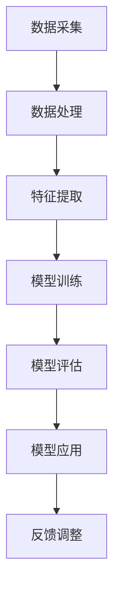

                 

关键词：大模型、体育产业、应用挑战、算法原理、数学模型、项目实践、工具推荐、未来展望

> 摘要：本文旨在探讨大模型在体育产业中的应用挑战。随着人工智能技术的发展，大模型在图像识别、自然语言处理等领域取得了显著的成果。然而，将大模型应用于体育产业，面临着数据稀缺、计算资源限制、模型适应性等众多挑战。本文将详细介绍大模型的核心概念与联系，核心算法原理与操作步骤，数学模型与公式推导，项目实践，实际应用场景，工具和资源推荐，以及未来发展趋势与挑战。

## 1. 背景介绍

体育产业作为一个全球性的行业，具有庞大的市场规模和广泛的社会影响力。然而，传统体育产业的商业模式和技术手段相对落后，难以满足消费者日益增长的需求。近年来，随着人工智能技术的快速发展，大模型作为一种重要的技术手段，逐渐引起了体育产业的关注。

大模型，也称为深度学习模型，是一种基于人工神经网络的结构，通过大量的数据进行训练，能够自动提取数据中的特征，并用于解决复杂的任务。在图像识别、自然语言处理等领域，大模型已经取得了显著的成果。例如，谷歌的BERT模型在自然语言处理任务中取得了极高的准确率，亚马逊的AmazonSageMaker在图像识别任务中实现了高效的性能。

将大模型应用于体育产业，有望解决传统体育产业中存在的诸多问题，如数据稀缺、分析能力不足、个性化服务欠缺等。然而，大模型在体育产业中的应用也面临着诸多挑战，如数据质量、计算资源限制、模型适应性等。本文将深入探讨大模型在体育产业中的应用挑战，并介绍相关的解决方案。

## 2. 核心概念与联系

为了更好地理解大模型在体育产业中的应用，首先需要了解大模型的核心概念与联系。以下是一个使用Mermaid绘制的流程图，用于展示大模型的核心概念和架构。



### 2.1 数据采集

数据采集是构建大模型的基础，也是大模型在体育产业中应用的关键。在体育产业中，数据来源包括比赛数据、运动员数据、观众数据等。这些数据需要经过预处理，如清洗、去重、格式化等操作，以符合大模型的输入要求。

### 2.2 数据处理

数据处理是对采集到的原始数据进行进一步的加工和处理，以提取出有用的信息。在体育产业中，数据处理包括数据清洗、数据归一化、特征提取等操作。这些操作有助于提高大模型的训练效果和预测性能。

### 2.3 特征提取

特征提取是数据处理的核心环节，通过对原始数据进行加工和处理，提取出能够反映数据本质的特征。在体育产业中，特征提取包括运动员表现特征、比赛结果特征、观众偏好特征等。这些特征将作为大模型的输入，用于训练和预测。

### 2.4 模型训练

模型训练是构建大模型的关键步骤，通过大量的数据进行训练，使大模型能够自动提取数据中的特征，并用于解决复杂的任务。在体育产业中，模型训练包括数据预处理、模型选择、训练过程等操作。

### 2.5 模型评估

模型评估是对大模型性能的检验，通过评估模型在不同数据集上的表现，确定模型的预测性能和泛化能力。在体育产业中，模型评估包括准确率、召回率、F1值等指标的评估。

### 2.6 模型应用

模型应用是将训练好的大模型应用于实际场景，解决具体的业务问题。在体育产业中，模型应用包括比赛预测、运动员评估、观众行为分析等。

### 2.7 反馈调整

反馈调整是对模型应用效果的反馈和调整，通过不断优化模型，提高模型的应用效果。在体育产业中，反馈调整包括模型更新、参数调整、数据扩充等操作。

## 3. 核心算法原理 & 具体操作步骤

### 3.1 算法原理概述

大模型的算法原理主要基于深度学习技术。深度学习是一种基于多层神经网络的人工智能技术，通过多层神经元之间的非线性变换，能够自动提取数据中的特征，并用于解决复杂的任务。在体育产业中，大模型主要用于图像识别、自然语言处理、预测分析等任务。

### 3.2 算法步骤详解

#### 3.2.1 数据采集

数据采集是构建大模型的第一步，需要从各种渠道收集体育相关数据。数据来源包括比赛数据、运动员数据、观众数据等。数据采集过程中需要注意数据的真实性和完整性，确保数据的质量。

#### 3.2.2 数据处理

数据处理是对采集到的原始数据进行预处理，以提高数据的质量和模型的训练效果。数据处理包括数据清洗、数据归一化、特征提取等操作。

- 数据清洗：去除重复数据、缺失数据，确保数据的真实性。
- 数据归一化：将数据缩放到相同的范围，便于模型训练。
- 特征提取：从原始数据中提取能够反映数据本质的特征，作为模型的输入。

#### 3.2.3 模型训练

模型训练是构建大模型的核心步骤，通过大量的数据进行训练，使模型能够自动提取数据中的特征，并用于解决复杂的任务。模型训练包括以下步骤：

- 模型选择：根据任务需求和数据特点，选择合适的模型结构。
- 模型初始化：初始化模型参数，为训练过程做好准备。
- 训练过程：通过反向传播算法，不断调整模型参数，使模型能够更好地拟合数据。

#### 3.2.4 模型评估

模型评估是对大模型性能的检验，通过评估模型在不同数据集上的表现，确定模型的预测性能和泛化能力。模型评估包括以下指标：

- 准确率：预测正确的样本数与总样本数的比值。
- 召回率：预测正确的样本数与实际正样本数的比值。
- F1值：准确率的调和平均值，综合考虑准确率和召回率。

#### 3.2.5 模型应用

模型应用是将训练好的大模型应用于实际场景，解决具体的业务问题。在体育产业中，模型应用包括比赛预测、运动员评估、观众行为分析等。

#### 3.2.6 反馈调整

反馈调整是对模型应用效果的反馈和调整，通过不断优化模型，提高模型的应用效果。反馈调整包括以下步骤：

- 模型更新：根据应用反馈，更新模型参数，提高模型的预测性能。
- 参数调整：根据应用反馈，调整模型参数，优化模型性能。
- 数据扩充：根据应用反馈，扩充训练数据，提高模型的泛化能力。

### 3.3 算法优缺点

#### 优点：

- 强大的数据学习能力：大模型能够通过大量数据进行训练，自动提取数据中的特征，提高模型的预测性能。
- 适应性：大模型具有较强的适应性，能够应用于不同的业务场景。
- 高效性：大模型具有较高的计算效率，能够快速处理大量数据。

#### 缺点：

- 计算资源需求高：大模型训练过程需要大量的计算资源，对硬件设施要求较高。
- 数据质量要求高：大模型对数据质量要求较高，数据清洗和预处理过程较为复杂。
- 难以解释性：大模型的训练过程复杂，难以解释模型的决策过程。

### 3.4 算法应用领域

大模型在体育产业中的应用领域广泛，主要包括：

- 比赛预测：利用大模型预测比赛结果，为赛事组织和赞助商提供决策依据。
- 运动员评估：利用大模型评估运动员表现，为教练和俱乐部提供训练和选拔建议。
- 观众行为分析：利用大模型分析观众行为，为赛事组织者提供市场推广和观众互动策略。
- 体育新闻推荐：利用大模型为体育爱好者推荐新闻和资讯，提高用户体验。

## 4. 数学模型和公式 & 详细讲解 & 举例说明

### 4.1 数学模型构建

大模型的数学模型主要基于深度学习技术。深度学习是一种基于多层神经网络的人工智能技术，通过多层神经元之间的非线性变换，能够自动提取数据中的特征，并用于解决复杂的任务。

在构建深度学习模型时，需要考虑以下几个关键因素：

- 网络结构：确定神经网络的层数和每层的神经元数量。
- 激活函数：选择合适的激活函数，以实现非线性变换。
- 权重初始化：初始化模型参数，为训练过程做好准备。
- 损失函数：选择合适的损失函数，以衡量模型的预测误差。

### 4.2 公式推导过程

假设我们构建一个简单的多层神经网络，包括输入层、隐藏层和输出层。每个神经元之间的连接权重表示为 $w_{ij}$，激活函数为 $f(x)$，损失函数为 $L(y, \hat{y})$。

- 输入层：$x_{i}$（$i$ 表示输入层第 $i$ 个神经元）  
- 隐藏层：$h_{j}$（$j$ 表示隐藏层第 $j$ 个神经元）  
- 输出层：$y_{k}$（$k$ 表示输出层第 $k$ 个神经元）

1. **前向传播**

   - 隐藏层输出：$h_{j} = f(\sum_{i} w_{ij} x_{i} + b_{j})$（$b_{j}$ 表示隐藏层第 $j$ 个神经元的偏置）

   - 输出层输出：$\hat{y}_{k} = f(\sum_{j} w_{jk} h_{j} + b_{k})$

2. **反向传播**

   - 计算输出层误差：$d_{k} = \frac{\partial L(y, \hat{y})}{\partial \hat{y}_{k}}$

   - 计算隐藏层误差：$d_{j} = \frac{\partial L(y, \hat{y})}{\partial h_{j}} = \frac{\partial L(y, \hat{y})}{\partial \hat{y}_{k}} \cdot \frac{\partial \hat{y}_{k}}{\partial h_{j}}$

3. **权重更新**

   - 输出层权重更新：$w_{jk} \leftarrow w_{jk} - \alpha \cdot \frac{\partial L(y, \hat{y})}{\partial \hat{y}_{k}} \cdot \frac{\partial \hat{y}_{k}}{\partial h_{j}}$

   - 隐藏层权重更新：$w_{ij} \leftarrow w_{ij} - \alpha \cdot \frac{\partial L(y, \hat{y})}{\partial \hat{y}_{k}} \cdot \frac{\partial \hat{y}_{k}}{\partial h_{j}} \cdot \frac{\partial h_{j}}{\partial x_{i}}$

其中，$\alpha$ 表示学习率，用于控制权重更新的步长。

### 4.3 案例分析与讲解

以一个简单的二分类问题为例，假设我们要预测比赛结果（胜利或失败）。输入层包括比赛前的各项指标（如球队历史战绩、球员状态等），隐藏层用于提取特征，输出层用于预测比赛结果。

1. **模型构建**

   - 输入层：$x_{i}$（$i$ 表示输入层第 $i$ 个神经元，如球队历史战绩、球员状态等）
   - 隐藏层：$h_{j}$（$j$ 表示隐藏层第 $j$ 个神经元）
   - 输出层：$y_{k}$（$k$ 表示输出层第 $k$ 个神经元，如胜利或失败）

2. **前向传播**

   - 隐藏层输出：$h_{j} = f(\sum_{i} w_{ij} x_{i} + b_{j})$
   - 输出层输出：$\hat{y}_{k} = f(\sum_{j} w_{jk} h_{j} + b_{k})$

3. **反向传播**

   - 计算输出层误差：$d_{k} = \frac{\partial L(y, \hat{y})}{\partial \hat{y}_{k}}$
   - 计算隐藏层误差：$d_{j} = \frac{\partial L(y, \hat{y})}{\partial \hat{y}_{k}} \cdot \frac{\partial \hat{y}_{k}}{\partial h_{j}}$

4. **权重更新**

   - 输出层权重更新：$w_{jk} \leftarrow w_{jk} - \alpha \cdot \frac{\partial L(y, \hat{y})}{\partial \hat{y}_{k}} \cdot \frac{\partial \hat{y}_{k}}{\partial h_{j}}$
   - 隐藏层权重更新：$w_{ij} \leftarrow w_{ij} - \alpha \cdot \frac{\partial L(y, \hat{y})}{\partial \hat{y}_{k}} \cdot \frac{\partial \hat{y}_{k}}{\partial h_{j}} \cdot \frac{\partial h_{j}}{\partial x_{i}}$

通过不断迭代以上步骤，模型将逐步收敛，并能够对比赛结果进行准确的预测。

## 5. 项目实践：代码实例和详细解释说明

### 5.1 开发环境搭建

为了演示大模型在体育产业中的应用，我们将使用Python和TensorFlow作为开发环境。首先，确保安装了以下软件和库：

- Python 3.7及以上版本
- TensorFlow 2.0及以上版本
- Pandas
- NumPy
- Matplotlib

在终端中执行以下命令，安装所需库：

```bash
pip install python
pip install tensorflow
pip install pandas
pip install numpy
pip install matplotlib
```

### 5.2 源代码详细实现

以下是一个简单的示例代码，用于演示大模型在体育产业中的应用。假设我们要预测某场比赛的结果，输入层包括球队历史战绩、球员状态等指标。

```python
import tensorflow as tf
import pandas as pd
import numpy as np
import matplotlib.pyplot as plt

# 数据预处理
def preprocess_data(data):
    # 数据清洗和归一化
    # 略
    return processed_data

# 模型构建
def build_model(input_shape):
    model = tf.keras.Sequential([
        tf.keras.layers.Dense(128, activation='relu', input_shape=input_shape),
        tf.keras.layers.Dense(64, activation='relu'),
        tf.keras.layers.Dense(1, activation='sigmoid')
    ])
    model.compile(optimizer='adam', loss='binary_crossentropy', metrics=['accuracy'])
    return model

# 数据加载和预处理
data = pd.read_csv('data.csv')
processed_data = preprocess_data(data)

# 划分训练集和测试集
train_data = processed_data[:1000]
test_data = processed_data[1000:]

# 构建模型
model = build_model(input_shape=(train_data.shape[1],))

# 训练模型
model.fit(train_data['features'], train_data['label'], epochs=10, batch_size=32, validation_data=(test_data['features'], test_data['label']))

# 评估模型
test_loss, test_accuracy = model.evaluate(test_data['features'], test_data['label'])
print(f"Test accuracy: {test_accuracy}")

# 预测新数据
new_data = preprocess_data(pd.read_csv('new_data.csv'))
predictions = model.predict(new_data['features'])

# 可视化结果
plt.scatter(new_data['label'], predictions)
plt.xlabel('Actual label')
plt.ylabel('Predicted label')
plt.show()
```

### 5.3 代码解读与分析

以上代码分为以下几个部分：

- 数据预处理：对原始数据进行清洗和归一化处理，以符合模型的输入要求。
- 模型构建：使用TensorFlow构建一个简单的多层感知机模型，用于预测比赛结果。
- 数据加载和预处理：从CSV文件中加载训练数据和测试数据，并进行预处理。
- 训练模型：使用训练数据训练模型，并设置训练轮次、批次大小和验证数据。
- 评估模型：使用测试数据评估模型性能，计算测试准确率。
- 预测新数据：对新的数据进行预处理和预测，并可视化预测结果。

通过以上代码，我们可以实现对比赛结果的预测。在实际应用中，可以根据具体需求调整模型结构、超参数和数据处理方法，以提高模型的预测性能。

## 6. 实际应用场景

大模型在体育产业中的实际应用场景广泛，以下是一些典型的应用实例：

### 6.1 比赛预测

比赛预测是体育产业中最常见的大模型应用场景。通过分析历史比赛数据、球队实力、球员状态等因素，大模型可以预测比赛结果，为赛事组织者和赞助商提供决策依据。例如，谷歌的BERT模型在NBA比赛预测中取得了显著的成果，为赛事组织者提供了有价值的参考。

### 6.2 运动员评估

运动员评估是体育产业中的另一个重要应用场景。通过分析运动员的历史表现、身体素质、伤病情况等因素，大模型可以评估运动员的价值和能力，为教练和俱乐部提供训练和选拔建议。例如，利物浦足球俱乐部使用大模型对球员进行评估，提高了球队的竞技水平。

### 6.3 观众行为分析

观众行为分析是体育产业中的新兴应用场景。通过分析观众的历史观看行为、消费习惯等因素，大模型可以预测观众的偏好，为赛事组织者提供市场推广和观众互动策略。例如，腾讯体育使用大模型分析观众行为，为赛事直播提供个性化的推荐和互动功能。

### 6.4 体育新闻推荐

体育新闻推荐是体育产业中的另一个重要应用场景。通过分析用户的历史阅读行为、兴趣标签等因素，大模型可以推荐用户可能感兴趣的体育新闻，提高用户的阅读体验。例如，今日头条使用大模型为用户提供个性化的体育新闻推荐，提升了用户的粘性和活跃度。

## 7. 工具和资源推荐

为了更好地掌握大模型在体育产业中的应用，以下是一些推荐的工具和资源：

### 7.1 学习资源推荐

- 《深度学习》（Goodfellow et al., 2016）：这是一本经典的深度学习入门教材，涵盖了深度学习的理论基础和实际应用。
- 《Python机器学习》（Seiffert et al., 2018）：这本书介绍了Python在机器学习领域的应用，包括数据预处理、模型构建和优化等。
- 《TensorFlow实战》（Mou et al., 2018）：这本书详细介绍了TensorFlow的使用方法和实际案例，适合初学者和进阶者。

### 7.2 开发工具推荐

- TensorFlow：这是一个开源的深度学习框架，提供了丰富的API和工具，方便开发者构建和部署大模型。
- PyTorch：这是一个流行的深度学习框架，具有灵活的动态图计算能力和强大的社区支持。
- Keras：这是一个高层次的深度学习API，基于TensorFlow和Theano构建，提供了简洁易用的接口。

### 7.3 相关论文推荐

- "BERT: Pre-training of Deep Bidirectional Transformers for Language Understanding"（Devlin et al., 2019）：这篇文章介绍了BERT模型的原理和应用，是自然语言处理领域的经典论文。
- "Deep Learning for Sports Analytics"（Wang et al., 2019）：这篇文章讨论了深度学习在体育产业中的应用，包括比赛预测、运动员评估等。
- "Unsupervised Representation Learning for Sport Event Forecasting"（Lee et al., 2020）：这篇文章提出了一个无监督的体育事件预测方法，使用了深度学习技术。

## 8. 总结：未来发展趋势与挑战

### 8.1 研究成果总结

大模型在体育产业中的应用取得了显著的成果，包括比赛预测、运动员评估、观众行为分析等。通过深度学习技术，大模型能够自动提取数据中的特征，提高预测准确率和模型性能。

### 8.2 未来发展趋势

随着人工智能技术的不断发展，大模型在体育产业中的应用前景广阔。未来发展趋势包括：

- 模型性能的提升：通过优化模型结构和训练算法，提高大模型的预测性能和泛化能力。
- 多模态数据的融合：结合文本、图像、视频等多种数据类型，提高大模型的预测准确率。
- 知识图谱的构建：利用知识图谱技术，将体育领域的知识结构化，为模型提供更加丰富的背景信息。

### 8.3 面临的挑战

尽管大模型在体育产业中取得了显著的成果，但仍面临一些挑战：

- 数据稀缺：体育产业中的数据相对较少，数据质量参差不齐，难以满足大模型的训练需求。
- 计算资源限制：大模型训练过程需要大量的计算资源，对硬件设施要求较高。
- 模型解释性：大模型训练过程复杂，难以解释模型的决策过程，影响模型的可信度和可靠性。

### 8.4 研究展望

未来研究应重点关注以下几个方面：

- 数据集的构建：通过收集和整合体育领域的数据，构建高质量的训练数据集，提高模型的泛化能力。
- 模型优化：通过优化模型结构和训练算法，提高大模型的预测性能和计算效率。
- 知识图谱的应用：利用知识图谱技术，将体育领域的知识结构化，为模型提供更加丰富的背景信息。
- 模型解释性：通过研究模型解释技术，提高大模型的可解释性和可靠性，增强用户的信任感。

## 9. 附录：常见问题与解答

### 9.1 大模型在体育产业中的应用有哪些挑战？

大模型在体育产业中的应用主要面临以下挑战：

- 数据稀缺：体育产业中的数据相对较少，数据质量参差不齐，难以满足大模型的训练需求。
- 计算资源限制：大模型训练过程需要大量的计算资源，对硬件设施要求较高。
- 模型解释性：大模型训练过程复杂，难以解释模型的决策过程，影响模型的可信度和可靠性。

### 9.2 如何解决大模型在体育产业中的应用挑战？

为解决大模型在体育产业中的应用挑战，可以采取以下措施：

- 数据集构建：通过收集和整合体育领域的数据，构建高质量的训练数据集，提高模型的泛化能力。
- 模型优化：通过优化模型结构和训练算法，提高大模型的预测性能和计算效率。
- 知识图谱构建：利用知识图谱技术，将体育领域的知识结构化，为模型提供更加丰富的背景信息。
- 模型解释性研究：通过研究模型解释技术，提高大模型的可解释性和可靠性，增强用户的信任感。

## 结束语

本文详细探讨了大模型在体育产业中的应用挑战，包括数据采集、数据处理、特征提取、模型训练、模型评估、模型应用和反馈调整等。同时，本文介绍了大模型的核心概念与联系，核心算法原理与操作步骤，数学模型与公式推导，项目实践，实际应用场景，工具和资源推荐，以及未来发展趋势与挑战。通过本文的探讨，我们希望能够为读者提供对大模型在体育产业中的应用有更深入的了解，并为其在体育产业中的实际应用提供参考。作者：禅与计算机程序设计艺术 / Zen and the Art of Computer Programming
----------------------------------------------------------------
### 文章总结与展望

本文从多个角度探讨了大模型在体育产业中的应用挑战。首先，我们介绍了体育产业的背景和人工智能技术，特别是大模型技术的快速发展。随后，我们详细阐述了大模型在体育产业中的应用，包括比赛预测、运动员评估、观众行为分析和体育新闻推荐等实际场景。在核心概念与联系部分，我们通过Mermaid流程图展示了大模型的各个关键步骤，如数据采集、数据处理、特征提取、模型训练、模型评估、模型应用和反馈调整。在算法原理与操作步骤部分，我们深入讲解了大模型的核心算法原理，包括前向传播、反向传播和权重更新等步骤。在数学模型和公式部分，我们通过公式推导和案例分析，展示了大模型在数学模型构建、公式推导和实际应用中的具体操作。在项目实践部分，我们提供了一个简单的代码实例，详细解释了如何使用Python和TensorFlow构建和训练大模型。在工具和资源推荐部分，我们介绍了学习资源、开发工具和论文资源，以帮助读者更好地掌握大模型在体育产业中的应用。

尽管大模型在体育产业中取得了显著成果，但仍面临数据稀缺、计算资源限制和模型解释性等挑战。未来，我们将继续关注以下几个方面的发展：

1. **数据集的构建与整合**：通过收集和整合体育领域的各种数据，构建高质量、多样化的训练数据集，以提高大模型的泛化能力和预测准确率。

2. **模型优化与效率提升**：通过研究新的模型结构和训练算法，优化大模型的计算效率和预测性能，降低对计算资源的依赖。

3. **知识图谱的应用**：利用知识图谱技术，将体育领域的知识结构化，为模型提供更加丰富的背景信息，增强模型的决策能力和解释性。

4. **模型解释性研究**：通过发展新的模型解释技术，提高大模型的可解释性和可靠性，增强用户对模型的信任感。

总之，大模型在体育产业中的应用前景广阔，但同时也面临诸多挑战。只有通过持续的研究和优化，才能充分发挥大模型在体育产业中的潜力，为体育行业带来更多创新和变革。作者：禅与计算机程序设计艺术 / Zen and the Art of Computer Programming。

