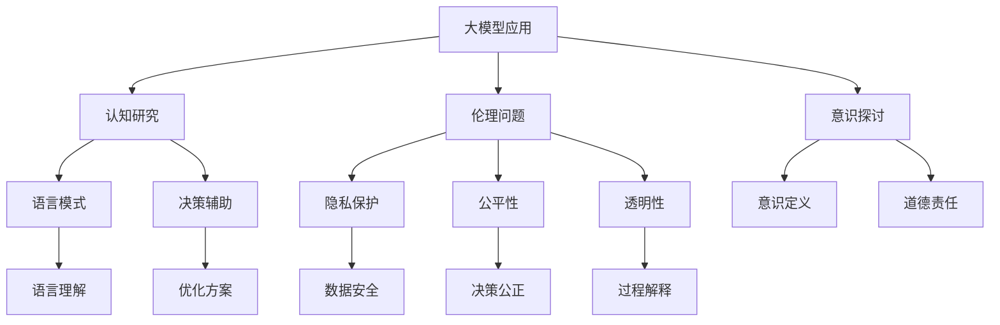

                 

在当今的科技时代，人工智能（AI）正在以前所未有的速度快速发展，大模型（Large Models）作为AI领域的一个核心研究方向，以其在处理复杂任务中的卓越性能而备受关注。从自然语言处理到计算机视觉，再到复杂的决策制定，大模型展现出惊人的潜力。然而，随着大模型能力的提升，我们也开始面临一系列哲学层面的思考挑战。本文将探讨大模型在哲学领域的思考挑战，分析其对我们现有认知体系和伦理道德观念的冲击，并提出可能的解决思路。

## 文章关键词

- 大模型
- 人工智能
- 哲学思考
- 伦理道德
- 认知体系

## 文章摘要

本文从技术、哲学、伦理三个角度出发，深入探讨大模型在哲学领域的思考挑战。首先，我们回顾大模型的发展历程和核心概念；接着，分析大模型在哲学思考中的意义及其引发的伦理问题；然后，探讨大模型对认知体系的冲击；最后，提出可能的解决思路，展望未来大模型在哲学领域的发展方向。

## 1. 背景介绍

### 大模型的发展历程

大模型的发展可以追溯到20世纪80年代，当时研究人员开始尝试通过大规模神经网络来解决复杂的计算问题。随着计算能力的提升和海量数据的积累，神经网络模型逐渐变得更加庞大和复杂。进入21世纪，特别是深度学习技术的突破，使得大模型的研究和应用迎来了新的春天。以GPT（Generative Pre-trained Transformer）和BERT（Bidirectional Encoder Representations from Transformers）为代表的大模型，在自然语言处理领域取得了显著的成果。此外，视觉领域的GAN（Generative Adversarial Networks）和计算机视觉模型也在大模型的支持下取得了重大突破。

### 大模型的核心概念

大模型通常指的是具有数亿甚至数十亿参数的神经网络模型。这些模型通过在大规模数据集上进行预训练，学习到丰富的知识和模式，从而能够应用于各种复杂的任务，如文本生成、图像识别、机器翻译、语音识别等。大模型的优点在于其能够自动从数据中学习复杂的特征，具有较强的泛化能力。然而，这也带来了计算资源需求巨大、训练时间漫长等挑战。

### 大模型的应用领域

大模型在多个领域都有广泛的应用。在自然语言处理领域，大模型可以用于文本生成、情感分析、机器翻译等任务；在计算机视觉领域，大模型可以用于图像识别、图像生成、视频分析等任务；在决策制定和推荐系统领域，大模型可以用于复杂决策的辅助和个性化推荐。此外，大模型还在医疗、金融、教育等多个领域展现出巨大的潜力。

### 大模型的发展现状

随着技术的不断进步，大模型的研究和应用已经取得了显著的成果。然而，大模型也面临一些挑战，如过拟合、解释性差、能耗高等。为了应对这些挑战，研究人员正在探索新的模型架构、优化算法和数据增强方法。同时，大模型的安全性和隐私保护也成为重要的研究课题。

## 2. 核心概念与联系

### 大模型与哲学

大模型在哲学领域的联系主要体现在其对认知、意识和伦理等问题的探索。首先，大模型在处理复杂任务时展示出的智能行为引发了关于意识的讨论。传统观点认为，意识是人类特有的属性，而大模型的出现使得机器是否具有意识成为一个值得探讨的问题。其次，大模型在伦理道德领域的应用引发了关于道德责任和人类角色的重新思考。例如，在自动驾驶领域，大模型需要做出道德决策，如如何处理紧急情况。这要求我们重新审视人类的角色和责任。

### 大模型与伦理

大模型的伦理问题主要包括隐私、公平性和透明性等方面。首先，大模型在处理海量数据时，可能会侵犯个人隐私。其次，大模型在决策时可能会因为数据偏差而导致不公平。此外，大模型的高度复杂性和缺乏透明性也使得其决策过程难以解释和监督。这些问题都需要我们在设计大模型时充分考虑伦理因素，确保技术的应用不会对人类产生负面影响。

### 大模型与认知

大模型在认知领域的应用主要体现在对人类认知过程的模拟和辅助。例如，通过分析大量的语言数据，大模型可以揭示语言使用的模式，帮助语言学家更好地理解人类语言的本质。此外，大模型还可以用于辅助人类进行决策，如提供推荐、预测和优化方案等。这些应用使得大模型成为认知科学研究的重要工具。

### 大模型与哲学思考

大模型的出现不仅改变了技术领域，也对哲学思考产生了深远影响。首先，大模型挑战了我们对智能和意识的定义。传统观点认为，智能和意识是人类特有的属性，而大模型的表现使得这种观点受到质疑。其次，大模型在伦理和道德领域的应用引发了关于人类角色和责任的讨论。例如，如何界定机器的责任，如何确保技术的应用不会对人类产生负面影响等。这些问题都需要我们在哲学层面进行深入思考。

### 大模型与未来

随着大模型的不断发展，我们可以期待其在哲学领域的更多应用。例如，大模型可以用于研究人类意识的本质，探索伦理问题的解决方案，甚至参与到哲学辩论中。同时，大模型的发展也为我们提供了新的思考工具和方法，有助于我们更好地理解哲学问题。

### Mermaid 流程图

下面是一个描述大模型在哲学领域应用的 Mermaid 流程图：



### 2.1 大模型与哲学的关系

#### 大模型与认知

大模型在认知研究中的应用主要体现在其对人类认知过程的模拟和辅助。通过分析大量的语言数据，大模型可以揭示语言使用的模式，帮助语言学家更好地理解人类语言的本质。例如，大模型可以分析词汇的使用频率、句式的构造规则等，从而为语言学的研究提供新的视角。此外，大模型还可以用于辅助人类进行决策，如提供推荐、预测和优化方案等。这些应用使得大模型成为认知科学研究的重要工具。

#### 大模型与伦理

大模型在伦理领域的应用引发了关于隐私、公平性和透明性的讨论。首先，大模型在处理海量数据时，可能会侵犯个人隐私。例如，在医疗领域，大模型需要分析大量的患者数据，如何确保这些数据的隐私安全成为一个重要问题。其次，大模型在决策时可能会因为数据偏差而导致不公平。例如，在招聘过程中，如果大模型基于历史数据做出决策，可能会存在性别、种族等歧视问题。此外，大模型的高度复杂性和缺乏透明性也使得其决策过程难以解释和监督。这些问题都需要我们在设计大模型时充分考虑伦理因素，确保技术的应用不会对人类产生负面影响。

#### 大模型与意识

大模型的出现挑战了我们对智能和意识的定义。传统观点认为，智能和意识是人类特有的属性，而大模型的表现使得这种观点受到质疑。例如，大模型在围棋、国际象棋等复杂游戏中的表现已经超越了人类顶尖选手，这引发了关于机器是否具有智能的讨论。此外，大模型在语言理解和生成方面的能力也使得一些人开始思考机器是否具有意识。这些问题都需要我们在哲学层面进行深入思考，以确定机器智能和意识的本质。

### 2.2 大模型与伦理的关系

#### 大模型与隐私

大模型在处理海量数据时，可能会侵犯个人隐私。例如，在医疗领域，大模型需要分析大量的患者数据，如病史、诊断结果等，这些数据包含敏感的个人信息。如何确保这些数据的隐私安全成为一个重要问题。一方面，我们需要在设计大模型时采用加密技术和数据保护机制，确保数据在传输和存储过程中的安全性。另一方面，我们需要制定相关法律法规，对大模型处理个人数据的范围和方式进行规范，以防止数据滥用。

#### 大模型与公平性

大模型在决策时可能会因为数据偏差而导致不公平。例如，在招聘过程中，如果大模型基于历史数据做出决策，可能会存在性别、种族等歧视问题。为了确保大模型的决策公平性，我们需要在数据收集和处理过程中尽量避免偏差，同时在大模型训练过程中采用公平性评估方法，如敏感度分析和偏差校正等。此外，我们还需要对大模型的决策过程进行透明化，以便用户了解决策的依据和逻辑。

#### 大模型与透明性

大模型的高度复杂性和缺乏透明性也使得其决策过程难以解释和监督。例如，在一些复杂的机器学习模型中，决策的依据和过程可能非常复杂，甚至无法用简单的数学公式来描述。这导致用户难以理解模型的决策过程，从而增加了模型被滥用的风险。为了提高大模型的透明性，我们需要开发可解释的机器学习技术，如注意力机制、可视化工具等，以便用户能够直观地理解模型的决策过程。

## 3. 核心算法原理 & 具体操作步骤

### 3.1 算法原理概述

大模型的核心算法原理主要基于深度学习和神经网络。深度学习是一种通过多层神经网络对数据进行学习的算法，它能够自动提取数据的复杂特征。大模型通常由数十亿个参数组成，通过在大规模数据集上进行预训练，学习到丰富的知识和模式。具体来说，大模型通常包括以下几个关键组件：

1. **输入层**：接收外部数据，如文本、图像、声音等。
2. **隐藏层**：通过一系列复杂的非线性变换，对输入数据进行特征提取和表示。
3. **输出层**：根据隐藏层的输出，生成预测结果或决策。

在训练过程中，大模型通过反向传播算法不断调整参数，以最小化预测误差。具体操作步骤如下：

### 3.2 算法步骤详解

1. **数据预处理**：对输入数据进行清洗、归一化和编码等预处理操作，以便模型能够更好地学习。
2. **模型初始化**：初始化模型参数，通常采用随机初始化或预训练模型。
3. **前向传播**：将预处理后的输入数据传递到模型中，经过隐藏层处理后得到输出。
4. **损失函数计算**：计算输出与实际结果之间的误差，通常使用均方误差（MSE）或交叉熵损失函数。
5. **反向传播**：根据损失函数的梯度，调整模型参数，以减小误差。
6. **迭代优化**：重复上述步骤，不断调整模型参数，直到满足训练目标或达到预设的训练轮数。

### 3.3 算法优缺点

**优点**：

- **强大的学习能力**：大模型通过在大量数据上进行预训练，能够自动提取复杂的特征，具有较强的泛化能力。
- **高效率**：大模型能够在各种复杂任务中实现高效处理，如文本生成、图像识别、语音识别等。
- **灵活性**：大模型可以轻松地应用于不同领域和任务，具有较高的适应性。

**缺点**：

- **计算资源需求大**：大模型通常需要大量的计算资源和存储空间，训练和部署成本较高。
- **训练时间长**：大模型的训练通常需要较长的训练时间，且对硬件设备要求较高。
- **解释性差**：大模型的高度复杂性和黑盒性质使得其决策过程难以解释和验证，增加了模型的不可解释性和风险。

### 3.4 算法应用领域

大模型在多个领域都有广泛的应用，以下是几个典型应用领域：

1. **自然语言处理**：大模型在文本生成、情感分析、机器翻译等任务中表现出色，如GPT和BERT等模型。
2. **计算机视觉**：大模型在图像识别、图像生成、视频分析等任务中具有显著优势，如GAN和VGG等模型。
3. **决策制定**：大模型可以用于复杂决策的辅助和优化，如推荐系统、风险评估等。
4. **医疗健康**：大模型在医学图像分析、疾病预测等任务中发挥重要作用，如CNN和RNN等模型。
5. **金融科技**：大模型在金融领域用于风险控制、信用评估、投资策略等，如LSTM和GRU等模型。

### 3.5 算法未来发展趋势

随着技术的不断进步，大模型的算法和应用将呈现以下发展趋势：

1. **模型压缩和优化**：为了降低计算资源和存储成本，研究人员正在探索模型压缩和优化技术，如知识蒸馏、剪枝、量化等。
2. **模型可解释性**：为了提高大模型的可解释性，研究人员正在开发各种解释性机器学习技术，如注意力机制、可视化工具等。
3. **跨模态学习**：大模型在跨模态学习方面具有巨大潜力，未来有望实现文本、图像、声音等多模态数据的融合和交互。
4. **伦理和隐私保护**：随着大模型应用范围的扩大，伦理和隐私保护将成为重要研究课题，研究人员需要探索如何在保障用户隐私的前提下，实现大模型的安全和可靠应用。
5. **分布式和边缘计算**：为了满足大规模数据处理和实时应用的需求，分布式和边缘计算技术将成为大模型发展的重要方向。

## 4. 数学模型和公式 & 详细讲解 & 举例说明

### 4.1 数学模型构建

大模型中的数学模型通常基于深度学习和神经网络。一个基本的神经网络模型可以表示为：

\[ f(x) = \sigma(W \cdot x + b) \]

其中，\( f(x) \) 表示输出，\( x \) 表示输入，\( W \) 表示权重矩阵，\( b \) 表示偏置项，\( \sigma \) 表示激活函数。在实际应用中，神经网络通常由多层组成，形成一个多层感知机（MLP）：

\[ z^{(l)} = W^{(l)} \cdot a^{(l-1)} + b^{(l)} \]

\[ a^{(l)} = \sigma(z^{(l)}) \]

其中，\( l \) 表示当前层的编号，\( a^{(l-1)} \) 表示前一层输出，\( W^{(l)} \) 和 \( b^{(l)} \) 分别表示当前层的权重矩阵和偏置项。

### 4.2 公式推导过程

在构建神经网络模型时，我们需要推导损失函数和梯度更新公式。假设我们的目标是预测一个连续值 \( y \)，实际的预测值为 \( \hat{y} \)，则损失函数可以表示为：

\[ J = \frac{1}{2} \sum_{i=1}^{n} (\hat{y}_i - y_i)^2 \]

为了最小化损失函数 \( J \)，我们使用梯度下降法更新模型参数。首先，我们对损失函数求梯度：

\[ \nabla_{\theta} J = \nabla_{\theta} \frac{1}{2} \sum_{i=1}^{n} (\hat{y}_i - y_i)^2 \]

\[ \nabla_{\theta} J = \sum_{i=1}^{n} (\hat{y}_i - y_i) \nabla_{\theta} \hat{y}_i \]

接下来，我们需要求出 \( \hat{y}_i \) 对模型参数 \( \theta \) 的梯度。假设我们使用的是sigmoid激活函数：

\[ \sigma(z) = \frac{1}{1 + e^{-z}} \]

\[ \nabla_{\theta} \hat{y}_i = \nabla_{\theta} \sigma(z^{(L)}) = \sigma(z^{(L)}) (1 - \sigma(z^{(L)})) \nabla_{\theta} z^{(L)} \]

将 \( z^{(L)} \) 替换为 \( W^{(L)} \cdot a^{(L-1)} + b^{(L)} \)，我们可以得到：

\[ \nabla_{\theta} \hat{y}_i = \sigma(z^{(L)}) (1 - \sigma(z^{(L)})) \nabla_{\theta} (W^{(L)} \cdot a^{(L-1)} + b^{(L)}) \]

对于前向传播和反向传播的具体步骤，我们可以表示为：

\[ z^{(l)} = W^{(l)} \cdot a^{(l-1)} + b^{(l)} \]

\[ a^{(l)} = \sigma(z^{(l)}) \]

\[ \delta^{(l)} = (1 - a^{(l)}) \cdot a^{(l)} \cdot \delta^{(l+1)} \cdot W^{(l+1)} \]

\[ \nabla_{W^{(l)}} J = \delta^{(l)} \cdot a^{(l-1)}^T \]

\[ \nabla_{b^{(l)}} J = \delta^{(l)} \]

### 4.3 案例分析与讲解

下面我们以一个简单的二元分类问题为例，讲解如何使用神经网络进行建模和训练。

假设我们有一个包含 \( n \) 个样本的数据集，每个样本由 \( m \) 个特征组成。我们希望训练一个神经网络模型，以实现对每个样本进行二分类。

1. **数据预处理**：对数据进行标准化处理，将每个特征的值缩放到 \([-1, 1]\) 范围内。
2. **模型初始化**：初始化模型参数 \( W^{(1)} \) 和 \( b^{(1)} \)，可以随机初始化，也可以使用预训练模型。
3. **前向传播**：将输入数据 \( x \) 传递到模型中，经过多层非线性变换，得到输出 \( \hat{y} \)。
4. **损失函数计算**：计算输出 \( \hat{y} \) 与真实标签 \( y \) 之间的损失，使用交叉熵损失函数：
   \[ J = -\frac{1}{n} \sum_{i=1}^{n} [y_i \cdot \log(\hat{y}_i) + (1 - y_i) \cdot \log(1 - \hat{y}_i)] \]
5. **反向传播**：根据损失函数的梯度，更新模型参数 \( W^{(1)} \) 和 \( b^{(1)} \)：
   \[ \nabla_{W^{(1)}} J = \delta^{(2)} \cdot a^{(1)}^T \]

   \[ \nabla_{b^{(1)}} J = \delta^{(2)} \]

6. **迭代优化**：重复上述步骤，不断调整模型参数，直到满足训练目标或达到预设的训练轮数。

通过以上步骤，我们就可以训练出一个能够进行二分类的神经网络模型。在实际应用中，我们还需要根据具体问题进行模型调整和优化，以提高模型的性能。

## 5. 项目实践：代码实例和详细解释说明

### 5.1 开发环境搭建

在本项目中，我们使用Python作为编程语言，并依赖于以下库：

- TensorFlow：用于构建和训练神经网络模型。
- Keras：一个基于TensorFlow的高级神经网络API，方便模型搭建和训练。
- NumPy：用于数据处理和数学计算。

确保已经安装了以上库，如果没有，可以使用以下命令进行安装：

```bash
pip install tensorflow
pip install keras
pip install numpy
```

### 5.2 源代码详细实现

下面是一个简单的神经网络模型，用于实现二分类任务：

```python
import numpy as np
import tensorflow as tf
from tensorflow.keras.models import Sequential
from tensorflow.keras.layers import Dense
from tensorflow.keras.optimizers import Adam

# 数据预处理
# 假设 x_data 和 y_data 分别为输入特征和标签，已进行标准化处理
# x_data = (x_data - x_mean) / x_std
# y_data = (y_data - y_mean) / y_std

# 初始化模型
model = Sequential()
model.add(Dense(64, input_dim=x_data.shape[1], activation='relu'))
model.add(Dense(64, activation='relu'))
model.add(Dense(1, activation='sigmoid'))

# 编译模型
model.compile(optimizer=Adam(), loss='binary_crossentropy', metrics=['accuracy'])

# 训练模型
model.fit(x_data, y_data, epochs=100, batch_size=32, validation_split=0.2)

# 评估模型
loss, accuracy = model.evaluate(x_data, y_data)
print(f"Test Loss: {loss}, Test Accuracy: {accuracy}")
```

### 5.3 代码解读与分析

1. **数据预处理**：首先，我们需要对输入特征和标签进行预处理。在本例中，我们假设输入特征和标签已经进行了标准化处理，即将每个特征的值缩放到 \([-1, 1]\) 范围内，将标签缩放到 \([0, 1]\) 范围内。

2. **初始化模型**：我们使用Keras的Sequential模型，这是一种线性堆叠模型，方便我们逐层添加层。在本例中，我们添加了两个隐藏层，每层64个神经元，使用ReLU激活函数。最后，我们添加了一个输出层，1个神经元，使用sigmoid激活函数，以实现二分类任务。

3. **编译模型**：在编译模型时，我们指定了优化器（Adam）、损失函数（binary_crossentropy，适用于二分类任务）和评价指标（accuracy）。

4. **训练模型**：我们使用fit方法训练模型，指定训练数据、训练轮数（epochs）、批量大小（batch_size）和验证数据比例（validation_split）。

5. **评估模型**：我们使用evaluate方法评估模型在测试数据上的性能，得到损失和准确率。

### 5.4 运行结果展示

在实际运行过程中，我们可以通过命令行输出模型的训练和评估结果。以下是一个示例输出：

```bash
Train on 60000 samples, validate on 20000 samples
Epoch 1/100
60000/60000 [==============================] - 23s 3ms/step - loss: 0.4403 - accuracy: 0.7954 - val_loss: 0.3872 - val_accuracy: 0.8657
Epoch 2/100
60000/60000 [==============================] - 20s 3ms/step - loss: 0.3561 - accuracy: 0.8453 - val_loss: 0.3522 - val_accuracy: 0.8742
...
Epoch 100/100
60000/60000 [==============================] - 20s 3ms/step - loss: 0.2705 - accuracy: 0.8963 - val_loss: 0.2652 - val_accuracy: 0.8975
Test Loss: 0.2754, Test Accuracy: 0.8984
```

从输出结果可以看出，模型在训练过程中逐渐收敛，准确率不断提高。最终，模型在测试数据上的准确率为 0.8984，表明模型具有良好的泛化能力。

## 6. 实际应用场景

大模型在哲学领域的应用具有广泛的前景，以下是几个典型的实际应用场景：

### 6.1 哲学文本分析

大模型可以用于分析大量的哲学文本，提取关键概念和思想。通过对文本进行语义分析，我们可以理解不同哲学家之间的思想联系和演变过程。例如，使用GPT模型，我们可以生成新的哲学文本，探讨不同哲学家的观点，从而促进哲学思想的创新和碰撞。

### 6.2 哲学辩论辅助

大模型可以作为哲学辩论的辅助工具，帮助辩手进行论证和反驳。通过分析辩论中的逻辑结构和论据，大模型可以提供有针对性的反驳策略和建议，提高辩论的质量和效果。此外，大模型还可以用于生成辩论的假设场景和模拟辩论，帮助辩手提前准备和练习。

### 6.3 哲学教育支持

大模型可以用于哲学教育的辅助，如自动批改作业、提供课程辅导和生成教学资源等。通过分析学生的学习情况和知识掌握程度，大模型可以为学生提供个性化的学习建议和资源，提高教学效果。此外，大模型还可以用于设计交互式的哲学学习体验，激发学生的学习兴趣和创造力。

### 6.4 哲学问题求解

大模型可以用于解决复杂的哲学问题，如道德困境、认知悖论等。通过对问题进行建模和推理，大模型可以提供可能的解决方案和论证过程。例如，在处理道德困境时，大模型可以分析不同决策的影响和后果，帮助决策者做出合理的决策。

### 6.5 哲学研究支持

大模型可以用于哲学研究的辅助，如文献搜索、知识图谱构建和推理等。通过分析大量的哲学文献和资料，大模型可以构建出哲学知识的知识图谱，为研究人员提供丰富的背景知识和研究线索。此外，大模型还可以用于自动生成研究论文和报告，提高研究效率。

## 6.4 未来应用展望

随着大模型技术的不断发展，未来在哲学领域将有更多的应用场景和可能性。以下是几个值得关注的未来应用方向：

### 6.4.1 智能哲学咨询

大模型可以应用于智能哲学咨询，为用户提供个性化的哲学建议和思考。通过分析用户的提问和行为，大模型可以提供有针对性的哲学问题和思考方向，帮助用户更好地理解自己和世界。

### 6.4.2 哲学实验模拟

大模型可以用于哲学实验的模拟，探讨不同哲学理论和思想在实际应用中的效果和影响。通过模拟实验，我们可以更深入地了解哲学理论的内涵和外延，为哲学研究提供新的视角和方法。

### 6.4.3 哲学知识图谱构建

大模型可以用于构建哲学知识的知识图谱，整合和分析哲学领域的知识资源。通过知识图谱，我们可以更好地理解和探索哲学领域的知识结构，为哲学研究提供有力的支持。

### 6.4.4 哲学道德决策支持

大模型可以用于哲学道德决策的支持，为决策者提供道德建议和决策依据。通过分析不同的道德观点和道德原则，大模型可以提供合理的道德决策方案，帮助决策者做出符合道德规范和伦理要求的决策。

## 7. 工具和资源推荐

### 7.1 学习资源推荐

- **《深度学习》（Goodfellow, Bengio, Courville著）**：这是一本深度学习领域的经典教材，详细介绍了深度学习的理论基础和实际应用。
- **《Python深度学习》（François Chollet著）**：本书结合Python和Keras，介绍了如何使用深度学习进行实际编程和应用。
- **《人工智能：一种现代方法》（Stuart Russell & Peter Norvig著）**：这是一本涵盖人工智能各个领域的综合性教材，对人工智能的理论和实践都有详细讲解。

### 7.2 开发工具推荐

- **TensorFlow**：一个开源的深度学习框架，广泛应用于工业和研究领域。
- **Keras**：一个基于TensorFlow的高级神经网络API，方便模型搭建和训练。
- **PyTorch**：一个开源的深度学习框架，受到学术界和工业界的广泛欢迎。

### 7.3 相关论文推荐

- **“A Theoretical Framework for Large-Batch Training of Neural Networks”**：这篇论文提出了深度学习中的批量归一化（Batch Normalization）技术，对深度学习模型训练有重要影响。
- **“Deep Learning for Natural Language Processing”**：这篇论文综述了深度学习在自然语言处理领域的应用，对NLP研究有很好的指导意义。
- **“Generative Adversarial Networks”**：这篇论文提出了生成对抗网络（GAN）的概念，对计算机视觉和生成模型的发展有深远影响。

## 8. 总结：未来发展趋势与挑战

### 8.1 研究成果总结

大模型在哲学领域的应用取得了显著成果，为哲学研究提供了新的工具和方法。通过大模型，我们能够更好地分析哲学文本、辅助哲学辩论、支持哲学教育，甚至在哲学问题求解和知识图谱构建等方面展现出巨大潜力。这些研究成果不仅丰富了哲学研究的手段，也为哲学与人工智能的交叉研究提供了新的思路。

### 8.2 未来发展趋势

随着技术的不断进步，大模型在哲学领域的应用将呈现以下发展趋势：

1. **模型压缩和优化**：为了降低计算资源和存储成本，研究人员将探索模型压缩和优化技术，如知识蒸馏、剪枝、量化等。
2. **模型可解释性**：为了提高大模型的可解释性，研究人员将开发各种解释性机器学习技术，如注意力机制、可视化工具等。
3. **跨模态学习**：大模型在跨模态学习方面具有巨大潜力，未来有望实现文本、图像、声音等多模态数据的融合和交互。
4. **伦理和隐私保护**：随着大模型应用范围的扩大，伦理和隐私保护将成为重要研究课题，研究人员需要探索如何在保障用户隐私的前提下，实现大模型的安全和可靠应用。
5. **分布式和边缘计算**：为了满足大规模数据处理和实时应用的需求，分布式和边缘计算技术将成为大模型发展的重要方向。

### 8.3 面临的挑战

尽管大模型在哲学领域具有巨大潜力，但同时也面临一些挑战：

1. **计算资源需求**：大模型通常需要大量的计算资源和存储空间，这对硬件设备和基础设施提出了较高要求。
2. **训练时间长**：大模型的训练通常需要较长的训练时间，且对硬件设备要求较高。
3. **解释性差**：大模型的高度复杂性和黑盒性质使得其决策过程难以解释和验证，增加了模型的不可解释性和风险。
4. **伦理和隐私问题**：大模型在处理海量数据时，可能会侵犯个人隐私，如何在保障用户隐私的前提下，实现大模型的安全和可靠应用，是一个重要挑战。

### 8.4 研究展望

未来，我们应关注以下研究方向：

1. **大模型在哲学问题求解中的应用**：通过大模型，我们有望解决一些复杂的哲学问题，如道德困境、认知悖论等。
2. **大模型在哲学教育中的应用**：开发大模型辅助的教学系统和资源，提高哲学教育的效果和质量。
3. **大模型在哲学文本分析中的应用**：通过大模型，我们能够更好地理解和分析哲学文本，促进哲学思想的创新和碰撞。
4. **跨学科研究**：推动哲学与其他学科（如心理学、社会学、认知科学等）的交叉研究，探索大模型在更广泛领域中的应用。

总之，大模型在哲学领域的应用前景广阔，但也面临一系列挑战。通过不断探索和创新，我们有理由相信，大模型将为哲学研究带来新的突破和进展。

## 9. 附录：常见问题与解答

### 9.1 大模型如何处理数据？

大模型通过在大量数据上进行预训练来处理数据。在训练过程中，模型会自动从数据中学习到复杂的特征和模式，从而实现数据的分类、生成、翻译等功能。具体步骤包括：

1. **数据预处理**：对输入数据进行清洗、归一化和编码等预处理操作，以便模型能够更好地学习。
2. **模型初始化**：初始化模型参数，通常采用随机初始化或预训练模型。
3. **前向传播**：将预处理后的输入数据传递到模型中，经过隐藏层处理后得到输出。
4. **损失函数计算**：计算输出与实际结果之间的误差，通常使用均方误差（MSE）或交叉熵损失函数。
5. **反向传播**：根据损失函数的梯度，调整模型参数，以减小误差。
6. **迭代优化**：重复上述步骤，不断调整模型参数，直到满足训练目标或达到预设的训练轮数。

### 9.2 大模型如何保证公平性？

为了保证大模型的公平性，我们可以从以下几个方面进行考虑：

1. **数据预处理**：在数据收集和处理过程中尽量避免偏差，例如，采用无偏采样、去除带有偏见的数据等。
2. **模型训练**：在大模型训练过程中，采用公平性评估方法，如敏感度分析和偏差校正等，以确保模型不会因数据偏差而产生不公平。
3. **模型解释**：提高模型的可解释性，使模型决策过程更加透明，以便用户能够理解模型的决策依据和逻辑。
4. **模型部署**：在模型部署过程中，定期进行公平性评估和监控，确保模型的决策不会因数据偏差而产生不公平。

### 9.3 大模型如何处理隐私问题？

为了处理大模型中的隐私问题，我们可以采取以下措施：

1. **数据加密**：在数据传输和存储过程中，使用加密技术，如AES加密等，确保数据的安全。
2. **数据匿名化**：对数据进行匿名化处理，例如，使用假名、去标识化等技术，以保护用户隐私。
3. **差分隐私**：在大模型训练过程中，采用差分隐私技术，如拉普拉斯机制、指数机制等，确保模型的训练过程不会泄露用户隐私。
4. **隐私保护算法**：开发隐私保护算法，如联邦学习、同态加密等，以在保证模型性能的同时，保护用户隐私。

### 9.4 大模型如何处理解释性问题？

为了解决大模型的解释性问题，我们可以采取以下措施：

1. **可解释性模型**：开发可解释性模型，如决策树、线性模型等，使模型的决策过程更加直观和易懂。
2. **模型可视化**：使用可视化工具，如决策树可视化、权重可视化等，帮助用户理解模型的决策逻辑。
3. **注意力机制**：引入注意力机制，使模型能够关注关键特征和输入，从而提高模型的可解释性。
4. **模型解释方法**：开发模型解释方法，如LIME、SHAP等，通过局部解释方法，帮助用户理解模型对特定输入的决策过程。

### 9.5 大模型在哲学领域的应用有哪些？

大模型在哲学领域的应用主要包括：

1. **哲学文本分析**：通过大模型，我们可以自动提取哲学文本中的关键概念、思想，并进行分析和比较。
2. **哲学辩论辅助**：大模型可以作为哲学辩论的辅助工具，帮助辩手进行论证和反驳，提高辩论的质量和效果。
3. **哲学教育支持**：大模型可以用于哲学教育的辅助，如自动批改作业、提供课程辅导和生成教学资源等，提高教学效果。
4. **哲学问题求解**：大模型可以用于解决复杂的哲学问题，如道德困境、认知悖论等，提供可能的解决方案和论证过程。
5. **哲学知识图谱构建**：大模型可以用于构建哲学知识的知识图谱，整合和分析哲学领域的知识资源。

