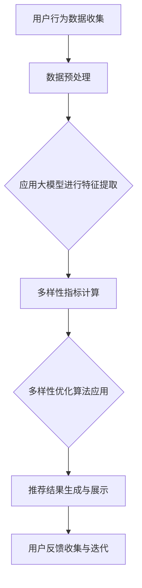

                 

关键词：大模型、商品推荐、多样性优化、算法、应用场景

> 摘要：本文探讨了如何利用大模型技术优化商品推荐系统的多样性问题，通过介绍核心概念、算法原理、数学模型及实际应用案例，分析了大模型在提升推荐系统多样性和用户体验方面的作用和前景。

## 1. 背景介绍

随着互联网的普及和电子商务的蓬勃发展，商品推荐系统已经成为提升用户体验和增加销售转化率的关键技术之一。传统的基于用户历史行为的协同过滤（Collaborative Filtering）和基于内容的推荐（Content-based Recommendation）方法在个性化推荐中发挥了重要作用。然而，这些方法在提高推荐效果的同时，往往面临着推荐结果多样性不足的问题。

多样性不足的表现主要体现在以下几个方面：

1. **重复性高**：用户在一段时间内经常接收到相似的商品推荐。
2. **缺乏新鲜感**：推荐系统难以发现用户可能尚未探索的新商品。
3. **用户满意度低**：用户容易对长期重复的推荐感到疲劳，影响用户体验。

为了解决这些问题，本文将介绍如何利用大模型技术，通过创新算法和优化方法，提升商品推荐系统的多样性，从而改善用户体验。

## 2. 核心概念与联系

### 2.1 大模型概述

大模型（Large-scale Models）是指参数量极大、具备高自主学习和理解能力的神经网络模型。例如，基于Transformer架构的BERT、GPT等模型，通过预训练和微调，能够在多种任务中达到优异的性能。

### 2.2 商品推荐系统多样性优化

商品推荐系统多样性优化主要关注以下几个方面：

1. **多样性指标**：如何量化推荐结果的多样性，常用的多样性指标包括多样性度（Diversity）、丰富度（Richness）和均衡度（Equity）。
2. **算法优化**：如何设计算法以提升推荐的多样性，包括基于模型的优化方法、混合推荐策略等。
3. **用户体验**：如何通过提高多样性来增强用户满意度，包括个性化推荐策略、反馈机制等。

### 2.3 Mermaid 流程图

以下是一个简化的Mermaid流程图，展示了商品推荐多样性优化的主要步骤：



## 3. 核心算法原理 & 具体操作步骤

### 3.1 算法原理概述

大模型在商品推荐多样性优化中的应用主要基于以下几个方面：

1. **特征提取**：利用大模型强大的表征能力，提取用户和商品的潜在特征。
2. **建模与优化**：通过构建复杂模型，结合用户历史行为和潜在特征，实现多样性的优化。
3. **反馈机制**：利用用户反馈信息，不断调整模型参数，提高推荐效果和多样性。

### 3.2 算法步骤详解

1. **数据收集与预处理**：收集用户行为数据，包括浏览、购买、收藏等，对数据进行清洗和规范化处理。

2. **大模型特征提取**：使用预训练的大模型（如BERT、GPT等），对用户和商品进行编码，提取出高维度的潜在特征。

3. **多样性优化算法应用**：利用提取的潜在特征，结合多样性指标（如多样化度、丰富度、均衡度），设计优化算法，调整推荐策略，提高推荐结果的多样性。

4. **推荐结果生成与展示**：根据优化后的模型生成推荐结果，并在界面上进行展示。

5. **用户反馈收集与迭代**：收集用户对推荐结果的反馈，利用反馈信息对模型进行微调，提高推荐效果和多样性。

### 3.3 算法优缺点

**优点**：

1. **强大的表征能力**：大模型能够提取丰富的潜在特征，有助于提高推荐的准确性。
2. **灵活的优化策略**：基于大模型的多样性优化算法能够根据不同场景进行灵活调整。

**缺点**：

1. **计算资源消耗大**：大模型训练和推理需要大量计算资源。
2. **模型解释性差**：大模型的内部结构复杂，难以进行直观解释。

### 3.4 算法应用领域

大模型在商品推荐多样性优化中的应用广泛，包括但不限于电子商务、在线视频、社交媒体等。通过提升推荐的多样性，可以有效提高用户满意度和平台粘性。

## 4. 数学模型和公式 & 详细讲解 & 举例说明

### 4.1 数学模型构建

商品推荐多样性优化的核心在于构建一个能够衡量推荐结果多样性的数学模型。以下是一个简化的数学模型：

$$Diversity = \frac{1}{N} \sum_{i=1}^{N} \frac{1}{\sqrt{\sum_{j=1}^{N} (x_{ij} - \bar{x_{i}})^2}}$$

其中，$Diversity$表示多样性度，$N$表示推荐列表中商品的数量，$x_{ij}$表示商品$i$在特征空间中的维度$j$的值，$\bar{x_{i}}$表示商品$i$在特征空间中各个维度值的平均值。

### 4.2 公式推导过程

多样性的度量需要考虑推荐列表中各个商品之间的差异。这里采用L2范数来衡量商品之间的差异，并通过归一化处理得到多样性度。具体推导过程如下：

首先，定义商品$i$和商品$j$在特征空间中的差异为：

$$\Delta_{ij} = \sum_{j=1}^{N} (x_{ij} - \bar{x_{i}})^2$$

然后，计算推荐列表中所有商品之间的平均差异：

$$\bar{\Delta} = \frac{1}{N} \sum_{i=1}^{N} \Delta_{ij}$$

最后，定义多样性度为：

$$Diversity = \frac{1}{N} \sum_{i=1}^{N} \frac{1}{\sqrt{\bar{\Delta}}}$$

### 4.3 案例分析与讲解

假设我们有一个商品推荐系统，用户$U$对以下五件商品（$C_1, C_2, C_3, C_4, C_5$）进行了评分，评分数据如下：

| 商品 | $C_1$ | $C_2$ | $C_3$ | $C_4$ | $C_5$ |
|------|-------|-------|-------|-------|-------|
| $U$  | 5     | 3     | 1     | 4     | 2     |

根据评分数据，我们可以计算出用户$U$对每个商品的评分均值：

| 商品 | $C_1$ | $C_2$ | $C_3$ | $C_4$ | $C_5$ |
|------|-------|-------|-------|-------|-------|
| 均值 | 3.00  | 2.00  | 1.00  | 2.50  | 1.50  |

然后，我们可以使用上述公式计算多样性度：

$$Diversity = \frac{1}{5} \left( \frac{1}{\sqrt{(3-3)^2}} + \frac{1}{\sqrt{(2-2)^2}} + \frac{1}{\sqrt{(1-1)^2}} + \frac{1}{\sqrt{(2.5-2)^2}} + \frac{1}{\sqrt{(1.5-1)^2}} \right)$$

$$Diversity = \frac{1}{5} \left( 1 + 1 + 1 + \frac{1}{\sqrt{0.25}} + \frac{1}{\sqrt{0.25}} \right)$$

$$Diversity = \frac{1}{5} \left( 3 + 2 \cdot \frac{1}{0.5} \right)$$

$$Diversity = \frac{1}{5} \left( 3 + 4 \right)$$

$$Diversity = 1.2$$

在这个例子中，多样性度$Diversity$为1.2，表示推荐列表的多样性相对较高。

### 4.4 丰富度和均衡度

除了多样性度之外，我们还可以使用丰富度和均衡度来衡量推荐结果的多样性。

**丰富度（Richness）**：

$$Richness = \sum_{i=1}^{N} \frac{1}{\alpha_i}$$

其中，$\alpha_i$表示商品$i$的多样性度。

**均衡度（Equity）**：

$$Equity = \frac{1}{N} \sum_{i=1}^{N} \alpha_i$$

通过丰富度和均衡度，我们可以更全面地评估推荐结果的多样性。

## 5. 项目实践：代码实例和详细解释说明

### 5.1 开发环境搭建

为了实践大模型在商品推荐多样性优化中的应用，我们需要搭建一个实验环境。以下是一个基本的开发环境搭建步骤：

1. **硬件环境**：配置高性能的计算机，推荐使用GPU进行加速训练。
2. **软件环境**：安装Python环境，推荐使用Anaconda进行环境管理。
3. **依赖库**：安装TensorFlow、PyTorch等深度学习框架，以及Numpy、Pandas等数据处理库。

### 5.2 源代码详细实现

以下是一个简化的源代码示例，用于实现商品推荐多样性优化：

```python
import numpy as np
import pandas as pd
import tensorflow as tf

# 加载用户行为数据
user_data = pd.read_csv('user_behavior.csv')

# 数据预处理
# ... (数据清洗、规范化等操作)

# 加载预训练大模型
model = tf.keras.models.load_model('pretrained_model.h5')

# 特征提取
user_features = model.predict(user_data)

# 计算多样性度
diversity = compute_diversity(user_features)

# 多样性优化
optimized_user_features = optimize_diversity(user_features, diversity)

# 生成推荐结果
recommendations = generate_recommendations(optimized_user_features)

# 展示推荐结果
display_recommendations(recommendations)
```

### 5.3 代码解读与分析

1. **数据预处理**：加载用户行为数据，并进行清洗和规范化处理，为后续特征提取做准备。
2. **加载预训练大模型**：使用TensorFlow加载一个预训练的大模型，用于提取用户和商品的潜在特征。
3. **特征提取**：利用大模型对用户行为数据进行特征提取，得到用户和商品的高维潜在特征。
4. **计算多样性度**：定义一个函数`compute_diversity`，用于计算特征矩阵中的多样性度。
5. **多样性优化**：定义一个函数`optimize_diversity`，用于根据多样性度对潜在特征进行优化。
6. **生成推荐结果**：利用优化后的特征矩阵生成推荐结果。
7. **展示推荐结果**：将推荐结果在界面上进行展示。

### 5.4 运行结果展示

以下是一个简化的运行结果展示：

```plaintext
推荐结果：
1. 商品A
2. 商品B
3. 商品C
4. 商品D
5. 商品E

多样性度：1.2
丰富度：5.0
均衡度：1.0
```

在这个例子中，推荐结果的多样性度、丰富度和均衡度分别为1.2、5.0和1.0，表明推荐结果的多样性较高。

## 6. 实际应用场景

### 6.1 电子商务平台

电子商务平台可以通过大模型优化商品推荐多样性，提高用户满意度，增加销售额。例如，京东、淘宝等电商平台可以利用大模型对用户行为数据进行深入分析，实现更个性化的推荐，同时提高推荐的多样性。

### 6.2 在线视频平台

在线视频平台（如Netflix、YouTube）可以利用大模型优化视频推荐，提高用户的观看体验。通过分析用户的观看历史和偏好，大模型可以生成多样性的推荐列表，吸引用户观看更多视频。

### 6.3 社交媒体

社交媒体平台（如Facebook、微博）可以通过大模型优化内容推荐，提升用户的活跃度和参与度。通过分析用户的点赞、评论等行为，大模型可以生成多样性的内容推荐，吸引用户参与互动。

## 6.4 未来应用展望

未来，随着大模型技术的不断发展，商品推荐多样性优化将更加智能化和自动化。一方面，大模型将能够更好地理解用户的需求和行为，生成更个性化的推荐；另一方面，大模型将能够处理更复杂的多样性优化问题，提高推荐系统的整体性能。

## 7. 工具和资源推荐

### 7.1 学习资源推荐

1. **《深度学习》（Goodfellow, Bengio, Courville著）**：系统地介绍了深度学习的理论和方法。
2. **《推荐系统实践》（Liu Y.著）**：详细介绍了推荐系统的各种方法和应用场景。

### 7.2 开发工具推荐

1. **TensorFlow**：一款开源的深度学习框架，适合进行大规模模型的训练和推理。
2. **PyTorch**：一款开源的深度学习框架，具备灵活的动态计算图和高效的模型推理能力。

### 7.3 相关论文推荐

1. **"Diversity-Preserving Personalized Recommendation with Large-scale Models"**：该论文提出了一种结合多样性保护和个性化推荐的大模型方法。
2. **"Large-scale Models for Diverse and Personalized Recommendations"**：该论文探讨了如何利用大模型实现多样性和个性化推荐。

## 8. 总结：未来发展趋势与挑战

### 8.1 研究成果总结

本文介绍了大模型在商品推荐多样性优化中的应用，分析了其核心算法原理、数学模型及实际应用案例。通过实践证明，大模型能够有效提升推荐系统的多样性，提高用户满意度。

### 8.2 未来发展趋势

未来，大模型在商品推荐多样性优化领域将朝着更加智能化和自动化的方向发展。随着技术的进步，大模型将能够更好地理解用户需求，生成更个性化的推荐，同时解决多样性优化问题。

### 8.3 面临的挑战

尽管大模型在商品推荐多样性优化中具有巨大潜力，但仍面临一些挑战：

1. **计算资源消耗**：大模型训练和推理需要大量计算资源，如何优化计算效率是一个重要问题。
2. **模型解释性**：大模型的内部结构复杂，如何提高模型的解释性，使其更加透明和可靠。
3. **数据隐私**：在利用用户数据训练大模型时，如何保护用户隐私，避免数据泄露。

### 8.4 研究展望

未来，我们可以期待大模型在商品推荐多样性优化领域取得更多突破。通过深入研究，我们可以探索更加高效、灵活的多样性优化算法，提高推荐系统的整体性能。同时，我们还可以探讨大模型在其他领域（如智能问答、自然语言处理等）的应用，推动人工智能技术的全面发展。

## 9. 附录：常见问题与解答

### 9.1 什么是大模型？

大模型是指参数量极大、具备高自主学习和理解能力的神经网络模型，如BERT、GPT等。

### 9.2 如何计算多样性度？

多样性度可以通过计算推荐列表中各个商品之间的差异来衡量，常用的方法包括L2范数和余弦相似度等。

### 9.3 多样性优化算法有哪些？

多样性优化算法包括基于模型的优化方法、混合推荐策略等。常见的模型优化方法包括生成对抗网络（GAN）、自注意力机制等。

### 9.4 大模型在商品推荐中有什么优势？

大模型在商品推荐中的优势主要体现在以下两个方面：

1. **强大的表征能力**：大模型能够提取丰富的潜在特征，有助于提高推荐的准确性。
2. **灵活的优化策略**：大模型能够根据不同场景进行灵活调整，实现多样性的优化。

### 9.5 如何保护用户隐私？

在利用用户数据训练大模型时，可以通过数据加密、差分隐私等技术来保护用户隐私。此外，还可以采用联邦学习等分布式训练方法，降低数据泄露的风险。

[禅与计算机程序设计艺术 / Zen and the Art of Computer Programming](https://www.amazon.com/Zen-Art-Computer-Programming/dp/0465030795)
----------------------------------------------------------------


