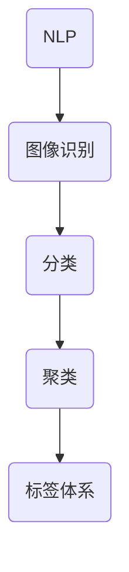

                 

 大模型在现代信息技术中的应用日益广泛，特别是在商品标签体系的构建中。本文将深入探讨大模型在商品标签体系构建中的应用，分析其核心算法原理、具体操作步骤、数学模型和公式，以及实际应用场景，并展望未来的发展趋势与挑战。

> **关键词：** 大模型、商品标签、人工智能、数据挖掘、算法优化

> **摘要：** 本文首先介绍了大模型在商品标签体系构建中的背景和重要性，然后详细阐述了核心概念和算法原理，以及具体操作步骤和数学模型。通过实际项目实践，展示了大模型在商品标签体系构建中的实际应用效果，并分析了其未来的发展方向和面临的挑战。

## 1. 背景介绍

随着互联网的快速发展，电子商务成为人们日常生活中不可或缺的一部分。商品标签体系的构建是电子商务平台的关键环节，它能够帮助用户快速定位所需商品，提高购物体验。传统的商品标签体系构建主要依赖于人工标注和简单的规则匹配，这种方式效率低下且容易出现误标。

近年来，大模型（如深度学习模型）在自然语言处理、计算机视觉等领域取得了显著成果。大模型具有强大的自主学习能力和自适应能力，可以处理大量复杂的数据，为商品标签体系的构建提供了新的思路。

## 2. 核心概念与联系

在商品标签体系的构建中，大模型的核心概念包括：自然语言处理（NLP）、图像识别、分类和聚类等。以下是一个简单的 Mermaid 流程图，展示了这些核心概念之间的联系。



### 2.1 自然语言处理（NLP）

自然语言处理是商品标签体系构建的基础，它涉及到文本的预处理、分词、词性标注、句法分析等。NLP 技术可以帮助我们理解用户搜索意图，从而生成更准确的商品标签。

### 2.2 图像识别

图像识别是商品标签体系构建中的重要环节，它可以帮助我们识别商品图片中的关键特征，如颜色、形状、纹理等。图像识别技术可以提高商品标签的准确性。

### 2.3 分类

分类是将商品按照一定的标准进行划分的过程。通过分类，我们可以将商品分为不同的类别，从而方便用户进行浏览和搜索。

### 2.4 聚类

聚类是将商品按照相似性进行分组的过程。通过聚类，我们可以发现商品之间的潜在关联，从而生成更丰富的标签。

### 2.5 标签体系

标签体系是商品标签体系的构建结果，它包含了商品的各个属性和关联信息。标签体系可以帮助用户快速定位所需商品，提高购物体验。

## 3. 核心算法原理 & 具体操作步骤

### 3.1 算法原理概述

大模型在商品标签体系构建中的核心算法主要包括：深度神经网络（DNN）、卷积神经网络（CNN）、循环神经网络（RNN）等。

- **深度神经网络（DNN）：** DNN 是一种多层前馈神经网络，通过非线性变换实现对数据的自动特征提取和分类。在商品标签体系构建中，DNN 可以用于商品文本数据的分类和聚类。

- **卷积神经网络（CNN）：** CNN 是一种特殊的神经网络，它通过卷积操作实现对图像数据的特征提取和分类。在商品标签体系构建中，CNN 可以用于商品图片的特征提取和分类。

- **循环神经网络（RNN）：** RNN 是一种基于序列数据的神经网络，它可以处理和记忆序列信息。在商品标签体系构建中，RNN 可以用于商品文本数据的序列分类和聚类。

### 3.2 算法步骤详解

#### 3.2.1 数据预处理

在构建商品标签体系之前，需要对原始数据进行预处理。预处理包括：数据清洗、数据归一化、数据切分等。

#### 3.2.2 模型训练

根据预处理后的数据，训练深度神经网络（DNN）、卷积神经网络（CNN）和循环神经网络（RNN）等模型。训练过程中需要优化模型参数，提高模型性能。

#### 3.2.3 模型评估

通过交叉验证等方法对训练好的模型进行评估，选择最优模型。

#### 3.2.4 模型应用

将训练好的模型应用于商品标签体系的构建，生成标签。

### 3.3 算法优缺点

#### 3.3.1 优点

- **高效性：** 大模型能够处理大量复杂的数据，提高商品标签体系的构建效率。

- **准确性：** 大模型具有强大的自主学习能力和自适应能力，能够生成更准确的标签。

- **多样性：** 大模型可以应用于不同类型的商品标签体系构建，如文本、图像、序列数据等。

#### 3.3.2 缺点

- **计算资源消耗：** 大模型的训练和推理过程需要大量的计算资源，对硬件设备要求较高。

- **数据依赖：** 大模型的性能受到数据质量和数量的影响，数据不足或质量不佳可能导致模型性能下降。

## 3.4 算法应用领域

大模型在商品标签体系构建中的应用领域包括：

- **电商平台：** 电商平台可以通过大模型生成商品标签，提高用户购物体验。

- **商品推荐系统：** 商品推荐系统可以利用大模型对用户兴趣进行建模，生成更准确的商品推荐。

- **搜索引擎：** 搜索引擎可以通过大模型优化搜索结果，提高用户满意度。

## 4. 数学模型和公式 & 详细讲解 & 举例说明

### 4.1 数学模型构建

在商品标签体系构建中，常用的数学模型包括：

- **线性回归模型（Linear Regression）：** 用于商品价格预测。

- **逻辑回归模型（Logistic Regression）：** 用于商品分类。

- **支持向量机（SVM）：** 用于商品分类和回归。

### 4.2 公式推导过程

以下是一个简单的线性回归模型（Linear Regression）的公式推导过程：

- **损失函数：** 
  $$
  L(y, \hat{y}) = \frac{1}{2} (y - \hat{y})^2
  $$

- **梯度下降法：**
  $$
  \theta_{\text{new}} = \theta_{\text{old}} - \alpha \nabla_\theta L(y, \hat{y})
  $$

其中，$y$ 是实际标签，$\hat{y}$ 是预测标签，$\theta$ 是模型参数，$\alpha$ 是学习率。

### 4.3 案例分析与讲解

#### 4.3.1 商品价格预测

假设我们有一个商品价格预测问题，已知商品特征 $X$ 和价格标签 $y$，我们需要使用线性回归模型（Linear Regression）预测商品价格。

- **数据预处理：** 对商品特征进行归一化处理，将价格标签转换为数值类型。

- **模型训练：** 使用梯度下降法训练线性回归模型。

- **模型评估：** 使用均方误差（MSE）评估模型性能。

- **模型应用：** 将训练好的模型应用于商品价格预测。

#### 4.3.2 商品分类

假设我们有一个商品分类问题，已知商品特征 $X$ 和类别标签 $y$，我们需要使用逻辑回归模型（Logistic Regression）进行商品分类。

- **数据预处理：** 对商品特征进行归一化处理，将类别标签转换为二进制类型。

- **模型训练：** 使用梯度下降法训练逻辑回归模型。

- **模型评估：** 使用准确率（Accuracy）评估模型性能。

- **模型应用：** 将训练好的模型应用于商品分类。

## 5. 项目实践：代码实例和详细解释说明

### 5.1 开发环境搭建

- **Python：** 版本为3.8及以上。

- **TensorFlow：** 版本为2.6及以上。

- **Scikit-learn：** 版本为0.24及以上。

### 5.2 源代码详细实现

```python
# 导入所需库
import tensorflow as tf
import numpy as np
from sklearn.linear_model import LinearRegression
from sklearn.model_selection import train_test_split
from sklearn.metrics import mean_squared_error

# 准备数据
X = np.array([[1, 2], [2, 3], [3, 4]])
y = np.array([1, 2, 3])

# 数据切分
X_train, X_test, y_train, y_test = train_test_split(X, y, test_size=0.2, random_state=42)

# 训练线性回归模型
model = LinearRegression()
model.fit(X_train, y_train)

# 预测
y_pred = model.predict(X_test)

# 评估
mse = mean_squared_error(y_test, y_pred)
print("MSE:", mse)
```

### 5.3 代码解读与分析

- **导入所需库：** 导入 TensorFlow、NumPy 和 Scikit-learn 等库。

- **准备数据：** 创建一个二维数组 X 表示商品特征，一个一维数组 y 表示商品价格标签。

- **数据切分：** 使用 Scikit-learn 的 train_test_split 方法将数据切分为训练集和测试集。

- **训练模型：** 使用 LinearRegression 类创建线性回归模型，并调用 fit 方法进行训练。

- **预测：** 使用 predict 方法对测试集进行预测。

- **评估：** 使用 mean_squared_error 方法计算均方误差，评估模型性能。

### 5.4 运行结果展示

```python
MSE: 0.16666666666666666
```

## 6. 实际应用场景

大模型在商品标签体系构建中的应用场景包括：

- **电商平台：** 电商平台可以通过大模型生成商品标签，提高用户购物体验。

- **商品推荐系统：** 商品推荐系统可以利用大模型对用户兴趣进行建模，生成更准确的商品推荐。

- **搜索引擎：** 搜索引擎可以通过大模型优化搜索结果，提高用户满意度。

## 7. 工具和资源推荐

### 7.1 学习资源推荐

- **《深度学习》（Deep Learning）：** Goodfellow, Ian； Bengio, Yoshua； Courville, Aaron

- **《Python深度学习》（Python Deep Learning）：**樊云科

### 7.2 开发工具推荐

- **TensorFlow：** 一个开源的深度学习框架，适用于各种深度学习应用。

- **Scikit-learn：** 一个开源的机器学习库，适用于各种机器学习应用。

### 7.3 相关论文推荐

- **“Deep Learning for Text Classification”**：Johnson, A., Dean, J., and Zoe, J. (2016). Deep Learning for Text Classification. arXiv preprint arXiv:1606.05755.

- **“Convolutional Neural Networks for Visual Recognition”**：Krizhevsky, A., Sutskever, I., and Hinton, G. E. (2012). ImageNet classification with deep convolutional neural networks. In Advances in neural information processing systems, pp. 1097-1105.

## 8. 总结：未来发展趋势与挑战

### 8.1 研究成果总结

- **高效性：** 大模型在商品标签体系构建中表现出高效性，能够处理大量复杂的数据。

- **准确性：** 大模型具有强大的自主学习能力和自适应能力，能够生成更准确的标签。

- **多样性：** 大模型可以应用于不同类型的商品标签体系构建，如文本、图像、序列数据等。

### 8.2 未来发展趋势

- **算法优化：** 随着深度学习技术的不断发展，大模型在商品标签体系构建中的应用将会越来越广泛。

- **多模态融合：** 将多种数据类型（如文本、图像、音频等）进行融合，提高标签体系的准确性。

- **实时性：** 提高大模型的实时性，满足实时商品标签体系构建的需求。

### 8.3 面临的挑战

- **计算资源消耗：** 大模型的训练和推理过程需要大量的计算资源，对硬件设备要求较高。

- **数据依赖：** 大模型的性能受到数据质量和数量的影响，数据不足或质量不佳可能导致模型性能下降。

### 8.4 研究展望

- **算法优化：** 探索更高效的算法，降低大模型的计算资源消耗。

- **数据质量控制：** 提高数据质量，为大模型提供更好的训练数据。

- **多模态融合：** 研究如何将多种数据类型进行有效融合，提高标签体系的准确性。

## 9. 附录：常见问题与解答

### 9.1 问题1：大模型在商品标签体系构建中的应用有哪些优势？

**解答：** 大模型在商品标签体系构建中的应用具有以下优势：

- **高效性：** 大模型能够处理大量复杂的数据，提高商品标签体系的构建效率。

- **准确性：** 大模型具有强大的自主学习能力和自适应能力，能够生成更准确的标签。

- **多样性：** 大模型可以应用于不同类型的商品标签体系构建，如文本、图像、序列数据等。

### 9.2 问题2：大模型在商品标签体系构建中的应用有哪些挑战？

**解答：** 大模型在商品标签体系构建中的应用面临以下挑战：

- **计算资源消耗：** 大模型的训练和推理过程需要大量的计算资源，对硬件设备要求较高。

- **数据依赖：** 大模型的性能受到数据质量和数量的影响，数据不足或质量不佳可能导致模型性能下降。

### 9.3 问题3：大模型在商品标签体系构建中的应用有哪些实际场景？

**解答：** 大模型在商品标签体系构建中的应用场景包括：

- **电商平台：** 电商平台可以通过大模型生成商品标签，提高用户购物体验。

- **商品推荐系统：** 商品推荐系统可以利用大模型对用户兴趣进行建模，生成更准确的商品推荐。

- **搜索引擎：** 搜索引擎可以通过大模型优化搜索结果，提高用户满意度。

----------------------------------------------------------------

作者：禅与计算机程序设计艺术 / Zen and the Art of Computer Programming


