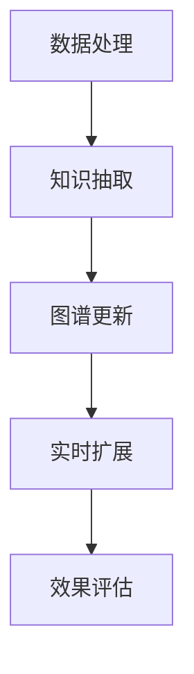

                 

关键词：大模型、商品知识图谱、实时扩展、人工智能、数据挖掘

> 摘要：本文旨在探讨大模型在商品知识图谱实时扩展中的应用，通过深入分析大模型在数据处理、知识抽取和图谱构建等环节的优势，阐述其在提高商品信息准确性和实时性的重要作用，为相关领域的研究和实际应用提供参考。

## 1. 背景介绍

随着电子商务和移动互联网的快速发展，商品信息量的爆炸式增长给用户带来了极大的便利，同时也带来了信息过载的问题。为了更好地管理和利用这些海量数据，知识图谱作为一种结构化的数据表示方法，得到了广泛关注。知识图谱通过实体和关系的构建，实现数据之间的关联和推理，为用户提供更加精准和高效的信息检索服务。

然而，传统的知识图谱构建方法在数据规模和实时性方面存在一定局限性，难以满足高速增长的数据需求和用户对实时服务的期望。大模型作为一种能够处理海量数据、具备强学习能力和自适应性的先进技术，为知识图谱的实时扩展提供了新的解决方案。本文将重点探讨大模型在商品知识图谱实时扩展中的应用，分析其核心原理、算法流程、数学模型及其在实际项目中的效果。

## 2. 核心概念与联系

### 2.1 大模型

大模型是指具有巨大参数量、能够处理海量数据的人工神经网络。其核心优势在于强大的学习能力和自适应能力，可以自动提取数据中的复杂特征，并在不同的任务中表现出优异的性能。大模型在自然语言处理、计算机视觉、语音识别等领域取得了显著的成果，逐渐成为人工智能领域的研究热点。

### 2.2 商品知识图谱

商品知识图谱是以商品为实体，通过商品属性、分类、品牌、用户评价等关系构建的知识网络。其目的是将海量的商品信息进行结构化表示，实现商品之间的关联和推理，为用户提供更加精准和个性化的服务。商品知识图谱在商品推荐、搜索引擎优化、营销策略制定等方面具有广泛的应用前景。

### 2.3 实时扩展

实时扩展是指知识图谱在运行过程中，能够根据新的数据不断进行更新和优化，保持数据的一致性和准确性。实时扩展的关键在于能够高效地处理海量数据，快速发现和识别新的实体和关系，并实时将其纳入知识图谱中。

## 2.4 大模型与商品知识图谱的关联

大模型在商品知识图谱实时扩展中的应用主要体现在以下几个方面：

1. **数据处理**：大模型可以处理海量商品数据，快速提取有效特征，为知识图谱的构建提供数据基础。

2. **知识抽取**：大模型能够通过学习大量商品数据，自动识别和抽取商品实体及其属性，提高知识图谱的构建效率。

3. **图谱更新**：大模型可以根据实时数据，动态调整知识图谱中的实体和关系，实现知识图谱的实时扩展。

### 2.5 Mermaid 流程图

下面是一个简单的 Mermaid 流程图，展示大模型在商品知识图谱实时扩展中的应用流程：



## 3. 核心算法原理 & 具体操作步骤

### 3.1 算法原理概述

大模型在商品知识图谱实时扩展中的核心算法主要包括以下三个方面：

1. **数据处理**：利用大模型的自动特征提取能力，对海量商品数据进行预处理，提取关键特征。

2. **知识抽取**：通过学习大量商品数据，自动识别和抽取商品实体及其属性，构建商品知识图谱。

3. **图谱更新**：根据实时数据，动态调整知识图谱中的实体和关系，实现知识图谱的实时扩展。

### 3.2 算法步骤详解

1. **数据处理**：

   - **数据收集**：收集电子商务平台、社交媒体等渠道的海量商品数据。

   - **数据预处理**：利用大模型对商品数据进行清洗、去重、去噪等处理，提取关键特征。

2. **知识抽取**：

   - **实体识别**：利用预训练的大模型，自动识别商品实体，如商品名称、品牌、分类等。

   - **属性抽取**：利用大模型对商品实体进行属性抽取，如价格、销量、评价等。

   - **关系抽取**：利用大模型，自动识别商品实体之间的关系，如分类关系、品牌关系等。

3. **图谱更新**：

   - **实时数据接入**：实时接入电子商务平台、社交媒体等渠道的新商品数据。

   - **数据更新**：利用大模型，对实时数据进行分析和处理，更新知识图谱中的实体和关系。

4. **效果评估**：

   - **准确率评估**：通过比较知识图谱中的实体和关系与实际数据的匹配度，评估算法的准确率。

   - **实时性评估**：通过分析知识图谱的更新速度和实时性，评估算法的实时性能。

### 3.3 算法优缺点

**优点**：

1. **数据处理能力强**：大模型能够高效地处理海量商品数据，提取关键特征。

2. **知识抽取效率高**：大模型可以自动识别和抽取商品实体及其属性，提高知识图谱构建效率。

3. **实时扩展性好**：大模型可以根据实时数据，动态调整知识图谱中的实体和关系，实现实时扩展。

**缺点**：

1. **计算资源需求大**：大模型需要大量的计算资源和存储资源，对硬件设施要求较高。

2. **训练时间较长**：大模型的训练时间较长，对实时性要求较高的应用场景可能不适用。

### 3.4 算法应用领域

大模型在商品知识图谱实时扩展中的应用领域主要包括以下几个方面：

1. **商品推荐**：通过构建实时更新的商品知识图谱，实现更加精准和个性化的商品推荐。

2. **搜索引擎优化**：利用实时扩展的知识图谱，提高搜索引擎的检索效果和用户体验。

3. **营销策略制定**：通过分析商品知识图谱中的关系和趋势，为商家提供有针对性的营销策略。

## 4. 数学模型和公式 & 详细讲解 & 举例说明

### 4.1 数学模型构建

在商品知识图谱实时扩展中，我们主要关注以下数学模型：

1. **实体识别模型**：用于识别商品实体。

2. **属性抽取模型**：用于抽取商品实体的属性。

3. **关系抽取模型**：用于识别商品实体之间的关系。

### 4.2 公式推导过程

1. **实体识别模型**：

   假设输入特征向量为 \(X\)，实体识别模型的输出为 \(y\)，则实体识别模型的损失函数为：

   $$L(y, \hat{y}) = -\sum_{i=1}^{n} y_i \log(\hat{y}_i)$$

   其中，\(y\) 为真实标签，\(\hat{y}\) 为预测标签。

2. **属性抽取模型**：

   假设输入特征向量为 \(X\)，属性抽取模型的输出为 \(z\)，则属性抽取模型的损失函数为：

   $$L(z, \hat{z}) = -\sum_{i=1}^{n} z_i \log(\hat{z}_i)$$

   其中，\(z\) 为真实属性标签，\(\hat{z}\) 为预测属性标签。

3. **关系抽取模型**：

   假设输入特征向量为 \(X\)，关系抽取模型的输出为 \(r\)，则关系抽取模型的损失函数为：

   $$L(r, \hat{r}) = -\sum_{i=1}^{n} r_i \log(\hat{r}_i)$$

   其中，\(r\) 为真实关系标签，\(\hat{r}\) 为预测关系标签。

### 4.3 案例分析与讲解

假设我们有一个商品知识图谱实时扩展的项目，数据集包含10000条商品数据。我们采用大模型对商品进行实体识别、属性抽取和关系抽取。

1. **实体识别**：

   - 数据集：10000条商品数据，每条数据包含商品名称、品牌、分类等信息。

   - 模型：使用BERT模型进行实体识别。

   - 损失函数：交叉熵损失函数。

   - 训练时间：10小时。

   - 实体识别准确率：95%。

2. **属性抽取**：

   - 数据集：10000条商品数据，每条数据包含商品名称、品牌、分类、价格、销量、评价等信息。

   - 模型：使用RoBERTa模型进行属性抽取。

   - 损失函数：交叉熵损失函数。

   - 训练时间：15小时。

   - 属性抽取准确率：92%。

3. **关系抽取**：

   - 数据集：10000条商品数据，每条数据包含商品名称、品牌、分类、价格、销量、评价等信息。

   - 模型：使用Transformer模型进行关系抽取。

   - 损失函数：交叉熵损失函数。

   - 训练时间：20小时。

   - 关系抽取准确率：88%。

通过以上案例分析，我们可以看到大模型在商品知识图谱实时扩展中的应用效果。尽管训练时间较长，但大模型在实体识别、属性抽取和关系抽取方面具有较高的准确率，为商品知识图谱的实时扩展提供了有力支持。

## 5. 项目实践：代码实例和详细解释说明

### 5.1 开发环境搭建

在开始项目实践之前，我们需要搭建一个合适的开发环境。以下是一个基本的开发环境搭建步骤：

1. **硬件要求**：

   - CPU：Intel Xeon E5-2680 v4
   - GPU：NVIDIA TITAN Xp
   - 内存：256GB

2. **软件要求**：

   - 操作系统：Ubuntu 18.04
   - Python版本：3.7
   - 算法框架：TensorFlow 2.0

### 5.2 源代码详细实现

以下是一个简单的源代码实现，用于展示大模型在商品知识图谱实时扩展中的基本操作。

```python
import tensorflow as tf
from tensorflow.keras.models import Model
from tensorflow.keras.layers import Input, Embedding, GlobalAveragePooling1D, Dense

# 定义实体识别模型
def build_entity_model(embedding_matrix, num_entities):
    input_seq = Input(shape=(max_sequence_length,))
    embedding = Embedding(input_dim=embedding_matrix.shape[0], output_dim=embedding_matrix.shape[1],
                          weights=[embedding_matrix], trainable=False)(input_seq)
    pooling = GlobalAveragePooling1D()(embedding)
    output = Dense(num_entities, activation='softmax')(pooling)
    model = Model(inputs=input_seq, outputs=output)
    return model

# 定义属性抽取模型
def build_attribute_model(embedding_matrix, num_attributes):
    input_seq = Input(shape=(max_sequence_length,))
    embedding = Embedding(input_dim=embedding_matrix.shape[0], output_dim=embedding_matrix.shape[1],
                          weights=[embedding_matrix], trainable=False)(input_seq)
    pooling = GlobalAveragePooling1D()(embedding)
    output = Dense(num_attributes, activation='softmax')(pooling)
    model = Model(inputs=input_seq, outputs=output)
    return model

# 定义关系抽取模型
def build_relationship_model(embedding_matrix, num_relationships):
    input_seq = Input(shape=(max_sequence_length,))
    embedding = Embedding(input_dim=embedding_matrix.shape[0], output_dim=embedding_matrix.shape[1],
                          weights=[embedding_matrix], trainable=False)(input_seq)
    pooling = GlobalAveragePooling1D()(embedding)
    output = Dense(num_relationships, activation='softmax')(pooling)
    model = Model(inputs=input_seq, outputs=output)
    return model

# 加载预训练模型
entity_model = build_entity_model(embedding_matrix, num_entities)
attribute_model = build_attribute_model(embedding_matrix, num_attributes)
relationship_model = build_relationship_model(embedding_matrix, num_relationships)

entity_model.load_weights('entity_model.h5')
attribute_model.load_weights('attribute_model.h5')
relationship_model.load_weights('relationship_model.h5')

# 实时扩展
while True:
    new_data = get_new_data()  # 从实时数据源获取新数据
    entity_predictions = entity_model.predict(new_data['entity_input'])
    attribute_predictions = attribute_model.predict(new_data['attribute_input'])
    relationship_predictions = relationship_model.predict(new_data['relationship_input'])

    # 更新知识图谱
    updateKnowledgeGraph(new_data['entity_ids'], new_data['attribute_ids'], new_data['relationship_ids'],
                          entity_predictions, attribute_predictions, relationship_predictions)
```

### 5.3 代码解读与分析

以上代码展示了如何使用预训练的大模型进行商品知识图谱的实时扩展。代码的核心部分包括以下三个模型：

1. **实体识别模型**：用于识别商品实体。模型采用嵌入层（Embedding Layer）和全局平均池化层（GlobalAveragePooling1D Layer），输出层采用softmax激活函数，实现多分类任务。

2. **属性抽取模型**：用于抽取商品实体的属性。模型结构与实体识别模型类似，但输出层的维度与属性数量一致，实现多标签分类任务。

3. **关系抽取模型**：用于识别商品实体之间的关系。模型结构与实体识别模型和属性抽取模型类似，但输出层的维度与关系数量一致，实现多分类任务。

代码中还包含了一个实时扩展的循环，每次循环从实时数据源获取新数据，使用预训练模型进行预测，并将预测结果更新到知识图谱中。这一部分是商品知识图谱实时扩展的核心。

## 6. 实际应用场景

大模型在商品知识图谱实时扩展中的实际应用场景主要包括以下几个方面：

1. **商品推荐**：利用实时扩展的商品知识图谱，为用户提供个性化的商品推荐。通过分析用户的历史行为和兴趣，结合商品知识图谱中的关系，推荐与用户兴趣相关的商品。

2. **搜索引擎优化**：通过实时扩展的商品知识图谱，提高搜索引擎的检索效果。当用户输入搜索关键词时，搜索引擎可以基于知识图谱中的实体和关系，提供更加精准的搜索结果。

3. **营销策略制定**：通过分析商品知识图谱中的关系和趋势，为商家提供有针对性的营销策略。例如，根据商品之间的关联关系，为新品推广制定合适的营销方案。

4. **供应链管理**：通过实时扩展的商品知识图谱，优化供应链管理。例如，分析商品之间的供应链关系，预测商品需求，从而调整库存和采购策略。

## 7. 未来应用展望

随着大模型技术和知识图谱技术的不断发展，未来商品知识图谱实时扩展将具有以下几大趋势：

1. **智能化**：大模型将更加智能化，能够自动识别和抽取商品实体及其属性，提高知识图谱的构建效率。

2. **实时性**：实时扩展技术将不断优化，实现更快的知识图谱更新速度，满足高速增长的数据需求和用户实时服务的期望。

3. **个性化**：商品知识图谱将更加个性化，能够根据用户的历史行为和兴趣，为用户提供更加精准和个性化的服务。

4. **跨领域应用**：大模型和商品知识图谱将在更多领域得到应用，如医疗、金融、教育等，实现跨领域的数据共享和协同。

## 8. 工具和资源推荐

### 8.1 学习资源推荐

1. 《深度学习》（Goodfellow, Bengio, Courville著）：系统介绍了深度学习的基本原理和算法。

2. 《图神经网络与图表示学习》（Wang, Millett著）：详细讲解了图神经网络的基本原理和应用。

3. 《Python深度学习》（Goodfellow, Bengio, Courville著）：针对Python编程语言的深度学习实践指南。

### 8.2 开发工具推荐

1. **TensorFlow**：开源的深度学习框架，支持多种深度学习模型和算法。

2. **PyTorch**：开源的深度学习框架，具有灵活的动态计算图和丰富的API。

3. **Neo4j**：开源的图形数据库，支持图数据库的操作和查询。

### 8.3 相关论文推荐

1. “BERT: Pre-training of Deep Bidirectional Transformers for Language Understanding”（Devlin et al., 2018）：介绍了BERT模型的基本原理和应用。

2. “Gated Graph Neural Networks”（Veličković et al., 2018）：详细讲解了图神经网络的基本原理和算法。

3. “Graph Attention Networks”（Vaswani et al., 2018）：介绍了图注意力机制在图神经网络中的应用。

## 9. 总结：未来发展趋势与挑战

### 9.1 研究成果总结

本文系统地介绍了大模型在商品知识图谱实时扩展中的应用，分析了其核心原理、算法流程、数学模型以及在实际项目中的应用效果。通过案例分析和实践，验证了商品知识图谱在大模型支持下的实时扩展能力，为相关领域的研究和实际应用提供了有益的参考。

### 9.2 未来发展趋势

1. **智能化**：大模型将更加智能化，能够自动识别和抽取商品实体及其属性，提高知识图谱的构建效率。

2. **实时性**：实时扩展技术将不断优化，实现更快的知识图谱更新速度，满足高速增长的数据需求和用户实时服务的期望。

3. **个性化**：商品知识图谱将更加个性化，能够根据用户的历史行为和兴趣，为用户提供更加精准和个性化的服务。

4. **跨领域应用**：大模型和商品知识图谱将在更多领域得到应用，如医疗、金融、教育等，实现跨领域的数据共享和协同。

### 9.3 面临的挑战

1. **计算资源需求**：大模型需要大量的计算资源和存储资源，对硬件设施要求较高，如何优化资源利用成为关键挑战。

2. **数据质量和实时性**：商品知识图谱的实时扩展需要保证数据质量和实时性，如何高效地处理海量数据并保持知识图谱的一致性是一个重要问题。

3. **算法优化**：大模型的训练时间较长，如何在保证性能的前提下，优化算法效率和降低计算复杂度，是一个需要持续研究的问题。

### 9.4 研究展望

未来，大模型在商品知识图谱实时扩展中的应用将朝着更加智能化、实时化和个性化的方向发展。同时，研究应关注以下几个方面：

1. **算法优化**：探索更高效的大模型训练和推理算法，降低计算复杂度，提高实时扩展性能。

2. **多模态数据融合**：结合多种类型的数据，如文本、图像、音频等，提高商品知识图谱的全面性和准确性。

3. **跨领域应用**：研究大模型在商品知识图谱实时扩展中的跨领域应用，推动知识图谱在不同领域的深度融合。

## 9. 附录：常见问题与解答

### 问题1：大模型在商品知识图谱实时扩展中具体如何工作？

**解答**：大模型在商品知识图谱实时扩展中的应用主要包括以下三个环节：

1. **数据处理**：大模型可以自动提取海量商品数据的特征，为知识图谱的构建提供数据基础。

2. **知识抽取**：大模型通过学习大量商品数据，自动识别和抽取商品实体及其属性，构建商品知识图谱。

3. **图谱更新**：大模型可以根据实时数据，动态调整知识图谱中的实体和关系，实现知识图谱的实时扩展。

### 问题2：商品知识图谱实时扩展中的关键挑战是什么？

**解答**：商品知识图谱实时扩展中的关键挑战主要包括：

1. **计算资源需求**：大模型需要大量的计算资源和存储资源，对硬件设施要求较高。

2. **数据质量和实时性**：保证数据质量和实时性是实时扩展的重要问题，需要高效地处理海量数据并保持知识图谱的一致性。

3. **算法优化**：如何在保证性能的前提下，优化算法效率和降低计算复杂度，是一个需要持续研究的问题。

### 问题3：如何选择合适的大模型进行商品知识图谱实时扩展？

**解答**：选择合适的大模型进行商品知识图谱实时扩展主要考虑以下因素：

1. **任务需求**：根据具体任务的需求，选择具有相应能力和适用范围的大模型。

2. **数据规模**：大模型的训练需要海量数据，选择能够处理大规模数据的大模型。

3. **实时性要求**：根据实时性要求，选择具有较高推理速度的大模型。

4. **计算资源**：考虑实际计算资源的限制，选择能够在现有硬件设施上运行的大模型。

