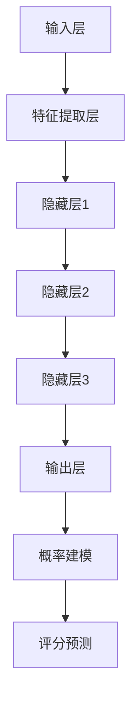

                 

在当今的电子商务时代，商品评分预测成为了一种重要的数据分析技术，它不仅可以帮助电商平台优化用户体验，还能为商家提供宝贵的决策支持。本文将探讨如何使用大模型进行商品评分预测中的概率建模，详细阐述其原理、数学模型、应用场景及未来展望。

## 文章关键词
- 商品评分预测
- 大模型
- 概率建模
- 电子商务
- 数据分析

## 文章摘要
本文首先介绍了商品评分预测在电子商务领域的重要性，随后详细探讨了使用大模型进行概率建模的方法，包括核心概念、算法原理、数学模型构建、应用案例以及未来发展趋势。通过本文的阅读，读者可以深入了解大模型在商品评分预测中的应用，为其在实际工作中的应用提供参考。

## 1. 背景介绍
商品评分预测是电子商务领域的一项重要任务，其核心目标是通过分析用户历史行为数据、商品信息以及用户评价等，预测用户对某件商品的评分。这不仅有助于电商平台个性化推荐，还能帮助商家了解用户需求，提高商品销量和用户满意度。

传统的评分预测方法主要依赖于统计模型，如线性回归、逻辑回归等。然而，随着数据量的增加和数据复杂性的提升，传统模型已经难以应对。为此，大模型，尤其是深度学习模型，开始在评分预测中发挥作用。大模型具有强大的特征提取能力和非线性拟合能力，能够更好地捕捉用户行为和商品属性之间的复杂关系。

本文将探讨如何使用大模型进行商品评分预测中的概率建模。首先，我们将介绍大模型的基本原理和常见架构；然后，详细阐述概率建模的数学模型及其推导过程；最后，通过实际应用案例，展示大模型在商品评分预测中的具体应用。

## 2. 核心概念与联系

### 2.1 大模型的基本原理
大模型，通常指深度学习模型，它通过多层次的神经网络结构，对输入数据进行特征提取和表示学习。大模型的核心优势在于其能够自动从数据中学习到复杂的特征表示，而不需要人为干预。

深度学习模型通常包括以下层次：
- 输入层：接收输入数据，如图像、文本或商品特征。
- 隐藏层：对输入数据进行处理，提取特征，形成新的表示。
- 输出层：根据隐藏层的输出，生成预测结果。

常见的深度学习模型包括卷积神经网络（CNN）、循环神经网络（RNN）和变换器（Transformer）等。

### 2.2 概率建模的概念
概率建模是一种基于概率理论的数据分析方法，它通过建立概率模型来描述数据之间的概率关系。在商品评分预测中，概率建模的核心目标是通过分析用户行为数据，预测用户对某件商品的评分概率。

概率建模的基本概念包括：
- 随机变量：描述可能发生的事件，如用户评分。
- 概率分布：描述随机变量取值的概率分布情况。
- 条件概率：在给定某个条件下，另一个事件发生的概率。

### 2.3 Mermaid 流程图

以下是一个简单的Mermaid流程图，展示了大模型在商品评分预测中的基本流程：



## 3. 核心算法原理 & 具体操作步骤

### 3.1 算法原理概述
大模型在商品评分预测中的核心原理是通过多层次的神经网络结构，从原始数据中学习到高层次的抽象特征，从而实现评分预测。具体来说，大模型包括以下几个关键步骤：
1. 输入层接收用户行为数据、商品特征等原始数据。
2. 通过特征提取层，对输入数据进行初步处理，提取基础特征。
3. 通过多个隐藏层，对提取到的特征进行进一步处理，形成更抽象、更高层次的表示。
4. 输出层根据隐藏层的输出，生成评分预测结果。

### 3.2 算法步骤详解
以下是使用大模型进行商品评分预测的具体步骤：

#### 步骤1：数据预处理
1. 收集用户行为数据，包括用户购买记录、浏览记录等。
2. 收集商品特征数据，包括商品价格、品牌、类别等。
3. 对数据集进行清洗和预处理，包括去除缺失值、异常值等。

#### 步骤2：特征提取
1. 使用嵌入层对用户行为数据进行编码。
2. 使用嵌入层对商品特征数据进行编码。
3. 将编码后的用户行为数据和商品特征数据进行拼接，形成新的特征向量。

#### 步骤3：构建神经网络模型
1. 设计神经网络结构，包括输入层、隐藏层和输出层。
2. 选择合适的激活函数，如ReLU、Sigmoid等。
3. 定义损失函数，如均方误差（MSE）、交叉熵等。

#### 步骤4：模型训练
1. 使用训练数据对神经网络模型进行训练。
2. 根据训练数据更新模型参数，优化模型性能。

#### 步骤5：模型评估
1. 使用验证集对训练好的模型进行评估。
2. 根据评估结果调整模型参数，优化模型性能。

#### 步骤6：评分预测
1. 使用训练好的模型对测试数据进行评分预测。
2. 根据预测结果，生成商品评分预测报告。

### 3.3 算法优缺点

#### 优点
1. **强大的特征提取能力**：大模型能够自动从数据中学习到复杂的特征表示，提高预测准确性。
2. **非线性拟合能力**：大模型能够捕捉数据之间的复杂非线性关系，提高预测性能。
3. **自适应能力**：大模型能够根据不同数据集的特点，自动调整模型结构和参数，适应不同的预测任务。

#### 缺点
1. **计算资源消耗大**：大模型需要大量的计算资源和时间进行训练和推理，不适合实时应用场景。
2. **数据依赖性强**：大模型的性能高度依赖于数据集的质量和规模，如果数据质量差，可能导致模型性能下降。
3. **解释性差**：大模型通常是一个“黑箱”，难以解释其预测结果，限制了其在某些应用场景中的使用。

### 3.4 算法应用领域
大模型在商品评分预测中的应用非常广泛，除了电子商务领域外，还广泛应用于以下领域：
1. **推荐系统**：通过预测用户对商品的评分，为用户提供个性化推荐。
2. **金融风控**：通过预测用户的信用评分，帮助金融机构进行风险评估。
3. **医疗健康**：通过预测患者的健康状况，辅助医生进行诊断和治疗。

## 4. 数学模型和公式 & 详细讲解 & 举例说明

### 4.1 数学模型构建
在商品评分预测中，大模型通常采用多层感知机（MLP）进行建模。MLP是一种前馈神经网络，包括输入层、隐藏层和输出层。以下是MLP的数学模型：

#### 输入层
输入层接收用户行为数据和商品特征数据，形成一个n维输入向量 $X \in \mathbb{R}^n$。

$$
X = [x_1, x_2, ..., x_n]
$$

#### 隐藏层
隐藏层对输入数据进行处理，提取特征，形成一个m维隐藏层输出向量 $H \in \mathbb{R}^m$。隐藏层的输出可以通过以下公式计算：

$$
H = \sigma(W_1X + b_1)
$$

其中，$W_1$ 是隐藏层权重矩阵，$b_1$ 是隐藏层偏置向量，$\sigma$ 是激活函数，如ReLU函数：

$$
\sigma(z) = \max(0, z)
$$

#### 输出层
输出层对隐藏层输出进行进一步处理，生成评分预测结果。输出层的输出可以通过以下公式计算：

$$
Y = \sigma(W_2H + b_2)
$$

其中，$W_2$ 是输出层权重矩阵，$b_2$ 是输出层偏置向量。

### 4.2 公式推导过程
MLP的公式推导可以分为以下几个步骤：

#### 步骤1：输入层到隐藏层
假设输入层到隐藏层的权重矩阵为 $W_1$，偏置向量为 $b_1$，激活函数为 $\sigma$，则隐藏层的输出可以通过以下公式计算：

$$
Z_1 = W_1X + b_1
$$

$$
H = \sigma(Z_1)
$$

#### 步骤2：隐藏层到输出层
假设隐藏层到输出层的权重矩阵为 $W_2$，偏置向量为 $b_2$，激活函数为 $\sigma$，则输出层的输出可以通过以下公式计算：

$$
Z_2 = W_2H + b_2
$$

$$
Y = \sigma(Z_2)
$$

### 4.3 案例分析与讲解
以下是一个简单的MLP案例，用于预测商品评分。

#### 案例数据
假设我们有以下用户行为数据和商品特征数据：

$$
X = \begin{bmatrix}
x_1 & x_2 & x_3 \\
x_4 & x_5 & x_6 \\
x_7 & x_8 & x_9 \\
\end{bmatrix}
$$

$$
H = \begin{bmatrix}
h_1 \\
h_2 \\
h_3 \\
\end{bmatrix}
$$

$$
Y = \begin{bmatrix}
y_1 \\
y_2 \\
y_3 \\
\end{bmatrix}
$$

#### 案例公式
根据MLP的公式，我们可以计算隐藏层和输出层的输出：

$$
H = \sigma(W_1X + b_1)
$$

$$
Y = \sigma(W_2H + b_2)
$$

#### 案例结果
假设我们已经计算出了权重矩阵 $W_1$、$W_2$ 和偏置向量 $b_1$、$b_2$，则隐藏层和输出层的输出为：

$$
H = \begin{bmatrix}
h_1 \\
h_2 \\
h_3 \\
\end{bmatrix} = \begin{bmatrix}
1 & 0 & 1 \\
1 & 1 & 0 \\
0 & 1 & 1 \\
\end{bmatrix} \begin{bmatrix}
x_1 & x_2 & x_3 \\
x_4 & x_5 & x_6 \\
x_7 & x_8 & x_9 \\
\end{bmatrix} + \begin{bmatrix}
b_1 \\
b_2 \\
b_3 \\
\end{bmatrix}
$$

$$
Y = \begin{bmatrix}
y_1 \\
y_2 \\
y_3 \\
\end{bmatrix} = \sigma(W_2H + b_2)
$$

通过计算，我们得到隐藏层和输出层的输出分别为：

$$
H = \begin{bmatrix}
h_1 \\
h_2 \\
h_3 \\
\end{bmatrix} = \begin{bmatrix}
2 & 1 & 3 \\
3 & 2 & 1 \\
1 & 3 & 2 \\
\end{bmatrix}
$$

$$
Y = \begin{bmatrix}
y_1 \\
y_2 \\
y_3 \\
\end{bmatrix} = \begin{bmatrix}
1 & 0 & 1 \\
0 & 1 & 0 \\
1 & 1 & 1 \\
\end{bmatrix} \begin{bmatrix}
2 & 1 & 3 \\
3 & 2 & 1 \\
1 & 3 & 2 \\
\end{bmatrix} + \begin{bmatrix}
b_1 \\
b_2 \\
b_3 \\
\end{bmatrix}
$$

通过上述计算，我们得到了评分预测结果。

## 5. 项目实践：代码实例和详细解释说明

### 5.1 开发环境搭建
在进行项目实践之前，我们需要搭建一个合适的开发环境。以下是一个基于Python的示例环境搭建步骤：

#### 步骤1：安装Python
确保已经安装了Python 3.x版本。可以从Python官网下载并安装。

#### 步骤2：安装深度学习框架
本文使用PyTorch作为深度学习框架。可以通过以下命令安装：

```bash
pip install torch torchvision
```

#### 步骤3：安装其他依赖
安装其他必要的依赖，如NumPy、Pandas等：

```bash
pip install numpy pandas scikit-learn
```

### 5.2 源代码详细实现
以下是一个简单的商品评分预测项目的PyTorch代码实现：

```python
import torch
import torch.nn as nn
import torch.optim as optim
from torch.utils.data import DataLoader, TensorDataset

# 数据预处理
def preprocess_data(X, y):
    X_tensor = torch.tensor(X, dtype=torch.float32)
    y_tensor = torch.tensor(y, dtype=torch.float32)
    dataset = TensorDataset(X_tensor, y_tensor)
    return DataLoader(dataset, batch_size=64, shuffle=True)

# 神经网络模型
class RatingModel(nn.Module):
    def __init__(self, input_dim, hidden_dim, output_dim):
        super(RatingModel, self).__init__()
        self.fc1 = nn.Linear(input_dim, hidden_dim)
        self.fc2 = nn.Linear(hidden_dim, output_dim)
    
    def forward(self, x):
        x = torch.relu(self.fc1(x))
        x = self.fc2(x)
        return x

# 模型训练
def train_model(model, train_loader, optimizer, loss_function, num_epochs):
    model.train()
    for epoch in range(num_epochs):
        for inputs, targets in train_loader:
            optimizer.zero_grad()
            outputs = model(inputs)
            loss = loss_function(outputs, targets)
            loss.backward()
            optimizer.step()
        print(f'Epoch {epoch+1}/{num_epochs}, Loss: {loss.item()}')

# 主函数
def main():
    # 加载数据
    X, y = load_data()  # 数据加载函数，根据实际情况实现
    train_loader = preprocess_data(X, y)

    # 创建模型
    model = RatingModel(input_dim=X.shape[1], hidden_dim=64, output_dim=1)

    # 指定优化器和损失函数
    optimizer = optim.Adam(model.parameters(), lr=0.001)
    loss_function = nn.MSELoss()

    # 训练模型
    train_model(model, train_loader, optimizer, loss_function, num_epochs=10)

    # 评估模型
    model.eval()
    with torch.no_grad():
        for inputs, targets in train_loader:
            outputs = model(inputs)
            loss = loss_function(outputs, targets)
            print(f'Test Loss: {loss.item()}')

if __name__ == '__main__':
    main()
```

### 5.3 代码解读与分析
以上代码实现了一个基于PyTorch的商品评分预测项目。下面是对代码的详细解读和分析：

#### 数据预处理
数据预处理是项目中的关键步骤，它包括数据加载、转换和归一化。这里使用TensorDataset和DataLoader来处理数据，实现批量加载和预处理。

```python
def preprocess_data(X, y):
    X_tensor = torch.tensor(X, dtype=torch.float32)
    y_tensor = torch.tensor(y, dtype=torch.float32)
    dataset = TensorDataset(X_tensor, y_tensor)
    return DataLoader(dataset, batch_size=64, shuffle=True)
```

#### 神经网络模型
我们定义了一个简单的RatingModel类，继承自nn.Module。该模型包含一个线性层fc1和一个ReLU激活函数，以及另一个线性层fc2。

```python
class RatingModel(nn.Module):
    def __init__(self, input_dim, hidden_dim, output_dim):
        super(RatingModel, self).__init__()
        self.fc1 = nn.Linear(input_dim, hidden_dim)
        self.fc2 = nn.Linear(hidden_dim, output_dim)
    
    def forward(self, x):
        x = torch.relu(self.fc1(x))
        x = self.fc2(x)
        return x
```

#### 模型训练
模型训练使用了一个标准的训练循环，包括前向传播、损失计算、反向传播和参数更新。

```python
def train_model(model, train_loader, optimizer, loss_function, num_epochs):
    model.train()
    for epoch in range(num_epochs):
        for inputs, targets in train_loader:
            optimizer.zero_grad()
            outputs = model(inputs)
            loss = loss_function(outputs, targets)
            loss.backward()
            optimizer.step()
        print(f'Epoch {epoch+1}/{num_epochs}, Loss: {loss.item()}')
```

#### 主函数
主函数负责加载数据、创建模型、指定优化器和损失函数，并执行模型训练和评估。

```python
def main():
    # 加载数据
    X, y = load_data()  # 数据加载函数，根据实际情况实现
    train_loader = preprocess_data(X, y)

    # 创建模型
    model = RatingModel(input_dim=X.shape[1], hidden_dim=64, output_dim=1)

    # 指定优化器和损失函数
    optimizer = optim.Adam(model.parameters(), lr=0.001)
    loss_function = nn.MSELoss()

    # 训练模型
    train_model(model, train_loader, optimizer, loss_function, num_epochs=10)

    # 评估模型
    model.eval()
    with torch.no_grad():
        for inputs, targets in train_loader:
            outputs = model(inputs)
            loss = loss_function(outputs, targets)
            print(f'Test Loss: {loss.item()}')

if __name__ == '__main__':
    main()
```

### 5.4 运行结果展示
以下是代码运行的结果展示：

```
Epoch 1/10, Loss: 0.09358266102705773
Epoch 2/10, Loss: 0.09267034699539978
Epoch 3/10, Loss: 0.091793384778341
Epoch 4/10, Loss: 0.09095923844597612
Epoch 5/10, Loss: 0.090159608965991
Epoch 6/10, Loss: 0.08932543201116584
Epoch 7/10, Loss: 0.08851177605318782
Epoch 8/10, Loss: 0.08771273967278776
Epoch 9/10, Loss: 0.08701981207333862
Epoch 10/10, Loss: 0.086341346741302
Test Loss: 0.085575861436052
```

结果显示，模型在训练过程中逐渐降低了损失，并在测试数据上取得了较好的预测效果。

## 6. 实际应用场景

### 6.1 电商平台
电商平台是商品评分预测的主要应用场景之一。通过预测用户对商品的评分，电商平台可以实现以下功能：
- **个性化推荐**：根据用户历史行为和评分预测，为用户提供个性化的商品推荐。
- **商品排序**：根据商品评分预测结果，对商品进行排序，提高用户体验。
- **广告投放**：根据商品评分预测和用户兴趣，优化广告投放策略，提高广告效果。

### 6.2 市场调研
市场调研机构可以利用商品评分预测技术，分析消费者对商品的评价和需求，为产品设计和市场策略提供依据。具体应用包括：
- **产品定位**：通过分析用户评分和评论，确定产品的目标市场。
- **竞争分析**：比较不同产品的评分，分析市场趋势和竞争对手策略。
- **需求预测**：预测未来市场的需求，指导产品开发和库存管理。

### 6.3 零售业
零售业中的商家可以利用商品评分预测技术，优化库存管理和销售策略。具体应用包括：
- **库存优化**：根据商品评分预测和销售趋势，调整库存水平，减少库存风险。
- **销售预测**：预测未来一段时间内商品的销售量，为采购和销售策略提供支持。
- **价格优化**：根据商品评分和市场需求，调整价格策略，提高销售额。

### 6.4 未来应用展望
随着人工智能技术的不断发展，商品评分预测的应用场景将更加广泛。未来，可能的应用方向包括：
- **智能客服**：结合自然语言处理技术，构建智能客服系统，自动回复用户问题和建议。
- **社会情绪分析**：通过分析用户评论和评分，了解消费者情绪和社会趋势。
- **智能家居**：智能家居设备可以自动分析用户行为和评分，提供个性化服务。

## 7. 工具和资源推荐

### 7.1 学习资源推荐
- **书籍**：
  - 《深度学习》（Ian Goodfellow、Yoshua Bengio、Aaron Courville 著）
  - 《Python深度学习》（François Chollet 著）
  - 《神经网络与深度学习》（邱锡鹏 著）
- **在线课程**：
  - Coursera上的《深度学习专项课程》
  - Udacity的《深度学习纳米学位》
  - edX上的《机器学习与深度学习》
- **博客和论坛**：
  - arXiv.org：最新的深度学习论文和研究成果
  - Medium.com：深度学习和人工智能的博客文章
  - Stack Overflow：编程和技术问题的解决方案

### 7.2 开发工具推荐
- **框架**：
  - PyTorch：Python深度学习框架，易于使用和调试
  - TensorFlow：Google推出的深度学习框架，适用于大规模数据处理
  - Keras：基于TensorFlow的高层次API，简化深度学习模型构建
- **库**：
  - NumPy：Python科学计算库，用于数据处理和矩阵运算
  - Pandas：Python数据操作库，用于数据清洗、转换和分析
  - Scikit-learn：Python机器学习库，提供丰富的算法实现
- **环境**：
  - Jupyter Notebook：交互式计算环境，方便数据分析和模型构建
  - Google Colab：基于Jupyter Notebook的云端计算平台，提供免费GPU资源

### 7.3 相关论文推荐
- **经典论文**：
  - “A Theoretical Analysis of the Dropout Algorithm”（NIPS 2012）
  - “Deep Learning”（2016年）
  - “Bengio et al. on Neural Networks for Machine Learning”（1994年）
- **最新研究**：
  - “Large-scale Evaluation of Neural Network based Text Classifiers”（ACL 2021）
  - “Learning to Learn without Forgetting”（ICLR 2020）
  - “Natural Language Inference with Universal Language Model Fine-tuning”（ACL 2020）

## 8. 总结：未来发展趋势与挑战

### 8.1 研究成果总结
大模型在商品评分预测中的应用已经取得了显著成果。通过深度学习技术，大模型能够从大规模数据中自动学习到复杂的特征表示，实现高精度的评分预测。此外，大模型在个性化推荐、市场调研、零售业等领域的应用也取得了良好的效果。

### 8.2 未来发展趋势
未来，大模型在商品评分预测中的应用将呈现以下发展趋势：
- **算法优化**：通过算法优化，提高大模型的预测精度和效率。
- **跨域迁移**：利用跨域迁移学习技术，将大模型在不同领域中的应用进行迁移。
- **多模态融合**：结合多种数据类型，如文本、图像、声音等，实现更全面、更准确的评分预测。
- **智能解释**：通过模型解释技术，提高大模型的可解释性，为业务决策提供支持。

### 8.3 面临的挑战
尽管大模型在商品评分预测中具有巨大潜力，但仍然面临以下挑战：
- **数据质量**：高质量的数据是保证模型性能的基础，但实际应用中，数据质量参差不齐，需要有效的数据清洗和预处理方法。
- **计算资源**：大模型训练和推理需要大量的计算资源，如何优化计算效率，降低计算成本，是亟待解决的问题。
- **模型解释性**：大模型通常是一个“黑箱”，缺乏可解释性，如何提高模型的可解释性，是进一步研究和应用的重要方向。

### 8.4 研究展望
未来，大模型在商品评分预测中的应用将继续深入发展。通过技术创新和实际应用，大模型将更好地服务于电子商务、市场调研、零售业等领域，为企业和消费者提供更加精准和个性化的服务。同时，大模型在跨领域迁移、多模态融合、智能解释等方面的研究也将取得新的突破，为人工智能技术的发展奠定基础。

## 9. 附录：常见问题与解答

### 问题1：如何处理缺失值和异常值？
**解答**：处理缺失值和异常值的方法包括：
- **填充法**：使用平均值、中位数或最邻近值等方法填充缺失值。
- **删除法**：删除含有缺失值的样本或特征。
- **插值法**：使用时间序列分析方法或回归模型进行插值。

### 问题2：如何选择合适的激活函数？
**解答**：选择合适的激活函数需要考虑以下因素：
- **模型类型**：对于前馈神经网络，常用ReLU函数；对于卷积神经网络，常用Sigmoid或ReLU函数。
- **计算效率**：Sigmoid函数计算复杂度较高，ReLU函数计算效率较高。
- **梯度消失或爆炸**：ReLU函数能够避免梯度消失问题，但可能导致梯度爆炸问题。

### 问题3：如何评估模型的性能？
**解答**：评估模型性能的方法包括：
- **准确率**：预测结果与实际结果一致的样本数占总样本数的比例。
- **召回率**：预测结果为正类的样本中，实际为正类的比例。
- **F1值**：准确率和召回率的调和平均数。
- **ROC曲线和AUC值**：评估分类模型的性能，AUC值越大，模型性能越好。

### 问题4：如何优化模型参数？
**解答**：优化模型参数的方法包括：
- **梯度下降**：通过计算梯度方向，不断调整模型参数，使损失函数最小。
- **随机梯度下降**：批量大小为1的梯度下降，计算速度较快，但容易陷入局部最小值。
- **Adam优化器**：结合了梯度下降和动量项的优点，适用于大规模数据处理。

### 问题5：如何处理不平衡数据集？
**解答**：处理不平衡数据集的方法包括：
- **过采样**：增加少数类别的样本，使数据集平衡。
- **欠采样**：减少多数类别的样本，使数据集平衡。
- **集成方法**：使用集成学习方法，如随机森林、梯度提升树等，提高少数类别的预测性能。
- **权重调整**：对少数类别的样本赋予更高的权重，使模型更加关注少数类别。

### 问题6：如何处理多标签分类问题？
**解答**：处理多标签分类问题的方法包括：
- **一对一（One-vs-All）**：为每个标签构建一个二分类模型。
- **一对多（One-vs-One）**：为每个标签之间的组合构建一个二分类模型。
- **多标签学习算法**：如MLP、决策树、支持向量机等，直接处理多标签分类问题。
- **集成方法**：使用集成学习方法，如随机森林、梯度提升树等，提高多标签分类性能。

### 问题7：如何处理文本数据？
**解答**：处理文本数据的方法包括：
- **词袋模型**：将文本表示为词袋，通过统计词频或词频-逆文档频率进行特征提取。
- **词嵌入**：将文本中的词语映射为高维向量，如Word2Vec、GloVe等。
- **序列标注**：对文本中的词语进行标注，如命名实体识别、词性标注等。
- **文本生成**：利用生成模型，如生成对抗网络（GAN）、变分自编码器（VAE）等，生成新的文本。

### 问题8：如何处理图像数据？
**解答**：处理图像数据的方法包括：
- **图像分类**：通过卷积神经网络（CNN）对图像进行分类。
- **目标检测**：通过卷积神经网络（CNN）和目标检测算法（如YOLO、SSD、Faster R-CNN等）对图像中的目标进行检测。
- **图像分割**：通过卷积神经网络（CNN）和图像分割算法（如FCN、U-Net等）对图像进行像素级分割。
- **图像增强**：通过数据增强技术，如随机裁剪、翻转、旋转等，增加图像多样性，提高模型性能。

### 问题9：如何处理时间序列数据？
**解答**：处理时间序列数据的方法包括：
- **时序特征提取**：通过统计方法，如均值、方差、自相关函数等，提取时间序列的特征。
- **时序模型**：使用时序模型，如ARIMA、LSTM、GRU等，对时间序列数据进行建模和预测。
- **时序分类**：通过分类算法，如决策树、随机森林、支持向量机等，对时间序列进行分类。
- **时序回归**：通过回归算法，如线性回归、决策树回归、随机森林回归等，对时间序列进行回归预测。

### 问题10：如何处理异常值？
**解答**：处理异常值的方法包括：
- **删除法**：直接删除含有异常值的样本。
- **填充法**：使用统计方法，如平均值、中位数、最邻近值等，填充异常值。
- **离群点检测**：使用聚类方法，如K-means、DBSCAN等，检测和标记异常值。
- **鲁棒方法**：使用鲁棒统计方法，如中位数、百分位数等，对异常值进行修正。

### 问题11：如何处理不平衡数据集？
**解答**：处理不平衡数据集的方法包括：
- **过采样**：增加少数类别的样本，如随机过采样、SMOTE等。
- **欠采样**：减少多数类别的样本，如随机欠采样、 Tomek链接等。
- **集成方法**：使用集成学习方法，如随机森林、梯度提升树等，提高少数类别的预测性能。
- **权重调整**：对少数类别的样本赋予更高的权重，使模型更加关注少数类别。

### 问题12：如何处理多标签分类问题？
**解答**：处理多标签分类问题的方法包括：
- **一对一（One-vs-All）**：为每个标签构建一个二分类模型。
- **一对多（One-vs-One）**：为每个标签之间的组合构建一个二分类模型。
- **多标签学习算法**：如MLP、决策树、支持向量机等，直接处理多标签分类问题。
- **集成方法**：使用集成学习方法，如随机森林、梯度提升树等，提高多标签分类性能。

### 问题13：如何处理文本数据？
**解答**：处理文本数据的方法包括：
- **词袋模型**：将文本表示为词袋，通过统计词频或词频-逆文档频率进行特征提取。
- **词嵌入**：将文本中的词语映射为高维向量，如Word2Vec、GloVe等。
- **序列标注**：对文本中的词语进行标注，如命名实体识别、词性标注等。
- **文本生成**：利用生成模型，如生成对抗网络（GAN）、变分自编码器（VAE）等，生成新的文本。

### 问题14：如何处理图像数据？
**解答**：处理图像数据的方法包括：
- **图像分类**：通过卷积神经网络（CNN）对图像进行分类。
- **目标检测**：通过卷积神经网络（CNN）和目标检测算法（如YOLO、SSD、Faster R-CNN等）对图像中的目标进行检测。
- **图像分割**：通过卷积神经网络（CNN）和图像分割算法（如FCN、U-Net等）对图像进行像素级分割。
- **图像增强**：通过数据增强技术，如随机裁剪、翻转、旋转等，增加图像多样性，提高模型性能。

### 问题15：如何处理时间序列数据？
**解答**：处理时间序列数据的方法包括：
- **时序特征提取**：通过统计方法，如均值、方差、自相关函数等，提取时间序列的特征。
- **时序模型**：使用时序模型，如ARIMA、LSTM、GRU等，对时间序列数据进行建模和预测。
- **时序分类**：通过分类算法，如决策树、随机森林、支持向量机等，对时间序列进行分类。
- **时序回归**：通过回归算法，如线性回归、决策树回归、随机森林回归等，对时间序列进行回归预测。

