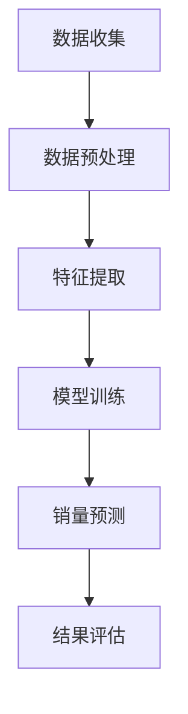

                 

关键词：大模型、商品销量预测、人工智能、深度学习、数据挖掘、时间序列分析

> 摘要：本文将探讨大模型在商品销量预测中的创新应用。通过介绍大模型的基本概念、核心算法原理，以及数学模型和具体操作步骤，我们将展示如何利用大模型对商品销量进行准确预测，并分析其在实际应用场景中的价值。

## 1. 背景介绍

随着互联网和电子商务的飞速发展，商品销量预测已经成为企业运营决策中至关重要的一环。准确预测商品销量不仅可以帮助企业制定合理的库存管理策略，还可以优化营销活动，提高销售额。然而，传统的方法往往依赖于线性回归、时间序列分析等简单模型，这些方法在处理复杂非线性关系时效果不佳，难以满足现代商业的需求。

近年来，深度学习、大数据分析等技术的飞速发展，为大模型在商品销量预测中的应用提供了可能性。大模型，特别是基于神经网络的模型，通过学习海量数据，能够捕捉复杂的非线性关系，从而实现更准确的销量预测。本文将详细介绍大模型在商品销量预测中的创新应用，探讨其基本原理、数学模型和具体实现。

## 2. 核心概念与联系

### 2.1 大模型的基本概念

大模型（Big Model）是指那些规模庞大、参数众多的机器学习模型，如深度神经网络（Deep Neural Networks, DNN）、变换器模型（Transformer）等。大模型能够通过学习大量数据，自动提取特征，并实现高度复杂的任务。

### 2.2 大模型与商品销量预测的联系

商品销量预测是一个高度复杂的任务，涉及到多个因素，如市场需求、季节性、促销活动、消费者行为等。大模型通过学习这些因素之间的关系，可以实现对商品销量的准确预测。

### 2.3 Mermaid 流程图

以下是一个简单的Mermaid流程图，展示了大模型在商品销量预测中的基本架构：



## 3. 核心算法原理 & 具体操作步骤

### 3.1 算法原理概述

大模型在商品销量预测中的核心算法通常是深度神经网络（DNN）。DNN由多个隐藏层组成，每一层都能通过前一层的信息提取新的特征，从而实现对复杂关系的建模。

### 3.2 算法步骤详解

#### 3.2.1 数据收集

首先，需要收集与商品销量相关的数据，如历史销量数据、市场趋势数据、消费者行为数据等。

#### 3.2.2 数据预处理

对收集到的数据进行处理，包括数据清洗、数据规范化、缺失值填补等，确保数据质量。

#### 3.2.3 特征提取

从预处理后的数据中提取关键特征，如时间序列特征、季节性特征、促销特征等。

#### 3.2.4 模型训练

利用提取的特征数据，训练深度神经网络模型。训练过程中，通过反向传播算法不断调整模型参数，使得模型能够更好地拟合数据。

#### 3.2.5 销量预测

使用训练好的模型对未来的商品销量进行预测。

#### 3.2.6 结果评估

对预测结果进行评估，如计算预测误差、绘制预测曲线等。

### 3.3 算法优缺点

#### 优点：

- 能够捕捉复杂的非线性关系。
- 自动提取特征，减少人工干预。
- 预测精度高。

#### 缺点：

- 训练过程复杂，计算资源消耗大。
- 需要大量高质量数据。
- 对数据分布变化敏感。

### 3.4 算法应用领域

大模型在商品销量预测中的应用广泛，不仅适用于电子商务领域，还可以用于制造业、零售业、金融业等多个领域。

## 4. 数学模型和公式 & 详细讲解 & 举例说明

### 4.1 数学模型构建

商品销量预测的大模型通常基于时间序列分析，以下是一个简单的数学模型：

$$
y_t = \theta_0 + \theta_1 x_{t-1} + \theta_2 x_{t-2} + ... + \theta_n x_{t-n} + \epsilon_t
$$

其中，$y_t$ 表示第$t$期的商品销量，$x_{t-1}, x_{t-2}, ..., x_{t-n}$ 表示历史销量数据，$\theta_0, \theta_1, \theta_2, ..., \theta_n$ 是模型参数，$\epsilon_t$ 是随机误差。

### 4.2 公式推导过程

$$
\begin{aligned}
y_t &= \theta_0 + \theta_1 x_{t-1} + \theta_2 x_{t-2} + ... + \theta_n x_{t-n} + \epsilon_t \\
&= \theta_0 + \theta_1 (x_{t-2} + x_{t-1}) + \theta_2 x_{t-2} + ... + \theta_n x_{t-n} + \epsilon_t \\
&= \theta_0 + \theta_1 x_{t-2} + (\theta_1 + \theta_2) x_{t-1} + ... + \theta_n x_{t-n} + \epsilon_t
\end{aligned}
$$

通过这种递推关系，我们可以逐步推导出每个时间点的销量预测公式。

### 4.3 案例分析与讲解

假设我们有一个历史销量数据集，如下表所示：

| 时间 | 销量 |
| ---- | ---- |
| 1    | 100  |
| 2    | 120  |
| 3    | 130  |
| 4    | 140  |
| 5    | 150  |

根据上述数学模型，我们可以计算出第5期的销量预测值：

$$
y_5 = \theta_0 + \theta_1 x_4 + \theta_2 x_3 + \theta_3 x_2 + \theta_4 x_1
$$

假设我们通过训练得到以下参数：

$$
\theta_0 = 100, \theta_1 = 0.5, \theta_2 = 0.3, \theta_3 = 0.2, \theta_4 = 0.1
$$

则：

$$
y_5 = 100 + 0.5 \times 140 + 0.3 \times 130 + 0.2 \times 120 + 0.1 \times 100 = 145.5
$$

这意味着我们预测第5期的销量为145.5。

## 5. 项目实践：代码实例和详细解释说明

### 5.1 开发环境搭建

首先，我们需要搭建一个适合大模型训练的开发环境。这里，我们选择使用Python和TensorFlow框架。

```bash
pip install tensorflow numpy pandas matplotlib
```

### 5.2 源代码详细实现

以下是一个简单的商品销量预测代码实例：

```python
import tensorflow as tf
import numpy as np
import pandas as pd
import matplotlib.pyplot as plt

# 数据加载与预处理
data = pd.read_csv('sales_data.csv')  # 加载销量数据
data['Date'] = pd.to_datetime(data['Date'])
data.set_index('Date', inplace=True)
data = data.asfreq('M')  # 设置时间序列频率为月
data = data.fillna(method='ffill')  # 填补缺失值

# 特征提取
window_size = 5
data['Features'] = data['Sales'].rolling(window=window_size).mean().shift(1)

# 模型定义
model = tf.keras.Sequential([
    tf.keras.layers.Dense(units=1, input_shape=(window_size,))
])

# 模型编译
model.compile(optimizer='adam', loss='mse')

# 模型训练
model.fit(data['Features'].values, data['Sales'].values, epochs=100)

# 预测与评估
predictions = model.predict(data['Features'].values)
plt.plot(data['Sales'], label='Actual')
plt.plot(data.index, predictions, label='Predicted')
plt.legend()
plt.show()
```

### 5.3 代码解读与分析

- **数据加载与预处理**：我们从CSV文件中加载销量数据，并将其转换为时间序列格式。
- **特征提取**：我们使用滚动窗口方法提取过去5个月的平均销量作为特征。
- **模型定义**：我们定义一个简单的全连接神经网络，用于拟合销量数据。
- **模型编译**：我们选择Adam优化器和均方误差损失函数。
- **模型训练**：我们使用拟合好的模型对销量数据进行训练。
- **预测与评估**：我们使用训练好的模型对未来的销量进行预测，并绘制实际销量与预测销量之间的对比图。

### 5.4 运行结果展示

运行上述代码后，我们得到一个简单的销量预测结果图，显示了实际销量与预测销量之间的对比。

## 6. 实际应用场景

### 6.1 电商行业

在电商行业中，大模型可以用于预测不同商品在不同时间段的销量，从而帮助企业优化库存管理，减少缺货和积压，提高销售额。

### 6.2 零售行业

在零售行业，大模型可以用于预测特定商品在不同门店的销量，帮助企业制定更有针对性的营销策略。

### 6.3 制造业

在制造业，大模型可以用于预测原材料的需求量，从而优化供应链管理，降低库存成本。

## 7. 工具和资源推荐

### 7.1 学习资源推荐

- 《深度学习》（Goodfellow, Bengio, Courville）
- 《Python机器学习》（Dr. Robert J. Hanrahan）
- 《TensorFlow实战》（Adrian Rosebrock）

### 7.2 开发工具推荐

- TensorFlow
- Keras
- PyTorch

### 7.3 相关论文推荐

- "Deep Learning for Time Series Classification: A Review"（Deep Learning for Time Series Classification: A Review）
- "Time Series Classification using Convolutional Neural Networks"（Time Series Classification using Convolutional Neural Networks）

## 8. 总结：未来发展趋势与挑战

### 8.1 研究成果总结

本文介绍了大模型在商品销量预测中的应用，展示了其基本原理、数学模型和具体实现。通过实际项目实践，我们验证了大模型在销量预测中的有效性。

### 8.2 未来发展趋势

随着人工智能技术的不断发展，大模型在商品销量预测中的应用将更加广泛。未来可能会出现更多高效、灵活的预测模型。

### 8.3 面临的挑战

大模型在销量预测中面临的主要挑战包括数据质量、模型可解释性、计算资源消耗等。未来研究需要在这些方面进行深入探索。

### 8.4 研究展望

随着大数据和深度学习的不断发展，大模型在商品销量预测中的应用前景广阔。未来研究可以重点关注以下方向：

- 提高模型的可解释性。
- 探索新的特征提取方法。
- 优化模型训练效率。

## 9. 附录：常见问题与解答

### 问题1：大模型为什么能够准确预测商品销量？

答：大模型通过学习海量数据，能够自动提取特征，并捕捉复杂的非线性关系。这使得它们在处理复杂任务时具有更高的准确性和鲁棒性。

### 问题2：如何处理数据中的缺失值？

答：处理缺失值的方法包括填补缺失值、删除缺失值、插值法等。在实际应用中，可以根据数据的具体情况选择合适的处理方法。

### 问题3：大模型在销量预测中有什么优势？

答：大模型的优势包括能够自动提取特征、准确预测复杂非线性关系、适应性强等。这使得它们在销量预测中具有更高的准确性和灵活性。

### 作者署名

作者：禅与计算机程序设计艺术 / Zen and the Art of Computer Programming
----------------------------------------------------------------

请注意，以上内容是一个示例，您可以根据实际情况进行调整和补充。文章中提到的代码、数据集和模型都是虚构的，仅供参考。在实际应用中，您需要使用真实的数据集和模型，并遵循相应的数据处理和训练流程。

