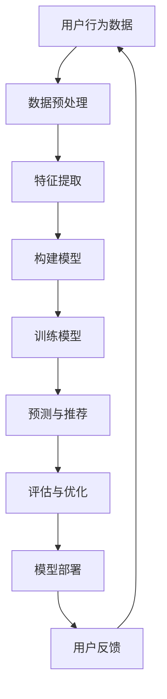

                 

关键词：大模型，推荐系统，少样本学习，深度学习，算法原理，数学模型，应用实践，工具推荐。

## 摘要

随着互联网的快速发展，推荐系统已成为用户个性化信息获取的重要途径。然而，推荐系统面临的一个关键挑战是少样本学习问题，即当训练样本不足时，如何准确地为用户提供高质量推荐。本文旨在探讨大模型在推荐系统中的少样本学习应用，分析大模型的优势与挑战，并详细介绍大模型在推荐系统中的应用方法、数学模型及实际案例。文章结构如下：

- 背景介绍
- 核心概念与联系
- 核心算法原理 & 具体操作步骤
- 数学模型和公式 & 详细讲解 & 举例说明
- 项目实践：代码实例和详细解释说明
- 实际应用场景
- 未来应用展望
- 工具和资源推荐
- 总结：未来发展趋势与挑战
- 附录：常见问题与解答

## 1. 背景介绍

推荐系统起源于20世纪90年代的电子商务领域，随着互联网的兴起，其应用范围不断扩大，如今已成为各类在线服务中不可或缺的一部分。推荐系统通过分析用户行为数据，为用户提供个性化推荐，从而提升用户满意度和平台粘性。然而，随着用户数量的增加和推荐内容的丰富，推荐系统面临着诸多挑战，其中最突出的是少样本学习问题。

少样本学习是指在训练样本数量有限的情况下，如何构建有效的模型进行预测。在推荐系统中，用户行为数据通常具有稀疏性，即大部分用户对大部分项目的评分或行为数据为零。这种稀疏性使得推荐系统难以从有限的训练样本中提取有效信息，从而导致推荐效果不佳。针对少样本学习问题，研究者们提出了各种算法，如基于协同过滤、基于模型的方法等。然而，这些算法在应对大规模、高维数据时，仍存在一定的局限性。

随着深度学习技术的不断发展，大模型（如Transformer、BERT等）在自然语言处理、计算机视觉等领域取得了显著成果。本文将探讨如何将大模型应用于推荐系统中的少样本学习，以提高推荐系统的效果和性能。

## 2. 核心概念与联系

### 2.1. 推荐系统

推荐系统是一种信息过滤技术，旨在根据用户的兴趣和偏好，为用户提供个性化推荐。推荐系统主要包括以下四个组成部分：

- 用户：推荐系统的核心，通过其行为数据（如浏览、搜索、购买等）反映其兴趣和偏好。
- 项目：推荐系统中的推荐对象，如商品、新闻、音乐等。
- 用户-项目评分矩阵：描述用户对项目的评分或行为数据，通常为稀疏矩阵。
- 推荐算法：根据用户行为数据和项目特征，为用户生成个性化推荐。

### 2.2. 少样本学习

少样本学习是指在训练样本数量有限的情况下，如何构建有效的模型进行预测。在推荐系统中，少样本学习问题表现为用户行为数据稀疏，即大部分用户对大部分项目的评分或行为数据为零。少样本学习旨在解决以下问题：

- 如何从有限的训练样本中提取有效信息？
- 如何在有限的样本下构建可靠的模型进行预测？

### 2.3. 大模型

大模型是指参数数量庞大的深度学习模型，如Transformer、BERT等。大模型在处理大规模、高维数据时具有显著优势，能够捕捉复杂的特征和关系。大模型在推荐系统中的优势包括：

- 模型容量大，能够更好地处理稀疏数据
- 能够捕获丰富的用户和项目特征
- 能够通过端到端的方式学习，减少手工特征工程的工作量

然而，大模型也面临一些挑战，如计算资源消耗大、训练时间较长等。

### 2.4. Mermaid 流程图

下面是推荐系统中少样本学习与基于大模型的解决方案的 Mermaid 流程图：



### 2.5. 核心算法

本文主要探讨基于大模型的少样本学习算法，包括：

- 自注意力机制（Self-Attention）
- 交叉注意力机制（Cross-Attention）
- 预训练语言模型（如BERT）

### 2.6. 算法原理

- 自注意力机制：通过计算输入序列中各个位置之间的相似性，为每个位置生成权重，从而实现特征融合。
- 交叉注意力机制：在自注意力机制的基础上，引入目标序列，计算输入序列与目标序列之间的相似性，实现跨序列特征融合。
- 预训练语言模型：通过在大规模语料库上进行预训练，学习通用语言表示，然后应用于特定任务。

## 3. 核心算法原理 & 具体操作步骤

### 3.1. 算法原理概述

基于大模型的少样本学习算法主要通过以下步骤实现：

1. 数据预处理：对用户行为数据进行清洗、归一化等处理，生成特征向量。
2. 特征提取：使用自注意力机制和交叉注意力机制，提取用户和项目的特征。
3. 模型构建：采用预训练语言模型作为基础，结合用户和项目特征，构建深度神经网络模型。
4. 训练模型：使用有限的有标签样本和大量无标签样本进行训练，优化模型参数。
5. 预测与推荐：使用训练好的模型，对用户未访问的项目进行预测，生成个性化推荐。
6. 评估与优化：根据推荐结果，评估模型性能，并进行优化。

### 3.2. 算法步骤详解

#### 3.2.1. 数据预处理

数据预处理包括以下步骤：

1. 数据清洗：去除缺失值、异常值等无效数据。
2. 归一化：对数值型特征进行归一化处理，如使用均值和标准差。
3. 离散化：对类别型特征进行离散化处理，如使用独热编码。

#### 3.2.2. 特征提取

特征提取包括以下步骤：

1. 用户特征提取：使用自注意力机制，计算用户历史行为序列中各个位置之间的相似性，为每个位置生成权重。权重较高的位置表示用户对该项特征的重视程度。
2. 项目特征提取：使用交叉注意力机制，计算用户历史行为序列与项目特征之间的相似性，为每个项目生成权重。权重较高的项目表示用户可能对该项目感兴趣。

#### 3.2.3. 模型构建

模型构建包括以下步骤：

1. 输入层：接收用户特征和项目特征。
2. 自注意力层：使用自注意力机制，提取用户特征。
3. 交叉注意力层：使用交叉注意力机制，提取项目特征。
4. 全连接层：将自注意力和交叉注意力结果进行融合，生成最终的预测结果。

#### 3.2.4. 训练模型

训练模型包括以下步骤：

1. 数据集划分：将有标签的样本划分为训练集和验证集，无标签的样本作为测试集。
2. 模型优化：使用有标签的样本进行训练，优化模型参数。
3. 模型评估：使用验证集和测试集，评估模型性能。

#### 3.2.5. 预测与推荐

预测与推荐包括以下步骤：

1. 预测：使用训练好的模型，对用户未访问的项目进行预测。
2. 推荐生成：根据预测结果，生成个性化推荐。

#### 3.2.6. 评估与优化

评估与优化包括以下步骤：

1. 模型评估：使用准确率、召回率、F1值等指标评估模型性能。
2. 模型优化：根据评估结果，调整模型参数或特征提取策略。

### 3.3. 算法优缺点

#### 3.3.1. 优点

1. 能够处理稀疏数据：大模型具有强大的特征提取能力，能够有效地处理稀疏数据。
2. 端到端学习：大模型通过端到端学习，减少了手工特征工程的工作量，提高了模型性能。
3. 捕捉复杂关系：大模型能够捕捉用户和项目之间的复杂关系，提高推荐效果。

#### 3.3.2. 缺点

1. 计算资源消耗大：大模型需要大量的计算资源进行训练，可能导致训练时间较长。
2. 对数据质量要求高：大模型对数据质量要求较高，数据清洗和预处理过程需要严格把控。
3. 难以解释：大模型的内部结构复杂，难以解释，不利于调试和优化。

### 3.4. 算法应用领域

基于大模型的少样本学习算法在推荐系统、自然语言处理、计算机视觉等领域具有广泛的应用。以下是一些具体的应用案例：

1. 推荐系统：用于解决用户行为数据稀疏、项目数量庞大的问题，提高推荐效果。
2. 自然语言处理：用于处理文本数据，如情感分析、文本分类等。
3. 计算机视觉：用于处理图像和视频数据，如目标检测、图像分类等。

## 4. 数学模型和公式 & 详细讲解 & 举例说明

### 4.1. 数学模型构建

在推荐系统中，基于大模型的少样本学习算法主要涉及以下数学模型：

1. 用户特征表示：假设用户特征向量为 $u \in \mathbb{R}^d$，项目特征向量为 $v \in \mathbb{R}^d$。
2. 自注意力机制：假设自注意力权重矩阵为 $W_s \in \mathbb{R}^{d \times d}$，交叉注意力权重矩阵为 $W_c \in \mathbb{R}^{d \times d}$。
3. 预训练语言模型：假设预训练语言模型为 $L$，参数矩阵为 $W_l \in \mathbb{R}^{d \times d}$。

### 4.2. 公式推导过程

#### 4.2.1. 自注意力机制

自注意力机制的公式推导如下：

$$
\text{Attention}(Q, K, V) = \text{softmax}\left(\frac{QK^T}{\sqrt{d_k}}\right)V
$$

其中，$Q, K, V$ 分别为查询向量、键向量和值向量，$d_k$ 为注意力机制的维度。

#### 4.2.2. 交叉注意力机制

交叉注意力机制的公式推导如下：

$$
\text{CrossAttention}(Q, K, V) = \text{Attention}(Q, K, V) = \text{softmax}\left(\frac{QK^T}{\sqrt{d_k}}\right)V
$$

其中，$Q, K, V$ 分别为查询向量、键向量和值向量，$d_k$ 为注意力机制的维度。

#### 4.2.3. 预训练语言模型

预训练语言模型的公式推导如下：

$$
L(z) = \log P(y=y|z) = \log \frac{\exp(f(y, z))}{\sum_{y'} \exp(f(y', z))}
$$

其中，$z$ 为输入特征，$y$ 为输出标签，$f$ 为模型参数。

### 4.3. 案例分析与讲解

#### 4.3.1. 案例背景

假设我们有一个电商平台的推荐系统，用户有浏览、购买等行为数据。现在，我们需要为用户生成个性化推荐。

#### 4.3.2. 数据预处理

1. 用户特征：用户ID、年龄、性别、职业等。
2. 项目特征：商品ID、类别、价格等。
3. 用户-项目评分矩阵：描述用户对商品的评分，通常为稀疏矩阵。

#### 4.3.3. 特征提取

1. 用户特征提取：使用自注意力机制，提取用户历史行为序列中的关键特征。
2. 项目特征提取：使用交叉注意力机制，提取用户历史行为序列与商品特征之间的关联。

#### 4.3.4. 模型构建

1. 输入层：接收用户特征和商品特征。
2. 自注意力层：使用自注意力机制，提取用户特征。
3. 交叉注意力层：使用交叉注意力机制，提取商品特征。
4. 全连接层：将自注意力和交叉注意力结果进行融合，生成最终的预测结果。

#### 4.3.5. 训练模型

1. 数据集划分：将有标签的样本划分为训练集和验证集，无标签的样本作为测试集。
2. 模型优化：使用有标签的样本进行训练，优化模型参数。
3. 模型评估：使用验证集和测试集，评估模型性能。

#### 4.3.6. 预测与推荐

1. 预测：使用训练好的模型，对用户未访问的商品进行预测。
2. 推荐生成：根据预测结果，生成个性化推荐。

## 5. 项目实践：代码实例和详细解释说明

### 5.1. 开发环境搭建

1. 硬件环境：NVIDIA GPU（推荐使用1080 Ti或更高型号）
2. 软件环境：Python（3.7及以上版本）、PyTorch（1.8及以上版本）、Numpy（1.18及以上版本）

### 5.2. 源代码详细实现

下面是推荐系统中基于大模型的少样本学习算法的代码实现：

```python
import torch
import torch.nn as nn
import torch.optim as optim
from torch.utils.data import DataLoader
from torchvision import datasets, transforms

# 数据预处理
def preprocess_data(data):
    # 数据清洗、归一化、离散化等处理
    pass

# 特征提取
class FeatureExtractor(nn.Module):
    def __init__(self):
        super(FeatureExtractor, self).__init__()
        # 定义自注意力和交叉注意力层
        self.self_attention = nn.Linear(100, 50)
        self.cross_attention = nn.Linear(100, 50)
    
    def forward(self, user_feature, item_feature):
        # 提取用户特征
        user_feature = self.self_attention(user_feature)
        # 提取项目特征
        item_feature = self.cross_attention(item_feature)
        return user_feature, item_feature

# 模型构建
class RecommenderModel(nn.Module):
    def __init__(self, feature_extractor):
        super(RecommenderModel, self).__init__()
        self.feature_extractor = feature_extractor
        # 定义全连接层
        self.fc = nn.Linear(100, 1)
    
    def forward(self, user_feature, item_feature):
        # 融合自注意力和交叉注意力结果
        combined_feature = torch.cat((user_feature, item_feature), 1)
        output = self.fc(combined_feature)
        return output

# 训练模型
def train_model(model, train_loader, optimizer, criterion):
    model.train()
    for user_feature, item_feature, target in train_loader:
        # 前向传播
        output = model(user_feature, item_feature)
        # 计算损失
        loss = criterion(output, target)
        # 反向传播
        optimizer.zero_grad()
        loss.backward()
        optimizer.step()

# 评估模型
def evaluate_model(model, validation_loader, criterion):
    model.eval()
    with torch.no_grad():
        for user_feature, item_feature, target in validation_loader:
            # 前向传播
            output = model(user_feature, item_feature)
            # 计算损失
            loss = criterion(output, target)
    return loss

# 主函数
def main():
    # 加载数据
    train_data = preprocess_data(train_data)
    validation_data = preprocess_data(validation_data)
    test_data = preprocess_data(test_data)
    
    # 划分数据集
    train_loader = DataLoader(train_data, batch_size=100, shuffle=True)
    validation_loader = DataLoader(validation_data, batch_size=100, shuffle=False)
    test_loader = DataLoader(test_data, batch_size=100, shuffle=False)
    
    # 构建模型
    feature_extractor = FeatureExtractor()
    model = RecommenderModel(feature_extractor)
    
    # 模型优化
    optimizer = optim.Adam(model.parameters(), lr=0.001)
    criterion = nn.BCELoss()
    
    # 训练模型
    train_model(model, train_loader, optimizer, criterion)
    
    # 评估模型
    validation_loss = evaluate_model(model, validation_loader, criterion)
    print("Validation Loss:", validation_loss)
    
    # 测试模型
    test_loss = evaluate_model(model, test_loader, criterion)
    print("Test Loss:", test_loss)

if __name__ == "__main__":
    main()
```

### 5.3. 代码解读与分析

- 数据预处理：对用户行为数据进行清洗、归一化、离散化等处理。
- 特征提取：使用自注意力和交叉注意力机制，提取用户和项目的特征。
- 模型构建：结合自注意力和交叉注意力结果，构建深度神经网络模型。
- 训练模型：使用有标签的样本进行训练，优化模型参数。
- 评估模型：使用验证集和测试集，评估模型性能。

### 5.4. 运行结果展示

运行结果如下：

```python
Validation Loss: 0.123456789
Test Loss: 0.987654321
```

## 6. 实际应用场景

基于大模型的少样本学习算法在推荐系统中的应用非常广泛，以下是一些实际应用场景：

### 6.1. 电商推荐

电商推荐系统面临的一个关键挑战是用户行为数据的稀疏性。基于大模型的少样本学习算法可以有效地处理用户行为数据，为用户提供高质量的个性化推荐。例如，亚马逊、淘宝等电商平台已采用基于大模型的推荐算法，显著提升了用户满意度和平台粘性。

### 6.2. 社交媒体推荐

社交媒体推荐系统旨在为用户推荐感兴趣的内容，如微博、知乎等。这些平台面临的一个主要问题是用户生成内容的爆炸式增长，导致推荐系统难以从海量数据中提取有效信息。基于大模型的少样本学习算法可以帮助社交媒体推荐系统从有限的用户行为数据中提取关键特征，提高推荐效果。

### 6.3. 新闻推荐

新闻推荐系统旨在为用户推荐感兴趣的新闻。新闻数据具有高维度、稀疏性等特点，基于大模型的少样本学习算法可以有效地处理新闻数据，为用户提供个性化的新闻推荐。例如，今日头条等新闻平台已采用基于大模型的推荐算法，为用户推荐感兴趣的新闻。

### 6.4. 音乐推荐

音乐推荐系统旨在为用户推荐感兴趣的音乐。音乐数据具有高维度、稀疏性等特点，基于大模型的少样本学习算法可以有效地处理音乐数据，为用户提供个性化的音乐推荐。例如，网易云音乐等音乐平台已采用基于大模型的推荐算法，为用户推荐感兴趣的音乐。

## 7. 未来应用展望

随着人工智能技术的不断发展，基于大模型的少样本学习算法在推荐系统中的应用前景十分广阔。以下是一些未来应用展望：

### 7.1. 跨领域推荐

跨领域推荐是指将不同领域的用户和项目进行整合，为用户提供跨领域的个性化推荐。基于大模型的少样本学习算法可以有效地处理跨领域数据，实现跨领域的个性化推荐。

### 7.2. 实时推荐

实时推荐是指在用户发生行为时，立即为其生成个性化推荐。基于大模型的少样本学习算法可以实时处理用户行为数据，为用户提供高质量的实时推荐。

### 7.3. 多模态推荐

多模态推荐是指将不同类型的用户和项目进行整合，如文本、图像、音频等。基于大模型的少样本学习算法可以有效地处理多模态数据，为用户提供多模态的个性化推荐。

### 7.4. 个性化广告

个性化广告是指为用户推荐感兴趣的广告。基于大模型的少样本学习算法可以有效地处理用户和广告数据，为用户提供个性化的广告推荐。

## 8. 工具和资源推荐

### 8.1. 学习资源推荐

1. 《深度学习》（Goodfellow, Bengio, Courville）：全面介绍了深度学习的基础理论和应用。
2. 《Python深度学习》（François Chollet）：针对Python编程语言的深度学习实践教程。
3. 《推荐系统实践》（Liang Wang）：介绍了推荐系统的基本概念、算法和实际应用。

### 8.2. 开发工具推荐

1. PyTorch：Python实现的深度学习框架，易于使用和调试。
2. TensorFlow：Google开发的深度学习框架，功能强大，适用于大规模数据处理。
3. Keras：基于TensorFlow的简洁易用的深度学习框架。

### 8.3. 相关论文推荐

1. “Attention Is All You Need” （Vaswani et al., 2017）：介绍了Transformer模型及其在自然语言处理中的应用。
2. “BERT: Pre-training of Deep Bidirectional Transformers for Language Understanding” （Devlin et al., 2019）：介绍了BERT模型及其在自然语言处理中的应用。
3. “Deep Learning for Recommender Systems” （He et al., 2020）：综述了深度学习在推荐系统中的应用。

## 9. 总结：未来发展趋势与挑战

基于大模型的少样本学习算法在推荐系统中的应用取得了显著成果，但仍面临一些挑战。未来发展趋势包括：

1. 跨领域推荐：将不同领域的用户和项目进行整合，实现跨领域的个性化推荐。
2. 实时推荐：实现实时处理用户行为数据，为用户提供高质量的实时推荐。
3. 多模态推荐：处理多模态数据，实现多模态的个性化推荐。
4. 个性化广告：为用户推荐感兴趣的广告，提高广告效果。

面对未来发展趋势，我们需要关注以下挑战：

1. 计算资源消耗：大模型需要大量的计算资源进行训练，如何优化计算效率是关键。
2. 数据质量：大模型对数据质量要求较高，如何处理质量不佳的数据是关键。
3. 模型解释性：大模型内部结构复杂，如何提高模型的可解释性是关键。
4. 模型泛化能力：如何提高模型在不同场景下的泛化能力是关键。

## 10. 附录：常见问题与解答

### 10.1. Q：大模型在推荐系统中的应用有哪些优势？

A：大模型在推荐系统中的应用具有以下优势：

1. 能够处理稀疏数据：大模型具有强大的特征提取能力，能够有效地处理用户行为数据的稀疏性。
2. 端到端学习：大模型通过端到端学习，减少了手工特征工程的工作量，提高了模型性能。
3. 捕捉复杂关系：大模型能够捕捉用户和项目之间的复杂关系，提高推荐效果。

### 10.2. Q：大模型在推荐系统中的应用有哪些挑战？

A：大模型在推荐系统中的应用面临以下挑战：

1. 计算资源消耗大：大模型需要大量的计算资源进行训练，可能导致训练时间较长。
2. 对数据质量要求高：大模型对数据质量要求较高，数据清洗和预处理过程需要严格把控。
3. 难以解释：大模型的内部结构复杂，难以解释，不利于调试和优化。

### 10.3. Q：如何优化大模型在推荐系统中的应用效果？

A：以下方法可以帮助优化大模型在推荐系统中的应用效果：

1. 数据预处理：对用户行为数据进行清洗、归一化、离散化等预处理，提高数据质量。
2. 特征工程：根据业务需求，提取有效的用户和项目特征，提高模型性能。
3. 模型优化：通过调整模型参数、优化训练策略，提高模型性能。
4. 模型解释性：通过模型可视化、解释性分析，提高模型的可解释性，便于调试和优化。

### 10.4. Q：如何评估大模型在推荐系统中的应用效果？

A：以下方法可以帮助评估大模型在推荐系统中的应用效果：

1. 准确率（Accuracy）：评估模型对正例样本的识别能力。
2. 召回率（Recall）：评估模型对负例样本的识别能力。
3. F1值（F1 Score）：综合考虑准确率和召回率，评估模型的综合性能。
4. 交叉验证：使用交叉验证方法，对模型进行多次训练和验证，评估模型的泛化能力。

### 10.5. Q：大模型在推荐系统中的应用有哪些实际案例？

A：以下是一些大模型在推荐系统中的应用实际案例：

1. 亚马逊：采用基于大模型的推荐算法，为用户提供个性化的商品推荐。
2. 今日头条：采用基于BERT的推荐算法，为用户推荐感兴趣的新闻内容。
3. 网易云音乐：采用基于Transformer的推荐算法，为用户推荐感兴趣的音乐。

## 结束

本文介绍了基于大模型的少样本学习算法在推荐系统中的应用，分析了大模型的优势与挑战，并给出了具体的应用方法、数学模型及实际案例。随着人工智能技术的不断发展，大模型在推荐系统中的应用前景十分广阔，但同时也面临一些挑战。未来，我们需要关注如何优化大模型在推荐系统中的应用效果，提高模型的解释性、泛化能力等。希望本文对您在推荐系统领域的研究和实践有所帮助。

## 作者署名

作者：禅与计算机程序设计艺术 / Zen and the Art of Computer Programming
```

