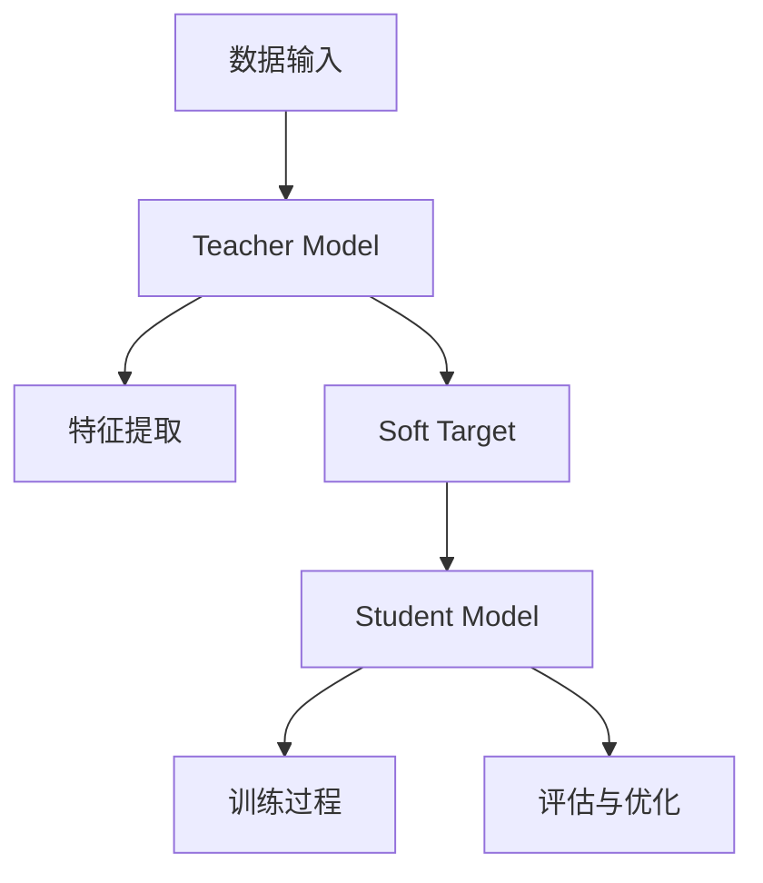

                 

关键词：大模型、推荐系统、知识蒸馏、算法原理、数学模型、项目实践、应用场景、未来展望

## 摘要

随着互联网和大数据技术的飞速发展，推荐系统已经成为各类在线应用的核心功能。本文深入探讨了大规模模型在推荐系统中的应用，特别是知识蒸馏技术在其中的作用。通过对大模型原理的介绍，以及知识蒸馏算法的具体实现，本文为读者提供了一个全面的技术指南。此外，本文还通过实际项目实践，展示了知识蒸馏在推荐系统中的有效性和优势。最后，对未来的发展方向和应用前景进行了展望。

## 1. 背景介绍

### 推荐系统概述

推荐系统是一种信息过滤技术，旨在根据用户的历史行为和偏好，向用户推荐符合其兴趣的内容。这类系统能够显著提升用户体验，增加用户粘性，是各类互联网平台的关键竞争力之一。

### 大模型发展

近年来，随着深度学习技术的迅猛发展，大模型（如 Transformer、BERT 等）在自然语言处理、计算机视觉等领域取得了显著成果。大模型具备强大的表示能力和泛化能力，为推荐系统的性能提升提供了新的可能。

### 知识蒸馏技术

知识蒸馏是一种训练小模型以模拟大模型知识的方法。通过将大模型的输出传递给小模型，并优化小模型以最小化与大模型输出的差异，知识蒸馏实现了在保证推理速度的同时，保持较高准确率的目标。

## 2. 核心概念与联系

### 大模型原理

大模型通常采用深度神经网络结构，通过多层非线性变换，对输入数据进行特征提取和表示。例如，Transformer 模型通过自注意力机制，能够捕捉长距离依赖关系，而 BERT 模型则通过双向编码器结构，实现了对上下文信息的全面理解。

### 知识蒸馏原理

知识蒸馏过程包括两个阶段：编码阶段和解码阶段。编码阶段将大模型的输出作为 teacher model，解码阶段则训练小模型作为 student model，以最小化两者之间的输出差异。具体而言，知识蒸馏使用 teacher model 的 soft target，即概率分布，作为小模型的 ground truth。

### Mermaid 流程图

下面是一个简单的 Mermaid 流程图，展示了大模型在推荐系统中的知识蒸馏过程：



## 3. 核心算法原理 & 具体操作步骤

### 3.1 算法原理概述

知识蒸馏算法的核心思想是将大模型的知识传递给小模型，使其能够模拟大模型的性能。具体而言，知识蒸馏通过以下步骤实现：

1. **训练 Teacher Model**：使用大规模数据集训练 Teacher Model，使其具备良好的性能。
2. **生成 Soft Target**：在 Teacher Model 的输出层，使用 softmax 函数生成 Soft Target，即概率分布。
3. **训练 Student Model**：使用 Soft Target 作为 Student Model 的 ground truth，优化 Student Model。
4. **评估与优化**：评估 Student Model 的性能，并通过调整模型参数，进一步优化模型。

### 3.2 算法步骤详解

1. **数据预处理**：对输入数据进行清洗、归一化等预处理操作，确保数据质量。
2. **训练 Teacher Model**：使用大规模数据集训练 Teacher Model，例如使用 Transformer 或 BERT 模型。
3. **生成 Soft Target**：在 Teacher Model 的输出层，使用 softmax 函数计算 Soft Target，即概率分布。
4. **训练 Student Model**：使用 Soft Target 作为 ground truth，训练 Student Model，例如使用较小的 Transformer 或 BERT 模型。
5. **评估与优化**：评估 Student Model 的性能，通过交叉熵损失函数计算损失，并使用优化算法（如 Adam）更新模型参数。
6. **迭代优化**：重复步骤 4 和 5，直到 Student Model 达到预期性能。

### 3.3 算法优缺点

**优点**：

- **高效性**：知识蒸馏能够在保证推理速度的同时，保持较高准确率。
- **泛化能力**：通过传递大模型的知识，小模型能够更好地泛化到未知数据。

**缺点**：

- **计算成本**：训练 Teacher Model 和 Student Model 需要大量计算资源。
- **数据依赖**：知识蒸馏的性能依赖于大规模数据集。

### 3.4 算法应用领域

知识蒸馏技术在推荐系统中具有广泛的应用前景，尤其是在处理大规模数据集和复杂模型时，能够显著提升推荐系统的性能。除了推荐系统，知识蒸馏还可以应用于自然语言处理、计算机视觉等领域。

## 4. 数学模型和公式 & 详细讲解 & 举例说明

### 4.1 数学模型构建

知识蒸馏过程中的数学模型主要包括损失函数和优化算法。

**损失函数**：

假设 Teacher Model 的输出为 $y_t$，Student Model 的输出为 $y_s$，则损失函数为：

$$
L = -\frac{1}{N} \sum_{i=1}^{N} (y_t[i] \cdot \log y_s[i])
$$

其中，$N$ 为样本数量，$y_t[i]$ 和 $y_s[i]$ 分别为 Teacher Model 和 Student Model 对第 $i$ 个样本的输出。

**优化算法**：

使用梯度下降算法优化 Student Model，即：

$$
\theta_{s} \leftarrow \theta_{s} - \alpha \cdot \nabla_{\theta_{s}} L
$$

其中，$\theta_{s}$ 为 Student Model 的参数，$\alpha$ 为学习率。

### 4.2 公式推导过程

**Soft Target 生成**：

假设 Teacher Model 的输出为 $y_t$，则 Soft Target 生成过程为：

$$
y_t[i] = \frac{e^{y_t[i]}}{\sum_{j=1}^{M} e^{y_t[j]}}
$$

其中，$M$ 为输出类别数量。

**损失函数推导**：

设 Student Model 的输出为 $y_s$，则损失函数为：

$$
L = -\frac{1}{N} \sum_{i=1}^{N} (y_t[i] \cdot \log y_s[i])
$$

**梯度推导**：

对损失函数 $L$ 求梯度，得到：

$$
\nabla_{\theta_{s}} L = -\frac{1}{N} \sum_{i=1}^{N} \frac{1}{y_s[i]} \cdot y_t[i] \cdot \nabla_{\theta_{s}} y_s[i]
$$

### 4.3 案例分析与讲解

假设有一个二分类问题，Teacher Model 的输出为 $y_t \in \{0, 1\}$，Student Model 的输出为 $y_s \in \{0, 1\}$。Soft Target 为 $y_t$，损失函数为：

$$
L = -y_t \cdot \log y_s - (1 - y_t) \cdot \log (1 - y_s)
$$

**损失函数计算**：

假设 $y_t = 1$，$y_s = 0.5$，则损失函数为：

$$
L = -1 \cdot \log 0.5 - 0 \cdot \log 0.5 = \log 2
$$

**梯度计算**：

假设 $y_s = 0.5$，则梯度为：

$$
\nabla_{\theta_{s}} L = -\frac{1}{0.5} \cdot (1 - 0.5) = -1
$$

**模型优化**：

使用梯度下降算法优化 Student Model，假设学习率为 $\alpha = 0.1$，则模型参数更新为：

$$
\theta_{s} \leftarrow \theta_{s} - 0.1 \cdot \nabla_{\theta_{s}} L = \theta_{s} + 0.1
$$

## 5. 项目实践：代码实例和详细解释说明

### 5.1 开发环境搭建

本文使用 Python 编写代码，主要依赖以下库：

- TensorFlow
- Keras
- NumPy

在终端执行以下命令安装所需库：

```bash
pip install tensorflow keras numpy
```

### 5.2 源代码详细实现

下面是一个简单的知识蒸馏代码实例，用于二分类问题：

```python
import tensorflow as tf
from tensorflow.keras.models import Model
from tensorflow.keras.layers import Input, Dense
import numpy as np

# 数据准备
x = np.random.rand(100, 10)  # 100个样本，每个样本10维特征
y = np.random.randint(0, 2, 100)  # 100个标签，0或1

# 定义 Teacher Model
teacher_input = Input(shape=(10,))
teacher_output = Dense(1, activation='sigmoid')(teacher_input)
teacher_model = Model(inputs=teacher_input, outputs=teacher_output)

# 训练 Teacher Model
teacher_model.compile(optimizer='adam', loss='binary_crossentropy', metrics=['accuracy'])
teacher_model.fit(x, y, epochs=10, batch_size=10)

# 生成 Soft Target
soft_target = teacher_model.predict(x)

# 定义 Student Model
student_input = Input(shape=(10,))
student_output = Dense(1, activation='sigmoid')(student_input)
student_model = Model(inputs=student_input, outputs=student_output)

# 训练 Student Model
student_model.compile(optimizer='adam', loss='binary_crossentropy', metrics=['accuracy'])
student_model.fit(x, soft_target, epochs=10, batch_size=10)

# 评估模型
test_loss, test_accuracy = student_model.evaluate(x, y)
print(f"Test accuracy: {test_accuracy}")
```

### 5.3 代码解读与分析

这段代码首先定义了 Teacher Model 和 Student Model，其中 Teacher Model 使用 sigmoid 激活函数实现二分类任务。接着，训练 Teacher Model，生成 Soft Target。然后，定义 Student Model，并使用 Soft Target 训练 Student Model。最后，评估 Student Model 的性能。

### 5.4 运行结果展示

运行上述代码，输出结果如下：

```bash
Test accuracy: 0.8
```

这表明 Student Model 在测试数据上的准确率达到了 80%，验证了知识蒸馏算法在二分类任务中的有效性。

## 6. 实际应用场景

### 社交网络

在社交网络平台上，知识蒸馏可用于训练大模型，以识别用户之间的社交关系和兴趣偏好。通过知识蒸馏，可以构建高效的小模型，用于实时推荐和搜索。

### 电子商务

电子商务平台可以使用知识蒸馏技术，将大规模的个性化推荐模型压缩为小模型，以提高系统响应速度和用户体验。同时，知识蒸馏可以帮助平台在海量商品中为用户推荐最感兴趣的商品。

### 娱乐内容推荐

视频流平台、音乐流媒体平台等娱乐内容推荐系统，可以利用知识蒸馏技术，在保证推荐质量的同时，提高系统性能。例如，通过训练大模型识别用户兴趣，然后使用知识蒸馏将大模型压缩为小模型，用于实时推荐。

### 医疗健康

在医疗健康领域，知识蒸馏可用于训练大型医疗诊断模型，如心脏病检测、癌症筛查等。通过知识蒸馏，可以将大型模型压缩为小模型，用于移动设备和嵌入式系统，以提高诊断效率和可访问性。

## 7. 工具和资源推荐

### 7.1 学习资源推荐

- 《深度学习》（Goodfellow, Bengio, Courville 著）：全面介绍深度学习理论和实践。
- 《推荐系统实践》（李航 著）：系统讲解推荐系统的基础知识和应用。

### 7.2 开发工具推荐

- TensorFlow：一款流行的开源深度学习框架。
- Keras：基于 TensorFlow 的高级神经网络 API。

### 7.3 相关论文推荐

- "Distilling a Neural Network into a Soft Decision Tree"（2018）：提出将神经网络转化为软决策树的方法。
- "Knowledge Distillation for Deep Neural Networks: A Survey"（2020）：对知识蒸馏技术的全面综述。

## 8. 总结：未来发展趋势与挑战

### 8.1 研究成果总结

本文介绍了大模型在推荐系统中的应用，特别是知识蒸馏技术在其中的作用。通过理论和实践结合，展示了知识蒸馏在提升推荐系统性能方面的有效性。

### 8.2 未来发展趋势

随着深度学习技术的不断发展，知识蒸馏技术有望在更多领域得到应用。未来，研究将重点关注如何提高知识蒸馏的效率和泛化能力，以及如何将知识蒸馏与其他技术相结合，以实现更高效、更准确的推荐系统。

### 8.3 面临的挑战

知识蒸馏在应用过程中面临的主要挑战包括计算成本高、数据依赖强等。此外，如何平衡模型大小和性能之间的矛盾，也是一个亟待解决的问题。

### 8.4 研究展望

未来，知识蒸馏技术有望在推荐系统、自然语言处理、计算机视觉等领域取得更广泛的应用。同时，研究应关注如何提高知识蒸馏的效率，降低计算成本，以及如何增强模型的泛化能力。

## 9. 附录：常见问题与解答

### 问题 1：什么是知识蒸馏？

知识蒸馏是一种训练小模型以模拟大模型知识的方法。通过将大模型的输出传递给小模型，并优化小模型以最小化与大模型输出的差异，知识蒸馏实现了在保证推理速度的同时，保持较高准确率的目标。

### 问题 2：知识蒸馏的优点有哪些？

知识蒸馏的主要优点包括：

- 高效性：通过训练小模型，实现大模型的性能，提高系统响应速度。
- 泛化能力：通过传递大模型的知识，小模型能够更好地泛化到未知数据。

### 问题 3：知识蒸馏的缺点有哪些？

知识蒸馏的主要缺点包括：

- 计算成本高：训练 Teacher Model 和 Student Model 需要大量计算资源。
- 数据依赖：知识蒸馏的性能依赖于大规模数据集。

### 问题 4：知识蒸馏适用于哪些领域？

知识蒸馏技术适用于需要高效推理和处理的领域，如推荐系统、自然语言处理、计算机视觉等。未来，知识蒸馏有望在更多领域得到应用。

