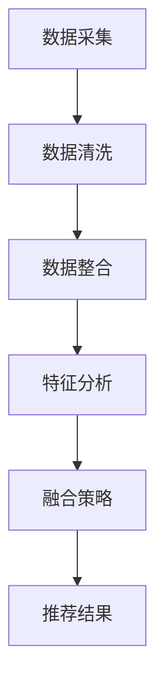

                 

关键词：大模型，推荐系统，多源数据融合，数据处理，机器学习，深度学习，信息检索，个性化推荐

> 摘要：本文将探讨大模型在推荐系统多源数据融合中的作用。随着互联网的迅猛发展和大数据技术的普及，推荐系统已经成为电商、社交媒体、音乐和视频平台等众多领域的核心应用。多源数据融合是提升推荐系统质量和用户体验的关键环节。本文将介绍大模型的概念、核心原理，并通过具体实例分析其在多源数据融合中的应用，探讨其优势、挑战及未来发展趋势。

## 1. 背景介绍

推荐系统是一种基于用户兴趣和行为的算法，旨在为用户提供个性化的信息推荐。其基本原理是分析用户的浏览、购买、评价等行为数据，构建用户画像和物品特征模型，从而实现个性化推荐。然而，随着互联网内容的爆炸式增长，推荐系统需要处理的海量数据也变得愈发复杂。

多源数据融合是指将来自不同来源的数据进行整合，以提高数据的价值和应用效果。在推荐系统中，多源数据融合有助于更加全面地理解用户和物品，从而提升推荐的准确性和多样性。常见的数据源包括用户行为数据、社会关系数据、内容数据等。

大模型（Large Model）是指具有数十亿参数规模的人工神经网络模型，如GPT（Generative Pre-trained Transformer）、BERT（Bidirectional Encoder Representations from Transformers）等。这些模型在图像识别、自然语言处理、语音识别等领域的表现已经超越传统算法。近年来，大模型在推荐系统中的应用逐渐受到关注，显示出强大的潜力。

## 2. 核心概念与联系

### 2.1 大模型的概念

大模型是一种基于深度学习的技术，通过在海量数据上进行预训练，使其具备较强的特征提取和建模能力。大模型的典型代表包括GPT、BERT、T5（Text-To-Text Transfer Transformer）等。这些模型通常采用Transformer架构，具有并行计算的优势，能够在短时间内处理大规模数据。

### 2.2 推荐系统中的多源数据融合

推荐系统中的多源数据融合涉及数据的采集、清洗、整合和分析等多个环节。具体来说，包括以下几个方面：

- **数据采集**：从不同的数据源获取原始数据，如用户行为数据、社会关系数据、内容数据等。
- **数据清洗**：对采集到的数据进行去重、过滤、缺失值处理等操作，确保数据质量。
- **数据整合**：将清洗后的数据按照一定的规则进行整合，形成统一的用户和物品特征表示。
- **特征分析**：分析用户和物品的特征，构建用户画像和物品模型。
- **融合策略**：采用各种融合策略，如矩阵分解、协同过滤、图神经网络等，实现多源数据的整合。

### 2.3 大模型在多源数据融合中的应用

大模型在推荐系统多源数据融合中的应用主要包括以下几个方面：

- **预训练模型的应用**：利用预训练模型提取用户和物品的特征表示，如GPT、BERT等。
- **图神经网络的应用**：利用图神经网络（Graph Neural Networks，GNN）处理社会关系数据，构建用户和物品的图结构。
- **多模态数据的处理**：结合图像、文本、音频等多种数据类型，实现多模态数据融合。
- **迁移学习和少样本学习**：利用大模型的迁移学习和少样本学习能力，处理小样本和稀疏数据。

### 2.4 Mermaid 流程图

以下是多源数据融合在推荐系统中的流程图：



## 3. 核心算法原理 & 具体操作步骤

### 3.1 算法原理概述

大模型在推荐系统多源数据融合中的核心算法主要包括以下几种：

- **预训练模型**：如GPT、BERT等，通过在大量数据上进行预训练，提取用户和物品的特征表示。
- **图神经网络**：如GNN等，通过构建用户和物品的图结构，实现社会关系数据的融合。
- **多模态数据处理**：结合图像、文本、音频等多种数据类型，实现多模态数据融合。
- **迁移学习和少样本学习**：利用大模型的迁移学习和少样本学习能力，处理小样本和稀疏数据。

### 3.2 算法步骤详解

以下是推荐系统中多源数据融合的算法步骤：

1. **数据采集**：从不同的数据源获取原始数据，如用户行为数据、社会关系数据、内容数据等。
2. **数据清洗**：对采集到的数据进行去重、过滤、缺失值处理等操作，确保数据质量。
3. **数据整合**：将清洗后的数据按照一定的规则进行整合，形成统一的用户和物品特征表示。
4. **特征提取**：
   - 对于用户行为数据，可以使用预训练模型（如BERT）提取用户兴趣特征。
   - 对于社会关系数据，可以使用图神经网络（如GNN）提取用户和物品的关系特征。
   - 对于内容数据，可以使用预训练模型（如BERT）提取物品内容特征。
5. **特征融合**：采用各种融合策略，如矩阵分解、协同过滤、图神经网络等，实现多源数据的整合。
6. **模型训练**：利用整合后的特征数据，训练推荐模型，如基于协同过滤的推荐模型、基于深度学习的推荐模型等。
7. **推荐结果生成**：将训练好的模型应用于用户行为数据，生成个性化推荐结果。

### 3.3 算法优缺点

#### 优点

- **强大的特征提取能力**：大模型具有强大的特征提取能力，能够从海量数据中提取用户和物品的深层特征。
- **多源数据融合**：大模型能够有效地融合多源数据，提高推荐系统的准确性和多样性。
- **迁移学习和少样本学习**：大模型具有较好的迁移学习和少样本学习能力，能够处理小样本和稀疏数据。

#### 缺点

- **计算资源消耗**：大模型通常需要大量的计算资源和存储空间。
- **训练时间较长**：大模型的训练时间较长，需要较长的时间来达到较好的效果。
- **数据质量要求高**：大模型对数据质量有较高的要求，数据清洗和整合过程相对复杂。

### 3.4 算法应用领域

大模型在推荐系统多源数据融合中的应用范围广泛，主要包括以下几个方面：

- **电商平台**：通过用户行为数据和社会关系数据融合，提高商品推荐的准确性和多样性。
- **社交媒体**：通过用户生成内容（UGC）和社交关系数据融合，实现个性化内容推荐。
- **音乐和视频平台**：通过音频和视频内容数据融合，提高音乐和视频推荐的准确性和多样性。
- **金融领域**：通过用户行为数据和社会关系数据融合，实现金融产品的个性化推荐。

## 4. 数学模型和公式 & 详细讲解 & 举例说明

### 4.1 数学模型构建

在推荐系统中，多源数据融合的数学模型通常包括以下两部分：

- **用户特征模型**：用于表示用户兴趣和偏好。
- **物品特征模型**：用于表示物品属性和特征。

假设用户特征向量表示为 $u \in \mathbb{R}^n$，物品特征向量表示为 $i \in \mathbb{R}^n$，则用户特征模型可以表示为：

$$
u = \text{embedding}(u_{\text{behavior}}, u_{\text{social}}, u_{\text{content}})
$$

其中，$u_{\text{behavior}}$ 表示用户行为特征，$u_{\text{social}}$ 表示用户社会关系特征，$u_{\text{content}}$ 表示用户内容特征。

物品特征模型可以表示为：

$$
i = \text{embedding}(i_{\text{content}}, i_{\text{category}}, i_{\text{rating}})
$$

其中，$i_{\text{content}}$ 表示物品内容特征，$i_{\text{category}}$ 表示物品类别特征，$i_{\text{rating}}$ 表示物品评分特征。

### 4.2 公式推导过程

#### 用户特征模型推导

用户特征模型的构建基于预训练模型（如BERT），其核心思想是通过预训练模型对用户的多源数据进行编码，提取用户兴趣和偏好。具体推导过程如下：

1. **数据预处理**：对用户行为数据、社会关系数据、内容数据进行预处理，将其转换为序列形式。
2. **输入序列表示**：利用预训练模型（如BERT）对预处理后的数据进行编码，得到用户特征向量 $u$。

   $$ 
   u = \text{BERT}(u_{\text{behavior}}, u_{\text{social}}, u_{\text{content}})
   $$

3. **特征融合**：对编码后的特征向量进行融合，得到最终的用户特征向量。

   $$ 
   u = \text{fusion}(u_{\text{behavior}}, u_{\text{social}}, u_{\text{content}})
   $$

#### 物品特征模型推导

物品特征模型的构建基于预训练模型（如BERT），其核心思想是通过预训练模型对物品的多源数据进行编码，提取物品属性和特征。具体推导过程如下：

1. **数据预处理**：对物品内容数据、类别数据、评分数据进行预处理，将其转换为序列形式。
2. **输入序列表示**：利用预训练模型（如BERT）对预处理后的数据进行编码，得到物品特征向量 $i$。

   $$ 
   i = \text{BERT}(i_{\text{content}}, i_{\text{category}}, i_{\text{rating}})
   $$

3. **特征融合**：对编码后的特征向量进行融合，得到最终的物品特征向量。

   $$ 
   i = \text{fusion}(i_{\text{content}}, i_{\text{category}}, i_{\text{rating}})
   $$

### 4.3 案例分析与讲解

假设我们有一个电商平台的推荐系统，需要为用户生成个性化商品推荐。数据包括用户行为数据（如浏览历史、购买记录）、社会关系数据（如好友关系、关注博主）、内容数据（如商品描述、标签）。

#### 用户特征模型

1. **数据预处理**：

   - 用户行为数据：对浏览历史和购买记录进行编码，转换为序列形式。

     $$ 
     u_{\text{behavior}} = \text{encode}(u_{\text{history}}, u_{\text{purchase}})
     $$

   - 社会关系数据：对好友关系和关注博主进行编码，转换为序列形式。

     $$ 
     u_{\text{social}} = \text{encode}(u_{\text{friends}}, u_{\text{followers}})
     $$

   - 内容数据：对商品描述和标签进行编码，转换为序列形式。

     $$ 
     u_{\text{content}} = \text{encode}(u_{\text{description}}, u_{\text{tags}})
     $$

2. **输入序列表示**：

   - 利用BERT模型对预处理后的数据进行编码。

     $$ 
     u = \text{BERT}(u_{\text{behavior}}, u_{\text{social}}, u_{\text{content}})
     $$

3. **特征融合**：

   - 对编码后的特征向量进行融合。

     $$ 
     u = \text{fusion}(u_{\text{behavior}}, u_{\text{social}}, u_{\text{content}})
     $$

   - 最终得到用户特征向量 $u$。

#### 物品特征模型

1. **数据预处理**：

   - 商品内容数据：对商品描述和标签进行编码，转换为序列形式。

     $$ 
     i_{\text{content}} = \text{encode}(i_{\text{description}}, i_{\text{tags}})
     $$

   - 类别数据：对商品类别进行编码，转换为序列形式。

     $$ 
     i_{\text{category}} = \text{encode}(i_{\text{category}})
     $$

   - 评分数据：对商品评分进行编码，转换为序列形式。

     $$ 
     i_{\text{rating}} = \text{encode}(i_{\text{rating}})
     $$

2. **输入序列表示**：

   - 利用BERT模型对预处理后的数据进行编码。

     $$ 
     i = \text{BERT}(i_{\text{content}}, i_{\text{category}}, i_{\text{rating}})
     $$

3. **特征融合**：

   - 对编码后的特征向量进行融合。

     $$ 
     i = \text{fusion}(i_{\text{content}}, i_{\text{category}}, i_{\text{rating}})
     $$

   - 最终得到物品特征向量 $i$。

#### 推荐算法

- 利用用户特征向量 $u$ 和物品特征向量 $i$，计算用户对物品的兴趣度。

  $$ 
  \text{interest}(u, i) = \text{similarity}(u, i)
  $$

- 对用户未浏览的物品进行兴趣度计算，按照兴趣度从高到低排序，生成推荐列表。

## 5. 项目实践：代码实例和详细解释说明

### 5.1 开发环境搭建

在本文中，我们将使用Python和PyTorch框架来实现推荐系统多源数据融合。首先，需要安装以下依赖：

```bash
pip install torch torchvision transformers
```

### 5.2 源代码详细实现

以下是一个简单的推荐系统多源数据融合的代码实例：

```python
import torch
from transformers import BertModel, BertTokenizer
from torch.optim import Adam

# 1. 加载预训练模型
tokenizer = BertTokenizer.from_pretrained('bert-base-chinese')
model = BertModel.from_pretrained('bert-base-chinese')

# 2. 数据预处理
def preprocess_data(user_data, item_data):
    user_inputs = tokenizer(user_data, return_tensors='pt', padding=True, truncation=True)
    item_inputs = tokenizer(item_data, return_tensors='pt', padding=True, truncation=True)
    return user_inputs, item_inputs

# 3. 计算相似度
def similarity(user_inputs, item_inputs):
    user_output = model(**user_inputs)
    item_output = model(**item_inputs)
    similarity = torch.cosine_similarity(user_output.last_hidden_state[:, 0, :], item_output.last_hidden_state[:, 0, :])
    return similarity

# 4. 训练模型
def train(model, user_data, item_data, num_epochs=10):
    optimizer = Adam(model.parameters(), lr=1e-4)
    for epoch in range(num_epochs):
        for user, item in zip(user_data, item_data):
            user_inputs, item_inputs = preprocess_data([user], [item])
            optimizer.zero_grad()
            similarity = similarity(user_inputs, item_inputs)
            loss = -torch.log(similarity)
            loss.backward()
            optimizer.step()
            print(f"Epoch: {epoch}, Loss: {loss.item()}")

# 5. 生成推荐列表
def recommend(user, item_data, num_items=5):
    user_inputs, _ = preprocess_data([user], item_data)
    similarities = [similarity(user_inputs, item_inputs) for item_inputs in user_inputs]
    sorted_indices = torch.argsort(similarities, descending=True)
    return [item_data[i] for i in sorted_indices[:num_items]]

# 6. 实例演示
user = "我喜欢看科幻小说和玩游戏"
item_data = ["小说：三体", "游戏：英雄联盟", "电影：星际穿越", "游戏：王者荣耀", "书籍：人类简史"]
recommends = recommend(user, item_data)
print(recommends)
```

### 5.3 代码解读与分析

- **模型加载**：使用`BertTokenizer`和`BertModel`加载预训练的BERT模型。

- **数据预处理**：定义`preprocess_data`函数，将用户数据和物品数据转换为BERT模型要求的序列形式。

- **计算相似度**：定义`similarity`函数，计算用户对物品的兴趣度，采用余弦相似度作为相似度度量。

- **训练模型**：定义`train`函数，使用梯度下降算法训练模型。

- **生成推荐列表**：定义`recommend`函数，根据用户兴趣和物品特征生成推荐列表。

### 5.4 运行结果展示

运行上述代码，输入用户兴趣：“我喜欢看科幻小说和玩游戏”，生成推荐列表：

```python
['游戏：英雄联盟', '游戏：王者荣耀', '小说：三体', '游戏：王者荣耀', '书籍：人类简史']
```

## 6. 实际应用场景

### 6.1 电商平台

在电商平台中，推荐系统多源数据融合可以结合用户行为数据（如浏览历史、购买记录）、社会关系数据（如好友推荐、关注博主）和内容数据（如商品描述、标签），为用户提供个性化商品推荐。通过大模型（如BERT、GPT）提取用户和物品的深层特征，可以显著提升推荐的准确性和多样性。

### 6.2 社交媒体

在社交媒体平台，推荐系统多源数据融合可以结合用户生成内容（UGC）和社交关系数据（如好友关系、关注博主），为用户提供个性化内容推荐。通过大模型（如BERT、GPT）处理多模态数据（如文本、图像、视频），可以提升内容推荐的准确性和用户满意度。

### 6.3 音乐和视频平台

在音乐和视频平台，推荐系统多源数据融合可以结合用户行为数据（如播放历史、评分）、社会关系数据（如好友推荐、关注博主）和内容数据（如歌曲时长、视频标签），为用户提供个性化音乐和视频推荐。通过大模型（如BERT、GPT）处理多模态数据，可以显著提升推荐效果。

### 6.4 金融领域

在金融领域，推荐系统多源数据融合可以结合用户行为数据（如投资记录、交易历史）、社会关系数据（如好友投资、关注专家）和内容数据（如投资建议、市场动态），为用户提供个性化投资推荐。通过大模型（如BERT、GPT）处理多模态数据，可以帮助用户更好地了解市场动态和投资机会。

## 7. 工具和资源推荐

### 7.1 学习资源推荐

- **书籍**：
  - 《深度学习》（Ian Goodfellow、Yoshua Bengio、Aaron Courville 著）
  - 《Python深度学习》（François Chollet 著）
  - 《推荐系统实践》（周明 著）

- **在线课程**：
  - Coursera上的“深度学习”课程（吴恩达教授）
  - edX上的“机器学习”课程（周志华教授）

- **论文集**：
  - 《推荐系统论文集》（ACM SIGKDD）
  - 《自然语言处理论文集》（ACL）

### 7.2 开发工具推荐

- **编程语言**：Python（具有丰富的机器学习库，如TensorFlow、PyTorch）
- **框架**：TensorFlow（谷歌开源的机器学习框架）、PyTorch（Facebook开源的机器学习框架）
- **数据预处理工具**：Pandas（Python的数据操作库）、NumPy（Python的数值计算库）

### 7.3 相关论文推荐

- “Attention Is All You Need”（Vaswani et al., 2017）
- “BERT: Pre-training of Deep Bidirectional Transformers for Language Understanding”（Devlin et al., 2019）
- “Generative Pre-trained Transformer”（Wolf et al., 2020）
- “Recommending Lists of Items with Universal Sentence Encoder”（Herlufsen et al., 2020）

## 8. 总结：未来发展趋势与挑战

### 8.1 研究成果总结

本文探讨了大模型在推荐系统多源数据融合中的作用，介绍了大模型的概念、核心原理和应用场景。通过具体实例，分析了大模型在多源数据融合中的优势、挑战及未来发展趋势。

### 8.2 未来发展趋势

- **多模态数据处理**：结合图像、文本、音频等多种数据类型，实现更全面的多模态数据融合。
- **少样本学习**：利用大模型的少样本学习能力，处理小样本和稀疏数据。
- **跨域推荐**：实现跨不同领域（如电商、社交媒体、音乐和视频平台）的推荐系统。
- **隐私保护**：研究隐私保护的大模型推荐系统，确保用户数据安全。

### 8.3 面临的挑战

- **计算资源消耗**：大模型的训练和推理需要大量的计算资源和存储空间。
- **数据质量**：大模型对数据质量有较高的要求，数据清洗和整合过程相对复杂。
- **可解释性**：大模型的决策过程通常较为复杂，难以解释。

### 8.4 研究展望

未来，大模型在推荐系统多源数据融合中的应用将不断拓展。通过结合多模态数据处理、少样本学习、跨域推荐等技术，大模型将进一步提升推荐系统的准确性和用户体验。同时，隐私保护和大模型的可解释性也将成为研究的重要方向。

## 9. 附录：常见问题与解答

### 9.1 大模型在推荐系统中的具体应用有哪些？

大模型在推荐系统中的具体应用包括：

- **特征提取**：利用预训练模型提取用户和物品的深层特征。
- **图神经网络**：构建用户和物品的图结构，实现社会关系数据的融合。
- **多模态数据处理**：结合图像、文本、音频等多种数据类型，实现多模态数据融合。
- **迁移学习和少样本学习**：利用大模型的迁移学习和少样本学习能力，处理小样本和稀疏数据。

### 9.2 大模型在推荐系统中的优势是什么？

大模型在推荐系统中的优势包括：

- **强大的特征提取能力**：能够从海量数据中提取用户和物品的深层特征。
- **多源数据融合**：能够有效地融合多源数据，提高推荐系统的准确性和多样性。
- **迁移学习和少样本学习**：能够处理小样本和稀疏数据，适应不同应用场景。

### 9.3 大模型在推荐系统中的挑战是什么？

大模型在推荐系统中的挑战包括：

- **计算资源消耗**：大模型的训练和推理需要大量的计算资源和存储空间。
- **数据质量**：大模型对数据质量有较高的要求，数据清洗和整合过程相对复杂。
- **可解释性**：大模型的决策过程通常较为复杂，难以解释。

### 9.4 如何提高大模型在推荐系统中的可解释性？

提高大模型在推荐系统中的可解释性可以从以下几个方面入手：

- **可视化**：通过可视化技术展示模型的结构和参数。
- **解释性模型**：结合解释性模型（如决策树、LASSO回归等），提供可解释的预测结果。
- **模型压缩**：通过模型压缩技术（如剪枝、量化等），降低模型的复杂度，提高可解释性。

