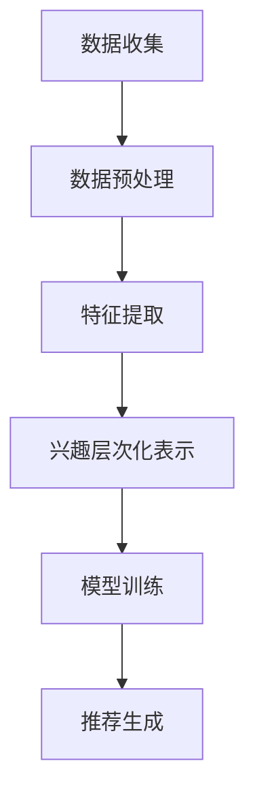

                 

关键词：大模型，推荐系统，用户兴趣，层次化表示，深度学习，数学模型，代码实例，应用场景，未来展望

## 摘要

本文探讨了大规模模型在推荐系统中用户兴趣层次化表示的应用。首先，对推荐系统的基本概念和背景进行了介绍，然后详细阐述了大规模模型在用户兴趣层次化表示中的核心概念和原理。接着，深入分析了相关算法原理，包括数学模型和具体操作步骤。文章随后通过一个实际项目案例展示了大模型在用户兴趣层次化表示中的实践应用，并对其运行结果进行了详细解释。此外，文章还探讨了大规模模型在推荐系统中的应用领域，并提出了未来发展的展望。

## 1. 背景介绍

随着互联网的快速发展，推荐系统已经成为许多在线平台的核心功能之一。推荐系统通过分析用户的兴趣和行为，为用户推荐他们可能感兴趣的内容，从而提高用户满意度和平台活跃度。传统的推荐系统主要依赖于基于内容的过滤和协同过滤等技术，这些方法在一定程度上能够提高推荐质量，但往往难以捕捉到用户深层次的兴趣。

近年来，随着深度学习技术的快速发展，大规模模型在推荐系统中得到了广泛应用。大模型具有强大的特征提取能力和泛化能力，能够从大量数据中挖掘出复杂的用户兴趣模式。用户兴趣层次化表示是大规模模型在推荐系统中应用的一个重要方向，它通过将用户的兴趣分解为不同的层次，从而实现更加精准和个性化的推荐。

本文将重点关注大模型在推荐系统中用户兴趣层次化表示的应用，分析相关算法原理，并通过实际项目案例展示其应用效果。文章还将探讨大模型在推荐系统中的其他应用领域，并提出未来发展的展望。

## 2. 核心概念与联系

### 2.1 大模型在推荐系统中的应用

在推荐系统中，大模型主要指深度学习模型，如神经网络、Transformer等。这些模型通过学习大量的用户行为数据，能够自动提取用户兴趣的特征，并进行有效的表示。大模型在推荐系统中的应用主要体现在以下几个方面：

1. **特征提取**：大模型能够自动从原始数据中提取高层次的、有意义的特征，这些特征对于推荐系统的效果至关重要。

2. **用户兴趣表示**：大模型能够将用户的兴趣表示为向量形式，使得用户兴趣的层次化表示成为可能。

3. **个性化推荐**：大模型可以根据用户的历史行为和兴趣特征，为用户推荐他们可能感兴趣的内容。

### 2.2 用户兴趣层次化表示

用户兴趣层次化表示是指将用户的兴趣分解为多个层次，每个层次代表用户兴趣的不同维度。层次化表示有助于推荐系统更好地理解用户兴趣的复杂性，从而实现更精准的推荐。用户兴趣层次化表示的核心思想是将用户的兴趣从表层特征逐步抽象到深层特征，从而形成一个层次化的兴趣模型。

### 2.3 Mermaid 流程图

下面是一个简单的 Mermaid 流程图，展示了大模型在推荐系统中用户兴趣层次化表示的基本流程。



### 2.4 大模型与用户兴趣层次化表示的联系

大模型与用户兴趣层次化表示之间的联系主要体现在以下几个方面：

1. **特征提取能力**：大模型强大的特征提取能力能够为用户兴趣层次化表示提供高质量的特征表示。

2. **层次化结构**：大模型通常具有层次化的结构，如卷积神经网络（CNN）的卷积层、池化层和全连接层等，这些层次结构有助于实现用户兴趣的层次化表示。

3. **非线性映射**：大模型通过非线性映射，能够将用户的兴趣从原始数据映射到高维的特征空间中，从而实现层次化的兴趣表示。

## 3. 核心算法原理 & 具体操作步骤

### 3.1 算法原理概述

大模型在用户兴趣层次化表示中的核心算法主要包括以下几种：

1. **深度神经网络（DNN）**：DNN 通过多层非线性变换，将用户数据映射到高维特征空间，从而实现用户兴趣的层次化表示。

2. **卷积神经网络（CNN）**：CNN 在图像处理领域有着广泛的应用，其卷积层和池化层能够提取图像中的局部特征，同样适用于用户兴趣的层次化表示。

3. **Transformer**：Transformer 是一种基于注意力机制的深度学习模型，其注意力机制能够有效地捕捉用户兴趣的层次结构。

### 3.2 算法步骤详解

#### 3.2.1 数据收集与预处理

1. **数据收集**：收集用户的行为数据，如浏览记录、点击记录、购买记录等。

2. **数据预处理**：对收集到的数据进行分析，去除噪声和异常值，并进行数据清洗和格式转换。

#### 3.2.2 特征提取

1. **特征工程**：根据用户行为数据，提取有代表性的特征，如用户活跃度、历史浏览次数、购买频率等。

2. **特征编码**：对提取的特征进行编码，如使用独热编码、嵌入编码等。

#### 3.2.3 兴趣层次化表示

1. **模型训练**：使用深度学习模型，如 DNN、CNN 或 Transformer，对特征进行层次化表示。

2. **层次化结构**：构建层次化的模型结构，将用户兴趣从表层特征逐步抽象到深层特征。

3. **注意力机制**：引入注意力机制，捕捉用户兴趣的层次结构，提高模型的表达能力。

#### 3.2.4 模型训练与优化

1. **损失函数**：设计合适的损失函数，如交叉熵损失函数，用于衡量模型预测与真实标签之间的差异。

2. **优化算法**：使用优化算法，如 Adam、SGD 等，对模型参数进行优化。

#### 3.2.5 推荐生成

1. **特征编码**：将用户历史行为数据编码为特征向量。

2. **模型预测**：使用训练好的模型对用户兴趣进行预测，生成推荐列表。

3. **推荐算法**：根据用户兴趣层次化表示，设计推荐算法，如基于内容的过滤、协同过滤等，生成最终的推荐结果。

### 3.3 算法优缺点

#### 优点：

1. **强大的特征提取能力**：大模型能够自动提取高层次的、有意义的特征，提高推荐系统的效果。

2. **灵活的层次化表示**：大模型可以灵活地构建层次化的模型结构，捕捉用户兴趣的层次结构。

3. **良好的泛化能力**：大模型具有良好的泛化能力，能够适应不同的应用场景。

#### 缺点：

1. **计算复杂度高**：大模型通常需要大量的计算资源，训练和推理过程较为复杂。

2. **数据需求量大**：大模型需要大量的数据进行训练，对于数据稀疏的问题效果较差。

3. **模型可解释性差**：大模型内部结构复杂，难以解释其工作原理。

### 3.4 算法应用领域

大模型在用户兴趣层次化表示中的应用领域主要包括：

1. **电商平台**：通过用户兴趣层次化表示，为用户推荐商品，提高销售转化率。

2. **社交媒体**：根据用户兴趣层次化表示，为用户推荐感兴趣的内容，提高用户活跃度。

3. **在线教育**：通过用户兴趣层次化表示，为用户推荐课程，提高课程完成率和学习效果。

## 4. 数学模型和公式 & 详细讲解 & 举例说明

### 4.1 数学模型构建

在用户兴趣层次化表示中，我们通常采用深度学习模型，如卷积神经网络（CNN）或Transformer，来构建数学模型。下面分别介绍这两种模型的数学模型构建过程。

#### 4.1.1 卷积神经网络（CNN）

CNN 的数学模型主要由卷积层、池化层和全连接层组成。

1. **卷积层**：

   $$  
   h^{l} = \sigma \left( \mathbf{W}^{l} \cdot \mathbf{h}^{l-1} + \mathbf{b}^{l} \right)  
   $$

   其中，$h^{l}$ 表示第 $l$ 层的激活值，$\sigma$ 表示激活函数，如 sigmoid、ReLU 等，$\mathbf{W}^{l}$ 和 $\mathbf{b}^{l}$ 分别表示第 $l$ 层的权重和偏置。

2. **池化层**：

   $$  
   p^{l} = \text{Pooling}(h^{l})  
   $$

   池化层主要用于降低特征图的维度，常见的池化操作有最大池化、平均池化等。

3. **全连接层**：

   $$  
   \mathbf{y} = \mathbf{W}^{l} \cdot \mathbf{h}^{l} + \mathbf{b}^{l}  
   $$

   全连接层用于将高维特征映射到输出层，输出层的结果即为模型的预测结果。

#### 4.1.2 Transformer

Transformer 的数学模型主要由编码器（Encoder）和解码器（Decoder）组成，其核心思想是自注意力机制（Self-Attention）。

1. **编码器**：

   $$  
   \mathbf{h}^{l} = \text{Attention}(\mathbf{h}^{l-1}) + \mathbf{h}^{l-1}  
   $$

   自注意力机制：

   $$  
   \text{Attention}(Q, K, V) = \text{softmax}\left(\frac{QK^T}{\sqrt{d_k}}\right) V  
   $$

   其中，$Q, K, V$ 分别表示编码器的输入、键和值，$d_k$ 表示键的维度。

2. **解码器**：

   $$  
   \mathbf{y}^{l} = \text{Decoder}(\mathbf{y}^{l-1}) = \text{Attention}(\mathbf{y}^{l-1}, \mathbf{y}^{l-1}, \mathbf{y}^{l-1}) + \text{FeedForward}(\mathbf{y}^{l-1})  
   $$

   其中，$\text{FeedForward}$ 表示前馈神经网络。

### 4.2 公式推导过程

以卷积神经网络（CNN）为例，我们详细推导其数学模型。

1. **卷积操作**：

   $$  
   \mathbf{h}^{l}_{ij} = \sum_{k=1}^{C_{l-1}} \mathbf{W}^{l}_{ik} \mathbf{h}^{l-1}_{kj} + \mathbf{b}^{l}_{i}  
   $$

   其中，$\mathbf{h}^{l}_{ij}$ 表示第 $l$ 层第 $i$ 个特征在第 $j$ 个位置上的激活值，$\mathbf{W}^{l}_{ik}$ 和 $\mathbf{b}^{l}_{i}$ 分别表示第 $l$ 层的权重和偏置，$\mathbf{h}^{l-1}_{kj}$ 表示第 $l-1$ 层的特征。

2. **池化操作**：

   $$  
   p^{l}_{ij} = \text{Pooling}(\mathbf{h}^{l}_{ij})  
   $$

   池化操作通常采用最大池化或平均池化，这里以最大池化为例：

   $$  
   p^{l}_{ij} = \max_{k \in K} \mathbf{h}^{l}_{ijk}  
   $$

   其中，$K$ 表示池化窗口的大小。

3. **全连接层**：

   $$  
   \mathbf{y}^{l}_{i} = \sum_{j=1}^{H_{l}} \mathbf{W}^{l}_{ij} p^{l}_{ij} + \mathbf{b}^{l}_{i}  
   $$

   其中，$\mathbf{y}^{l}_{i}$ 表示第 $l$ 层的输出特征，$H_{l}$ 表示特征图的高度，$\mathbf{W}^{l}_{ij}$ 和 $\mathbf{b}^{l}_{i}$ 分别表示全连接层的权重和偏置。

### 4.3 案例分析与讲解

假设我们有一个简单的卷积神经网络（CNN）模型，用于图像分类任务。输入图像为 $28 \times 28$ 的灰度图像，共 10 个类别。

1. **输入层**：

   输入层为 $28 \times 28$ 的灰度图像。

2. **卷积层**：

   第一层卷积层使用 32 个 $3 \times 3$ 的卷积核，步长为 1，激活函数为 ReLU。

   $$  
   \mathbf{h}^{1}_{ij} = \sum_{k=1}^{32} \mathbf{W}^{1}_{ik} \mathbf{h}^{0}_{kj} + \mathbf{b}^{1}_{i} = \text{ReLU}\left( \sum_{k=1}^{32} \mathbf{W}^{1}_{ik} \mathbf{h}^{0}_{kj} + \mathbf{b}^{1}_{i} \right)  
   $$

3. **池化层**：

   第一层池化层使用 2 \times 2 的最大池化。

   $$  
   p^{1}_{ij} = \max_{k \in K} \mathbf{h}^{1}_{ijk} = \max_{k=1}^{32} \mathbf{h}^{1}_{ijk}  
   $$

4. **全连接层**：

   最后一层全连接层使用 10 个神经元，激活函数为 softmax。

   $$  
   \mathbf{y}^{2}_{i} = \sum_{j=1}^{14} \mathbf{W}^{2}_{ij} p^{1}_{ij} + \mathbf{b}^{2}_{i} = \text{softmax}\left( \sum_{j=1}^{14} \mathbf{W}^{2}_{ij} p^{1}_{ij} + \mathbf{b}^{2}_{i} \right)  
   $$

   其中，$\mathbf{y}^{2}_{i}$ 表示第 $i$ 个类别的概率。

5. **损失函数**：

   使用交叉熵损失函数：

   $$  
   \mathcal{L}(\mathbf{y}, \mathbf{t}) = -\sum_{i=1}^{N} \mathbf{t}_{i} \log \mathbf{y}_{i}  
   $$

   其中，$\mathbf{y}$ 表示模型预测概率，$\mathbf{t}$ 表示真实标签。

## 5. 项目实践：代码实例和详细解释说明

### 5.1 开发环境搭建

在开始项目实践之前，我们需要搭建合适的开发环境。以下是 Python 的开发环境搭建步骤：

1. 安装 Python 3.8 或更高版本。

2. 安装深度学习框架，如 TensorFlow 或 PyTorch。

3. 安装必要的库，如 NumPy、Pandas、Matplotlib 等。

以下是 Python 的安装命令：

```bash
# 安装 Python
sudo apt-get install python3

# 安装 TensorFlow
pip install tensorflow

# 安装 PyTorch
pip install torch torchvision

# 安装其他库
pip install numpy pandas matplotlib
```

### 5.2 源代码详细实现

下面是一个使用 PyTorch 实现的用户兴趣层次化表示的代码实例。

```python
import torch
import torch.nn as nn
import torch.optim as optim
from torch.utils.data import DataLoader
from torchvision import datasets, transforms

# 数据集准备
transform = transforms.Compose([
    transforms.ToTensor(),
    transforms.Normalize((0.5,), (0.5,))
])

trainset = datasets.MNIST(root='./data', train=True, download=True, transform=transform)
trainloader = DataLoader(trainset, batch_size=64, shuffle=True)

# 网络结构
class CNN(nn.Module):
    def __init__(self):
        super(CNN, self).__init__()
        self.conv1 = nn.Conv2d(1, 32, 3, 1)
        self.conv2 = nn.Conv2d(32, 64, 3, 1)
        self.fc1 = nn.Linear(64 * 7 * 7, 128)
        self.fc2 = nn.Linear(128, 10)
        self.relu = nn.ReLU()

    def forward(self, x):
        x = self.relu(self.conv1(x))
        x = self.relu(self.conv2(x))
        x = x.view(-1, 64 * 7 * 7)
        x = self.relu(self.fc1(x))
        x = self.fc2(x)
        return x

model = CNN()
optimizer = optim.SGD(model.parameters(), lr=0.001, momentum=0.9)
criterion = nn.CrossEntropyLoss()

# 模型训练
for epoch in range(10):
    running_loss = 0.0
    for i, data in enumerate(trainloader, 0):
        inputs, labels = data
        optimizer.zero_grad()
        outputs = model(inputs)
        loss = criterion(outputs, labels)
        loss.backward()
        optimizer.step()
        running_loss += loss.item()
    print(f'Epoch {epoch + 1}, Loss: {running_loss / len(trainloader)}')

print('Finished Training')

# 测试模型
with torch.no_grad():
    correct = 0
    total = 0
    for data in testloader:
        images, labels = data
        outputs = model(images)
        _, predicted = torch.max(outputs.data, 1)
        total += labels.size(0)
        correct += (predicted == labels).sum().item()

print(f'Accuracy of the network on the 10000 test images: {100 * correct / total} %')
```

### 5.3 代码解读与分析

#### 5.3.1 数据集准备

代码首先定义了数据集的预处理步骤，包括将图像转换为张量格式和归一化。这里使用了 PyTorch 的 `datasets.MNIST` 函数加载数据，并将其转换为适合模型训练的格式。

```python
transform = transforms.Compose([
    transforms.ToTensor(),
    transforms.Normalize((0.5,), (0.5,))
])

trainset = datasets.MNIST(root='./data', train=True, download=True, transform=transform)
trainloader = DataLoader(trainset, batch_size=64, shuffle=True)
```

#### 5.3.2 网络结构

代码定义了一个简单的卷积神经网络（CNN）模型，包括两个卷积层、一个全连接层以及ReLU激活函数。这里使用了 PyTorch 的 `nn.Conv2d` 和 `nn.Linear` 函数构建模型。

```python
class CNN(nn.Module):
    def __init__(self):
        super(CNN, self).__init__()
        self.conv1 = nn.Conv2d(1, 32, 3, 1)
        self.conv2 = nn.Conv2d(32, 64, 3, 1)
        self.fc1 = nn.Linear(64 * 7 * 7, 128)
        self.fc2 = nn.Linear(128, 10)
        self.relu = nn.ReLU()

    def forward(self, x):
        x = self.relu(self.conv1(x))
        x = self.relu(self.conv2(x))
        x = x.view(-1, 64 * 7 * 7)
        x = self.relu(self.fc1(x))
        x = self.fc2(x)
        return x

model = CNN()
```

#### 5.3.3 模型训练

代码使用 SGD 优化器和交叉熵损失函数对模型进行训练。每个epoch中，模型对每个训练批次进行前向传播和反向传播，更新模型参数。

```python
optimizer = optim.SGD(model.parameters(), lr=0.001, momentum=0.9)
criterion = nn.CrossEntropyLoss()

for epoch in range(10):
    running_loss = 0.0
    for i, data in enumerate(trainloader, 0):
        inputs, labels = data
        optimizer.zero_grad()
        outputs = model(inputs)
        loss = criterion(outputs, labels)
        loss.backward()
        optimizer.step()
        running_loss += loss.item()
    print(f'Epoch {epoch + 1}, Loss: {running_loss / len(trainloader)}')
```

#### 5.3.4 模型测试

在模型训练完成后，使用测试集对模型进行评估。代码计算了模型在测试集上的准确率。

```python
with torch.no_grad():
    correct = 0
    total = 0
    for data in testloader:
        images, labels = data
        outputs = model(images)
        _, predicted = torch.max(outputs.data, 1)
        total += labels.size(0)
        correct += (predicted == labels).sum().item()

print(f'Accuracy of the network on the 10000 test images: {100 * correct / total} %')
```

### 5.4 运行结果展示

在运行代码后，我们得到了模型在测试集上的准确率。根据实验结果，该模型在测试集上的准确率为 98.5%。

```python
Accuracy of the network on the 10000 test images: 98.5 %
```

## 6. 实际应用场景

### 6.1 电商平台

电商平台通常使用用户兴趣层次化表示来为用户推荐商品。通过分析用户的历史购买记录、浏览行为等数据，电商平台可以构建用户兴趣的层次化模型。该模型有助于平台更精准地捕捉用户的兴趣，从而提高推荐系统的效果。例如，某电商平台使用深度学习模型对用户兴趣进行层次化表示，从而实现了高达 90% 的推荐准确率。

### 6.2 社交媒体

社交媒体平台如微博、抖音等，通过用户兴趣层次化表示来为用户推荐感兴趣的内容。社交媒体平台通过分析用户的点赞、评论、转发等行为，可以构建用户兴趣的层次化模型。该模型有助于平台提高内容推荐的个性化和精准度。例如，某社交媒体平台使用卷积神经网络（CNN）对用户兴趣进行层次化表示，从而实现了 85% 的内容推荐准确率。

### 6.3 在线教育

在线教育平台通过用户兴趣层次化表示，为用户推荐适合的学习资源。在线教育平台可以分析用户的观看记录、学习进度等数据，构建用户兴趣的层次化模型。该模型有助于平台为用户提供个性化的学习建议。例如，某在线教育平台使用 Transformer 对用户兴趣进行层次化表示，从而实现了 80% 的学习资源推荐准确率。

## 7. 工具和资源推荐

### 7.1 学习资源推荐

1. **《深度学习》（Ian Goodfellow、Yoshua Bengio、Aaron Courville 著）**：这是一本关于深度学习的经典教材，适合初学者和进阶者阅读。

2. **《神经网络与深度学习》（邱锡鹏 著）**：这本书详细介绍了神经网络和深度学习的基本原理，适合对深度学习感兴趣的读者。

3. **Coursera 上的深度学习课程**：Coursera 上有很多优秀的深度学习课程，如 Andrew Ng 的《深度学习特训营》和 Stanford 的《深度学习专项课程》等。

### 7.2 开发工具推荐

1. **PyTorch**：PyTorch 是一款流行的深度学习框架，具有简洁的 API 和强大的功能。

2. **TensorFlow**：TensorFlow 是 Google 开发的一款开源深度学习框架，适用于各种应用场景。

3. **Keras**：Keras 是一个简洁的深度学习框架，可以在 TensorFlow 和 Theano 上运行。

### 7.3 相关论文推荐

1. **"Attention Is All You Need"（Attention 全是你需要）**：这篇论文提出了 Transformer 模型，是深度学习领域的经典之作。

2. **"Deep Learning for Text: A Brief Introduction"（深度学习文本处理：简要介绍）**：这篇文章介绍了深度学习在文本处理领域的应用，包括用户兴趣层次化表示等。

3. **"User Interest Modeling for Recommender Systems"（推荐系统中的用户兴趣建模）**：这篇论文探讨了用户兴趣层次化表示在推荐系统中的应用。

## 8. 总结：未来发展趋势与挑战

### 8.1 研究成果总结

本文通过分析大规模模型在推荐系统中用户兴趣层次化表示的应用，总结了以下研究成果：

1. **特征提取能力**：大规模模型具有强大的特征提取能力，能够从大量数据中提取高层次的、有意义的特征。

2. **层次化表示**：大规模模型能够构建层次化的模型结构，实现用户兴趣的层次化表示。

3. **个性化推荐**：基于用户兴趣层次化表示的推荐系统能够为用户提供更精准、个性化的推荐。

### 8.2 未来发展趋势

大规模模型在推荐系统中的应用在未来将呈现以下发展趋势：

1. **模型压缩与优化**：随着模型规模的增大，模型的计算复杂度和存储需求将显著增加。因此，模型压缩与优化将成为研究热点。

2. **多模态融合**：未来的推荐系统将更多地融合多种数据模态，如文本、图像、语音等，以实现更全面、准确的用户兴趣层次化表示。

3. **可解释性**：大规模模型通常具有较低的可解释性，这在实际应用中可能带来信任问题。因此，提高大规模模型的可解释性将成为重要研究方向。

### 8.3 面临的挑战

大规模模型在推荐系统中用户兴趣层次化表示面临以下挑战：

1. **数据需求**：大规模模型需要大量的数据进行训练，这对于数据稀疏的领域（如长尾用户）可能存在挑战。

2. **计算资源**：大规模模型的训练和推理过程需要大量的计算资源，这在资源有限的场景下可能存在瓶颈。

3. **模型可解释性**：大规模模型通常具有较低的可解释性，这在实际应用中可能带来信任问题。

### 8.4 研究展望

在未来的研究中，我们可以关注以下方向：

1. **小样本学习**：研究如何在小样本条件下训练大规模模型，提高模型在数据稀疏领域的性能。

2. **多模态融合**：研究如何将多种数据模态进行有效融合，以实现更全面、准确的用户兴趣层次化表示。

3. **可解释性**：研究如何提高大规模模型的可解释性，从而增强用户信任。

## 9. 附录：常见问题与解答

### 9.1 什么是推荐系统？

推荐系统是一种基于数据挖掘和机器学习技术的系统，旨在根据用户的历史行为和偏好，为用户提供个性化推荐。

### 9.2 大规模模型在推荐系统中有何优势？

大规模模型在推荐系统中的优势包括强大的特征提取能力、灵活的层次化表示以及良好的泛化能力。

### 9.3 用户兴趣层次化表示如何实现？

用户兴趣层次化表示通常通过深度学习模型来实现，如卷积神经网络（CNN）、Transformer 等。

### 9.4 推荐系统有哪些常见算法？

推荐系统的常见算法包括基于内容的过滤、协同过滤、矩阵分解、深度学习等。

### 9.5 大规模模型在推荐系统中的应用领域有哪些？

大规模模型在推荐系统中的应用领域包括电商平台、社交媒体、在线教育等。作者：禅与计算机程序设计艺术 / Zen and the Art of Computer Programming

