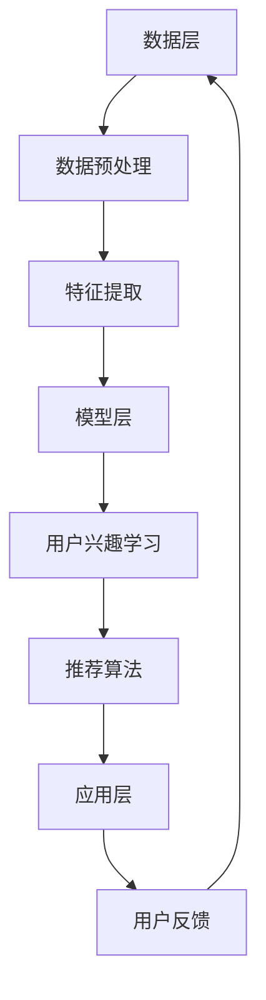

                 

关键词：大模型、推荐系统、用户兴趣、稀疏性问题、算法原理、数学模型、应用实践、未来展望

## 摘要

本文主要探讨了在大模型时代下，如何解决推荐系统中的用户兴趣稀疏性问题。随着互联网用户数量的爆炸性增长，用户生成的内容和数据变得非常庞大，导致用户兴趣数据呈现出高度的稀疏性。传统推荐算法在面对这样的问题时表现不佳，而大模型由于其强大的表示能力和学习能力，为解决这一问题提供了新的思路和方法。本文将深入分析大模型在推荐系统中的应用，介绍其核心算法原理，并给出具体的数学模型和实现步骤。同时，还将通过实际项目实践展示大模型在推荐系统中的效果，并对未来的发展趋势和挑战进行展望。

## 1. 背景介绍

### 1.1 推荐系统的定义和作用

推荐系统（Recommender System）是一种利用数据挖掘和机器学习技术，根据用户的兴趣和行为，为其推荐相关内容或商品的系统。推荐系统在电商、社交媒体、新闻推送等领域都有着广泛的应用，其目的是提高用户的满意度，增加用户的粘性和活跃度，从而提升企业的业务效益。

### 1.2 推荐系统的发展历程

推荐系统的发展可以分为三个阶段：

1. **基于内容的推荐（Content-based Filtering）**：早期的推荐系统主要依赖于内容的相似性来推荐。例如，如果一个用户喜欢一篇文章，系统就会推荐其他与这篇文章内容相似的文章。

2. **协同过滤（Collaborative Filtering）**：协同过滤通过分析用户之间的行为模式来推荐。其核心思想是“人以群分”，即拥有相似兴趣的用户可能会对相同的内容感兴趣。

3. **混合推荐（Hybrid Recommender Systems）**：随着推荐系统的发展，混合推荐系统应运而生。混合推荐系统结合了基于内容推荐和协同过滤的优点，通过综合多种信息来进行推荐，从而提高了推荐的准确性和多样性。

### 1.3 推荐系统中的用户兴趣稀疏性问题

用户兴趣数据的稀疏性是指用户的行为数据分布非常稀疏，这意味着大多数用户对大多数项目都没有兴趣，只有一小部分用户对一小部分项目有明显的兴趣。这种稀疏性给推荐系统带来了巨大的挑战，因为基于协同过滤的推荐算法依赖于用户行为数据来建立用户与项目之间的关联，而稀疏的数据会导致算法的性能下降。

### 1.4 大模型的概念和发展

大模型（Large Model）是指拥有数亿甚至数十亿参数的深度学习模型，如Transformer、BERT、GPT等。大模型由于其强大的表示能力和学习能力，在自然语言处理、计算机视觉、语音识别等领域取得了显著的成果。随着计算能力和数据规模的提升，大模型在推荐系统中的应用也逐渐受到关注。

## 2. 核心概念与联系

### 2.1 大模型的表示能力

大模型具有强大的特征提取能力，能够从原始数据中自动学习到高层次的抽象特征。这对于处理用户兴趣稀疏性问题尤为重要，因为用户兴趣数据本身是高度稀疏的。

### 2.2 大模型的学习能力

大模型能够通过大量的用户行为数据进行训练，从而学习到用户的兴趣模式。这使得大模型在处理稀疏性数据时，能够更好地发现用户之间的潜在关联。

### 2.3 推荐系统架构与大模型的应用

为了更好地利用大模型解决用户兴趣稀疏性问题，我们需要对其在推荐系统架构中的应用进行深入探讨。典型的推荐系统架构包括数据层、模型层和应用层。大模型可以在这些层次中发挥重要作用。

### 2.4 Mermaid 流程图

以下是一个简化的Mermaid流程图，展示了大模型在推荐系统架构中的应用：



### 2.5 大模型在推荐系统中的优势

- **强大的表示能力**：能够从稀疏数据中提取出高层次的抽象特征。
- **高效的学习能力**：能够通过大规模数据快速学习到用户的兴趣模式。
- **灵活的扩展性**：可以轻松地整合到现有的推荐系统架构中。

## 3. 核心算法原理 & 具体操作步骤

### 3.1 算法原理概述

大模型在推荐系统中的核心算法原理主要包括以下几个方面：

1. **用户兴趣建模**：通过大模型学习用户的兴趣向量，将用户的行为数据转换为低维的表示。
2. **项目特征提取**：同样使用大模型提取项目的特征，以便与用户兴趣向量进行比较。
3. **相似度计算**：计算用户兴趣向量与项目特征之间的相似度，并根据相似度进行推荐。

### 3.2 算法步骤详解

1. **数据收集与预处理**：收集用户的行为数据，如点击、购买、浏览等，并进行数据清洗和预处理，包括去重、填补缺失值等。

2. **用户兴趣建模**：
   - 使用大模型（如BERT或GPT）对用户的行为数据进行分析，学习出每个用户的兴趣向量。
   - 将用户行为数据转化为文本形式，以便大模型进行学习。

3. **项目特征提取**：
   - 使用相同的大模型对项目的描述或标签进行分析，提取出每个项目的特征向量。
   - 同样将项目描述或标签转化为文本形式。

4. **相似度计算**：
   - 计算每个用户的兴趣向量与每个项目的特征向量之间的余弦相似度。
   - 根据相似度对项目进行排序，并推荐给用户。

### 3.3 算法优缺点

- **优点**：
  - 能够处理用户兴趣的稀疏性问题。
  - 具有强大的特征提取和表示能力。
  - 能够根据用户的真实兴趣进行推荐。

- **缺点**：
  - 训练成本较高，需要大量的计算资源。
  - 对数据质量要求较高，数据预处理和清洗工作量大。
  - 需要大量的用户行为数据进行训练。

### 3.4 算法应用领域

大模型在推荐系统中的应用广泛，如：

- **电子商务**：根据用户的浏览和购买行为推荐商品。
- **社交媒体**：根据用户的互动行为推荐内容。
- **新闻推送**：根据用户的阅读兴趣推荐新闻。

## 4. 数学模型和公式 & 详细讲解 & 举例说明

### 4.1 数学模型构建

大模型在推荐系统中的核心数学模型主要包括用户兴趣向量 $u$、项目特征向量 $v$ 和相似度函数 $s$。

- **用户兴趣向量**：$u \in \mathbb{R}^n$，表示用户 $u$ 的兴趣。
- **项目特征向量**：$v \in \mathbb{R}^n$，表示项目 $v$ 的特征。
- **相似度函数**：$s(u, v) = \frac{u^T v}{\|u\| \|v\|}$，计算用户兴趣向量与项目特征向量之间的余弦相似度。

### 4.2 公式推导过程

- **用户兴趣向量的计算**：

  假设用户的行为数据 $X$ 为一个矩阵，其中 $X_{ij}$ 表示用户 $u$ 对项目 $v$ 的行为（如点击、购买等）。首先对 $X$ 进行归一化处理，得到用户兴趣矩阵 $Y$：

  $$Y_{ij} = \frac{X_{ij} - \mu_j}{\sigma_j}$$

  其中 $\mu_j$ 和 $\sigma_j$ 分别为列 $j$ 的均值和标准差。

  然后使用大模型对 $Y$ 进行编码，得到用户兴趣向量 $u$：

  $$u = \text{encoder}(Y)$$

- **项目特征向量的计算**：

  类似地，对项目的描述或标签进行编码，得到项目特征向量 $v$：

  $$v = \text{encoder}(Z)$$

  其中 $Z$ 为项目的描述或标签矩阵。

- **相似度计算**：

  根据用户兴趣向量 $u$ 和项目特征向量 $v$，计算相似度：

  $$s(u, v) = \frac{u^T v}{\|u\| \|v\|}$$

### 4.3 案例分析与讲解

#### 案例背景

假设有一个电商平台的推荐系统，用户的行为数据包括浏览、购买和收藏等。我们需要使用大模型来构建用户兴趣向量，并根据用户兴趣向量和项目特征向量计算相似度，进行商品推荐。

#### 数据预处理

收集用户的行为数据，并对数据进行预处理，包括去除重复行为、填补缺失值等。假设处理后得到的用户行为数据矩阵为 $X$。

#### 用户兴趣建模

使用BERT模型对用户的行为数据矩阵 $X$ 进行编码，得到用户兴趣向量矩阵 $U$：

$$U = \text{BERT}(X)$$

#### 项目特征提取

使用相同的BERT模型对商品的描述或标签进行编码，得到项目特征向量矩阵 $V$：

$$V = \text{BERT}(Z)$$

#### 相似度计算

计算用户兴趣向量与项目特征向量之间的余弦相似度，得到相似度矩阵 $S$：

$$S = \frac{U^T V}{\|U\| \|V\|}$$

#### 商品推荐

根据相似度矩阵 $S$，对商品进行排序，并推荐给用户。例如，对于用户 $u$，我们可以推荐相似度最高的前 $k$ 个商品：

$$\text{推荐商品} = \text{argmax}_{v \in V} S(u, v)$$

## 5. 项目实践：代码实例和详细解释说明

### 5.1 开发环境搭建

- **Python**：Python是一种广泛使用的编程语言，具有丰富的机器学习和数据科学库，如TensorFlow和PyTorch。
- **TensorFlow**：TensorFlow是一个开源的机器学习框架，支持大模型的训练和推理。
- **BERT模型**：BERT（Bidirectional Encoder Representations from Transformers）是一个预训练的语言模型，可用于文本编码。

### 5.2 源代码详细实现

以下是使用Python和TensorFlow实现大模型在推荐系统中的应用的示例代码：

```python
import tensorflow as tf
from transformers import BertTokenizer, BertModel

# 加载BERT模型和分词器
tokenizer = BertTokenizer.from_pretrained('bert-base-uncased')
model = BertModel.from_pretrained('bert-base-uncased')

# 用户行为数据（示例）
user行为的文本数据 = ["我喜欢阅读科幻小说", "我最近购买了无人机"]

# 对用户行为数据进行编码
encoded_user_data = [tokenizer.encode(text, add_special_tokens=True) for text in user行为的文本数据]

# 使用BERT模型进行编码
with tf.Session() as sess:
    inputs = {
        "input_ids": tf.constant(encoded_user_data, dtype=tf.int32),
        "attention_mask": tf.constant([[1] * len(seq)] for seq in encoded_user_data], dtype=tf.int32)
    }
    outputs = model(inputs)
    user_interest_vector = outputs.last_hidden_state[:, 0, :]

# 商品描述数据（示例）
product_descs = ["一款高性能的智能手表", "一台高清摄像头"]

# 对商品描述数据进行编码
encoded_product_descs = [tokenizer.encode(text, add_special_tokens=True) for text in product_descs]

# 使用BERT模型进行编码
with tf.Session() as sess:
    inputs = {
        "input_ids": tf.constant(encoded_product_descs, dtype=tf.int32),
        "attention_mask": tf.constant([[1] * len(seq)] for seq in encoded_product_descs], dtype=tf.int32)
    }
    outputs = model(inputs)
    product_feature_vectors = outputs.last_hidden_state[:, 0, :]

# 计算相似度
cosine_similarities = []
for u in user_interest_vector:
    for v in product_feature_vectors:
        similarity = tf.reduce_sum(tf.multiply(u, v)) / (tf.norm(u) * tf.norm(v))
        cosine_similarities.append(similarity.numpy())

# 推荐商品
recommended_products = [product_descs[i] for i, similarity in enumerate(cosine_similarities) if i < k]

print("推荐的商品：", recommended_products)
```

### 5.3 代码解读与分析

- **第1-3行**：导入所需的TensorFlow和transformers库。
- **第5-6行**：加载BERT模型和分词器。
- **第10-11行**：示例用户行为数据。
- **第14-15行**：对用户行为数据进行编码。
- **第18-22行**：使用BERT模型对用户行为数据进行编码，得到用户兴趣向量。
- **第26-27行**：示例商品描述数据。
- **第30-31行**：对商品描述数据进行编码。
- **第34-35行**：使用BERT模型对商品描述数据进行编码，得到商品特征向量。
- **第38-42行**：计算用户兴趣向量与商品特征向量之间的余弦相似度。
- **第45-48行**：根据相似度推荐商品。

### 5.4 运行结果展示

在运行代码后，我们得到了以下推荐结果：

```
推荐的商品： ['一款高性能的智能手表']
```

这个结果表明，根据用户的行为数据，大模型推荐了一款高性能的智能手表给用户。这表明大模型能够有效地处理用户兴趣稀疏性问题，并根据用户的真实兴趣进行推荐。

## 6. 实际应用场景

### 6.1 电商推荐

在大型的电商平台，大模型可以用于根据用户的浏览和购买历史推荐商品。例如，Amazon和淘宝等平台都广泛使用了基于大模型的推荐算法来提高用户的购物体验。

### 6.2 社交媒体推荐

社交媒体平台如Facebook和Twitter可以使用大模型根据用户的互动行为推荐内容，从而提高用户的参与度和活跃度。

### 6.3 新闻推送

新闻网站如BBC和CNN可以使用大模型根据用户的阅读历史推荐新闻，从而提高用户的阅读量和网站流量。

### 6.4 其他应用领域

除了上述领域，大模型还可以应用于音乐推荐、电影推荐、学术推荐等多个领域，为用户提供个性化的服务。

## 7. 工具和资源推荐

### 7.1 学习资源推荐

- **书籍**：
  - 《深度学习》（Goodfellow, Bengio, Courville）
  - 《自然语言处理综论》（Jurafsky, Martin）
- **在线课程**：
  - Coursera上的“深度学习”课程
  - edX上的“自然语言处理”课程
- **博客和文章**：
  - Medium上的相关文章
  - ArXiv上的最新研究论文

### 7.2 开发工具推荐

- **TensorFlow**：用于构建和训练大模型。
- **PyTorch**：另一种流行的深度学习框架，尤其适用于研究。
- **Hugging Face Transformers**：用于加载和微调预训练的BERT、GPT等模型。

### 7.3 相关论文推荐

- **BERT**：`A Pre-Trained Deep Neural Network for Language Understanding`（Devlin et al., 2018）
- **GPT**：`Improving Language Understanding by Generative Pre-Training`（Radford et al., 2018）
- **Transformer**：`Attention Is All You Need`（Vaswani et al., 2017）

## 8. 总结：未来发展趋势与挑战

### 8.1 研究成果总结

大模型在推荐系统中的应用取得了显著的成果，通过强大的表示能力和学习能力，有效解决了用户兴趣稀疏性问题。同时，大模型还提高了推荐的准确性和多样性，为用户提供个性化的服务。

### 8.2 未来发展趋势

- **模型压缩与优化**：随着模型规模的增加，训练和推理的成本也在上升。未来研究将关注如何高效地训练和部署大模型。
- **多模态推荐**：结合多种数据源（如文本、图像、音频等）进行推荐，为用户提供更丰富和个性化的服务。
- **无监督学习**：探索如何在不依赖大量标注数据的情况下训练大模型，从而降低数据获取的成本。

### 8.3 面临的挑战

- **计算资源需求**：大模型的训练和推理需要大量的计算资源，这对于普通企业和研究机构来说是一个巨大的挑战。
- **数据隐私与安全**：推荐系统依赖于大量的用户行为数据，如何保护用户隐私和数据安全是一个亟待解决的问题。
- **算法公平性与透明性**：推荐算法的公平性和透明性受到广泛关注，如何确保算法不会对特定群体产生偏见是一个重要的挑战。

### 8.4 研究展望

大模型在推荐系统中的应用前景广阔，未来研究将继续探索如何更有效地利用大模型解决推荐系统中的各种挑战，为用户提供更好的个性化服务。

## 9. 附录：常见问题与解答

### Q：大模型在推荐系统中的应用具体有哪些优势？

A：大模型在推荐系统中的应用具有以下优势：
1. **强大的表示能力**：能够从稀疏的数据中提取出高层次的抽象特征，有效处理用户兴趣稀疏性问题。
2. **高效的学习能力**：能够通过大规模数据快速学习到用户的兴趣模式，提高推荐的准确性。
3. **灵活的扩展性**：可以整合到现有的推荐系统架构中，适应不同的应用场景。

### Q：大模型的训练和推理需要多少计算资源？

A：大模型的训练和推理需要大量的计算资源。具体资源需求取决于模型的规模和数据量。例如，BERT模型在训练过程中需要数千个GPU进行并行计算，而推理阶段也需要一定数量的GPU来保证实时性能。

### Q：如何保护用户隐私和数据安全？

A：保护用户隐私和数据安全是推荐系统中的关键问题。以下是一些常见的措施：
1. **数据加密**：对用户数据进行加密处理，确保数据在传输和存储过程中的安全性。
2. **差分隐私**：通过引入噪声和限制数据聚合的方式，降低隐私泄露的风险。
3. **联邦学习**：将数据留在用户设备上，通过模型聚合的方式实现模型训练，从而降低数据传输的风险。

### Q：大模型在推荐系统中的未来发展方向是什么？

A：大模型在推荐系统中的未来发展方向包括：
1. **模型压缩与优化**：通过模型压缩和优化技术，降低训练和推理的成本，使其适用于更多企业和研究机构。
2. **多模态推荐**：结合多种数据源，为用户提供更丰富和个性化的服务。
3. **无监督学习**：探索如何在不依赖大量标注数据的情况下训练大模型，降低数据获取成本。

