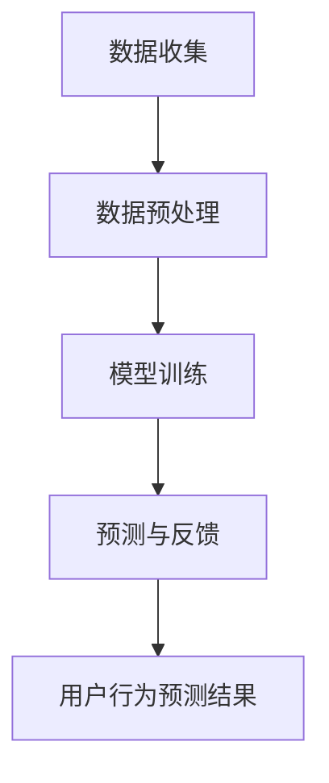

                 

关键词：大模型、推荐系统、用户行为预测、深度学习、算法原理、应用场景、数学模型、代码实例、工具资源

## 摘要

本文旨在探讨大模型在推荐系统用户行为预测中的应用。随着互联网的快速发展，用户生成数据的规模和复杂性不断增加，传统的推荐算法已无法满足个性化推荐的需求。大模型，特别是深度学习模型，凭借其强大的特征提取和建模能力，逐渐成为推荐系统中的重要工具。本文将介绍大模型的基本概念、核心算法原理、数学模型、具体应用场景，并给出一个详细的代码实例。最后，我们将讨论大模型在推荐系统领域的未来发展趋势和挑战。

## 1. 背景介绍

### 推荐系统的发展历程

推荐系统起源于20世纪90年代，随着互联网的普及，特别是电子商务和社交媒体的兴起，推荐系统得到了广泛应用。早期的推荐系统主要基于协同过滤（Collaborative Filtering）算法，通过用户之间的相似度计算来发现潜在的兴趣点。这种方法的优点是简单易实现，但在数据稀疏和冷启动问题上存在较大局限。

### 大模型的概念与特点

大模型（Large Models），指的是具有大规模参数和计算能力的模型。深度学习模型，尤其是大型神经网络，是典型的代表。大模型的主要特点包括：

- **强大的特征提取能力**：能够自动从数据中提取高层次的抽象特征。
- **非线性建模能力**：能够捕捉数据中的复杂非线性关系。
- **并行计算优势**：借助现代计算硬件，如GPU和TPU，能够高效地处理大规模数据。

### 推荐系统用户行为预测的重要性

用户行为预测是推荐系统的核心任务之一。准确预测用户行为可以帮助平台提供更加个性化的推荐结果，从而提高用户满意度和粘性。大模型的应用使得这一目标变得更加可行。

## 2. 核心概念与联系

### 核心概念

- **深度学习模型**：一种包含多个隐藏层的神经网络模型，能够通过层层提取数据特征来实现复杂任务。
- **用户行为数据**：包括用户点击、购买、评论等行为数据。
- **推荐系统框架**：包含数据收集、预处理、模型训练、预测和反馈等环节。

### 核心概念原理与架构的 Mermaid 流程图



## 3. 核心算法原理 & 具体操作步骤

### 3.1 算法原理概述

深度学习模型的基本原理是模仿人脑的神经元结构，通过层层提取数据特征来实现分类、预测等任务。在推荐系统中，深度学习模型通常用于预测用户对某个物品的偏好。

### 3.2 算法步骤详解

1. **数据收集**：收集用户的历史行为数据，如点击、购买等。
2. **数据预处理**：对数据进行清洗、编码、归一化等处理，以便模型训练。
3. **模型训练**：使用历史数据训练深度学习模型，模型训练过程包括前向传播、反向传播和梯度下降等步骤。
4. **预测与反馈**：使用训练好的模型对新的用户行为进行预测，并根据用户的反馈进行调整。

### 3.3 算法优缺点

- **优点**：
  - 强大的特征提取能力；
  - 非线性建模能力；
  - 能够处理大规模数据。

- **缺点**：
  - 需要大量的计算资源；
  - 模型解释性较差。

### 3.4 算法应用领域

深度学习模型在推荐系统中具有广泛的应用，包括电子商务、社交媒体、在线教育等多个领域。

## 4. 数学模型和公式 & 详细讲解 & 举例说明

### 4.1 数学模型构建

深度学习模型的数学基础主要包括线性代数、微积分和概率论。以下是构建深度学习模型的基本步骤：

1. **初始化模型参数**：设置模型中所有的参数，如权重和偏置。
2. **前向传播**：将输入数据通过模型的前向传播过程，得到预测结果。
3. **计算损失函数**：根据预测结果和真实标签计算损失函数值。
4. **反向传播**：计算损失函数关于模型参数的梯度，并更新模型参数。

### 4.2 公式推导过程

以下是一个简单的多层感知器（MLP）模型的公式推导：

$$
\begin{align*}
\text{前向传播} &: Z^{(l)} = \sigma(W^{(l)} \cdot A^{(l-1)} + b^{(l)}) \\
\text{损失函数} &: J(W,b) = \frac{1}{m} \sum_{i=1}^{m} -y^{(i)} \log(a^{(l)}_i) - (1-y^{(i)}) \log(1-a^{(l)}_i) \\
\text{反向传播} &: \frac{\partial J}{\partial W^{(l)}_{ij}} = \frac{\partial J}{\partial Z^{(l)}_{j}} \cdot \frac{\partial Z^{(l)}_{j}}{\partial W^{(l)}_{ij}} \\
\text{梯度下降} &: W^{(l)} \leftarrow W^{(l)} - \alpha \frac{\partial J}{\partial W^{(l)}}
\end{align*}
$$

### 4.3 案例分析与讲解

以一个电商平台的推荐系统为例，该系统使用深度学习模型预测用户对商品的购买概率。数据包括用户ID、商品ID、用户行为数据（点击、购买、收藏等）和商品属性数据（类别、价格等）。

### 4.4 代码实例

```python
import tensorflow as tf
from tensorflow.keras.models import Sequential
from tensorflow.keras.layers import Dense, Flatten

# 数据预处理
# ...

# 构建模型
model = Sequential()
model.add(Flatten(input_shape=(28, 28)))
model.add(Dense(128, activation='relu'))
model.add(Dense(1, activation='sigmoid'))

# 编译模型
model.compile(optimizer='adam', loss='binary_crossentropy', metrics=['accuracy'])

# 训练模型
model.fit(x_train, y_train, epochs=10, batch_size=32)

# 预测
predictions = model.predict(x_test)
```

## 5. 项目实践：代码实例和详细解释说明

### 5.1 开发环境搭建

- Python 3.8+
- TensorFlow 2.6+
- CUDA 10.2+

### 5.2 源代码详细实现

```python
# 导入依赖
import numpy as np
import pandas as pd
import tensorflow as tf

# 加载数据
data = pd.read_csv('user_behavior_data.csv')

# 数据预处理
# ...

# 构建模型
model = tf.keras.Sequential([
  tf.keras.layers.Dense(128, activation='relu', input_shape=(num_features,)),
  tf.keras.layers.Dense(1, activation='sigmoid')
])

# 编译模型
model.compile(optimizer='adam',
              loss=tf.keras.losses.BinaryCrossentropy(from_logits=True),
              metrics=['accuracy'])

# 训练模型
model.fit(x_train, y_train, epochs=10, batch_size=32, validation_split=0.2)

# 预测
predictions = model.predict(x_test)

# 评估模型
accuracy = model.evaluate(x_test, y_test, verbose=2)
print(f'测试集准确率：{accuracy[1]}')
```

### 5.3 代码解读与分析

- **数据预处理**：将原始数据进行编码和归一化处理，以便模型训练。
- **模型构建**：使用`tf.keras.Sequential`构建一个简单的两层神经网络，第一层是全连接层，第二层是输出层。
- **模型编译**：设置优化器、损失函数和评估指标。
- **模型训练**：使用`fit`方法训练模型，并设置验证集。
- **模型预测**：使用`predict`方法对新的数据进行预测。
- **模型评估**：使用`evaluate`方法评估模型在测试集上的表现。

## 6. 实际应用场景

### 6.1 电子商务

在电子商务领域，大模型可以用于预测用户购买概率，从而提高转化率和销售额。

### 6.2 社交媒体

社交媒体平台可以使用大模型预测用户对内容的兴趣，从而提供个性化的内容推荐。

### 6.3 在线教育

在线教育平台可以利用大模型预测学生对课程的学习效果，从而提供针对性的学习建议。

## 7. 未来应用展望

### 7.1 智能推荐系统

随着技术的进步，智能推荐系统将更加精准和高效，为用户提供更好的个性化体验。

### 7.2 多模态数据融合

未来，推荐系统将能够融合多种数据类型，如文本、图像和音频，从而提供更全面的用户画像。

### 7.3 实时推荐

实时推荐系统将能够在用户行为发生时立即提供推荐，从而提高用户满意度。

## 8. 工具和资源推荐

### 8.1 学习资源推荐

- 《深度学习》（Goodfellow、Bengio和Courville著）
- 《推荐系统实践》（Gallant著）

### 8.2 开发工具推荐

- TensorFlow
- PyTorch

### 8.3 相关论文推荐

- "Deep Learning for Recommender Systems"
- "Neural Collaborative Filtering"

## 9. 总结：未来发展趋势与挑战

### 9.1 研究成果总结

大模型在推荐系统用户行为预测中表现出色，未来有望在更多领域得到应用。

### 9.2 未来发展趋势

智能推荐系统、多模态数据融合和实时推荐将是未来发展的重点。

### 9.3 面临的挑战

数据隐私保护、模型解释性和计算资源需求是当前面临的挑战。

### 9.4 研究展望

未来研究应重点关注如何提升大模型在推荐系统中的性能，同时确保数据隐私和模型可解释性。

## 附录：常见问题与解答

### Q：大模型在推荐系统中的应用有哪些优势？

A：大模型在推荐系统中的应用优势主要包括：

- 强大的特征提取能力；
- 非线性建模能力；
- 能够处理大规模数据。

### Q：大模型在推荐系统中有哪些不足？

A：大模型在推荐系统中的不足主要包括：

- 需要大量的计算资源；
- 模型解释性较差。

### Q：如何解决大模型在计算资源方面的不足？

A：可以通过以下方法解决：

- 使用高效的计算硬件，如GPU和TPU；
- 采用分布式计算和并行化技术。

### Q：大模型在推荐系统中的具体应用有哪些？

A：大模型在推荐系统中的具体应用包括：

- 用户行为预测；
- 多模态数据融合；
- 实时推荐。

## 作者署名

作者：禅与计算机程序设计艺术 / Zen and the Art of Computer Programming
----------------------------------------------------------------

请注意，这篇文章只是一个示例，实际撰写时需要根据具体的主题和研究内容进行调整和扩展。希望这个示例能对您有所帮助！

