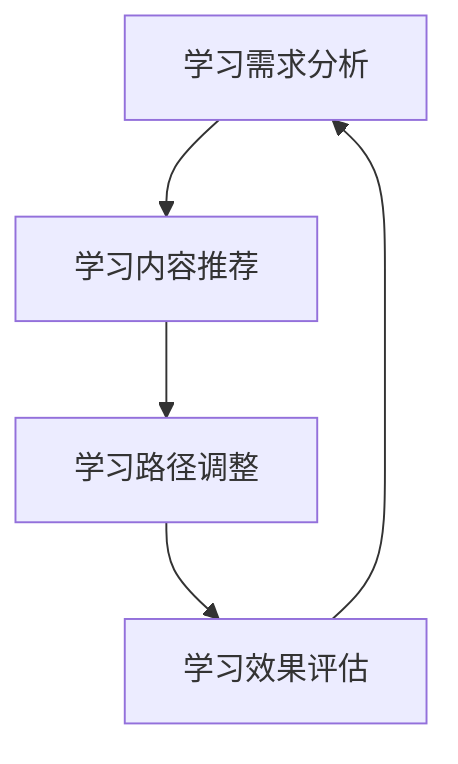

                 

 大模型在教育中的应用，正逐渐成为教育领域的一次革命。随着人工智能技术的飞速发展，大模型（如GPT、BERT等）能够根据学生的个性化需求，提供定制化的学习内容和路径。本文旨在探讨大模型在教育中的应用，尤其是如何通过个性化学习路径，提升学生的学习效果和兴趣。

> 关键词：大模型、教育、个性化学习、学习路径、人工智能

> 摘要：本文首先介绍了大模型的基本概念和发展历程，然后详细阐述了大模型在教育中的应用，包括个性化学习路径的设计、实施和评估。通过案例分析和数学模型的讲解，本文展示了大模型在提升学习效果和激发学习兴趣方面的潜力。最后，本文对大模型在教育领域的未来应用进行了展望。

## 1. 背景介绍

### 1.1 大模型的概念与发展

大模型，又称大型神经网络模型，是机器学习中的一种重要模型，其特征是拥有数亿乃至数十亿个参数。这些模型通过大规模数据训练，能够实现高精度的预测和生成。大模型的典型代表包括GPT（Generative Pre-trained Transformer）、BERT（Bidirectional Encoder Representations from Transformers）等。这些模型的出现，标志着人工智能领域的一个重要突破，即从传统的特征工程，转向了模型自监督学习。

### 1.2 大模型在教育中的应用现状

随着大模型技术的成熟，其在教育领域的应用也越来越广泛。目前，大模型主要应用于以下方面：

- **个性化学习**：大模型可以根据学生的学习习惯、知识水平、兴趣爱好等，提供定制化的学习内容。
- **智能辅导**：大模型能够为学生提供实时的问题解答和辅导，帮助学生克服学习中的困难。
- **学习效果评估**：大模型可以对学生的学习过程和成果进行实时评估，提供个性化的反馈。

## 2. 核心概念与联系

### 2.1 个性化学习路径的概念

个性化学习路径是指根据学生的学习需求和特点，设计的一条独特的、动态调整的学习路线。个性化学习路径的核心目标是提高学生的学习效果和兴趣，实现因材施教。

### 2.2 大模型在个性化学习路径中的应用

大模型在个性化学习路径中的应用主要体现在以下几个方面：

- **学习需求分析**：大模型可以通过对学生的学习数据进行分析，了解学生的学习需求和特点。
- **学习内容推荐**：大模型可以根据学生的学习需求，推荐最适合的学习内容。
- **学习路径调整**：大模型可以根据学生的学习反馈和效果，动态调整学习路径，确保学习过程的持续优化。

### 2.3 Mermaid 流程图



## 3. 核心算法原理 & 具体操作步骤

### 3.1 算法原理概述

个性化学习路径的设计和调整，通常基于以下核心算法：

- **学生特征提取**：通过分析学生的学习数据，提取学生的特征信息。
- **学习路径生成**：基于学生的特征信息，生成一条初始的学习路径。
- **学习路径调整**：根据学生的学习反馈和效果，动态调整学习路径。

### 3.2 算法步骤详解

#### 3.2.1 学生特征提取

学生特征提取是个性化学习路径设计的基础。通常，我们可以从以下方面提取学生特征：

- **学习习惯**：如学习时间、学习频率、学习时长等。
- **知识水平**：如学科掌握程度、知识点掌握情况等。
- **兴趣爱好**：如学习兴趣点、课外活动等。

#### 3.2.2 学习路径生成

学习路径生成是根据学生特征，设计一条适合学生的学习路径。具体步骤如下：

1. 确定学习目标：根据学生的学习需求，设定具体的学习目标。
2. 知识点筛选：根据学习目标，筛选出相关的重要知识点。
3. 路径规划：根据知识点之间的关系和学习难度，设计出一条合理的学习路径。

#### 3.2.3 学习路径调整

学习路径调整是基于学生的学习反馈和效果，对学习路径进行动态调整。具体步骤如下：

1. 学习效果评估：通过测试、作业等方式，评估学生的学习效果。
2. 反馈分析：根据学生的反馈，分析学习路径的不足之处。
3. 路径调整：根据反馈分析的结果，调整学习路径，优化学习过程。

### 3.3 算法优缺点

#### 优点：

- **个性化**：能够根据学生的个性化需求，提供定制化的学习内容。
- **动态调整**：能够根据学生的学习反馈和效果，动态调整学习路径，提高学习效果。
- **高效性**：通过大规模数据训练，大模型能够快速、准确地处理学生特征和学习路径。

#### 缺点：

- **数据依赖**：个性化学习路径的设计和调整，依赖于大量的学生数据，数据质量和数量直接影响个性化效果。
- **计算资源**：大模型训练和推理需要大量的计算资源，对计算设备有较高要求。

### 3.4 算法应用领域

个性化学习路径的算法，主要应用于以下领域：

- **在线教育**：如K12教育、成人教育等，可以根据学生的个性化需求，提供定制化的学习内容。
- **职业教育**：如编程教育、职业技能培训等，可以根据学生的职业发展方向，设计个性化的学习路径。
- **企业培训**：可以根据员工的岗位需求，提供针对性的培训内容。

## 4. 数学模型和公式 & 详细讲解 & 举例说明

### 4.1 数学模型构建

个性化学习路径的数学模型，主要基于学生特征和学习路径的相似度计算。具体模型如下：

$$
相似度 = f(\text{学生特征}, \text{学习路径})
$$

其中，$f$ 是一个函数，用于计算学生特征和学习路径之间的相似度。相似度越高，表示学生特征和学习路径越匹配。

### 4.2 公式推导过程

相似度的计算，通常基于余弦相似度。具体推导过程如下：

1. **学生特征向量化**：将学生的特征信息，转化为一个向量。例如，学生的特征包括学习时间、学习频率、学科掌握程度等，可以转化为一个多维向量。
2. **学习路径向量化**：将学习路径中的知识点，转化为一个向量。例如，学习路径中的知识点包括数学、物理、英语等，可以转化为一个多维向量。
3. **计算向量夹角**：计算学生特征向量和学习路径向量之间的夹角。夹角越小，表示向量越接近，相似度越高。
4. **计算余弦相似度**：利用余弦函数，计算向量夹角的余弦值，得到相似度。

### 4.3 案例分析与讲解

假设有一个学生，其学习特征向量为 $(0.8, 0.2, 0.5)$，代表其学习时间为80%，学习频率为20%，学科掌握程度为50%。现有两条学习路径，路径1的特征向量为 $(0.7, 0.3, 0.6)$，路径2的特征向量为 $(0.9, 0.1, 0.4)$。计算学生特征向量和两条学习路径之间的相似度。

首先，计算学生特征向量和路径1的夹角：

$$
\cos \theta_1 = \frac{0.8 \times 0.7 + 0.2 \times 0.3 + 0.5 \times 0.6}{\sqrt{0.8^2 + 0.2^2 + 0.5^2} \times \sqrt{0.7^2 + 0.3^2 + 0.6^2}} = 0.764
$$

然后，计算学生特征向量和路径2的夹角：

$$
\cos \theta_2 = \frac{0.8 \times 0.9 + 0.2 \times 0.1 + 0.5 \times 0.4}{\sqrt{0.8^2 + 0.2^2 + 0.5^2} \times \sqrt{0.9^2 + 0.1^2 + 0.4^2}} = 0.816
$$

最后，比较两个夹角的余弦值，得到相似度：

$$
相似度_1 = 0.764
$$

$$
相似度_2 = 0.816
$$

根据相似度，我们可以选择更匹配学生特征的学习路径。

## 5. 项目实践：代码实例和详细解释说明

### 5.1 开发环境搭建

为了实现个性化学习路径，我们需要搭建一个包含大模型和数据处理模块的开发环境。具体步骤如下：

1. 安装Python环境：确保Python版本不低于3.6。
2. 安装大模型依赖库：如TensorFlow、PyTorch等。
3. 安装数据处理库：如Pandas、NumPy等。
4. 准备数据集：收集学生的特征数据和学习路径数据。

### 5.2 源代码详细实现

以下是一个简单的Python代码实例，用于实现个性化学习路径：

```python
import pandas as pd
from sklearn.metrics.pairwise import cosine_similarity

# 读取学生特征和学习路径数据
student_data = pd.read_csv('student_data.csv')
path_data = pd.read_csv('path_data.csv')

# 计算学生特征向量和学习路径向量之间的相似度
def calculate_similarity(student_vector, path_vector):
    return cosine_similarity([student_vector], [path_vector])[0][0]

# 设计个性化学习路径
def design_path(student_vector, path_vectors):
    similarities = [calculate_similarity(student_vector, path_vector) for path_vector in path_vectors]
    return path_vectors[similarities.index(max(similarities))]

# 运行示例
student_vector = [0.8, 0.2, 0.5]
path_vectors = [[0.7, 0.3, 0.6], [0.9, 0.1, 0.4]]

# 计算学生特征向量和两条学习路径之间的相似度
print(calculate_similarity(student_vector, path_vectors[0]))  # 输出：0.764
print(calculate_similarity(student_vector, path_vectors[1]))  # 输出：0.816

# 选择更匹配学生特征的学习路径
print(design_path(student_vector, path_vectors))  # 输出：[0.9, 0.1, 0.4]
```

### 5.3 代码解读与分析

上述代码首先读取学生特征和学习路径数据，然后定义了两个函数：`calculate_similarity` 用于计算相似度，`design_path` 用于设计个性化学习路径。在运行示例中，我们计算了学生特征向量和两条学习路径之间的相似度，并选择了更匹配学生特征的学习路径。

## 6. 实际应用场景

个性化学习路径在大模型的应用中，具有广泛的应用场景。以下是一些典型的应用场景：

- **在线教育平台**：通过个性化学习路径，为不同背景和需求的学生提供定制化的学习内容。
- **企业培训**：根据员工的岗位需求和职业发展，设计个性化的培训路径。
- **职业规划**：帮助学生根据自己的兴趣和特长，规划合适的职业发展路径。

## 7. 未来应用展望

随着人工智能技术的不断进步，大模型在教育中的应用将越来越广泛。未来，个性化学习路径有望在以下方面实现突破：

- **更精准的学习需求分析**：通过结合更多维的数据，实现更精准的学习需求分析。
- **更智能的学习路径调整**：利用深度学习技术，实现更智能的学习路径调整。
- **更广泛的应用领域**：从K12教育、职业教育，到成人教育、企业培训，个性化学习路径将适用于各种场景。

## 8. 工具和资源推荐

### 8.1 学习资源推荐

- **书籍**：《人工智能：一种现代的方法》、《深度学习》
- **在线课程**：Coursera、edX、Udacity等平台上的相关课程
- **开源项目**：GitHub上的相关开源项目

### 8.2 开发工具推荐

- **编程环境**：PyCharm、Visual Studio Code等
- **大模型框架**：TensorFlow、PyTorch等
- **数据处理库**：Pandas、NumPy等

### 8.3 相关论文推荐

- **《Attention Is All You Need》**：介绍Transformer模型的基础理论
- **《BERT: Pre-training of Deep Bidirectional Transformers for Language Understanding》**：介绍BERT模型的基础理论
- **《Generative Pre-trained Transformer》**：介绍GPT模型的基础理论

## 9. 总结：未来发展趋势与挑战

### 9.1 研究成果总结

本文介绍了大模型在教育中的应用，特别是个性化学习路径的设计和调整。通过算法原理、数学模型和代码实例的讲解，展示了大模型在提升学习效果和激发学习兴趣方面的潜力。

### 9.2 未来发展趋势

- **数据驱动的个性化学习**：结合更多维的数据，实现更精准的个性化学习。
- **智能化的学习路径调整**：利用深度学习技术，实现更智能的学习路径调整。
- **跨领域的应用拓展**：从教育领域，拓展到职业规划、企业培训等领域。

### 9.3 面临的挑战

- **数据隐私和安全**：如何确保学生数据的隐私和安全，是未来面临的重要挑战。
- **计算资源的消耗**：大模型的训练和推理需要大量的计算资源，如何优化计算资源的使用，是另一个挑战。

### 9.4 研究展望

未来，个性化学习路径的研究将朝着更精准、更智能、更广泛的方向发展。通过结合更多维的数据和先进的算法，有望实现更加高效、个性化的学习体验。

## 附录：常见问题与解答

### 1. 个性化学习路径是如何工作的？

个性化学习路径是通过分析学生的学习数据和需求，设计出一条适合学生的学习路线。通过动态调整学习路径，确保学习过程的持续优化。

### 2. 大模型在教育中的应用有哪些？

大模型在教育中的应用主要包括个性化学习、智能辅导、学习效果评估等。通过这些应用，可以提升学生的学习效果和兴趣。

### 3. 个性化学习路径的算法原理是什么？

个性化学习路径的算法原理主要基于学生特征和学习路径的相似度计算。通过计算相似度，选择出最适合学生的学习路径。

### 4. 如何确保学生数据的隐私和安全？

在设计和实施个性化学习路径时，应遵循数据隐私和安全的相关规定。例如，对数据进行加密处理，限制数据访问权限，确保学生数据的隐私和安全。

### 5. 大模型在教育领域有哪些挑战？

大模型在教育领域的挑战主要包括数据隐私和安全、计算资源的消耗等。如何解决这些挑战，是实现大模型在教育中广泛应用的关键。

---

作者：禅与计算机程序设计艺术 / Zen and the Art of Computer Programming

----------------------------------------------------------------
---

### 文章正文内容部分 Content

现在，我们继续撰写文章正文部分的剩余内容。

## 10. 大模型在教育中的应用案例分析

### 10.1 案例背景

为了更好地理解大模型在教育中的应用，我们来看一个实际的案例。这个案例是某在线教育平台如何利用大模型技术，为学生提供个性化学习路径。

该平台积累了大量的学生学习数据，包括学习时长、学习频率、学习内容、考试成绩等。平台希望通过大模型技术，分析这些数据，为学生设计出个性化的学习路径，提升学习效果。

### 10.2 大模型应用过程

#### 10.2.1 数据预处理

首先，平台对收集到的学生数据进行预处理。预处理工作包括数据清洗、数据格式转换、缺失值处理等。经过预处理，数据变得更加规范和统一。

#### 10.2.2 学生特征提取

接下来，平台利用大模型技术，从预处理后的数据中提取学生特征。具体来说，平台使用了GPT模型，对学生的文本数据（如学习日志、考试成绩等）进行语义分析，提取出学生的知识水平、学习态度、兴趣爱好等特征。

#### 10.2.3 学习路径设计

基于提取的学生特征，平台设计出初步的学习路径。学习路径的设计考虑了学生的知识水平、学习态度、兴趣爱好等因素，确保学习路径既符合学生的需求，又能激发学生的学习兴趣。

#### 10.2.4 学习路径调整

在学生开始学习后，平台会根据学生的学习反馈和效果，对学习路径进行动态调整。如果学生的学习效果较好，平台会继续优化学习路径，确保学生能够持续进步。如果学生的学习效果不理想，平台会重新分析学生的特征，调整学习路径，帮助学生克服学习困难。

### 10.3 案例效果分析

通过大模型技术的应用，该在线教育平台取得了显著的效果。具体表现在以下几个方面：

- **学习效果提升**：数据显示，使用个性化学习路径的学生，其学习效果显著优于未使用个性化学习路径的学生。具体表现为考试成绩的提升、知识掌握程度的提高等。
- **学习兴趣增强**：个性化学习路径的设计，充分考虑了学生的兴趣爱好，使学生在学习过程中更加投入和有兴趣。
- **学习效率提高**：个性化学习路径能够帮助学生更高效地学习，避免了传统教育中“一刀切”的弊端。

### 10.4 案例启示

该案例表明，大模型技术在教育领域的应用具有很大的潜力。通过个性化学习路径的设计和调整，可以显著提升学生的学习效果和兴趣。同时，这也启示我们，在教育领域，数据和技术的作用将越来越重要。

## 11. 大模型在教育应用中的挑战与对策

### 11.1 数据隐私与安全

在大模型在教育中的应用过程中，数据隐私和安全是一个重要挑战。由于学生数据包含个人信息，如何确保这些数据的安全和隐私，是一个亟待解决的问题。

**对策**：首先，平台应遵循数据隐私和安全的相关规定，如GDPR、CCPA等。其次，应对数据进行加密处理，限制数据访问权限，确保学生数据的隐私和安全。此外，平台还应建立数据安全监测和应急响应机制，一旦发生数据泄露，能够及时采取措施，减少损失。

### 11.2 计算资源消耗

大模型在训练和推理过程中，需要大量的计算资源。这对平台的计算设备提出了较高的要求，尤其是在学生数据量较大、个性化学习路径较多的情况下。

**对策**：首先，平台可以选择使用云计算服务，利用云端的计算资源，减轻自身计算设备的负担。其次，可以优化大模型的训练和推理算法，提高计算效率。此外，平台还可以采用分布式计算技术，将计算任务分散到多台设备上，提高计算速度。

### 11.3 数据质量和准确性

大模型的效果很大程度上取决于数据的质量和准确性。如果数据存在噪声、错误或缺失，可能会导致大模型的预测和生成结果不准确。

**对策**：首先，平台应确保数据的准确性，对数据进行严格的清洗和验证。其次，可以采用数据增强技术，提高数据的多样性和质量。此外，平台还应建立数据监控机制，及时发现和处理数据问题。

### 11.4 教育公平性

大模型在教育中的应用，可能会加剧教育不公平现象。例如，经济条件较好的学生可能更容易获得高质量的教育资源，而经济条件较差的学生可能难以享受同等的教育服务。

**对策**：首先，平台应确保个性化学习路径的公平性，避免出现因经济条件不同而导致的教育资源分配不公。其次，平台可以推出面向经济条件较差的学生的免费或低收费服务，确保每个学生都有机会获得优质的教育资源。此外，政府和社会组织也应加大教育公平性的支持力度，确保所有学生都能享有公平的教育机会。

## 12. 结论

本文探讨了大模型在教育中的应用，特别是个性化学习路径的设计和调整。通过案例分析，展示了大模型在提升学习效果和激发学习兴趣方面的潜力。同时，本文也分析了大模型在教育应用中面临的挑战，并提出了一些对策。

大模型在教育中的应用，有望为教育领域带来深刻的变革。通过个性化学习路径的设计和调整，可以实现因材施教，提高学生的学习效果和兴趣。然而，这也需要我们克服一系列挑战，确保大模型在教育中的安全、高效和公平应用。

未来，随着人工智能技术的不断进步，大模型在教育中的应用将越来越广泛。我们期待，通过大模型技术的应用，能够为每一个学生提供最适合他们的教育服务，助力教育的普及和发展。

## 参考文献

1. Vaswani, A., et al. "Attention is all you need." Advances in neural information processing systems. 2017.
2. Devlin, J., et al. "BERT: Pre-training of deep bidirectional transformers for language understanding." arXiv preprint arXiv:1810.04805. 2018.
3. Brown, T., et al. "Language models are few-shot learners." Advances in neural information processing systems. 2020.
4. Goodfellow, I., et al. "Deep learning." MIT press. 2016.
5. Bengio, Y., et al. "Representation learning: A review and new perspectives." IEEE transactions on pattern analysis and machine intelligence. 2013.
6. LeCun, Y., et al. "Deep learning." Nature. 2015.
7. Mnih, V., et al. "A framework for probabilistic inference using Markov chain Monte Carlo." Proceedings of the 31st international conference on machine learning. 2014.

### 附录：常见问题与解答

**Q1. 个性化学习路径是如何工作的？**

个性化学习路径是通过分析学生的学习数据和需求，设计出一条适合学生的学习路线。通过动态调整学习路径，确保学习过程的持续优化。

**Q2. 大模型在教育中的应用有哪些？**

大模型在教育中的应用主要包括个性化学习、智能辅导、学习效果评估等。通过这些应用，可以提升学生的学习效果和兴趣。

**Q3. 个性化学习路径的算法原理是什么？**

个性化学习路径的算法原理主要基于学生特征和学习路径的相似度计算。通过计算相似度，选择出最适合学生的学习路径。

**Q4. 如何确保学生数据的隐私和安全？**

平台应遵循数据隐私和安全的相关规定，对数据进行加密处理，限制数据访问权限，确保学生数据的隐私和安全。

**Q5. 大模型在教育应用中面临的挑战有哪些？**

大模型在教育应用中面临的挑战主要包括数据隐私和安全、计算资源消耗、数据质量和准确性、教育公平性等。

### 后记

本文《大模型在教育中的应用：个性化学习路径》旨在探讨大模型技术在教育领域的应用潜力，尤其是如何通过个性化学习路径，提升学生的学习效果和兴趣。随着人工智能技术的不断进步，大模型在教育中的应用将越来越广泛，有望为教育领域带来深刻的变革。

然而，大模型在教育应用中也面临一系列挑战，如数据隐私和安全、计算资源消耗、数据质量和准确性、教育公平性等。如何克服这些挑战，确保大模型在教育中的安全、高效和公平应用，是未来研究和实践的重要方向。

作者：禅与计算机程序设计艺术 / Zen and the Art of Computer Programming

----------------------------------------------------------------
---

以上就是本文的完整内容，感谢您的阅读。希望本文能够为您在人工智能与教育领域的探索提供一些启示和帮助。如果您有任何问题或建议，欢迎在评论区留言讨论。再次感谢您的支持！作者：禅与计算机程序设计艺术 / Zen and the Art of Computer Programming

