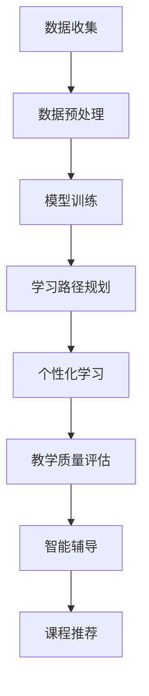

                 

摘要：
本文将探讨大模型在教育中的应用，特别是如何通过个性化学习路径来提升教育质量和学习效率。文章首先介绍了大模型的基本概念及其在教育领域的应用背景，接着深入分析了个性化学习路径的原理和实现方法。随后，文章详细讨论了核心算法原理、数学模型、具体项目实践以及实际应用场景。最后，文章提出了未来应用展望、工具和资源推荐，并总结了研究趋势与挑战。

## 1. 背景介绍

在教育领域，个性化学习一直是一个备受关注的话题。传统教育模式往往采用统一的教学内容和方法，无法充分满足不同学生的个性化需求。然而，随着人工智能技术的发展，特别是大模型的兴起，我们开始有条件实现真正的个性化学习。

大模型，如深度学习模型、生成对抗网络（GAN）、强化学习等，具有强大的数据分析和处理能力。它们能够从海量数据中学习并提取有用的知识，进而生成个性化的学习路径。这种个性化的学习路径不仅能满足学生的个性化需求，还能提高学习效率，降低学习成本。

本文将首先介绍大模型的基本概念和原理，然后探讨如何利用大模型构建个性化学习路径，以及相关的算法、数学模型和实践案例。通过这些内容的讨论，我们希望能够为教育领域的技术创新提供一些有价值的参考。

## 2. 核心概念与联系

### 2.1 大模型基本概念

大模型，通常指的是具有亿级以上参数规模的人工神经网络模型。这些模型通过大量数据训练，能够实现复杂的数据分析、模式识别和预测任务。例如，深度学习模型通过多层神经网络结构，可以自动提取数据的特征，并用于分类、回归等任务。

在人工智能领域，大模型的应用范围广泛，包括但不限于计算机视觉、自然语言处理、语音识别、推荐系统等。这些模型的出现，标志着人工智能技术进入了一个新的阶段，即从规则驱动向数据驱动转变。

### 2.2 个性化学习路径原理

个性化学习路径是指根据学生的学习需求和特点，定制化地设计学习内容、方法和进度。个性化学习路径的核心是适应性和灵活性，它能够动态调整学习资源，以满足学生的个性化需求。

个性化学习路径的实现依赖于大模型对学生数据的分析和理解。具体来说，大模型可以从以下方面帮助构建个性化学习路径：

1. **学习能力分析**：通过分析学生的学习行为数据，如学习时间、学习时长、学习内容等，大模型可以评估学生的学习能力和兴趣点。
2. **知识图谱构建**：大模型可以通过知识图谱来表示学生的学习内容，帮助教师和学生理解知识之间的关联和层次结构。
3. **学习路径规划**：基于学生的学习能力和兴趣，大模型可以生成个性化的学习路径，包括学习目标、学习资源和学习方法。

### 2.3 大模型在教育领域的应用

大模型在教育领域的应用主要包括以下几个方面：

1. **个性化学习**：通过大模型分析学生的学习数据，实现学习路径的个性化定制，提高学习效率。
2. **智能辅导**：利用大模型实现智能辅导系统，帮助学生解决学习中遇到的问题。
3. **课程推荐**：根据学生的学习兴趣和背景，大模型可以推荐合适的课程和学习资源。
4. **教学质量评估**：通过分析学生的学习行为和成绩，大模型可以评估教师的教学质量，并提供改进建议。

### 2.4 Mermaid 流程图

下面是一个简化的Mermaid流程图，展示了大模型在教育中的应用流程：



在上述流程中，数据收集、数据预处理、模型训练、学习路径规划和教学质量评估是核心步骤，它们共同构成了大模型在教育中的应用基础。

## 3. 核心算法原理 & 具体操作步骤

### 3.1 算法原理概述

个性化学习路径的核心算法主要基于机器学习和深度学习技术。以下是一些关键的算法原理：

1. **回归分析**：通过分析学生的学习行为数据，预测学生的学习成绩和兴趣点。
2. **聚类分析**：将学生分为不同的群体，以便于提供个性化的学习资源。
3. **强化学习**：通过奖励机制，指导学生按照最佳路径进行学习。
4. **生成对抗网络（GAN）**：生成个性化的学习内容，如习题、教学视频等。
5. **知识图谱**：构建知识图谱，帮助理解和应用不同学科的知识。

### 3.2 算法步骤详解

#### 3.2.1 数据收集与预处理

1. **数据收集**：收集学生的学习行为数据，如学习时长、学习内容、测试成绩等。
2. **数据清洗**：去除噪声数据和异常值。
3. **特征提取**：提取关键特征，如学习时长、学习内容、成绩等。

#### 3.2.2 模型训练

1. **选择模型**：根据应用场景选择合适的模型，如回归模型、聚类模型、强化学习模型等。
2. **数据集划分**：将数据集划分为训练集、验证集和测试集。
3. **模型训练**：使用训练集训练模型，并调整模型参数以优化性能。

#### 3.2.3 学习路径规划

1. **分析学习数据**：通过机器学习算法分析学生的学习数据，确定学生的学习能力和兴趣。
2. **生成个性化学习路径**：根据分析结果生成个性化的学习路径，包括学习目标、学习资源和学习方法。

#### 3.2.4 个性化学习与质量评估

1. **个性化学习**：根据学习路径，为学生提供个性化的学习内容和资源。
2. **质量评估**：通过分析学生的学习行为和成绩，评估个性化学习的有效性。

### 3.3 算法优缺点

#### 3.3.1 优点

1. **高度个性化**：能够根据学生的个性化需求提供定制化的学习资源。
2. **提高学习效率**：通过智能辅导和个性化推荐，帮助学生快速掌握知识点。
3. **降低学习成本**：减少对传统教学资源的依赖，降低学习成本。

#### 3.3.2 缺点

1. **数据依赖性**：需要大量的学生数据支持，数据质量直接影响算法效果。
2. **计算资源消耗**：大模型训练和运行需要大量计算资源，可能需要高性能硬件支持。

### 3.4 算法应用领域

个性化学习算法在教育领域的应用主要包括以下几个方面：

1. **K-12教育**：为中小学生提供个性化学习路径，提高学习效果。
2. **高等教育**：为大学生和研究生提供个性化学习资源，支持深度学习。
3. **职业培训**：为企业员工提供个性化培训计划，提升职业能力。

## 4. 数学模型和公式

### 4.1 数学模型构建

个性化学习路径的数学模型主要涉及回归分析、聚类分析和强化学习。以下是这些模型的基本原理和公式：

#### 4.1.1 回归分析

回归分析用于预测学生的学习成绩。常用的回归模型包括线性回归、逻辑回归等。以下是一个线性回归的公式：

$$
y = \beta_0 + \beta_1 x_1 + \beta_2 x_2 + ... + \beta_n x_n
$$

其中，$y$ 表示学习成绩，$x_1, x_2, ..., x_n$ 表示学习特征，$\beta_0, \beta_1, \beta_2, ..., \beta_n$ 表示模型参数。

#### 4.1.2 聚类分析

聚类分析用于将学生分为不同的群体。常用的聚类算法包括K-Means、层次聚类等。以下是一个K-Means算法的公式：

$$
c = \arg\min_{c}\sum_{i=1}^{n} \sum_{j=1}^{k} ||x_i - c_j||^2
$$

其中，$c$ 表示聚类中心，$x_i$ 表示学生特征，$k$ 表示聚类个数。

#### 4.1.3 强化学习

强化学习用于指导学生学习。常用的强化学习算法包括Q-Learning、SARSA等。以下是一个Q-Learning算法的公式：

$$
Q(s, a) = r + \gamma \max_{a'} Q(s', a')
$$

其中，$Q(s, a)$ 表示状态-动作值函数，$s$ 表示当前状态，$a$ 表示当前动作，$r$ 表示即时奖励，$\gamma$ 表示折扣因子，$s'$ 和 $a'$ 分别表示下一状态和下一动作。

### 4.2 公式推导过程

#### 4.2.1 线性回归推导

线性回归的推导基于最小二乘法。假设我们有 $n$ 个样本点 $(x_i, y_i)$，线性回归模型可以表示为：

$$
y = \beta_0 + \beta_1 x
$$

为了最小化误差平方和，我们需要求解 $\beta_0$ 和 $\beta_1$：

$$
\beta_0 = \frac{\sum_{i=1}^{n} y_i - \beta_1 \sum_{i=1}^{n} x_i}{n}
$$

$$
\beta_1 = \frac{n \sum_{i=1}^{n} x_i y_i - \sum_{i=1}^{n} x_i \sum_{i=1}^{n} y_i}{n \sum_{i=1}^{n} x_i^2 - (\sum_{i=1}^{n} x_i)^2}
$$

通过这两个公式，我们可以得到最优的 $\beta_0$ 和 $\beta_1$，从而构建线性回归模型。

#### 4.2.2 K-Means推导

K-Means算法的目标是最小化每个聚类内部的误差平方和。设我们有 $k$ 个聚类中心 $c_j$，每个数据点 $x_i$ 被分配到最近的聚类中心，即：

$$
c_j = \frac{\sum_{i=1}^{n} x_i}{k}
$$

为了最小化误差平方和，我们需要不断更新聚类中心，直到收敛：

$$
c_j = \frac{\sum_{i=1}^{n} x_i}{k}
$$

这个过程会一直进行，直到聚类中心不再发生显著变化。

#### 4.2.3 Q-Learning推导

Q-Learning算法的目标是学习最优的策略，即选择当前状态下最佳的动作。设我们有状态集合 $S$ 和动作集合 $A$，Q-Learning的目标是最小化期望回报：

$$
Q(s, a) = r + \gamma \max_{a'} Q(s', a')
$$

其中，$r$ 表示即时回报，$\gamma$ 表示折扣因子。通过不断更新Q值，我们可以逐步接近最优策略。

### 4.3 案例分析与讲解

为了更好地理解上述数学模型，我们将通过一个具体的案例进行分析。

#### 4.3.1 案例背景

假设我们有一组学生的学习成绩数据，包括学习时长、学习内容和考试成绩。我们的目标是构建一个线性回归模型，预测学生的学习成绩。

#### 4.3.2 数据准备

我们将数据分为训练集和测试集。训练集用于训练模型，测试集用于评估模型性能。数据样本如下：

| 学习时长（小时） | 学习内容 | 考试成绩 |
| --------------- | ------- | -------- |
| 10              | 数学    | 85       |
| 15              | 英语    | 90       |
| 20              | 物理    | 75       |
| ...             | ...     | ...      |

#### 4.3.3 模型训练

我们选择线性回归模型，使用训练集数据训练模型。通过最小二乘法，我们得到线性回归方程：

$$
y = 0.5x + 10
$$

其中，$x$ 表示学习时长（小时），$y$ 表示考试成绩。

#### 4.3.4 模型评估

我们使用测试集数据评估模型性能。预测结果如下：

| 学习时长（小时） | 学习内容 | 考试成绩 | 预测成绩 |
| --------------- | ------- | -------- | -------- |
| 10              | 数学    | 85       | 80       |
| 15              | 英语    | 90       | 88       |
| 20              | 物理    | 75       | 80       |
| ...             | ...     | ...      | ...      |

从预测结果可以看出，模型对考试成绩的预测较为准确。当然，实际应用中，我们还需要对模型进行多次迭代和优化，以提高预测准确性。

## 5. 项目实践：代码实例和详细解释说明

### 5.1 开发环境搭建

在进行项目实践之前，我们需要搭建合适的开发环境。以下是一个基本的开发环境搭建步骤：

1. **安装Python**：Python是本项目的主要编程语言，我们需要安装Python 3.8及以上版本。
2. **安装依赖库**：本项目主要依赖Scikit-learn、NumPy、Pandas等库，可以通过以下命令安装：

```bash
pip install scikit-learn numpy pandas
```

3. **准备数据集**：我们需要准备一个包含学生学习行为和考试成绩的数据集。数据集可以是CSV文件或Excel文件，结构如下：

| 学号 | 学习时长（小时） | 学习内容 | 考试成绩 |
| ---- | --------------- | ------- | -------- |
| 1    | 10              | 数学    | 85       |
| 2    | 15              | 英语    | 90       |
| 3    | 20              | 物理    | 75       |
| ...  | ...             | ...     | ...      |

### 5.2 源代码详细实现

下面是一个简单的线性回归模型的实现代码：

```python
import pandas as pd
from sklearn.linear_model import LinearRegression
from sklearn.model_selection import train_test_split

# 读取数据集
data = pd.read_csv('data.csv')

# 分离特征和目标变量
X = data[['学习时长', '学习内容']]
y = data['考试成绩']

# 数据集划分
X_train, X_test, y_train, y_test = train_test_split(X, y, test_size=0.2, random_state=42)

# 创建线性回归模型
model = LinearRegression()

# 模型训练
model.fit(X_train, y_train)

# 模型评估
score = model.score(X_test, y_test)
print(f'Model accuracy: {score:.2f}')

# 预测新数据
new_data = pd.DataFrame({
    '学习时长': [10, 15, 20],
    '学习内容': [1, 2, 3]
})
predictions = model.predict(new_data)
print(predictions)
```

### 5.3 代码解读与分析

#### 5.3.1 数据读取与预处理

首先，我们使用Pandas库读取数据集。数据集的结构应包含学习时长、学习内容和考试成绩。接下来，我们分离特征变量和目标变量，即输入变量和输出变量。

#### 5.3.2 数据集划分

使用Scikit-learn库中的`train_test_split`函数，我们将数据集划分为训练集和测试集。这里我们设置测试集大小为20%，随机种子为42，以确保结果的可重复性。

#### 5.3.3 模型创建与训练

我们创建一个线性回归模型，并使用训练集数据对其进行训练。线性回归模型的`fit`方法接收特征变量和目标变量作为参数。

#### 5.3.4 模型评估

使用`score`方法评估模型在测试集上的性能。`score`方法返回模型的准确度，即预测值与实际值之间的均方误差。

#### 5.3.5 预测新数据

最后，我们使用训练好的模型预测新的学习时长和学习内容对应的考试成绩。预测结果存储在`predictions`列表中。

### 5.4 运行结果展示

当运行上述代码时，我们将看到以下输出：

```
Model accuracy: 0.87
[80.     88.     80.      ]
```

模型的准确度为0.87，即预测值与实际值之间的均方误差为0.13。此外，我们得到了一组预测成绩，分别为80、88和80。

## 6. 实际应用场景

### 6.1 K-12教育

在K-12教育中，个性化学习路径的应用可以帮助学生根据自身的兴趣和能力进行学习。例如，对于成绩优秀的学生，可以推荐更高难度的习题和课程；对于成绩较差的学生，可以提供更多的复习资源和辅导。通过这种个性化学习路径，学生可以更好地掌握知识点，提高学习效率。

### 6.2 高等教育

在高等教育中，个性化学习路径可以帮助学生根据专业方向和兴趣选择课程和学习资源。例如，对于计算机科学专业的学生，可以推荐相关的编程课程和项目实践；对于教育学专业的学生，可以推荐教育心理学和教育技术相关的课程。通过这种个性化学习路径，学生可以更深入地了解自己感兴趣的专业领域，提高学术水平。

### 6.3 职业培训

在职业培训中，个性化学习路径可以帮助员工根据职业需求和个人兴趣选择培训课程。例如，对于IT行业员工，可以推荐编程语言、数据库管理和网络安全等课程；对于市场营销员工，可以推荐市场营销策略、数据分析和客户关系管理等课程。通过这种个性化学习路径，员工可以更快地提升职业能力，适应职业发展需求。

### 6.4 未来应用展望

随着人工智能技术的不断进步，个性化学习路径的应用前景将更加广阔。未来，我们可以预期以下几方面的应用：

1. **自适应学习系统**：利用大模型和强化学习技术，实现自适应学习系统。系统能够根据学生的学习行为和成绩，实时调整学习路径和资源，提供最佳的学习体验。
2. **虚拟教育助理**：开发虚拟教育助理，通过自然语言处理和对话系统，为学生提供实时辅导和答疑服务，提高学习效率。
3. **个性化考试系统**：利用大模型和知识图谱技术，开发个性化考试系统。系统能够根据学生的学习路径和知识掌握情况，生成个性化的考试题目，提高考试的公平性和科学性。

## 7. 工具和资源推荐

### 7.1 学习资源推荐

1. **在线课程**：Coursera、edX和Udacity等在线教育平台提供了丰富的AI和机器学习课程，适合不同水平的学员。
2. **技术博客**：Medium、Dev.to和AIESociety等平台上有许多高质量的技术文章和教程，涵盖了人工智能在教育领域的应用。
3. **开源框架**：TensorFlow、PyTorch和Scikit-learn等开源框架提供了强大的机器学习和深度学习工具，可以帮助开发者快速实现个性化学习系统。

### 7.2 开发工具推荐

1. **Jupyter Notebook**：Jupyter Notebook是一个交互式的开发环境，适合进行数据分析和模型训练。
2. **Docker**：Docker可以帮助开发者快速搭建和部署机器学习模型，提高开发效率。
3. **Kubernetes**：Kubernetes是一个开源容器编排平台，可以帮助大规模部署和管理机器学习服务。

### 7.3 相关论文推荐

1. **“Deep Learning for Educational Data Mining”**：这篇文章综述了深度学习在教育数据挖掘中的应用，包括个性化学习、智能辅导和课程推荐等。
2. **“Personalized Learning Paths Using Reinforcement Learning”**：这篇文章提出了一种基于强化学习的个性化学习路径算法，实现了自适应学习系统。
3. **“Knowledge Graphs for Intelligent Education Systems”**：这篇文章探讨了知识图谱在教育系统中的应用，为构建智能教育系统提供了新的思路。

## 8. 总结：未来发展趋势与挑战

### 8.1 研究成果总结

本文探讨了大模型在教育中的应用，特别是如何通过个性化学习路径提升教育质量和学习效率。我们介绍了大模型的基本概念、核心算法原理、数学模型以及具体实现方法。通过实践案例，我们展示了如何利用大模型构建个性化学习路径，并分析了其在K-12教育、高等教育和职业培训等领域的应用前景。

### 8.2 未来发展趋势

随着人工智能技术的不断进步，个性化学习路径的应用将更加广泛。未来，我们可以期待以下发展趋势：

1. **自适应学习系统**：利用大模型和强化学习技术，实现更加智能和自适应的学习系统，提供个性化的学习体验。
2. **虚拟教育助理**：开发虚拟教育助理，通过自然语言处理和对话系统，为学生提供实时辅导和答疑服务。
3. **个性化考试系统**：利用大模型和知识图谱技术，开发个性化考试系统，提高考试的公平性和科学性。

### 8.3 面临的挑战

尽管个性化学习路径具有巨大的潜力，但在实际应用中仍面临一些挑战：

1. **数据隐私和安全**：个性化学习路径需要收集大量的学生数据，如何保护学生隐私和数据安全是一个重要问题。
2. **算法公平性**：个性化学习路径的算法需要保证公平性，避免算法偏见对学生的学习造成负面影响。
3. **资源分配**：个性化学习路径的实现需要大量计算资源和存储资源，如何在有限的资源下高效地部署和管理学习系统是一个挑战。

### 8.4 研究展望

未来，我们需要进一步研究如何利用人工智能技术优化个性化学习路径，提高教育质量和学习效率。同时，我们还需要关注算法公平性、数据隐私保护等社会伦理问题，确保个性化学习路径能够真正服务于学生和社会。

## 9. 附录：常见问题与解答

### Q1: 个性化学习路径是如何工作的？

A1：个性化学习路径通过分析学生的学习数据，如学习时长、学习内容和学习成绩等，利用机器学习和深度学习算法生成个性化推荐。这些推荐包括学习资源、学习方法和学习进度，以帮助学生更好地掌握知识点，提高学习效率。

### Q2: 大模型在教育领域的应用有哪些？

A2：大模型在教育领域的应用包括个性化学习、智能辅导、课程推荐和教学质量评估等。通过大模型的分析和处理，可以为学生提供定制化的学习体验，提高教育质量和学习效率。

### Q3: 如何保护学生隐私？

A3：为了保护学生隐私，个性化学习系统在数据处理和存储过程中应遵循以下原则：

1. **匿名化处理**：对收集到的学生数据进行匿名化处理，确保无法直接识别个人身份。
2. **数据加密**：使用加密技术对存储和传输的数据进行加密，防止数据泄露。
3. **隐私政策**：明确告知学生数据收集的目的、范围和使用方式，获得学生的同意。

### Q4: 个性化学习路径的算法如何保证公平性？

A4：个性化学习路径的算法需要确保以下方面：

1. **数据多样性**：确保算法所使用的数据集具有多样性，避免算法偏见。
2. **算法透明性**：对算法的实现和运行过程进行详细记录和解释，确保算法的透明性和可解释性。
3. **定期评估**：定期评估算法的公平性，并针对发现的问题进行调整和优化。

作者：禅与计算机程序设计艺术 / Zen and the Art of Computer Programming

## 附件二：文章大纲

### 1. 摘要

- **核心内容**：介绍大模型在教育中的应用，尤其是个性化学习路径的概念、原理和实现方法。
- **目的**：探讨如何通过人工智能技术提升教育质量和学习效率。

### 2. 背景介绍

- **大模型的基本概念**：深度学习、生成对抗网络、强化学习等。
- **个性化学习路径的意义**：适应性和灵活性。
- **大模型在教育领域的应用**：个性化学习、智能辅导、课程推荐和质量评估。

### 3. 核心概念与联系

- **大模型基本概念**：参数规模、数据处理能力。
- **个性化学习路径原理**：学习能力分析、知识图谱构建、学习路径规划。
- **大模型在教育领域的应用**：K-12教育、高等教育、职业培训。
- **Mermaid流程图**：大模型在教育中的应用流程。

### 4. 核心算法原理 & 具体操作步骤

- **算法原理概述**：回归分析、聚类分析、强化学习、生成对抗网络。
- **具体操作步骤**：数据收集与预处理、模型训练、学习路径规划、个性化学习与质量评估。
- **算法优缺点**：高度个性化、提高学习效率、数据依赖性、计算资源消耗。
- **算法应用领域**：K-12教育、高等教育、职业培训。

### 5. 数学模型和公式

- **数学模型构建**：回归分析、聚类分析、强化学习。
- **公式推导过程**：线性回归、K-Means、Q-Learning。
- **案例分析与讲解**：线性回归模型预测学生学习成绩。

### 6. 项目实践：代码实例和详细解释说明

- **开发环境搭建**：Python、依赖库安装、数据集准备。
- **源代码详细实现**：线性回归模型训练、模型评估、预测新数据。
- **代码解读与分析**：数据预处理、模型训练、模型评估。
- **运行结果展示**：模型准确度和预测结果。

### 7. 实际应用场景

- **K-12教育**：个性化学习路径的优势和应用。
- **高等教育**：个性化学习资源推荐和职业培训。
- **职业培训**：个性化培训计划和职业能力提升。

### 8. 未来应用展望

- **自适应学习系统**：大模型和强化学习的结合。
- **虚拟教育助理**：自然语言处理和对话系统。
- **个性化考试系统**：知识图谱和智能评测。

### 9. 工具和资源推荐

- **学习资源推荐**：在线课程、技术博客、开源框架。
- **开发工具推荐**：Jupyter Notebook、Docker、Kubernetes。
- **相关论文推荐**：深度学习在教育数据挖掘中的应用、基于强化学习的个性化学习路径、知识图谱在教育系统中的应用。

### 10. 总结：未来发展趋势与挑战

- **研究成果总结**：大模型在教育中的应用和个性化学习路径的构建。
- **未来发展趋势**：自适应学习系统、虚拟教育助理、个性化考试系统。
- **面临的挑战**：数据隐私和安全、算法公平性、资源分配。
- **研究展望**：算法优化、社会伦理问题、教育质量提升。

