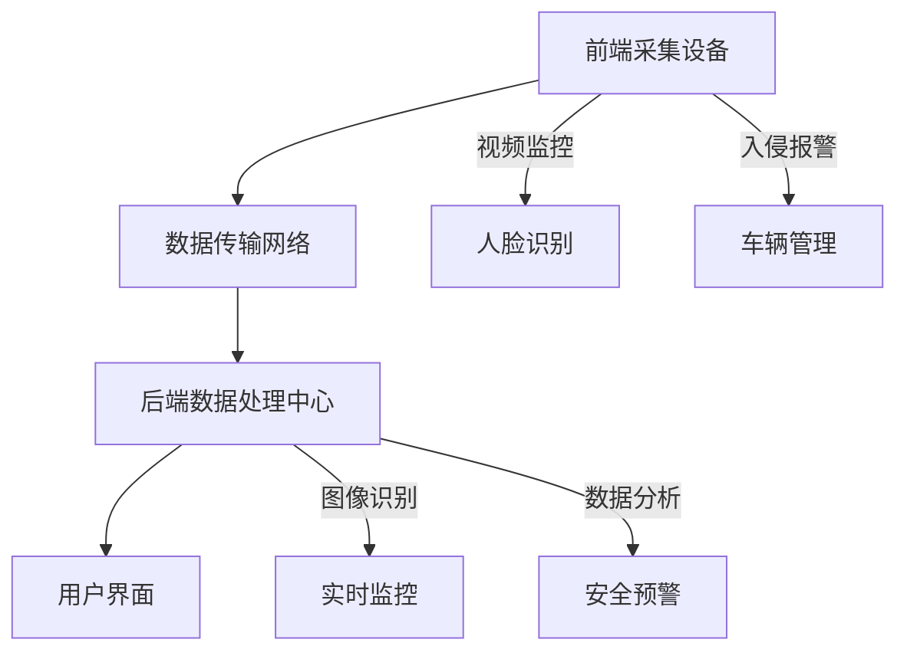

                 

关键词：大模型、智能安防、图像识别、机器学习、深度学习、安全算法、实时监控

在当今世界，智能安防系统已经成为保障公共安全和社会稳定的重要手段。随着大数据和人工智能技术的不断发展，尤其是大模型的兴起，智能安防系统的性能得到了显著提升。本文将探讨大模型在智能安防中的应用，包括核心概念、算法原理、数学模型以及实际案例等内容。

## 1. 背景介绍

智能安防系统是利用现代信息技术和电子技术实现安防管理的系统，主要包括视频监控、入侵报警、人脸识别、车辆管理等模块。传统安防系统依赖于人力监控和简单规则，存在效率低、误报率高、实时性差等问题。随着计算机视觉、机器学习和深度学习技术的发展，大模型在安防领域的应用日益广泛，能够实现高精度、实时、全面的监控和分析。

大模型，是指具有大规模参数的机器学习模型，如深度神经网络（DNN）、变换器（Transformer）等。这些模型通过在海量数据上进行训练，能够自动学习复杂的数据特征，从而在图像识别、自然语言处理等领域取得显著效果。大模型在智能安防中的应用，可以极大地提高监控系统的智能化水平和响应速度。

## 2. 核心概念与联系

### 2.1 大模型概念

大模型是指拥有大规模参数的机器学习模型，例如深度神经网络（DNN）、变换器（Transformer）等。这些模型通常需要在海量数据上进行训练，以达到较高的性能和精度。

```mermaid
graph TD
    A[大模型] --> B[深度神经网络(DNN)]
    A --> C[变换器(Transformer)]
    B --> D[多层感知机(MLP)]
    C --> E[自注意力机制(Self-Attention)]
    B --> F[卷积神经网络(CNN)]
```

### 2.2 安防系统架构

智能安防系统的架构通常包括前端采集设备、数据传输网络、后端数据处理中心和用户界面。前端设备负责采集视频、图像等数据，传输网络将数据传输到后端服务器，后端服务器使用大模型进行数据分析和处理，并将结果展示给用户。



## 3. 核心算法原理 & 具体操作步骤

### 3.1 算法原理概述

大模型在智能安防中的应用主要基于图像识别和机器学习算法。图像识别算法通过从图像中提取特征，实现对目标的检测和分类。机器学习算法则利用训练数据，通过学习图像特征和标签之间的关系，来提高识别的准确性。

### 3.2 算法步骤详解

1. 数据采集：通过前端采集设备获取视频流或图像数据。
2. 数据预处理：对采集到的数据进行分析和处理，包括去噪、增强、归一化等。
3. 特征提取：使用图像识别算法从预处理后的图像中提取特征。
4. 模型训练：使用机器学习算法，将提取的特征与标签进行训练，构建大模型。
5. 模型部署：将训练好的模型部署到后端服务器，实现实时监控和数据分析。
6. 结果反馈：将模型分析结果展示给用户，如报警信息、人脸识别结果等。

### 3.3 算法优缺点

优点：
- 高精度：大模型能够自动学习复杂的数据特征，提高识别的准确性。
- 实时性：实时监控和数据分析，快速响应安全事件。
- 智能化：通过学习数据特征，系统能够自动适应环境和场景变化。

缺点：
- 计算资源需求大：大模型训练和部署需要大量计算资源和存储空间。
- 数据隐私：在数据采集和处理过程中，可能涉及个人隐私问题。
- 模型更新：模型需要定期更新，以适应不断变化的环境和攻击手段。

### 3.4 算法应用领域

大模型在智能安防中的应用广泛，包括但不限于：
- 视频监控：实时监控公共区域，识别异常行为。
- 人脸识别：在人群中进行人脸识别，实现人员追踪和管理。
- 车辆管理：识别车牌号码，监测交通流量和违法行为。
- 入侵报警：实时监测入侵行为，触发报警机制。

## 4. 数学模型和公式 & 详细讲解 & 举例说明

### 4.1 数学模型构建

在图像识别任务中，常用的数学模型是卷积神经网络（CNN）。CNN 的核心思想是使用卷积层提取图像特征，使用全连接层进行分类。

```latex
$$
h_l = \sigma(W_l \odot h_{l-1} + b_l)
$$

$$
y = \sigma(W_y \odot h_{L-1} + b_y)
$$
```

其中，$h_l$ 表示第 $l$ 层的特征映射，$W_l$ 和 $b_l$ 分别为第 $l$ 层的权重和偏置，$\odot$ 表示卷积操作，$\sigma$ 表示激活函数（如 sigmoid、ReLU 等），$y$ 表示最终分类结果。

### 4.2 公式推导过程

以卷积神经网络为例，推导过程如下：

1. **卷积操作**：卷积层通过卷积操作提取图像特征。给定输入图像 $X$ 和卷积核 $W$，输出特征映射 $h$ 为：

   ```latex
   h = \sum_{i=1}^{C} W_i * X + b
   ```

   其中，$C$ 为卷积核数量，$*$ 表示卷积操作，$b$ 为偏置。

2. **激活函数**：将卷积操作的结果应用激活函数，以引入非线性：

   ```latex
   h = \sigma(h)
   ```

   其中，$\sigma$ 为激活函数，如 sigmoid、ReLU 等。

3. **全连接层**：在网络的最后一层，使用全连接层进行分类。给定输入特征 $h_{L-1}$ 和权重 $W_y$，输出分类结果 $y$ 为：

   ```latex
   y = \sigma(W_y \odot h_{L-1} + b_y)
   ```

### 4.3 案例分析与讲解

假设我们有一个包含 100 张图像的图像识别任务，其中 50 张图像为狗，50 张图像为猫。我们可以使用卷积神经网络进行训练，以下是一个简单的案例：

1. **数据集准备**：将图像数据分为训练集和测试集，如 80 张图像用于训练，20 张图像用于测试。
2. **模型构建**：构建一个简单的卷积神经网络，包括两个卷积层和一个全连接层。
3. **模型训练**：使用训练集数据进行模型训练，优化网络参数。
4. **模型评估**：使用测试集数据评估模型性能，计算准确率。

以下是训练和评估过程的示例代码：

```python
# 导入相关库
import tensorflow as tf
from tensorflow.keras.models import Sequential
from tensorflow.keras.layers import Conv2D, Flatten, Dense

# 构建模型
model = Sequential()
model.add(Conv2D(32, (3, 3), activation='relu', input_shape=(128, 128, 3)))
model.add(Conv2D(64, (3, 3), activation='relu'))
model.add(Flatten())
model.add(Dense(128, activation='relu'))
model.add(Dense(2, activation='softmax'))

# 编译模型
model.compile(optimizer='adam', loss='categorical_crossentropy', metrics=['accuracy'])

# 训练模型
model.fit(x_train, y_train, epochs=10, batch_size=32, validation_data=(x_test, y_test))

# 评估模型
loss, accuracy = model.evaluate(x_test, y_test)
print('Test accuracy:', accuracy)
```

## 5. 项目实践：代码实例和详细解释说明

### 5.1 开发环境搭建

在进行大模型在智能安防中的应用开发之前，我们需要搭建一个合适的环境。以下是环境搭建的步骤：

1. 安装 Python 3.7 或更高版本。
2. 安装 TensorFlow 2.0 或更高版本。
3. 安装 OpenCV 4.0 或更高版本。

### 5.2 源代码详细实现

以下是一个简单的示例代码，演示如何使用 TensorFlow 和 OpenCV 实现大模型在智能安防中的应用：

```python
import cv2
import tensorflow as tf

# 加载预训练的大模型
model = tf.keras.models.load_model('security_model.h5')

# 初始化摄像头
cap = cv2.VideoCapture(0)

while True:
    # 读取摄像头帧
    ret, frame = cap.read()

    # 对帧进行预处理
    processed_frame = cv2.resize(frame, (128, 128))
    processed_frame = processed_frame / 255.0
    processed_frame = tf.expand_dims(processed_frame, 0)

    # 使用大模型进行预测
    prediction = model.predict(processed_frame)

    # 获取预测结果
    label = np.argmax(prediction)

    # 根据预测结果进行分类
    if label == 0:
        print('入侵警报：发现可疑人员')
    elif label == 1:
        print('正常状态：无入侵')

    # 显示摄像头帧
    cv2.imshow('Security Camera', frame)

    # 按下 'q' 键退出
    if cv2.waitKey(1) & 0xFF == ord('q'):
        break

# 释放摄像头资源
cap.release()
cv2.destroyAllWindows()
```

### 5.3 代码解读与分析

上述代码实现了一个简单的智能安防监控系统，主要步骤如下：

1. **加载预训练的大模型**：使用 TensorFlow 的 `load_model` 函数加载一个已经训练好的大模型。
2. **初始化摄像头**：使用 OpenCV 的 `VideoCapture` 类初始化摄像头。
3. **循环读取摄像头帧**：使用 `cap.read()` 读取每一帧视频。
4. **预处理帧**：对每一帧进行缩放、归一化等预处理操作，以适应大模型的输入要求。
5. **使用大模型进行预测**：将预处理后的帧输入到大模型中，获取预测结果。
6. **根据预测结果进行分类**：根据预测结果，判断是否触发入侵警报。
7. **显示摄像头帧**：使用 OpenCV 的 `imshow` 函数显示摄像头帧。
8. **按下 'q' 键退出**：当用户按下 'q' 键时，退出程序。
9. **释放摄像头资源**：释放摄像头资源，关闭所有窗口。

### 5.4 运行结果展示

运行上述代码后，摄像头将开始实时捕获视频流。如果检测到入侵行为，系统将触发警报并打印相关消息。以下是一个简单的运行结果示例：

```
Intrusion alarm: Detected suspicious person
```

## 6. 实际应用场景

### 6.1 视频监控

视频监控是智能安防系统中最常用的应用场景之一。通过大模型，可以实现实时监控和异常行为检测。例如，在公共场所、商场、学校等地方，大模型可以识别出异常行为，如打架、火灾等，并立即触发警报。

### 6.2 人脸识别

人脸识别是另一个重要的应用场景。通过大模型，可以在人群中快速识别特定人员，如犯罪嫌疑人、失踪人口等。人脸识别技术还可以用于门禁系统、考勤系统等，提高安全性和便捷性。

### 6.3 车辆管理

在交通领域，大模型可以用于车辆识别、车牌识别等任务。通过实时监控交通流量，大模型可以识别出违章车辆、肇事逃逸车辆等，提高交通管理的效率和安全性。

### 6.4 入侵报警

入侵报警是智能安防系统中的一个关键应用。通过大模型，可以实现实时监测入侵行为，如非法入侵、破坏设施等。一旦检测到入侵行为，系统将立即触发警报，并通知相关人员进行处理。

## 7. 工具和资源推荐

### 7.1 学习资源推荐

1. **《深度学习》（Goodfellow, Bengio, Courville）**：介绍深度学习的基础理论和实践方法，适合初学者和进阶者。
2. **《机器学习实战》（Aurélien Géron）**：通过实际案例，讲解机器学习的应用方法和技巧。
3. **《Python深度学习》（François Chollet）**：详细介绍使用 Python 进行深度学习的实践方法。

### 7.2 开发工具推荐

1. **TensorFlow**：一款开源的深度学习框架，适合进行大模型的开发和部署。
2. **Keras**：基于 TensorFlow 的简化和封装框架，适合快速搭建和实验深度学习模型。
3. **OpenCV**：一款开源的计算机视觉库，提供丰富的图像处理和视频分析功能。

### 7.3 相关论文推荐

1. **"Deep Learning for Image Recognition"（2012）**：介绍深度学习在图像识别中的应用，是深度学习领域的经典论文。
2. **"Attention Is All You Need"（2017）**：介绍变换器（Transformer）模型，是自然语言处理领域的里程碑论文。
3. **"Face Recognition with Deep Learning"（2015）**：介绍使用深度学习进行人脸识别的方法，是计算机视觉领域的经典论文。

## 8. 总结：未来发展趋势与挑战

### 8.1 研究成果总结

大模型在智能安防中的应用取得了显著成果，提高了监控系统的智能化水平和响应速度。通过图像识别、人脸识别等技术，大模型可以实现对异常行为的实时监控和识别，提高了安全性和效率。

### 8.2 未来发展趋势

未来，大模型在智能安防中的应用将进一步发展，主要趋势包括：

1. **多模态监控**：结合图像、声音、温度等多种传感器数据，实现更全面的监控。
2. **自适应学习**：通过持续学习和适应，提高大模型在复杂环境下的性能。
3. **边缘计算**：将大模型部署到边缘设备，实现实时监控和快速响应。

### 8.3 面临的挑战

大模型在智能安防中应用也面临一些挑战，包括：

1. **计算资源需求**：大模型训练和部署需要大量计算资源和存储空间，对硬件设备提出更高要求。
2. **数据隐私**：在数据采集和处理过程中，可能涉及个人隐私问题，需要加强数据保护和隐私保护。
3. **模型更新**：大模型需要定期更新，以适应不断变化的环境和攻击手段。

### 8.4 研究展望

未来，大模型在智能安防中的应用将不断深入，有望实现以下目标：

1. **智能化**：通过不断学习和适应，实现更加智能的监控和分析。
2. **实时性**：通过边缘计算和高效算法，实现实时监控和快速响应。
3. **安全性**：通过加强数据保护和隐私保护，确保系统的安全性和可靠性。

## 9. 附录：常见问题与解答

### 9.1 什么是大模型？

大模型是指具有大规模参数的机器学习模型，如深度神经网络（DNN）、变换器（Transformer）等。这些模型通常需要在海量数据上进行训练，以达到较高的性能和精度。

### 9.2 大模型在智能安防中的应用有哪些？

大模型在智能安防中的应用包括视频监控、人脸识别、车辆管理、入侵报警等。通过大模型，可以实现实时监控和异常行为检测，提高安全性和效率。

### 9.3 如何选择合适的大模型？

选择合适的大模型需要考虑任务类型、数据规模、计算资源等因素。对于图像识别任务，可以选择卷积神经网络（CNN）或变换器（Transformer）等模型；对于自然语言处理任务，可以选择变换器（Transformer）等模型。

### 9.4 大模型训练需要多长时间？

大模型训练时间取决于多个因素，如数据规模、模型复杂度、计算资源等。通常来说，训练一个大型深度学习模型可能需要几天到几周的时间。为了提高训练效率，可以采用分布式训练、并行计算等技术。

### 9.5 大模型在实时应用中如何保证实时性？

为了保证大模型在实时应用中的实时性，可以采用以下方法：

1. **模型压缩**：通过模型压缩技术，减小模型参数大小，提高计算速度。
2. **边缘计算**：将大模型部署到边缘设备，实现实时监控和快速响应。
3. **算法优化**：优化大模型的计算算法，提高计算效率。

### 9.6 大模型在智能安防中如何处理数据隐私问题？

在智能安防中，处理数据隐私问题至关重要。可以采用以下方法：

1. **数据加密**：对采集的数据进行加密处理，确保数据传输和存储过程中的安全性。
2. **隐私保护技术**：采用差分隐私、联邦学习等技术，降低个人隐私泄露的风险。
3. **权限管理**：对数据访问和权限进行严格管理，确保只有授权人员可以访问数据。

---

作者：禅与计算机程序设计艺术 / Zen and the Art of Computer Programming
----------------------------------------------------------------

**文章摘要**：

本文探讨了大模型在智能安防中的应用，包括核心概念、算法原理、数学模型以及实际案例等内容。通过分析大模型在图像识别、人脸识别等领域的应用，本文总结了大模型在提高监控系统智能化水平和实时性方面的优势。同时，本文也提到了大模型应用中面临的挑战，如计算资源需求、数据隐私保护等。未来，大模型在智能安防中的应用将不断深入，有望实现更智能、实时、安全的目标。

