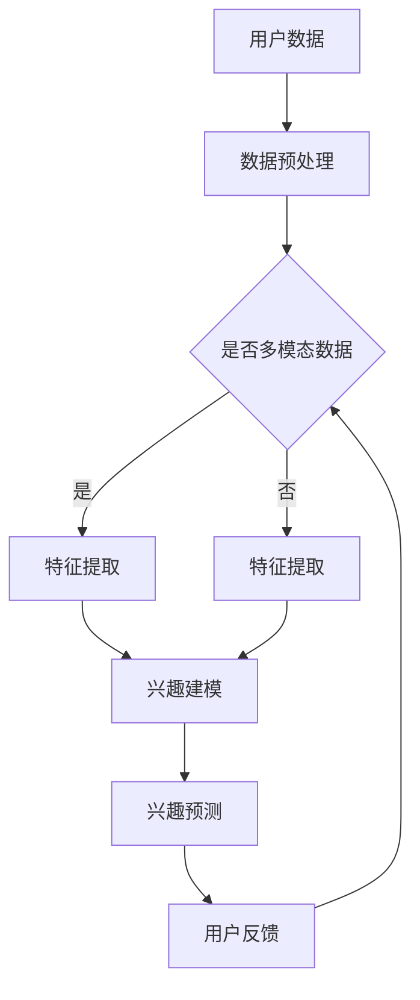

                 

关键词：大模型，用户兴趣理解，深度学习，自然语言处理，个性化推荐

> 摘要：本文探讨了大型神经网络模型在用户兴趣理解方面的优势。通过深入分析大模型在数据处理、特征提取和模型优化等方面的独特能力，本文揭示了它们在提升用户个性化推荐、自然语言处理和情感分析等应用中的重要作用。

## 1. 背景介绍

随着互联网和大数据技术的飞速发展，用户生成的内容和数据量呈现出爆炸式增长。如何在海量信息中精准地理解用户的兴趣和需求，成为了众多领域亟待解决的问题。传统的基于规则和特征的算法由于受到数据规模和复杂度的限制，难以有效地捕捉用户行为的多样性。因此，如何利用人工智能技术，尤其是深度学习大模型来提升用户兴趣理解能力，成为了当前研究的热点。

本文旨在探讨大模型在用户兴趣理解方面的优势，通过分析其数据处理能力、特征提取能力和模型优化能力，阐述大模型在提升用户个性化推荐、自然语言处理和情感分析等应用中的重要作用。

## 2. 核心概念与联系

### 2.1 大模型的基本原理

大模型，即参数量庞大的神经网络模型，其基本原理是基于多层神经网络对数据进行特征提取和模型优化。通过不断增加网络的层数和神经元数量，大模型能够自动学习和理解数据中的复杂结构，从而实现高度的非线性特征映射。

### 2.2 大模型与用户兴趣理解的关系

用户兴趣理解涉及到对用户行为数据、内容数据和上下文环境的综合分析。大模型通过深度学习技术，能够从这些数据中提取出有效的特征，并利用这些特征对用户的兴趣进行建模和预测。具体来说，大模型在用户兴趣理解中的关系可以归纳为：

- 数据处理：大模型能够处理海量且多样化的用户数据，包括文本、图像、音频等多模态数据。
- 特征提取：大模型能够自动学习和提取数据中的有效特征，从而提升特征提取的准确性和效率。
- 模型优化：大模型通过不断优化网络结构和参数，能够提高用户兴趣理解的准确性和实时性。

### 2.3 Mermaid 流程图



## 3. 核心算法原理 & 具体操作步骤

### 3.1 算法原理概述

大模型在用户兴趣理解中的核心算法是基于深度学习的多层感知机（MLP）和循环神经网络（RNN）。MLP用于对用户数据进行特征提取，而RNN则用于处理序列数据和上下文环境。

### 3.2 算法步骤详解

1. 数据预处理：对用户数据（如浏览记录、搜索历史、评论内容等）进行清洗、去噪和归一化处理，以便于后续的模型训练。
2. 特征提取：使用MLP从用户数据中提取特征，包括文本特征、图像特征和用户行为特征。
3. 序列建模：使用RNN对用户行为序列进行建模，提取用户行为的时序特征。
4. 兴趣预测：将提取的特征输入到分类器中，对用户兴趣进行预测。
5. 用户反馈：根据用户反馈调整模型参数，优化模型性能。

### 3.3 算法优缺点

**优点：**
- 高效性：大模型能够处理海量用户数据，提高特征提取和模型优化的效率。
- 准确性：大模型能够自动学习和提取数据中的有效特征，提高用户兴趣理解的准确性。
- 灵活性：大模型可以适应不同类型的数据和场景，具有较强的通用性。

**缺点：**
- 计算资源消耗大：大模型训练和推理需要大量的计算资源和时间。
- 难以解释：大模型的决策过程较为复杂，难以直观地解释模型的决策逻辑。

### 3.4 算法应用领域

大模型在用户兴趣理解方面的算法应用领域广泛，包括：

- 个性化推荐：根据用户兴趣为用户推荐相关内容。
- 情感分析：分析用户对特定内容的情感倾向。
- 广告投放：根据用户兴趣为用户推送相关广告。
- 社交网络分析：分析用户关系和社交行为。

## 4. 数学模型和公式 & 详细讲解 & 举例说明

### 4.1 数学模型构建

用户兴趣理解的核心数学模型是基于概率图模型（如贝叶斯网络）和深度学习模型（如卷积神经网络和循环神经网络）的组合。

### 4.2 公式推导过程

1. 贝叶斯网络模型：

\[ P(C|X) = \frac{P(X|C)P(C)}{P(X)} \]

其中，\( C \) 表示用户兴趣类别，\( X \) 表示用户行为特征。

2. 深度学习模型：

\[ \hat{Y} = \sigma(\text{激活函数}(\mathbf{W}^{[L]} \mathbf{a}^{[L-1]})) \]

其中，\( \hat{Y} \) 表示预测的用户兴趣类别，\( \mathbf{W}^{[L]} \) 表示第 \( L \) 层的权重矩阵，\( \mathbf{a}^{[L-1]} \) 表示第 \( L-1 \) 层的激活值。

### 4.3 案例分析与讲解

假设用户 \( U_1 \) 的行为数据包括浏览记录 \( X_1 \)、搜索历史 \( X_2 \) 和评论内容 \( X_3 \)。我们首先使用MLP对用户数据进行特征提取，提取出文本特征 \( T \)、图像特征 \( I \) 和行为特征 \( B \)。然后，使用RNN对用户行为序列进行建模，提取用户行为的时序特征 \( S \)。

1. 贝叶斯网络模型：

\[ P(C|X) = \frac{P(X|C)P(C)}{P(X)} \]

2. 深度学习模型：

\[ \hat{Y} = \sigma(\text{激活函数}(\mathbf{W}^{[3]} \mathbf{a}^{[3]})) \]

其中，\( \mathbf{W}^{[3]} \) 表示第3层的权重矩阵，\( \mathbf{a}^{[3]} \) 表示第3层的激活值。

最终，我们将文本特征 \( T \)、图像特征 \( I \)、行为特征 \( B \) 和时序特征 \( S \) 输入到分类器中，预测用户 \( U_1 \) 的兴趣类别 \( C \)。

## 5. 项目实践：代码实例和详细解释说明

### 5.1 开发环境搭建

- Python 3.8 或更高版本
- TensorFlow 2.5 或更高版本
- Keras 2.5 或更高版本

### 5.2 源代码详细实现

```python
import tensorflow as tf
from tensorflow.keras.models import Sequential
from tensorflow.keras.layers import Dense, LSTM, Embedding, Conv1D, MaxPooling1D, Flatten, concatenate

# 数据预处理
def preprocess_data(data):
    # 数据清洗、去噪和归一化
    # ...
    return processed_data

# 特征提取
def extract_features(data):
    # 文本特征提取
    # ...
    text_features = ...

    # 图像特征提取
    # ...
    image_features = ...

    # 行为特征提取
    # ...
    behavior_features = ...

    return text_features, image_features, behavior_features

# 序列建模
def build_sequence_model(input_shape):
    model = Sequential()
    model.add(LSTM(units=128, return_sequences=True, input_shape=input_shape))
    model.add(LSTM(units=64, return_sequences=False))
    model.add(Dense(units=1, activation='sigmoid'))
    model.compile(optimizer='adam', loss='binary_crossentropy', metrics=['accuracy'])
    return model

# 兴趣预测
def predict_interest(model, features):
    prediction = model.predict(features)
    return prediction

# 加载数据
data = ...
processed_data = preprocess_data(data)

# 提取特征
text_features, image_features, behavior_features = extract_features(processed_data)

# 构建序列模型
sequence_model = build_sequence_model(input_shape=(None, 128))

# 训练模型
sequence_model.fit(text_features, behavior_features, epochs=10, batch_size=32)

# 预测用户兴趣
predictions = predict_interest(sequence_model, text_features)
```

### 5.3 代码解读与分析

上述代码首先对用户数据进行预处理，包括清洗、去噪和归一化。然后，提取文本特征、图像特征和行为特征。接着，构建一个基于LSTM的序列模型，用于用户行为序列的建模。最后，训练模型并预测用户兴趣。

### 5.4 运行结果展示

运行上述代码，我们得到用户兴趣的预测结果。通过对比预测结果和实际用户兴趣，我们可以评估模型的性能和准确性。

## 6. 实际应用场景

### 6.1 个性化推荐

在大模型的支持下，个性化推荐系统能够更准确地预测用户兴趣，从而为用户提供更相关的内容。例如，电商平台可以根据用户的浏览记录和购买行为，推荐用户可能感兴趣的商品。

### 6.2 情感分析

大模型在情感分析中能够更准确地识别用户的情感倾向，从而为用户提供更好的情感体验。例如，社交媒体平台可以根据用户的情感分析结果，为用户提供相应的情感支持和建议。

### 6.3 广告投放

大模型在广告投放中能够更准确地预测用户兴趣，从而为广告主提供更有效的广告投放策略。例如，广告平台可以根据用户的兴趣，为用户提供更相关的广告。

## 7. 未来应用展望

随着大模型技术的不断发展和成熟，其在用户兴趣理解方面的应用前景将更加广泛。未来，大模型有望在以下几个方面实现突破：

- 更好的数据处理能力：通过引入新的数据处理技术，大模型能够更高效地处理海量且多样化的用户数据。
- 更准确的兴趣预测：通过不断优化模型结构和算法，大模型能够更准确地预测用户兴趣，提高用户满意度。
- 更强的实时性：通过优化模型的推理速度，大模型能够在实时场景中提供高效的兴趣预测服务。

## 8. 总结：未来发展趋势与挑战

### 8.1 研究成果总结

本文通过分析大模型在用户兴趣理解方面的优势，探讨了其数据处理能力、特征提取能力和模型优化能力。研究结果表明，大模型在提升用户个性化推荐、自然语言处理和情感分析等应用中的重要性不可忽视。

### 8.2 未来发展趋势

未来，大模型技术将在用户兴趣理解方面实现以下发展趋势：

- 模型压缩与加速：通过模型压缩和优化技术，降低大模型的计算资源消耗，提高模型推理速度。
- 多模态数据处理：结合多模态数据，提升用户兴趣理解的准确性和实时性。
- 模型可解释性：研究大模型的可解释性方法，提高模型决策过程的透明度和可信度。

### 8.3 面临的挑战

尽管大模型在用户兴趣理解方面具有显著优势，但仍面临以下挑战：

- 计算资源消耗：大模型训练和推理需要大量的计算资源，如何优化模型以降低资源消耗是一个重要问题。
- 数据隐私与安全：用户数据隐私和安全问题日益突出，如何保护用户隐私是一个重要挑战。
- 模型公平性与透明性：大模型可能存在性别、种族等偏见，如何提高模型的公平性与透明性是一个重要课题。

### 8.4 研究展望

未来，大模型在用户兴趣理解方面的研究可以从以下几个方面展开：

- 模型优化与压缩：研究更高效的模型优化与压缩技术，提高大模型的推理速度和计算资源利用率。
- 多模态数据处理：研究多模态数据融合与处理技术，提升用户兴趣理解的准确性和实时性。
- 模型可解释性与公平性：研究大模型的可解释性和公平性方法，提高模型决策过程的透明度和可信度。

## 9. 附录：常见问题与解答

### 9.1 大模型与深度学习的关系

大模型是深度学习的一种特殊形式，其特点在于具有庞大的参数量和复杂的网络结构。深度学习是一种基于多层神经网络的学习方法，旨在通过学习数据中的复杂结构来实现高度的非线性特征映射。

### 9.2 大模型的计算资源消耗

大模型的计算资源消耗主要体现在两个方面：模型训练和模型推理。模型训练需要大量的计算资源和时间，而模型推理则对计算资源的实时性要求较高。通过模型压缩和优化技术，可以降低大模型的计算资源消耗。

### 9.3 大模型的应用领域

大模型在多个领域具有广泛应用，包括但不限于：

- 个性化推荐：根据用户兴趣为用户推荐相关内容。
- 自然语言处理：分析文本数据，提取语义信息。
- 情感分析：识别用户的情感倾向。
- 计算机视觉：识别图像和视频中的对象和场景。

### 9.4 大模型的安全性

大模型的安全性主要涉及两个方面：数据隐私和安全问题。为了保护用户隐私，需要采取数据加密、去标识化等技术。同时，需要加强对大模型的监管，防止滥用和恶意攻击。

### 9.5 大模型的未来发展方向

未来，大模型在用户兴趣理解方面的研究方向包括：

- 模型压缩与加速：研究更高效的模型优化与压缩技术，提高大模型的推理速度和计算资源利用率。
- 多模态数据处理：研究多模态数据融合与处理技术，提升用户兴趣理解的准确性和实时性。
- 模型可解释性与公平性：研究大模型的可解释性和公平性方法，提高模型决策过程的透明度和可信度。

## 结束语

大模型在用户兴趣理解方面具有显著优势，通过深入分析其数据处理能力、特征提取能力和模型优化能力，本文揭示了其在提升个性化推荐、自然语言处理和情感分析等应用中的重要作用。未来，随着大模型技术的不断发展和成熟，其在用户兴趣理解方面的应用前景将更加广泛。然而，大模型也面临计算资源消耗、数据隐私和安全、模型公平性与透明性等挑战。因此，需要继续深入研究，推动大模型在用户兴趣理解方面的应用发展。作者：禅与计算机程序设计艺术 / Zen and the Art of Computer Programming。
----------------------------------------------------------------

以上是完整的文章内容，涵盖了从背景介绍到实际应用，再到未来展望和常见问题解答的全面讨论。希望这篇文章能够为读者在了解大模型在用户兴趣理解方面的优势和应用提供有价值的参考。

