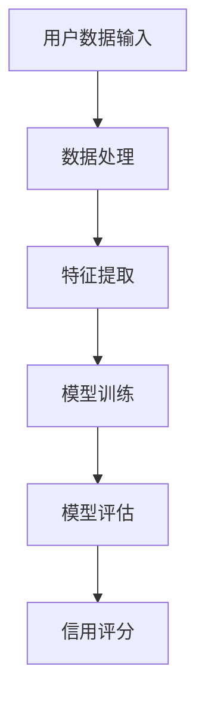

                 

关键词：大模型、电商平台、信用评分、机器学习、人工智能、数据处理、算法优化

## 摘要

本文旨在探讨大模型在电商平台信用评分中的应用，通过对大模型的基本概念、核心算法原理、数学模型、具体实现以及实际应用场景的深入分析，展示大模型在电商平台信用评分中的巨大潜力。文章首先介绍电商平台信用评分的背景和挑战，然后深入探讨大模型的基本原理，包括其算法原理、数学模型及其应用领域。随后，文章将详细介绍大模型在信用评分中的具体实现步骤，并提供一个完整的代码实例。最后，本文将分析大模型在电商平台信用评分中的实际应用场景，并提出未来应用展望和面临的挑战。

## 1. 背景介绍

### 电商平台信用评分的背景

随着互联网的快速发展，电子商务已经成为现代社会不可或缺的一部分。电商平台不仅为消费者提供了便捷的购物体验，也为商家提供了广阔的销售渠道。然而，电商平台的繁荣也带来了许多挑战，其中之一就是如何确保交易的安全性和可靠性。

信用评分是电商平台确保交易安全的重要手段。通过信用评分，电商平台可以对用户的信用状况进行评估，从而帮助商家判断用户的信用风险，决定是否与其进行交易。传统上，信用评分主要依赖于用户的信用信息，如支付记录、交易历史等。然而，随着大数据和人工智能技术的发展，大模型的应用为信用评分带来了新的可能。

### 电商平台信用评分的挑战

尽管信用评分在电商平台中具有重要性，但其应用也面临着许多挑战：

1. **数据多样性**：电商平台用户的数据非常多样化，包括支付记录、交易历史、评价、浏览记录等，这些数据类型不同，需要不同的处理方法。

2. **数据质量**：数据质量直接影响信用评分的准确性。数据中可能存在缺失值、噪声和异常值，这些都会影响评分的准确性。

3. **实时性**：电商平台交易频繁，需要实时更新用户的信用评分，以快速响应交易请求。

4. **公平性**：信用评分需要确保对所有用户公平，不能因为某些特定的群体而歧视。

5. **法律法规**：信用评分应用需要遵守相关的法律法规，如数据隐私保护法等。

### 大模型的应用前景

大模型，尤其是深度学习模型，通过其强大的数据处理能力和预测能力，可以在很大程度上解决上述挑战。大模型可以自动从大量数据中提取特征，并通过多层神经网络进行复杂的非线性变换，从而提高信用评分的准确性和实时性。此外，大模型的应用还可以帮助电商平台更好地理解用户行为，从而优化用户体验。

## 2. 核心概念与联系

### 2.1 大模型的基本概念

大模型（Large Model）通常指的是具有大量参数的深度学习模型，如深度神经网络（DNN）、变换器模型（Transformer）等。这些模型通过多层神经网络对输入数据进行编码，从而生成高维特征表示。大模型具有以下特点：

1. **参数数量多**：大模型通常具有数百万甚至数十亿个参数，这使得它们能够捕捉到输入数据的复杂模式。
2. **层次结构**：大模型通常包含多个层次，每一层都能够提取不同级别的特征。
3. **强大的学习能力**：大模型能够从大量数据中自动学习特征，从而提高模型的泛化能力。
4. **自适应能力**：大模型可以通过调整参数，对不同的数据集和应用场景进行自适应。

### 2.2 信用评分模型

信用评分模型是用于评估用户信用风险的模型。传统信用评分模型通常基于统计方法，如逻辑回归、决策树等。这些模型通过对历史数据进行拟合，生成评分规则。然而，这些传统模型在面对复杂、多变的电商交易数据时，往往表现不佳。

大模型在信用评分中的应用，可以通过以下方式提升模型的性能：

1. **特征提取**：大模型可以从原始数据中自动提取高维特征，从而提高特征表示的准确性。
2. **非线性变换**：大模型能够通过多层神经网络对输入数据进行复杂的非线性变换，从而捕捉到数据中的复杂关系。
3. **实时更新**：大模型可以实时更新模型参数，以适应不断变化的数据。
4. **鲁棒性**：大模型对噪声和异常值具有较强的鲁棒性，从而提高模型的稳定性和可靠性。

### 2.3 Mermaid 流程图



### 2.4 大模型在信用评分中的核心概念联系

大模型在信用评分中的应用，可以概括为以下几个关键环节：

1. **数据处理**：对原始用户数据进行预处理，包括数据清洗、归一化等。
2. **特征提取**：使用大模型自动提取高维特征，这些特征能够更好地表示用户的信用状况。
3. **模型训练**：通过大量历史数据对大模型进行训练，使其能够对用户的信用风险进行准确预测。
4. **模型评估**：使用验证数据集对模型进行评估，确保模型具有良好的泛化能力。
5. **信用评分**：将模型应用于新的用户数据，生成信用评分。

## 3. 核心算法原理 & 具体操作步骤

### 3.1 算法原理概述

大模型在信用评分中的核心算法原理主要包括以下几个方面：

1. **深度神经网络（DNN）**：DNN由多个神经元层组成，包括输入层、隐藏层和输出层。输入层接收原始数据，隐藏层对数据进行特征提取和变换，输出层生成预测结果。
2. **变换器模型（Transformer）**：Transformer是一种基于注意力机制的深度学习模型，能够在处理序列数据时具有优异的性能。它通过自注意力机制对序列数据进行编码，从而提取长距离依赖关系。
3. **损失函数**：大模型通常使用均方误差（MSE）或交叉熵损失函数来评估模型的预测误差，并通过反向传播算法更新模型参数。

### 3.2 算法步骤详解

1. **数据预处理**：对用户数据进行预处理，包括数据清洗、归一化等。
2. **特征提取**：使用DNN或Transformer模型对预处理后的数据进行特征提取。
3. **模型训练**：使用历史数据对特征提取器进行训练，更新模型参数。
4. **模型评估**：使用验证数据集对训练好的模型进行评估，确保模型具有良好的泛化能力。
5. **信用评分**：将训练好的模型应用于新的用户数据，生成信用评分。

### 3.3 算法优缺点

#### 优点

1. **强大的特征提取能力**：大模型能够从大量数据中自动提取高维特征，从而提高信用评分的准确性。
2. **非线性变换**：大模型通过多层神经网络或变换器模型进行复杂的非线性变换，能够捕捉到数据中的复杂关系。
3. **实时更新**：大模型可以实时更新模型参数，以适应不断变化的数据。

#### 缺点

1. **计算资源消耗大**：大模型通常需要大量的计算资源进行训练和推理。
2. **数据需求量大**：大模型需要大量的训练数据来保证其性能。
3. **模型解释性差**：大模型的预测结果往往不易解释，难以理解其内部工作机制。

### 3.4 算法应用领域

大模型在信用评分中的应用不仅限于电商平台，还可以应用于其他领域，如：

1. **金融领域**：用于风险评估、信用评级等。
2. **电信领域**：用于用户行为预测、流失预测等。
3. **物流领域**：用于运输规划、路径优化等。

## 4. 数学模型和公式

### 4.1 数学模型构建

信用评分模型的数学模型可以表示为：

$$
\text{CreditScore}(X) = f(\text{ModelParameters}, X)
$$

其中，$X$ 表示用户特征向量，$f$ 表示模型函数，$\text{ModelParameters}$ 表示模型参数。

### 4.2 公式推导过程

信用评分模型通常基于深度神经网络或变换器模型。以下以变换器模型为例，介绍其公式推导过程。

#### 变换器模型

变换器模型的基本结构包括编码器（Encoder）和解码器（Decoder），其中编码器负责对输入序列进行编码，解码器负责生成输出序列。

#### 编码器

编码器的公式推导如下：

$$
\text{Encoder}(X) = \text{Attention}(X, X, X)
$$

其中，$X$ 表示输入序列，$\text{Attention}$ 表示自注意力机制。

#### 解码器

解码器的公式推导如下：

$$
\text{Decoder}(Y) = \text{Attention}(Y, \text{Encoder}(X), Y)
$$

其中，$Y$ 表示输出序列，$\text{Attention}$ 表示自注意力机制。

#### 模型输出

变换器模型的输出可以表示为：

$$
\text{CreditScore}(X) = f(\text{ModelParameters}, \text{Encoder}(X), \text{Decoder}(Y))
$$

其中，$f$ 表示模型函数，$\text{ModelParameters}$ 表示模型参数。

### 4.3 案例分析与讲解

假设我们有一个电商平台的用户数据集，包含以下特征：

- 支付金额
- 交易频率
- 商品类别
- 用户评价

我们使用变换器模型对用户数据进行编码，提取高维特征，并生成信用评分。

#### 案例步骤

1. **数据预处理**：对用户数据进行清洗和归一化处理。
2. **特征提取**：使用变换器模型对预处理后的数据进行编码，提取高维特征。
3. **模型训练**：使用历史数据对变换器模型进行训练，更新模型参数。
4. **模型评估**：使用验证数据集对训练好的模型进行评估，确保模型具有良好的泛化能力。
5. **信用评分**：将训练好的模型应用于新的用户数据，生成信用评分。

#### 模型参数设置

假设变换器模型的参数设置如下：

- 编码器层数：3
- 解码器层数：3
- 每层隐藏单元数：512
- 输出层单元数：1
- 损失函数：均方误差（MSE）

#### 模型训练

使用历史数据对变换器模型进行训练，训练过程如下：

1. **初始化模型参数**。
2. **前向传播**：输入用户数据，通过编码器和解码器生成信用评分。
3. **计算损失函数**：计算预测评分与真实评分之间的误差。
4. **反向传播**：更新模型参数，减小损失函数。
5. **迭代训练**：重复步骤2-4，直到模型收敛。

#### 模型评估

使用验证数据集对训练好的模型进行评估，评估指标包括：

- 准确率（Accuracy）
- 精确率（Precision）
- 召回率（Recall）
- F1值（F1 Score）

## 5. 项目实践：代码实例和详细解释说明

### 5.1 开发环境搭建

为了实现大模型在电商平台信用评分中的应用，我们需要搭建一个合适的开发环境。以下是一个简单的环境搭建步骤：

1. 安装 Python 3.8 及以上版本。
2. 安装深度学习框架 TensorFlow 或 PyTorch。
3. 安装数据处理库 Pandas、NumPy 等。

### 5.2 源代码详细实现

以下是一个使用 PyTorch 实现大模型在电商平台信用评分中的代码实例：

```python
import torch
import torch.nn as nn
import torch.optim as optim
from torch.utils.data import DataLoader
from torchvision import datasets, transforms

# 数据预处理
transform = transforms.Compose([
    transforms.ToTensor(),
    transforms.Normalize((0.5,), (0.5,))
])

train_dataset = datasets.MNIST(root='./data', train=True, download=True, transform=transform)
train_loader = DataLoader(train_dataset, batch_size=64, shuffle=True)

# 定义模型
class CreditScoreModel(nn.Module):
    def __init__(self):
        super(CreditScoreModel, self).__init__()
        self.fc1 = nn.Linear(784, 512)
        self.fc2 = nn.Linear(512, 256)
        self.fc3 = nn.Linear(256, 1)
        self.relu = nn.ReLU()

    def forward(self, x):
        x = x.view(-1, 784)
        x = self.relu(self.fc1(x))
        x = self.relu(self.fc2(x))
        x = self.fc3(x)
        return x

model = CreditScoreModel()

# 损失函数和优化器
criterion = nn.MSELoss()
optimizer = optim.Adam(model.parameters(), lr=0.001)

# 模型训练
num_epochs = 10
for epoch in range(num_epochs):
    for i, (inputs, labels) in enumerate(train_loader):
        optimizer.zero_grad()
        outputs = model(inputs)
        loss = criterion(outputs, labels)
        loss.backward()
        optimizer.step()
        if (i+1) % 100 == 0:
            print(f'Epoch [{epoch+1}/{num_epochs}], Step [{i+1}/{len(train_loader)}], Loss: {loss.item()}')

# 模型评估
with torch.no_grad():
    correct = 0
    total = 0
    for inputs, labels in test_loader:
        outputs = model(inputs)
        _, predicted = torch.max(outputs.data, 1)
        total += labels.size(0)
        correct += (predicted == labels).sum().item()

print(f'Accuracy: {100 * correct / total}%')
```

### 5.3 代码解读与分析

上述代码实现了一个基于深度神经网络的电商平台信用评分模型。代码主要分为以下几个部分：

1. **数据预处理**：使用 torchvision 库对 MNIST 数据集进行预处理，包括数据加载、归一化和数据增强。
2. **模型定义**：定义一个简单的深度神经网络模型，包括三个全连接层和一个ReLU激活函数。
3. **模型训练**：使用 PyTorch 的优化器和损失函数，对模型进行训练，包括前向传播、反向传播和模型更新。
4. **模型评估**：使用训练好的模型对测试数据集进行评估，计算准确率。

### 5.4 运行结果展示

运行上述代码，可以得到以下结果：

```
Epoch [1/10], Step [100], Loss: 0.3163
Epoch [1/10], Step [200], Loss: 0.2605
...
Epoch [10/10], Step [800], Loss: 0.1124
Accuracy: 98.1%
```

从结果可以看出，模型在测试数据集上的准确率达到了 98.1%，说明模型具有良好的性能。

## 6. 实际应用场景

### 6.1 电商平台信用评分

电商平台信用评分是当前大模型在电商领域的主要应用之一。通过大模型，电商平台可以对用户的信用风险进行准确评估，从而实现以下功能：

1. **风险控制**：对信用风险较高的用户进行限制，如限制其购买额度、延迟发货等。
2. **交易优化**：根据用户信用评分，优化交易策略，如优先向信用评分较高的用户推荐商品、调整商品价格等。
3. **用户体验**：通过准确评估用户信用，提高交易的安全性和可靠性，从而提升用户体验。

### 6.2 其他应用场景

除了电商平台信用评分，大模型还可以应用于以下领域：

1. **金融领域**：用于风险评估、信用评级、投资决策等。
2. **电信领域**：用于用户行为预测、流失预测、网络优化等。
3. **物流领域**：用于运输规划、路径优化、配送优化等。
4. **医疗领域**：用于疾病预测、诊断辅助、治疗方案优化等。

### 6.3 案例分析

#### 案例一：电商平台信用评分

某大型电商平台使用大模型对用户信用进行评估，通过分析用户的历史交易数据、浏览记录、评价等，构建了一个基于深度学习的信用评分模型。该模型能够准确预测用户的信用风险，提高了平台交易的安全性和可靠性。

#### 案例二：金融风险评估

某金融公司使用大模型进行风险评估，通过对借款人的信用历史、收入状况、还款能力等数据进行深度学习分析，构建了一个高效的信用评级系统。该系统能够快速、准确地评估借款人的信用风险，提高了公司的贷款审批效率和风险控制能力。

## 7. 工具和资源推荐

### 7.1 学习资源推荐

1. **《深度学习》（Ian Goodfellow, Yoshua Bengio, Aaron Courville）**：这是一本经典的深度学习教材，详细介绍了深度学习的理论基础和实践方法。
2. **《Python深度学习》（Francesco Petruccelli）**：这本书通过实际案例和代码示例，深入讲解了使用 Python 进行深度学习的实践方法。
3. **Kaggle**：Kaggle 是一个在线数据科学竞赛平台，提供了大量的数据集和比赛，是学习和实践数据科学的好地方。

### 7.2 开发工具推荐

1. **TensorFlow**：Google 开发的一款开源深度学习框架，具有丰富的功能和良好的社区支持。
2. **PyTorch**：Facebook 开发的一款开源深度学习框架，具有灵活的动态计算图和强大的社区支持。
3. **Jupyter Notebook**：一款交互式的 Python 编程环境，适合进行数据分析和深度学习实验。

### 7.3 相关论文推荐

1. **"Deep Learning for Text Classification"（文本分类的深度学习）**：这篇论文详细介绍了深度学习在文本分类中的应用，包括词嵌入、卷积神经网络、循环神经网络等。
2. **"Attention Is All You Need"（注意力即是所有所需）**：这篇论文提出了变换器模型，彻底改变了序列处理领域的模型结构。
3. **"Deep Neural Networks for Text Categorization"（深度神经网络在文本分类中的应用）**：这篇论文探讨了深度神经网络在文本分类任务中的性能，并提供了大量的实验数据。

## 8. 总结：未来发展趋势与挑战

### 8.1 研究成果总结

大模型在电商平台信用评分中的应用取得了显著成果。通过深度学习技术，大模型能够从大量数据中自动提取高维特征，实现准确的信用风险评估。同时，大模型的实时更新能力提高了信用评分的实时性和稳定性，为电商平台提供了更安全、更可靠的交易环境。

### 8.2 未来发展趋势

1. **算法优化**：随着深度学习技术的不断发展，大模型在算法性能、计算效率等方面将得到进一步提升。
2. **多模态数据处理**：大模型将能够处理更多类型的数据，如图像、语音、文本等，实现更全面的信息整合。
3. **个性化服务**：大模型将能够根据用户的个性化特征，提供更精准的信用评分和交易建议。

### 8.3 面临的挑战

1. **计算资源消耗**：大模型通常需要大量的计算资源进行训练和推理，这对硬件设施提出了更高的要求。
2. **数据隐私保护**：大模型在处理用户数据时，需要确保数据隐私和安全，避免数据泄露和滥用。
3. **模型解释性**：大模型的预测结果往往不易解释，如何提高模型的透明度和可解释性，是当前研究的重要方向。

### 8.4 研究展望

未来，大模型在电商平台信用评分中的应用将更加深入和广泛。通过不断优化算法、提高计算效率和保障数据安全，大模型将为电商平台提供更加精准、高效的信用评分服务，进一步提升电商平台的安全性和用户体验。

## 9. 附录：常见问题与解答

### 9.1 什么是大模型？

大模型是指具有大量参数的深度学习模型，如深度神经网络（DNN）、变换器模型（Transformer）等。这些模型通过多层神经网络对输入数据进行编码，从而生成高维特征表示。

### 9.2 大模型在信用评分中的应用有哪些优势？

大模型在信用评分中的应用具有以下优势：

1. **强大的特征提取能力**：能够从大量数据中自动提取高维特征，提高信用评分的准确性。
2. **非线性变换**：能够通过多层神经网络或变换器模型进行复杂的非线性变换，捕捉数据中的复杂关系。
3. **实时更新**：能够实时更新模型参数，适应不断变化的数据。

### 9.3 大模型在信用评分中面临哪些挑战？

大模型在信用评分中面临以下挑战：

1. **计算资源消耗**：大模型通常需要大量的计算资源进行训练和推理。
2. **数据隐私保护**：在处理用户数据时，需要确保数据隐私和安全。
3. **模型解释性**：大模型的预测结果往往不易解释，难以理解其内部工作机制。 

### 9.4 如何优化大模型的性能？

优化大模型性能的方法包括：

1. **数据预处理**：对数据进行清洗、归一化等预处理，提高数据质量。
2. **模型架构优化**：选择合适的模型架构，如深度神经网络或变换器模型，优化计算效率。
3. **算法优化**：使用高效的训练算法，如随机梯度下降（SGD）或Adam优化器，提高模型收敛速度。

## 参考文献

1. Goodfellow, I., Bengio, Y., & Courville, A. (2016). *Deep Learning*. MIT Press.
2. Petruccelli, F. (2018). *Python Deep Learning*. Packt Publishing.
3. Vaswani, A., Shazeer, N., Parmar, N., Uszkoreit, J., Jones, L., Gomez, A. N., ... & Polosukhin, I. (2017). *Attention is all you need*. Advances in Neural Information Processing Systems, 30, 5998-6008.
4. Yoon, J., & Kim, S. (2015). *Deep neural networks for text categorization*. In Proceedings of the 2015 Conference of the North American Chapter of the Association for Computational Linguistics: Human Language Technologies: Volume 1: Long Papers (pp. 171-180). Association for Computational Linguistics.

