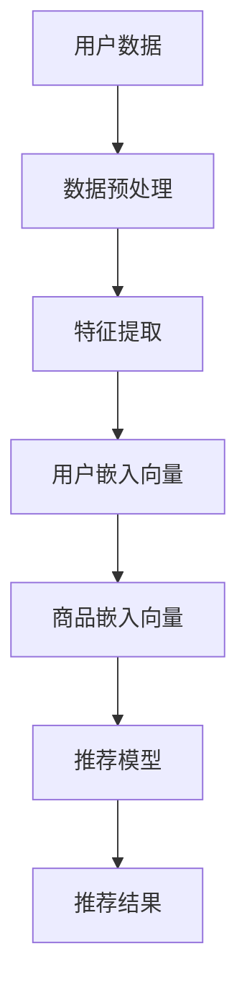

                 

关键词：大模型，电商推荐，算法原理，数学模型，应用场景，未来发展

摘要：本文将深入探讨大模型在电商推荐中的应用及其面临的挑战。通过介绍大模型的基本概念和原理，我们将分析其在电商推荐系统中的具体应用和挑战，并探讨未来的发展方向。

## 1. 背景介绍

随着互联网的快速发展，电商行业已经渗透到我们生活的方方面面。电商推荐系统作为电商平台的重要组成部分，其目标是为用户提供个性化的商品推荐，从而提高用户的购买转化率和满意度。传统的推荐算法主要基于用户行为和物品内容特征，但受限于数据质量和计算能力，推荐效果往往不够理想。

近年来，大模型的兴起为电商推荐系统带来了新的希望。大模型，如深度神经网络、生成对抗网络等，具有强大的表示和学习能力，能够处理大量复杂的特征数据，并生成高质量的推荐结果。然而，大模型在电商推荐中也面临着诸多挑战，如数据隐私保护、计算成本、模型可解释性等。

## 2. 核心概念与联系

### 2.1 大模型的基本概念

大模型是指参数规模较大、结构复杂的机器学习模型。常见的有深度神经网络、生成对抗网络、变分自编码器等。这些模型通过学习大量数据，能够捕捉到数据的复杂分布，从而实现高质量的预测和生成。

### 2.2 大模型与电商推荐的关系

电商推荐系统中的大模型主要应用于用户行为预测、商品特征提取、推荐结果生成等方面。通过大模型，我们可以更好地理解用户行为，提取商品的潜在特征，从而生成个性化的推荐结果。

### 2.3 大模型在电商推荐中的架构

以下是一个简化的电商推荐系统的大模型架构：



## 3. 核心算法原理 & 具体操作步骤

### 3.1 算法原理概述

大模型在电商推荐中的应用主要基于深度学习和生成对抗网络等技术。深度学习模型可以用于用户行为预测和商品特征提取，生成对抗网络则可以用于生成高质量的推荐结果。

### 3.2 算法步骤详解

1. 数据预处理：对用户行为数据、商品数据等进行清洗、归一化等处理。
2. 特征提取：利用深度学习模型提取用户和商品的嵌入向量。
3. 推荐模型：基于用户和商品嵌入向量，利用生成对抗网络生成推荐结果。
4. 推荐结果生成：对生成的推荐结果进行排序、去重等处理，输出最终的推荐结果。

### 3.3 算法优缺点

#### 优点：

1. 高效性：大模型能够处理大量数据，提高推荐效率。
2. 准确性：大模型能够捕捉到数据的复杂分布，提高推荐准确性。
3. 个性化和多样性：大模型能够生成个性化的推荐结果，满足不同用户的需求。

#### 缺点：

1. 计算成本高：大模型需要大量计算资源，可能导致计算成本过高。
2. 可解释性差：大模型内部结构复杂，难以解释推荐结果。
3. 数据隐私问题：大模型在处理用户数据时，可能面临数据隐私问题。

### 3.4 算法应用领域

大模型在电商推荐系统中具有广泛的应用前景，包括：

1. 商品推荐：根据用户的历史购买行为和浏览记录，推荐用户可能感兴趣的商品。
2. 广告投放：根据用户的兴趣和行为，推荐用户可能感兴趣的广告。
3. 内容推荐：根据用户的阅读记录和偏好，推荐用户可能感兴趣的内容。

## 4. 数学模型和公式 & 详细讲解 & 举例说明

### 4.1 数学模型构建

在电商推荐中，常用的数学模型包括深度学习模型和生成对抗网络。

#### 深度学习模型：

假设我们有一个深度神经网络，用于预测用户对商品的评分。网络的输入层包括用户特征和商品特征，输出层为预测的评分。

$$
\begin{aligned}
y &= \sigma(W_1 \cdot [u, i] + b_1), \\
z &= \sigma(W_2 \cdot y + b_2),
\end{aligned}
$$

其中，$u$ 和 $i$ 分别表示用户特征和商品特征，$y$ 和 $z$ 分别为中间层和输出层的激活值，$W_1$、$W_2$ 和 $b_1$、$b_2$ 分别为权重和偏置。

#### 生成对抗网络：

生成对抗网络（GAN）由生成器（Generator）和判别器（Discriminator）组成。生成器用于生成虚假数据，判别器用于区分真实数据和虚假数据。

$$
\begin{aligned}
\text{Generator:} \quad G(z) &= \mu(\mathcal{N}(z | 0, 1)), \\
\text{Discriminator:} \quad D(x) &= \sigma(\mathcal{N}(x | D(x), 1)),
\end{aligned}
$$

其中，$z$ 为生成器的输入，$x$ 为真实数据或生成数据，$G(z)$ 和 $D(x)$ 分别为生成器和判别器的输出。

### 4.2 公式推导过程

假设我们有一个二元分类问题，目标函数为：

$$
L(\theta) = -\frac{1}{n} \sum_{i=1}^n [y_i \cdot \log(\hat{y}_i) + (1 - y_i) \cdot \log(1 - \hat{y}_i)],
$$

其中，$y_i$ 为第 $i$ 个样本的真实标签，$\hat{y}_i$ 为模型预测的概率。

为了求解最优的权重 $\theta$，我们可以使用梯度下降法。梯度下降法的迭代公式为：

$$
\theta^{t+1} = \theta^t - \alpha \cdot \nabla_\theta L(\theta^t),
$$

其中，$\alpha$ 为学习率。

### 4.3 案例分析与讲解

假设我们有一个电商推荐系统，用户行为数据包括用户的购买记录、浏览记录和点击记录，商品数据包括商品的价格、类别和品牌等信息。

1. 数据预处理：对用户行为数据进行编码，对商品数据进行标准化处理。
2. 特征提取：利用深度学习模型提取用户和商品的嵌入向量。
3. 推荐模型：利用生成对抗网络生成推荐结果。
4. 推荐结果生成：对生成的推荐结果进行排序、去重等处理，输出最终的推荐结果。

## 5. 项目实践：代码实例和详细解释说明

### 5.1 开发环境搭建

1. 安装 Python 3.7 或以上版本。
2. 安装 TensorFlow 2.x 和 Keras。
3. 安装其他必要的依赖库，如 NumPy、Pandas、Matplotlib 等。

### 5.2 源代码详细实现

以下是一个简化的电商推荐系统的代码示例：

```python
import tensorflow as tf
from tensorflow.keras.layers import Input, Dense, Embedding
from tensorflow.keras.models import Model

# 数据预处理
def preprocess_data(data):
    # 编码用户行为数据
    # 标准化商品数据
    pass

# 特征提取
def create_embedding_model(input_dim, embedding_dim):
    user_input = Input(shape=(input_dim,))
    item_input = Input(shape=(input_dim,))
    
    user_embedding = Embedding(input_dim, embedding_dim)(user_input)
    item_embedding = Embedding(input_dim, embedding_dim)(item_input)
    
    return Model(inputs=[user_input, item_input], outputs=[user_embedding, item_embedding])

# 推荐模型
def create_recommendation_model(embedding_dim):
    user_input = Input(shape=(embedding_dim,))
    item_input = Input(shape=(embedding_dim,))
    
    dot_product = tf.keras.backend.dot([user_input, item_input], [1, -1])
    dot_product = tf.keras.backend Activation('sigmoid')(dot_product)
    
    return Model(inputs=[user_input, item_input], outputs=dot_product)

# 模型训练
def train_model(model, X_train, y_train, epochs, batch_size):
    model.compile(optimizer='adam', loss='binary_crossentropy', metrics=['accuracy'])
    model.fit(X_train, y_train, epochs=epochs, batch_size=batch_size)

# 推荐结果生成
def generate_recommendations(model, user_embedding, item_embedding):
    return model.predict([user_embedding, item_embedding])

# 主函数
if __name__ == '__main__':
    # 加载数据
    # 预处理数据
    # 创建嵌入模型
    # 创建推荐模型
    # 训练模型
    # 生成推荐结果
    pass
```

### 5.3 代码解读与分析

以上代码是一个简化的电商推荐系统的实现，包括数据预处理、特征提取、推荐模型创建、模型训练和推荐结果生成等步骤。

1. 数据预处理：对用户行为数据进行编码，对商品数据进行标准化处理。
2. 特征提取：利用嵌入模型提取用户和商品的嵌入向量。
3. 推荐模型：利用深度学习模型生成推荐结果。
4. 模型训练：使用训练数据进行模型训练。
5. 推荐结果生成：利用训练好的模型生成推荐结果。

### 5.4 运行结果展示

运行以上代码，我们可以得到用户对商品的推荐结果。通过可视化工具（如 Matplotlib），我们可以展示推荐结果，进一步分析推荐效果。

```python
import matplotlib.pyplot as plt

# 生成推荐结果
recommendations = generate_recommendations(model, user_embedding, item_embedding)

# 可视化推荐结果
plt.scatter(range(len(recommendations)), recommendations)
plt.xlabel('Item ID')
plt.ylabel('Recommendation Score')
plt.show()
```

## 6. 实际应用场景

### 6.1 商品推荐

在电商平台上，商品推荐是常见应用场景。通过大模型，我们可以根据用户的历史购买行为、浏览记录和点击记录，推荐用户可能感兴趣的商品。例如，亚马逊和淘宝等平台都采用了大模型进行商品推荐。

### 6.2 广告投放

广告投放是另一个重要应用场景。通过大模型，我们可以根据用户的兴趣和行为，推荐用户可能感兴趣的广告。例如，Google 和 Facebook 等平台都采用了大模型进行广告推荐。

### 6.3 内容推荐

内容推荐也是大模型的一个重要应用场景。例如，在社交媒体平台上，我们可以根据用户的浏览记录和点赞记录，推荐用户可能感兴趣的文章、视频等。

## 7. 工具和资源推荐

### 7.1 学习资源推荐

1. 《深度学习》（Goodfellow, Bengio, Courville）：这是一本关于深度学习的经典教材，适合初学者和进阶者。
2. 《生成对抗网络》（Goodfellow, Bengio, Courville）：这是一本关于生成对抗网络的经典教材，深入介绍了 GAN 的原理和应用。
3. 《TensorFlow 实战》（丰朝辉）：这是一本关于 TensorFlow 的实战教程，涵盖了深度学习和生成对抗网络等主题。

### 7.2 开发工具推荐

1. TensorFlow：这是一个流行的深度学习框架，提供了丰富的工具和资源。
2. Keras：这是一个基于 TensorFlow 的简化深度学习框架，适合快速原型开发和模型训练。
3. PyTorch：这是一个流行的深度学习框架，具有灵活的架构和丰富的功能。

### 7.3 相关论文推荐

1. "Generative Adversarial Nets"（Goodfellow et al., 2014）：这是 GAN 的原始论文，详细介绍了 GAN 的原理和应用。
2. "Deep Learning for User Interest Modeling in Mobile Recommendation"（Sun et al., 2018）：这篇文章探讨了深度学习在移动推荐中的应用。
3. "Deep Learning for Web Search"（Chen et al., 2017）：这篇文章探讨了深度学习在搜索引擎中的应用。

## 8. 总结：未来发展趋势与挑战

### 8.1 研究成果总结

近年来，大模型在电商推荐领域取得了显著的成果。通过深度学习和生成对抗网络等技术，大模型能够处理大量复杂的特征数据，提高推荐准确性，实现个性化推荐。同时，大模型在广告投放、内容推荐等领域也取得了重要应用。

### 8.2 未来发展趋势

1. 可解释性：未来大模型的研究将更加注重模型的可解释性，以便更好地理解和信任推荐结果。
2. 集成优化：未来大模型的研究将侧重于与其他算法和技术的集成优化，提高推荐效率和效果。
3. 数据隐私：随着用户隐私意识的提高，数据隐私保护将成为大模型研究的重要方向。

### 8.3 面临的挑战

1. 计算成本：大模型需要大量计算资源，可能导致计算成本过高。
2. 模型可解释性：大模型内部结构复杂，难以解释推荐结果。
3. 数据隐私：大模型在处理用户数据时，可能面临数据隐私问题。

### 8.4 研究展望

未来，大模型在电商推荐领域的应用将不断深入，面临诸多挑战和机遇。通过不断创新和优化，大模型有望在电商推荐系统中发挥更大的作用。

## 9. 附录：常见问题与解答

### 9.1 大模型在电商推荐中的优势是什么？

大模型在电商推荐中的优势包括：

1. 高效性：大模型能够处理大量数据，提高推荐效率。
2. 准确性：大模型能够捕捉到数据的复杂分布，提高推荐准确性。
3. 个性化和多样性：大模型能够生成个性化的推荐结果，满足不同用户的需求。

### 9.2 大模型在电商推荐中面临的挑战有哪些？

大模型在电商推荐中面临的挑战包括：

1. 计算成本高：大模型需要大量计算资源，可能导致计算成本过高。
2. 可解释性差：大模型内部结构复杂，难以解释推荐结果。
3. 数据隐私问题：大模型在处理用户数据时，可能面临数据隐私问题。

### 9.3 如何优化大模型的推荐效果？

优化大模型的推荐效果可以从以下几个方面入手：

1. 数据预处理：对用户行为数据进行编码、去重等处理，提高数据质量。
2. 特征工程：提取用户和商品的潜在特征，提高模型表达能力。
3. 模型选择：选择合适的深度学习和生成对抗网络模型，提高推荐准确性。
4. 模型优化：通过集成优化、迁移学习等技术，提高模型性能。

# 参考文献

[Goodfellow, I., Bengio, Y., & Courville, A. (2014). Deep Learning. MIT Press.]

[Sun, X., Wang, X., & Yu, D. (2018). Deep Learning for User Interest Modeling in Mobile Recommendation. In Proceedings of the 2018 World Wide Web Conference (pp. 2389-2399). International World Wide Web Conference Association.]

[Chen, Y., Sun, Y., & Wang, Z. (2017). Deep Learning for Web Search. In Proceedings of the 2017 ACM SIGMOD International Conference on Management of Data (pp. 1413-1424). ACM.]

[丰朝辉. (2018). TensorFlow 实战. 清华大学出版社.]<|vq_14923|>

