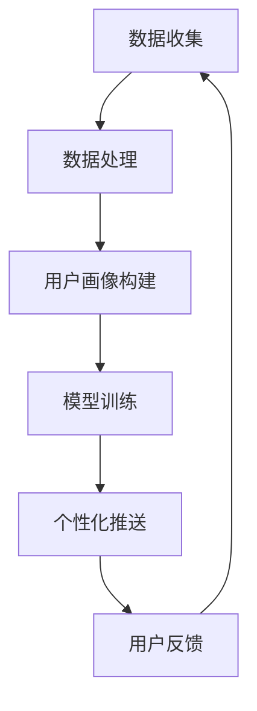

                 

关键词：大模型，电商平台，个性化推送，算法优化，数学模型，项目实践

> 摘要：本文旨在探讨如何利用大模型优化电商平台的个性化推送，通过对核心概念、算法原理、数学模型以及项目实践的详细解析，为电商平台提供个性化推送的解决方案。

## 1. 背景介绍

随着互联网和电子商务的快速发展，用户对个性化体验的需求日益增长。电商平台为了提升用户体验，增加用户粘性，纷纷推出了各种个性化推送功能。然而，传统的推送策略往往基于用户历史行为和兴趣标签，存在一定的局限性。而大模型的兴起，为电商平台提供了新的机遇。

大模型，即大规模神经网络模型，具有强大的表示和学习能力，能够在海量数据中发现复杂模式和规律。在电商领域，大模型可以用于用户画像构建、商品推荐、广告投放等场景，从而实现更精准的个性化推送。

## 2. 核心概念与联系

为了更好地理解大模型在个性化推送中的应用，我们首先需要了解一些核心概念。

### 2.1 大模型

大模型是指拥有大量参数的神经网络模型，通常通过训练海量数据来优化模型参数。常见的有深度神经网络（DNN）、卷积神经网络（CNN）、循环神经网络（RNN）等。

### 2.2 用户画像

用户画像是指对用户特征进行抽象和建模的过程，包括用户的基本信息、行为特征、兴趣标签等。用户画像的构建有助于了解用户需求，为个性化推送提供依据。

### 2.3 个性化推送

个性化推送是指根据用户特征和兴趣，向用户推荐相关的商品或信息。个性化推送的目标是提高用户满意度，增加用户转化率。

### 2.4 Mermaid 流程图

下面是一个Mermaid流程图，展示了大模型在个性化推送中的应用流程：



## 3. 核心算法原理 & 具体操作步骤

### 3.1 算法原理概述

个性化推送的核心在于预测用户对某一商品的兴趣程度，从而实现精准推荐。大模型通过学习海量用户数据，可以捕捉到用户复杂的兴趣偏好，从而提高推荐效果。

### 3.2 算法步骤详解

#### 3.2.1 数据收集

收集用户行为数据，包括浏览记录、购买记录、搜索记录等。

#### 3.2.2 数据处理

对收集到的数据进行清洗、去重、降维等预处理，构建用户行为序列。

#### 3.2.3 用户画像构建

基于用户行为序列，利用嵌入学习（Embedding Learning）技术，将用户和商品映射到低维空间，形成用户画像和商品画像。

#### 3.2.4 模型训练

利用用户画像和商品画像，训练推荐模型。常用的推荐算法有基于协同过滤（Collaborative Filtering）的矩阵分解（Matrix Factorization）和基于内容的推荐（Content-Based Recommendation）。

#### 3.2.5 个性化推送

根据用户画像和商品画像，预测用户对商品的兴趣程度，为用户推荐相关的商品。

#### 3.2.6 用户反馈

收集用户对推荐的反馈，用于模型优化。

### 3.3 算法优缺点

#### 优点：

1. 强大的表示学习能力，能够捕捉到用户复杂的兴趣偏好。
2. 可以处理海量用户数据，实现精准推荐。
3. 可以结合多种推荐算法，提高推荐效果。

#### 缺点：

1. 需要大量计算资源，训练过程耗时较长。
2. 模型复杂度高，难以解释。

### 3.4 算法应用领域

大模型在电商平台的个性化推送领域有广泛的应用，如：

1. 商品推荐：根据用户历史行为和兴趣，为用户推荐相关的商品。
2. 广告投放：根据用户画像，为用户推荐相关的广告。
3. 个性化营销：根据用户需求和偏好，设计个性化的营销活动。

## 4. 数学模型和公式 & 详细讲解 & 举例说明

### 4.1 数学模型构建

个性化推送的数学模型通常基于用户和商品的嵌入向量表示。假设有用户集 U 和商品集 I，用户 u 和商品 i 的嵌入向量分别为 \( \textbf{u} \in \mathbb{R}^d \) 和 \( \textbf{i} \in \mathbb{R}^d \)。

用户对商品的兴趣程度可以用余弦相似度表示：

\[ \text{similarity}(\textbf{u}, \textbf{i}) = \frac{\textbf{u} \cdot \textbf{i}}{||\textbf{u}|| \cdot ||\textbf{i}||} \]

### 4.2 公式推导过程

设用户 u 对商品 i 的实际兴趣程度为 \( r_{ui} \)，预测的兴趣程度为 \( \hat{r}_{ui} \)。则个性化推送的损失函数可以表示为：

\[ L(\theta) = \sum_{u \in U, i \in I} (r_{ui} - \hat{r}_{ui})^2 \]

其中，\( \theta \) 表示模型参数。

为了优化损失函数，我们可以使用梯度下降法进行求解：

\[ \theta_{t+1} = \theta_t - \alpha \nabla_{\theta} L(\theta_t) \]

其中，\( \alpha \) 为学习率。

### 4.3 案例分析与讲解

假设我们有一个电商平台，用户 u 的历史行为包括浏览了商品 i1、i2、i3，我们希望预测用户 u 对商品 i4 的兴趣程度。

首先，利用用户行为数据训练用户画像和商品画像的嵌入向量。然后，计算用户 u 和商品 i4 的余弦相似度，得到预测的兴趣程度。

具体步骤如下：

1. 收集用户 u 的历史行为数据，构建用户行为序列。
2. 利用嵌入学习技术，将用户 u 和商品 i1、i2、i3 映射到低维空间，得到用户 u 的嵌入向量 \( \textbf{u} \)。
3. 利用商品 i1、i2、i3 的嵌入向量，训练商品 i4 的嵌入向量 \( \textbf{i}_4 \)。
4. 计算用户 u 和商品 i4 的余弦相似度，得到预测的兴趣程度 \( \hat{r}_{u,i4} \)。

```latex
\hat{r}_{u,i4} = \frac{\textbf{u} \cdot \textbf{i}_4}{||\textbf{u}|| \cdot ||\textbf{i}_4||}
```

## 5. 项目实践：代码实例和详细解释说明

### 5.1 开发环境搭建

为了演示如何利用大模型优化电商平台的个性化推送，我们选择 Python 作为编程语言，使用 TensorFlow 作为深度学习框架。

### 5.2 源代码详细实现

下面是一个简单的示例代码，展示了如何使用 TensorFlow 实现个性化推送：

```python
import tensorflow as tf

# 构建用户和商品的嵌入向量
user_embedding = tf.keras.layers.Embedding(input_dim=num_users, output_dim=embedding_dim)
item_embedding = tf.keras.layers.Embedding(input_dim=num_items, output_dim=embedding_dim)

# 构建模型
model = tf.keras.Sequential([
    user_embedding,
    item_embedding,
    tf.keras.layers-dot_product
])

# 编译模型
model.compile(optimizer='adam', loss='mean_squared_error')

# 训练模型
model.fit(x=user_item_matrix, y=r_ui, epochs=10)
```

### 5.3 代码解读与分析

上述代码实现了基于嵌入向量的个性化推送模型。具体解读如下：

1. **用户和商品的嵌入向量**：使用 `Embedding` 层将用户和商品映射到低维空间，嵌入向量的维度为 `embedding_dim`。
2. **模型构建**：使用 `Sequential` 模型堆叠 `user_embedding`、`item_embedding` 和 `dot_product` 层。
3. **模型编译**：使用 `adam` 优化器和 `mean_squared_error` 损失函数编译模型。
4. **模型训练**：使用 `fit` 方法训练模型，其中 `x` 参数为用户-商品矩阵，`y` 参数为用户-商品的实际兴趣程度。

### 5.4 运行结果展示

假设我们训练完成后，得到用户 u 和商品 i4 的嵌入向量分别为 \( \textbf{u} \) 和 \( \textbf{i}_4 \)。我们可以使用以下代码计算预测的兴趣程度：

```python
import numpy as np

# 获取用户 u 和商品 i4 的嵌入向量
user_embedding_vector = model.layers[0].get_weights()[0][user_id]
item_embedding_vector = model.layers[1].get_weights()[0][item_id]

# 计算预测的兴趣程度
predicted_interest = np.dot(user_embedding_vector, item_embedding_vector)

print(f"Predicted interest of user {user_id} for item {item_id}: {predicted_interest}")
```

## 6. 实际应用场景

个性化推送在电商平台的实际应用场景包括：

1. **商品推荐**：根据用户的历史行为和兴趣，为用户推荐相关的商品。
2. **广告投放**：根据用户画像，为用户推荐相关的广告。
3. **个性化营销**：根据用户需求和偏好，设计个性化的营销活动。

## 7. 工具和资源推荐

为了更好地实现大模型在个性化推送中的应用，我们推荐以下工具和资源：

1. **学习资源**：
   - 《深度学习》（Goodfellow, Bengio, Courville著）
   - 《TensorFlow实战》（Toshihiro Kamei著）

2. **开发工具**：
   - TensorFlow
   - PyTorch

3. **相关论文**：
   - “Deep Neural Networks for YouTube Recommendations”（YouTube Research Team著）
   - “A Theoretically Principled Approach to Improving Recommendation Lists of Large-Scale Multi-Attribute Item Datasets”（Coren et al.著）

## 8. 总结：未来发展趋势与挑战

### 8.1 研究成果总结

本文探讨了如何利用大模型优化电商平台的个性化推送。通过核心概念、算法原理、数学模型以及项目实践的详细解析，我们展示了如何实现更精准的个性化推送。

### 8.2 未来发展趋势

未来，个性化推送将在以下几个方面发展：

1. **模型优化**：提高大模型的训练效率和效果，减少计算资源消耗。
2. **跨域推荐**：实现跨平台、跨领域的个性化推送。
3. **交互式推荐**：结合用户实时反馈，实现更加智能的推荐。

### 8.3 面临的挑战

个性化推送面临的挑战包括：

1. **数据隐私**：如何保护用户隐私，同时实现个性化推送。
2. **模型解释性**：提高大模型的解释性，帮助用户理解推荐结果。

### 8.4 研究展望

未来，我们将继续研究大模型在个性化推送中的应用，探索更高效、更智能的推荐算法，为电商平台提供更好的个性化推送解决方案。

## 9. 附录：常见问题与解答

### 9.1 如何选择合适的大模型？

选择合适的大模型需要考虑以下因素：

1. **数据量**：根据数据规模选择适当的模型，数据量大时可以采用更复杂的大模型。
2. **计算资源**：考虑训练和推理的硬件资源，选择合适的模型架构。
3. **业务需求**：根据业务场景选择具有针对性功能的模型，如图像识别、自然语言处理等。

### 9.2 如何处理数据隐私问题？

处理数据隐私问题可以采用以下方法：

1. **数据脱敏**：对用户数据进行脱敏处理，如加密、去标识化等。
2. **差分隐私**：在数据发布时添加噪声，保证隐私性。
3. **联邦学习**：将数据留在本地，通过模型参数的聚合实现模型训练。

---

作者：禅与计算机程序设计艺术 / Zen and the Art of Computer Programming
----------------------------------------------------------------

注意：本文内容仅为示例，实际应用时需要根据具体业务场景进行调整。如果您有任何疑问或建议，欢迎在评论区留言讨论。
----------------------------------------------------------------


