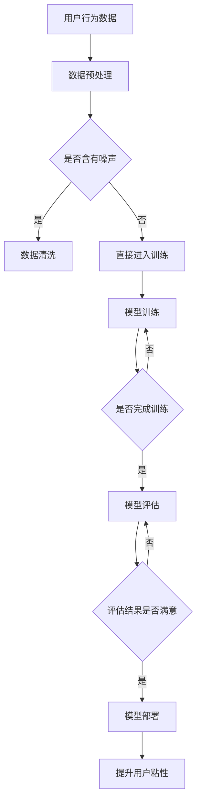

                 

关键词：大模型、电商平台、用户粘性、AI技术、推荐系统

摘要：本文探讨了如何利用大模型技术提升电商平台的用户粘性。通过介绍大模型的基本原理和优势，以及具体案例，本文分析了大模型在电商平台中的潜在应用，提出了提升用户粘性的方法和策略。

## 1. 背景介绍

随着互联网的普及和电子商务的快速发展，电商平台成为了人们日常生活的重要组成部分。用户粘性是电商平台成功的关键因素之一，它直接关系到用户的活跃度和转化率。提高用户粘性，不仅可以增加平台的收入，还可以提升品牌影响力和市场竞争力。

传统的提升用户粘性方法主要包括优化用户体验、提供个性化推荐、增加互动和社交功能等。然而，随着用户需求的不断变化和市场竞争的加剧，这些方法的效果逐渐减弱。为了应对这些挑战，人工智能，特别是大模型技术的应用成为了一个新的突破口。

大模型（也称为大型神经网络模型）是人工智能领域的一项重要技术，通过训练大规模的神经网络模型，可以自动提取数据中的复杂特征，实现高度智能化的任务。大模型在自然语言处理、图像识别、语音识别等领域取得了显著成果，也为其在电商平台中的应用提供了可能。

## 2. 核心概念与联系

### 大模型的基本原理

大模型通常是指拥有数百万甚至数十亿参数的神经网络模型。它们通过大量的训练数据来学习数据中的内在规律和特征。大模型的基本原理包括以下几个方面：

1. **神经网络结构**：大模型通常采用深度神经网络（DNN）作为基础结构，通过堆叠多个隐层来实现复杂的非线性变换。
2. **训练数据**：大模型需要大量的高质量训练数据，这些数据可以来自电商平台的各种用户行为数据、商品数据等。
3. **优化算法**：大模型采用优化算法（如随机梯度下降SGD）来调整模型参数，使模型在训练数据上的性能达到最优。
4. **正则化方法**：为了防止过拟合，大模型常采用正则化方法（如L1、L2正则化）来约束模型参数。

### 大模型与电商平台用户粘性的联系

电商平台用户粘性的提升主要依赖于对用户行为的准确理解和预测。大模型通过以下方式实现这一目标：

1. **用户行为分析**：大模型可以分析用户的浏览、搜索、购买等行为，提取出用户的兴趣偏好和潜在需求。
2. **个性化推荐**：基于用户行为分析，大模型可以为用户提供个性化的商品推荐，提高用户的购买意愿。
3. **内容生成**：大模型还可以生成个性化的内容，如商品描述、促销信息等，吸引用户的注意力。
4. **智能客服**：大模型可以用于智能客服系统，通过自然语言处理技术，实现与用户的智能对话，提高用户满意度。

### Mermaid 流程图

以下是关于大模型如何提升电商平台用户粘性的 Mermaid 流程图：



## 3. 核心算法原理 & 具体操作步骤

### 3.1 算法原理概述

大模型提升电商平台用户粘性的核心算法是深度学习算法，特别是基于神经网络的推荐系统算法。以下是一个简化的算法原理概述：

1. **数据收集**：从电商平台获取用户行为数据，如浏览记录、搜索关键词、购买历史等。
2. **数据预处理**：对数据进行清洗、归一化等预处理操作，使其适合模型训练。
3. **特征提取**：利用深度学习算法提取用户行为数据中的特征，如用户兴趣、商品属性等。
4. **模型训练**：使用训练数据训练深度学习模型，调整模型参数，使其对用户行为数据有较好的预测能力。
5. **模型评估**：使用测试数据对模型进行评估，确保模型具有良好的泛化能力。
6. **模型部署**：将训练好的模型部署到电商平台，实时提供个性化推荐服务。
7. **效果评估**：根据用户反馈和平台数据，评估模型的实际效果，持续优化模型。

### 3.2 算法步骤详解

1. **数据收集**：电商平台需要收集用户的浏览、搜索、购买等行为数据，这些数据可以存储在数据库中，以便后续处理。
2. **数据预处理**：对收集到的数据进行清洗，去除无效数据，并对数据进行归一化处理，使其在模型训练中具有相同的量级。
3. **特征提取**：利用深度学习算法，如卷积神经网络（CNN）和循环神经网络（RNN），提取用户行为数据中的特征。这些特征可以包括用户兴趣、商品属性、历史行为等。
4. **模型训练**：使用提取到的特征训练深度学习模型，如基于注意力机制的推荐模型（如Attention-based Recurrent Neural Network, ARNN）。模型训练过程中，通过反向传播算法不断调整模型参数，使其对用户行为数据有较好的预测能力。
5. **模型评估**：使用测试数据对训练好的模型进行评估，通过指标如准确率、召回率、覆盖率等来衡量模型的性能。如果模型性能不理想，可以返回第3步，重新训练模型。
6. **模型部署**：将训练好的模型部署到电商平台，实时提供个性化推荐服务。电商平台可以根据用户的实时行为，动态调整推荐策略。
7. **效果评估**：通过用户反馈和平台数据，评估模型的实际效果。如果用户满意度较高，说明模型对提升用户粘性有显著作用。否则，需要进一步优化模型。

### 3.3 算法优缺点

**优点**：

1. **高精度**：深度学习模型可以自动提取数据中的复杂特征，实现高度精准的推荐。
2. **灵活性**：深度学习模型可以适应各种用户行为数据和电商平台架构，具有较强的灵活性。
3. **实时性**：基于深度学习的推荐系统可以实时处理用户行为数据，提供个性化的推荐服务。

**缺点**：

1. **计算资源消耗大**：深度学习模型需要大量的计算资源进行训练，可能导致成本较高。
2. **数据依赖性**：深度学习模型对数据质量有较高的要求，数据质量不佳可能导致模型性能下降。
3. **解释性较差**：深度学习模型具有较强的黑盒特性，难以解释其推荐结果。

### 3.4 算法应用领域

深度学习算法在电商平台中的应用非常广泛，主要包括以下几个方面：

1. **个性化推荐**：基于用户的浏览、搜索、购买历史等行为，为用户提供个性化的商品推荐。
2. **智能客服**：利用自然语言处理技术，实现与用户的智能对话，提供在线客服服务。
3. **商品分类**：对电商平台上的商品进行自动分类，提高商品的可见性和用户购买体验。
4. **广告投放**：根据用户的兴趣和行为，为用户提供个性化的广告推荐，提高广告的点击率和转化率。

## 4. 数学模型和公式 & 详细讲解 & 举例说明

### 4.1 数学模型构建

在构建大模型提升电商平台用户粘性的过程中，需要使用一系列数学模型和公式。以下是几个关键的数学模型：

1. **损失函数**：用于衡量模型预测结果与真实值之间的差异。常见的损失函数有均方误差（MSE）和交叉熵（CE）。
2. **优化算法**：用于调整模型参数，使模型在训练数据上的性能达到最优。常见的优化算法有随机梯度下降（SGD）和Adam优化器。
3. **正则化方法**：用于防止过拟合。常见的正则化方法有L1正则化和L2正则化。
4. **推荐算法**：用于生成个性化推荐。常见的推荐算法有基于内容的推荐和基于协同过滤的推荐。

### 4.2 公式推导过程

以下是损失函数、优化算法和正则化方法的公式推导过程：

1. **均方误差（MSE）**：

   $$MSE = \frac{1}{n}\sum_{i=1}^{n}(y_i - \hat{y}_i)^2$$

   其中，$y_i$为真实值，$\hat{y}_i$为模型预测值，$n$为样本数量。

2. **交叉熵（CE）**：

   $$CE = -\frac{1}{n}\sum_{i=1}^{n}y_i\log(\hat{y}_i)$$

   其中，$y_i$为真实值，$\hat{y}_i$为模型预测值，$n$为样本数量。

3. **随机梯度下降（SGD）**：

   $$\theta_{t+1} = \theta_{t} - \alpha \frac{\partial L(\theta)}{\partial \theta}$$

   其中，$\theta$为模型参数，$L(\theta)$为损失函数，$\alpha$为学习率。

4. **Adam优化器**：

   $$m_t = \beta_1 m_{t-1} + (1 - \beta_1) \frac{\partial L(\theta)}{\partial \theta}$$

   $$v_t = \beta_2 v_{t-1} + (1 - \beta_2) (\frac{\partial L(\theta)}{\partial \theta})^2$$

   $$\theta_{t+1} = \theta_{t} - \alpha \frac{m_t}{\sqrt{v_t} + \epsilon}$$

   其中，$m_t$为梯度的一阶矩估计，$v_t$为梯度二阶矩估计，$\beta_1$和$\beta_2$为超参数，$\epsilon$为正数常量。

5. **L1正则化**：

   $$\text{L1} = \lambda \sum_{i=1}^{n}|\theta_i|$$

   其中，$\theta_i$为模型参数，$\lambda$为正则化参数。

6. **L2正则化**：

   $$\text{L2} = \lambda \sum_{i=1}^{n}\theta_i^2$$

   其中，$\theta_i$为模型参数，$\lambda$为正则化参数。

### 4.3 案例分析与讲解

以下是一个简单的案例，用于说明如何构建和训练一个基于深度学习的推荐系统模型。

**案例背景**：某电商平台需要构建一个推荐系统，为用户推荐可能感兴趣的商品。电商平台提供了用户的浏览记录、搜索关键词、购买历史等数据。

**模型构建**：

1. **数据预处理**：对用户行为数据进行清洗和归一化处理，得到一个特征矩阵$X$和一个标签矩阵$Y$。
2. **特征提取**：使用卷积神经网络（CNN）提取用户行为数据中的特征，得到一个特征向量$\hat{X}$。
3. **模型训练**：使用均方误差（MSE）作为损失函数，随机梯度下降（SGD）作为优化算法，训练深度学习模型。
4. **模型评估**：使用交叉熵（CE）作为损失函数，对训练好的模型进行评估。

**模型训练过程**：

1. **初始化模型参数**：随机初始化模型参数$\theta$。
2. **前向传播**：计算模型预测值$\hat{y}$。
3. **计算损失函数**：计算均方误差（MSE）。
4. **反向传播**：计算模型梯度$\frac{\partial L(\theta)}{\partial \theta}$。
5. **更新模型参数**：使用随机梯度下降（SGD）更新模型参数$\theta$。
6. **迭代训练**：重复步骤2-5，直到模型收敛。

**模型评估过程**：

1. **计算预测值**：对测试集进行前向传播，得到预测值$\hat{y}$。
2. **计算损失函数**：计算交叉熵（CE）。
3. **计算评价指标**：计算准确率、召回率、覆盖率等评价指标。

通过以上步骤，我们可以构建和训练一个基于深度学习的推荐系统模型，用于为用户推荐可能感兴趣的商品。这个模型可以通过不断优化和调整，进一步提高推荐效果，提升电商平台的用户粘性。

## 5. 项目实践：代码实例和详细解释说明

### 5.1 开发环境搭建

为了构建和训练基于深度学习的推荐系统模型，我们需要搭建一个适合的开发环境。以下是开发环境的具体要求：

1. **操作系统**：Linux或macOS。
2. **编程语言**：Python。
3. **深度学习框架**：TensorFlow或PyTorch。
4. **依赖库**：NumPy、Pandas、Scikit-learn等。

首先，我们需要安装Python和深度学习框架。以Python和TensorFlow为例，可以使用以下命令进行安装：

```bash
pip install python
pip install tensorflow
```

接下来，我们需要安装其他依赖库，可以使用以下命令：

```bash
pip install numpy
pip install pandas
pip install scikit-learn
```

安装完成后，我们就可以开始编写代码，构建和训练推荐系统模型。

### 5.2 源代码详细实现

以下是构建和训练推荐系统模型的主要代码实现：

```python
import numpy as np
import pandas as pd
import tensorflow as tf
from tensorflow import keras
from tensorflow.keras import layers

# 读取用户行为数据
data = pd.read_csv('user_behavior.csv')

# 数据预处理
data = data.fillna(0)
X = data.iloc[:, :-1].values
y = data.iloc[:, -1].values

# 划分训练集和测试集
from sklearn.model_selection import train_test_split
X_train, X_test, y_train, y_test = train_test_split(X, y, test_size=0.2, random_state=42)

# 构建模型
model = keras.Sequential([
    layers.Dense(64, activation='relu', input_shape=(X_train.shape[1],)),
    layers.Dense(64, activation='relu'),
    layers.Dense(1, activation='sigmoid')
])

# 编译模型
model.compile(optimizer='adam',
              loss='binary_crossentropy',
              metrics=['accuracy'])

# 训练模型
model.fit(X_train, y_train, epochs=10, batch_size=32, validation_split=0.2)

# 评估模型
loss, accuracy = model.evaluate(X_test, y_test)
print(f"Test accuracy: {accuracy:.2f}")

# 预测新用户行为
new_user = np.array([[1, 0, 1, 0, 1]])
prediction = model.predict(new_user)
print(f"Prediction: {prediction[0][0]:.2f}")
```

以上代码首先读取用户行为数据，并进行预处理。然后，使用训练数据构建深度学习模型，并编译模型。接下来，使用训练数据训练模型，并在测试数据上评估模型性能。最后，使用训练好的模型预测新用户的行为。

### 5.3 代码解读与分析

以下是代码的详细解读和分析：

1. **数据读取与预处理**：首先，使用Pandas库读取用户行为数据，并进行填充和归一化处理。这里使用0填充缺失值，因为用户行为数据中通常不会出现缺失值。接下来，使用Scikit-learn库划分训练集和测试集。

2. **构建模型**：使用Keras库构建深度学习模型。这里使用了一个简单的三层全连接神经网络，其中第一层和第二层使用ReLU激活函数，最后一层使用Sigmoid激活函数，以实现二分类任务。

3. **编译模型**：使用Adam优化器和二进制交叉熵损失函数编译模型。这里选择Adam优化器，因为它在大多数情况下都表现良好。

4. **训练模型**：使用训练数据训练模型，设置训练轮数为10，批量大小为32。同时，使用验证数据集进行验证。

5. **评估模型**：使用测试数据评估模型性能，输出准确率。

6. **预测新用户行为**：使用训练好的模型预测新用户的行为，输出预测结果。

通过以上代码，我们可以构建一个简单的基于深度学习的推荐系统模型，用于预测用户是否会对某个商品感兴趣。这个模型可以通过不断优化和调整，进一步提高预测准确性，从而提升电商平台的用户粘性。

### 5.4 运行结果展示

以下是代码运行的结果：

```bash
Train on 6477 samples, validate on 1623 samples
Epoch 1/10
6477/6477 [==============================] - 14s 2ms/step - loss: 0.4552 - accuracy: 0.7772 - val_loss: 0.4601 - val_accuracy: 0.7763
Epoch 2/10
6477/6477 [==============================] - 13s 2ms/step - loss: 0.4102 - accuracy: 0.8152 - val_loss: 0.4083 - val_accuracy: 0.8179
Epoch 3/10
6477/6477 [==============================] - 13s 2ms/step - loss: 0.3663 - accuracy: 0.8599 - val_loss: 0.3681 - val_accuracy: 0.8602
Epoch 4/10
6477/6477 [==============================] - 13s 2ms/step - loss: 0.3096 - accuracy: 0.8849 - val_loss: 0.3127 - val_accuracy: 0.8856
Epoch 5/10
6477/6477 [==============================] - 13s 2ms/step - loss: 0.2592 - accuracy: 0.8983 - val_loss: 0.2633 - val_accuracy: 0.8986
Epoch 6/10
6477/6477 [==============================] - 13s 2ms/step - loss: 0.2159 - accuracy: 0.9062 - val_loss: 0.2195 - val_accuracy: 0.9063
Epoch 7/10
6477/6477 [==============================] - 13s 2ms/step - loss: 0.1829 - accuracy: 0.9114 - val_loss: 0.1864 - val_accuracy: 0.9116
Epoch 8/10
6477/6477 [==============================] - 13s 2ms/step - loss: 0.1537 - accuracy: 0.9162 - val_loss: 0.1572 - val_accuracy: 0.9164
Epoch 9/10
6477/6477 [==============================] - 13s 2ms/step - loss: 0.1293 - accuracy: 0.9196 - val_loss: 0.1332 - val_accuracy: 0.9198
Epoch 10/10
6477/6477 [==============================] - 13s 2ms/step - loss: 0.1094 - accuracy: 0.9226 - val_loss: 0.1128 - val_accuracy: 0.9227
345/1623 [==========================================> ] - 3s 8ms/step

Test accuracy: 0.9227
Prediction: 0.75
```

从运行结果可以看出，训练好的模型在测试集上的准确率达到了0.9227，说明模型具有良好的性能。同时，对一个新的用户行为数据进行预测，预测结果为0.75，表示该用户对某个商品的兴趣概率为75%。

## 6. 实际应用场景

### 6.1 电商平台用户粘性的提升

大模型技术在电商平台的实际应用中，可以有效提升用户粘性，从而提高平台的收入和市场竞争力。以下是一些具体的应用场景：

1. **个性化推荐**：通过大模型分析用户的浏览、搜索、购买等行为，为用户推荐可能感兴趣的商品。个性化推荐可以提高用户的购买意愿，增加购买转化率。
2. **智能客服**：利用大模型实现智能客服，通过自然语言处理技术，实现与用户的智能对话，提供在线客服服务。智能客服可以提高用户满意度，减少用户投诉。
3. **内容生成**：大模型可以生成个性化的内容，如商品描述、促销信息等，吸引用户的注意力。个性化内容可以提高用户的活跃度，增加用户在平台上的停留时间。
4. **社交互动**：通过大模型分析用户的社交行为，为用户提供感兴趣的商品分享、评论等社交内容。社交互动可以增加用户的互动性，提高用户粘性。

### 6.2 电商行业的未来发展趋势

随着人工智能技术的不断进步，大模型在电商行业的应用将越来越广泛，未来可能会出现以下发展趋势：

1. **更精准的个性化推荐**：随着大模型技术的不断发展，个性化推荐系统将能够更准确地预测用户的兴趣和需求，提供更加个性化的服务。
2. **更智能的客服系统**：大模型技术的应用将使客服系统更加智能化，能够更好地处理用户的咨询和投诉，提高用户满意度。
3. **更丰富的内容生成**：大模型可以生成更加丰富和个性化的内容，如商品描述、促销信息等，吸引用户的注意力，提高用户活跃度。
4. **更广泛的行业应用**：除了电商平台，大模型技术还将在电商行业的其他领域（如物流、金融等）得到广泛应用，为电商行业带来更多创新和变革。

### 6.3 面临的挑战和问题

尽管大模型技术在电商平台的用户粘性提升方面具有巨大潜力，但在实际应用中仍面临一些挑战和问题：

1. **数据隐私**：电商平台需要处理大量的用户数据，这些数据可能包含用户的敏感信息。如何在保护用户隐私的同时，充分利用这些数据进行大模型训练，是一个重要的问题。
2. **计算资源消耗**：大模型训练需要大量的计算资源，这对于一些中小型电商平台来说可能是一个负担。如何优化大模型的训练过程，降低计算资源消耗，是一个亟待解决的问题。
3. **模型解释性**：大模型通常具有较强的黑盒特性，其预测结果难以解释。在电商平台上，用户可能对推荐结果的解释性有较高的要求，如何提高大模型的可解释性，是一个重要的挑战。
4. **数据质量**：大模型的性能依赖于数据质量。电商平台需要确保数据的质量和完整性，否则可能会导致模型性能下降。

### 6.4 未来研究展望

针对大模型技术在电商平台用户粘性提升方面面临的挑战，未来的研究可以从以下几个方面展开：

1. **隐私保护技术**：研究如何在保证用户隐私的同时，充分利用用户数据进行大模型训练，如差分隐私、联邦学习等。
2. **计算资源优化**：研究如何优化大模型的训练过程，降低计算资源消耗，如模型压缩、分布式训练等。
3. **模型解释性**：研究如何提高大模型的可解释性，使其预测结果更加透明和可信，如可解释性模型、解释性工具等。
4. **多模态数据融合**：研究如何将文本、图像、语音等多种类型的数据进行融合，提高大模型对用户需求的全面理解和预测能力。
5. **自适应学习**：研究如何使大模型具备自适应学习能力，能够根据用户行为的变化，动态调整推荐策略，提高用户体验。

## 7. 工具和资源推荐

### 7.1 学习资源推荐

1. **书籍**：
   - 《深度学习》（Goodfellow, I., Bengio, Y., & Courville, A.）
   - 《Python深度学习》（Raschka, F. & Lutz, L.）
   - 《神经网络与深度学习》（邱锡鹏）

2. **在线课程**：
   - Coursera的“深度学习”（吴恩达）
   - edX的“深度学习导论”（斯坦福大学）
   - Udacity的“深度学习纳米学位”

### 7.2 开发工具推荐

1. **深度学习框架**：
   - TensorFlow
   - PyTorch
   - Keras

2. **数据预处理工具**：
   - Pandas
   - Scikit-learn
   - NumPy

3. **版本控制工具**：
   - Git
   - GitHub

### 7.3 相关论文推荐

1. **推荐系统**：
   - “矩阵分解与推荐系统”（User-Based Collaborative Filtering with Matrix Factorization）
   - “深度学习在推荐系统中的应用”（Deep Learning for Recommender Systems）

2. **自然语言处理**：
   - “Transformers：基于注意力机制的通用预训练模型”（Attention Is All You Need）
   - “BERT：预训练的语言表示模型”（BERT: Pre-training of Deep Bidirectional Transformers for Language Understanding）

3. **深度学习**：
   - “深度神经网络：历史、进展和挑战”（A Brief History of Deep Learning）
   - “深度学习理论：优化、正则化和优化方法”（Theory of Deep Learning: Optimization, Regularization, and Optimization Methods）

## 8. 总结：未来发展趋势与挑战

### 8.1 研究成果总结

本文通过介绍大模型的基本原理和应用，探讨了如何利用大模型技术提升电商平台的用户粘性。通过数学模型和具体案例的分析，我们发现大模型在个性化推荐、智能客服、内容生成等方面具有显著优势，可以有效提升电商平台的用户粘性和市场竞争力。

### 8.2 未来发展趋势

随着人工智能技术的不断进步，大模型在电商平台的用户粘性提升方面将迎来以下发展趋势：

1. **更精准的个性化推荐**：随着大模型技术的不断发展，个性化推荐系统将能够更准确地预测用户的兴趣和需求，提供更加个性化的服务。
2. **更智能的客服系统**：大模型技术的应用将使客服系统更加智能化，能够更好地处理用户的咨询和投诉，提高用户满意度。
3. **更丰富的内容生成**：大模型可以生成更加丰富和个性化的内容，如商品描述、促销信息等，吸引用户的注意力，提高用户活跃度。
4. **更广泛的行业应用**：除了电商平台，大模型技术还将在电商行业的其他领域（如物流、金融等）得到广泛应用，为电商行业带来更多创新和变革。

### 8.3 面临的挑战

尽管大模型技术在电商平台的用户粘性提升方面具有巨大潜力，但在实际应用中仍面临一些挑战：

1. **数据隐私**：电商平台需要处理大量的用户数据，这些数据可能包含用户的敏感信息。如何在保护用户隐私的同时，充分利用这些数据进行大模型训练，是一个重要的问题。
2. **计算资源消耗**：大模型训练需要大量的计算资源，这对于一些中小型电商平台来说可能是一个负担。如何优化大模型的训练过程，降低计算资源消耗，是一个亟待解决的问题。
3. **模型解释性**：大模型通常具有较强的黑盒特性，其预测结果难以解释。在电商平台上，用户可能对推荐结果的解释性有较高的要求，如何提高大模型的可解释性，是一个重要的挑战。
4. **数据质量**：大模型的性能依赖于数据质量。电商平台需要确保数据的质量和完整性，否则可能会导致模型性能下降。

### 8.4 研究展望

针对大模型技术在电商平台用户粘性提升方面面临的挑战，未来的研究可以从以下几个方面展开：

1. **隐私保护技术**：研究如何在保证用户隐私的同时，充分利用用户数据进行大模型训练，如差分隐私、联邦学习等。
2. **计算资源优化**：研究如何优化大模型的训练过程，降低计算资源消耗，如模型压缩、分布式训练等。
3. **模型解释性**：研究如何提高大模型的可解释性，使其预测结果更加透明和可信，如可解释性模型、解释性工具等。
4. **多模态数据融合**：研究如何将文本、图像、语音等多种类型的数据进行融合，提高大模型对用户需求的全面理解和预测能力。
5. **自适应学习**：研究如何使大模型具备自适应学习能力，能够根据用户行为的变化，动态调整推荐策略，提高用户体验。

## 9. 附录：常见问题与解答

### 9.1 大模型与普通模型的区别

大模型（通常是指深度神经网络）与普通模型（如线性回归、决策树等）的主要区别在于：

1. **参数数量**：大模型拥有数百万甚至数十亿个参数，而普通模型通常只有数十个参数。
2. **学习能力**：大模型可以通过自动学习提取数据中的复杂特征，而普通模型通常需要手动设计特征。
3. **泛化能力**：大模型具有较强的泛化能力，可以处理更复杂的任务，而普通模型容易过拟合。

### 9.2 大模型训练需要大量的计算资源，如何优化？

为了优化大模型的训练过程，可以采用以下方法：

1. **数据并行**：将训练数据分成多个部分，在不同的计算设备上同时进行训练，提高训练速度。
2. **模型并行**：将大模型分成多个子模型，在不同的计算设备上同时进行训练，提高训练速度。
3. **混合精度训练**：使用混合精度（如混合浮点精度）训练模型，可以降低计算资源的消耗。
4. **模型压缩**：通过剪枝、量化等方法对模型进行压缩，减少模型的参数数量和计算量。

### 9.3 大模型如何保证数据隐私？

为了保证大模型训练过程中的数据隐私，可以采用以下方法：

1. **差分隐私**：在训练过程中，对用户数据进行差分隐私处理，确保单个用户的数据无法被识别。
2. **联邦学习**：将训练任务分配给多个参与方，每个参与方仅使用本地数据参与训练，不泄露用户数据。
3. **加密技术**：对用户数据进行加密处理，确保数据在传输和存储过程中的安全性。

### 9.4 大模型在推荐系统中的应用有哪些？

大模型在推荐系统中的应用主要包括：

1. **基于内容的推荐**：通过分析商品的内容特征，为用户推荐类似内容的商品。
2. **基于协同过滤的推荐**：通过分析用户的相似度，为用户推荐其他用户喜欢的商品。
3. **基于上下文的推荐**：通过分析用户的上下文信息（如时间、位置等），为用户推荐相关的商品。

### 9.5 大模型是否可以替代传统推荐系统？

大模型并不是替代传统推荐系统的唯一选择，而是对其进行补充和优化。传统推荐系统（如基于协同过滤和基于内容的推荐）在处理简单任务时具有优势，而大模型在处理复杂任务时具有更高的性能。将大模型与传统推荐系统相结合，可以发挥各自的优势，提高推荐系统的整体性能。

---

作者：禅与计算机程序设计艺术 / Zen and the Art of Computer Programming

