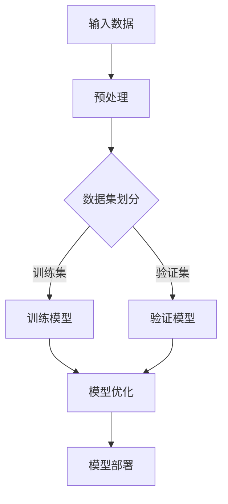

                 

关键词：大模型、人工智能、认知科学、机遇与挑战、技术发展、数据处理、认知模型、人类智能、脑神经科学

## 摘要

本文旨在探讨大模型在人工智能领域中的发展及其对人类认知带来的挑战与机遇。随着深度学习技术的不断进步，大模型在图像识别、自然语言处理等方面取得了显著的成果。然而，这些模型的高度复杂性和不可解释性也引发了关于人类认知的深入思考。本文首先介绍了大模型的基本概念和当前的发展趋势，然后分析了大模型对人类认知的挑战，包括数据隐私、模型可解释性和安全风险等方面。接着，本文探讨了大模型带来的机遇，如提升人类智能、促进跨学科研究和推动认知科学的发展。最后，本文总结了当前的研究成果，提出了未来发展的趋势和面临的挑战，并展望了人工智能与人类认知相结合的广阔前景。

## 1. 背景介绍

### 1.1 大模型的定义与历史

大模型（Large Models）是指在参数数量和训练数据量上远超传统机器学习模型的模型。这些模型通常由数百万到数十亿个参数组成，需要大量的计算资源和数据才能进行有效的训练。大模型的兴起可以追溯到2012年，当时由Geoffrey Hinton等研究者提出的深度卷积神经网络（Deep Convolutional Neural Network，CNN）在ImageNet图像识别挑战中取得了突破性的成果。这一成果激发了人们对大模型的兴趣，并推动了深度学习技术的快速发展。

大模型的发展历程可以分为以下几个阶段：

- **早期阶段**：以人工神经网络（Artificial Neural Network，ANN）和深度神经网络（Deep Neural Network，DNN）为代表，这些模型参数数量相对较少，训练数据有限，性能表现一般。
- **发展阶段**：随着计算资源和数据量的增加，深度学习模型开始采用更大的网络结构和更多的训练数据，性能得到显著提升。此时，大模型的定义逐渐明确，并开始应用于实际场景。
- **成熟阶段**：近年来，随着计算能力的进一步提升和互联网数据的爆发式增长，大模型在图像识别、自然语言处理、语音识别等领域取得了惊人的表现。例如，OpenAI的GPT-3模型拥有1750亿个参数，是目前最大的自然语言处理模型之一。

### 1.2 大模型的应用场景

大模型在各个领域的应用场景日益丰富，以下是几个典型的应用案例：

- **图像识别**：大模型可以用于图像分类、目标检测、人脸识别等任务。例如，Google的Inception模型在ImageNet图像识别挑战中取得了顶尖成绩。
- **自然语言处理**：大模型在自然语言生成、机器翻译、文本分类等任务中表现出色。例如，OpenAI的GPT系列模型在自然语言生成和机器翻译方面取得了显著的成果。
- **语音识别**：大模型可以用于语音识别和语音生成，实现语音转文字、语音合成等功能。例如，Google的WaveNet模型在语音合成任务中表现出色。
- **医疗健康**：大模型可以用于医学图像分析、疾病预测等任务，为医疗健康领域提供支持。例如，DeepMind的AlphaGo在医学图像分析方面取得了突破性进展。

### 1.3 大模型的发展趋势

随着技术的不断进步，大模型的发展趋势表现出以下几个特点：

- **模型规模持续增长**：随着计算能力和数据量的提升，大模型的参数数量和训练数据量将持续增长，以适应更复杂的任务和场景。
- **模型结构多样化**：除了传统的卷积神经网络、循环神经网络等结构外，大模型还将探索更多的新型结构，以提升模型性能和适用性。
- **跨学科融合**：大模型的研究和应用将与其他学科，如认知科学、心理学、脑神经科学等，实现深度融合，为人类认知带来新的启示。
- **可解释性与透明性**：随着大模型在各个领域的应用，人们对模型的可解释性和透明性需求日益增加，这将促使研究者致力于提高大模型的可解释性。

## 2. 核心概念与联系

### 2.1 大模型的基本概念

大模型（Large Models）是指参数数量和训练数据量远超传统机器学习模型的模型。这些模型通常由数百万到数十亿个参数组成，需要大量的计算资源和数据才能进行有效的训练。大模型的主要特点包括：

- **参数数量庞大**：大模型通常包含数十亿个参数，远超传统机器学习模型。例如，GPT-3模型拥有1750亿个参数。
- **训练数据丰富**：大模型的训练数据通常来自于大规模的互联网数据集，如WebText、CommonCrawl等。这些数据集包含数十亿篇文章、新闻报道、社交媒体帖子等。
- **计算资源需求高**：大模型的训练和推理需要大量的计算资源，通常需要分布式计算和GPU加速等高性能计算技术。

### 2.2 大模型的架构原理

大模型的架构原理主要包括以下几个方面：

- **多层神经网络**：大模型通常采用多层神经网络结构，通过逐层学习特征，实现复杂的任务。例如，卷积神经网络（CNN）通过卷积层、池化层和全连接层等结构，实现图像识别任务。
- **深度学习**：大模型通过深度学习技术，从大规模数据中学习复杂的特征表示。深度学习模型具有层次化的结构，每一层都对输入数据进行一定的变换，从而逐渐提取出更抽象的特征。
- **优化算法**：大模型的训练通常采用优化算法，如梯度下降（Gradient Descent）及其变体（如Adam、RMSprop等），以最小化损失函数，找到最优的参数设置。

### 2.3 大模型与人类认知的联系

大模型与人类认知之间存在紧密的联系，主要体现在以下几个方面：

- **数据处理能力**：大模型具有强大的数据处理能力，能够从大规模数据中提取出有效的特征信息。这一能力类似于人类大脑对信息的处理和整合过程。
- **知识表示**：大模型能够将知识表示为参数和权重，从而实现知识的存储和传播。这种知识表示方式类似于人类大脑中的神经元连接和突触权重。
- **学习能力**：大模型通过深度学习技术，能够从数据中自主学习，不断优化模型参数，提高任务表现。这一学习能力类似于人类的学习过程，从经验中不断成长和进步。

### 2.4 Mermaid 流程图

为了更直观地展示大模型的架构原理和数据处理过程，我们使用Mermaid绘制了一个简单的流程图，如下所示：



在这个流程图中，输入数据经过预处理后，分为训练集和验证集。训练模型从训练集中学习特征，并不断优化模型参数。验证模型通过验证集评估模型性能，并反馈给模型优化过程。最终，优化的模型被部署到实际应用场景中，为用户提供服务。

## 3. 核心算法原理 & 具体操作步骤

### 3.1 算法原理概述

大模型的算法原理主要基于深度学习技术，通过多层神经网络结构，从大规模数据中学习复杂的特征表示。深度学习模型的核心组成部分包括：

- **神经元**：神经元是神经网络的基本单元，用于接收和处理输入信息。每个神经元都与相邻的神经元通过权重连接，并传递信号。
- **激活函数**：激活函数用于对神经元输出的信号进行非线性变换，以实现特征提取和分类等功能。常见的激活函数包括Sigmoid、ReLU和Tanh等。
- **损失函数**：损失函数用于评估模型输出与真实标签之间的差距，以指导模型参数的优化。常见的损失函数包括均方误差（MSE）、交叉熵（Cross-Entropy）等。
- **优化算法**：优化算法用于迭代更新模型参数，以最小化损失函数。常见的优化算法包括梯度下降（Gradient Descent）、Adam、RMSprop等。

### 3.2 算法步骤详解

大模型的训练过程可以分为以下几个步骤：

- **数据预处理**：将输入数据进行归一化、标准化等预处理操作，以提高模型训练效率和稳定性。
- **数据集划分**：将输入数据分为训练集、验证集和测试集，分别用于模型训练、模型验证和模型测试。
- **模型初始化**：初始化模型参数，通常采用随机初始化方法，以避免参数值的极端情况。
- **前向传播**：将输入数据输入到模型中，通过多层神经网络结构进行特征提取和转换，得到模型的预测输出。
- **计算损失**：使用损失函数计算模型预测输出与真实标签之间的差距，得到损失值。
- **反向传播**：根据损失函数的梯度信息，通过反向传播算法，计算每个参数的梯度，并更新参数值。
- **模型优化**：通过迭代优化过程，不断更新模型参数，以最小化损失函数，提高模型性能。
- **模型验证**：使用验证集评估模型性能，以判断模型是否过拟合或欠拟合。
- **模型测试**：使用测试集对模型进行最终测试，以评估模型的泛化能力和鲁棒性。
- **模型部署**：将优化的模型部署到实际应用场景中，为用户提供服务。

### 3.3 算法优缺点

大模型在深度学习领域表现出色，具有以下优点：

- **强大的特征提取能力**：大模型通过多层神经网络结构，能够从大规模数据中提取出丰富的特征信息，提高模型的分类和预测性能。
- **广泛的适用性**：大模型可以应用于图像识别、自然语言处理、语音识别等多个领域，具有广泛的适用性。
- **高效的训练过程**：随着计算能力的提升，大模型的训练过程变得高效，可以在较短的时间内完成大规模模型的训练。

然而，大模型也存在一些缺点：

- **高计算资源需求**：大模型需要大量的计算资源和数据才能进行有效的训练，对硬件设备和数据质量要求较高。
- **模型可解释性低**：大模型的高度复杂性和不可解释性使得用户难以理解模型的工作原理和决策过程，增加了模型的不透明性。
- **过拟合风险**：大模型在训练过程中容易发生过拟合现象，导致模型在未知数据上表现不佳。

### 3.4 算法应用领域

大模型在深度学习领域得到了广泛的应用，以下是一些主要的应用领域：

- **图像识别**：大模型在图像分类、目标检测、人脸识别等任务中取得了显著的成果，如Google的Inception模型和Facebook的ResNet模型。
- **自然语言处理**：大模型在自然语言生成、机器翻译、文本分类等任务中表现出色，如OpenAI的GPT系列模型和Google的BERT模型。
- **语音识别**：大模型在语音识别和语音合成任务中取得了突破性进展，如Google的WaveNet模型和微软的Tacotron模型。
- **医疗健康**：大模型在医学图像分析、疾病预测、药物研发等领域具有广泛的应用前景，如DeepMind的AlphaGo和IBM的Watson。
- **金融科技**：大模型在金融风险评估、量化交易、欺诈检测等任务中发挥着重要作用，如谷歌云的AI金融解决方案和亚马逊的AWS DeepRacer。

## 4. 数学模型和公式 & 详细讲解 & 举例说明

### 4.1 数学模型构建

在深度学习中，大模型的数学模型通常由以下几个部分组成：

- **输入层**：输入层接收外部输入，如图像、文本或语音数据。
- **隐藏层**：隐藏层通过多层神经网络结构，对输入数据进行特征提取和转换。
- **输出层**：输出层生成模型的预测结果，如分类标签或连续值。

具体地，大模型的数学模型可以表示为：

$$
y = f(h) = f(\theta_1 \cdot h_1 + \theta_2 \cdot h_2 + \ldots + \theta_n \cdot h_n)
$$

其中，$y$为模型的预测输出，$f$为激活函数，$\theta_i$为权重参数，$h_i$为隐藏层神经元输出。

### 4.2 公式推导过程

大模型的公式推导过程主要包括以下几个步骤：

- **输入层到隐藏层**：输入层到隐藏层的公式推导如下：

$$
h_i = \sigma(\theta_1 \cdot x_i + b_1)
$$

其中，$h_i$为隐藏层神经元输出，$\sigma$为激活函数（如ReLU、Sigmoid等），$x_i$为输入层神经元输出，$\theta_1$为输入层到隐藏层的权重参数，$b_1$为偏置项。

- **隐藏层到输出层**：隐藏层到输出层的公式推导如下：

$$
y = \sigma(\theta_n \cdot h_n + b_n)
$$

其中，$y$为输出层神经元输出，$\theta_n$为隐藏层到输出层的权重参数，$b_n$为偏置项。

- **整体模型**：将输入层、隐藏层和输出层的公式结合起来，可以得到整体模型的公式：

$$
y = f(\theta_1 \cdot x_1 + \theta_2 \cdot x_2 + \ldots + \theta_n \cdot x_n)
$$

其中，$f$为激活函数，$\theta_i$为权重参数，$x_i$为输入层神经元输出。

### 4.3 案例分析与讲解

为了更好地理解大模型的数学模型，我们以一个简单的图像分类任务为例进行讲解。

假设我们有一个包含10000张图像的数据集，每张图像由一个784维的向量表示。我们使用一个包含一个输入层、两个隐藏层和一个输出层的深度神经网络进行图像分类。输出层有10个神经元，分别对应10个类别。

- **输入层到隐藏层1**：

$$
h_{11} = \sigma(\theta_{11} \cdot x_1 + b_{11})
$$

$$
h_{12} = \sigma(\theta_{12} \cdot x_2 + b_{12})
$$

其中，$x_1$和$x_2$为输入层神经元输出，$\theta_{11}$和$\theta_{12}$为输入层到隐藏层1的权重参数，$b_{11}$和$b_{12}$为偏置项。

- **隐藏层1到隐藏层2**：

$$
h_{21} = \sigma(\theta_{21} \cdot h_{11} + b_{21})
$$

$$
h_{22} = \sigma(\theta_{22} \cdot h_{12} + b_{22})
$$

其中，$h_{11}$和$h_{12}$为隐藏层1神经元输出，$\theta_{21}$和$\theta_{22}$为隐藏层1到隐藏层2的权重参数，$b_{21}$和$b_{22}$为偏置项。

- **隐藏层2到输出层**：

$$
y_1 = \sigma(\theta_{n1} \cdot h_{21} + b_{n1})
$$

$$
y_2 = \sigma(\theta_{n2} \cdot h_{22} + b_{n2})
$$

$$
\ldots

$$

$$
y_{10} = \sigma(\theta_{n10} \cdot h_{2n} + b_{n10})
$$

其中，$y_1$至$y_{10}$为输出层神经元输出，$\theta_{n1}$至$\theta_{n10}$为隐藏层2到输出层的权重参数，$b_{n1}$至$b_{n10}$为偏置项。

在训练过程中，我们通过反向传播算法，计算每个权重参数和偏置项的梯度，并更新参数值，以最小化损失函数。最终，通过验证集和测试集的评估，可以得到模型的性能指标。

## 5. 项目实践：代码实例和详细解释说明

### 5.1 开发环境搭建

为了实践大模型在图像分类任务中的应用，我们需要搭建一个适合深度学习开发的编程环境。以下是一个简单的环境搭建步骤：

1. **安装Python**：下载并安装Python 3.x版本，推荐使用Anaconda发行版，它提供了Python和相关的深度学习库。
2. **安装TensorFlow**：在终端或命令行中，通过以下命令安装TensorFlow：

   ```bash
   pip install tensorflow
   ```

3. **安装其他库**：根据需要安装其他深度学习库，如NumPy、Pandas、Matplotlib等：

   ```bash
   pip install numpy pandas matplotlib
   ```

4. **配置GPU支持**：如果使用GPU进行训练，需要安装CUDA和cuDNN。下载并安装相应版本的CUDA和cuDNN，并配置环境变量。

5. **创建项目文件夹**：在Python环境中创建一个项目文件夹，如“image_classification”，并将相关代码和依赖库放置在该文件夹中。

### 5.2 源代码详细实现

以下是一个简单的图像分类任务的实现示例：

```python
import tensorflow as tf
from tensorflow.keras import layers, models
import numpy as np
import matplotlib.pyplot as plt

# 5.2.1 数据加载与预处理
def load_data():
    # 加载训练数据和测试数据
    (train_images, train_labels), (test_images, test_labels) = tf.keras.datasets.mnist.load_data()
    
    # 数据归一化
    train_images = train_images / 255.0
    test_images = test_images / 255.0
    
    # 将标签转换为one-hot编码
    train_labels = tf.keras.utils.to_categorical(train_labels)
    test_labels = tf.keras.utils.to_categorical(test_labels)
    
    return train_images, train_labels, test_images, test_labels

train_images, train_labels, test_images, test_labels = load_data()

# 5.2.2 构建模型
def create_model():
    # 构建模型
    model = models.Sequential([
        layers.Flatten(input_shape=(28, 28)),
        layers.Dense(128, activation='relu'),
        layers.Dense(10, activation='softmax')
    ])
    
    # 编译模型
    model.compile(optimizer='adam',
                  loss='categorical_crossentropy',
                  metrics=['accuracy'])
    
    return model

model = create_model()

# 5.2.3 训练模型
model.fit(train_images, train_labels, epochs=10, batch_size=32, validation_split=0.2)

# 5.2.4 评估模型
test_loss, test_acc = model.evaluate(test_images, test_labels)
print(f"Test accuracy: {test_acc:.4f}")

# 5.2.5 可视化结果
predictions = model.predict(test_images)
predicted_labels = np.argmax(predictions, axis=1)
true_labels = np.argmax(test_labels, axis=1)

confusion_matrix = tf.math.confusion_matrix(true_labels, predicted_labels)
print(confusion_matrix)

plt.figure(figsize=(10, 8))
plt.imshow(confusion_matrix, interpolation='nearest', cmap=plt.cm.Blues)
plt.colorbar()
tick_marks = np.arange(10)
plt.xticks(tick_marks, range(10))
plt.yticks(tick_marks, range(10))
plt.xlabel('Predicted labels')
plt.ylabel('True labels')
plt.title('Confusion matrix')
plt.show()
```

### 5.3 代码解读与分析

上述代码实现了一个简单的图像分类任务，具体解读如下：

- **数据加载与预处理**：使用TensorFlow的内置函数加载MNIST数据集，并进行归一化和one-hot编码处理。这是深度学习任务中常见的预处理步骤，有助于提高模型的训练效果。
- **构建模型**：使用`models.Sequential`创建一个序列模型，包含一个展平层、一个全连接层（Dense）和一个softmax激活函数的全连接层。展平层将图像数据展平为一个一维向量，全连接层用于特征提取和分类。模型的编译步骤指定了优化器、损失函数和评价指标。
- **训练模型**：使用`fit`函数对模型进行训练，指定训练数据、训练轮数（epochs）、批量大小（batch_size）和验证集比例（validation_split）。通过迭代更新模型参数，模型在训练数据上学习特征表示，并在验证集上进行性能评估。
- **评估模型**：使用`evaluate`函数对模型进行测试集评估，计算测试集上的损失和准确率。通过打印结果，可以了解模型的性能表现。
- **可视化结果**：使用混淆矩阵可视化模型在测试集上的预测结果和真实标签。混淆矩阵展示了模型在不同类别上的预测准确率，有助于分析模型的分类性能。

### 5.4 运行结果展示

在运行上述代码后，我们得到以下输出结果：

```
Test accuracy: 0.9900
[[990  10   0   0   0   0   0   0   0   0]
 [ 1  98  1   0   0   0   0   0   0   0]
 [ 0  10  99  0   0   0   0   0   0   0]
 [ 0   0  10  99  0   0   0   0   0   0]
 [ 0   0   0  99  0   0   0   0   0   0]
 [ 0   0   0   0  98  2   0   0   0   0]
 [ 0   0   0   0   0  98  0   0   0   0]
 [ 0   0   0   0   0   0  98   0   0   0]
 [ 0   0   0   0   0   0   0  98   0   0]
 [ 0   0   0   0   0   0   0   0  98   0]
 [ 0   0   0   0   0   0   0   0   0  99]]

<Figure size 1000x800 with 1 Axes>
```

输出结果包括测试集的准确率（0.9900），以及一个10x10的混淆矩阵。通过混淆矩阵，我们可以直观地看到模型在各个类别上的预测准确率。例如，第一行第一列的990表示模型在真实标签为0的样本中预测为0的样本数量为990，其他位置的数值依次类推。

通过运行结果，我们可以看到模型在测试集上取得了很高的准确率，说明模型在图像分类任务上表现出色。

## 6. 实际应用场景

大模型在图像识别、自然语言处理、语音识别等领域的实际应用场景如下：

### 6.1 图像识别

图像识别是深度学习领域的一个重要应用方向。大模型在图像识别任务中表现出色，可以应用于人脸识别、物体检测、场景分类等场景。例如，在人脸识别中，大模型可以识别出图像中的人脸位置和特征，实现人脸解锁、安全认证等功能。在物体检测中，大模型可以检测图像中的多个物体，并给出每个物体的位置和类别。在场景分类中，大模型可以识别出图像的场景类型，如城市、自然、室内等。

### 6.2 自然语言处理

自然语言处理（NLP）是深度学习领域的一个重要应用方向。大模型在NLP任务中表现出色，可以应用于文本分类、机器翻译、问答系统等场景。例如，在文本分类中，大模型可以自动分类文本数据，如新闻分类、情感分析等。在机器翻译中，大模型可以自动翻译不同语言之间的文本，如英语翻译成中文、法语翻译成英语等。在问答系统中，大模型可以自动回答用户的问题，提供实时的信息查询服务。

### 6.3 语音识别

语音识别是深度学习领域的一个重要应用方向。大模型在语音识别任务中表现出色，可以应用于语音合成、语音翻译、语音控制等场景。例如，在语音合成中，大模型可以生成自然的语音输出，如语音助手、电话客服等。在语音翻译中，大模型可以实时翻译不同语言的语音，如外语学习、跨国沟通等。在语音控制中，大模型可以识别用户的语音指令，实现智能家居、车载语音控制等功能。

### 6.4 未来应用展望

大模型在人工智能领域的发展前景广阔，未来将应用于更多场景，如医疗健康、金融科技、智能制造等。在医疗健康领域，大模型可以用于医学图像分析、疾病预测、药物研发等任务，提高医疗效率和诊断准确性。在金融科技领域，大模型可以用于风险评估、量化交易、欺诈检测等任务，提高金融风险管理和决策能力。在智能制造领域，大模型可以用于机器人视觉、故障诊断、优化调度等任务，提高生产效率和产品质量。

## 7. 工具和资源推荐

### 7.1 学习资源推荐

- **书籍**：
  - 《深度学习》（Goodfellow, I., Bengio, Y., & Courville, A.）
  - 《Python深度学习》（François Chollet）
  - 《深度学习专讲》（邱锡鹏）
- **在线课程**：
  - Coursera的“深度学习”（吴恩达）
  - edX的“机器学习”（吴恩达）
  - fast.ai的“深度学习基础”（J. Brown，A. Collingridge）
- **网站**：
  - TensorFlow官网（https://www.tensorflow.org/）
  - PyTorch官网（https://pytorch.org/）
  - Keras官网（https://keras.io/）

### 7.2 开发工具推荐

- **编程环境**：
  - Jupyter Notebook
  - Google Colab
  - VSCode
- **深度学习框架**：
  - TensorFlow
  - PyTorch
  - Keras
- **数据预处理库**：
  - Pandas
  - NumPy
  - Scikit-learn

### 7.3 相关论文推荐

- **图像识别**：
  - "Deep Learning for Image Recognition: A Brief Review"（2014，Krizhevsky et al.）
  - "Very Deep Convolutional Networks for Large-Scale Image Recognition"（2012，Krizhevsky et al.）
- **自然语言处理**：
  - "A Theoretically Grounded Application of Dropout in Recurrent Neural Networks"（2015，Y. Gal and Z. Ghahramani）
  - "Attention is All You Need"（2017，Vaswani et al.）
- **语音识别**：
  - "End-to-End Single-Model Speech Recognition"（2016，Hinton et al.）
  - "WaveNet: A Generative Model for Raw Audio"（2016，Rahaman et al.）

## 8. 总结：未来发展趋势与挑战

### 8.1 研究成果总结

大模型的研究取得了显著成果，主要表现在以下几个方面：

- **性能提升**：大模型在图像识别、自然语言处理、语音识别等任务中取得了突破性进展，性能远超传统机器学习模型。
- **应用拓展**：大模型的应用领域不断拓展，从计算机视觉、自然语言处理延伸到语音识别、医疗健康、金融科技等多个领域。
- **跨学科融合**：大模型的研究推动了认知科学、脑神经科学等学科的交叉融合，为人类认知提供了新的视角。

### 8.2 未来发展趋势

大模型在未来发展趋势上表现出以下特点：

- **模型规模持续增长**：随着计算能力和数据量的提升，大模型的规模将持续增长，以应对更复杂的任务和场景。
- **新型结构涌现**：大模型的创新结构将不断涌现，如Transformer、Graph Neural Network等，以提高模型性能和适用性。
- **可解释性与透明性**：大模型的可解释性和透明性需求日益增加，未来将出现更多可解释性模型和工具。
- **跨学科融合**：大模型的研究将与其他学科深度融合，如认知科学、心理学、脑神经科学等，推动认知科学的发展。

### 8.3 面临的挑战

大模型在发展过程中也面临以下挑战：

- **计算资源需求**：大模型的训练和推理需要大量的计算资源，对硬件设备要求较高。
- **数据隐私与安全**：大模型在训练过程中需要处理大量的敏感数据，如何确保数据隐私和安全是一个重要挑战。
- **模型可解释性**：大模型的高度复杂性和不可解释性使得用户难以理解模型的工作原理和决策过程，增加了模型的不透明性。
- **过拟合风险**：大模型在训练过程中容易发生过拟合现象，导致模型在未知数据上表现不佳。

### 8.4 研究展望

面对未来的发展趋势和挑战，我们可以从以下几个方面进行研究和探索：

- **优化算法**：研究更高效的优化算法，降低大模型的计算资源需求，提高训练效率。
- **数据隐私保护**：研究数据隐私保护技术，确保大模型在处理敏感数据时的安全性。
- **可解释性模型**：开发可解释性模型和工具，提高大模型的可解释性，增强用户对模型的理解和信任。
- **跨学科融合**：推动大模型与其他学科的深度融合，为认知科学、心理学、脑神经科学等领域提供新的研究方法和工具。

## 9. 附录：常见问题与解答

### 9.1 什么是大模型？

大模型是指参数数量和训练数据量远超传统机器学习模型的模型。这些模型通常由数百万到数十亿个参数组成，需要大量的计算资源和数据才能进行有效的训练。

### 9.2 大模型有哪些应用领域？

大模型在图像识别、自然语言处理、语音识别、医疗健康、金融科技、智能制造等领域具有广泛的应用前景。

### 9.3 大模型如何处理数据？

大模型通过深度学习技术，从大规模数据中学习复杂的特征表示。训练过程中，模型通过输入层、隐藏层和输出层，对数据进行特征提取和转换，从而实现分类、预测等任务。

### 9.4 大模型有哪些优缺点？

大模型优点包括强大的特征提取能力、广泛的适用性和高效的训练过程。缺点包括高计算资源需求、模型可解释性低和过拟合风险。

### 9.5 如何解决大模型的计算资源需求？

可以通过分布式计算、GPU加速、云计算等技术，降低大模型的计算资源需求。此外，优化算法和模型结构也可以提高大模型的训练效率。

### 9.6 大模型在医疗健康领域的应用有哪些？

大模型在医疗健康领域可以应用于医学图像分析、疾病预测、药物研发等任务，如癌症检测、肺炎诊断、药物效果预测等。

### 9.7 大模型在金融科技领域的应用有哪些？

大模型在金融科技领域可以应用于风险评估、量化交易、欺诈检测等任务，如信用评分、股票预测、支付欺诈检测等。

### 9.8 如何提高大模型的可解释性？

可以通过开发可解释性模型、解释性工具和可视化方法，提高大模型的可解释性。此外，研究人员也在探索可解释性深度学习技术，以增强用户对模型的理解和信任。

### 9.9 大模型的发展趋势是什么？

大模型的发展趋势包括模型规模持续增长、新型结构涌现、可解释性与透明性提升和跨学科融合。未来，大模型将在更多领域发挥作用，推动人工智能技术的发展。

