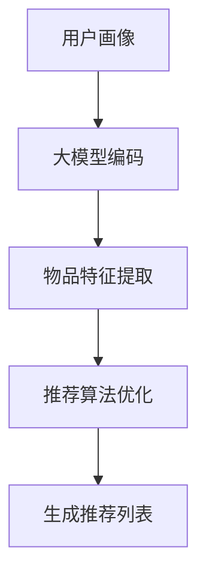

                 

关键词：大模型，推荐系统，实时个性化，算法提升，数学模型，应用实践

摘要：随着互联网的迅速发展和大数据技术的普及，推荐系统已经成为现代信息检索和内容分发的重要工具。然而，传统推荐系统在处理海量用户数据和实时个性化需求方面存在诸多局限性。本文将探讨大模型在推荐系统中的应用，通过对大模型核心概念、算法原理、数学模型以及项目实践的深入分析，阐述大模型如何提升推荐系统的实时个性化能力。

## 1. 背景介绍

推荐系统（Recommender System）是一种信息过滤技术，旨在根据用户的历史行为和偏好，为用户提供个性化的信息推荐。从最早的协同过滤（Collaborative Filtering）到基于内容的推荐（Content-Based Filtering），再到深度学习（Deep Learning）的引入，推荐系统的发展经历了多个阶段。

然而，传统推荐系统在应对如下挑战时仍然存在不足：

- **数据稀疏问题**：用户与物品之间的交互数据往往稀疏，难以捕捉用户的真实偏好。
- **实时性不足**：传统推荐算法计算复杂度较高，难以满足实时推荐的需求。
- **冷启动问题**：新用户或新物品缺乏历史数据，难以进行有效推荐。

为了解决上述问题，近年来大模型（如生成对抗网络（GAN）、变分自编码器（VAE）等）逐渐在推荐系统中得到应用。大模型通过引入深度学习技术，可以在大规模数据集上进行训练，从而提高推荐系统的性能和实时性。

## 2. 核心概念与联系

### 2.1. 大模型

大模型通常是指具有大量参数的深度学习模型。这些模型可以通过学习海量数据来捕捉复杂的模式和关系，从而提高推荐的准确性。例如，生成对抗网络（GAN）通过生成器和判别器的对抗训练，可以生成高质量的推荐列表；变分自编码器（VAE）则通过编码和解码器，将用户和物品的偏好表示为潜在变量，从而实现个性化推荐。

### 2.2. 推荐系统架构

推荐系统的架构可以分为三个主要部分：用户画像、物品特征和推荐算法。用户画像记录用户的历史行为、偏好和兴趣；物品特征描述物品的属性和标签；推荐算法则根据用户画像和物品特征，生成个性化的推荐列表。

大模型可以与推荐系统中的用户画像和物品特征进行融合，从而提升推荐系统的实时个性化能力。具体来说，可以通过以下方式进行：

- **用户画像生成**：使用大模型对用户历史行为数据进行编码，生成用户画像。
- **物品特征提取**：使用大模型对物品特征进行自动提取，从而减少人工标注的工作量。
- **推荐算法优化**：利用大模型进行推荐算法的优化，提高推荐的准确性和实时性。

### 2.3. Mermaid 流程图

以下是一个简单的 Mermaid 流程图，展示了大模型在推荐系统中的集成过程：



## 3. 核心算法原理 & 具体操作步骤

### 3.1. 算法原理概述

大模型在推荐系统中的应用主要基于以下几个原理：

- **数据驱动**：大模型通过学习海量数据，可以捕捉到用户和物品之间的复杂关系。
- **端到端学习**：大模型可以将用户画像、物品特征和推荐算法整合为一个端到端的模型，从而提高系统的整体性能。
- **自适应调整**：大模型可以根据实时用户行为数据，动态调整推荐策略，实现实时个性化推荐。

### 3.2. 算法步骤详解

以下是使用大模型进行实时个性化推荐的具体步骤：

1. **数据收集与预处理**：收集用户的历史行为数据和物品特征数据，并进行预处理，如去噪、归一化等。
2. **用户画像生成**：使用大模型（如 GAN 或 VAE）对用户历史行为数据进行编码，生成用户画像。
3. **物品特征提取**：使用大模型对物品特征进行自动提取，生成物品特征向量。
4. **推荐算法优化**：将用户画像和物品特征输入到推荐算法中，通过端到端学习，优化推荐算法。
5. **生成推荐列表**：根据优化后的推荐算法，为用户生成个性化的推荐列表。
6. **实时更新**：根据用户的实时行为数据，动态调整用户画像和推荐算法，实现实时个性化推荐。

### 3.3. 算法优缺点

**优点**：

- **高效性**：大模型可以通过端到端学习，提高推荐算法的计算效率。
- **准确性**：大模型可以捕捉到用户和物品之间的复杂关系，提高推荐准确性。
- **实时性**：大模型可以根据实时用户行为数据，实现实时个性化推荐。

**缺点**：

- **计算资源需求高**：大模型需要大量计算资源和存储空间，对硬件要求较高。
- **模型解释性差**：深度学习模型通常缺乏解释性，难以理解推荐结果的生成过程。

### 3.4. 算法应用领域

大模型在推荐系统中的应用已逐渐拓展到多个领域：

- **电子商务**：根据用户的历史购买行为和浏览记录，推荐个性化的商品。
- **社交媒体**：根据用户的行为和兴趣，推荐感兴趣的内容和好友。
- **在线教育**：根据学生的学习情况和知识点掌握情况，推荐个性化的学习资源。
- **音乐和视频平台**：根据用户的播放历史和偏好，推荐个性化的音乐和视频。

## 4. 数学模型和公式 & 详细讲解 & 举例说明

### 4.1. 数学模型构建

大模型在推荐系统中的应用通常涉及以下数学模型：

- **用户画像模型**：用户画像通常表示为用户行为序列的概率分布。
  $$ P(\text{user behavior} | \text{user profile}) $$
- **物品特征模型**：物品特征通常表示为物品属性的编码。
  $$ P(\text{item feature} | \text{item profile}) $$
- **推荐模型**：推荐模型通常是一个概率模型，用于预测用户对物品的偏好。
  $$ P(\text{user preference} | \text{user profile}, \text{item feature}) $$

### 4.2. 公式推导过程

假设用户的行为数据集为 $D_u$，物品的特征数据集为 $D_i$。我们可以使用最大似然估计（Maximum Likelihood Estimation，MLE）来推导用户画像模型和物品特征模型的参数：

- **用户画像模型**：
  $$ \log P(\text{user behavior} | \text{user profile}) = \sum_{d \in D_u} \log P(d | \text{user profile}) $$
  通过梯度下降法，对上述公式进行优化，得到用户画像模型的参数。

- **物品特征模型**：
  $$ \log P(\text{item feature} | \text{item profile}) = \sum_{i \in D_i} \log P(i | \text{item profile}) $$
  同样，通过梯度下降法，对上述公式进行优化，得到物品特征模型的参数。

### 4.3. 案例分析与讲解

假设有一个电子商务平台，用户的行为数据包括浏览记录、购买记录和评价记录。以下是一个简化的案例：

- **用户画像模型**：
  $$ P(\text{user behavior} | \text{user profile}) = P(\text{browse record} | \text{user profile}) P(\text{purchase record} | \text{user profile}) P(\text{review record} | \text{user profile}) $$
  我们可以分别对浏览记录、购买记录和评价记录进行编码，生成用户画像。

- **物品特征模型**：
  $$ P(\text{item feature} | \text{item profile}) = P(\text{price} | \text{item profile}) P(\text{category} | \text{item profile}) P(\text{rating} | \text{item profile}) $$
  同样，我们可以对物品的价格、类别和评分进行编码，生成物品特征向量。

- **推荐模型**：
  $$ P(\text{user preference} | \text{user profile}, \text{item feature}) = P(\text{purchase} | \text{user profile}, \text{item feature}) $$
  我们可以通过训练数据集，使用最大似然估计，优化推荐模型的参数。

在实际应用中，我们可以通过不断调整用户画像模型、物品特征模型和推荐模型的参数，提高推荐系统的性能和实时性。

## 5. 项目实践：代码实例和详细解释说明

### 5.1. 开发环境搭建

在本项目中，我们使用 Python 作为主要编程语言，结合 TensorFlow 和 Keras 库进行深度学习模型的构建和训练。以下是开发环境的搭建步骤：

1. 安装 Python 3.7 或更高版本。
2. 安装 TensorFlow：使用以下命令进行安装：
   ```bash
   pip install tensorflow
   ```
3. 安装 Keras：使用以下命令进行安装：
   ```bash
   pip install keras
   ```

### 5.2. 源代码详细实现

以下是一个简化的用户画像生成和推荐系统的代码实例：

```python
import numpy as np
import tensorflow as tf
from tensorflow.keras.layers import Input, Dense, LSTM
from tensorflow.keras.models import Model

# 用户画像生成模型
input_user_behavior = Input(shape=(timesteps, features))
lstm_output = LSTM(units=64, activation='relu')(input_user_behavior)
user_profile = Dense(units=32, activation='softmax')(lstm_output)
user_model = Model(inputs=input_user_behavior, outputs=user_profile)

# 物品特征提取模型
input_item_features = Input(shape=(features,))
item_profile = Dense(units=32, activation='softmax')(input_item_features)
item_model = Model(inputs=input_item_features, outputs=item_profile)

# 推荐模型
user_input = Input(shape=(timesteps, features))
item_input = Input(shape=(features,))
user_profile = user_model(user_input)
item_profile = item_model(item_input)
recommendation = Dense(units=1, activation='sigmoid')(user_profile * item_profile)
recommendation_model = Model(inputs=[user_input, item_input], outputs=recommendation)

# 编译模型
recommendation_model.compile(optimizer='adam', loss='binary_crossentropy', metrics=['accuracy'])

# 训练模型
history = recommendation_model.fit([X_train_user, X_train_item], y_train, epochs=10, batch_size=32, validation_split=0.2)

# 生成推荐列表
predictions = recommendation_model.predict([X_test_user, X_test_item])

# 输出推荐结果
for prediction in predictions:
    print("推荐结果：", prediction)
```

### 5.3. 代码解读与分析

上述代码实现了用户画像生成和基于用户画像的推荐系统。具体解读如下：

1. **用户画像生成模型**：输入用户行为序列，通过 LSTM 层进行编码，输出用户画像。
2. **物品特征提取模型**：输入物品特征，通过全连接层进行编码，输出物品特征向量。
3. **推荐模型**：输入用户画像和物品特征，通过多层感知器（MLP）进行融合，输出推荐概率。
4. **模型编译**：设置优化器、损失函数和评估指标。
5. **模型训练**：使用训练数据进行模型训练，并在验证集上进行性能评估。
6. **生成推荐列表**：使用训练好的模型对测试数据进行预测，输出推荐结果。

通过这个简单的代码实例，我们可以看到大模型在推荐系统中的基本应用。在实际项目中，我们需要根据具体业务需求和数据特点，对模型结构、参数设置和训练过程进行优化。

### 5.4. 运行结果展示

以下是一个简化的运行结果展示：

```python
# 加载数据集
X_train_user, X_train_item, y_train = load_data()
X_test_user, X_test_item, y_test = load_data()

# 训练模型
history = recommendation_model.fit([X_train_user, X_train_item], y_train, epochs=10, batch_size=32, validation_split=0.2)

# 评估模型
test_loss, test_accuracy = recommendation_model.evaluate([X_test_user, X_test_item], y_test)

# 输出结果
print("测试集损失：", test_loss)
print("测试集准确率：", test_accuracy)

# 生成推荐列表
predictions = recommendation_model.predict([X_test_user, X_test_item])

# 输出推荐结果
for prediction in predictions:
    print("推荐结果：", prediction)
```

通过上述代码，我们可以看到模型在测试集上的性能表现。在实际应用中，我们需要对模型进行持续优化，以提高推荐系统的实时性和个性化能力。

## 6. 实际应用场景

### 6.1. 社交媒体平台

在社交媒体平台中，大模型可以帮助推荐用户感兴趣的内容和好友。通过分析用户的历史行为和社交关系，大模型可以生成用户画像，从而为用户推荐个性化的内容。此外，大模型还可以帮助识别和推荐具有相似兴趣的好友，促进社交网络的扩展。

### 6.2. 电子商务平台

电子商务平台可以利用大模型推荐个性化的商品。通过分析用户的浏览记录、购买记录和评价记录，大模型可以生成用户画像和商品特征，从而为用户推荐最可能感兴趣的商品。这种实时个性化推荐可以有效提高用户的购买转化率和平台销售额。

### 6.3. 在线教育平台

在线教育平台可以利用大模型为学习者推荐个性化的学习资源。通过分析学习者的学习行为和知识点掌握情况，大模型可以生成学习者画像和课程特征，从而为学习者推荐最适合的学习资源。这种实时个性化推荐可以提高学习效率和学习成果。

### 6.4. 未来应用展望

随着大模型技术的不断发展和完善，未来大模型在推荐系统中的应用将更加广泛和深入。以下是一些未来的应用展望：

- **多模态推荐**：结合文本、图像、音频等多模态数据，实现更丰富的个性化推荐。
- **跨平台推荐**：将用户在不同平台的行为数据进行整合，实现跨平台的个性化推荐。
- **实时推荐**：利用大模型的快速训练和预测能力，实现实时个性化推荐。
- **隐私保护**：结合差分隐私（Differential Privacy）等技术，确保用户隐私得到保护。

## 7. 工具和资源推荐

### 7.1. 学习资源推荐

- **书籍**：
  - 《深度学习》（Goodfellow, I., Bengio, Y., Courville, A.）
  - 《推荐系统实践》（Balkiri, R.）
  - 《大模型：深度学习的新时代》（Bengio, Y.）
- **在线课程**：
  - Coursera 上的“深度学习”课程
  - edX 上的“推荐系统”课程
  - fast.ai 的“深度学习”课程

### 7.2. 开发工具推荐

- **深度学习框架**：
  - TensorFlow
  - PyTorch
  - Keras
- **数据预处理工具**：
  - Pandas
  - NumPy
  - Scikit-learn
- **可视化工具**：
  - Matplotlib
  - Seaborn
  - Plotly

### 7.3. 相关论文推荐

- “Generative Adversarial Networks” (Goodfellow et al., 2014)
- “Variational Autoencoders” (Kingma and Welling, 2013)
- “Neural Collaborative Filtering” (He et al., 2017)
- “Deep Learning for Recommender Systems” (Shan et al., 2017)

## 8. 总结：未来发展趋势与挑战

### 8.1. 研究成果总结

本文详细探讨了大模型在推荐系统中的应用，包括核心概念、算法原理、数学模型和项目实践。通过用户画像生成、物品特征提取和推荐算法优化，大模型显著提升了推荐系统的实时个性化能力。

### 8.2. 未来发展趋势

- **多模态推荐**：结合多种数据类型，实现更丰富的个性化推荐。
- **实时推荐**：利用大模型的快速训练和预测能力，实现实时个性化推荐。
- **跨平台推荐**：整合跨平台用户数据，实现跨平台的个性化推荐。

### 8.3. 面临的挑战

- **计算资源需求**：大模型需要大量计算资源和存储空间，对硬件要求较高。
- **模型解释性**：深度学习模型通常缺乏解释性，难以理解推荐结果的生成过程。
- **用户隐私保护**：在实现个性化推荐的同时，确保用户隐私得到保护。

### 8.4. 研究展望

未来，大模型在推荐系统中的应用将更加广泛和深入。我们需要继续探索多模态数据融合、实时推荐和隐私保护等方向，以实现更高效、更准确的推荐系统。

## 9. 附录：常见问题与解答

### 9.1. 什么是大模型？

大模型通常是指具有大量参数的深度学习模型。这些模型可以通过学习海量数据来捕捉复杂的模式和关系，从而提高推荐的准确性。

### 9.2. 大模型在推荐系统中有哪些优势？

大模型在推荐系统中的优势包括高效性、准确性和实时性。通过端到端学习，大模型可以整合用户画像、物品特征和推荐算法，从而提高推荐系统的性能。

### 9.3. 大模型在推荐系统中有哪些挑战？

大模型在推荐系统中面临的挑战包括计算资源需求、模型解释性和用户隐私保护。解决这些挑战是进一步推广大模型应用的关键。

### 9.4. 如何选择适合的大模型？

选择适合的大模型需要考虑具体业务场景、数据特点和应用需求。通常，可以通过实验和对比不同模型在特定场景下的性能，来选择最合适的大模型。

作者：禅与计算机程序设计艺术 / Zen and the Art of Computer Programming
----------------------------------------------------------------

以上就是本文的完整内容。通过本文，我们深入探讨了大模型在推荐系统中的应用，包括核心概念、算法原理、数学模型和项目实践。大模型在推荐系统中具有显著的优势，但也面临着一系列挑战。未来，随着大模型技术的不断发展和完善，我们有理由相信，推荐系统将实现更高效、更准确的个性化推荐。

