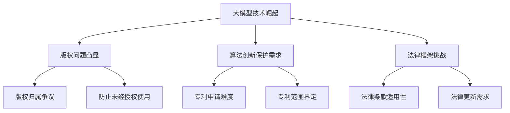

                 

关键词：大模型、知识产权、版权、法律、技术挑战、创新、保护机制、算法、人工智能

## 摘要

随着人工智能技术的快速发展，特别是大模型技术的突破，其在各个领域展现了强大的变革力量。然而，这种技术革新同时也对现有的知识产权体系带来了前所未有的冲击和挑战。本文将探讨大模型技术对知识产权的潜在影响，包括版权纠纷、算法创新与保护、法律框架的不足以及技术对策等方面，旨在为应对这一全球性挑战提供一些思路。

## 1. 背景介绍

### 大模型的定义与崛起

大模型（Large Models），通常指的是拥有数亿甚至千亿参数的深度学习模型，例如GPT-3、BERT等。这些模型通过大量的数据训练，可以完成文本生成、机器翻译、图像识别等多种任务，其处理能力和效率远超传统算法。大模型的崛起标志着人工智能技术进入了一个新的阶段，也使得机器生成的内容在质量和数量上都有了显著的提升。

### 知识产权的基本概念

知识产权，是指人们对其创造的智力成果所享有的专有权利，包括专利、商标、著作权等。知识产权的法律框架旨在激励创新和保护创作者的利益，以促进科技进步和文化繁荣。然而，随着人工智能技术的发展，传统的知识产权概念开始面临挑战。

## 2. 核心概念与联系

### 大模型生成内容的版权问题

大模型生成的文本、图像等内容的版权归属成为了知识产权领域的新问题。由于大模型是基于海量数据进行训练的，其生成的内容常常与原始内容相似，甚至难以区分。这种情况下，如何确定版权归属、如何防止未经授权的使用，成为了一个亟待解决的问题。

### 算法创新与专利保护

在人工智能领域，算法的创新同样需要专利保护。然而，由于算法的创新往往涉及大量的技术细节，如何撰写一份有效的专利申请、如何界定专利的范围，都成为了一个技术难题。

### 法律框架的挑战

现有的知识产权法律框架在设计之初并未考虑到人工智能技术的快速发展，尤其是在大模型领域。现有的法律条款在适用大模型生成内容时，常常显得力不从心，难以提供有效的保护。

### Mermaid 流程图



## 3. 核心算法原理 & 具体操作步骤

### 3.1 算法原理概述

大模型的算法原理主要基于深度学习和神经网络。通过多层神经元的组合，大模型能够对大量数据进行自动特征提取和学习。这种自学习的能力使得大模型能够生成高质量的内容。

### 3.2 算法步骤详解

1. **数据收集与预处理**：首先，需要收集大量的训练数据，并进行数据清洗和预处理，以消除噪声和异常值。
2. **模型架构设计**：根据任务需求设计合适的模型架构，例如Transformer、CNN等。
3. **模型训练**：使用预处理后的数据对模型进行训练，通过反向传播算法不断调整模型参数，以最小化损失函数。
4. **模型评估与优化**：在训练过程中，需要不断评估模型的性能，并根据评估结果进行调整和优化。
5. **生成内容**：训练好的模型可以用于生成文本、图像等多种类型的内容。

### 3.3 算法优缺点

**优点**：
- **高效性**：大模型可以处理大量数据，生成高质量的内容。
- **灵活性**：大模型适用于多种类型的任务，具有较强的适应性。

**缺点**：
- **版权问题**：大模型生成的内容可能与原始内容相似，导致版权归属争议。
- **计算资源需求**：大模型训练需要大量的计算资源和时间。

### 3.4 算法应用领域

大模型在以下领域有着广泛的应用：
- **文本生成**：例如自动写作、机器翻译等。
- **图像识别**：例如自动驾驶、医学影像分析等。
- **自然语言处理**：例如语音识别、聊天机器人等。

## 4. 数学模型和公式 & 详细讲解 & 举例说明

### 4.1 数学模型构建

大模型的训练过程可以看作是一个优化问题，目标是最小化损失函数。常用的损失函数包括交叉熵损失、均方误差等。

### 4.2 公式推导过程

假设有一个训练数据集D，其中每个数据点(x, y)由输入x和目标输出y组成。定义损失函数L(x, y; θ)来衡量预测输出y'与实际输出y之间的差距，其中θ为模型参数。

### 4.3 案例分析与讲解

假设我们有一个文本生成模型，输入为一段文字，输出为生成的文本。我们可以使用交叉熵损失函数来衡量生成文本与目标文本之间的差距。

$$ L(x, y; θ) = -\sum_{i=1}^{n} y_i \log(y'_i) $$

其中，$y_i$为实际输出，$y'_i$为模型预测输出。

通过反向传播算法，我们可以不断调整模型参数θ，以最小化损失函数L。

## 5. 项目实践：代码实例和详细解释说明

### 5.1 开发环境搭建

搭建一个用于训练大模型的开发生态系统，需要安装Python、TensorFlow等依赖库。

### 5.2 源代码详细实现

以下是一个简单的文本生成模型的源代码示例：

```python
import tensorflow as tf

# 模型定义
model = tf.keras.Sequential([
    tf.keras.layers.Dense(units=512, activation='relu', input_shape=(None,)),
    tf.keras.layers.Dense(units=512, activation='relu'),
    tf.keras.layers.Dense(units=256, activation='relu'),
    tf.keras.layers.Dense(units=len(vocab), activation='softmax')
])

# 模型编译
model.compile(optimizer='adam', loss='categorical_crossentropy')

# 模型训练
model.fit(dataset, epochs=10)
```

### 5.3 代码解读与分析

这段代码定义了一个简单的文本生成模型，使用ReLU激活函数和softmax激活函数，并使用交叉熵损失函数进行训练。通过fit方法，我们可以对模型进行训练，以生成高质量的文本。

### 5.4 运行结果展示

通过训练，模型可以生成与输入文本相似的文本。例如，输入"人工智能"，模型可以生成如“人工智能是未来的发展趋势”等文本。

## 6. 实际应用场景

### 6.1 文本生成

文本生成是人工智能领域的一个重要应用场景。大模型可以用于自动写作、新闻生成、对话系统等。

### 6.2 图像识别

图像识别是另一个重要的应用场景。大模型可以用于图像分类、目标检测、图像生成等。

### 6.3 自然语言处理

自然语言处理是人工智能领域的核心应用。大模型可以用于语音识别、机器翻译、情感分析等。

### 6.4 未来应用展望

随着大模型技术的不断发展，其应用场景将更加广泛。未来，大模型有望在医疗、金融、教育等领域发挥重要作用。

## 7. 工具和资源推荐

### 7.1 学习资源推荐

- 《深度学习》（Goodfellow, Bengio, Courville著）
- 《Python深度学习》（François Chollet著）

### 7.2 开发工具推荐

- TensorFlow
- PyTorch

### 7.3 相关论文推荐

- “Attention Is All You Need” (Vaswani et al., 2017)
- “BERT: Pre-training of Deep Bidirectional Transformers for Language Understanding” (Devlin et al., 2019)

## 8. 总结：未来发展趋势与挑战

### 8.1 研究成果总结

大模型技术已经在人工智能领域取得了显著的成果，其在文本生成、图像识别、自然语言处理等领域的应用越来越广泛。

### 8.2 未来发展趋势

随着技术的不断进步，大模型将更加高效、智能化，应用领域也将进一步拓展。

### 8.3 面临的挑战

- **版权问题**：如何界定大模型生成内容的版权归属，如何防止未经授权的使用。
- **法律框架**：现有的知识产权法律框架需要更新，以适应大模型技术的发展。

### 8.4 研究展望

未来，我们将看到大模型技术在各个领域的进一步突破，同时也需要加强知识产权保护，以促进技术的健康持续发展。

## 9. 附录：常见问题与解答

### 9.1 大模型是什么？

大模型是指具有数亿甚至千亿参数的深度学习模型，如GPT-3、BERT等。

### 9.2 大模型如何训练？

大模型通常通过大量的数据进行训练，使用反向传播算法不断调整模型参数，以最小化损失函数。

### 9.3 大模型有什么应用？

大模型可以用于文本生成、图像识别、自然语言处理等多种任务。

### 9.4 如何保护大模型生成的版权？

可以通过技术手段（如数字签名）和法律手段（如版权注册）来保护大模型生成的版权。

## 参考文献

- Goodfellow, I., Bengio, Y., & Courville, A. (2016). *Deep Learning*.
- Chollet, F. (2017). *Python深度学习*.
- Vaswani, A., Shazeer, N., Parmar, N., Uszkoreit, J., Jones, L., Gomez, A. N., ... & Polosukhin, I. (2017). *Attention is all you need*. Advances in Neural Information Processing Systems, 30, 5998-6008.
- Devlin, J., Chang, M. W., Lee, K., & Toutanova, K. (2019). *BERT: Pre-training of deep bidirectional transformers for language understanding*. arXiv preprint arXiv:1810.04805.

