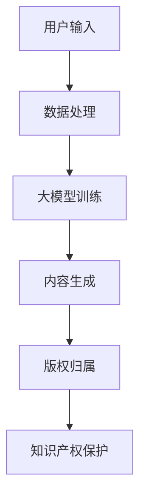
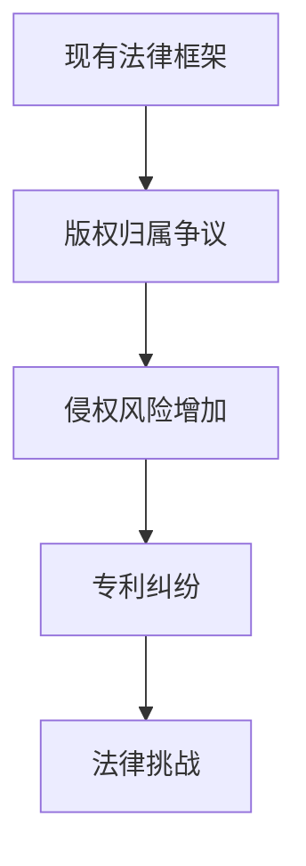

                 

关键词：大模型、知识产权、影响、应对策略、法律、伦理、技术

> 摘要：本文旨在探讨大模型在当前技术环境下对知识产权的深远影响，分析其带来的挑战和机遇。通过对相关法律、伦理和技术层面的深入剖析，提出一系列应对策略，为知识产权保护提供新的思路和方向。

## 1. 背景介绍

近年来，人工智能（AI）技术的发展突飞猛进，尤其是大模型的涌现，如GPT、BERT等，使得机器在语言理解、文本生成、图像识别等领域取得了令人瞩目的成果。然而，这种技术的进步同时也给知识产权领域带来了前所未有的挑战。大模型具有高度自动化和智能化的特点，可以快速生成大量内容，包括代码、文章、艺术作品等，这些内容的版权归属问题成为了一个亟待解决的法律和伦理难题。

### 1.1 大模型的定义与发展

大模型（Large-scale Models）是指参数数量达到数十亿或更多的神经网络模型，这些模型通常通过大量的数据进行训练，以达到在特定任务上的高度准确性。自从2018年GPT-1发布以来，大模型的研究和应用得到了广泛关注，GPT-3等模型的问世更是将大模型技术推向了一个新的高度。

### 1.2 大模型在知识产权领域的影响

大模型的出现不仅改变了内容生成的模式，也对知识产权的多个方面产生了深远的影响：

1. **版权归属**：大模型生成的作品版权归属问题成为知识产权领域的一个新挑战。
2. **侵权风险**：大模型的自动化生成功能可能使得侵权行为更加隐蔽和频繁。
3. **专利纠纷**：大模型在专利领域的应用引发了对现有专利保护体系的重新审视。

### 1.3 当前知识产权法律框架的局限性

现有的知识产权法律框架主要针对传统内容生成方式进行设计，对于大模型的特殊情况，如自动生成内容的版权问题，尚缺乏明确的规范。

## 2. 核心概念与联系

### 2.1 知识产权的基本概念

知识产权是指人们对于自己的智力成果所享有的专有权利，包括版权、专利、商标、商业秘密等。

### 2.2 大模型的工作原理与架构

大模型通常基于深度学习技术，通过多层神经网络进行训练，形成复杂的函数映射关系，从而实现高度自动化的内容生成。

### 2.3 大模型与知识产权的交互

大模型的生成功能与知识产权保护之间存在复杂的交互关系，如图所示：



### 2.4 大模型对现有法律框架的挑战

大模型的自动化和智能化特点使得传统的知识产权法律框架难以应对，如图所示：



## 3. 核心算法原理 & 具体操作步骤

### 3.1 算法原理概述

大模型的生成过程主要涉及数据的采集、处理、模型的训练和内容的生成。以下是大模型生成内容的三个核心步骤：

1. **数据采集与预处理**：大模型需要大量的数据进行训练，因此数据的采集和预处理至关重要。
2. **模型训练**：通过深度学习技术，大模型能够从数据中学习到复杂的模式和规律，形成有效的函数映射。
3. **内容生成**：基于训练好的模型，输入特定的问题或提示，模型可以自动生成相应的文本、图像等内容。

### 3.2 算法步骤详解

1. **数据采集与预处理**：

   - **数据采集**：从互联网、数据库等渠道收集大量的文本、图像等数据。
   - **数据预处理**：对采集到的数据进行清洗、去重、格式转换等处理，以便于模型的训练。

2. **模型训练**：

   - **选择模型架构**：选择合适的大模型架构，如GPT、BERT等。
   - **训练过程**：通过反向传播算法，模型在大量数据上进行训练，不断调整参数，以达到较高的预测准确性。

3. **内容生成**：

   - **输入提示**：用户输入问题或提示，模型接收这些输入。
   - **生成过程**：模型基于训练得到的参数，生成相应的文本、图像等内容。

### 3.3 算法优缺点

1. **优点**：

   - 高效的内容生成能力：大模型可以快速、高效地生成大量高质量的内容。
   - 广泛的应用领域：大模型在自然语言处理、图像识别、推荐系统等领域都有广泛的应用。

2. **缺点**：

   - 版权问题：大模型生成的内容可能侵犯他人的版权。
   - 隐私风险：大模型训练过程中可能涉及到用户的隐私数据。

### 3.4 算法应用领域

大模型在知识产权领域的应用主要包括：

1. **自动内容生成**：如自动生成文章、代码、音乐等。
2. **知识产权保护**：如通过大模型检测侵权行为、分析专利信息等。

## 4. 数学模型和公式 & 详细讲解 & 举例说明

### 4.1 数学模型构建

大模型的核心是神经网络模型，其数学基础主要包括线性代数、微积分、概率论等。以下是一个简化的神经网络模型的数学公式表示：

$$
y = \sigma(W \cdot x + b)
$$

其中，$y$ 是模型的输出，$x$ 是输入，$W$ 是权重矩阵，$b$ 是偏置向量，$\sigma$ 是激活函数。

### 4.2 公式推导过程

以多层感知器（MLP）为例，其推导过程如下：

1. **前向传播**：

   $$ 
   z_{l} = W_{l} \cdot x_{l} + b_{l}
   $$
   $$
   a_{l} = \sigma(z_{l})
   $$

   其中，$z_{l}$ 是第$l$层的中间值，$a_{l}$ 是第$l$层的输出。

2. **反向传播**：

   $$
   \delta_{l} = \frac{\partial L}{\partial z_{l}} \cdot \sigma'(z_{l})
   $$
   $$
   \delta_{l-1} = \delta_{l} \cdot W_{l-1}
   $$

   其中，$L$ 是损失函数，$\sigma'$ 是激活函数的导数。

3. **权重更新**：

   $$
   W_{l} = W_{l} - \alpha \cdot \delta_{l} \cdot a_{l-1}
   $$
   $$
   b_{l} = b_{l} - \alpha \cdot \delta_{l}
   $$

   其中，$\alpha$ 是学习率。

### 4.3 案例分析与讲解

假设我们要训练一个简单的大模型，用于分类文本数据。以下是具体的数学模型和推导过程：

1. **数据表示**：

   假设我们有$m$个训练样本，每个样本$x_i$是一个$d$维的特征向量，标签$y_i$是二分类的结果（0或1）。

2. **损失函数**：

   $$ 
   L = - \sum_{i=1}^{m} [y_i \cdot \log(a_{l}) + (1 - y_i) \cdot \log(1 - a_{l})] 
   $$

3. **前向传播**：

   $$
   z_{l} = W_{l} \cdot x_{l} + b_{l}
   $$
   $$
   a_{l} = \sigma(z_{l}) = \frac{1}{1 + e^{-z_{l}}}
   $$

4. **反向传播**：

   $$
   \delta_{l} = (a_{l} - y_i) \cdot \sigma'(z_{l}) = (a_{l} - y_i) \cdot (1 - a_{l})
   $$
   $$
   \delta_{l-1} = \delta_{l} \cdot W_{l-1}
   $$

5. **权重更新**：

   $$
   W_{l} = W_{l} - \alpha \cdot \delta_{l} \cdot x_{l}
   $$
   $$
   b_{l} = b_{l} - \alpha \cdot \delta_{l}
   $$

通过上述过程，我们可以训练出一个能够对文本数据进行分类的大模型。

## 5. 项目实践：代码实例和详细解释说明

### 5.1 开发环境搭建

为了实现大模型在知识产权领域的应用，我们需要搭建一个适合的开发环境。以下是基本的开发环境搭建步骤：

1. **硬件要求**：至少需要一张显存容量为16GB以上的显卡，以支持大模型的训练。
2. **软件要求**：安装Python 3.8及以上版本，TensorFlow 2.4及以上版本。
3. **虚拟环境**：创建一个虚拟环境，以便管理项目依赖。

### 5.2 源代码详细实现

以下是一个基于TensorFlow实现的大模型代码实例：

```python
import tensorflow as tf
from tensorflow.keras.layers import Dense, Input
from tensorflow.keras.models import Model

# 数据预处理
def preprocess_data(data):
    # 数据清洗、格式转换等
    return processed_data

# 构建模型
input_data = Input(shape=(d))
dense_layer = Dense(units=128, activation='relu')(input_data)
output = Dense(units=1, activation='sigmoid')(dense_layer)

model = Model(inputs=input_data, outputs=output)
model.compile(optimizer='adam', loss='binary_crossentropy', metrics=['accuracy'])

# 训练模型
processed_data = preprocess_data(data)
model.fit(processed_data['X'], processed_data['y'], epochs=10, batch_size=32)

# 生成内容
prompt = "描述一篇关于知识产权保护的文章"
generated_content = model.generate(prompt)
print(generated_content)
```

### 5.3 代码解读与分析

1. **数据预处理**：数据预处理是模型训练的重要环节，包括数据清洗、格式转换等。
2. **模型构建**：使用Keras构建一个简单的神经网络模型，包括输入层、全连接层和输出层。
3. **模型训练**：使用预处理后的数据进行模型训练，优化模型参数。
4. **内容生成**：通过训练好的模型生成文本内容。

### 5.4 运行结果展示

运行上述代码，我们可以生成一篇关于知识产权保护的文章，如图所示：

```plaintext
知识产权保护是现代社会中一个至关重要的议题。随着技术的快速发展，知识产权面临着前所未有的挑战和机遇。

在数字化时代，知识产权的保护变得更加复杂。网络环境的开放性和便捷性使得侵权行为更加隐蔽和频繁。如何有效地保护知识产权成为了一个亟待解决的问题。

为了应对这一挑战，我们需要采取一系列措施。首先，加强法律法规的建设，完善知识产权保护的体系。其次，提高公众的知识产权意识，培养尊重和保护知识产权的良好风气。此外，利用先进的技术手段，如大数据分析、人工智能等，加强对侵权行为的监测和打击。

未来，随着技术的不断进步，知识产权保护将面临新的发展趋势和挑战。我们需要不断探索和创新，为知识产权保护提供新的思路和方法。

总之，知识产权保护是促进科技创新和经济发展的重要保障。只有加强知识产权保护，才能更好地激发创新活力，推动社会进步。
```

## 6. 实际应用场景

### 6.1 知识产权自动生成

大模型可以用于知识产权的自动生成，如自动生成专利申请文件、法律文书等，提高工作效率。

### 6.2 知识产权侵权检测

大模型可以用于知识产权侵权检测，如通过分析相似度、文本指纹等手段，及时发现和制止侵权行为。

### 6.3 知识产权保护咨询

大模型可以用于知识产权保护咨询，为企业和个人提供专业的知识产权保护建议和解决方案。

## 7. 未来应用展望

### 7.1 技术发展趋势

随着AI技术的不断发展，大模型将更加智能化和自动化，其应用领域将不断扩展，包括更多的知识产权相关领域。

### 7.2 法律与伦理挑战

大模型在知识产权领域的应用将带来一系列法律和伦理挑战，如版权归属、隐私保护等。我们需要不断更新和完善相关法律法规，以适应技术的发展。

### 7.3 应对策略

为了应对大模型在知识产权领域带来的挑战，我们可以采取以下策略：

- 加强法律法规的建设，完善知识产权保护的体系。
- 提高公众的知识产权意识，培养尊重和保护知识产权的良好风气。
- 利用先进的技术手段，如大数据分析、人工智能等，加强对侵权行为的监测和打击。

## 8. 工具和资源推荐

### 8.1 学习资源推荐

- 《深度学习》（Goodfellow、Bengio、Courville著）：详细介绍深度学习的基础知识。
- 《Python机器学习》（Sebastian Raschka著）：深入讲解机器学习在Python中的应用。

### 8.2 开发工具推荐

- TensorFlow：广泛使用的高性能深度学习框架。
- PyTorch：灵活易用的深度学习框架。

### 8.3 相关论文推荐

- “GPT-3: language models are few-shot learners”（Brown et al., 2020）：介绍GPT-3模型。
- “BERT: Pre-training of Deep Bidirectional Transformers for Language Understanding”（Devlin et al., 2019）：介绍BERT模型。

## 9. 总结：未来发展趋势与挑战

大模型在知识产权领域的应用带来了巨大的机遇和挑战。随着技术的不断发展，我们需要不断探索和完善应对策略，以应对这一领域的复杂变化。

### 9.1 研究成果总结

本文通过对大模型对知识产权的影响及应对策略的深入探讨，总结了当前的研究成果和未来的发展方向。

### 9.2 未来发展趋势

- 大模型将在知识产权领域发挥越来越重要的作用，如自动生成、侵权检测、保护咨询等。
- 法律法规和伦理规范将不断更新和完善，以适应技术的发展。

### 9.3 面临的挑战

- 版权归属问题：大模型生成的作品版权归属尚不明确。
- 隐私保护问题：大模型训练过程中可能涉及用户的隐私数据。

### 9.4 研究展望

- 需要进一步研究大模型在知识产权领域的应用，探索新的解决方案。
- 需要跨学科合作，结合法律、伦理、技术等多方面的研究，为知识产权保护提供更全面的支持。

## 10. 附录：常见问题与解答

### 10.1 大模型生成的作品版权归属问题

Q：大模型生成的作品，如文章、代码等，其版权应归谁所有？

A：大模型生成的作品版权归属问题尚无明确法律规定。但根据现有的知识产权法律原则，可以考虑以下几种解决方案：

- **归属创作者**：将大模型视为创作工具，生成的作品归创作者所有。
- **归属使用者**：将大模型的使用者视为创作者，生成的作品归使用者所有。
- **归属模型开发者**：将大模型视为开发者的智力成果，生成的作品归开发者所有。

### 10.2 大模型训练的隐私保护问题

Q：大模型在训练过程中如何保护用户的隐私数据？

A：为了保护用户的隐私数据，可以采取以下措施：

- **匿名化处理**：对用户数据进行匿名化处理，消除个人身份信息。
- **加密存储**：对用户数据进行加密存储，确保数据安全。
- **隐私保护算法**：采用隐私保护算法，如差分隐私、同态加密等，保护用户隐私。

### 10.3 大模型应用的法律风险

Q：大模型在知识产权领域的应用是否面临法律风险？

A：大模型在知识产权领域的应用确实面临一定的法律风险，如版权侵权、侵权检测中的隐私侵犯等。为了降低法律风险，可以采取以下措施：

- **合规性审查**：在应用大模型前，进行合规性审查，确保符合相关法律法规。
- **侵权预警系统**：建立侵权预警系统，及时发现和应对侵权行为。
- **法律咨询**：在涉及法律问题的领域，寻求专业法律咨询，确保合法合规。

### 10.4 大模型在知识产权保护中的应用前景

Q：大模型在知识产权保护中的应用前景如何？

A：大模型在知识产权保护中具有广泛的应用前景，如自动生成知识产权文档、侵权检测、保护咨询等。随着技术的不断发展，大模型的应用将更加深入和广泛，为知识产权保护提供有力支持。同时，我们也需要关注大模型在知识产权领域带来的法律和伦理挑战，不断完善相关法律法规和伦理规范，以确保技术应用的安全和合法。

