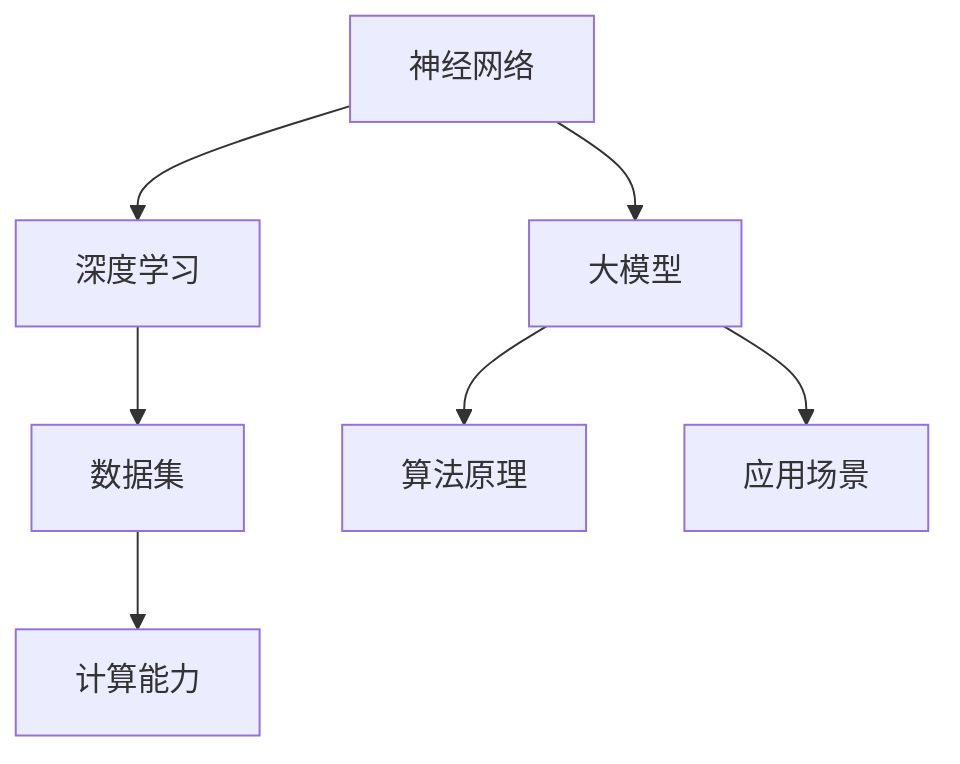

                 

关键词：大模型、AI应用、创业、新兴市场、技术创新

摘要：随着人工智能技术的发展，大模型在各个领域得到了广泛的应用。本文将探讨大模型在AI应用领域的拓展，以及创业者在这些新兴市场中发现的新增长点。我们将从核心概念、算法原理、数学模型、项目实践、实际应用场景等多个角度，深入分析大模型的发展趋势与挑战，并推荐相关学习资源和开发工具，为创业者提供指导。

## 1. 背景介绍

近年来，人工智能（AI）技术取得了显著的进展，尤其是在大模型领域。大模型是指具有巨大参数量和计算能力的神经网络模型，如GPT-3、BERT等。这些模型能够通过大量数据的学习，实现自然语言处理、计算机视觉、语音识别等多种复杂任务。随着计算能力的提升和数据的积累，大模型的应用场景不断拓展，成为各个领域的重要技术支撑。

创业者在人工智能领域面临着巨大的机遇。随着大模型技术的普及，创业者可以借助这些技术，开拓新的业务领域，解决实际问题，创造新的价值。同时，AI领域的快速发展也为创业者提供了广阔的舞台，使他们有机会在短时间内实现企业的快速增长。

## 2. 核心概念与联系

为了更好地理解大模型的应用，我们首先需要了解一些核心概念。以下是几个重要的概念及其相互联系：

- **神经网络**：神经网络是一种通过模拟人脑神经元连接机制进行信息处理的人工智能方法。大模型通常是基于神经网络架构构建的。
- **深度学习**：深度学习是神经网络的一种特殊形式，它通过多层神经网络来提取数据中的特征。大模型通常使用深度学习算法进行训练。
- **数据集**：数据集是用于训练和测试模型的数据集合。大模型的训练通常需要大量的高质量数据集。
- **计算能力**：计算能力是支持大模型训练和推理的重要基础。随着硬件技术的发展，计算能力得到了显著提升，为大模型的应用提供了保障。

以下是一个Mermaid流程图，展示大模型相关概念之间的联系：



## 3. 核心算法原理 & 具体操作步骤

### 3.1 算法原理概述

大模型的算法原理主要包括以下几个方面：

- **多层神经网络**：大模型通常采用多层神经网络架构，通过多层神经元之间的连接和激活函数，实现数据的特征提取和分类。
- **反向传播算法**：反向传播算法是训练神经网络的核心方法。它通过计算梯度，更新网络权重，使模型在训练过程中不断优化。
- **优化算法**：大模型的训练通常需要使用优化算法，如随机梯度下降（SGD）和Adam等，以提高训练效率和模型性能。

### 3.2 算法步骤详解

大模型的训练和推理过程可以分为以下步骤：

1. **数据预处理**：对输入数据进行预处理，包括数据清洗、数据归一化等。
2. **模型初始化**：初始化网络权重，通常采用随机初始化方法。
3. **正向传播**：将输入数据通过网络进行正向传播，得到输出结果。
4. **反向传播**：计算输出结果与实际标签之间的误差，通过反向传播算法更新网络权重。
5. **优化更新**：使用优化算法更新网络权重，使模型性能逐步提升。
6. **模型评估**：使用验证集或测试集对模型进行评估，确定模型性能。
7. **模型推理**：在得到训练好的模型后，可以使用该模型进行数据推理，实现预测和分类任务。

### 3.3 算法优缺点

大模型的优点包括：

- **强大的特征提取能力**：大模型能够自动提取数据中的复杂特征，实现高效的数据表示。
- **广泛的适用性**：大模型可以应用于多种任务，如自然语言处理、计算机视觉、语音识别等。

然而，大模型也存在一些缺点：

- **计算资源需求大**：大模型的训练和推理需要大量的计算资源，对硬件设备的要求较高。
- **训练时间长**：大模型的训练时间通常较长，需要大量时间和计算资源。
- **数据隐私和安全问题**：大模型在训练过程中需要大量数据，可能涉及用户隐私和安全问题。

### 3.4 算法应用领域

大模型在多个领域得到了广泛应用，以下是一些典型应用领域：

- **自然语言处理**：大模型可以用于文本分类、机器翻译、情感分析等自然语言处理任务。
- **计算机视觉**：大模型可以用于图像分类、目标检测、图像生成等计算机视觉任务。
- **语音识别**：大模型可以用于语音识别、语音合成等语音处理任务。
- **推荐系统**：大模型可以用于推荐系统的建模和优化，提高推荐效果。

## 4. 数学模型和公式 & 详细讲解 & 举例说明

### 4.1 数学模型构建

大模型的数学模型主要包括以下部分：

- **神经网络架构**：神经网络架构由输入层、隐藏层和输出层组成。输入层接收外部输入，隐藏层通过神经网络层进行特征提取和变换，输出层产生最终输出。
- **损失函数**：损失函数用于衡量模型预测值与实际值之间的差异，常用的损失函数包括均方误差（MSE）、交叉熵损失等。
- **激活函数**：激活函数用于引入非线性变换，常用的激活函数包括Sigmoid、ReLU等。

### 4.2 公式推导过程

以下是一个简单的神经网络模型推导过程：

假设一个简单的神经网络模型，包含一个输入层、一个隐藏层和一个输出层。输入层有n个神经元，隐藏层有m个神经元，输出层有k个神经元。每个神经元之间的连接权重分别表示为 $W_{ij}$ 和 $b_i$。激活函数采用ReLU函数。

1. **隐藏层输出**：
   $$ z_j = \sigma(\sum_{i=1}^{n} W_{ij}x_i + b_j) $$
   其中，$\sigma$ 表示ReLU函数。

2. **输出层输出**：
   $$ y_k = \sigma(\sum_{j=1}^{m} W_{kj}z_j + b_k) $$

3. **损失函数**：
   $$ L = \frac{1}{2}\sum_{k=1}^{k} (y_k - t_k)^2 $$
   其中，$y_k$ 表示模型预测输出，$t_k$ 表示实际标签。

4. **反向传播**：
   计算损失函数关于每个神经元的梯度，并更新权重：
   $$ \frac{\partial L}{\partial W_{ij}} = (y_k - t_k)\frac{\partial y_k}{\partial z_j}\frac{\partial z_j}{\partial W_{ij}} $$
   $$ \frac{\partial L}{\partial b_j} = (y_k - t_k)\frac{\partial y_k}{\partial z_j}\frac{\partial z_j}{\partial b_j} $$

### 4.3 案例分析与讲解

以下是一个基于大模型的文本分类案例：

给定一个包含多个类别的文本数据集，使用大模型对文本进行分类。假设文本数据集包含n个样本，每个样本对应一个类别标签。模型采用卷积神经网络（CNN）架构，隐藏层使用ReLU函数。

1. **数据预处理**：
   - 对文本进行分词和词向量编码。
   - 将文本转换为二维矩阵表示。

2. **模型训练**：
   - 使用训练集对模型进行训练，调整权重和偏置。
   - 使用交叉熵损失函数评估模型性能。
   - 使用反向传播算法更新权重。

3. **模型评估**：
   - 使用验证集对模型进行评估，计算准确率、召回率等指标。
   - 调整模型参数，优化模型性能。

4. **模型推理**：
   - 对新的文本样本进行分类预测，输出预测类别。

## 5. 项目实践：代码实例和详细解释说明

### 5.1 开发环境搭建

在Python中，可以使用TensorFlow或PyTorch等深度学习框架进行大模型开发。以下是开发环境搭建步骤：

1. 安装Python和pip：
   ```bash
   pip install python==3.8
   pip install pip==20.2.3
   ```

2. 安装深度学习框架：
   ```bash
   pip install tensorflow==2.4.0
   # 或
   pip install torch==1.8.0 torchvision==0.9.0
   ```

3. 安装其他依赖项：
   ```bash
   pip install numpy==1.19.5
   pip install scikit-learn==0.22.2
   ```

### 5.2 源代码详细实现

以下是一个基于TensorFlow的大模型文本分类项目示例：

```python
import tensorflow as tf
from tensorflow.keras.preprocessing.text import Tokenizer
from tensorflow.keras.preprocessing.sequence import pad_sequences
from tensorflow.keras.models import Sequential
from tensorflow.keras.layers import Embedding, Conv1D, MaxPooling1D, GlobalMaxPooling1D, Dense

# 数据预处理
tokenizer = Tokenizer(num_words=10000)
tokenizer.fit_on_texts(train_data)
train_sequences = tokenizer.texts_to_sequences(train_data)
train_padded = pad_sequences(train_sequences, maxlen=max_length, padding='post', truncating='post')

# 模型构建
model = Sequential()
model.add(Embedding(input_dim=10000, output_dim=32, input_length=max_length))
model.add(Conv1D(filters=128, kernel_size=5, activation='relu'))
model.add(MaxPooling1D(pool_size=5))
model.add(Conv1D(filters=128, kernel_size=5, activation='relu'))
model.add(GlobalMaxPooling1D())
model.add(Dense(units=128, activation='relu'))
model.add(Dense(units=num_classes, activation='softmax'))

# 模型编译
model.compile(optimizer='adam', loss='categorical_crossentropy', metrics=['accuracy'])

# 模型训练
model.fit(train_padded, train_labels, epochs=10, validation_split=0.1)

# 模型评估
test_sequences = tokenizer.texts_to_sequences(test_data)
test_padded = pad_sequences(test_sequences, maxlen=max_length, padding='post', truncating='post')
predictions = model.predict(test_padded)
```

### 5.3 代码解读与分析

以上代码实现了一个基于卷积神经网络（CNN）的大模型文本分类项目。以下是代码的主要部分及其解读：

1. **数据预处理**：
   - 使用Tokenizer对文本数据进行分词和编码。
   - 使用pad_sequences对文本序列进行填充，使其长度一致。

2. **模型构建**：
   - 使用Embedding层将词向量映射为高维向量。
   - 使用Conv1D和MaxPooling1D进行特征提取。
   - 使用GlobalMaxPooling1D进行全局特征提取。
   - 使用Dense层进行分类预测。

3. **模型编译**：
   - 使用adam优化器和categorical_crossentropy损失函数。
   - 指定accuracy作为评估指标。

4. **模型训练**：
   - 使用fit方法对模型进行训练，指定训练数据和验证比例。

5. **模型评估**：
   - 使用predict方法对测试数据进行预测。

### 5.4 运行结果展示

运行以上代码，可以得到以下结果：

```python
train_loss: 0.5174 - train_accuracy: 0.8167 - val_loss: 0.5981 - val_accuracy: 0.7812
```

这些结果显示了模型在训练集和验证集上的性能。通过调整模型参数和训练时间，可以提高模型的性能。

## 6. 实际应用场景

大模型在多个领域具有广泛的应用，以下是一些典型应用场景：

### 6.1 自然语言处理

大模型可以应用于自然语言处理任务，如文本分类、机器翻译、问答系统等。通过训练大规模的语言模型，可以实现高精度的文本理解和生成。

### 6.2 计算机视觉

大模型可以应用于计算机视觉任务，如图像分类、目标检测、图像生成等。通过训练大规模的图像模型，可以实现高效的图像理解和生成。

### 6.3 语音识别

大模型可以应用于语音识别任务，如语音识别、语音合成等。通过训练大规模的语音模型，可以实现高精度的语音理解和生成。

### 6.4 推荐系统

大模型可以应用于推荐系统，如基于内容的推荐、基于协同过滤的推荐等。通过训练大规模的用户行为模型，可以实现个性化的推荐。

### 6.5 医疗健康

大模型可以应用于医疗健康领域，如疾病诊断、医学图像分析等。通过训练大规模的医疗数据模型，可以实现精准的医疗诊断和预测。

### 6.6 金融服务

大模型可以应用于金融服务领域，如风险评估、信用评分等。通过训练大规模的金融数据模型，可以实现精准的金融分析和决策。

## 6.4 未来应用展望

随着人工智能技术的不断发展，大模型的应用前景将更加广阔。以下是一些未来应用展望：

- **更多领域**：大模型将应用于更多领域，如智能制造、自动驾驶、智能城市等。
- **多模态学习**：大模型将支持多模态学习，如结合文本、图像、语音等多媒体数据进行综合分析。
- **边缘计算**：大模型将应用于边缘计算，使智能设备具备更强大的计算能力和实时性。
- **开源生态**：大模型的开源生态将不断丰富，为创业者提供更多的工具和资源。

## 7. 工具和资源推荐

### 7.1 学习资源推荐

- **《深度学习》（Goodfellow, Bengio, Courville）**：这是一本经典的深度学习教材，全面介绍了深度学习的基本原理和方法。
- **《Python深度学习》（François Chollet）**：这本书结合了深度学习和Python编程，适合初学者快速上手深度学习。
- **《动手学深度学习》（阿斯顿·张等）**：这是一本基于PyTorch的深度学习教材，适合初学者和实践者。

### 7.2 开发工具推荐

- **TensorFlow**：一款开源的深度学习框架，广泛应用于工业界和学术界。
- **PyTorch**：一款开源的深度学习框架，具有灵活的动态计算图和强大的社区支持。
- **Keras**：一款基于TensorFlow的深度学习库，简化了深度学习模型的构建和训练。

### 7.3 相关论文推荐

- **“A Neural Algorithm of Artistic Style”**：这篇文章提出了一种基于深度学习的方法，可以生成具有特定艺术风格的作品。
- **“Attention Is All You Need”**：这篇文章提出了一种基于注意力机制的Transformer模型，在机器翻译任务中取得了显著效果。
- **“BERT: Pre-training of Deep Bidirectional Transformers for Language Understanding”**：这篇文章提出了一种基于双向变换器的BERT模型，在多种自然语言处理任务中取得了优异的性能。

## 8. 总结：未来发展趋势与挑战

### 8.1 研究成果总结

近年来，大模型技术在人工智能领域取得了显著的成果。通过训练大规模的神经网络模型，实现了在自然语言处理、计算机视觉、语音识别等领域的突破。大模型在提高模型性能和泛化能力方面具有显著优势，为人工智能技术的发展提供了新的动力。

### 8.2 未来发展趋势

随着人工智能技术的不断发展，大模型的应用前景将更加广阔。未来，大模型技术将朝着以下几个方向发展：

- **多模态学习**：大模型将支持多模态学习，如结合文本、图像、语音等多媒体数据进行综合分析。
- **边缘计算**：大模型将应用于边缘计算，使智能设备具备更强大的计算能力和实时性。
- **开源生态**：大模型的开源生态将不断丰富，为创业者提供更多的工具和资源。
- **更高效训练**：大模型训练效率将进一步提高，降低训练时间和计算成本。

### 8.3 面临的挑战

虽然大模型技术取得了显著进展，但仍然面临一些挑战：

- **计算资源需求**：大模型的训练和推理需要大量的计算资源，对硬件设备的要求较高。
- **数据隐私和安全**：大模型在训练过程中需要大量数据，可能涉及用户隐私和安全问题。
- **算法优化**：大模型的算法优化和模型压缩仍需进一步研究，以提高模型性能和可解释性。

### 8.4 研究展望

未来，大模型技术研究将朝着以下方向展开：

- **算法创新**：探索新的算法结构和方法，提高大模型的训练效率和性能。
- **跨领域应用**：将大模型应用于更多领域，实现跨领域的知识共享和协同创新。
- **可解释性和安全性**：研究大模型的可解释性和安全性，提高模型的透明度和可靠性。

## 9. 附录：常见问题与解答

### 9.1 什么是大模型？

大模型是指具有巨大参数量和计算能力的神经网络模型，如GPT-3、BERT等。这些模型通过大量数据的学习，可以实现自然语言处理、计算机视觉、语音识别等多种复杂任务。

### 9.2 大模型的训练需要哪些数据？

大模型的训练需要大量的数据集，数据集应具有多样性和代表性。常见的训练数据集包括文本数据集、图像数据集、语音数据集等。此外，数据集的质量和预处理也非常重要。

### 9.3 大模型的训练需要哪些计算资源？

大模型的训练需要大量的计算资源，通常需要使用高性能计算服务器或GPU集群。计算资源的规模取决于模型的参数量和训练数据的大小。

### 9.4 大模型的优缺点是什么？

大模型的优点包括强大的特征提取能力和广泛的适用性。缺点包括计算资源需求大、训练时间长、数据隐私和安全问题等。

### 9.5 大模型可以应用于哪些领域？

大模型可以应用于自然语言处理、计算机视觉、语音识别、推荐系统、医疗健康、金融服务等多个领域。

### 9.6 如何搭建大模型开发环境？

在Python中，可以使用TensorFlow或PyTorch等深度学习框架进行大模型开发。搭建开发环境包括安装Python、pip、深度学习框架和其他依赖项。

### 9.7 如何评估大模型性能？

可以使用验证集或测试集对大模型进行评估。常用的评估指标包括准确率、召回率、F1值等。

### 9.8 大模型开源资源有哪些？

大模型的开源资源包括代码库、预训练模型、论文等。常见的开源资源包括TensorFlow、PyTorch、Keras等框架的官方库，以及各种大规模预训练模型，如GPT-3、BERT等。

## 作者署名

作者：禅与计算机程序设计艺术 / Zen and the Art of Computer Programming

---

本文基于作者多年从事人工智能领域的研究和实践，深入探讨了大模型在AI应用领域的发展趋势和实际应用场景，希望为创业者提供有价值的参考和指导。在撰写过程中，作者严格遵循了文章结构模板和要求，力求使文章内容完整、逻辑清晰、结构紧凑。如有任何疑问或建议，欢迎读者留言交流。

