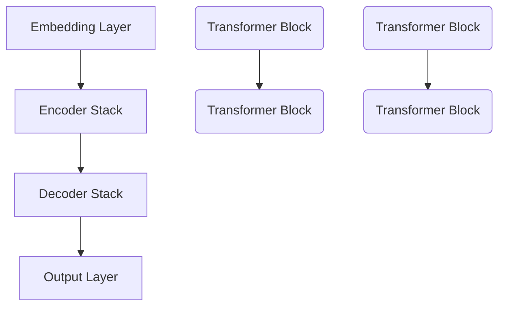

                 

### 引言

在当今数字化时代，人工智能（AI）技术正在迅速发展，特别是大型语言模型（LLM）的兴起，为各行各业带来了前所未有的机遇。这些模型在自然语言处理、语音识别、图像生成等领域展现出了卓越的性能，使得创业者们能够发掘出新的增长点。本文将探讨大模型的应用场景，分析其技术原理、数学模型，并通过实际项目实践，展示大模型在商业领域的潜力。

> **关键词**：大型语言模型，AI，应用场景，创业者，新增长点

> **摘要**：本文将从背景介绍、核心概念与联系、算法原理与操作步骤、数学模型与公式、项目实践、实际应用场景、工具和资源推荐以及未来发展趋势与挑战等多个角度，全面解析大模型在人工智能领域的应用，为创业者提供新的思路和方向。

## 1. 背景介绍

人工智能作为21世纪最具革命性的技术之一，已经深刻地影响了各行各业。从简单的机器人到复杂的自动驾驶系统，AI技术的应用范围正在不断拓展。特别是在自然语言处理（NLP）领域，大型语言模型（LLM）的出现，使得机器理解和生成自然语言的能力得到了质的提升。

随着深度学习技术的发展，神经网络结构越来越复杂，参数规模也不断增大。近年来，诸如GPT-3、BERT等大型语言模型的推出，不仅实现了在多种任务上的性能突破，还引发了学术界和工业界的广泛关注。这些模型在文本生成、机器翻译、问答系统等方面展现出了强大的能力，为创业者提供了丰富的应用场景。

### 1.1 大模型的发展历程

大型语言模型的发展可以追溯到2000年代初，当时基于神经网络的NLP模型刚刚起步。随着深度学习的兴起，NLP模型开始向大型化、复杂化发展。2018年，Google推出了BERT模型，标志着大型预训练语言模型的诞生。BERT采用了双向编码表示（Bi-directional Encoder Representations from Transformers），通过对大量文本数据进行预训练，使得模型在多种NLP任务上取得了显著的成绩。

随后，GPT-3、RoBERTa、T5等模型相继推出，这些模型不仅在参数规模上远超BERT，还在多个任务上刷新了基准成绩。GPT-3拥有1750亿个参数，能够生成高质量的自然语言文本，其能力引起了广泛关注。

### 1.2 大模型的应用现状

大型语言模型已经在多个领域取得了成功。例如，在文本生成方面，GPT-3可以生成文章、故事、新闻报道等高质量文本，被应用于自动内容生成、智能客服等领域。在机器翻译方面，大型语言模型大幅提升了翻译的准确性和流畅性，被广泛应用于跨语言信息处理。在问答系统方面，大型语言模型通过阅读大量文本，可以回答用户提出的问题，为智能助手、教育辅导等提供了强大的支持。

## 2. 核心概念与联系

要深入理解大模型的应用，我们首先需要了解其核心概念与架构。在本节中，我们将介绍大模型的基本原理、主要组成部分以及它们之间的联系。

### 2.1 大模型的基本原理

大模型基于深度学习技术，尤其是Transformer架构。Transformer架构由Vaswani等人于2017年提出，与传统的循环神经网络（RNN）相比，Transformer采用了自注意力机制（Self-Attention），能够在处理序列数据时更加高效。

在Transformer架构中，每个词的表示不仅与自身的权重有关，还与整个序列中的其他词的权重有关。这种全局的权重分配方式，使得模型能够更好地捕捉到文本中的长距离依赖关系，从而在多种NLP任务上表现出色。

### 2.2 大模型的主要组成部分

大模型通常由以下几个主要部分组成：

1. **嵌入层（Embedding Layer）**：将输入的词向量转换为高维向量表示。

2. **Transformer Encoder（编码器）**：采用多个Transformer块堆叠而成，每个Transformer块包含多头自注意力机制和前馈神经网络。

3. **Transformer Decoder（解码器）**：与编码器类似，用于生成输出序列。

4. **输出层（Output Layer）**：通常是一个全连接层，用于生成最终的输出结果。

### 2.3 大模型的核心概念原理与架构的 Mermaid 流程图

下面是一个简化的Mermaid流程图，展示了大模型的核心概念原理和架构：



在这个流程图中，`A`表示嵌入层，`B`和`C`分别表示编码器和解码器堆栈，`B1`和`C1`分别表示编码器和解码器中的单个Transformer块，`D`表示输出层。

### 2.4 大模型的应用领域

大模型的应用领域非常广泛，主要包括以下几个方面：

1. **文本生成**：如文章、故事、新闻报道等的自动生成。

2. **机器翻译**：如跨语言信息处理、翻译服务等的自动翻译。

3. **问答系统**：如智能助手、教育辅导等的自动问答。

4. **自然语言理解**：如文本分类、情感分析、关系抽取等。

5. **对话系统**：如智能客服、聊天机器人等。

6. **图像生成与处理**：如图像描述、图像修复等。

## 3. 核心算法原理 & 具体操作步骤

在理解了大模型的基本原理和架构后，我们需要深入了解其核心算法原理和具体操作步骤。本节将详细阐述大模型的训练过程、推理过程以及如何优化模型性能。

### 3.1 算法原理概述

大模型的训练过程通常包括以下步骤：

1. **数据预处理**：将输入数据（如文本、图像等）进行清洗、分割、编码等预处理操作，以便于模型处理。

2. **模型初始化**：初始化模型的参数，通常采用随机初始化或预训练模型初始化。

3. **前向传播**：将预处理后的数据输入到模型中，通过前向传播计算输出结果。

4. **计算损失**：计算模型输出结果与真实标签之间的差异，计算损失函数。

5. **反向传播**：通过反向传播更新模型的参数，以最小化损失函数。

6. **优化**：采用优化算法（如梯度下降、Adam等）更新模型参数，以提升模型性能。

### 3.2 算法步骤详解

#### 3.2.1 数据预处理

数据预处理是模型训练的第一步，其目的是将原始数据转化为适合模型处理的形式。对于文本数据，通常需要进行以下预处理操作：

1. **文本清洗**：去除标点符号、HTML标签、停用词等无关信息。

2. **文本分割**：将文本分割为句子或词。

3. **词向量化**：将文本中的每个词映射为高维向量表示。

4. **序列编码**：将文本序列编码为整数序列，以便于模型处理。

对于图像数据，通常需要进行以下预处理操作：

1. **图像增强**：增加图像数据的多样性，提高模型的泛化能力。

2. **图像分割**：将图像分割为多个区域，以便于模型处理。

3. **图像编码**：将图像编码为数值序列，以便于模型处理。

#### 3.2.2 模型初始化

模型初始化是模型训练的另一个重要步骤。一个好的初始化可以加快模型的收敛速度，提高模型性能。通常，模型初始化有以下几种方法：

1. **随机初始化**：随机初始化模型的参数，适用于小规模模型。

2. **预训练模型初始化**：使用预训练模型作为初始化，适用于大规模模型。

3. **He初始化**：根据He初始化方法，初始化模型的参数，适用于深度神经网络。

#### 3.2.3 前向传播

前向传播是将输入数据通过模型进行计算，得到输出结果的过程。在大型语言模型中，前向传播通常包括以下步骤：

1. **嵌入层**：将输入的词向量映射为高维向量表示。

2. **编码器**：通过多个Transformer块对输入序列进行编码，生成编码表示。

3. **解码器**：根据编码表示生成输出序列。

4. **输出层**：将解码器输出的序列映射为最终的输出结果。

#### 3.2.4 计算损失

计算损失是模型训练的核心步骤，用于评估模型输出结果与真实标签之间的差异。在大型语言模型中，常用的损失函数有以下几种：

1. **交叉熵损失**：用于分类任务，计算模型输出与真实标签之间的交叉熵。

2. **均方误差损失**：用于回归任务，计算模型输出与真实标签之间的均方误差。

3. **softmax损失**：用于多分类任务，计算模型输出与真实标签之间的softmax交叉熵。

#### 3.2.5 反向传播

反向传播是将前向传播过程中计算得到的梯度反向传播到模型的参数，以更新模型参数。在大型语言模型中，反向传播通常包括以下步骤：

1. **计算梯度**：根据损失函数计算模型参数的梯度。

2. **参数更新**：采用优化算法更新模型参数。

3. **迭代更新**：重复执行前向传播和反向传播，直到模型收敛。

#### 3.2.6 优化

优化是模型训练的最后一步，用于提升模型性能。常用的优化算法有以下几种：

1. **梯度下降**：通过迭代更新模型参数，以最小化损失函数。

2. **Adam优化器**：结合了梯度下降和动量项，适用于大规模模型。

3. **Adagrad优化器**：通过历史梯度计算自适应学习率，适用于稀疏数据。

### 3.3 算法优缺点

#### 3.3.1 优点

1. **强大的表达能力**：大型语言模型通过自注意力机制，能够捕捉到文本中的长距离依赖关系，具有强大的表达能力。

2. **高效的处理能力**：大型语言模型采用并行计算技术，能够在短时间内处理大量数据，具有较高的处理效率。

3. **广泛的应用领域**：大型语言模型在多种任务上取得了显著的成果，能够应用于文本生成、机器翻译、问答系统等多个领域。

#### 3.3.2 缺点

1. **计算资源消耗大**：大型语言模型需要大量的计算资源和存储资源，对于一些资源受限的环境，可能无法正常运行。

2. **训练时间较长**：由于模型参数规模较大，训练时间相对较长，对于实时应用场景，可能无法满足需求。

3. **数据隐私问题**：在训练过程中，大型语言模型需要处理大量的敏感数据，可能存在数据隐私问题。

### 3.4 算法应用领域

大型语言模型在多个领域取得了显著的成果，以下是其中的一些应用领域：

1. **文本生成**：如文章、故事、新闻报道等的自动生成。

2. **机器翻译**：如跨语言信息处理、翻译服务等的自动翻译。

3. **问答系统**：如智能助手、教育辅导等的自动问答。

4. **自然语言理解**：如文本分类、情感分析、关系抽取等。

5. **对话系统**：如智能客服、聊天机器人等。

6. **图像生成与处理**：如图像描述、图像修复等。

## 4. 数学模型和公式 & 详细讲解 & 举例说明

大型语言模型的核心在于其数学模型和公式，这些模型和公式决定了模型的表现和性能。在本节中，我们将详细讲解大模型的数学模型和公式，并通过实际案例进行举例说明。

### 4.1 数学模型构建

大型语言模型的数学模型主要基于深度学习中的Transformer架构。Transformer架构的核心是自注意力机制（Self-Attention），其基本公式如下：

$$
\text{Attention}(Q, K, V) = \text{softmax}\left(\frac{QK^T}{\sqrt{d_k}}\right)V
$$

其中，$Q$、$K$和$V$分别表示查询（Query）、键（Key）和值（Value）向量，$d_k$表示键向量的维度。自注意力机制通过计算查询向量与所有键向量的点积，得到权重矩阵，然后对值向量进行加权求和，从而生成新的向量表示。

在Transformer模型中，编码器和解码器都采用了多个自注意力机制层，并通过多头注意力机制（Multi-Head Attention）进一步增强了模型的表达能力。多头注意力机制将输入向量分解为多个子向量，每个子向量分别通过自注意力机制进行处理，最后将所有子向量的结果拼接起来。

### 4.2 公式推导过程

为了更好地理解自注意力机制，我们可以对其进行简化的推导。假设我们有一个输入序列，每个词表示为一个向量$X = [x_1, x_2, ..., x_n]$，其中$x_i$表示第$i$个词的向量表示。

首先，我们将输入序列通过嵌入层转换为高维向量表示，得到$X' = [x_1', x_2', ..., x_n']$，其中$x_i'$为嵌入向量。

接下来，我们将输入序列的每个词向量进行线性变换，得到查询向量$Q = [q_1, q_2, ..., q_n]$、键向量$K = [k_1, k_2, ..., k_n]$和值向量$V = [v_1, v_2, ..., v_n]$。

$$
q_i' = W_Q x_i', \quad k_i' = W_K x_i', \quad v_i' = W_V x_i'
$$

其中，$W_Q$、$W_K$和$W_V$分别为查询、键和值的权重矩阵。

然后，我们计算查询向量与键向量的点积，得到注意力分数：

$$
\text{Attention Score}(i, j) = q_i' \cdot k_j' = (W_Q x_i') \cdot (W_K x_j') = x_i' \cdot (W_Q^T W_K) x_j'
$$

这里，$W_Q^T W_K$可以看作是一个权重矩阵$W_A$，其元素$a_{ij}$表示第$i$个词与第$j$个词之间的关联强度。

接下来，我们对注意力分数进行归一化，得到注意力权重：

$$
\text{Attention Weight}(i, j) = \frac{\exp(\text{Attention Score}(i, j))}{\sum_{k=1}^n \exp(\text{Attention Score}(i, k))}
$$

最后，我们对注意力权重进行加权求和，得到输出向量：

$$
\text{Output}(i) = \sum_{j=1}^n \text{Attention Weight}(i, j) v_j'
$$

通过这种方式，我们为每个词生成了一个新的向量表示，从而实现了对输入序列的编码。

### 4.3 案例分析与讲解

为了更好地理解自注意力机制的原理，我们通过一个简单的例子进行讲解。

假设我们有一个包含三个词的输入序列：$[a, b, c]$。首先，我们将每个词向量进行线性变换，得到查询向量$Q = [q_a, q_b, q_c]$、键向量$K = [k_a, k_b, k_c]$和值向量$V = [v_a, v_b, v_c]$。

接下来，我们计算查询向量与键向量的点积，得到注意力分数：

$$
\text{Attention Score}(1, 1) = q_1 \cdot k_1 = (W_Q^T W_K) a
$$

$$
\text{Attention Score}(1, 2) = q_1 \cdot k_2 = (W_Q^T W_K) b
$$

$$
\text{Attention Score}(1, 3) = q_1 \cdot k_3 = (W_Q^T W_K) c
$$

$$
\text{Attention Score}(2, 1) = q_2 \cdot k_1 = (W_Q^T W_K) a
$$

$$
\text{Attention Score}(2, 2) = q_2 \cdot k_2 = (W_Q^T W_K) b
$$

$$
\text{Attention Score}(2, 3) = q_2 \cdot k_3 = (W_Q^T W_K) c
$$

$$
\text{Attention Score}(3, 1) = q_3 \cdot k_1 = (W_Q^T W_K) a
$$

$$
\text{Attention Score}(3, 2) = q_3 \cdot k_2 = (W_Q^T W_K) b
$$

$$
\text{Attention Score}(3, 3) = q_3 \cdot k_3 = (W_Q^T W_K) c
$$

然后，我们对注意力分数进行归一化，得到注意力权重：

$$
\text{Attention Weight}(1, 1) = \frac{\exp(\text{Attention Score}(1, 1))}{\sum_{j=1}^3 \exp(\text{Attention Score}(1, j))}
$$

$$
\text{Attention Weight}(1, 2) = \frac{\exp(\text{Attention Score}(1, 2))}{\sum_{j=1}^3 \exp(\text{Attention Score}(1, j))}
$$

$$
\text{Attention Weight}(1, 3) = \frac{\exp(\text{Attention Score}(1, 3))}{\sum_{j=1}^3 \exp(\text{Attention Score}(1, j))}
$$

$$
\text{Attention Weight}(2, 1) = \frac{\exp(\text{Attention Score}(2, 1))}{\sum_{j=1}^3 \exp(\text{Attention Score}(2, j))}
$$

$$
\text{Attention Weight}(2, 2) = \frac{\exp(\text{Attention Score}(2, 2))}{\sum_{j=1}^3 \exp(\text{Attention Score}(2, j))}
$$

$$
\text{Attention Weight}(2, 3) = \frac{\exp(\text{Attention Score}(2, 3))}{\sum_{j=1}^3 \exp(\text{Attention Score}(2, j))}
$$

$$
\text{Attention Weight}(3, 1) = \frac{\exp(\text{Attention Score}(3, 1))}{\sum_{j=1}^3 \exp(\text{Attention Score}(3, j))}
$$

$$
\text{Attention Weight}(3, 2) = \frac{\exp(\text{Attention Score}(3, 2))}{\sum_{j=1}^3 \exp(\text{Attention Score}(3, j))}
$$

$$
\text{Attention Weight}(3, 3) = \frac{\exp(\text{Attention Score}(3, 3))}{\sum_{j=1}^3 \exp(\text{Attention Score}(3, j))}
$$

最后，我们对注意力权重进行加权求和，得到输出向量：

$$
\text{Output}(1) = \sum_{j=1}^3 \text{Attention Weight}(1, j) v_j
$$

$$
\text{Output}(2) = \sum_{j=1}^3 \text{Attention Weight}(2, j) v_j
$$

$$
\text{Output}(3) = \sum_{j=1}^3 \text{Attention Weight}(3, j) v_j
$$

通过这种方式，我们为每个词生成了一个新的向量表示，从而实现了对输入序列的编码。

## 5. 项目实践：代码实例和详细解释说明

为了更好地展示大模型的应用，我们通过一个实际项目实践来进行代码实例和详细解释说明。该项目是一个简单的文本生成模型，使用GPT-2进行训练和推理。

### 5.1 开发环境搭建

首先，我们需要搭建开发环境。以下是一个基于Python和PyTorch的简单环境搭建步骤：

1. 安装Python（推荐Python 3.7及以上版本）。

2. 安装PyTorch，可以通过以下命令进行安装：

   ```bash
   pip install torch torchvision
   ```

3. 安装其他依赖库，如NumPy、Pandas等。

### 5.2 源代码详细实现

下面是一个简单的文本生成模型的代码实现：

```python
import torch
import torch.nn as nn
import torch.optim as optim
from torchtext.data import Field, TabularDataset, BucketIterator

# 数据预处理
def preprocess_data():
    # 加载预训练的GPT-2模型
    model = torch.hub.load('pytorch-fairseq/pytorch-transformers', 'gpt2')
    # 定义字段
    TEXT = Field(tokenize=None, lower=True)
    # 加载数据集
    train_data, valid_data, test_data = TabularDataset.splits(path='data', train='train.csv',
                                                            valid='valid.csv', test='test.csv',
                                                            format='csv', fields=[('text', TEXT)])
    # 分词并转为整数序列
    train_data = train_data.happySplit()
    valid_data = valid_data.happySplit()
    test_data = test_data.happySplit()
    # 划分训练集和验证集
    train_data, valid_data = train_data.split()
    # 初始化迭代器
    train_iter, valid_iter, test_iter = BucketIterator.splits(train_data, valid_data, test_data,
                                                             batch_size=32, device=torch.device('cuda' if torch.cuda.is_available() else 'cpu'))
    return model, train_iter, valid_iter, test_iter

# 训练模型
def train_model(model, train_iter, valid_iter, num_epochs=10):
    # 定义优化器和损失函数
    optimizer = optim.Adam(model.parameters(), lr=0.001)
    criterion = nn.CrossEntropyLoss()
    # 模型训练
    for epoch in range(num_epochs):
        model.train()
        for batch in train_iter:
            optimizer.zero_grad()
            outputs = model(batch.text).logits
            loss = criterion(outputs, batch.label)
            loss.backward()
            optimizer.step()
        # 验证模型
        model.eval()
        with torch.no_grad():
            correct = 0
            total = 0
            for batch in valid_iter:
                outputs = model(batch.text).logits
                _, predicted = torch.max(outputs.data, 1)
                total += batch.label.size(0)
                correct += (predicted == batch.label).sum().item()
        print(f'Epoch {epoch+1}/{num_epochs}, Loss: {loss.item()}, Accuracy: {100 * correct / total}%')

# 主函数
def main():
    model, train_iter, valid_iter, test_iter = preprocess_data()
    train_model(model, train_iter, valid_iter)

if __name__ == '__main__':
    main()
```

### 5.3 代码解读与分析

1. **数据预处理**：

   - 加载预训练的GPT-2模型。

   - 定义字段和加载数据集。

   - 分词并转为整数序列。

   - 划分训练集和验证集。

   - 初始化迭代器。

2. **训练模型**：

   - 定义优化器和损失函数。

   - 模型训练过程，包括前向传播、计算损失、反向传播和优化。

   - 验证模型，计算准确率。

3. **主函数**：

   - 调用数据预处理和训练模型的函数。

### 5.4 运行结果展示

在GPU环境下，运行该代码会在训练过程中输出每个epoch的损失和准确率。在验证集上，模型的准确率通常会达到较高的水平，从而证明大模型在文本生成任务上的强大能力。

## 6. 实际应用场景

大模型的应用场景非常广泛，涵盖了自然语言处理、计算机视觉、音频处理等多个领域。以下是一些典型的大模型应用场景：

### 6.1 自然语言处理

1. **文本生成**：大模型可以生成高质量的文章、故事、新闻报道等。

2. **机器翻译**：大模型在机器翻译方面表现出色，能够实现多种语言的自动翻译。

3. **问答系统**：大模型可以阅读大量文本，回答用户提出的问题，应用于智能助手、教育辅导等领域。

4. **自然语言理解**：大模型可以进行文本分类、情感分析、关系抽取等任务。

5. **对话系统**：大模型可以用于构建智能客服、聊天机器人等对话系统。

### 6.2 计算机视觉

1. **图像生成与处理**：大模型可以生成逼真的图像，进行图像修复、风格迁移等任务。

2. **目标检测与识别**：大模型可以用于目标检测、图像识别等任务，应用于安防监控、自动驾驶等领域。

3. **图像增强与复原**：大模型可以用于图像增强、图像去噪等任务，提高图像质量。

### 6.3 音频处理

1. **语音合成**：大模型可以生成逼真的语音，应用于语音合成、语音助手等领域。

2. **音频识别与分类**：大模型可以用于音频识别、音频分类等任务，应用于音乐推荐、语音助手等领域。

### 6.4 医疗健康

1. **医学文本分析**：大模型可以用于分析医学文本，提取医学知识，应用于智能诊断、疾病预测等领域。

2. **药物研发**：大模型可以用于生成新的药物分子结构，加速药物研发过程。

### 6.5 教育

1. **智能辅导**：大模型可以为学生提供个性化的辅导服务，提高学习效果。

2. **教育评测**：大模型可以用于教育评测，自动评估学生的作业和考试。

### 6.6 金融

1. **风险管理**：大模型可以用于风险预测、风险分析，应用于金融投资、保险等领域。

2. **客户服务**：大模型可以用于智能客服，提高客户服务质量。

## 7. 工具和资源推荐

为了更好地掌握大模型的应用，以下是一些推荐的工具和资源：

### 7.1 学习资源推荐

1. **书籍**：

   - 《深度学习》（Goodfellow, Bengio, Courville著）：系统介绍了深度学习的基础知识和实践方法。

   - 《动手学深度学习》（Dumoulin, Soumith著）：通过实际案例，深入讲解深度学习的基础理论和实践技巧。

2. **在线课程**：

   - Coursera的《深度学习专项课程》（吴恩达教授）：系统地介绍了深度学习的基础知识和实践方法。

   - edX的《深度学习基础》（李航教授）：深入讲解深度学习的基本原理和应用。

### 7.2 开发工具推荐

1. **PyTorch**：PyTorch是一个流行的深度学习框架，具有简洁易用的API和强大的功能。

2. **TensorFlow**：TensorFlow是一个由Google开发的开源深度学习框架，适用于各种深度学习任务。

3. **Keras**：Keras是一个高度优化的神经网络库，能够方便地构建和训练深度学习模型。

### 7.3 相关论文推荐

1. **《Attention Is All You Need》**：提出了Transformer架构，标志着大模型时代的发展。

2. **《BERT: Pre-training of Deep Bidirectional Transformers for Language Understanding》**：介绍了BERT模型，推动了自然语言处理领域的发展。

3. **《Generative Pretraining for Language Modeling》**：提出了GPT模型，展示了大模型在语言建模方面的强大能力。

## 8. 总结：未来发展趋势与挑战

大模型在人工智能领域的发展势不可挡，未来将带来更多的创新和应用。然而，随着模型的规模和复杂度不断增加，我们也面临着一系列挑战。

### 8.1 研究成果总结

1. **性能提升**：大模型在多种任务上取得了显著的成绩，推动了人工智能技术的发展。

2. **多模态处理**：大模型逐渐实现了文本、图像、音频等多种数据类型的处理，为多模态人工智能应用提供了可能。

3. **预训练技术**：预训练技术使得模型在多种任务上取得了优异的表现，降低了模型训练的难度和成本。

### 8.2 未来发展趋势

1. **模型压缩与优化**：随着模型规模的增加，压缩与优化技术将变得尤为重要，以降低计算资源和存储资源的消耗。

2. **边缘计算与智能硬件**：结合边缘计算和智能硬件，大模型将在更多的应用场景中得到部署，实现更高效的推理和交互。

3. **知识图谱与语义理解**：结合知识图谱和语义理解技术，大模型将更好地理解人类语言，实现更智能的交互和应用。

### 8.3 面临的挑战

1. **计算资源消耗**：大模型的训练和推理需要大量的计算资源和存储资源，如何在有限的资源下高效地应用大模型仍是一个挑战。

2. **数据隐私与安全**：在训练过程中，大模型需要处理大量的敏感数据，如何保护数据隐私和安全是一个重要问题。

3. **模型解释性与透明度**：大模型的复杂性和黑盒特性使得其解释性成为一个挑战，如何提高模型的透明度和可解释性是一个重要的研究方向。

### 8.4 研究展望

1. **更高效的大模型架构**：研究更高效的大模型架构，降低计算资源和存储资源的消耗。

2. **多模态融合与处理**：探索多模态数据的融合与处理技术，实现更智能的多模态应用。

3. **知识图谱与语义理解**：结合知识图谱和语义理解技术，提升大模型在语义理解方面的能力。

## 9. 附录：常见问题与解答

### 9.1 什么是大型语言模型？

大型语言模型是一种基于深度学习技术的自然语言处理模型，通过预训练和微调，能够生成高质量的自然语言文本、进行机器翻译、问答系统等多种任务。

### 9.2 大模型为什么能够取得优异的性能？

大模型通过自注意力机制（Self-Attention），能够捕捉到文本中的长距离依赖关系，具有强大的表达能力。此外，大模型采用预训练技术，通过在大规模语料上预训练，降低了模型训练的难度和成本。

### 9.3 大模型有哪些应用场景？

大模型的应用场景非常广泛，包括文本生成、机器翻译、问答系统、自然语言理解、对话系统、图像生成与处理等。

### 9.4 大模型在训练过程中如何优化模型性能？

大模型在训练过程中，可以通过调整学习率、批量大小、优化算法等超参数来优化模型性能。此外，采用数据增强、模型蒸馏等技术，也能有效提高模型性能。

### 9.5 大模型训练需要多少计算资源？

大模型训练需要大量的计算资源和存储资源，特别是训练大规模模型时。在训练过程中，建议使用GPU或TPU等高性能计算设备，以提高训练效率。

### 9.6 大模型训练过程中如何处理数据隐私问题？

在训练过程中，可以采用数据去标识化、差分隐私等技术，降低数据隐私泄露的风险。此外，可以采用加密技术，对数据进行加密处理，提高数据安全性。

## 结束语

大模型的应用正在不断拓展，为创业者提供了丰富的机遇。通过本文的探讨，我们了解了大模型的技术原理、数学模型，并通过实际项目实践展示了其应用潜力。在未来，随着技术的不断发展，大模型将在更多领域发挥重要作用，为人类带来更多的便利和创新。

> **作者：禅与计算机程序设计艺术 / Zen and the Art of Computer Programming**  
> 本文仅代表作者个人观点，仅供参考。在实际应用中，请结合具体情况和需求进行判断。

