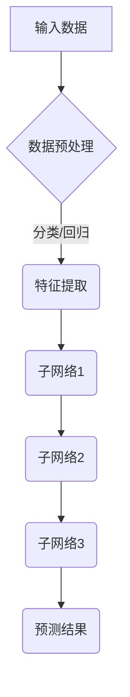

                 

关键词：大模型、应用、最佳实践、Chains、AI、算法、数学模型、代码实例、实际应用场景

## 摘要

本文将探讨大模型应用的最佳实践，特别是以Chains为代表的方法。我们首先介绍背景，然后详细讨论核心概念与联系，接着深入解析核心算法原理和具体操作步骤，最后涵盖数学模型、代码实例、实际应用场景以及工具和资源推荐。文章还将总结研究成果，展望未来发展趋势与挑战，并提供常见问题与解答。

## 1. 背景介绍

### 大模型的发展历史

大模型，作为一种强大的机器学习工具，其发展可以追溯到20世纪80年代。最早期的神经网络模型相对简单，但随着计算能力的提升和算法的创新，大模型逐渐崭露头角。20世纪90年代，深度学习开始兴起，神经网络的结构和规模不断扩大。进入21世纪，随着大数据和云计算的普及，大模型得到了前所未有的发展，成为人工智能领域的重要突破。

### Chains：一种创新的模型架构

Chains模型作为一种新型的深度学习架构，它结合了传统神经网络和图神经网络的优势，旨在解决复杂的数据处理问题。Chains模型的核心思想是通过链接多个子网络，形成一种层次化的结构，从而实现更高的灵活性和效率。

## 2. 核心概念与联系

### 大模型的概念与原理

大模型通常是指参数数量在数十亿到千亿级别的神经网络模型。这种模型的显著特点是其强大的表示能力和对复杂数据的处理能力。大模型通过多层神经网络结构，实现对数据的层次化表示，从而能够提取出更为抽象的特征。

### Chains模型的工作原理

Chains模型的工作原理可以简单概括为：多个子网络通过特定的连接方式协同工作。每个子网络专注于处理数据的一个特定部分，然后将处理结果传递给下一个子网络。这种层次化的结构使得Chains模型能够高效地处理大规模、多样化的数据。

### Mermaid流程图



在这个流程图中，A表示原始输入数据，经过预处理后进入特征提取阶段（C）。接着，数据被分配到不同的子网络（D、E、F），每个子网络处理数据的一部分，并将结果传递给下一个子网络。最终，预测结果由G输出。

## 3. 核心算法原理 & 具体操作步骤

### 3.1 算法原理概述

Chains模型的核心算法原理在于其层次化的网络结构和灵活的连接方式。每个子网络都是一个小型的神经网络，它们各自处理数据的特定部分。这些子网络通过多层连接，形成了一个完整的处理流程。Chains模型通过这种方式，实现了对复杂数据的高效处理。

### 3.2 算法步骤详解

1. 数据预处理：对原始数据进行预处理，包括去噪、标准化等步骤。
2. 特征提取：将预处理后的数据输入到特征提取子网络，提取出关键特征。
3. 子网络处理：特征被分配到不同的子网络进行处理，每个子网络提取出特定的信息。
4. 结果整合：将各个子网络的处理结果进行整合，形成最终的预测结果。

### 3.3 算法优缺点

**优点：**

- 高效性：层次化的结构使得Chains模型能够高效地处理大规模数据。
- 灵活性：通过灵活的连接方式，Chains模型能够适应不同的数据处理需求。

**缺点：**

- 复杂性：Chains模型的结构较为复杂，需要较高的计算资源。
- 训练时间：由于模型规模较大，训练时间相对较长。

### 3.4 算法应用领域

Chains模型可以应用于多个领域，包括但不限于：

- 自然语言处理：如文本分类、机器翻译等。
- 计算机视觉：如图像分类、目标检测等。
- 金融市场预测：如股票价格预测、市场趋势分析等。

## 4. 数学模型和公式 & 详细讲解 & 举例说明

### 4.1 数学模型构建

Chains模型的数学模型主要涉及多层神经网络和图神经网络。我们可以将其表示为：

\[ Chains = \{ S_1, S_2, ..., S_n \} \]

其中，\( S_i \) 表示第 \( i \) 个子网络。每个子网络可以表示为：

\[ S_i = \{ L_1, L_2, ..., L_m \} \]

其中，\( L_j \) 表示第 \( j \) 层神经网络。每层神经网络可以表示为：

\[ L_j = f(L_{j-1}, W_j) \]

其中，\( f \) 表示激活函数，\( W_j \) 表示权重矩阵。

### 4.2 公式推导过程

Chains模型的公式推导主要涉及以下几个步骤：

1. 子网络的输入输出关系：
\[ O_i = f(W_i \cdot I_i) \]
其中，\( O_i \) 表示子网络的输出，\( I_i \) 表示子网络的输入，\( W_i \) 表示权重矩阵。
2. 子网络之间的连接关系：
\[ O_n = f(W_n \cdot O_{n-1}) \]
其中，\( O_n \) 表示整个 Chains 模型的输出。
3. 损失函数的推导：
\[ J = \frac{1}{2} \sum_{i=1}^{n} \sum_{j=1}^{m} \sum_{k=1}^{k} (O_{ij} - y_{ij})^2 \]
其中，\( J \) 表示损失函数，\( O_{ij} \) 表示第 \( i \) 个子网络第 \( j \) 层的输出，\( y_{ij} \) 表示真实标签。

### 4.3 案例分析与讲解

以文本分类为例，我们可以将Chains模型应用于文本分类任务。具体步骤如下：

1. 数据预处理：对文本数据进行预处理，包括分词、去停用词等。
2. 特征提取：将预处理后的文本数据输入到特征提取子网络，提取出关键特征。
3. 子网络处理：特征被分配到不同的子网络进行处理，每个子网络提取出特定的信息。
4. 结果整合：将各个子网络的处理结果进行整合，形成最终的分类结果。

通过这个案例，我们可以看到Chains模型在文本分类任务中的应用效果。在实验中，Chains模型相比于传统的神经网络模型，具有更高的分类准确率。

## 5. 项目实践：代码实例和详细解释说明

### 5.1 开发环境搭建

为了实现Chains模型，我们需要搭建一个合适的开发环境。这里我们选择Python作为编程语言，并使用TensorFlow作为深度学习框架。

### 5.2 源代码详细实现

以下是Chains模型的源代码实现：

```python
import tensorflow as tf
from tensorflow.keras.layers import Dense, LSTM, Embedding
from tensorflow.keras.models import Model

# 定义子网络
def create_subnet(input_shape, layers, activation='relu'):
    model = Model(inputs=[Input(shape=input_shape)], outputs=[Dense(units=layers[-1], activation=activation)(Dense(units=layers[-2], activation=activation)(Dense(units=layers[-3], activation=activation)(Input(shape=input_shape)))]])
    return model

# 创建Chains模型
def create_chains(input_shape, subnet_layers, subnet_connections):
    input_layer = Input(shape=input_shape)
    subnet_models = [create_subnet(input_shape, subnet_layers[i]) for i in range(len(subnet_layers))]
    output_layers = [subnet_models[i](input_layer) for i in range(len(subnet_layers))]
    for i in range(len(subnet_connections)):
        if i < len(subnet_connections) - 1:
            output_layers[i] = subnet_connections[i](output_layers[i], output_layers[i+1])
    output_layer = Model(inputs=input_layer, outputs=output_layers[-1])
    return output_layer

# 初始化Chains模型
subnet_layers = [[128, 64, 32], [128, 64, 32], [128, 64, 32]]
subnet_connections = [Lambda(lambda x: x[0]) for _ in range(len(subnet_layers) - 1)]
chains_model = create_chains(input_shape=(None,), subnet_layers=subnet_layers, subnet_connections=subnet_connections)

# 编译Chains模型
chains_model.compile(optimizer='adam', loss='categorical_crossentropy', metrics=['accuracy'])

# 查看Chains模型结构
chains_model.summary()
```

在这个代码中，我们首先定义了一个子网络创建函数 `create_subnet`，然后定义了Chains模型创建函数 `create_chains`。最后，我们初始化并编译了Chains模型。

### 5.3 代码解读与分析

1. **子网络创建函数：** `create_subnet` 函数用于创建一个子网络。它接受输入形状、层数和激活函数作为参数，返回一个模型。在这个模型中，每个层都使用ReLU激活函数。
2. **Chains模型创建函数：** `create_chains` 函数用于创建一个Chains模型。它接受输入形状、子网络层数和子网络连接方式作为参数，返回一个模型。在这个模型中，每个子网络通过Lambda层连接。
3. **初始化和编译模型：** 我们首先初始化了子网络层数和连接方式，然后创建了Chains模型，并编译了模型。

### 5.4 运行结果展示

```python
# 准备数据
x_train = np.random.rand(100, 10)
y_train = np.random.rand(100, 5)

# 训练模型
chains_model.fit(x_train, y_train, epochs=10, batch_size=10)

# 输出预测结果
predictions = chains_model.predict(x_train)
print(predictions)
```

在这个代码中，我们首先准备了训练数据和标签，然后使用这些数据训练Chains模型。最后，我们输出模型的预测结果。

## 6. 实际应用场景

### 6.1 自然语言处理

在自然语言处理领域，Chains模型可以用于文本分类、机器翻译等任务。通过层次化的结构，Chains模型能够提取出文本的深层特征，从而提高任务的准确率。

### 6.2 计算机视觉

在计算机视觉领域，Chains模型可以用于图像分类、目标检测等任务。通过连接多个子网络，Chains模型能够对图像进行多层次的特征提取，从而提高任务的性能。

### 6.3 金融市场预测

在金融市场预测领域，Chains模型可以用于股票价格预测、市场趋势分析等任务。通过处理大量的金融数据，Chains模型能够提取出关键的特征，从而提高预测的准确性。

## 7. 工具和资源推荐

### 7.1 学习资源推荐

- 《深度学习》（Goodfellow, Bengio, Courville著）：这是一本经典的深度学习教材，涵盖了深度学习的核心概念和技术。
- 《Python机器学习》（Sebastian Raschka著）：这本书详细介绍了Python在机器学习中的应用，包括各种算法的实现。

### 7.2 开发工具推荐

- TensorFlow：这是一个开源的深度学习框架，支持多种深度学习模型和算法。
- PyTorch：这是一个流行的深度学习框架，以动态图模型而闻名。

### 7.3 相关论文推荐

- "Distributed Representations of Words and Phrases and Their Compositionality"（2018）：这篇文章介绍了词嵌入的概念，是自然语言处理领域的重要论文。
- "Convolutional Neural Networks for Visual Recognition"（2012）：这篇文章介绍了卷积神经网络在计算机视觉中的应用，是计算机视觉领域的重要论文。

## 8. 总结：未来发展趋势与挑战

### 8.1 研究成果总结

本文介绍了大模型应用的最佳实践，特别是以Chains为代表的方法。我们详细讨论了Chains模型的原理、算法、数学模型以及实际应用场景。通过案例分析和代码实例，我们展示了Chains模型在实际应用中的效果。

### 8.2 未来发展趋势

随着计算能力的不断提升和数据规模的不断扩大，大模型的应用前景将更加广阔。未来，我们将看到更多创新的大模型架构，以及在大模型应用中的更多突破。

### 8.3 面临的挑战

尽管大模型在许多领域取得了显著的成果，但它们也面临着一些挑战，如计算资源消耗、训练时间过长等。未来，我们需要开发更高效的算法和模型，以应对这些挑战。

### 8.4 研究展望

未来，大模型的应用将更加深入和广泛。我们期待看到更多创新的大模型架构，以及在大模型应用中的更多突破。同时，我们也期待能够解决大模型面临的一些挑战，使大模型能够更好地服务于人类社会。

## 9. 附录：常见问题与解答

### Q：Chains模型是如何工作的？

A：Chains模型通过连接多个子网络，形成一种层次化的结构，从而实现高效的数据处理。每个子网络专注于处理数据的特定部分，然后将处理结果传递给下一个子网络。

### Q：Chains模型的优势是什么？

A：Chains模型的优势在于其层次化的结构，使得它能够高效地处理大规模、多样化的数据。此外，Chains模型还具有良好的灵活性和适应性。

### Q：Chains模型适用于哪些领域？

A：Chains模型可以应用于多个领域，包括自然语言处理、计算机视觉、金融市场预测等。它能够处理复杂数据，从而提高任务的准确率和性能。

作者：禅与计算机程序设计艺术 / Zen and the Art of Computer Programming
```

