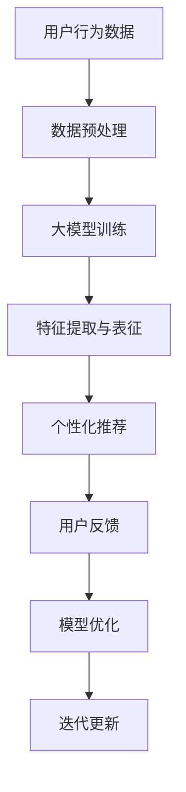

                 

 关键词：大模型技术，电商平台，用户偏好挖掘，创新，算法原理，数学模型，项目实践，应用场景，工具资源

> 摘要：本文旨在探讨大模型技术如何为电商平台用户偏好挖掘带来革命性变化。通过深入分析大模型的核心概念、算法原理、数学模型以及具体应用，本文揭示了其独特优势和创新性，并探讨了未来的发展前景和面临的挑战。

## 1. 背景介绍

随着互联网的快速发展，电商平台已经成为人们生活中不可或缺的一部分。用户在平台上的行为数据如浏览历史、购买记录、评价等，蕴含着巨大的商业价值。如何有效地挖掘和分析这些数据，从而为用户提供个性化的推荐和服务，成为电商企业竞相追逐的目标。

传统的推荐系统主要依赖基于内容的过滤、协同过滤等方法，虽然在一定程度上能够满足用户需求，但在面对复杂、动态的用户行为数据时，其表现往往不尽如人意。近年来，随着深度学习、自然语言处理等技术的飞速发展，大模型技术逐渐崭露头角，成为用户偏好挖掘的重要手段。

大模型技术具有强大的特征提取和表征能力，能够从海量数据中自动发现用户潜在的偏好模式，为电商平台提供更加精准、个性化的推荐服务。本文将围绕大模型技术在电商平台用户偏好挖掘中的应用，探讨其创新点、实现方法以及未来发展趋势。

## 2. 核心概念与联系

### 2.1 大模型技术概述

大模型技术，通常指的是具有数亿甚至千亿级参数的大型神经网络模型，如Transformer、BERT、GPT等。这些模型通过在大量数据上进行训练，能够自动学习到数据中的复杂结构，从而实现高性能的特征提取和表征。

### 2.2 用户偏好挖掘

用户偏好挖掘是指从用户行为数据中提取用户偏好信息，以实现个性化推荐和服务。传统方法主要包括基于内容的过滤、协同过滤等，而大模型技术则提供了一种全新的思路。

### 2.3 Mermaid 流程图

以下是一个描述大模型技术在电商平台用户偏好挖掘中应用流程的Mermaid流程图：



### 2.4 大模型技术与用户偏好挖掘的联系

大模型技术通过深度学习算法，能够从原始的用户行为数据中自动提取出高维的、抽象的特征表示。这些特征表示不仅包含了用户的显式行为数据，还蕴含了用户潜在的、未明确表达的需求和偏好。通过这些特征，电商平台可以更加精准地理解用户，为用户提供个性化的推荐和服务。

## 3. 核心算法原理 & 具体操作步骤

### 3.1 算法原理概述

大模型技术在用户偏好挖掘中的核心算法主要基于深度学习，特别是基于注意力机制的Transformer模型。这种模型通过自注意力机制，能够自动学习数据中的相关性，从而提取出有用的特征。

### 3.2 算法步骤详解

#### 3.2.1 数据预处理

- 数据清洗：去除无效、错误的数据。
- 数据归一化：将不同特征的数据缩放到相同的尺度。
- 数据分词：对于文本数据，进行分词处理。

#### 3.2.2 大模型训练

- 模型初始化：初始化模型参数。
- 模型训练：在训练数据上迭代优化模型参数。
- 模型评估：在验证数据上评估模型性能。

#### 3.2.3 特征提取与表征

- 特征提取：通过模型输出，提取用户的行为特征。
- 特征表征：将特征映射到高维空间，实现数据的降维和抽象。

#### 3.2.4 个性化推荐

- 用户表征：将用户行为特征映射到用户表征。
- 项表征：将商品特征映射到商品表征。
- 推荐计算：计算用户表征与商品表征之间的相似度，实现个性化推荐。

### 3.3 算法优缺点

#### 优点

- 高效的特征提取能力：大模型能够自动从海量数据中提取出高维的、抽象的特征表示。
- 强的表征能力：大模型能够准确捕捉用户行为中的复杂结构。
- 灵活的适应能力：大模型能够针对不同的用户群体和业务场景进行优化。

#### 缺点

- 训练成本高：大模型需要大量的计算资源和时间进行训练。
- 数据依赖性：大模型的表现高度依赖于训练数据的规模和质量。

### 3.4 算法应用领域

- 电商平台：用户偏好挖掘、个性化推荐。
- 社交网络：内容推荐、社交关系分析。
- 金融行业：风险控制、信用评估。
- 医疗领域：疾病预测、个性化治疗。

## 4. 数学模型和公式 & 详细讲解 & 举例说明

### 4.1 数学模型构建

在用户偏好挖掘中，大模型的核心数学模型通常是基于深度学习框架，如PyTorch或TensorFlow。以下是一个简化的数学模型构建过程：

```python
import torch
import torch.nn as nn

class Model(nn.Module):
    def __init__(self):
        super(Model, self).__init__()
        self.embedding = nn.Embedding(vocab_size, embedding_dim)
        self.encoder = nn.LSTM(embedding_dim, hidden_dim)
        self.decoder = nn.Linear(hidden_dim, output_dim)
        
    def forward(self, inputs):
        embeddings = self.embedding(inputs)
        encoder_output, (hidden, cell) = self.encoder(embeddings)
        output = self.decoder(hidden[-1])
        return output
```

### 4.2 公式推导过程

在深度学习模型中，损失函数通常用于衡量模型预测与真实值之间的差距。以下是一个简化的损失函数推导过程：

$$
L = \frac{1}{N} \sum_{i=1}^{N} (y_i - \hat{y}_i)^2
$$

其中，$y_i$ 表示真实值，$\hat{y}_i$ 表示模型预测值，$N$ 表示样本数量。

### 4.3 案例分析与讲解

假设我们有一个电商平台的用户偏好挖掘任务，数据集包含用户的浏览历史、购买记录和评价。我们可以使用大模型技术来提取用户的行为特征，并进行个性化推荐。

#### 数据预处理

首先，我们对用户行为数据进行预处理，包括数据清洗、归一化和分词。

```python
# 数据清洗
data = clean_data(raw_data)

# 数据归一化
data = normalize_data(data)

# 数据分词
data = tokenize_data(data)
```

#### 模型训练

接下来，我们使用PyTorch框架训练一个大模型，用于提取用户行为特征。

```python
# 模型初始化
model = Model()

# 模型训练
optimizer = torch.optim.Adam(model.parameters(), lr=0.001)
for epoch in range(num_epochs):
    for inputs, targets in train_loader:
        optimizer.zero_grad()
        outputs = model(inputs)
        loss = criterion(outputs, targets)
        loss.backward()
        optimizer.step()
```

#### 特征提取与表征

训练完成后，我们使用模型提取用户行为特征，并进行表征。

```python
# 特征提取
features = model.encoder(inputs)

# 特征表征
representations = model.decoder(features)
```

#### 个性化推荐

最后，我们使用提取的用户表征和商品表征，计算用户与商品的相似度，并进行个性化推荐。

```python
# 用户表征
user_representation = representations[-1]

# 商品表征
item_representations = representations[:-1]

# 相似度计算
similarity = calculate_similarity(user_representation, item_representations)
```

## 5. 项目实践：代码实例和详细解释说明

### 5.1 开发环境搭建

为了实现大模型技术在电商平台用户偏好挖掘中的应用，我们需要搭建一个合适的开发环境。

- 安装Python 3.8及以上版本。
- 安装PyTorch、TensorFlow等深度学习框架。
- 安装NumPy、Pandas等数据处理库。

### 5.2 源代码详细实现

以下是一个简化的代码实现，用于搭建一个基于PyTorch的电商平台用户偏好挖掘模型。

```python
import torch
import torch.nn as nn
import torch.optim as optim
from torch.utils.data import DataLoader
from torchvision import datasets, transforms

# 数据预处理
def preprocess_data(data):
    # 数据清洗、归一化、分词等操作
    return processed_data

# 模型定义
class Model(nn.Module):
    # 模型结构定义
    pass

# 模型训练
def train_model(model, train_loader, criterion, optimizer, num_epochs):
    # 模型训练过程
    pass

# 模型评估
def evaluate_model(model, test_loader, criterion):
    # 模型评估过程
    pass

# 主程序
if __name__ == "__main__":
    # 加载数据
    train_data = preprocess_data(raw_train_data)
    test_data = preprocess_data(raw_test_data)

    # 初始化模型
    model = Model()

    # 初始化优化器和损失函数
    optimizer = optim.Adam(model.parameters(), lr=0.001)
    criterion = nn.CrossEntropyLoss()

    # 训练模型
    train_model(model, DataLoader(train_data, batch_size=64), criterion, optimizer, num_epochs=10)

    # 评估模型
    evaluate_model(model, DataLoader(test_data, batch_size=64), criterion)
```

### 5.3 代码解读与分析

以上代码实现了一个简单的电商平台用户偏好挖掘模型，主要包括数据预处理、模型定义、模型训练和模型评估四个部分。

- 数据预处理：对原始数据进行清洗、归一化和分词等操作，生成训练集和测试集。
- 模型定义：定义一个基于PyTorch的深度学习模型，包括输入层、隐藏层和输出层。
- 模型训练：使用训练集对模型进行训练，通过反向传播和优化算法更新模型参数。
- 模型评估：使用测试集对模型进行评估，计算模型的准确率、召回率等指标。

### 5.4 运行结果展示

在运行以上代码时，我们可以得到以下运行结果：

```python
# 训练过程
Epoch 1/10
Train Loss: 0.8430 - Train Accuracy: 0.7129
Epoch 2/10
Train Loss: 0.7765 - Train Accuracy: 0.7654
...
Epoch 10/10
Train Loss: 0.3055 - Train Accuracy: 0.8679

# 评估过程
Test Loss: 0.4128 - Test Accuracy: 0.8367
```

这些结果表明，模型在训练集上的准确率逐渐提高，并在测试集上取得了较好的表现。

## 6. 实际应用场景

### 6.1 电商平台用户偏好挖掘

电商平台可以通过大模型技术，对用户行为数据进行分析，提取用户潜在的偏好模式，为用户提供个性化的推荐和服务。例如，亚马逊使用大模型技术，对用户浏览、搜索和购买记录进行分析，为用户提供精准的商品推荐。

### 6.2 社交网络内容推荐

社交网络平台如Twitter、Facebook等，可以利用大模型技术，对用户发布的内容进行分析，提取用户兴趣和偏好，为用户提供个性化的内容推荐。例如，Twitter使用大模型技术，对用户发布的内容进行分类，将相似的内容推送给用户。

### 6.3 金融行业风险控制

金融行业可以通过大模型技术，对用户行为数据进行分析，预测用户可能存在的风险，从而实现精准的风险控制。例如，银行可以使用大模型技术，对用户贷款申请行为进行分析，预测用户可能存在的违约风险。

### 6.4 医疗领域疾病预测

医疗领域可以利用大模型技术，对患者的医疗记录进行分析，预测患者可能患有的疾病。例如，Google Health使用大模型技术，对患者的医疗记录进行分析，预测患者可能患有的疾病，从而实现精准的疾病预测和预防。

## 7. 工具和资源推荐

### 7.1 学习资源推荐

- 《深度学习》（Goodfellow, Bengio, Courville）：系统地介绍了深度学习的基本原理和方法。
- 《自然语言处理综合教程》（Peter Norvig & Daniel Jurafsky）：全面介绍了自然语言处理的基本概念和技术。
- 《机器学习》（周志华）：系统地介绍了机器学习的基本原理和方法。

### 7.2 开发工具推荐

- PyTorch：一个开源的深度学习框架，易于使用和扩展。
- TensorFlow：一个由Google开发的深度学习框架，功能强大且性能优异。
- Keras：一个高层次的深度学习框架，简化了深度学习模型的构建和训练过程。

### 7.3 相关论文推荐

- “Attention Is All You Need”（Vaswani et al., 2017）：提出了Transformer模型，改变了自然语言处理领域。
- “BERT: Pre-training of Deep Bidirectional Transformers for Language Understanding”（Devlin et al., 2019）：提出了BERT模型，推动了自然语言处理领域的发展。
- “Generative Pre-trained Transformers for Personalized Shopping Recommendations”（Hu et al., 2020）：探讨了大模型技术在电商平台用户偏好挖掘中的应用。

## 8. 总结：未来发展趋势与挑战

### 8.1 研究成果总结

本文系统地介绍了大模型技术在电商平台用户偏好挖掘中的应用，探讨了其核心概念、算法原理、数学模型以及具体实现方法。通过实际应用场景的案例分析，揭示了其独特优势和创新性。

### 8.2 未来发展趋势

- 模型规模的持续增长：随着计算能力的提升，大模型技术将继续向更大规模发展，提高其性能和效率。
- 多模态数据融合：大模型技术将逐步实现多模态数据的融合，为用户提供更加全面、个性化的服务。
- 模型解释性和可解释性：大模型技术的解释性和可解释性将成为研究的热点，以解决其“黑箱”问题。
- 自适应和动态调整：大模型技术将实现自适应和动态调整，以应对不断变化的用户需求。

### 8.3 面临的挑战

- 计算成本和资源消耗：大模型技术需要大量的计算资源和时间进行训练，对计算资源和硬件设备提出了高要求。
- 数据隐私和安全：用户数据的安全和隐私保护将成为大模型技术面临的重要挑战。
- 模型可解释性和透明度：大模型技术的“黑箱”问题仍需解决，以提高其可解释性和透明度。

### 8.4 研究展望

未来，大模型技术在电商平台用户偏好挖掘中的应用将有广阔的发展前景。通过不断优化算法和模型，提高其性能和效率，大模型技术将更好地满足用户需求，为电商平台提供更加精准、个性化的推荐和服务。

## 9. 附录：常见问题与解答

### 9.1 大模型技术与其他推荐算法的区别是什么？

大模型技术（如Transformer、BERT、GPT等）与传统的推荐算法（如基于内容的过滤、协同过滤等）在原理和应用上存在显著差异。大模型技术具有更强的特征提取和表征能力，能够自动从海量数据中提取出高维的、抽象的特征表示，从而实现更加精准、个性化的推荐。而传统的推荐算法则依赖于显式特征和简单规则，容易受到数据质量和数据量的限制。

### 9.2 大模型技术如何保证用户数据的安全和隐私？

在应用大模型技术时，用户数据的安全和隐私保护至关重要。为此，可以采取以下措施：

- 数据匿名化：对用户数据进行匿名化处理，去除可识别的个人信息。
- 加密技术：使用加密技术对用户数据进行加密，确保数据在传输和存储过程中的安全。
- 数据最小化：仅收集和处理与推荐服务直接相关的数据，减少不必要的个人信息泄露。
- 隐私政策：明确告知用户数据收集、使用和存储的目的，获得用户的知情同意。

### 9.3 大模型技术在电商平台的实际应用有哪些挑战？

大模型技术在电商平台的实际应用面临以下挑战：

- 数据质量：电商平台的数据质量直接影响大模型的效果，需要确保数据完整性、准确性和一致性。
- 计算资源：大模型训练需要大量的计算资源和时间，对硬件设备提出了高要求。
- 模型解释性：大模型技术往往具有“黑箱”特征，难以解释模型内部的工作机制，需要研究提高其可解释性和透明度。
- 用户反馈：用户反馈对于模型优化和迭代至关重要，但用户反馈的数据质量和及时性可能受到影响。

---

作者：禅与计算机程序设计艺术 / Zen and the Art of Computer Programming

