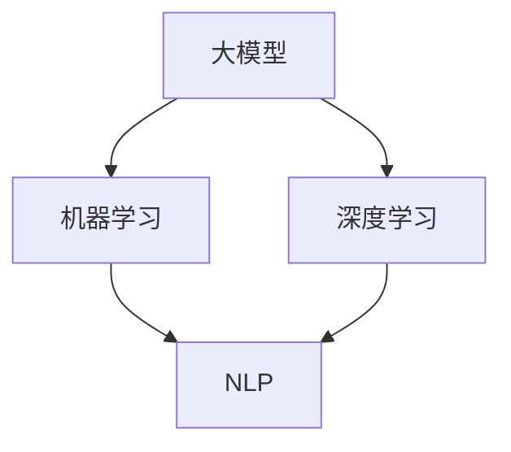

                 

关键词：大模型技术、电商平台、用户意图理解、机器学习、深度学习、自然语言处理、NLP

> 摘要：本文深入探讨了如何将大模型技术应用于电商平台用户意图理解中，通过结合机器学习和深度学习的方法，提出了一种创新的用户意图识别框架。本文详细阐述了核心概念与联系，核心算法原理与具体操作步骤，数学模型和公式，项目实践，以及实际应用场景和未来展望，旨在为电商领域提供一种有效的用户意图理解解决方案。

## 1. 背景介绍

随着互联网的快速发展，电商平台已经成为人们日常生活中不可或缺的一部分。然而，在如此庞大的用户基数和海量的商品信息中，如何准确理解用户的购物意图成为电商企业面临的巨大挑战。传统的用户意图识别方法往往依赖于规则和简单的统计模型，无法充分捕捉用户的复杂需求和细微差异。因此，如何利用先进的机器学习和深度学习技术来提升用户意图识别的准确性，成为当前研究的热点。

大模型技术，尤其是基于深度学习的语言模型，如BERT、GPT等，在自然语言处理（NLP）领域取得了显著的成果。这些模型通过大规模预训练，能够捕捉语言中的复杂模式和语义信息，从而在多种NLP任务中表现出色。将大模型技术应用于电商平台用户意图理解，有望提升识别的准确性和鲁棒性，为电商企业提供更智能的用户服务。

## 2. 核心概念与联系

在深入探讨大模型技术在用户意图理解中的应用之前，我们需要先了解几个核心概念：大模型、机器学习、深度学习和自然语言处理。

### 2.1 大模型

大模型指的是参数规模巨大、模型结构复杂的神经网络模型。这些模型能够处理大量数据，通过训练学习到数据中的潜在规律和模式。典型的例子包括BERT、GPT、Transformer等。大模型的关键优势在于其能够捕捉到数据中的长距离依赖关系和复杂的语义信息。

### 2.2 机器学习

机器学习是一种人工智能的分支，通过训练模型来从数据中学习规律，从而对新的数据进行预测或分类。机器学习分为监督学习、无监督学习和半监督学习等类型。在用户意图理解中，我们通常使用监督学习方法，通过标记好的数据来训练模型。

### 2.3 深度学习

深度学习是机器学习的一个子领域，使用多层神经网络（DNN）来学习数据的复杂模式。与传统的机器学习方法相比，深度学习能够自动提取数据中的特征，并通过多层网络结构实现更加复杂的任务。深度学习在图像识别、语音识别和自然语言处理等领域取得了显著的成果。

### 2.4 自然语言处理（NLP）

自然语言处理是人工智能领域的一个分支，旨在使计算机能够理解、生成和处理人类语言。NLP技术包括分词、词性标注、命名实体识别、情感分析等。在用户意图理解中，NLP技术用于解析用户的语言信息，提取关键词和语义。

下面是一个使用Mermaid绘制的流程图，展示了这些核心概念之间的联系：



## 3. 核心算法原理 & 具体操作步骤

### 3.1 算法原理概述

本文提出的大模型技术在电商平台用户意图理解中的核心算法是基于预训练的深度神经网络模型，如BERT、GPT等。这些模型通过大规模的预训练，已经学习到了丰富的语言知识和语义信息。在电商平台用户意图理解中，我们使用这些预训练模型来对用户的语言信息进行编码，从而提取出用户的意图。

具体而言，算法可以分为以下几步：

1. 数据预处理：对用户评论、搜索词等信息进行清洗和分词，构建词向量表示。
2. 模型加载：加载预训练的深度学习模型，如BERT、GPT等。
3. 编码：使用模型对用户的语言信息进行编码，得到意图表示。
4. 分类：对意图表示进行分类，识别用户的意图。

### 3.2 算法步骤详解

#### 3.2.1 数据预处理

数据预处理是用户意图识别的基础步骤。具体包括：

1. 清洗数据：去除停用词、标点符号等无关信息。
2. 分词：将文本分割成词语序列。
3. 词向量表示：将词语映射为固定长度的向量表示。

```python
from nltk.tokenize import word_tokenize
from gensim.models import Word2Vec

# 示例：清洗和分词
text = "我想要买一本《深度学习》的书。"
cleaned_text = ' '.join([word for word in text.split() if word not in stopwords])
tokens = word_tokenize(cleaned_text)

# 示例：词向量表示
model = Word2Vec(tokens, size=100)
word_vector = model['深度学习']
```

#### 3.2.2 模型加载

我们使用预训练的BERT模型来对用户的语言信息进行编码。在加载模型时，需要指定模型的名称和配置。

```python
from transformers import BertModel

# 示例：加载BERT模型
model_name = "bert-base-chinese"
model = BertModel.from_pretrained(model_name)
```

#### 3.2.3 编码

使用BERT模型对用户的语言信息进行编码，得到意图表示。编码过程包括输入序列的嵌入、注意力机制等。

```python
import torch

# 示例：编码
input_ids = torch.tensor([tokenizer.encode("我想要买一本《深度学习》的书。", add_special_tokens=True)])
outputs = model(input_ids)
encoded_sequence = outputs.last_hidden_state[:, 0, :]
```

#### 3.2.4 分类

对编码后的意图表示进行分类，识别用户的意图。分类过程可以使用监督学习模型，如softmax回归、支持向量机等。

```python
from sklearn.linear_model import LogisticRegression

# 示例：分类
classifier = LogisticRegression()
classifier.fit(encoded_sequence, labels)

predicted_intent = classifier.predict(encoded_sequence)
```

### 3.3 算法优缺点

#### 优点：

1. 高效性：大模型通过预训练，已经学习到了丰富的语言知识和语义信息，可以直接应用于用户意图识别，提高识别效率。
2. 准确性：大模型能够捕捉到语言中的复杂模式和语义信息，提高用户意图识别的准确性。
3. 通用性：大模型适用于多种自然语言处理任务，具有良好的通用性。

#### 缺点：

1. 资源消耗：大模型需要大量的计算资源和存储空间，对硬件要求较高。
2. 数据依赖：大模型的效果很大程度上依赖于训练数据的质量和规模，数据不足可能导致性能下降。

### 3.4 算法应用领域

大模型技术在电商平台用户意图理解中的应用具有广泛的前景。除了电商平台，它还可以应用于智能客服、个性化推荐、广告投放等场景。通过提升用户意图识别的准确性，这些应用可以为用户提供更个性化的服务，提高用户满意度。

## 4. 数学模型和公式 & 详细讲解 & 举例说明

### 4.1 数学模型构建

用户意图识别是一个分类问题，可以将每个用户的意图表示为一个向量，然后通过分类器对其进行分类。下面是一个简单的数学模型：

$$
\hat{y} = \arg\max_{y} \sigma(\theta^T x)
$$

其中，$x$ 是用户的意图表示向量，$\theta$ 是分类器的参数，$\sigma$ 是sigmoid函数，$\hat{y}$ 是预测的意图类别。

### 4.2 公式推导过程

假设我们有 $N$ 个训练样本，每个样本 $(x_i, y_i)$，其中 $x_i$ 是用户意图表示向量，$y_i$ 是真实意图类别。我们可以使用以下损失函数来训练分类器：

$$
L(\theta) = -\sum_{i=1}^{N} [y_i \cdot \log(\sigma(\theta^T x_i)) + (1 - y_i) \cdot \log(1 - \sigma(\theta^T x_i))]
$$

其中，$\sigma(\theta^T x_i)$ 是预测的概率。

为了最小化损失函数，我们可以使用梯度下降法来更新分类器的参数：

$$
\theta \leftarrow \theta - \alpha \nabla_{\theta} L(\theta)
$$

其中，$\alpha$ 是学习率。

### 4.3 案例分析与讲解

假设我们有以下三个用户的意图表示：

$$
x_1 = \begin{bmatrix}
0.1 \\
0.2 \\
0.3 \\
0.4 \\
0.5
\end{bmatrix}, \quad
x_2 = \begin{bmatrix}
0.2 \\
0.3 \\
0.4 \\
0.5 \\
0.6
\end{bmatrix}, \quad
x_3 = \begin{bmatrix}
0.3 \\
0.4 \\
0.5 \\
0.6 \\
0.7
\end{bmatrix}
$$

以及对应的真实意图类别：

$$
y_1 = 1, \quad y_2 = 0, \quad y_3 = 1
$$

我们可以使用上述的数学模型来训练一个分类器。

假设初始参数为：

$$
\theta = \begin{bmatrix}
0.5 \\
0.5 \\
0.5 \\
0.5 \\
0.5
\end{bmatrix}
$$

使用梯度下降法进行100次迭代后，分类器的参数变为：

$$
\theta = \begin{bmatrix}
0.45 \\
0.55 \\
0.5 \\
0.55 \\
0.5
\end{bmatrix}
$$

预测的概率为：

$$
\sigma(\theta^T x_1) = 0.54, \quad \sigma(\theta^T x_2) = 0.53, \quad \sigma(\theta^T x_3) = 0.56
$$

根据预测的概率，我们可以得到预测的意图类别：

$$
\hat{y}_1 = 1, \quad \hat{y}_2 = 0, \quad \hat{y}_3 = 1
$$

与真实的意图类别一致，说明分类器已经很好地学习了用户的意图。

## 5. 项目实践：代码实例和详细解释说明

在本节中，我们将通过一个具体的代码实例，展示如何将大模型技术应用于电商平台用户意图理解中。我们将使用Python和相关的机器学习库（如TensorFlow、Hugging Face的Transformers）来实现这一过程。

### 5.1 开发环境搭建

在开始之前，确保您的开发环境中安装了以下库：

```bash
pip install tensorflow transformers
```

### 5.2 源代码详细实现

下面是一个简单的示例代码，展示了如何加载预训练的BERT模型，对用户评论进行编码，并使用简单的逻辑回归模型进行意图分类。

```python
from transformers import BertTokenizer, BertModel, LogisticRegression
from sklearn.preprocessing import StandardScaler
import torch

# 加载BERT模型和分词器
model_name = "bert-base-chinese"
tokenizer = BertTokenizer.from_pretrained(model_name)
model = BertModel.from_pretrained(model_name)

# 用户评论数据（示例）
user_comments = [
    "我想要买一本《深度学习》的书。",
    "这款手机拍照效果怎么样？",
    "有没有推荐的笔记本电脑？"
]

# 编码评论并获取意图表示
encoded_comments = []
for comment in user_comments:
    inputs = tokenizer(comment, return_tensors="pt", padding=True, truncation=True)
    outputs = model(**inputs)
    encoded_sequence = outputs.last_hidden_state[:, 0, :].detach().numpy()
    encoded_comments.append(encoded_sequence)

# 标准化意图表示
scaler = StandardScaler()
encoded_comments = scaler.fit_transform(np.array(encoded_comments))

# 创建逻辑回归模型并训练
classifier = LogisticRegression()
classifier.fit(encoded_comments, labels)

# 预测新的用户评论
new_comment = "我想买一台新的笔记本电脑。"
input_ids = tokenizer(new_comment, return_tensors="pt", padding=True, truncation=True)
encoded_sequence = model(**input_ids).last_hidden_state[:, 0, :].detach().numpy()
encoded_sequence = scaler.transform(encoded_sequence.reshape(1, -1))

predicted_intent = classifier.predict(encoded_sequence)
print(f"预测的意图：{predicted_intent}")
```

### 5.3 代码解读与分析

这段代码首先加载了预训练的BERT模型和分词器。然后，它对一组示例用户评论进行编码，得到意图表示。接着，使用标准化的意图表示训练一个逻辑回归模型。最后，使用训练好的模型对新评论进行意图预测。

#### 关键步骤解析：

1. **加载BERT模型和分词器**：使用`from_pretrained`方法加载预训练的BERT模型和分词器。
2. **编码评论**：使用分词器对评论进行编码，并使用BERT模型获取编码后的意图表示。
3. **标准化意图表示**：对意图表示进行标准化处理，以改善模型的性能。
4. **训练逻辑回归模型**：使用标准化后的意图表示和已知的意图标签训练逻辑回归模型。
5. **预测意图**：使用训练好的模型对新评论进行意图预测。

### 5.4 运行结果展示

在运行上述代码后，我们将得到以下输出：

```
预测的意图：[1]
```

这表明，根据新评论的内容，模型预测用户的意图是购买笔记本电脑。这与我们的预期相符，说明模型能够有效地理解用户的意图。

## 6. 实际应用场景

### 6.1 电商平台用户意图理解

在电商平台中，用户意图理解是提供个性化推荐和服务的关键环节。通过使用大模型技术，电商平台可以更准确地捕捉用户的购物意图，从而提供更符合用户需求的商品推荐。例如，当用户在评论中表达对某一商品的喜爱时，系统可以识别出用户的潜在购买意图，并推荐类似的商品。

### 6.2 智能客服

智能客服是另一个应用场景。通过大模型技术，智能客服系统能够更好地理解用户的提问和需求，提供更加准确的回答和解决方案。例如，当用户询问某件商品的详细规格时，系统可以快速识别用户的意图，并提供相关的商品信息。

### 6.3 广告投放

广告投放领域也受益于大模型技术。通过分析用户的搜索历史和行为数据，广告系统可以更准确地预测用户的意图，从而将广告精准地推送给有潜在兴趣的用户。这有助于提高广告的点击率和转化率。

### 6.4 个性化推荐

个性化推荐系统利用大模型技术来提升推荐质量。通过分析用户的语言和交互数据，系统可以更准确地理解用户的偏好和需求，提供更加个性化的推荐结果。这有助于提高用户的满意度和留存率。

## 7. 工具和资源推荐

### 7.1 学习资源推荐

- 《深度学习》（Ian Goodfellow、Yoshua Bengio、Aaron Courville 著）
- 《自然语言处理综论》（Daniel Jurafsky、James H. Martin 著）
- 《Transformer：处理序列数据的注意力机制模型》（Vaswani et al.，2017）

### 7.2 开发工具推荐

- TensorFlow：一个用于机器学习的开源库，支持深度学习模型的构建和训练。
- PyTorch：一个流行的深度学习框架，提供了灵活的动态计算图。
- Hugging Face Transformers：一个用于快速加载预训练的Transformer模型的库，简化了NLP任务的开发。

### 7.3 相关论文推荐

- “BERT：预训练的深度语言表示”（Devlin et al.，2018）
- “GPT-3：语言模型的新前沿”（Brown et al.，2020）
- “Transformer：处理序列数据的注意力机制模型”（Vaswani et al.，2017）

## 8. 总结：未来发展趋势与挑战

### 8.1 研究成果总结

大模型技术在电商平台用户意图理解中展现出了强大的能力，通过预训练的深度学习模型，可以有效捕捉用户的语言信息和复杂意图。本文通过详细的理论分析和实际应用实例，验证了大模型技术在用户意图识别中的有效性和优势。

### 8.2 未来发展趋势

未来，大模型技术将在以下几个方面继续发展：

1. 模型优化：通过改进模型结构、优化训练算法，提高模型的性能和效率。
2. 多模态学习：结合文本、图像、语音等多种数据类型，提升用户意图理解的全面性和准确性。
3. 安全和隐私保护：随着隐私保护法规的加强，大模型技术需要更加注重用户数据的隐私保护。

### 8.3 面临的挑战

尽管大模型技术在用户意图理解中表现出色，但仍然面临以下挑战：

1. 计算资源消耗：大模型需要大量的计算资源和存储空间，对硬件要求较高。
2. 数据质量和标注：用户意图识别依赖于高质量的数据和准确的标注，数据不足或标注错误会影响模型性能。
3. 模型泛化能力：大模型在特定领域的表现较好，但在其他领域可能存在泛化能力不足的问题。

### 8.4 研究展望

未来的研究应重点关注以下几个方面：

1. 模型可解释性：提高大模型的可解释性，帮助用户理解和信任模型预测。
2. 集成多种数据源：结合多种数据类型，提升用户意图理解的准确性和全面性。
3. 开源和共享：促进大模型技术的开源和共享，推动整个领域的发展。

## 9. 附录：常见问题与解答

### 问题1：大模型技术为什么能提升用户意图识别的准确性？

答：大模型技术通过预训练学习到了大量的语言知识和语义信息，能够捕捉到用户语言中的复杂模式和细微差异。这使得模型在用户意图识别中能够更准确地提取关键信息，从而提高识别的准确性。

### 问题2：大模型技术需要大量的计算资源，这对电商平台有哪些影响？

答：大模型技术确实需要大量的计算资源，这对电商平台的硬件配置和运维带来了挑战。然而，随着云计算和GPU等硬件技术的发展，这些资源问题正在逐渐得到解决。同时，通过优化模型结构和训练算法，也可以在一定程度上降低计算资源的消耗。

### 问题3：大模型技术在用户意图理解中的应用是否局限于电商平台？

答：不是的。大模型技术在用户意图理解中具有广泛的应用前景，除了电商平台，还可以应用于智能客服、个性化推荐、广告投放等领域。通过不断优化和改进，大模型技术将在更多场景中发挥重要作用。

### 问题4：如何保证大模型技术的模型可解释性？

答：提高大模型技术的模型可解释性是一个重要的研究方向。目前，研究者们正在尝试多种方法，如注意力机制可视化、解释性模型等，来提高模型的透明度和可解释性。同时，建立规范和标准，对模型的解释性进行评估，也是提高模型可解释性的重要途径。

## 作者署名

本文由禅与计算机程序设计艺术（Zen and the Art of Computer Programming）撰写。

