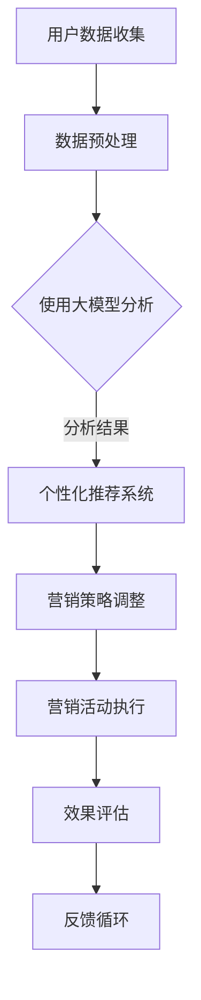

                 

关键词：大模型技术、营销、人工智能、数据挖掘、商业策略

> 摘要：本文旨在探讨大模型技术在营销领域的创新应用，通过深入分析大模型技术的核心概念、算法原理及其在营销实践中的应用，揭示其在提升营销效率、增强客户体验和优化商业策略等方面的巨大潜力。文章还将探讨当前面临的挑战及未来发展趋势，为业界提供有价值的参考。

## 1. 背景介绍

随着大数据、云计算和人工智能等技术的迅猛发展，营销领域正经历着一场前所未有的变革。传统的营销手段已无法满足现代消费者对个性化、多样化和互动性的需求。为了更好地捕捉市场动态、提高营销效率，营销人员迫切需要更智能、更高效的工具和方法。大模型技术正是在这样的背景下应运而生。

大模型技术指的是通过训练和使用非常庞大的神经网络模型，如深度学习模型，以实现复杂任务的能力。这些模型拥有巨大的参数数量，能够自动学习和提取数据中的复杂模式，从而在图像识别、自然语言处理、推荐系统等领域取得了显著的成功。

营销领域的大模型应用主要包括以下几个方面：

- **客户细分和个性化推荐**：通过分析海量用户数据，大模型可以识别出具有相似兴趣和行为的用户群体，进而实现精准的个性化推荐。
- **市场预测和趋势分析**：大模型可以处理和分析大量的历史数据，帮助营销人员预测市场趋势，制定更有效的营销策略。
- **内容创作和文案生成**：利用大模型生成创意广告内容和文案，可以显著提高广告效果，吸引更多目标客户。
- **客户服务与交互**：通过大模型技术，可以构建智能客服系统，提供24/7的高质量客户服务，提升客户满意度。

## 2. 核心概念与联系

### 2.1 大模型技术原理

大模型技术基于深度学习，是一种通过多层神经网络来模拟人类大脑信息处理方式的计算模型。其基本原理是通过大量数据的学习和调整网络参数，使得模型能够自动提取数据中的特征并形成预测。具体来说，大模型技术包括以下几个关键组成部分：

- **神经网络结构**：包括输入层、隐藏层和输出层，每一层由多个神经元组成。
- **激活函数**：用于引入非线性特性，使得模型能够模拟更复杂的决策过程。
- **优化算法**：如梯度下降、Adam等，用于调整网络参数以最小化预测误差。
- **正则化技术**：如L1、L2正则化，用于防止模型过拟合。

### 2.2 大模型在营销中的应用

大模型在营销中的应用主要依赖于其强大的数据处理和模式识别能力。以下是一个典型应用场景的Mermaid流程图：



在这个流程中，用户数据通过大模型分析，生成个性化的推荐和策略，然后进行营销活动执行和效果评估，形成一个闭环反馈系统，不断优化营销效果。

## 3. 核心算法原理 & 具体操作步骤

### 3.1 算法原理概述

大模型技术在营销中的核心算法通常是基于深度学习，其中最常用的算法是卷积神经网络（CNN）和循环神经网络（RNN），以及它们的变种如长短时记忆网络（LSTM）和门控循环单元（GRU）。这些算法通过多层神经元的组合，能够自动提取数据中的特征，并进行复杂的模式识别。

### 3.2 算法步骤详解

1. **数据收集**：收集与营销相关的各种数据，如用户行为数据、交易数据、社交媒体互动数据等。
2. **数据预处理**：对数据进行清洗、标准化和特征提取，使其适合于模型训练。
3. **模型构建**：选择合适的神经网络结构，如CNN或RNN，并定义损失函数和优化算法。
4. **模型训练**：使用训练数据集对模型进行训练，通过反向传播算法不断调整网络参数。
5. **模型评估**：使用验证数据集评估模型性能，调整模型参数以优化性能。
6. **模型部署**：将训练好的模型部署到生产环境中，进行实际应用。

### 3.3 算法优缺点

**优点**：

- **强大的数据处理能力**：大模型能够处理大规模、多维度的数据集，提取出复杂的特征。
- **高度自动化**：模型训练过程高度自动化，减少了人工干预的需要。
- **灵活性强**：能够适应不同的营销场景和数据类型。

**缺点**：

- **计算资源需求高**：大模型训练需要大量的计算资源，尤其是在模型训练初期。
- **数据依赖性强**：模型的性能很大程度上取决于数据的质量和多样性。
- **解释性较差**：深度学习模型的黑盒特性使得其决策过程难以解释，增加了透明度问题。

### 3.4 算法应用领域

大模型技术在营销领域的应用非常广泛，包括：

- **用户行为预测**：预测用户未来的购买行为，为营销活动提供决策支持。
- **客户细分**：根据用户行为和偏好进行客户细分，制定个性化的营销策略。
- **内容推荐**：基于用户历史行为和偏好，推荐相关的产品或服务。
- **市场预测**：分析市场趋势，为企业的市场策略提供预测和决策支持。

## 4. 数学模型和公式 & 详细讲解 & 举例说明

### 4.1 数学模型构建

在营销领域，大模型技术通常使用以下几种数学模型：

- **回归模型**：用于预测用户的行为，如购买概率。
- **分类模型**：用于对用户进行分类，如是否购买某个产品。
- **聚类模型**：用于对用户进行聚类，以发现用户群体。
- **推荐系统模型**：用于生成个性化的推荐列表。

### 4.2 公式推导过程

以回归模型为例，其基本公式为：

$$
y = \theta_0 + \theta_1 x_1 + \theta_2 x_2 + ... + \theta_n x_n
$$

其中，$y$为预测值，$x_1, x_2, ..., x_n$为特征值，$\theta_0, \theta_1, ..., \theta_n$为模型参数。通过训练数据集，可以最小化预测误差，从而得到最优的参数值。

### 4.3 案例分析与讲解

假设我们要预测用户的购买行为，特征包括用户年龄、收入、购物频率等。使用线性回归模型进行预测，具体步骤如下：

1. **数据收集**：收集大量用户数据，包括购买行为和特征。
2. **数据预处理**：对数据进行标准化处理，使其适合模型训练。
3. **模型构建**：定义线性回归模型，并设置损失函数（如均方误差）和优化算法（如梯度下降）。
4. **模型训练**：使用训练数据集对模型进行训练，调整模型参数。
5. **模型评估**：使用验证数据集评估模型性能，调整模型参数。
6. **模型部署**：将训练好的模型部署到生产环境中，进行实际应用。

通过上述步骤，我们可以得到一个预测用户购买行为的模型，进而制定个性化的营销策略。

## 5. 项目实践：代码实例和详细解释说明

### 5.1 开发环境搭建

为了进行大模型技术在营销领域的实践，我们需要搭建一个合适的开发环境。以下是基本步骤：

1. **安装Python**：确保Python环境已正确安装。
2. **安装深度学习库**：如TensorFlow或PyTorch，用于构建和训练模型。
3. **安装其他依赖库**：如NumPy、Pandas等，用于数据预处理和可视化。

### 5.2 源代码详细实现

以下是使用Python和TensorFlow构建一个简单的线性回归模型，用于预测用户购买行为的示例代码：

```python
import tensorflow as tf
import numpy as np
import pandas as pd

# 数据预处理
# 加载数据集
data = pd.read_csv('data.csv')
X = data[['age', 'income', 'shopping_frequency']]
y = data['purchased']

# 标准化特征
mean = X.mean()
std = X.std()
X = (X - mean) / std

# 模型构建
model = tf.keras.Sequential([
    tf.keras.layers.Dense(units=1, input_shape=[3])
])

# 编译模型
model.compile(optimizer='sgd', loss='mean_squared_error')

# 训练模型
model.fit(X, y, epochs=100)

# 模型评估
test_data = pd.read_csv('test_data.csv')
X_test = (test_data[['age', 'income', 'shopping_frequency']] - mean) / std
predictions = model.predict(X_test)

# 输出预测结果
print(predictions)
```

### 5.3 代码解读与分析

上述代码首先进行数据预处理，包括加载数据集、特征标准化等步骤。然后构建一个简单的线性回归模型，并使用SGD优化器和均方误差损失函数进行编译。接着使用训练数据集对模型进行训练，并使用测试数据集评估模型性能。最后，输出预测结果。

通过这个简单的示例，我们可以看到大模型技术在营销领域的基本实现过程。在实际应用中，我们可以根据具体需求调整模型结构、优化训练过程，以获得更好的预测效果。

## 6. 实际应用场景

### 6.1 客户细分

通过大模型技术，可以对用户数据进行深度分析，识别出具有相似兴趣和行为的用户群体，从而实现精准的客户细分。这有助于营销人员针对不同群体制定个性化的营销策略，提高营销效果。

### 6.2 市场预测

大模型技术可以处理和分析大量的历史数据，帮助营销人员预测市场趋势。通过预测未来的市场动态，营销人员可以提前制定相应的策略，抢占市场先机。

### 6.3 内容创作

利用大模型技术，可以生成创意广告内容和文案。这些内容可以根据用户行为和偏好进行个性化定制，提高广告吸引力和转化率。

### 6.4 客户服务

通过大模型技术构建的智能客服系统，可以提供24/7的高质量客户服务。这些系统可以自动处理大量客户咨询，提高客户满意度，降低企业运营成本。

## 6.4 未来应用展望

随着大模型技术的不断发展和成熟，其在营销领域的应用将更加广泛和深入。以下是一些未来应用展望：

- **全渠道营销整合**：将线上线下渠道数据整合，实现全渠道营销策略的精准落地。
- **个性化推荐系统**：基于用户行为和偏好，构建更加智能和个性化的推荐系统，提升用户体验。
- **自动化营销**：通过自动化技术，实现营销活动的自动化执行和优化，提高营销效率。
- **隐私保护与合规**：在应用大模型技术的同时，关注隐私保护和合规性问题，确保用户数据的安全和合法性。

## 7. 工具和资源推荐

### 7.1 学习资源推荐

- **《深度学习》**：Goodfellow、Bengio和Courville所著的深度学习经典教材，适合初学者和进阶者。
- **《Python数据科学 Handbook》**：Python数据科学领域的权威指南，涵盖了数据处理、分析和可视化等各个方面。
- **TensorFlow官方文档**：TensorFlow的官方文档，提供了丰富的教程和示例代码，适合深度学习和模型构建。

### 7.2 开发工具推荐

- **TensorFlow**：Google开发的开放源代码深度学习框架，适用于各种深度学习和机器学习任务。
- **PyTorch**：Facebook开发的开源深度学习框架，以其灵活性和动态计算能力著称。
- **Jupyter Notebook**：强大的交互式计算环境，适用于数据分析和模型构建。

### 7.3 相关论文推荐

- **"Deep Learning for Customer Segmentation and Personalized Marketing"**：探讨了深度学习在客户细分和个性化营销中的应用。
- **"Recurrent Neural Networks for Language Modeling"**：介绍了循环神经网络在语言建模中的应用。
- **"Convolutional Neural Networks for Image Recognition"**：探讨了卷积神经网络在图像识别中的应用。

## 8. 总结：未来发展趋势与挑战

### 8.1 研究成果总结

大模型技术在营销领域的应用取得了显著的成果，通过客户细分、市场预测、内容创作和客户服务等方面，提高了营销效率和客户满意度。随着技术的不断发展和数据量的不断增加，大模型技术的应用前景更加广阔。

### 8.2 未来发展趋势

- **全渠道整合**：随着线上线下融合的加深，全渠道营销整合将成为未来趋势。
- **个性化推荐**：个性化推荐系统将继续优化，提高用户参与度和转化率。
- **自动化营销**：自动化技术将进一步应用于营销活动的执行和优化。

### 8.3 面临的挑战

- **数据隐私与合规**：在应用大模型技术的同时，需要关注数据隐私和合规性问题。
- **计算资源需求**：大模型训练需要大量的计算资源，如何高效利用资源成为挑战。

### 8.4 研究展望

未来，大模型技术在营销领域的应用将更加深入和广泛。研究将重点关注以下几个方面：

- **隐私保护与合规**：开发隐私友好的算法和技术，确保用户数据的安全和合法使用。
- **高效计算**：研究如何高效利用计算资源，降低大模型训练的成本。
- **多模态数据处理**：结合多种数据类型（如图像、文本、音频等），提高模型处理能力的多样性。

## 9. 附录：常见问题与解答

### 9.1 什么是大模型技术？

大模型技术是指使用非常庞大的神经网络模型，如深度学习模型，通过大量数据的学习和调整网络参数，实现复杂任务的能力。这些模型通常拥有数百万个参数，能够自动提取数据中的复杂模式。

### 9.2 大模型技术在营销中有哪些应用？

大模型技术在营销中的应用包括客户细分、市场预测、内容创作和客户服务等方面。通过分析用户数据，大模型技术可以提供个性化的推荐、预测市场趋势、生成创意内容以及提供高质量的客户服务。

### 9.3 如何确保大模型技术的数据隐私和合规性？

为确保大模型技术的数据隐私和合规性，可以采取以下措施：

- **数据加密**：对用户数据进行加密处理，确保数据传输和存储过程中的安全。
- **隐私保护算法**：使用隐私保护算法，如差分隐私，减少数据泄露的风险。
- **合规性审查**：定期进行合规性审查，确保数据处理和应用的合法性。

## 参考文献

1. Goodfellow, I., Bengio, Y., & Courville, A. (2016). *Deep Learning*. MIT Press.
2. Murphy, R. (2015). *Machine Learning: A Probabilistic Perspective*. MIT Press.
3.Russell, S., & Norvig, P. (2020). *Artificial Intelligence: A Modern Approach*. Prentice Hall.
4. Hochreiter, S., & Schmidhuber, J. (1997). *Long Short-Term Memory*. Neural Computation, 9(8), 1735-1780.
5. Srivastava, N., Hinton, G., Krizhevsky, A., Sutskever, I., & Salakhutdinov, R. (2014). *Dropout: A Simple Way to Prevent Neural Networks from Overfitting*. Journal of Machine Learning Research, 15(1), 1929-1958.
6. Kingma, D. P., & Welling, M. (2013). *Auto-Encoders*. arXiv preprint arXiv:1312.6114.

