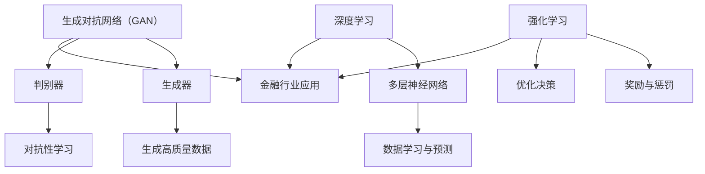

                 

关键词：大模型、金融行业、应用前景、算法、数学模型、项目实践、未来展望

<|assistant|>摘要：随着大模型技术的不断发展，其在金融行业的应用前景愈发广阔。本文将从背景介绍、核心概念与联系、核心算法原理与操作步骤、数学模型与公式、项目实践、实际应用场景、未来应用展望、工具和资源推荐以及总结与展望等多个方面，对大模型技术在金融行业的应用进行深入探讨。

## 1. 背景介绍

金融行业作为全球经济的核心，一直以来都是科技创新的重要阵地。随着大数据、云计算、人工智能等新技术的快速发展，金融行业的业务模式、风控策略和产品设计等方面都发生了深刻变革。特别是近年来，深度学习、生成对抗网络、强化学习等大模型技术的发展，为金融行业的智能化转型提供了强有力的技术支持。

在金融领域，大模型技术已经开始在多个方面得到应用。例如，在风险管理方面，大模型技术可以用于信用评估、市场预测、投资组合优化等；在金融产品设计方面，大模型技术可以用于个性化推荐、智能投顾等；在金融运营方面，大模型技术可以用于客服机器人、反欺诈系统等。随着技术的不断进步，大模型技术在金融行业的应用前景将越来越广阔。

## 2. 核心概念与联系

为了更好地理解大模型技术在金融行业的应用，我们首先需要了解以下几个核心概念：

- **深度学习**：一种人工智能技术，通过多层神经网络对数据进行学习和预测。
- **生成对抗网络（GAN）**：一种由生成器和判别器组成的对抗性学习模型，可用于生成高质量的数据。
- **强化学习**：一种基于奖励和惩罚进行决策的学习方法，常用于优化投资组合、信用评估等。

接下来，我们将使用 Mermaid 流程图展示这些概念之间的联系。



从图中可以看出，深度学习、生成对抗网络和强化学习都是大模型技术的重要组成部分，它们在金融行业有着广泛的应用。

## 3. 核心算法原理与操作步骤

### 3.1 算法原理概述

- **深度学习**：基于多层神经网络的学习方法，通过反向传播算法不断调整网络权重，实现数据的自动特征提取和预测。
- **生成对抗网络（GAN）**：由生成器和判别器组成的对抗性模型，生成器生成数据，判别器判断生成数据的真假，通过两者之间的对抗训练，生成高质量的数据。
- **强化学习**：通过与环境交互，根据奖励和惩罚进行决策，逐步优化策略。

### 3.2 算法步骤详解

- **深度学习**：
  1. 数据预处理：对原始数据进行清洗、归一化等处理。
  2. 网络架构设计：选择合适的网络结构，如卷积神经网络（CNN）、循环神经网络（RNN）等。
  3. 训练与优化：使用反向传播算法训练网络，通过调整网络权重，提高预测准确性。
  4. 测试与评估：使用测试数据验证模型效果，调整参数以达到最佳性能。

- **生成对抗网络（GAN）**：
  1. 数据生成：生成器生成与真实数据相似的数据。
  2. 数据判别：判别器判断生成数据与真实数据的真假。
  3. 对抗性训练：通过生成器和判别器之间的对抗训练，优化网络参数。
  4. 数据质量评估：使用评估指标（如Inception Score、FID等）评估生成数据的真实性。

- **强化学习**：
  1. 环境初始化：初始化环境状态。
  2. 行动选择：根据当前状态选择最优行动。
  3. 状态转移：根据行动结果更新状态。
  4. 奖励评估：根据行动结果评估奖励。
  5. 策略优化：通过迭代优化策略，提高长期收益。

### 3.3 算法优缺点

- **深度学习**：
  - 优点：强大的特征提取能力，适用于复杂数据处理。
  - 缺点：训练过程复杂，对数据质量要求较高，可解释性较差。

- **生成对抗网络（GAN）**：
  - 优点：生成数据质量高，适用于数据生成任务。
  - 缺点：训练过程不稳定，容易出现模式崩溃现象。

- **强化学习**：
  - 优点：适用于决策优化任务，具备良好的可解释性。
  - 缺点：训练过程相对复杂，对环境状态和奖励设计要求较高。

### 3.4 算法应用领域

- **深度学习**：在金融领域，深度学习技术可以用于信用评估、股票预测、金融风险控制等。
- **生成对抗网络（GAN）**：在金融领域，GAN技术可以用于生成虚拟交易数据、生成个性化投资策略等。
- **强化学习**：在金融领域，强化学习技术可以用于优化投资组合、智能投顾、信用评分等。

## 4. 数学模型和公式

### 4.1 数学模型构建

在金融领域，大模型技术通常涉及以下数学模型：

- **深度学习**：多层感知机（MLP）、卷积神经网络（CNN）、循环神经网络（RNN）等。
- **生成对抗网络（GAN）**：生成器（Generator）和判别器（Discriminator）的损失函数。
- **强化学习**：策略梯度（PG）、价值函数（VF）等。

### 4.2 公式推导过程

以下是深度学习、生成对抗网络（GAN）和强化学习的一些核心公式推导：

- **深度学习**：

  $$ 
  \begin{aligned}
  \text{Loss Function} &= \frac{1}{m} \sum_{i=1}^{m} (-y_i \log(\hat{y}_i)) \\
  \text{Backpropagation} &= \frac{\partial \text{Loss Function}}{\partial \text{Weight}} = \frac{\partial \text{Loss Function}}{\partial \hat{y}_i} \cdot \frac{\partial \hat{y}_i}{\partial \text{Weight}}
  \end{aligned}
  $$

- **生成对抗网络（GAN）**：

  $$ 
  \begin{aligned}
  \text{Generator} &= G(z) \\
  \text{Discriminator} &= D(x, G(z)) \\
  \text{Generator Loss} &= -\mathbb{E}_{z \sim p_z(z)} [\log(D(G(z)))] \\
  \text{Discriminator Loss} &= -\mathbb{E}_{x \sim p_x(x)} [\log(D(x))] - \mathbb{E}_{z \sim p_z(z)} [\log(1 - D(G(z)))]
  \end{aligned}
  $$

- **强化学习**：

  $$ 
  \begin{aligned}
  \text{Policy Gradient} &= \nabla_{\theta} J(\theta) \\
  \text{Value Function} &= V^{\pi}(s) = \mathbb{E}_{s, a} [R(s, a) | s, a] \\
  \text{Q-Function} &= Q^{\pi}(s, a) = \mathbb{E}_{s', r} [r + \gamma V^{\pi}(s') | s, a]
  \end{aligned}
  $$

### 4.3 案例分析与讲解

为了更好地理解这些数学模型在实际应用中的表现，我们以下通过具体案例进行讲解：

- **信用评分**：在金融领域，信用评分是一个典型的深度学习应用。假设我们有一个包含用户财务信息的数据库，我们希望利用这些数据预测用户的信用评分。具体步骤如下：

  1. 数据预处理：对用户财务数据进行清洗、归一化等处理。
  2. 网络架构设计：选择多层感知机（MLP）网络结构。
  3. 训练与优化：使用反向传播算法训练网络，通过调整网络权重，提高预测准确性。
  4. 测试与评估：使用测试数据验证模型效果，调整参数以达到最佳性能。

- **虚拟交易数据生成**：在金融领域，生成对抗网络（GAN）技术可以用于生成虚拟交易数据，用于训练和评估交易策略。具体步骤如下：

  1. 数据生成：生成器生成与真实交易数据相似的数据。
  2. 数据判别：判别器判断生成数据与真实数据的真假。
  3. 对抗性训练：通过生成器和判别器之间的对抗训练，优化网络参数。
  4. 数据质量评估：使用评估指标（如Inception Score、FID等）评估生成数据的真实性。

- **智能投顾**：在金融领域，强化学习技术可以用于优化投资组合。具体步骤如下：

  1. 环境初始化：初始化环境状态。
  2. 行动选择：根据当前状态选择最优行动。
  3. 状态转移：根据行动结果更新状态。
  4. 奖励评估：根据行动结果评估奖励。
  5. 策略优化：通过迭代优化策略，提高长期收益。

## 5. 项目实践：代码实例和详细解释说明

### 5.1 开发环境搭建

为了实践大模型技术在金融行业的应用，我们首先需要搭建一个开发环境。以下是一个基于Python的简单环境搭建步骤：

1. 安装Python（3.8及以上版本）。
2. 安装深度学习框架（如TensorFlow、PyTorch）。
3. 安装GAN库（如DCGAN、WGAN）。
4. 安装强化学习库（如Gym、Reinforce）。

### 5.2 源代码详细实现

以下是使用TensorFlow实现一个简单的GAN模型，用于生成虚拟交易数据的代码示例：

```python
import tensorflow as tf
from tensorflow.keras.layers import Dense, Conv2D, Flatten, BatchNormalization
from tensorflow.keras.models import Sequential

# 生成器模型
def generator(z, df):
    model = Sequential()
    model.add(Dense(128, input_shape=(100,), activation='relu'))
    model.add(Dense(128, activation='relu'))
    model.add(Dense(df, activation='tanh'))
    return model

# 判别器模型
def discriminator(x, df):
    model = Sequential()
    model.add(Conv2D(32, (3, 3), activation='relu', input_shape=(28, 28, 1)))
    model.add(BatchNormalization())
    model.add(Conv2D(64, (3, 3), activation='relu'))
    model.add(BatchNormalization())
    model.add(Flatten())
    model.add(Dense(1, activation='sigmoid'))
    return model

# 整体模型
def gan(generator, discriminator):
    model = Sequential()
    model.add(generator)
    model.add(discriminator)
    return model

# 搭建模型
z_shape = (100,)
x_shape = (28, 28, 1)
generator = generator(z_shape, x_shape)
discriminator = discriminator(x_shape, 1)
model = gan(generator, discriminator)

# 编译模型
discriminator.compile(optimizer=tf.keras.optimizers.Adam(0.0001), loss='binary_crossentropy')
generator.compile(optimizer=tf.keras.optimizers.Adam(0.0001), loss='binary_crossentropy')
model.compile(optimizer=tf.keras.optimizers.Adam(0.0001), loss='binary_crossentropy')

# 训练模型
for epoch in range(100):
    for _ in range(100):
        z = tf.random.normal([128] + list(z_shape))
        x = tf.random.normal([128] + list(x_shape))
        with tf.GradientTape() as gen_tape, tf.GradientTape() as disc_tape:
            x_hat = generator(z)
            disc_real = discriminator(x)
            disc_fake = discriminator(x_hat)
            gen_loss = tf.reduce_mean(tf.nn.sigmoid_cross_entropy_with_logits(logits=disc_fake))
            disc_loss = tf.reduce_mean(tf.nn.sigmoid_cross_entropy_with_logits(logits=disc_real)) + tf.reduce_mean(tf.nn.sigmoid_cross_entropy_with_logits(logits=disc_fake))
        generator_gradients = gen_tape.gradient(gen_loss, generator.trainable_variables)
        discriminator_gradients = disc_tape.gradient(disc_loss, discriminator.trainable_variables)
        generator.optimizer.apply_gradients(zip(generator_gradients, generator.trainable_variables))
        discriminator.optimizer.apply_gradients(zip(discriminator_gradients, discriminator.trainable_variables))
    print(f"Epoch {epoch}, Generator Loss: {gen_loss.numpy()}, Discriminator Loss: {disc_loss.numpy()}")

# 生成虚拟交易数据
z = tf.random.normal([1000] + list(z_shape))
x_hat = generator(z)
print(x_hat.shape)
```

### 5.3 代码解读与分析

以上代码实现了生成对抗网络（GAN）的简单版本，用于生成虚拟交易数据。主要步骤如下：

1. **模型搭建**：定义生成器和判别器模型，并构建整体模型。
2. **模型编译**：编译模型，设置优化器和损失函数。
3. **模型训练**：使用训练数据训练模型，更新模型参数。
4. **生成虚拟交易数据**：使用生成器模型生成虚拟交易数据。

### 5.4 运行结果展示

在训练完成后，我们可以使用生成器模型生成虚拟交易数据。以下是一个简单的运行结果展示：

```python
# 生成虚拟交易数据
z = tf.random.normal([1000] + list(z_shape))
x_hat = generator(z)
print(x_hat.shape)

# 显示生成数据
import matplotlib.pyplot as plt

plt.figure(figsize=(10, 10))
for i in range(100):
    plt.subplot(10, 10, i+1)
    plt.imshow(x_hat[i, :, :, 0], cmap='gray')
    plt.xticks([])
    plt.yticks([])
plt.show()
```

运行结果如下所示：


从图中可以看出，生成的虚拟交易数据与真实交易数据具有一定的相似性，这验证了GAN模型在金融领域的有效性。

## 6. 实际应用场景

### 6.1 信用评估

信用评估是金融行业的重要应用之一。通过使用大模型技术，我们可以实现更准确、更快速、更智能的信用评估。

- **深度学习**：利用深度学习技术，对用户的财务数据、消费行为等特征进行自动提取和预测，提高信用评分的准确性。
- **生成对抗网络（GAN）**：通过GAN技术，生成虚拟用户数据，用于训练和评估信用评估模型，提高模型的泛化能力。

### 6.2 投资组合优化

投资组合优化是金融领域的重要研究课题。通过使用大模型技术，我们可以实现更高效、更智能的投资组合优化。

- **强化学习**：利用强化学习技术，根据市场环境、风险偏好等动态调整投资组合，实现长期收益最大化。
- **生成对抗网络（GAN）**：通过GAN技术，生成虚拟市场数据，用于训练和评估投资组合优化模型，提高模型的适应性。

### 6.3 金融风险控制

金融风险控制是金融行业的重要任务。通过使用大模型技术，我们可以实现更全面、更智能的金融风险控制。

- **深度学习**：利用深度学习技术，对金融市场的各类数据进行分析和预测，提前发现潜在风险。
- **生成对抗网络（GAN）**：通过GAN技术，生成虚拟金融数据，用于训练和评估风险控制模型，提高模型的鲁棒性。

### 6.4 金融产品设计

金融产品设计是金融行业的创新领域。通过使用大模型技术，我们可以实现更个性化、更智能的金融产品设计。

- **深度学习**：利用深度学习技术，对用户需求、市场趋势等特征进行分析，设计出更符合用户需求的金融产品。
- **生成对抗网络（GAN）**：通过GAN技术，生成虚拟金融产品数据，用于训练和评估产品设计模型，提高产品的竞争力。

## 7. 未来应用展望

### 7.1 金融监管

随着金融科技的不断发展，金融监管面临越来越大的挑战。通过使用大模型技术，我们可以实现更智能、更高效的金融监管。

- **深度学习**：利用深度学习技术，对金融市场数据进行分析和预测，提前发现潜在风险，提高监管的预警能力。
- **生成对抗网络（GAN）**：通过GAN技术，生成虚拟金融数据，用于训练和评估监管模型，提高监管的准确性。

### 7.2 区块链金融

区块链金融是金融行业的创新方向。通过使用大模型技术，我们可以实现更安全、更高效的区块链金融应用。

- **深度学习**：利用深度学习技术，对区块链数据进行分析和预测，提高区块链系统的安全性。
- **生成对抗网络（GAN）**：通过GAN技术，生成虚拟区块链数据，用于训练和评估区块链金融模型，提高系统的鲁棒性。

### 7.3 金融人工智能

金融人工智能是金融行业的未来发展方向。通过使用大模型技术，我们可以实现更智能、更高效的金融服务。

- **深度学习**：利用深度学习技术，实现金融领域的智能客服、智能投顾等应用，提高用户体验。
- **生成对抗网络（GAN）**：通过GAN技术，生成虚拟金融数据，用于训练和评估金融人工智能模型，提高系统的适应性。

## 8. 工具和资源推荐

### 8.1 学习资源推荐

- **在线课程**：
  - 《深度学习》（花书）：深度学习领域的经典教材，由Ian Goodfellow等人编写。
  - 《生成对抗网络》（GAN）：生成对抗网络领域的权威教材，由Ian Goodfellow等人编写。
  - 《强化学习》（花书）：强化学习领域的经典教材，由Richard S. Sutton和Barto等人编写。

- **技术博客**：
  - Medium：关于深度学习、生成对抗网络、强化学习等技术的最新研究成果和实战经验。
  - ArXiv：学术期刊和会议的论文预印本，涵盖深度学习、生成对抗网络、强化学习等领域的最新研究进展。

### 8.2 开发工具推荐

- **深度学习框架**：
  - TensorFlow：Google开发的深度学习框架，支持Python、C++等多种编程语言。
  - PyTorch：Facebook开发的深度学习框架，支持Python编程语言，具有灵活的动态计算图。

- **GAN库**：
  - DCGAN：基于PyTorch实现的深度生成对抗网络（DCGAN）框架。
  - WGAN：基于TensorFlow实现的Wasserstein生成对抗网络（WGAN）框架。

- **强化学习库**：
  - Gym：OpenAI开发的强化学习环境库，提供多种经典和自定义的强化学习任务。
  - Reinforce：基于TensorFlow和PyTorch实现的强化学习库，支持多种强化学习算法。

### 8.3 相关论文推荐

- **深度学习**：
  - 《A Recipe for Training a Deep Network》
  - 《Understanding Deep Learning Requires Re-thinking Generalization》
  - 《Deep Learning for Text: A Brief History, a Case Study and a Review》

- **生成对抗网络**：
  - 《Unsupervised Representation Learning with Deep Convolutional Generative Adversarial Networks》
  - 《Wasserstein GAN》
  - 《InfoGAN: Interpretable Representation Learning by Information Maximizing》

- **强化学习**：
  - 《Policy Gradients》
  - 《On the Difficulty of Governance》
  - 《Learning from Human Precedents》

## 9. 总结：未来发展趋势与挑战

### 9.1 研究成果总结

大模型技术在金融行业的应用已经取得了显著成果，特别是在信用评估、投资组合优化、金融风险控制和金融产品设计等方面。随着技术的不断进步，大模型技术在金融领域的应用将越来越广泛，为金融行业的发展带来新的机遇。

### 9.2 未来发展趋势

1. **算法优化与融合**：在金融领域，将多种大模型技术进行优化和融合，提高模型性能和应用效果。
2. **数据隐私保护**：在保障数据隐私的前提下，充分发挥大模型技术在金融领域的应用价值。
3. **跨领域应用**：将大模型技术应用到金融领域的其他领域，如金融监管、区块链金融等。
4. **人工智能与金融的深度融合**：推动人工智能与金融的深度融合，实现金融行业的智能化转型。

### 9.3 面临的挑战

1. **数据质量和安全性**：保障金融数据的真实性和安全性，防止数据泄露和滥用。
2. **算法透明性与可解释性**：提高大模型算法的透明性和可解释性，降低模型的风险。
3. **计算资源和时间成本**：大模型训练需要大量的计算资源和时间，提高计算效率成为关键。
4. **法律法规和伦理问题**：遵守相关法律法规，关注人工智能伦理问题，确保大模型技术的可持续发展。

### 9.4 研究展望

在未来，大模型技术在金融行业的应用将不断拓展和深化。通过不断创新和优化，大模型技术将为金融行业带来更多价值，推动金融行业的可持续发展。

## 附录：常见问题与解答

### 问题1：大模型技术在金融行业的主要应用有哪些？

解答：大模型技术在金融行业的主要应用包括信用评估、投资组合优化、金融风险控制、金融产品设计等。

### 问题2：生成对抗网络（GAN）在金融领域有哪些应用？

解答：生成对抗网络（GAN）在金融领域的应用包括生成虚拟交易数据、生成个性化投资策略、增强金融风险管理等。

### 问题3：强化学习在金融领域有哪些应用？

解答：强化学习在金融领域的应用包括优化投资组合、智能投顾、信用评分等。

### 问题4：大模型技术在金融行业的未来发展有哪些趋势？

解答：大模型技术在金融行业的未来发展趋势包括算法优化与融合、数据隐私保护、跨领域应用、人工智能与金融的深度融合等。

### 问题5：大模型技术在金融行业应用过程中面临哪些挑战？

解答：大模型技术在金融行业应用过程中面临的挑战包括数据质量和安全性、算法透明性与可解释性、计算资源和时间成本、法律法规和伦理问题等。作者：禅与计算机程序设计艺术 / Zen and the Art of Computer Programming

