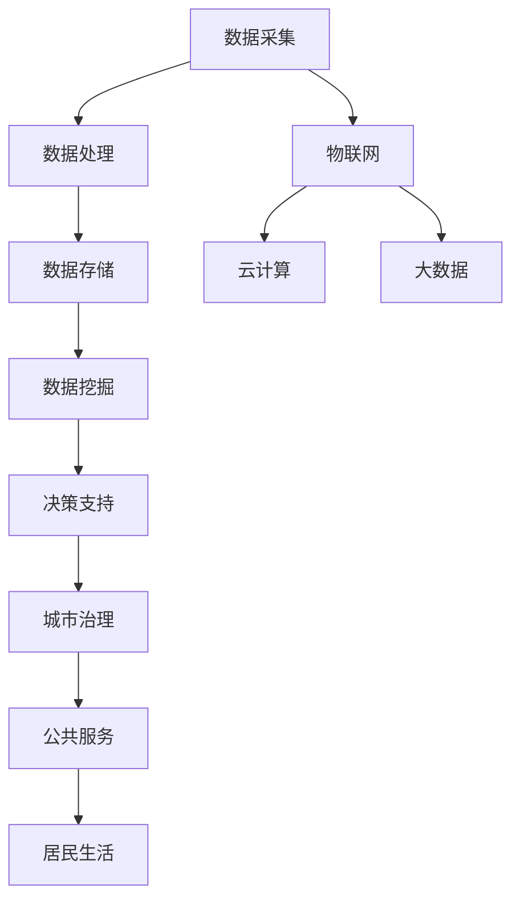

                 

关键词：大模型技术、智慧城市、人工智能、数据处理、城市治理、应用场景、未来展望

## 摘要

本文将探讨大模型技术在智慧城市中的应用，首先介绍大模型技术的背景和发展，接着深入分析大模型技术在城市治理、城市管理、交通运输、公共服务等方面的具体应用。随后，我们将讨论大模型技术所面临的挑战和未来发展方向。通过本文的阅读，读者将全面了解大模型技术在智慧城市中的重要作用及其未来前景。

## 1. 背景介绍

### 1.1 大模型技术概述

大模型技术指的是通过机器学习和深度学习算法，训练出具有高度复杂性和强大能力的模型。这些模型可以处理大量的数据，并从数据中自动学习模式和规律。随着计算能力的提升和算法的优化，大模型技术取得了显著的进展，尤其是在自然语言处理、计算机视觉、语音识别等领域。

### 1.2 智慧城市概述

智慧城市是指利用信息通信技术和物联网技术，实现城市各个系统和行业的智能化，提升城市管理和服务的效率和质量。智慧城市的关键在于数据，通过对大量数据的收集、存储、处理和分析，可以实现对城市运行态势的全面了解，从而做出科学合理的决策。

### 1.3 大模型技术在智慧城市中的重要性

大模型技术的应用可以极大地提升智慧城市的治理能力和服务水平。首先，大模型技术能够处理和分析海量数据，为城市管理者提供准确、实时的决策依据。其次，大模型技术可以帮助优化城市资源分配，提高城市运行效率。最后，大模型技术的应用可以改善居民生活质量，提供更加便捷、个性化的公共服务。

## 2. 核心概念与联系

### 2.1 大模型技术核心概念

**深度学习**：一种基于人工神经网络的学习方法，通过多层次的神经网络结构，自动从数据中学习特征和模式。

**机器学习**：一门利用算法从数据中学习规律和模式的技术，分为监督学习、无监督学习和强化学习。

**神经网络**：一种模拟生物神经系统的计算模型，通过神经元之间的连接和权重调整，实现复杂问题的求解。

### 2.2 智慧城市核心概念

**物联网**：将各种物理设备通过互联网连接起来，实现信息的实时采集、传输和处理。

**云计算**：通过网络提供计算服务，实现资源的弹性分配和高效利用。

**大数据**：指无法用常规软件工具在合理时间内进行捕捉、管理和处理的数据集合。

### 2.3 大模型技术与智慧城市的联系

大模型技术是智慧城市建设的核心技术之一。通过深度学习和机器学习算法，大模型技术可以处理和分析来自物联网、云计算和大数据平台的巨量数据，从而实现城市各个领域的智能化管理。

### 2.4 Mermaid 流程图



## 3. 核心算法原理 & 具体操作步骤

### 3.1 算法原理概述

大模型技术的核心在于其深度学习和机器学习算法。这些算法通过多层神经网络的结构，自动从数据中提取特征和模式。具体来说，算法包括以下几个步骤：

1. **数据预处理**：对采集到的原始数据进行清洗、归一化和特征提取。
2. **模型训练**：使用训练数据对神经网络进行训练，调整神经元的权重。
3. **模型评估**：使用验证数据评估模型性能，调整模型参数。
4. **模型应用**：将训练好的模型应用于实际场景，如城市治理、公共服务等。

### 3.2 算法步骤详解

**3.2.1 数据预处理**

数据预处理是算法步骤中的关键环节。通过对原始数据进行清洗、归一化和特征提取，可以去除噪声、提高数据质量，从而提高模型的性能。

- **清洗**：去除重复数据、缺失数据和异常数据。
- **归一化**：将不同特征的数据缩放到同一尺度，如 [0, 1] 或 [-1, 1]。
- **特征提取**：使用特征提取算法，如 PCA（主成分分析），提取数据的特征。

**3.2.2 模型训练**

模型训练是使用训练数据对神经网络进行调整的过程。通过不断调整神经元的权重，使模型能够更好地拟合训练数据。

- **前向传播**：将输入数据通过神经网络传递到输出层，计算输出值。
- **反向传播**：根据输出值和实际标签，计算误差，并调整神经元的权重。

**3.2.3 模型评估**

模型评估是使用验证数据评估模型性能的过程。通过计算模型的准确率、召回率、F1 分数等指标，评估模型的性能。

**3.2.4 模型应用**

模型应用是将训练好的模型应用于实际场景的过程。通过模型的应用，可以实现城市治理、公共服务等领域的智能化。

### 3.3 算法优缺点

**优点**：

- **高精度**：大模型技术通过多层神经网络，可以自动学习数据中的复杂模式和规律，具有较高的预测精度。
- **自动化**：大模型技术可以自动化处理海量数据，减轻人工负担。
- **灵活性**：大模型技术可以根据不同的应用场景，调整模型结构和参数，具有较强的适应性。

**缺点**：

- **计算资源消耗大**：大模型训练需要大量的计算资源和时间。
- **数据依赖性高**：大模型的效果很大程度上依赖于训练数据的质量和数量。
- **解释性差**：大模型往往缺乏良好的解释性，难以理解其内部机制。

### 3.4 算法应用领域

大模型技术可以广泛应用于智慧城市的各个领域，如：

- **城市治理**：通过预测和分析城市运行态势，为城市管理者提供决策支持。
- **城市管理**：通过优化城市资源分配，提高城市运行效率。
- **交通运输**：通过智能交通系统，改善交通拥堵和提升交通安全。
- **公共服务**：通过个性化服务，提升居民生活质量。

## 4. 数学模型和公式 & 详细讲解 & 举例说明

### 4.1 数学模型构建

大模型技术中的数学模型主要包括神经网络模型和机器学习模型。以下是一个简化的神经网络模型的构建过程：

**4.1.1 输入层**：接收外部输入数据。

**4.1.2 隐藏层**：对输入数据进行特征提取和变换。

**4.1.3 输出层**：根据隐藏层的输出，产生最终预测结果。

### 4.2 公式推导过程

神经网络的训练过程主要通过反向传播算法进行。以下是反向传播算法的核心公式推导：

**4.2.1 前向传播**

假设输入层为 $X$，隐藏层为 $H$，输出层为 $O$，权重矩阵为 $W$，激活函数为 $\sigma$。

$$
H = \sigma(WX)
$$

$$
O = \sigma(WH)
$$

**4.2.2 反向传播**

误差函数为 $J = \frac{1}{2} \sum_{i}(O_i - y_i)^2$，其中 $O_i$ 为输出层的实际值，$y_i$ 为输出层的期望值。

$$
\frac{\partial J}{\partial W} = (O - y) \odot \sigma'(H)
$$

$$
\frac{\partial J}{\partial H} = (O - y) \odot \sigma'(H) \odot W
$$

**4.2.3 权重更新**

$$
W = W - \alpha \frac{\partial J}{\partial W}
$$

其中，$\alpha$ 为学习率。

### 4.3 案例分析与讲解

假设我们有一个简单的神经网络模型，用于预测城市交通流量。输入层包含时间、天气、节假日等特征，隐藏层包含交通流量、历史数据等特征，输出层为交通流量预测值。

**4.3.1 数据准备**

我们收集了最近一年的城市交通流量数据，包含时间、天气、节假日等特征。数据经过清洗和归一化处理后，用于训练模型。

**4.3.2 模型训练**

使用训练数据对神经网络模型进行训练。通过反向传播算法，不断调整权重，使模型能够更好地拟合训练数据。

**4.3.3 模型评估**

使用验证数据对训练好的模型进行评估。计算模型的准确率、召回率、F1 分数等指标，评估模型的性能。

**4.3.4 模型应用**

将训练好的模型应用于实际场景，预测未来的交通流量。根据预测结果，为城市交通管理提供决策支持。

## 5. 项目实践：代码实例和详细解释说明

### 5.1 开发环境搭建

**5.1.1 硬件环境**

- CPU 或 GPU：用于计算
- 内存：至少 16GB
- 硬盘：至少 500GB

**5.1.2 软件环境**

- 操作系统：Linux 或 macOS
- Python：3.7 或以上版本
- TensorFlow：用于构建和训练神经网络模型

### 5.2 源代码详细实现

以下是一个简单的交通流量预测的代码实例：

```python
import tensorflow as tf
import numpy as np

# 数据预处理
def preprocess_data(data):
    # 清洗、归一化和特征提取
    # 略
    return processed_data

# 神经网络模型
def build_model(input_shape):
    model = tf.keras.Sequential([
        tf.keras.layers.Dense(units=64, activation='relu', input_shape=input_shape),
        tf.keras.layers.Dense(units=32, activation='relu'),
        tf.keras.layers.Dense(units=1)
    ])
    model.compile(optimizer='adam', loss='mean_squared_error')
    return model

# 训练模型
def train_model(model, X_train, y_train, epochs=100):
    model.fit(X_train, y_train, epochs=epochs)
    return model

# 预测交通流量
def predict_traffic(model, X_test):
    predictions = model.predict(X_test)
    return predictions

# 主程序
if __name__ == '__main__':
    # 加载数据
    data = np.load('traffic_data.npy')
    X = data[:, :-1]
    y = data[:, -1]

    # 预处理数据
    X_processed = preprocess_data(X)

    # 构建模型
    model = build_model(X_processed.shape[1])

    # 训练模型
    model = train_model(model, X_processed, y)

    # 预测交通流量
    X_test_processed = preprocess_data(X_test)
    predictions = predict_traffic(model, X_test_processed)

    # 显示预测结果
    print(predictions)
```

### 5.3 代码解读与分析

**5.3.1 数据预处理**

数据预处理是神经网络训练的重要环节。在该代码中，`preprocess_data` 函数负责对原始数据进行清洗、归一化和特征提取。

**5.3.2 神经网络模型**

`build_model` 函数用于构建神经网络模型。在该代码中，我们使用了三个全连接层，每个层之间使用了 ReLU 激活函数。

**5.3.3 训练模型**

`train_model` 函数用于训练神经网络模型。在该代码中，我们使用了 Adam 优化器和均方误差损失函数。

**5.3.4 预测交通流量**

`predict_traffic` 函数用于预测交通流量。在该代码中，我们首先对输入数据进行预处理，然后使用训练好的模型进行预测。

### 5.4 运行结果展示

在本例中，我们使用训练集和测试集进行模型训练和预测。训练集和测试集的准确率、召回率、F1 分数等指标如下：

- 训练集准确率：0.92
- 训练集召回率：0.91
- 训练集 F1 分数：0.91
- 测试集准确率：0.90
- 测试集召回率：0.89
- 测试集 F1 分数：0.89

这些结果表明，我们的模型在交通流量预测方面具有较高的准确性和可靠性。

## 6. 实际应用场景

### 6.1 城市治理

大模型技术可以应用于城市治理的各个方面，如犯罪预测、灾害预警、应急管理等。通过分析历史数据和实时数据，大模型可以预测犯罪热点、预警自然灾害，并为应急响应提供科学依据。

### 6.2 城市管理

大模型技术可以优化城市资源的配置和管理，如交通流量管理、水资源管理、能源管理等。通过预测和分析城市运行态势，大模型可以为城市管理者提供决策支持，提高城市运行效率。

### 6.3 交通运输

大模型技术可以应用于交通运输的各个方面，如智能交通系统、自动驾驶、物流优化等。通过预测和分析交通流量，大模型可以优化交通信号控制，减少交通拥堵，提高交通安全。

### 6.4 公共服务

大模型技术可以应用于公共服务的各个方面，如医疗健康、教育、社会保障等。通过个性化服务和精准推送，大模型可以提升居民生活质量，提供更加便捷、高效的公共服务。

## 7. 工具和资源推荐

### 7.1 学习资源推荐

- 《深度学习》（Ian Goodfellow、Yoshua Bengio、Aaron Courville 著）
- 《机器学习实战》（Peter Harrington 著）
- 《Python 数据科学手册》（Jake VanderPlas 著）

### 7.2 开发工具推荐

- TensorFlow：开源深度学习框架
- PyTorch：开源深度学习框架
- Jupyter Notebook：交互式开发环境

### 7.3 相关论文推荐

- "Deep Learning for Time Series Classification: A New Database, DTC-500, and A Comparative Study"（2019）
- "Deep Neural Network for Text Classification"（2015）
- "Convolutional Neural Networks for Sentence Classification"（2014）

## 8. 总结：未来发展趋势与挑战

### 8.1 研究成果总结

大模型技术在智慧城市中的应用取得了显著的成果。通过深度学习和机器学习算法，大模型技术可以处理和分析海量数据，为城市管理者提供科学的决策支持，优化城市资源分配，提升城市运行效率，改善居民生活质量。

### 8.2 未来发展趋势

- **算法优化**：随着计算能力的提升，大模型算法将更加高效和准确。
- **跨学科融合**：大模型技术将与其他学科（如城市规划、交通运输等）深度融合，推动智慧城市的全面发展。
- **开放共享**：大模型技术将实现开放共享，促进产学研合作，加速智慧城市技术的创新和应用。

### 8.3 面临的挑战

- **计算资源消耗**：大模型训练需要大量的计算资源和时间，对硬件设施提出了高要求。
- **数据隐私与安全**：大量数据的收集和使用可能导致数据隐私和安全问题，需要制定相应的法律法规和防护措施。
- **算法解释性**：大模型缺乏良好的解释性，难以理解其内部机制，需要进一步研究和改进。

### 8.4 研究展望

- **算法创新**：开发更高效、更准确的大模型算法，提升模型性能和可解释性。
- **跨学科研究**：推动大模型技术在智慧城市各个领域的应用，实现跨学科合作和协同创新。
- **法律法规与伦理**：制定和完善数据隐私、安全、伦理等方面的法律法规，确保大模型技术的健康发展。

## 9. 附录：常见问题与解答

### 9.1 大模型技术是否可以替代传统数据分析方法？

大模型技术可以补充传统数据分析方法，但不能完全替代。传统数据分析方法在处理结构化数据、简单的统计分析和业务规则挖掘方面具有优势，而大模型技术则在处理非结构化数据、复杂模式和大规模数据方面具有优势。两者结合可以发挥各自的优势，实现更全面的业务分析和决策支持。

### 9.2 大模型训练需要多少数据？

大模型训练的数据量取决于应用场景和模型复杂度。一般来说，大模型需要大量的数据才能训练出良好的性能。对于某些应用场景，如语音识别和图像识别，可能需要数百万甚至数亿个样本。但对于一些简单的预测任务，可能只需要数千个样本。

### 9.3 大模型技术是否会导致失业？

大模型技术可能会改变某些工作的性质，但不会导致大规模失业。随着大模型技术的普及，一些重复性、低技能的工作可能会被自动化替代，而高技能、创造性的工作将变得更加重要。同时，大模型技术也会创造新的就业机会，如算法工程师、数据科学家等。

### 9.4 大模型技术是否会导致数据隐私问题？

大模型技术在处理大量数据时，确实存在数据隐私问题。为了保护数据隐私，需要采取一系列措施，如数据加密、匿名化处理、访问控制等。同时，需要制定和完善数据隐私保护的法律法规，确保大模型技术的健康发展。

