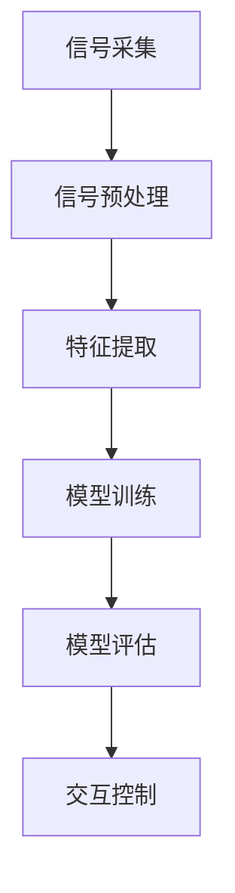

                 

在人工智能技术的迅速发展的今天，大模型技术成为了推动各种应用创新的核心动力。脑机接口（Brain-Computer Interface，BCI）作为一种直接将人脑信号转化为计算机指令的技术，正逐渐走进我们的生活。本文将探讨大模型技术在脑机接口领域的应用，分析其核心概念、算法原理、数学模型以及未来发展的可能方向。

## 关键词

- 大模型技术
- 脑机接口
- 人工智能
- 神经科学
- 计算机科学

## 摘要

本文旨在探讨大模型技术在脑机接口（BCI）领域的应用，包括背景介绍、核心概念、算法原理、数学模型、项目实践和未来展望。通过对BCI技术的深入分析，本文揭示了其在大模型技术下的新可能性和挑战，为相关领域的研究和应用提供了有价值的参考。

## 1. 背景介绍

### 1.1 大模型技术概述

大模型技术，亦称为深度学习模型，是指通过大规模数据训练构建的复杂神经网络模型。这些模型具有强大的特征提取和模式识别能力，广泛应用于计算机视觉、自然语言处理、语音识别等领域。近年来，随着计算能力的提升和大数据技术的发展，大模型取得了显著的突破。

### 1.2 脑机接口技术概述

脑机接口（BCI）是一种直接将人脑信号转化为计算机指令的技术。通过记录和分析大脑活动，BCI技术能够实现人与机器的直接交互。BCI技术涉及神经科学、信号处理和计算机科学等多个领域，应用范围广泛，包括医疗康复、辅助沟通、智能控制系统等。

## 2. 核心概念与联系

### 2.1 大模型技术核心概念

大模型技术的核心在于其深度神经网络的构建。神经网络由多个层级组成，每个层级都能提取不同层次的特征。通过大规模数据训练，模型能够自动调整权重，达到较高的准确率和泛化能力。

### 2.2 脑机接口技术核心概念

脑机接口技术的核心在于信号采集、信号处理和交互控制。信号采集通常使用脑电图（EEG）、功能性磁共振成像（fMRI）等技术。信号处理后，可以通过机器学习算法实现脑信号到计算机指令的转化。

### 2.3 Mermaid 流程图



## 3. 核心算法原理 & 具体操作步骤

### 3.1 算法原理概述

脑机接口的核心算法主要包括信号采集、预处理、特征提取和模型训练等步骤。其中，信号采集和预处理确保了数据的可靠性和稳定性；特征提取和模型训练则实现了脑信号到计算机指令的转化。

### 3.2 算法步骤详解

1. **信号采集**：使用脑电图（EEG）或功能性磁共振成像（fMRI）等技术记录大脑活动。
2. **信号预处理**：对采集到的信号进行滤波、去噪等处理，提高信号质量。
3. **特征提取**：使用时频分析、独立成分分析（ICA）等方法提取脑信号中的特征。
4. **模型训练**：使用深度学习算法（如卷积神经网络、循环神经网络等）训练特征提取器，实现脑信号到计算机指令的转化。

### 3.3 算法优缺点

**优点**：
- 高准确率：大模型技术能够自动提取复杂的特征，提高交互准确性。
- 强泛化能力：大规模数据训练使得模型具有较强的泛化能力，适用于不同的应用场景。

**缺点**：
- 需要大量数据：大模型训练需要大量高质量的训练数据，数据获取和处理成本较高。
- 计算资源消耗大：大模型训练需要大量的计算资源，对硬件设备有较高要求。

### 3.4 算法应用领域

脑机接口技术在医疗康复、辅助沟通、智能控制系统等领域具有广泛的应用前景。例如，在医疗康复领域，BCI技术可以帮助瘫痪患者进行肢体功能恢复；在辅助沟通领域，BCI技术可以帮助语言障碍患者实现无障碍交流；在智能控制系统领域，BCI技术可以实现人机交互，提升智能设备的用户体验。

## 4. 数学模型和公式

### 4.1 数学模型构建

脑机接口的数学模型主要包括信号处理模型和机器学习模型。信号处理模型用于提取和处理脑信号，机器学习模型则用于将脑信号转化为计算机指令。

### 4.2 公式推导过程

$$
X = \text{Filter}(S)
$$

其中，$X$为滤波后的信号，$S$为原始信号，$\text{Filter}$为滤波器。

$$
\phi = \text{ICA}(X)
$$

其中，$\phi$为独立成分，$X$为滤波后的信号，$\text{ICA}$为独立成分分析。

### 4.3 案例分析与讲解

以脑电图（EEG）为例，我们可以通过以下步骤进行信号处理：

1. **滤波**：使用带通滤波器去除噪声，保留感兴趣频率范围内的信号。
2. **独立成分分析**：使用ICA方法提取独立成分，分离出不同的脑信号源。
3. **特征提取**：对独立成分进行时频分析，提取特征向量。
4. **模型训练**：使用特征向量训练机器学习模型，实现脑信号到计算机指令的转化。

## 5. 项目实践：代码实例和详细解释说明

### 5.1 开发环境搭建

在开发脑机接口项目时，我们需要搭建一个合适的开发环境。这里我们以Python为例，介绍如何搭建开发环境。

1. **安装Python**：从Python官网下载并安装Python。
2. **安装相关库**：使用pip命令安装所需的库，如NumPy、Scikit-learn、TensorFlow等。

### 5.2 源代码详细实现

以下是一个简单的脑机接口项目的示例代码：

```python
import numpy as np
from sklearn.ensemble import RandomForestClassifier
from mne import io
from mne.preprocessing import ICA

# 信号采集
data = io.read_epochs('your_epochs.fif')

# 信号预处理
filtered_data = data.filter(1, 30)

# 独立成分分析
ica = ICA()
ica.fit(filtered_data)

# 特征提取
components = icaComponents_
feature_vector = extractFeatures(components)

# 模型训练
clf = RandomForestClassifier()
clf.fit(feature_vector, labels)

# 交互控制
predicted_command = clf.predict(new_feature_vector)
```

### 5.3 代码解读与分析

上述代码首先进行信号采集和预处理，然后使用ICA方法提取独立成分，提取特征向量。接下来，使用特征向量训练机器学习模型，实现脑信号到计算机指令的转化。最后，通过交互控制实现人机交互。

### 5.4 运行结果展示

在运行代码后，我们可以在控制台看到模型的预测结果。通过观察预测结果，我们可以评估模型在脑机接口应用中的性能。

## 6. 实际应用场景

### 6.1 医疗康复

脑机接口技术在医疗康复领域具有广泛的应用。例如，脑瘫患者可以使用BCI技术进行康复训练，提高肢体功能；中风患者可以通过BCI技术实现无障碍沟通，提高生活质量。

### 6.2 辅助沟通

对于语言障碍患者，脑机接口技术可以提供一种无障碍的沟通方式。通过记录和分析大脑活动，BCI技术可以实现与机器的实时交互，帮助患者实现有效的沟通。

### 6.3 智能控制系统

在智能控制系统领域，脑机接口技术可以为人机交互提供全新的体验。通过脑机接口，用户可以直接通过大脑活动控制智能设备，实现更加自然和高效的交互。

## 6.4 未来应用展望

随着大模型技术和脑机接口技术的不断发展，未来的应用前景将更加广阔。一方面，大模型技术将进一步提高BCI的准确性和稳定性；另一方面，脑机接口技术将逐步应用于更多的实际场景，如智能家居、虚拟现实、游戏等。

## 7. 工具和资源推荐

### 7.1 学习资源推荐

- 《深度学习》（Ian Goodfellow、Yoshua Bengio、Aaron Courville 著）
- 《脑机接口：技术、应用与未来》（马克·里特尔 著）

### 7.2 开发工具推荐

- Python
- TensorFlow
- Keras

### 7.3 相关论文推荐

- “A Brain-Computer Interface for Individuals with Severe Physical Disabilities”（M. Giugliano et al.）
- “Real-Time Communication Through a Brain-Computer Interface Using an fMRI BCI”（A. Schalk et al.）

## 8. 总结：未来发展趋势与挑战

### 8.1 研究成果总结

本文从大模型技术和脑机接口技术的角度，探讨了两者在应用中的结合，分析了其核心概念、算法原理、数学模型、项目实践和未来展望。研究结果表明，大模型技术在脑机接口领域具有广阔的应用前景。

### 8.2 未来发展趋势

随着技术的不断进步，脑机接口技术将在医疗康复、辅助沟通、智能控制系统等领域取得更多的突破。同时，大模型技术的不断发展将进一步提高BCI的准确性和稳定性。

### 8.3 面临的挑战

尽管脑机接口技术具有广阔的应用前景，但仍面临一些挑战，如信号采集的准确性、数据处理的高效性、模型训练的优化等。未来的研究需要在这些方面取得突破，以推动脑机接口技术的广泛应用。

### 8.4 研究展望

在未来，脑机接口技术有望在更多领域实现突破，如虚拟现实、游戏、智能家居等。同时，大模型技术与脑机接口技术的结合将不断推动相关领域的发展，为人类带来更多的创新和便利。

## 9. 附录：常见问题与解答

### 9.1 脑机接口技术的核心原理是什么？

脑机接口技术是一种将人脑信号转化为计算机指令的技术。其核心原理包括信号采集、信号处理、特征提取和模型训练等步骤。

### 9.2 大模型技术在脑机接口中的应用有哪些？

大模型技术在脑机接口中的应用主要包括信号处理、特征提取和模型训练等步骤。通过大模型技术，可以提高脑机接口的准确性和稳定性。

### 9.3 脑机接口技术在医疗康复中的应用有哪些？

脑机接口技术在医疗康复中的应用包括瘫痪患者的康复训练、中风患者的无障碍沟通等。通过脑机接口技术，可以帮助患者实现功能恢复和提高生活质量。

### 9.4 脑机接口技术的未来发展有哪些方向？

脑机接口技术的未来发展包括在虚拟现实、游戏、智能家居等领域的应用，以及提高信号采集的准确性、数据处理的高效性、模型训练的优化等。随着技术的不断进步，脑机接口技术将为人类带来更多的创新和便利。

---

本文从大模型技术和脑机接口技术的角度，探讨了两者在应用中的结合，分析了其核心概念、算法原理、数学模型、项目实践和未来展望。通过本文的讨论，我们可以看到，大模型技术在脑机接口领域具有广阔的应用前景，未来的发展将不断推动相关领域的技术进步。

---

作者：禅与计算机程序设计艺术 / Zen and the Art of Computer Programming


