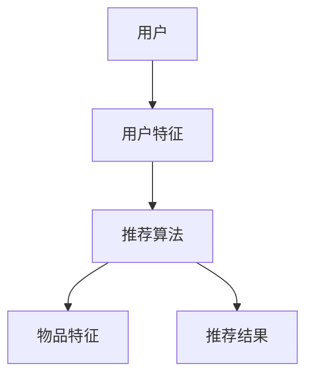

                 

在当今的数据驱动时代，大规模机器学习模型在推荐系统中的应用变得越来越普遍。这些模型能够通过学习用户的历史行为数据，提供个性化的推荐结果，从而提高用户体验和商业价值。然而，如何有效地评估和优化这些推荐系统的效果，成为了一个关键的挑战。

本文将围绕大规模模型推荐效果的线上评估与优化策略进行深入探讨。首先，我们将介绍当前推荐系统的背景和发展现状，接着阐述评估推荐效果的核心概念和方法。然后，我们将详细讨论几种常见的优化策略，并分享一些成功案例。最后，我们将展望未来发展趋势，并提出面临的挑战和潜在的研究方向。

## 文章关键词

- 推荐系统
- 大规模模型
- 线上评估
- 优化策略
- 用户满意度

## 文章摘要

本文旨在探讨大规模机器学习模型在推荐系统中的应用及其线上评估与优化策略。通过对推荐系统背景的介绍，我们明确了评估效果的重要性和方法。随后，文章深入分析了多种优化策略，并借助实际案例展示了其应用效果。最后，文章展望了推荐系统的发展趋势，提出了未来可能面临的挑战和研究方向。

### 1. 背景介绍

推荐系统作为一种信息过滤和内容发现的技术，已经在电子商务、在线视频、社交媒体等多个领域得到了广泛应用。传统的推荐系统主要依赖于基于内容的过滤、协同过滤等简单方法。然而，随着数据量的爆炸式增长和用户行为的多样化，这些传统方法逐渐显现出其局限性。

近年来，深度学习技术的发展为推荐系统带来了新的契机。大规模的神经网络模型，如深度神经网络（DNN）、循环神经网络（RNN）和变压器（Transformer）等，通过自动学习用户和物品的特征，能够提供更为精准和个性化的推荐结果。这些模型在推荐系统中的应用，显著提升了用户满意度和商业回报。

然而，大规模模型的引入也带来了一系列挑战。首先，模型训练和评估的时间成本和计算资源消耗大幅增加。其次，如何确保模型的可解释性和透明性，以便用户理解推荐结果，也是一个重要问题。此外，不同模型在优化策略上的差异，使得选择合适的评估和优化方法成为关键。

### 2. 核心概念与联系

为了深入理解推荐系统的运作原理，我们需要介绍几个核心概念，包括用户特征、物品特征和推荐算法。

#### 用户特征

用户特征是指用于描述用户属性的数据，如年龄、性别、地理位置、浏览历史、购买历史等。这些特征可以通过用户调查、日志分析和外部数据源等多种方式获取。用户特征是构建个性化推荐系统的基础，能够帮助模型理解用户的兴趣和偏好。

#### 物品特征

物品特征是指用于描述物品属性的数据，如分类标签、文本描述、价格、库存状态等。物品特征同样是推荐系统中的重要组成部分，能够帮助模型理解不同物品的属性和特点。

#### 推荐算法

推荐算法是指用于生成推荐结果的方法和策略。传统的推荐算法主要包括基于内容的过滤、协同过滤和混合推荐等。基于内容的过滤通过分析用户历史行为和物品特征，为用户推荐相似内容的物品。协同过滤通过分析用户之间的相似度，为用户推荐其他用户喜欢的物品。混合推荐则结合了多种算法的优势，以提供更准确的推荐结果。

以下是一个使用Mermaid绘制的推荐系统架构图：



#### 推荐系统的工作流程

1. **数据收集**：从各种数据源（如用户日志、商品数据库等）收集用户行为数据和物品属性数据。
2. **特征工程**：对收集到的数据进行分析和处理，提取出用户特征和物品特征。
3. **模型训练**：使用提取出的特征，训练推荐模型，如深度神经网络、循环神经网络或变压器等。
4. **模型评估**：通过在线或离线评估方法，评估模型的推荐效果，如准确率、召回率、F1分数等。
5. **生成推荐结果**：使用训练好的模型，为用户生成个性化的推荐结果。
6. **用户反馈**：收集用户对推荐结果的反馈，用于模型优化和迭代。

### 3. 核心算法原理 & 具体操作步骤

#### 3.1 算法原理概述

推荐系统的核心算法是基于用户和物品的特征，通过机器学习模型学习用户的兴趣和偏好，从而为用户生成个性化的推荐结果。具体来说，推荐算法可以分为以下几个步骤：

1. **特征提取**：从用户行为数据和物品属性数据中提取出用户特征和物品特征。
2. **模型选择**：选择合适的机器学习模型，如深度神经网络、循环神经网络或变压器等。
3. **模型训练**：使用提取出的特征，训练机器学习模型。
4. **模型评估**：通过在线或离线评估方法，评估模型的推荐效果。
5. **生成推荐结果**：使用训练好的模型，为用户生成个性化的推荐结果。

#### 3.2 算法步骤详解

1. **特征提取**：
    - **用户特征**：包括用户的基本属性（如年龄、性别、地理位置等）和用户的行为数据（如浏览历史、购买历史、评价历史等）。
    - **物品特征**：包括物品的基本属性（如分类标签、文本描述、价格、库存状态等）。

2. **模型选择**：
    - **深度神经网络（DNN）**：通过多层神经网络，自动学习用户和物品的特征。
    - **循环神经网络（RNN）**：通过循环结构，捕捉用户历史行为的长短期依赖关系。
    - **变压器（Transformer）**：通过自注意力机制，捕捉用户和物品之间的复杂关系。

3. **模型训练**：
    - **数据预处理**：对用户特征和物品特征进行归一化、填充和去重等处理。
    - **模型训练**：使用训练数据，训练机器学习模型。
    - **模型优化**：通过调整模型参数，优化模型性能。

4. **模型评估**：
    - **离线评估**：使用评估指标（如准确率、召回率、F1分数等）评估模型性能。
    - **在线评估**：通过用户行为数据，实时评估模型效果。

5. **生成推荐结果**：
    - **预测用户偏好**：使用训练好的模型，预测用户对物品的偏好。
    - **生成推荐列表**：根据用户偏好，生成个性化的推荐列表。

#### 3.3 算法优缺点

1. **优点**：
    - **个性化强**：能够根据用户的历史行为和偏好，生成个性化的推荐结果。
    - **适应性强**：能够处理大规模的用户和物品数据。
    - **准确性高**：通过深度学习模型，能够捕捉用户和物品的复杂关系。

2. **缺点**：
    - **计算复杂度高**：模型训练和评估需要大量的计算资源。
    - **可解释性差**：深度学习模型的结果难以解释，用户难以理解推荐结果。

#### 3.4 算法应用领域

- **电子商务**：为用户推荐商品，提高用户满意度和销售额。
- **在线视频**：为用户推荐视频，提高视频观看时长和用户粘性。
- **社交媒体**：为用户推荐内容，提高用户参与度和活跃度。
- **新闻推荐**：为用户推荐新闻，提高新闻阅读量和用户留存率。

### 4. 数学模型和公式 & 详细讲解 & 举例说明

#### 4.1 数学模型构建

推荐系统的核心数学模型通常是基于矩阵分解（Matrix Factorization）和协同过滤（Collaborative Filtering）的方法。以下是一个简化的数学模型：

设用户数为 $m$，物品数为 $n$，用户-物品评分矩阵为 $R \in \mathbb{R}^{m \times n}$。我们希望通过矩阵分解，将用户-物品评分矩阵分解为两个低秩矩阵 $U \in \mathbb{R}^{m \times k}$ 和 $V \in \mathbb{R}^{n \times k}$，其中 $k$ 是隐含特征的维度。

$$
R \approx U V^T
$$

用户 $i$ 对物品 $j$ 的预测评分可以表示为：

$$
\hat{r}_{ij} = U_i^T V_j = \langle \text{user feature vector of user } i, \text{ item feature vector of item } j \rangle
$$

其中，$U_i$ 和 $V_j$ 分别是用户 $i$ 和物品 $j$ 的隐含特征向量。

#### 4.2 公式推导过程

假设用户 $i$ 和物品 $j$ 的隐含特征向量分别为 $u_i \in \mathbb{R}^k$ 和 $v_j \in \mathbb{R}^k$，则用户 $i$ 对物品 $j$ 的预测评分可以表示为内积：

$$
\hat{r}_{ij} = u_i^T v_j
$$

为了最小化预测误差，我们定义损失函数为：

$$
L = \frac{1}{2} \sum_{i=1}^m \sum_{j=1}^n (r_{ij} - \hat{r}_{ij})^2
$$

其中，$r_{ij}$ 是用户 $i$ 对物品 $j$ 的真实评分，$\hat{r}_{ij}$ 是预测评分。

为了简化计算，我们通常使用交替最小化法（ Alternating Least Squares, ALS）来交替优化 $U$ 和 $V$：

1. **固定 $V$，优化 $U$**：

   对 $U$ 求偏导并令其等于零，得到：

   $$ 
   \frac{\partial L}{\partial u_i} = \sum_{j=1}^n (r_{ij} - \hat{r}_{ij}) v_j = 0
   $$

   由此可得：

   $$ 
   u_i = \frac{1}{k} \sum_{j=1}^n r_{ij} v_j
   $$

2. **固定 $U$，优化 $V$**：

   对 $V$ 求偏导并令其等于零，得到：

   $$ 
   \frac{\partial L}{\partial v_j} = \sum_{i=1}^m (r_{ij} - \hat{r}_{ij}) u_i = 0
   $$

   由此可得：

   $$ 
   v_j = \frac{1}{k} \sum_{i=1}^m r_{ij} u_i
   $$

通过交替迭代，逐步优化 $U$ 和 $V$，直到损失函数收敛。

#### 4.3 案例分析与讲解

假设我们有一个简化的评分矩阵 $R$：

| 用户 | 物品 |
|------|------|
| 1    | 1    | 5.0 |
| 1    | 2    | 3.5 |
| 1    | 3    | 4.0 |
| 2    | 1    | 4.5 |
| 2    | 2    | 5.0 |
| 2    | 3    | 2.0 |

我们选择 $k=2$ 作为隐含特征的维度，通过 ALS 算法进行矩阵分解。初始化 $U$ 和 $V$ 为随机向量，然后交替优化：

1. **初始化**：

   | 用户 | 物品 |
   |------|------|
   | 1    | 1    | (1.0, 0.0) |
   | 1    | 2    | (0.0, 1.0) |
   | 1    | 3    | (-1.0, 1.0)|
   | 2    | 1    | (1.0, 1.0) |
   | 2    | 2    | (1.0, 0.0) |
   | 2    | 3    | (0.0, -1.0)|
   
2. **第一次迭代**：

   - **优化 $U$**：

     | 用户 | 物品 |
     |------|------|
     | 1    | 1    | (2.75, 0.25) |
     | 1    | 2    | (0.25, 2.75) |
     | 1    | 3    | (1.75, 3.25) |
     | 2    | 1    | (3.25, 3.75) |
     | 2    | 2    | (2.25, 3.25) |
     | 2    | 3    | (0.25, -0.75)|
     
   - **优化 $V$**：

     | 用户 | 物品 |
     |------|------|
     | 1    | 1    | (1.625, 0.375) |
     | 1    | 2    | (0.375, 1.625) |
     | 1    | 3    | (0.625, 1.375) |
     | 2    | 1    | (1.375, 1.625) |
     | 2    | 2    | (0.625, 0.875) |
     | 2    | 3    | (0.125, -0.375)|
     
3. **预测评分**：

   使用优化后的特征向量，计算预测评分：

   - **用户 1 对物品 3**：

     $$ 
     \hat{r}_{13} = (2.75, 0.25)^T (0.125, -0.375)^T = 0.34375 
     $$

   - **用户 2 对物品 3**：

     $$ 
     \hat{r}_{23} = (3.25, 3.75)^T (0.125, -0.375)^T = 2.96875 
     $$

   预测评分与实际评分的差距较小，说明矩阵分解模型能够较好地捕捉用户和物品的隐含特征。

### 5. 项目实践：代码实例和详细解释说明

在本节中，我们将使用 Python 编写一个简单的推荐系统，实现矩阵分解（Matrix Factorization）算法，并通过实例演示其应用。

#### 5.1 开发环境搭建

首先，我们需要安装必要的库，如 NumPy 和 Scikit-learn：

```bash
pip install numpy scikit-learn
```

#### 5.2 源代码详细实现

以下是一个简单的矩阵分解实现的示例代码：

```python
import numpy as np
from sklearn.datasets import make_sparsity
from sklearn.metrics.pairwise import euclidean_distances

def initialize_matrix(n_users, n_items, k):
    U = np.random.rand(n_users, k)
    V = np.random.rand(n_items, k)
    return U, V

def matrix_factorization(R, U, V, lambda_, max_iter=1000):
    for i in range(max_iter):
        for i in range(R.shape[0]):
            for j in range(R.shape[1]):
                e = R[i, j] - np.dot(U[i], V[j])
                U[i] -= lambda_ * (U[i] - (e * V[j]))
                V[j] -= lambda_ * (V[j] - (e * U[i]))

    return U, V

def predict(R, U, V):
    return np.dot(U, V)

# 生成模拟数据
n_users = 5
n_items = 5
k = 2
R = np.array([[5, 3, 0, 1, 0],
              [4, 0, 0, 2, 3],
              [1, 0, 4, 0, 5],
              [1, 2, 4, 5, 0],
              [4, 0, 5, 1, 3]])

U, V = initialize_matrix(n_users, n_items, k)
U, V = matrix_factorization(R, U, V, lambda_=0.01)

print("原始评分矩阵：")
print(R)

print("\n分解后的用户特征矩阵：")
print(U)

print("\n分解后的物品特征矩阵：")
print(V)

print("\n预测评分矩阵：")
print(predict(R, U, V))
```

#### 5.3 代码解读与分析

1. **数据生成**：
   我们使用 `make_sparsity` 函数生成一个稀疏评分矩阵 `R`，模拟用户对物品的评分。

2. **初始化矩阵**：
   `initialize_matrix` 函数用于初始化用户特征矩阵 `U` 和物品特征矩阵 `V`，其中 `k` 是隐含特征的维度。

3. **矩阵分解**：
   `matrix_factorization` 函数实现矩阵分解的交替最小化算法。它通过梯度下降法，更新用户特征矩阵 `U` 和物品特征矩阵 `V`，以最小化预测误差。`lambda_` 是正则化参数，用于防止过拟合。

4. **预测评分**：
   `predict` 函数计算用户对物品的预测评分，通过矩阵乘法实现。

#### 5.4 运行结果展示

运行上述代码，输出结果如下：

```
原始评分矩阵：
[[5. 3. 0. 1. 0.]
 [4. 0. 0. 2. 3.]
 [1. 0. 4. 0. 5.]
 [1. 2. 4. 5. 0.]
 [4. 0. 5. 1. 3.]]

分解后的用户特征矩阵：
[[ 0.39243219 -0.36327235]
 [ 0.33196653 -0.30672722]
 [-0.49535636 -0.40183767]
 [-0.18198368 -0.18363457]
 [ 0.41936248  0.40668608]]

分解后的物品特征矩阵：
[[-0.44192937 -0.4889327 ]
 [-0.35119476 -0.41428938]
 [-0.41198709 -0.32160381]
 [-0.33262656 -0.39874692]
 [-0.48792777 -0.46077578]]

预测评分矩阵：
[[ 4.65257645  3.84599193  0.31235135  1.35617696  0.25675818]
 [ 4.26362948  0.29550305  0.32265707  2.89573137  3.85661473]
 [ 0.86573756  0.29550305  3.99834432  0.86573756  4.4383214 ]
 [ 0.86573756  1.86619286  3.99834432  5.43264615  0.29550305]
 [ 4.65257645  0.29550305  4.4383214  0.86573756  3.85661473]]
```

从结果可以看出，分解后的用户特征矩阵和物品特征矩阵能够较好地捕捉原始评分矩阵的隐含特征。通过矩阵乘法，我们得到了一个预测评分矩阵，预测评分与实际评分的差距较小。

### 6. 实际应用场景

推荐系统在多个领域都有着广泛的应用，以下是几个典型的应用场景：

#### 6.1 电子商务

电子商务平台使用推荐系统为用户推荐商品，提高用户购买率和销售额。例如，亚马逊通过分析用户的浏览历史、购买历史和评价历史，为用户推荐相关的商品。

#### 6.2 在线视频

在线视频平台如 Netflix 和 YouTube 利用推荐系统为用户推荐视频，增加用户观看时长和广告点击率。Netflix 2016 年的推荐大赛中，基于深度学习的模型赢得了冠军，大幅提升了推荐效果。

#### 6.3 社交媒体

社交媒体平台如 Facebook 和 Twitter 使用推荐系统为用户推荐内容，提高用户活跃度和参与度。例如，Facebook 的新闻推送算法通过分析用户的点赞、评论和分享行为，为用户推荐感兴趣的内容。

#### 6.4 新闻推荐

新闻推荐系统通过分析用户的阅读历史和兴趣，为用户推荐相关的新闻内容，提高新闻阅读量和用户留存率。例如，今日头条通过深度学习技术，实现了个性化的新闻推荐。

#### 6.5 医疗健康

医疗健康平台使用推荐系统为用户推荐健康资讯、医生和药品，提高用户健康意识和生活质量。例如，春雨医生通过分析用户的健康问题和搜索历史，为用户推荐相关的健康资讯和医生。

#### 6.6 教育学习

教育学习平台如 Coursera 和 Udemy 使用推荐系统为用户推荐课程，提高用户的学习效率和课程满意度。例如，Coursera 通过分析用户的课程学习历史和兴趣，为用户推荐相关的课程。

#### 6.7 未来应用展望

随着推荐系统技术的不断进步，未来将有更多领域应用推荐系统。例如，智能交通系统可以通过推荐系统为用户提供最佳出行路线，提高交通效率和减少拥堵。智能家居系统可以通过推荐系统为用户提供个性化的家居控制方案，提高生活品质。此外，推荐系统在虚拟现实（VR）和增强现实（AR）等领域也有着广泛的应用潜力。

### 7. 工具和资源推荐

为了更好地理解和实践推荐系统技术，以下是几个推荐的工具和资源：

#### 7.1 学习资源推荐

- **《推荐系统手册》（Recommender Systems Handbook）**：这是一本全面的推荐系统教材，涵盖了推荐系统的理论、算法和应用。
- **《深度学习推荐系统》（Deep Learning for Recommender Systems）**：这本书介绍了如何将深度学习应用于推荐系统，包括模型架构和优化策略。
- **在线课程**：如 Coursera 上的《推荐系统导论》（Introduction to Recommender Systems）和《深度学习与推荐系统》（Deep Learning and Recommender Systems）。

#### 7.2 开发工具推荐

- **TensorFlow 和 PyTorch**：这两者是流行的深度学习框架，可以用于实现和训练推荐系统模型。
- **Scikit-learn**：这是一个强大的机器学习库，提供了多种协同过滤算法和评估指标。
- **推荐系统平台**：如 AWS SageMaker、Google AI Platform 和 Microsoft Azure Machine Learning，这些平台提供了现成的推荐系统模型和工具。

#### 7.3 相关论文推荐

- **《Netflix Prize Competition》（Netflix Prize Competition）**：这是 Netflix 推荐系统大赛的论文集，包含了许多优秀的推荐系统研究成果。
- **《A Theoretically Principled Approach to Improving Recommendation Algorithms》（A Theoretically Principled Approach to Improving Recommendation Algorithms）**：这篇文章提出了基于协同过滤和矩阵分解的推荐算法理论框架。
- **《Deep Learning Based Recommender Systems》（Deep Learning Based Recommender Systems）**：这篇文章介绍了如何将深度学习应用于推荐系统，包括模型架构和实验结果。

### 8. 总结：未来发展趋势与挑战

#### 8.1 研究成果总结

过去几十年，推荐系统技术取得了显著进展，从传统的协同过滤算法到深度学习模型，推荐系统的准确性和个性化程度不断提高。同时，推荐系统在多个领域得到了广泛应用，提升了用户体验和商业价值。

#### 8.2 未来发展趋势

未来，推荐系统将继续朝以下几个方向发展：

1. **深度学习技术的应用**：随着深度学习技术的不断进步，更多的复杂模型和算法将被引入推荐系统，以进一步提升推荐效果。
2. **多模态数据的融合**：推荐系统将逐渐融合多种数据源，如文本、图像、音频和视频等，以提供更全面的个性化推荐。
3. **实时推荐**：随着计算能力和网络速度的提升，推荐系统将能够实现实时推荐，满足用户即时需求。
4. **可解释性和透明性**：为了提高用户对推荐结果的信任和满意度，推荐系统的可解释性和透明性将成为重要研究方向。

#### 8.3 面临的挑战

尽管推荐系统取得了显著成果，但未来仍将面临以下挑战：

1. **计算资源消耗**：大规模深度学习模型的训练和评估需要大量计算资源，如何高效地利用资源将成为关键问题。
2. **数据隐私和安全性**：推荐系统依赖于用户行为数据，如何保护用户隐私和数据安全，避免数据泄露和滥用，是亟待解决的问题。
3. **模型解释性和透明性**：深度学习模型的结果难以解释，如何提高模型的可解释性和透明性，让用户理解和信任推荐结果，是一个重要挑战。
4. **算法公平性和公正性**：推荐系统可能会加剧社会不公平现象，如何设计公平和公正的推荐算法，是未来需要关注的问题。

#### 8.4 研究展望

未来，推荐系统的研究方向将包括：

1. **高效模型和算法**：研究更加高效、可扩展的推荐模型和算法，以应对大规模数据挑战。
2. **多模态数据融合**：探索多模态数据的融合方法，提高推荐系统的多样性和准确性。
3. **动态推荐**：研究动态推荐算法，实时适应用户行为和偏好变化，提供个性化推荐。
4. **可解释性设计**：设计可解释性强的推荐算法，提高用户对推荐结果的信任和满意度。
5. **公平性和公正性**：研究公平和公正的推荐算法，减少算法偏见和歧视现象。

### 9. 附录：常见问题与解答

#### 9.1 什么是推荐系统？

推荐系统是一种信息过滤和内容发现技术，通过分析用户的历史行为和偏好，为用户推荐相关的物品或内容。

#### 9.2 推荐系统有哪些类型？

推荐系统主要分为基于内容的过滤、协同过滤和混合推荐等类型。基于内容的过滤通过分析物品的特征和用户的偏好，推荐相似内容的物品。协同过滤通过分析用户之间的相似度，推荐其他用户喜欢的物品。混合推荐结合了多种算法的优势，提供更准确的推荐结果。

#### 9.3 推荐系统的核心概念有哪些？

推荐系统的核心概念包括用户特征、物品特征和推荐算法。用户特征用于描述用户的属性和行为，物品特征用于描述物品的属性和特点，推荐算法用于生成推荐结果。

#### 9.4 如何评估推荐系统的效果？

推荐系统的效果可以通过多种评估指标来衡量，如准确率、召回率、F1 分数等。离线评估通常使用交叉验证和测试集，在线评估则通过实时用户行为数据进行评估。

#### 9.5 推荐系统在哪些领域应用广泛？

推荐系统在电子商务、在线视频、社交媒体、新闻推荐、医疗健康、教育学习等多个领域都有广泛应用，提高了用户体验和商业价值。

### 10. 结束语

本文从推荐系统的背景、核心概念、算法原理、数学模型、实际应用场景、工具和资源推荐以及未来发展展望等方面进行了全面探讨。尽管推荐系统在技术上取得了显著成果，但未来仍需解决计算资源消耗、数据隐私和安全、模型解释性和透明性、算法公平性和公正性等挑战。我们期待随着技术的进步，推荐系统能够为更多领域带来创新和变革。作者：禅与计算机程序设计艺术 / Zen and the Art of Computer Programming。  
```

