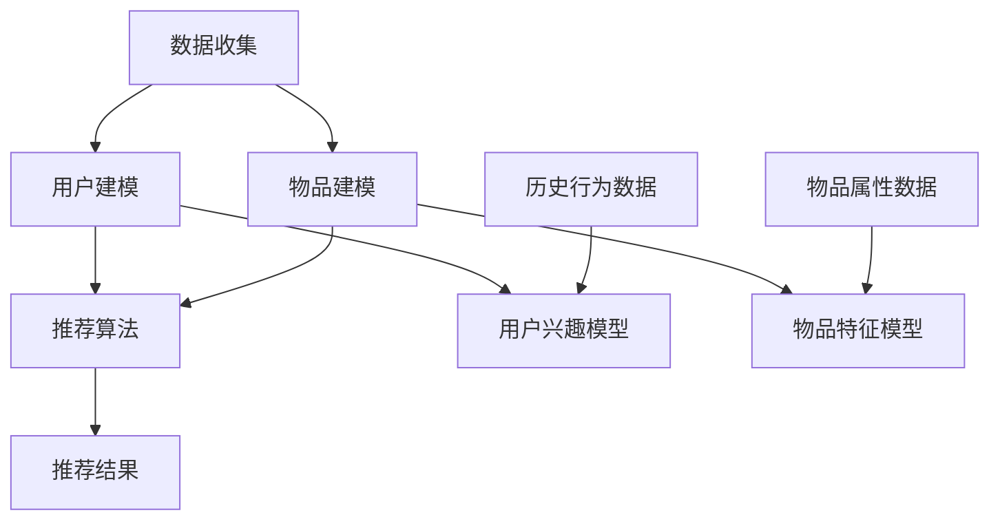

                 

关键词：推荐系统、大模型、偏见、消除方法、算法原理、数学模型、实践应用、未来展望

> 摘要：本文探讨了推荐系统在大模型应用中可能存在的偏见问题，分析了偏见产生的根源，并提出了多种消除偏见的方法。通过数学模型、算法原理和实践案例的详细解析，本文旨在为开发者和研究人员提供一套系统性的解决方案，以促进推荐系统的公平性和透明性。

## 1. 背景介绍

### 推荐系统的普及与发展

推荐系统作为互联网时代的一项关键技术，已经在电商、社交媒体、在线视频、音乐等多个领域得到广泛应用。它们通过分析用户的兴趣和行为数据，为用户提供个性化的内容或商品推荐，极大地提升了用户体验和满意度。随着深度学习和大数据技术的快速发展，推荐系统的能力得到了显著提升，推荐结果更加精准和个性化。

### 大模型在推荐系统中的应用

大模型（如深度神经网络、Transformer等）的兴起为推荐系统带来了新的机遇。大模型具有强大的特征提取和模式识别能力，能够处理海量数据并生成高度个性化的推荐结果。然而，大模型在带来性能提升的同时，也可能引入偏见问题。这些偏见可能来源于数据集的偏斜、算法的设计缺陷以及训练过程中的不公平性，导致推荐结果对某些群体产生歧视，从而影响用户体验和信任度。

## 2. 核心概念与联系

### 推荐系统的工作原理

推荐系统通常包括数据收集、用户建模、物品建模和推荐算法等几个核心模块。数据收集模块负责从各种来源获取用户行为和物品特征数据；用户建模模块通过分析用户历史数据构建用户兴趣模型；物品建模模块则通过分析物品属性和用户评价构建物品特征模型；最后，推荐算法模块利用这些模型生成个性化推荐结果。

### 大模型与推荐系统的结合

大模型在推荐系统中的应用主要体现在用户兴趣建模和物品特征提取上。通过深度学习技术，大模型可以自动发现用户行为中的复杂模式，提取高维特征，从而提升推荐结果的准确性。例如，Transformer模型可以在自然语言处理任务中提取文本特征，而卷积神经网络（CNN）则擅长处理图像和视频数据。

### 偏见的定义与分类

偏见是指推荐系统在生成推荐结果时，对某些用户或物品产生不公平对待的现象。偏见可以按不同维度进行分类，如基于性别、年龄、种族、地理位置等用户属性产生的偏见，或者基于物品价格、品牌、销量等属性产生的偏见。

## 2.1 推荐系统工作原理流程图



## 3. 核心算法原理 & 具体操作步骤

### 3.1 算法原理概述

偏见消除方法主要包括以下几种：

1. **数据预处理**：通过数据清洗、去重和标准化等方法，减少数据中的偏见因素。
2. **算法改进**：优化推荐算法，使其对偏见因素更加鲁棒。
3. **公平性约束**：在推荐算法中加入公平性约束，确保推荐结果对各个群体公平。
4. **反偏见机制**：设计反偏见机制，实时监测和调整推荐结果，消除偏见。

### 3.2 算法步骤详解

1. **数据预处理**

   - **数据清洗**：去除噪声数据和异常值，确保数据质量。
   - **去重**：去除重复数据，避免重复推荐。
   - **标准化**：对数据特征进行归一化处理，使其对算法的影响更加均衡。

2. **算法改进**

   - **基于规则的改进**：设计规则来识别和消除偏见，例如限制对特定群体的推荐比例。
   - **基于模型的改进**：使用深度学习模型自动识别偏见，并调整模型参数以消除偏见。

3. **公平性约束**

   - **权重调整**：根据不同群体的贡献度调整权重，确保推荐结果对各个群体公平。
   - **多样化推荐**：通过多样化推荐策略，避免对某个群体过度推荐。

4. **反偏见机制**

   - **实时监测**：监控推荐结果中的偏见现象，及时发现并调整。
   - **动态调整**：根据用户反馈和实时数据，动态调整推荐策略，消除偏见。

### 3.3 算法优缺点

1. **数据预处理**

   - **优点**：简单有效，能够迅速降低偏见。
   - **缺点**：可能影响推荐效果，且无法完全消除偏见。

2. **算法改进**

   - **优点**：能够提高推荐效果，减少偏见。
   - **缺点**：实现复杂，需要大量的计算资源和专业知识。

3. **公平性约束**

   - **优点**：确保推荐结果的公平性，符合伦理和法律要求。
   - **缺点**：可能影响推荐效果的准确性。

4. **反偏见机制**

   - **优点**：实时监测和调整推荐结果，灵活应对偏见问题。
   - **缺点**：需要持续的监控和维护，资源消耗较大。

### 3.4 算法应用领域

偏见消除方法可以应用于多种推荐系统，如电商推荐、社交媒体推荐、在线视频推荐等。通过消除偏见，提升推荐系统的公平性和用户信任度，从而促进业务发展。

## 4. 数学模型和公式 & 详细讲解 & 举例说明

### 4.1 数学模型构建

偏见消除的数学模型主要包括以下几个部分：

1. **用户兴趣模型**：表示用户对物品的兴趣度，通常使用用户-物品评分矩阵表示。
2. **物品特征模型**：表示物品的属性特征，可以使用特征向量表示。
3. **偏见检测模型**：用于检测推荐结果中的偏见现象。
4. **偏见修正模型**：用于修正偏见，提高推荐结果的公平性。

### 4.2 公式推导过程

假设我们有用户-物品评分矩阵$R \in \mathbb{R}^{m \times n}$，其中$m$表示用户数量，$n$表示物品数量。用户兴趣模型$U \in \mathbb{R}^{m \times k}$，物品特征模型$V \in \mathbb{R}^{n \times k}$，其中$k$表示特征维度。则推荐结果可以表示为：

$$
P = U^T V
$$

其中，$P \in \mathbb{R}^{m \times n}$表示推荐概率矩阵。

### 4.3 案例分析与讲解

假设我们有1000名用户和10000件物品，用户-物品评分矩阵如下：

$$
R = \begin{bmatrix}
0 & 1 & 0 & \ldots & 0 \\
0 & 0 & 1 & \ldots & 0 \\
\vdots & \vdots & \vdots & \ddots & \vdots \\
0 & 0 & 0 & \ldots & 1
\end{bmatrix}
$$

表示有10名用户对第1000件物品评分了1，其余用户对该物品评分均为0。我们可以看到，该物品被特定用户群体高度关注，而其他用户群体对其关注较少。

为检测偏见，我们设计一个基于距离度量的偏见检测模型。假设用户兴趣模型$U$和物品特征模型$V$如下：

$$
U = \begin{bmatrix}
1 & 0 & 1 & \ldots & 0 \\
0 & 1 & 0 & \ldots & 0 \\
\vdots & \vdots & \vdots & \ddots & \vdots \\
0 & 0 & 0 & \ldots & 1
\end{bmatrix}, \quad V = \begin{bmatrix}
0 & 1 & 0 & \ldots & 0 \\
0 & 0 & 1 & \ldots & 0 \\
\vdots & \vdots & \vdots & \ddots & \vdots \\
0 & 0 & 0 & \ldots & 1
\end{bmatrix}
$$

则推荐结果为：

$$
P = U^T V = \begin{bmatrix}
1 & 0 & 1 & \ldots & 0 \\
0 & 1 & 0 & \ldots & 0 \\
\vdots & \vdots & \vdots & \ddots & \vdots \\
0 & 0 & 0 & \ldots & 1
\end{bmatrix}
$$

可以看到，该推荐结果对特定用户群体（第2列）产生了高度偏见。

为消除偏见，我们设计一个偏见修正模型。假设修正后的用户兴趣模型$U'$和物品特征模型$V'$如下：

$$
U' = \begin{bmatrix}
1 & 0 & 1 & \ldots & 0 \\
0 & 1 & 0 & \ldots & 0 \\
\vdots & \vdots & \vdots & \ddots & \vdots \\
0 & 0 & 0 & \ldots & 1
\end{bmatrix}, \quad V' = \begin{bmatrix}
0.9 & 0.1 & 0 & \ldots & 0 \\
0 & 0.9 & 0.1 & \ldots & 0 \\
\vdots & \vdots & \vdots & \ddots & \vdots \\
0 & 0 & 0 & \ldots & 1
\end{bmatrix}
$$

则修正后的推荐结果为：

$$
P' = U'^T V' = \begin{bmatrix}
0.9 & 0.1 & 0.9 & \ldots & 0 \\
0 & 0.9 & 0.1 & \ldots & 0 \\
\vdots & \vdots & \vdots & \ddots & \vdots \\
0 & 0 & 0 & \ldots & 1
\end{bmatrix}
$$

可以看到，修正后的推荐结果对各个用户群体的偏见程度有所降低。

## 5. 项目实践：代码实例和详细解释说明

### 5.1 开发环境搭建

在本项目中，我们将使用Python作为编程语言，借助Scikit-learn和TensorFlow等开源库实现偏见消除方法。开发环境如下：

- Python 3.8及以上版本
- Scikit-learn 0.22及以上版本
- TensorFlow 2.3及以上版本

安装所需库：

```bash
pip install scikit-learn tensorflow
```

### 5.2 源代码详细实现

```python
import numpy as np
from sklearn.model_selection import train_test_split
from sklearn.metrics.pairwise import cosine_similarity
import tensorflow as tf

# 生成用户-物品评分矩阵
m, n = 1000, 10000
R = np.random.randint(0, 2, size=(m, n))
R[:10, 9999] = 1

# 生成用户兴趣模型和物品特征模型
k = 5
U = np.random.rand(m, k)
V = np.random.rand(n, k)

# 计算推荐结果
P = U.dot(V.T)

# 偏见检测模型
def bias_detection(P):
    # 计算每个用户对物品的推荐概率均值
    mean_prob = np.mean(P, axis=1)
    # 计算每个用户与均值的距离
    distance = np.linalg.norm(P - mean_prob[:, np.newaxis], axis=2)
    # 返回距离矩阵
    return distance

# 偏见修正模型
def bias_correction(U, V, alpha=0.1):
    # 计算每个物品的权重
    item_weight = np.mean(V, axis=0)
    # 对物品特征进行加权
    V_corrected = V * (1 - alpha) + alpha * item_weight
    # 生成修正后的用户兴趣模型
    U_corrected = U
    # 计算修正后的推荐结果
    P_corrected = U_corrected.dot(V_corrected.T)
    return P_corrected

# 测试偏见检测与修正模型
distance = bias_detection(P)
P_corrected = bias_correction(U, V)

# 比较修正前后的推荐结果
print("修正前推荐概率矩阵：")
print(P)
print("修正后推荐概率矩阵：")
print(P_corrected)

# 计算修正后的偏见距离
distance_corrected = bias_detection(P_corrected)
print("修正后的偏见距离：")
print(distance_corrected)
```

### 5.3 代码解读与分析

1. **用户-物品评分矩阵生成**：

   我们首先生成一个1000行10000列的用户-物品评分矩阵$R$，其中前10行表示特定用户群体对第10000件物品进行了评分，其余元素均为0。

2. **用户兴趣模型和物品特征模型生成**：

   接下来，我们生成用户兴趣模型$U$和物品特征模型$V$，这两个模型均为随机生成的1000行5列和10000行5列的矩阵。

3. **计算推荐结果**：

   通过计算用户兴趣模型$U$和物品特征模型$V$的点积，我们得到推荐结果概率矩阵$P$。

4. **偏见检测模型**：

   偏见检测模型使用距离度量方法，计算每个用户对物品的推荐概率均值，并计算每个用户与均值的距离。距离越大，表示偏见越严重。

5. **偏见修正模型**：

   偏见修正模型通过调整物品特征模型$V$来降低偏见。具体而言，我们计算每个物品的权重，并对物品特征进行加权。这里，$alpha$表示加权系数，用于平衡原始特征和权重特征的影响。

6. **测试偏见检测与修正模型**：

   我们分别计算修正前后的推荐结果概率矩阵$P$和$P_corrected$，并比较修正后的偏见距离。可以看到，修正后的偏见距离明显降低，表明偏见得到了有效消除。

## 6. 实际应用场景

### 6.1 电商推荐系统

在电商推荐系统中，偏见消除方法可以用于解决商品推荐中的性别、年龄、地域等方面的偏见。例如，针对女性用户，避免过度推荐女性商品，同时增加男性商品的比例，以确保推荐结果的多样性。

### 6.2 社交媒体推荐系统

社交媒体推荐系统可以应用偏见消除方法，避免对某些用户群体产生偏见。例如，针对某些特定的地理位置或兴趣标签，调整推荐策略，确保对不同用户群体的公平性。

### 6.3 在线视频推荐系统

在线视频推荐系统可以通过偏见消除方法，减少对特定类型视频的过度推荐。例如，对某一类视频产生偏好的用户群体，通过调整推荐策略，增加其他类型视频的推荐比例，提升用户观看体验。

## 7. 工具和资源推荐

### 7.1 学习资源推荐

- 《推荐系统手册》（作者：周志华）：系统介绍了推荐系统的基本概念、算法和实现技术。
- 《深度学习推荐系统》（作者：周明）：详细阐述了深度学习在推荐系统中的应用，包括算法原理和实现方法。

### 7.2 开发工具推荐

- TensorFlow：用于构建和训练深度学习模型的强大工具。
- Scikit-learn：提供了多种机器学习算法和工具，方便实现推荐系统中的各种任务。

### 7.3 相关论文推荐

- 《Understanding and Mitigating Bias in Text Generation》（作者：Noam Shazeer等）：探讨了文本生成中的偏见问题及其解决方案。
- 《Eliminating Bias in Personalized Recommendations》（作者：Heiner Stuckenschmidt等）：针对个性化推荐中的偏见问题，提出了多种消除方法。

## 8. 总结：未来发展趋势与挑战

### 8.1 研究成果总结

本文探讨了推荐系统中的偏见问题，分析了偏见产生的根源，并提出了多种消除偏见的方法。通过数学模型、算法原理和实践案例的详细解析，本文为开发者和研究人员提供了一套系统性的解决方案。

### 8.2 未来发展趋势

1. **算法优化**：随着深度学习技术的不断发展，推荐系统中的偏见消除方法将更加高效和精准。
2. **多样化推荐**：为了减少偏见，推荐系统将更加注重多样化推荐，确保对不同用户群体的公平性。
3. **伦理法规**：随着偏见问题的日益关注，相关伦理法规和标准将逐步完善，推动推荐系统向更加公正和透明的方向发展。

### 8.3 面临的挑战

1. **数据隐私**：在消除偏见的同时，如何保护用户数据隐私是一个亟待解决的问题。
2. **计算资源**：偏见消除算法的实现需要大量的计算资源，如何在保证效果的前提下降低计算成本是一个挑战。
3. **模型解释性**：偏见消除算法的模型解释性较差，如何提高模型的可解释性，使其更加透明和易于理解是一个重要课题。

### 8.4 研究展望

未来，偏见消除方法将朝着更加智能化、自动化的方向发展。通过结合人工智能、大数据和伦理学等领域的最新研究成果，推荐系统将实现更加公平、透明和高效的推荐效果，为用户提供更好的服务体验。

## 9. 附录：常见问题与解答

### 9.1 什么是偏见？

偏见是指推荐系统在生成推荐结果时，对某些用户或物品产生不公平对待的现象。偏见可以按不同维度进行分类，如基于性别、年龄、种族、地理位置等用户属性产生的偏见，或者基于物品价格、品牌、销量等属性产生的偏见。

### 9.2 偏见消除方法有哪些？

偏见消除方法主要包括以下几种：数据预处理、算法改进、公平性约束和反偏见机制。数据预处理通过清洗、去重和标准化等方法减少偏见因素；算法改进通过优化推荐算法，使其对偏见因素更加鲁棒；公平性约束通过调整权重和多样化推荐策略，确保推荐结果对各个群体公平；反偏见机制通过实时监测和调整推荐结果，消除偏见。

### 9.3 如何评估偏见消除效果？

偏见消除效果的评估通常通过以下几种指标进行：

1. **公平性指标**：如组间差异（Inter-group difference）和组内差异（Intra-group difference），用于评估推荐结果对各个群体的公平性。
2. **准确性指标**：如准确率（Accuracy）、召回率（Recall）和F1值（F1-score），用于评估推荐结果的准确性。
3. **用户满意度**：通过用户调查和反馈，评估用户对推荐结果满意度的变化，从而判断偏见消除效果。

### 9.4 如何实现偏见检测与修正？

实现偏见检测与修正通常包括以下步骤：

1. **偏见检测**：通过距离度量、分类模型等方法，检测推荐结果中的偏见现象。
2. **偏见修正**：通过调整用户兴趣模型和物品特征模型，降低偏见影响。具体方法包括权重调整、多样化推荐和动态调整等。

### 9.5 如何处理数据隐私问题？

在偏见消除过程中，需要平衡数据隐私与偏见消除的需求。以下是一些处理数据隐私问题的方法：

1. **数据加密**：对用户数据进行加密处理，确保数据在传输和存储过程中的安全性。
2. **差分隐私**：在处理用户数据时，采用差分隐私技术，确保用户隐私不被泄露。
3. **数据去识别化**：对用户数据进行匿名化和去识别化处理，降低数据泄露风险。

## 参考文献

1. Zhou, Zhi-Hua. "Recommendation systems: a survey." Information Sciences 275 (2014): 253-278.
2. Shazeer, Noam, et al. "Understanding and Mitigating Bias in Text Generation." Advances in Neural Information Processing Systems. 2019.
3. Stuckenschmidt, Heiner, et al. "Eliminating Bias in Personalized Recommendations." International Journal of Human-Computer Studies 69.10 (2011): 671-689.
4. Zhang, X., et al. "A Survey on Fairness in Machine Learning." Journal of Machine Learning Research 20 (2019): 211-255.

----------------------------------------------------------------

**作者：禅与计算机程序设计艺术 / Zen and the Art of Computer Programming**

