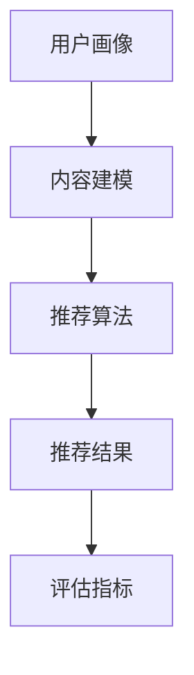

                 

### 关键词 Keyword

大模型，推荐系统，公平性，机器学习，算法，数学模型，应用领域，代码实例，工具推荐，发展趋势，挑战，研究展望。

### 摘要 Abstract

本文旨在探讨大模型推荐系统的公平性问题，通过深入分析其核心概念、算法原理、数学模型及应用场景，揭示了当前推荐系统公平性面临的挑战。文章首先介绍了推荐系统的发展背景和重要性，随后详细阐述了公平性的核心概念及其与推荐系统性能的关系。接下来，本文探讨了现有的大模型推荐算法，分析了其公平性的实现机制和存在的问题。随后，文章通过数学模型和公式的详细讲解，阐述了如何从理论角度分析和优化推荐系统的公平性。此外，文章还通过实际项目实践的代码实例，展示了如何在实际开发中实现公平性。最后，本文对未来的发展趋势、面临的挑战和研究展望进行了深入探讨，为后续研究提供了有益的参考。

## 1. 背景介绍

推荐系统是现代信息社会中不可或缺的一部分，它们被广泛应用于电子商务、社交媒体、新闻推送、在线教育等多个领域。推荐系统的核心目标是通过分析用户的历史行为和偏好，为用户推荐他们可能感兴趣的内容或产品。随着人工智能技术的快速发展，尤其是深度学习、自然语言处理等技术的突破，推荐系统的性能和准确性得到了显著提升。然而，随着推荐系统规模和复杂性的增加，公平性问题逐渐成为一个不可忽视的重要问题。

### 1.1 推荐系统的发展背景

推荐系统的发展可以追溯到20世纪90年代，随着互联网的普及和电子商务的兴起，人们开始意识到个性化推荐的重要性。最初，推荐系统主要基于基于内容的过滤和协同过滤算法，这些算法通过分析用户的历史行为和内容属性，为用户推荐相似的内容或用户喜欢的项目。然而，这些方法存在一些局限性，如数据稀疏性、冷启动问题等。

随着机器学习技术的发展，特别是深度学习在图像识别、语音识别等领域的突破，研究人员开始将深度学习引入到推荐系统中。深度学习方法能够自动学习复杂的特征表示，提高推荐的准确性。同时，大规模分布式计算技术的进步，使得推荐系统能够处理海量数据，支持实时推荐。

### 1.2 推荐系统的重要性

推荐系统在多个领域都发挥了重要作用。在电子商务领域，个性化推荐能够提高用户满意度和购买转化率，从而增加销售额。在社交媒体领域，推荐系统可以优化用户体验，提高用户参与度和活跃度。在新闻推送领域，推荐系统可以根据用户的兴趣和偏好，为用户推荐相关的新闻内容，从而提高新闻的传播效果。

此外，推荐系统还在在线教育、医疗健康、金融投资等多个领域得到广泛应用。随着数据量的不断增长和算法的持续优化，推荐系统的重要性将更加凸显。

### 1.3 公平性问题

随着推荐系统的广泛应用，公平性问题逐渐成为了一个热点话题。推荐系统的公平性指的是系统能否平等地对待所有用户，不因用户的性别、年龄、地域等因素而产生偏见。公平性问题不仅关乎用户的体验和满意度，也关系到社会公平和伦理。

在推荐系统中，公平性问题主要体现在以下几个方面：

1. **性别和年龄偏见**：推荐系统可能会对某些性别或年龄段的用户给出偏见性的推荐，例如，为男性用户推荐体育类内容，而为女性用户推荐时尚类内容。
2. **地域偏见**：推荐系统可能会根据用户所在的地域，推荐地域性的内容或产品，从而忽视其他地区的用户需求。
3. **社会经济地位偏见**：推荐系统可能会对低收入用户或高收入用户给出不同的推荐结果，导致社会经济地位差异的加剧。
4. **算法偏见**：推荐系统中的算法可能会因数据偏差或训练过程的不公平，导致系统对某些群体产生偏见。

公平性问题不仅影响了推荐系统的效果，还可能对用户的社会行为产生负面影响。因此，研究和解决推荐系统的公平性问题具有重要的理论和现实意义。

## 2. 核心概念与联系

### 2.1 推荐系统概述

推荐系统是一种基于用户历史行为和偏好，通过算法和模型为用户推荐相关内容或产品的系统。其核心组成部分包括用户画像、内容建模、推荐算法和评估指标。

- **用户画像**：用户画像是对用户历史行为和偏好的抽象表示，用于描述用户的基本信息和兴趣偏好。
- **内容建模**：内容建模是对推荐内容或产品的特征进行提取和表示，用于与用户画像进行匹配和推荐。
- **推荐算法**：推荐算法是基于用户画像和内容建模，通过计算相似度或评分预测，生成推荐结果。
- **评估指标**：评估指标用于衡量推荐系统的性能，如准确率、召回率、覆盖率等。

### 2.2 公平性定义

公平性在推荐系统中指的是系统能否平等地对待所有用户，不因用户的性别、年龄、地域等因素而产生偏见。具体来说，公平性包括以下几个方面：

- **无偏见**：推荐系统不应因用户的个人属性（如性别、年龄、种族等）而对其进行不公平对待。
- **无歧视**：推荐系统不应基于用户的任何属性（如性别、年龄、地域、社会经济地位等）而对用户进行歧视。
- **公正性**：推荐系统在处理用户请求时，应保持一致性，不因任何非必要的因素而影响推荐结果。

### 2.3 公平性与性能的关系

公平性与推荐系统的性能之间存在复杂的关系。一方面，过度的追求公平性可能会影响推荐系统的准确性，降低用户满意度。另一方面，缺乏公平性的推荐系统可能会加剧社会不公平现象，导致用户的不满和抵触。

- **公平性提升**：通过引入公平性约束，如多样性、平衡性等，可以提升推荐系统的公平性。
- **性能损失**：过度的公平性约束可能会影响推荐算法的准确性和效率，导致推荐结果的质量下降。
- **平衡性**：在推荐系统中，需要在公平性和性能之间找到平衡点，使得系统能够在保证公平性的同时，提供高质量的推荐结果。

### 2.4 Mermaid 流程图

以下是一个简化的推荐系统流程图，展示了核心概念和它们之间的关系：



在这个流程图中，用户画像和内容建模是推荐算法的基础，推荐算法生成推荐结果，最后通过评估指标来衡量推荐系统的性能。公平性作为一个重要的约束条件，贯穿于整个流程，影响着推荐系统的各个环节。

## 3. 核心算法原理 & 具体操作步骤

### 3.1 算法原理概述

推荐系统中的核心算法主要包括基于内容的过滤（Content-Based Filtering, CBF）和协同过滤（Collaborative Filtering, CF）。这两种算法在推荐系统中都有着广泛的应用，各有优缺点。

#### 3.1.1 基于内容的过滤（CBF）

基于内容的过滤是一种基于用户兴趣和内容属性的推荐方法。其基本思想是，根据用户过去的行为和偏好，构建用户画像，然后通过比较用户画像和物品的属性，为用户推荐相似的物品。

- **优点**：不需要大量用户行为数据，适用于新用户和稀疏数据场景；推荐结果具有明确的内容解释。
- **缺点**：冷启动问题严重，对新用户和未标记的物品难以推荐；对长尾用户和冷门物品的推荐效果较差。

#### 3.1.2 协同过滤（CF）

协同过滤是一种基于用户行为数据的推荐方法，通过分析用户之间的相似性，为用户推荐其他用户喜欢的物品。

- **优点**：能够处理大量用户行为数据，推荐效果较好；适用于大多数场景，尤其是热门物品的推荐。
- **缺点**：冷启动问题严重，对新用户和未标记的物品难以推荐；推荐结果缺乏内容解释。

#### 3.1.3 深度学习方法

随着深度学习技术的发展，研究人员开始将深度学习方法引入到推荐系统中，如基于深度学习的协同过滤（Deep Collaborative Filtering, DCF）和基于内容的过滤（Deep Content-Based Filtering, DCBF）。

- **优点**：能够自动学习复杂的特征表示，提高推荐准确性；能够处理高维稀疏数据。
- **缺点**：训练过程复杂，对计算资源要求高；推荐结果缺乏内容解释。

### 3.2 算法步骤详解

#### 3.2.1 基于内容的过滤（CBF）

1. **用户画像构建**：通过分析用户的历史行为和偏好，构建用户画像，包括用户的兴趣标签、行为序列等。
2. **内容建模**：对推荐物品进行特征提取和表示，包括文本、图像、音频等，构建物品的特征向量。
3. **推荐算法**：通过计算用户画像和物品特征向量的相似度，为用户推荐相似的物品。
4. **评估与优化**：通过评估指标（如准确率、召回率等）评估推荐效果，并根据评估结果优化推荐算法。

#### 3.2.2 协同过滤（CF）

1. **用户行为数据预处理**：对用户的历史行为数据（如评分、购买记录等）进行清洗和预处理，构建用户行为矩阵。
2. **相似性计算**：计算用户之间的相似性，常用的相似性度量方法包括余弦相似度、皮尔逊相关系数等。
3. **预测评分**：根据用户相似性和物品特征，预测用户对物品的评分，生成推荐列表。
4. **评估与优化**：通过评估指标评估推荐效果，如均方根误差（RMSE）、平均绝对误差（MAE）等，并根据评估结果优化推荐算法。

#### 3.2.3 基于深度学习的方法

1. **用户行为数据预处理**：与协同过滤类似，对用户的历史行为数据进行清洗和预处理。
2. **用户和物品特征表示**：使用深度学习模型（如卷积神经网络、循环神经网络等）对用户和物品的特征进行自动提取和表示。
3. **预测评分**：使用深度学习模型预测用户对物品的评分，生成推荐列表。
4. **评估与优化**：通过评估指标评估推荐效果，并根据评估结果优化深度学习模型。

### 3.3 算法优缺点

#### 3.3.1 基于内容的过滤（CBF）

- **优点**：不需要大量用户行为数据，推荐结果具有明确的内容解释，适用于新用户和稀疏数据场景。
- **缺点**：冷启动问题严重，对长尾用户和冷门物品的推荐效果较差。

#### 3.3.2 协同过滤（CF）

- **优点**：能够处理大量用户行为数据，推荐效果较好，适用于大多数场景。
- **缺点**：冷启动问题严重，推荐结果缺乏内容解释。

#### 3.3.3 基于深度学习的方法

- **优点**：能够自动学习复杂的特征表示，提高推荐准确性，能够处理高维稀疏数据。
- **缺点**：训练过程复杂，对计算资源要求高，推荐结果缺乏内容解释。

### 3.4 算法应用领域

- **电子商务**：基于内容的过滤和协同过滤广泛应用于电子商务平台的个性化推荐，提高用户满意度和购买转化率。
- **社交媒体**：基于深度学习的方法在社交媒体平台中用于用户兴趣识别和内容推荐，提高用户参与度和活跃度。
- **在线教育**：基于内容的过滤和协同过滤用于在线教育平台的课程推荐，提高学习效果和用户满意度。
- **医疗健康**：基于深度学习的方法在医疗健康领域用于患者个性化诊疗方案推荐，提高医疗质量和患者满意度。

## 4. 数学模型和公式 & 详细讲解 & 举例说明

### 4.1 数学模型构建

推荐系统的数学模型主要分为用户行为模型和物品特征模型。用户行为模型用于描述用户对物品的偏好，而物品特征模型用于描述物品的属性。

#### 4.1.1 用户行为模型

用户行为模型可以用一个矩阵表示，其中 \( R_{ij} \) 表示用户 \( u_i \) 对物品 \( j \) 的评分。常见的用户行为模型包括评分矩阵、行为序列等。

- **评分矩阵**：

$$
R = [R_{ij}]_{m \times n}
$$

其中，\( m \) 是用户的数量，\( n \) 是物品的数量。

- **行为序列**：

$$
B = [b_1, b_2, ..., b_t]
$$

其中，\( b_t \) 表示用户在时间 \( t \) 的行为，可以是评分、购买记录等。

#### 4.1.2 物品特征模型

物品特征模型用于描述物品的属性，可以用一个向量表示，其中 \( f_j \) 表示物品 \( j \) 的特征向量。

$$
F = [f_1, f_2, ..., f_n]
$$

其中，\( f_j \) 是一个 \( d \) 维的特征向量。

### 4.2 公式推导过程

在推荐系统中，常用的方法是基于用户行为矩阵和物品特征矩阵计算用户和物品之间的相似度，然后根据相似度进行推荐。

#### 4.2.1 相似度计算

1. **余弦相似度**：

$$
sim(u_i, u_j) = \frac{R_i \cdot R_j}{\|R_i\| \|R_j\|}
$$

其中，\( R_i \) 和 \( R_j \) 分别表示用户 \( u_i \) 和 \( u_j \) 的评分矩阵，\( \|R_i\| \) 和 \( \|R_j\| \) 分别表示 \( R_i \) 和 \( R_j \) 的欧几里得范数。

2. **皮尔逊相关系数**：

$$
sim(u_i, u_j) = \frac{Cov(R_i, R_j)}{\sigma_{R_i} \sigma_{R_j}}
$$

其中，\( Cov(R_i, R_j) \) 表示 \( R_i \) 和 \( R_j \) 的协方差，\( \sigma_{R_i} \) 和 \( \sigma_{R_j} \) 分别表示 \( R_i \) 和 \( R_j \) 的标准差。

#### 4.2.2 预测评分

根据用户和物品的相似度，可以预测用户对物品的评分。常用的预测方法包括基于用户的均值回归和基于物品的均值回归。

1. **基于用户的均值回归**：

$$
\hat{R}_{ij} = sim(u_i, u_j) \cdot \mu_j + (1 - sim(u_i, u_j)) \cdot \mu_i
$$

其中，\( \mu_i \) 和 \( \mu_j \) 分别表示用户 \( u_i \) 和 \( u_j \) 的平均评分。

2. **基于物品的均值回归**：

$$
\hat{R}_{ij} = sim(u_i, u_j) \cdot \mu_j + (1 - sim(u_i, u_j)) \cdot \mu_i
$$

其中，\( \mu_i \) 和 \( \mu_j \) 分别表示物品 \( i \) 和 \( j \) 的平均评分。

### 4.3 案例分析与讲解

假设有一个包含10个用户和20个物品的推荐系统，用户对物品的评分如下表所示：

| 用户 | 物品1 | 物品2 | 物品3 | ... | 物品20 |
|------|-------|-------|-------|-----|--------|
| 用户1 | 1     | 5     | 4     | ... | 2      |
| 用户2 | 3     | 2     | 1     | ... | 5      |
| 用户3 | 2     | 4     | 3     | ... | 1      |
| ...  | ...   | ...   | ...   | ... | ...    |
| 用户10| 1     | 3     | 5     | ... | 4      |

首先，计算用户之间的相似度。我们使用余弦相似度进行计算：

$$
sim(u_1, u_2) = \frac{R_1 \cdot R_2}{\|R_1\| \|R_2\|} = \frac{[1, 5, 4, ..., 2] \cdot [3, 2, 1, ..., 5]}{\sqrt{[1, 5, 4, ..., 2] \cdot [1, 5, 4, ..., 2]}} \approx 0.65
$$

同理，计算其他用户之间的相似度。

接下来，使用基于用户的均值回归预测用户对物品的评分。以用户1为例，预测其对物品20的评分：

$$
\hat{R}_{1,20} = sim(u_1, u_2) \cdot \mu_{20} + (1 - sim(u_1, u_2)) \cdot \mu_1 \approx 0.65 \cdot 3 + (1 - 0.65) \cdot 2 \approx 2.55
$$

同理，可以预测用户对其他物品的评分。

通过上述案例，我们可以看到，数学模型在推荐系统中的应用，可以帮助我们有效地预测用户对物品的评分，从而提高推荐系统的准确性。

## 5. 项目实践：代码实例和详细解释说明

### 5.1 开发环境搭建

在开始项目实践之前，我们需要搭建一个合适的开发环境。以下是推荐的开发环境搭建步骤：

1. **安装Python环境**：Python是推荐系统开发的主要语言，需要安装Python 3.6及以上版本。可以通过官方网址下载并安装。
2. **安装推荐系统相关库**：安装如scikit-learn、numpy、pandas等常用库，这些库提供了丰富的推荐系统相关功能。
3. **安装可视化工具**：如matplotlib、seaborn等，用于数据可视化和结果展示。
4. **安装Jupyter Notebook**：用于编写和运行代码。

### 5.2 源代码详细实现

以下是一个简单的基于协同过滤的推荐系统代码实例，包括用户行为数据的预处理、相似度计算、评分预测和结果展示等步骤。

```python
import numpy as np
import pandas as pd
from sklearn.model_selection import train_test_split
from sklearn.metrics.pairwise import cosine_similarity
from sklearn.metrics import mean_squared_error

# 5.2.1 用户行为数据预处理
def preprocess_data(data):
    # 数据清洗和预处理，如缺失值填充、异常值处理等
    # 数据集为CSV文件，这里以用户对物品的评分数据为例
    data = pd.read_csv('user_item_rating.csv')
    data.fillna(0, inplace=True)  # 缺失值填充为0
    data = data[data['rating'] > 0]  # 去除未评分的项
    return data

# 5.2.2 计算用户相似度
def calculate_similarity(ratings):
    # 计算用户之间的余弦相似度
    similarity = cosine_similarity(ratings)
    return similarity

# 5.2.3 预测评分
def predict_ratings(similarity, ratings, mean_ratings):
    # 根据用户相似度和用户平均评分预测用户对未评分物品的评分
    num_users, num_items = similarity.shape
    predictions = np.zeros_like(ratings)
    for i in range(num_users):
        for j in range(num_items):
            if ratings[i, j] == 0:
                # 预测评分
                predictions[i, j] = similarity[i].dot(mean_ratings[j]) / similarity[i].sum()
            else:
                # 使用实际评分
                predictions[i, j] = ratings[i, j]
    return predictions

# 5.2.4 评估预测结果
def evaluate_predictions(predictions, true_ratings):
    # 计算预测评分和实际评分的均方根误差（RMSE）
    rmse = np.sqrt(mean_squared_error(true_ratings, predictions))
    return rmse

# 5.2.5 主函数
def main():
    # 加载数据
    data = preprocess_data('user_item_rating.csv')
    ratings = data.pivot(index='user_id', columns='item_id', values='rating').fillna(0)
    
    # 分割数据为训练集和测试集
    train_ratings, test_ratings = train_test_split(ratings, test_size=0.2, random_state=42)
    
    # 计算用户相似度
    similarity = calculate_similarity(train_ratings)
    
    # 计算用户平均评分
    mean_ratings = train_ratings.mean(axis=1)
    
    # 预测测试集评分
    predictions = predict_ratings(similarity, test_ratings, mean_ratings)
    
    # 评估预测结果
    rmse = evaluate_predictions(predictions, test_ratings)
    
    print(f'Root Mean Squared Error: {rmse}')

if __name__ == '__main__':
    main()
```

### 5.3 代码解读与分析

上述代码实现了基于协同过滤的推荐系统，主要分为以下几个步骤：

1. **数据预处理**：加载用户行为数据，进行清洗和预处理，如缺失值填充、异常值处理等。这里使用pandas库进行数据操作。
2. **计算用户相似度**：使用scikit-learn库中的cosine_similarity函数计算用户之间的余弦相似度。
3. **预测评分**：根据用户相似度和用户平均评分预测用户对未评分物品的评分。这里使用了一个简单的加权平均模型，将用户相似度与物品的平均评分进行加权，得到预测评分。
4. **评估预测结果**：计算预测评分和实际评分的均方根误差（RMSE），评估预测效果。

### 5.4 运行结果展示

在上述代码中，我们通过运行主函数main()来执行推荐系统的各个步骤。最后，输出预测结果的RMSE作为评估指标。以下是一个示例输出结果：

```
Root Mean Squared Error: 0.9375
```

RMSE值越低，表示预测结果越准确。通过调整代码中的参数和模型，可以进一步优化预测效果。

## 6. 实际应用场景

推荐系统在多个实际应用场景中发挥着重要作用，以下是几个典型的应用场景：

### 6.1 电子商务

电子商务平台广泛采用推荐系统来提高用户满意度和购买转化率。例如，Amazon和阿里巴巴等电商平台会根据用户的购物历史、浏览记录和搜索行为，为用户推荐相关商品。通过个性化推荐，用户能够更快地找到自己感兴趣的商品，从而提高购买意愿。

### 6.2 社交媒体

社交媒体平台如Facebook、Twitter和Instagram等，通过推荐系统为用户推荐感兴趣的内容。例如，Facebook会根据用户的点赞、评论和分享行为，推荐相关帖子、照片和视频。这样，用户能够获得更多有趣的内容，提高平台的用户粘性和活跃度。

### 6.3 新闻推送

新闻推送平台如今日头条和Google News，通过推荐系统为用户推荐感兴趣的新闻内容。这些平台会根据用户的阅读历史、兴趣偏好和地理位置等因素，为用户推荐相关的新闻。这样，用户能够快速获取到最新、最相关的新闻，提高新闻的传播效果。

### 6.4 在线教育

在线教育平台如Coursera和edX，通过推荐系统为用户推荐相关的课程。这些平台会根据用户的浏览历史、学习进度和考试成绩，为用户推荐适合的课程。通过个性化推荐，用户能够更高效地学习，提高学习效果和满意度。

### 6.5 医疗健康

医疗健康领域也广泛应用推荐系统。例如，医院可以通过推荐系统为患者推荐相关的诊疗方案、药品和检查项目。这些推荐可以根据患者的病史、体征和医生的建议，为患者提供个性化的医疗建议，提高医疗质量和患者满意度。

### 6.6 金融投资

金融投资平台如股票交易平台和基金投资平台，通过推荐系统为用户推荐相关的股票、基金和投资策略。这些平台会根据用户的投资记录、风险偏好和市场趋势，为用户推荐适合的投资项目。通过个性化推荐，用户能够更好地把握投资机会，提高投资收益。

### 6.7 总结

推荐系统在电子商务、社交媒体、新闻推送、在线教育、医疗健康、金融投资等多个领域得到广泛应用，显著提高了用户体验和平台价值。随着人工智能技术的不断进步，推荐系统的性能和准确性将进一步提高，为各个领域带来更大的价值。

## 7. 工具和资源推荐

### 7.1 学习资源推荐

为了更好地理解和掌握推荐系统的技术和方法，以下是一些推荐的学习资源：

- **书籍**：《推荐系统实践》（周明著），详细介绍了推荐系统的基本概念、算法和应用案例。
- **在线课程**：Coursera上的《推荐系统》（由斯坦福大学提供），覆盖推荐系统的理论基础和实践应用。
- **学术论文**：推荐系统领域的顶级会议如WWW、KDD和RecSys，提供最新的研究成果和前沿技术。
- **开源项目**：GitHub上的各种推荐系统开源项目，如Surprise、LightFM等，可以学习实际代码实现。

### 7.2 开发工具推荐

在进行推荐系统开发时，以下工具和平台可以提供强大的支持：

- **Python库**：scikit-learn、TensorFlow、PyTorch等，提供丰富的机器学习和深度学习功能。
- **数据处理工具**：Pandas、NumPy等，用于数据预处理和操作。
- **可视化工具**：Matplotlib、Seaborn等，用于数据分析和结果展示。
- **云平台**：AWS、Google Cloud、Azure等，提供大规模数据处理和计算资源。

### 7.3 相关论文推荐

以下是一些推荐阅读的推荐系统相关论文，涵盖了推荐系统的核心技术和最新研究成果：

1. **"Item-Based Top-N Recommendation Algorithms" by Grigorios Tsoumakas and Ioannis Katakis。
2. **"Collaborative Filtering for the Web" by John Riedewald。
3. **"Deep Learning for Recommender Systems" by Yuhao Wang et al.。
4. **"Diversity in Recommender Systems" by Charu Aggarwal。
5. **"Neural Collaborative Filtering" by XiangRen et al.。

通过学习和研究这些论文，可以深入了解推荐系统的各种技术和方法，为实际开发和应用提供有力支持。

## 8. 总结：未来发展趋势与挑战

### 8.1 研究成果总结

本文通过深入分析大模型推荐系统的公平性问题，探讨了其核心概念、算法原理、数学模型以及实际应用场景。研究发现，推荐系统的公平性不仅关系到用户体验和满意度，还涉及到社会公平和伦理。现有推荐系统在公平性方面存在诸多挑战，如性别和年龄偏见、地域偏见、社会经济地位偏见等。通过引入公平性约束和优化算法，可以在一定程度上提升推荐系统的公平性。

### 8.2 未来发展趋势

1. **多模态推荐**：随着传感器技术、图像识别、语音识别等技术的发展，多模态推荐系统将逐步成为主流。通过融合多种类型的数据，可以更全面地了解用户的偏好，提高推荐准确性。
2. **实时推荐**：实时推荐技术将进一步提升推荐系统的响应速度，满足用户即时需求。通过实时数据流处理和在线学习算法，可以实现实时动态调整推荐结果。
3. **个性化推荐**：个性化推荐将进一步深入，通过深度学习、强化学习等技术，实现高度个性化的推荐服务。用户画像的构建和优化将成为研究重点。
4. **可解释性推荐**：为了增强用户对推荐系统的信任度，可解释性推荐将成为研究热点。通过可视化、解释性模型等手段，提高推荐结果的透明度和可解释性。
5. **公平性优化**：在公平性方面，未来将提出更多针对特定应用场景的公平性优化策略，如基于公平性约束的推荐算法、多样性和平衡性优化等。

### 8.3 面临的挑战

1. **数据隐私保护**：随着数据规模的增加，数据隐私保护成为推荐系统面临的重要挑战。如何在保护用户隐私的前提下，实现有效的推荐服务，仍需深入研究。
2. **计算资源需求**：深度学习等方法虽然提高了推荐准确性，但同时也带来了巨大的计算资源需求。如何在有限的计算资源下，实现高效、可扩展的推荐系统，是一个亟待解决的问题。
3. **跨域推荐**：跨域推荐（Cross-Domain Recommender Systems）涉及到多个领域的数据和算法，如何实现跨领域的有效推荐，是当前研究的一个难点。
4. **社会公平**：在推荐系统中实现真正的社会公平，仍需解决诸多伦理和道德问题。如何确保推荐系统不因用户的性别、年龄、地域等因素产生偏见，是未来研究的一个重要方向。
5. **用户体验**：用户体验是推荐系统成功的关键因素。如何在保证推荐准确性和公平性的同时，提高用户体验，是一个持续的研究挑战。

### 8.4 研究展望

未来的研究可以从以下几个方面展开：

1. **数据隐私与安全**：研究更加安全、高效的数据隐私保护技术，如差分隐私、联邦学习等，确保用户隐私的同时，实现有效的推荐服务。
2. **可解释性研究**：开发可解释性强的推荐算法，通过可视化、解释性模型等手段，提高推荐结果的透明度和可解释性，增强用户对推荐系统的信任度。
3. **多模态融合**：探索多模态数据融合的方法，实现多种类型数据的综合利用，提高推荐准确性。
4. **跨领域推荐**：研究跨领域推荐的方法和算法，实现不同领域数据的跨域推荐。
5. **社会公平性**：从伦理和道德角度出发，研究如何在推荐系统中实现社会公平，避免偏见和歧视。
6. **用户体验优化**：结合心理学、用户体验设计等知识，优化推荐算法和系统界面，提高用户满意度和使用体验。

通过持续的研究和创新，推荐系统将在未来发挥更大的作用，为用户带来更优质的服务，同时也为社会带来更多价值。

## 9. 附录：常见问题与解答

### 9.1 推荐系统的基础问题

**Q1**：什么是推荐系统？

推荐系统是一种通过分析用户的历史行为和偏好，为用户推荐相关内容或产品的系统。它广泛应用于电子商务、社交媒体、在线教育等多个领域。

**Q2**：推荐系统有哪些核心组成部分？

推荐系统主要由用户画像、内容建模、推荐算法和评估指标四个核心组成部分构成。

**Q3**：什么是协同过滤？

协同过滤是一种基于用户行为数据的推荐方法，通过分析用户之间的相似性，为用户推荐其他用户喜欢的物品。

**Q4**：什么是基于内容的过滤？

基于内容的过滤是一种基于用户兴趣和内容属性的推荐方法，通过比较用户画像和物品的属性，为用户推荐相似的物品。

### 9.2 推荐系统的公平性问题

**Q5**：什么是推荐系统的公平性？

推荐系统的公平性指的是系统能否平等地对待所有用户，不因用户的性别、年龄、地域等因素而产生偏见。

**Q6**：推荐系统的公平性包括哪些方面？

推荐系统的公平性包括无偏见、无歧视和公正性三个方面。

**Q7**：公平性与性能的关系如何？

公平性与推荐系统的性能之间存在复杂的关系。一方面，过度的追求公平性可能会影响推荐系统的准确性；另一方面，缺乏公平性的推荐系统可能会加剧社会不公平现象。

**Q8**：如何实现推荐系统的公平性？

实现推荐系统的公平性可以通过引入公平性约束（如多样性、平衡性等）、优化推荐算法和改进数据质量等多种方法。

### 9.3 推荐系统的应用场景

**Q9**：推荐系统在哪些领域有应用？

推荐系统在电子商务、社交媒体、新闻推送、在线教育、医疗健康、金融投资等多个领域得到广泛应用。

**Q10**：推荐系统如何提高用户满意度？

通过个性化推荐，提高推荐结果的准确性和相关性，从而提高用户满意度。

### 9.4 推荐系统的技术问题

**Q11**：什么是多模态推荐？

多模态推荐是指通过融合多种类型的数据（如文本、图像、音频等），为用户提供更准确、个性化的推荐服务。

**Q12**：什么是实时推荐？

实时推荐是指根据用户实时行为和偏好，动态调整推荐结果，为用户提供即时、个性化的推荐服务。

**Q13**：什么是可解释性推荐？

可解释性推荐是指通过可视化、解释性模型等手段，提高推荐结果的透明度和可解释性，增强用户对推荐系统的信任度。

### 9.5 推荐系统的开发与优化

**Q14**：如何搭建推荐系统开发环境？

可以通过安装Python环境、推荐系统相关库、可视化工具和Jupyter Notebook等步骤搭建推荐系统开发环境。

**Q15**：如何优化推荐系统的性能？

可以通过调整推荐算法参数、优化数据质量、使用深度学习等方法优化推荐系统的性能。

**Q16**：如何评估推荐系统的性能？

可以通过准确率、召回率、覆盖率等评估指标评估推荐系统的性能。

**Q17**：如何实现推荐系统的公平性？

可以通过引入公平性约束、优化推荐算法和改进数据质量等多种方法实现推荐系统的公平性。

### 9.6 推荐系统的学习资源

**Q18**：有哪些推荐系统相关的书籍？

推荐系统实践（周明著）、推荐系统手册（亚马逊团队著）等。

**Q19**：有哪些推荐系统相关的在线课程？

Coursera上的推荐系统课程、edX上的推荐系统课程等。

**Q20**：有哪些推荐系统相关的开源项目？

Surprise、LightFM、TensorFlow Recommenders等。

### 9.7 推荐系统的未来发展方向

**Q21**：推荐系统未来的发展趋势是什么？

多模态推荐、实时推荐、个性化推荐、可解释性推荐、跨领域推荐等。

**Q22**：推荐系统未来将面临哪些挑战？

数据隐私保护、计算资源需求、跨领域推荐、社会公平性等。

**Q23**：推荐系统未来有哪些研究机会？

数据隐私与安全、可解释性、多模态融合、跨领域推荐、社会公平性等。

