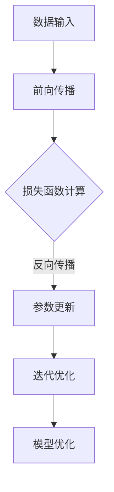

                 

在人工智能迅猛发展的今天，大模型成为技术领域的重要驱动力。它们不仅在数据分析和决策支持中扮演关键角色，还逐渐渗透到娱乐产业，带来了前所未有的新型娱乐方式。本文将探讨大模型时代下的新型娱乐方式，分析其技术原理、应用场景、未来趋势以及面临的挑战。

## 1. 背景介绍

### 大模型的崛起

大模型，或称为大型人工智能模型，指的是那些具有数百万甚至数十亿参数的深度学习模型。例如，GPT-3拥有1750亿个参数，BERT包含数亿参数。这些模型通过大规模数据训练，具备了处理复杂任务的能力。大模型的出现标志着人工智能技术进入了一个新纪元，也为各行各业的创新提供了强大动力。

### 娱乐产业的变革

娱乐产业长期以来依赖技术进步，从传统的电影、音乐到现代的电子游戏、社交媒体等，都在不断寻求创新和变革。大模型的应用，使得娱乐产业能够以前所未有的方式创造和提供内容，从而吸引了更多用户。例如，基于大模型的虚拟角色可以模拟真实的社交互动，个性化推荐系统则能够提供更加精准的内容推荐。

## 2. 核心概念与联系

### 大模型的工作原理

大模型的核心在于其深度神经网络架构。通过多层神经元之间的加权连接和激活函数，模型可以自动学习数据的复杂模式。在训练过程中，模型通过反向传播算法不断调整参数，以达到最优性能。以下是大模型工作原理的Mermaid流程图：



### 大模型在娱乐中的应用

大模型在娱乐产业中的应用涵盖了多个方面，包括但不限于：

- **虚拟角色**：利用大模型生成的虚拟角色可以模拟人类行为，提供互动体验。
- **音乐创作**：大模型可以分析大量的音乐数据，生成新的音乐作品。
- **游戏AI**：大模型能够提升游戏AI的智能水平，提供更加逼真的游戏体验。
- **内容推荐**：大模型能够分析用户行为和偏好，提供个性化的娱乐内容推荐。

## 3. 核心算法原理 & 具体操作步骤

### 3.1 算法原理概述

大模型的核心算法是基于深度学习。深度学习是一种多层神经网络模型，通过学习数据特征来实现复杂的任务。以下是深度学习的基本步骤：

- **初始化参数**：为模型中的每个参数随机分配一个初始值。
- **前向传播**：将输入数据通过网络的各个层进行传播，并生成输出。
- **损失函数计算**：比较模型输出和真实值之间的差异，计算损失。
- **反向传播**：通过反向传播算法更新模型参数，以减少损失。
- **迭代优化**：重复以上步骤，直到模型达到预定的性能指标。

### 3.2 算法步骤详解

1. **数据预处理**：对输入数据进行标准化和归一化，以便模型更好地学习。
2. **模型构建**：定义神经网络的结构，包括层数、每层的神经元数量以及激活函数。
3. **训练**：使用训练数据集训练模型，调整参数以最小化损失函数。
4. **评估**：使用验证数据集评估模型性能，调整超参数以达到最佳效果。
5. **部署**：将训练好的模型部署到生产环境，提供娱乐服务。

### 3.3 算法优缺点

**优点**：

- **强大的学习能力**：大模型能够从大量数据中学习，实现高精度的预测和生成。
- **灵活性**：大模型可以应用于各种不同的任务，具有广泛的适应性。
- **高度自动化**：大模型的训练和优化过程高度自动化，减少了人工干预。

**缺点**：

- **计算资源消耗**：大模型训练需要大量的计算资源，成本较高。
- **数据隐私问题**：大模型在训练过程中需要处理大量数据，可能涉及用户隐私问题。
- **模型解释性差**：大模型的决策过程复杂，难以解释。

### 3.4 算法应用领域

大模型在娱乐产业中的应用领域广泛，包括但不限于：

- **虚拟现实**：利用大模型生成逼真的虚拟环境和角色。
- **音乐和艺术创作**：通过大模型创作个性化的音乐和艺术作品。
- **游戏开发**：提升游戏AI的智能水平，提供更加逼真的游戏体验。
- **内容推荐**：基于用户行为和偏好，提供个性化的娱乐内容推荐。

## 4. 数学模型和公式 & 详细讲解 & 举例说明

### 4.1 数学模型构建

大模型的数学基础主要包括概率论、线性代数和微积分。以下是构建大模型所需的几个关键数学模型：

- **神经元激活函数**：例如，Sigmoid函数和ReLU函数。
- **损失函数**：例如，均方误差（MSE）和交叉熵损失。
- **优化算法**：例如，梯度下降和Adam优化器。

### 4.2 公式推导过程

以下是构建深度神经网络所需的一些关键数学公式：

- **前向传播公式**：

$$
z_l = \sigma(W_l \cdot a_{l-1} + b_l)
$$

其中，$z_l$ 是第$l$层的输出，$W_l$ 是权重矩阵，$a_{l-1}$ 是前一层输出，$b_l$ 是偏置项，$\sigma$ 是激活函数。

- **反向传播公式**：

$$
\delta_l = \frac{\partial J}{\partial z_l}
$$

其中，$\delta_l$ 是第$l$层的误差梯度，$J$ 是损失函数。

### 4.3 案例分析与讲解

以下是一个简单的例子，展示如何使用大模型生成音乐：

- **数据集**：使用大量的音乐数据进行训练。
- **模型构建**：构建一个深度神经网络，包括输入层、隐藏层和输出层。
- **训练**：使用梯度下降算法训练模型，调整参数以最小化损失函数。
- **生成**：使用训练好的模型生成新的音乐作品。

## 5. 项目实践：代码实例和详细解释说明

### 5.1 开发环境搭建

在搭建开发环境时，需要安装Python、TensorFlow等工具。以下是一个简单的安装命令：

```bash
pip install tensorflow
```

### 5.2 源代码详细实现

以下是一个简单的Python代码示例，展示如何使用TensorFlow构建一个深度神经网络：

```python
import tensorflow as tf

# 定义模型结构
model = tf.keras.Sequential([
    tf.keras.layers.Dense(128, activation='relu', input_shape=(784,)),
    tf.keras.layers.Dense(10, activation='softmax')
])

# 编译模型
model.compile(optimizer='adam',
              loss='categorical_crossentropy',
              metrics=['accuracy'])

# 训练模型
model.fit(x_train, y_train, epochs=5)
```

### 5.3 代码解读与分析

以上代码首先定义了一个包含一个隐藏层和输出层的神经网络。隐藏层有128个神经元，使用ReLU激活函数。输出层有10个神经元，使用softmax激活函数，用于分类任务。模型使用Adam优化器进行编译，并使用均方误差（MSE）作为损失函数。最后，模型使用训练数据集进行训练。

### 5.4 运行结果展示

在训练完成后，可以使用以下代码评估模型性能：

```python
test_loss, test_acc = model.evaluate(x_test, y_test)
print(f"Test accuracy: {test_acc}")
```

## 6. 实际应用场景

### 6.1 虚拟角色

虚拟角色是大模型在娱乐产业中的一个重要应用。通过大模型生成虚拟角色，可以实现高度个性化的互动体验。例如，虚拟角色可以根据用户的行为和偏好，模拟真实的社交互动，提供个性化的娱乐内容。

### 6.2 音乐创作

大模型可以分析大量的音乐数据，生成新的音乐作品。例如，通过训练一个基于大模型的音乐生成器，可以生成各种风格的音乐，甚至可以根据用户的反馈进行调整。

### 6.3 游戏开发

大模型可以提升游戏AI的智能水平，提供更加逼真的游戏体验。例如，通过训练一个基于大模型的游戏AI，可以让AI角色在游戏中表现出更加复杂的行为，从而提升游戏的可玩性。

### 6.4 内容推荐

大模型可以分析用户的行为和偏好，提供个性化的娱乐内容推荐。例如，通过训练一个基于大模型的内容推荐系统，可以为用户提供符合其兴趣的内容，从而提升用户的娱乐体验。

## 7. 工具和资源推荐

### 7.1 学习资源推荐

- 《深度学习》（Goodfellow, Bengio, Courville著）：这是一本深度学习领域的经典教材，适合初学者和专业人士。
- TensorFlow官方文档：TensorFlow是深度学习领域最受欢迎的框架之一，其官方文档提供了详细的教程和API文档。

### 7.2 开发工具推荐

- PyCharm：PyCharm是一款强大的Python开发工具，提供了丰富的功能，适合深度学习和人工智能开发。
- Jupyter Notebook：Jupyter Notebook是一款交互式的开发环境，适合编写和分享代码和文档。

### 7.3 相关论文推荐

- "A Theoretical Analysis of the Categorization of Neural Network Loss Functions"
- "Generative Adversarial Nets"
- "Attention Is All You Need"

## 8. 总结：未来发展趋势与挑战

### 8.1 研究成果总结

大模型在娱乐产业中的应用取得了显著的成果。通过虚拟角色、音乐创作、游戏开发和内容推荐等多种方式，大模型为用户提供了更加丰富和个性化的娱乐体验。

### 8.2 未来发展趋势

随着大模型技术的不断发展，我们可以预见其在娱乐产业中的应用将更加广泛和深入。例如，通过结合虚拟现实和增强现实技术，大模型可以实现更加沉浸式的娱乐体验。

### 8.3 面临的挑战

尽管大模型在娱乐产业中具有巨大的潜力，但仍面临着一些挑战。包括计算资源消耗、数据隐私保护和模型解释性等问题。

### 8.4 研究展望

未来的研究应关注如何提高大模型的效率和可解释性，同时确保数据隐私和安全。此外，探索大模型在虚拟现实、增强现实和混合现实等新兴领域中的应用，也将是重要的发展方向。

## 9. 附录：常见问题与解答

### 9.1 大模型训练需要多少时间？

大模型的训练时间取决于多个因素，包括模型的规模、硬件性能和训练数据的数量。通常，训练一个大型模型需要几天到几周的时间。

### 9.2 大模型是否具有普遍性？

大模型在特定任务上表现出色，但并不具有普遍性。每个模型都是针对特定任务和数据进行训练的，因此在不同的任务上性能可能有所不同。

### 9.3 大模型是否能够替代人类创造者？

大模型可以生成各种内容，但它们并不能完全替代人类创造者。人类创造者具有独特的创造力、情感和价值观，这是大模型无法替代的。

----------------------------------------------------------------

作者：禅与计算机程序设计艺术 / Zen and the Art of Computer Programming

<|im_end|>

