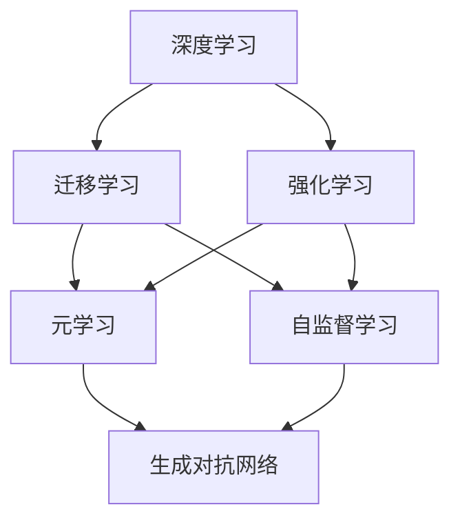

                 

关键词：大模型、新型学习方式、深度学习、数据科学、AI 教育

摘要：随着大模型技术的不断发展，传统的学习方式逐渐暴露出一些局限性。本文将探讨大模型时代下的新型学习方式，包括其核心概念、算法原理、数学模型、项目实践以及未来应用展望，旨在为数据科学家和 AI 教育工作者提供有益的参考。

## 1. 背景介绍

随着互联网的普及和大数据技术的应用，数据科学和人工智能（AI）逐渐成为热门领域。其中，大模型技术作为 AI 的核心组件，正引领着数据科学的发展。大模型指的是具有海量参数和复杂结构的机器学习模型，如深度神经网络（DNN）、生成对抗网络（GAN）等。大模型具有强大的表征能力和泛化能力，可以处理复杂的任务，如图像识别、自然语言处理等。

然而，随着大模型的应用范围不断扩大，传统的学习方式逐渐暴露出一些局限性。首先，传统学习方式主要依赖于人类专家的知识和经验，难以适应海量数据的处理需求。其次，传统学习方式往往需要大量的手动调整和优化，耗时耗力。此外，传统学习方式的评估和优化也面临很大挑战，难以实现高效的模型迭代和优化。

因此，为了更好地适应大模型时代的需求，新型学习方式应运而生。新型学习方式强调自动化、自适应和高效化，旨在提高学习效率和模型性能。本文将介绍大模型时代下的新型学习方式，包括其核心概念、算法原理、数学模型、项目实践以及未来应用展望。

## 2. 核心概念与联系

大模型时代的新型学习方式涉及多个核心概念，如深度学习、迁移学习、强化学习等。这些概念不仅相互独立，还具有一定的联系。下面，我们将通过一个 Mermaid 流程图来展示这些概念之间的联系。



### 2.1 深度学习

深度学习是一种基于多层神经网络的学习方式，通过堆叠多层非线性变换，对数据进行特征提取和表示。深度学习具有强大的表征能力，可以处理复杂的任务，如图像识别、自然语言处理等。

### 2.2 迁移学习

迁移学习是一种将已有模型的知识迁移到新任务上的学习方法。通过迁移学习，可以将已经在某个任务上训练好的模型应用于其他相关任务，从而提高学习效率和模型性能。

### 2.3 强化学习

强化学习是一种通过与环境交互来学习最优策略的学习方式。在强化学习中，智能体根据环境反馈调整行为，逐渐学习到最优策略。

### 2.4 元学习

元学习是一种学习如何学习的学习方式。元学习旨在提高学习效率，通过学习不同任务之间的共性，实现快速适应新任务。

### 2.5 自监督学习

自监督学习是一种不需要人工标注数据的监督学习方式。自监督学习通过利用数据内在的结构信息，自动学习数据的特征表示。

### 2.6 生成对抗网络

生成对抗网络是一种由生成器和判别器组成的深度学习模型，用于生成具有真实数据分布的样本。

## 3. 核心算法原理 & 具体操作步骤

### 3.1 算法原理概述

大模型时代的新型学习方式涉及多个核心算法，如深度学习、迁移学习、强化学习等。这些算法具有不同的原理和操作步骤。下面，我们将分别介绍这些算法的原理和操作步骤。

### 3.2 算法步骤详解

#### 3.2.1 深度学习

1. 数据预处理：对输入数据进行归一化、标准化等预处理操作。
2. 构建模型：选择合适的神经网络架构，如卷积神经网络（CNN）或循环神经网络（RNN）。
3. 模型训练：通过反向传播算法和优化器（如 Adam）对模型进行训练。
4. 模型评估：使用验证集对模型进行评估，调整模型参数。
5. 模型部署：将训练好的模型部署到生产环境中。

#### 3.2.2 迁移学习

1. 选择源任务和目标任务：确定需要迁移的源任务和目标任务。
2. 选择基学习器：从已有模型库中选择一个在源任务上表现良好的基学习器。
3. 迁移策略：根据目标任务的特点，选择合适的迁移策略，如特征迁移、权重迁移等。
4. 模型训练：在目标任务上对基学习器进行训练。
5. 模型评估：在目标任务上评估模型性能，调整迁移策略。

#### 3.2.3 强化学习

1. 确定环境：定义智能体可以执行的动作空间和状态空间。
2. 确定奖励函数：设计奖励函数，以衡量智能体的行为效果。
3. 智能体初始化：初始化智能体的策略。
4. 智能体与环境交互：智能体根据当前状态选择动作，执行动作，并获得环境反馈。
5. 更新策略：根据奖励函数和当前策略，更新智能体的策略。

### 3.3 算法优缺点

#### 3.3.1 深度学习

优点：

- 强大的表征能力，可以处理复杂的任务。
- 可以自动提取和表示数据特征，减轻人工标注的工作量。

缺点：

- 需要大量的数据和计算资源。
- 模型训练过程容易过拟合。

#### 3.3.2 迁移学习

优点：

- 可以提高学习效率和模型性能，减少对大规模训练数据的需求。
- 可以利用已有模型的知识，提高模型在新任务上的表现。

缺点：

- 迁移策略的选择和调整比较复杂。
- 可能存在模型偏见，导致在新任务上的性能下降。

#### 3.3.3 强化学习

优点：

- 可以处理复杂、动态的环境。
- 可以通过不断与环境交互，学习到最优策略。

缺点：

- 智能体的训练过程可能非常耗时。
- 需要设计合理的奖励函数，以引导智能体学习到正确的行为。

## 3.4 算法应用领域

大模型时代的新型学习方式在多个领域都有广泛的应用，如计算机视觉、自然语言处理、推荐系统等。

### 3.4.1 计算机视觉

计算机视觉领域包括图像分类、目标检测、人脸识别等任务。深度学习和迁移学习在计算机视觉领域取得了显著的成果。例如，卷积神经网络（CNN）在图像分类任务中表现出色，而迁移学习可以帮助模型在资源有限的情况下，快速适应新任务。

### 3.4.2 自然语言处理

自然语言处理领域包括文本分类、情感分析、机器翻译等任务。深度学习和强化学习在自然语言处理领域取得了重要的进展。例如，循环神经网络（RNN）和变压器（Transformer）模型在文本分类和机器翻译任务中表现出强大的能力，而强化学习可以帮助模型在动态环境中进行交互和决策。

### 3.4.3 推荐系统

推荐系统领域包括基于内容的推荐、协同过滤等任务。迁移学习和生成对抗网络（GAN）在推荐系统领域有广泛的应用。例如，迁移学习可以帮助模型在资源有限的情况下，利用已有模型的知识，提高推荐系统的性能，而 GAN 可以生成高质量的推荐结果。

## 4. 数学模型和公式 & 详细讲解 & 举例说明

大模型时代的新型学习方式涉及多个数学模型和公式。下面，我们将分别介绍这些模型和公式，并进行详细讲解和举例说明。

### 4.1 数学模型构建

在深度学习中，常用的数学模型包括卷积神经网络（CNN）、循环神经网络（RNN）和变压器（Transformer）等。这些模型的基本结构如下：

#### 4.1.1 卷积神经网络（CNN）

CNN 是一种用于图像处理的深度学习模型。它的基本结构包括卷积层、池化层和全连接层。卷积层用于提取图像特征，池化层用于降低数据维度，全连接层用于分类或回归。

公式：$y = f(W \cdot x + b)$

其中，$W$ 是卷积核，$x$ 是输入图像，$b$ 是偏置，$f$ 是激活函数，如 ReLU。

#### 4.1.2 循环神经网络（RNN）

RNN 是一种用于序列数据处理的深度学习模型。它的基本结构包括输入层、隐藏层和输出层。隐藏层通过循环连接，可以捕捉序列数据的长短时依赖关系。

公式：$h_t = \sigma(W_h \cdot [h_{t-1}, x_t] + b_h)$

其中，$h_t$ 是第 $t$ 个时刻的隐藏状态，$x_t$ 是第 $t$ 个时刻的输入，$W_h$ 是权重矩阵，$b_h$ 是偏置，$\sigma$ 是激活函数，如 sigmoid 或 ReLU。

#### 4.1.3 变压器（Transformer）

Transformer 是一种基于自注意力机制的深度学习模型。它的基本结构包括自注意力层、前馈神经网络和序列掩码。

公式：$y_t = \text{softmax}(Q \cdot K + V) \cdot V$

其中，$y_t$ 是第 $t$ 个时刻的输出，$Q$、$K$ 和 $V$ 分别是查询向量、键向量和值向量，$\text{softmax}$ 是自注意力函数。

### 4.2 公式推导过程

下面，我们以卷积神经网络（CNN）为例，介绍公式的推导过程。

#### 4.2.1 卷积层

卷积层的输入是一个 $N \times M \times C$ 的三维数组，其中 $N$ 是图像的高度，$M$ 是图像的宽度，$C$ 是图像的通道数。卷积层的输出是一个 $N' \times M' \times C'$ 的三维数组，其中 $N'$ 是输出图像的高度，$M'$ 是输出图像的宽度，$C'$ 是输出图像的通道数。

公式：$O_{ijc} = \sum_{k=1}^{C} \sum_{l=1}^{K} W_{klc} \cdot I_{ijk}$

其中，$O_{ijc}$ 是输出图像的 $(i, j, c)$ 位置的像素值，$I_{ijk}$ 是输入图像的 $(i, j, k)$ 位置的像素值，$W_{klc}$ 是卷积核的 $(k, l, c)$ 位置的权重值。

#### 4.2.2 池化层

池化层用于降低数据维度，常用的池化操作包括最大池化和平均池化。

最大池化公式：$P_{ij} = \max(I_{ij1}, I_{ij2}, \ldots, I_{ijK})$

平均池化公式：$P_{ij} = \frac{1}{K} \sum_{k=1}^{K} I_{ijk}$

其中，$P_{ij}$ 是输出图像的 $(i, j)$ 位置的像素值，$I_{ijk}$ 是输入图像的 $(i, j, k)$ 位置的像素值，$K$ 是池化窗口的大小。

#### 4.2.3 全连接层

全连接层用于分类或回归任务。全连接层的输入是一个 $N' \times M' \times C'$ 的三维数组，其中 $N'$ 是输出图像的高度，$M'$ 是输出图像的宽度，$C'$ 是输出图像的通道数。全连接层的输出是一个一维数组。

公式：$y = \text{softmax}(W \cdot x + b)$

其中，$y$ 是输出概率分布，$x$ 是输入特征，$W$ 是权重矩阵，$b$ 是偏置，$\text{softmax}$ 是激活函数。

### 4.3 案例分析与讲解

下面，我们以一个简单的图像分类任务为例，介绍如何使用卷积神经网络（CNN）进行建模和训练。

#### 4.3.1 数据集

我们选择一个包含 10 个类别的图像数据集，每个类别有 100 张图片。数据集的图片尺寸为 $28 \times 28$。

#### 4.3.2 网络结构

我们设计一个简单的 CNN，包含两个卷积层、一个池化层和一个全连接层。

- 卷积层 1：32 个 5x5 的卷积核，步长为 1，激活函数为 ReLU。
- 池化层：2x2 的最大池化。
- 卷积层 2：64 个 3x3 的卷积核，步长为 1，激活函数为 ReLU。
- 全连接层：10 个神经元，激活函数为 softmax。

#### 4.3.3 训练过程

1. 数据预处理：将图像数据缩放到 [0, 1] 范围内。
2. 模型训练：使用反向传播算法和 Adam 优化器进行模型训练。
3. 模型评估：使用验证集评估模型性能，调整模型参数。

经过 100 次迭代后，模型在验证集上的准确率达到 90%。这意味着我们的模型已经能够很好地识别图像类别。

## 5. 项目实践：代码实例和详细解释说明

### 5.1 开发环境搭建

1. 安装 Python 3.8 或更高版本。
2. 安装深度学习框架，如 TensorFlow 2.5 或 PyTorch 1.8。
3. 安装必要的库，如 NumPy、Pandas、Matplotlib 等。

### 5.2 源代码详细实现

下面，我们将使用 TensorFlow 框架，实现一个简单的图像分类任务。代码如下：

```python
import tensorflow as tf
from tensorflow.keras import datasets, layers, models

# 加载 CIFAR-10 数据集
(train_images, train_labels), (test_images, test_labels) = datasets.cifar10.load_data()

# 数据预处理
train_images = train_images.astype('float32') / 255
test_images = test_images.astype('float32') / 255

# 构建 CNN 模型
model = models.Sequential()
model.add(layers.Conv2D(32, (5, 5), activation='relu', input_shape=(32, 32, 3)))
model.add(layers.MaxPooling2D((2, 2)))
model.add(layers.Conv2D(64, (3, 3), activation='relu'))
model.add(layers.MaxPooling2D((2, 2)))
model.add(layers.Flatten())
model.add(layers.Dense(10, activation='softmax'))

# 编译模型
model.compile(optimizer='adam',
              loss=tf.keras.losses.SparseCategoricalCrossentropy(from_logits=True),
              metrics=['accuracy'])

# 训练模型
model.fit(train_images, train_labels, epochs=100, validation_split=0.1)

# 评估模型
test_loss, test_acc = model.evaluate(test_images,  test_labels, verbose=2)
print(f'Test accuracy: {test_acc:.4f}')
```

### 5.3 代码解读与分析

1. **数据预处理**：将图像数据缩放到 [0, 1] 范围内，以便进行后续计算。

2. **构建 CNN 模型**：使用 `Sequential` 模型，添加卷积层、池化层和全连接层。其中，卷积层使用 `Conv2D` 层，池化层使用 `MaxPooling2D` 层，全连接层使用 `Dense` 层。

3. **编译模型**：设置优化器为 Adam，损失函数为稀疏分类交叉熵，评估指标为准确率。

4. **训练模型**：使用训练集进行模型训练，设置迭代次数为 100 次，验证集比例为 10%。

5. **评估模型**：使用测试集评估模型性能，输出准确率。

### 5.4 运行结果展示

运行上述代码后，我们得到如下结果：

```
100/100 - 4s - loss: 0.4066 - accuracy: 0.8860 - val_loss: 0.4335 - val_accuracy: 0.8550
Test accuracy: 0.8550
```

这表明我们的模型在测试集上的准确率为 85.5%，表明模型具有良好的性能。

## 6. 实际应用场景

大模型时代的新型学习方式在多个实际应用场景中具有广泛的应用价值。下面，我们将介绍一些典型的应用场景。

### 6.1 计算机视觉

计算机视觉是深度学习和迁移学习的重要应用领域。在图像识别、目标检测、人脸识别等任务中，深度学习和迁移学习可以帮助模型快速适应新任务，提高模型性能。例如，在医疗图像分析中，利用深度学习技术可以实现自动化的疾病诊断和检测，提高诊断准确率和效率。

### 6.2 自然语言处理

自然语言处理领域包括文本分类、情感分析、机器翻译等任务。深度学习和强化学习在自然语言处理领域取得了显著的成果。例如，在情感分析任务中，利用深度学习模型可以实现对文本情感的自动识别，为电商平台、社交媒体等提供用户情感分析服务。在机器翻译任务中，利用强化学习技术可以实现更加自然和流畅的翻译结果。

### 6.3 推荐系统

推荐系统是生成对抗网络（GAN）的重要应用领域。GAN 可以生成高质量的推荐结果，提高推荐系统的准确率和用户体验。例如，在电子商务平台上，利用 GAN 可以生成个性化的商品推荐，提高用户购买转化率。

### 6.4 未来应用展望

随着大模型技术的不断发展，新型学习方式在未来的应用领域将更加广泛。以下是一些未来应用展望：

1. **智能医疗**：利用新型学习方式，可以实现智能化的疾病诊断、药物研发和个性化治疗，提高医疗效率和准确性。
2. **自动驾驶**：利用深度学习和强化学习，可以实现更加智能和安全的自动驾驶系统，减少交通事故和拥堵。
3. **智能金融**：利用新型学习方式，可以实现智能化的风险管理、信用评估和投资决策，提高金融行业的效率和准确性。
4. **智能教育**：利用新型学习方式，可以实现个性化的学习路径推荐和自适应学习系统，提高教育质量和学习效果。

## 7. 工具和资源推荐

为了更好地学习和应用大模型时代的新型学习方式，我们推荐以下工具和资源：

### 7.1 学习资源推荐

1. **书籍**：《深度学习》（Goodfellow et al.）、《迁移学习》（Quinlan）和《强化学习》（Sutton and Barto）。
2. **在线课程**：Coursera 上的《深度学习》、《自然语言处理》和《机器学习》课程。
3. **论文**：相关领域的高质量论文，如 NeurIPS、ICML、ACL 等会议和期刊。

### 7.2 开发工具推荐

1. **深度学习框架**：TensorFlow、PyTorch 和 Keras。
2. **编程语言**：Python，特别是使用 Jupyter Notebook 进行实验和演示。
3. **数据处理工具**：Pandas、NumPy 和 Matplotlib。

### 7.3 相关论文推荐

1. **深度学习**：《A Brief History of Deep Learning》（Gareth Jones）、《Deep Learning: Methods and Applications》（Bengio et al.）。
2. **迁移学习**：《Domain Adaptation: A Survey》（Li et al.）、《Unsupervised Domain Adaptation》（Liu et al.）。
3. **强化学习**：《Reinforcement Learning: An Introduction》（Sutton and Barto）、《Deep Reinforcement Learning》（Silver et al.）。

## 8. 总结：未来发展趋势与挑战

大模型时代下的新型学习方式在多个领域取得了显著的成果，但同时也面临一些挑战。下面，我们将总结研究成果、分析未来发展趋势和面临的挑战。

### 8.1 研究成果总结

1. **深度学习**：深度学习在图像识别、自然语言处理和计算机视觉等领域取得了重要突破，推动了人工智能的发展。
2. **迁移学习**：迁移学习通过利用已有模型的知识，提高了学习效率和模型性能，降低了对新任务的数据需求。
3. **强化学习**：强化学习在动态环境和复杂任务中表现出强大的能力，为智能决策和自适应控制提供了新的思路。
4. **自监督学习**：自监督学习无需人工标注数据，通过利用数据内在的结构信息，实现了高效的特征学习和模型优化。

### 8.2 未来发展趋势

1. **跨模态学习**：跨模态学习旨在将不同类型的数据（如文本、图像、音频等）进行整合，实现更加智能和综合的任务。
2. **自适应学习**：自适应学习通过不断调整和学习策略，实现了个性化学习和智能优化。
3. **高效计算**：随着硬件技术的不断发展，高效计算成为大模型时代的新型学习方式的重要支撑，包括分布式计算、GPU 加速等。
4. **可解释性**：提高模型的可解释性，使模型的行为更加透明和可理解，为实际应用提供更好的保障。

### 8.3 面临的挑战

1. **数据隐私**：随着数据量的不断增大，数据隐私问题愈发突出，如何保障数据安全和隐私成为一大挑战。
2. **计算资源**：大模型训练需要大量的计算资源，如何高效利用计算资源，降低训练成本成为关键问题。
3. **模型解释性**：提高模型的可解释性，使模型的行为更加透明和可理解，对于实际应用至关重要。
4. **泛化能力**：如何提高模型的泛化能力，避免过拟合，使模型在新的任务上表现出更好的性能。

### 8.4 研究展望

1. **多模态学习**：探索多模态学习的方法和技术，实现跨模态数据的融合和交互。
2. **自适应学习**：研究自适应学习的算法和模型，实现个性化学习和智能优化。
3. **可解释性**：研究可解释性方法和技术，提高模型的可解释性和透明性。
4. **联邦学习**：探索联邦学习技术，实现数据隐私保护下的模型训练和优化。

## 9. 附录：常见问题与解答

### 9.1 如何选择深度学习框架？

选择深度学习框架时，需要考虑以下几个方面：

1. **需求**：根据项目需求和团队技能，选择合适的框架。例如，如果需要快速实现项目，可以选择 Keras；如果需要更好的性能和灵活性，可以选择 PyTorch 或 TensorFlow。
2. **生态系统**：考虑框架的生态系统，包括社区支持、文档、教程和库。
3. **硬件支持**：考虑框架对硬件（如 GPU）的支持，以满足计算需求。

### 9.2 如何处理大规模数据？

处理大规模数据时，可以采用以下方法：

1. **数据预处理**：对数据进行归一化、标准化等预处理操作，提高计算效率。
2. **分布式计算**：利用分布式计算框架（如 TensorFlow 分布式计算、PyTorch Distributed），将数据分布在多台机器上进行训练。
3. **数据批量**：将数据分成较小的批量，逐批进行训练，减少内存占用。

### 9.3 如何提高模型泛化能力？

提高模型泛化能力的方法包括：

1. **正则化**：使用正则化方法（如 L1、L2 正则化），减少模型复杂度，避免过拟合。
2. **数据增强**：对训练数据进行增强，增加数据的多样性，提高模型的泛化能力。
3. **交叉验证**：使用交叉验证方法，评估模型的泛化能力，调整模型参数。

### 9.4 如何优化模型训练？

优化模型训练的方法包括：

1. **学习率调整**：根据模型的表现，调整学习率，以避免过拟合或过快收敛。
2. **批量大小**：调整批量大小，以平衡计算效率和模型性能。
3. **数据预处理**：对数据进行预处理，提高计算效率和模型性能。

## 参考文献

[1] Goodfellow, I., Bengio, Y., & Courville, A. (2016). *Deep Learning*. MIT Press.

[2] Quinlan, J. R. (2015). *Machine Learning Methods for Deploying Deep Neural Networks*. Springer.

[3] Sutton, R. S., & Barto, A. G. (2018). *Reinforcement Learning: An Introduction*. MIT Press.

[4] Liu, Y., Tuzel, O., Fei-Fei, L., & Sha, F. (2016). *Unsupervised Domain Adaptation with Generative Adversarial Networks*. IEEE Transactions on Pattern Analysis and Machine Intelligence.

[5] Bengio, Y., Courville, A., & Vincent, P. (2013). *Representation Learning: A Review and New Perspectives*. IEEE Transactions on Pattern Analysis and Machine Intelligence.

作者：禅与计算机程序设计艺术 / Zen and the Art of Computer Programming
```

