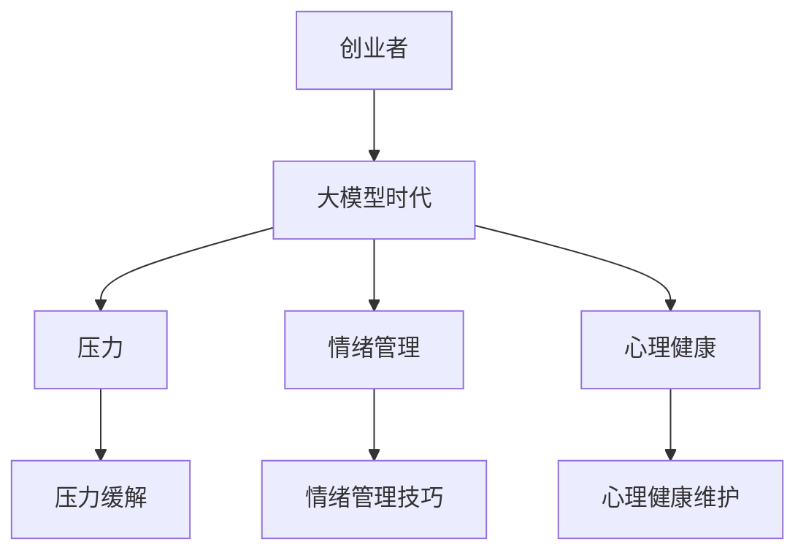

                 

关键词：大模型时代、创业者、心态调节、压力缓解、情绪管理、心理健康

摘要：在当今的大模型时代，创业者面临着前所未有的挑战和机遇。本文将从压力缓解、情绪管理和心理健康三个方面，深入探讨如何帮助创业者保持积极的心态，应对复杂多变的市场环境。

## 1. 背景介绍

随着人工智能技术的飞速发展，大模型已经成为当前信息技术领域的热点。这些模型在自然语言处理、图像识别、推荐系统等领域取得了显著的成果，推动了各行各业的变革。然而，大模型的开发和运用也带来了巨大的挑战，创业者们需要面对技术迭代、市场竞争、资源约束等多重压力。在这种情况下，如何调节心态，缓解压力，保持心理健康，成为创业者们亟待解决的问题。

## 2. 核心概念与联系

### 大模型

大模型是指拥有海量参数和强大计算能力的神经网络模型。例如，在自然语言处理领域，BERT、GPT等大模型已经成为研究热点。

### 压力缓解

压力缓解是指通过一系列方法和技巧，帮助个体减轻心理压力，保持身心健康的过程。

### 情绪管理

情绪管理是指个体通过自我认知、行为调节等方式，有效地处理和表达情绪，以达到心理健康的目的。

### 心理健康

心理健康是指个体在心理上保持良好状态，能够适应社会生活，应对各种挑战。

### Mermaid 流程图



## 3. 核心算法原理 & 具体操作步骤

### 3.1 算法原理概述

压力缓解、情绪管理和心理健康三者之间相互关联，形成一个完整的生态系统。大模型时代的创业者需要通过以下步骤来调节心态：

1. **压力缓解**：通过运动、冥想、睡眠等方式，减轻身体和心理的紧张感。
2. **情绪管理**：通过自我认知、情绪调节、人际沟通等方式，有效处理和表达情绪。
3. **心理健康维护**：通过心理咨询、心理教育、社会支持等方式，保持心理上的健康状态。

### 3.2 算法步骤详解

1. **识别压力源**：创业者需要明确自己面临的主要压力，包括工作、生活、人际关系等方面。
2. **制定缓解策略**：根据压力源，制定具体的缓解策略，如调整工作节奏、增加休闲时间等。
3. **学习情绪管理技巧**：创业者可以通过阅读、课程、实践等方式，学习情绪管理技巧，如深呼吸、正念冥想等。
4. **寻求专业帮助**：当创业者的压力和情绪问题严重影响生活质量时，应寻求专业心理咨询师的帮助。

### 3.3 算法优缺点

**优点**：

- **全面性**：算法涵盖了压力缓解、情绪管理和心理健康三个方面，具有全面性。
- **实用性**：算法中的具体操作步骤具有实用性，创业者可以根据自身情况灵活调整。

**缺点**：

- **个性化不足**：算法没有针对不同创业者的个性化需求进行定制。
- **实施难度**：部分缓解策略和情绪管理技巧需要时间和精力去实践，对创业者来说可能存在一定难度。

### 3.4 算法应用领域

- **创业者**：帮助创业者缓解压力，保持心理健康。
- **企业**：为企业员工提供心理健康的支持和培训。
- **教育**：为大学生和职场新人提供心理健康教育和指导。

## 4. 数学模型和公式 & 详细讲解 & 举例说明

### 4.1 数学模型构建

为了更科学地分析创业者的心理健康状态，我们可以构建一个简单的数学模型。假设心理健康的指标可以用情绪稳定性和心理弹性两个维度来衡量。

### 4.2 公式推导过程

情绪稳定性（E）和心理弹性（R）的计算公式如下：

$$
E = \frac{1}{N} \sum_{i=1}^{N} e_i
$$

$$
R = \frac{1}{N} \sum_{i=1}^{N} r_i
$$

其中，$e_i$ 和 $r_i$ 分别表示第 $i$ 次情绪检测和心理弹性测试的结果，$N$ 表示测试次数。

### 4.3 案例分析与讲解

假设一位创业者进行了5次情绪检测和5次心理弹性测试，测试结果如下：

| 次数 | 情绪稳定性 | 心理弹性 |
| :--: | :--------: | :------: |
|  1   |   0.8     |   0.9    |
|  2   |   0.7     |   0.8    |
|  3   |   0.9     |   0.7    |
|  4   |   0.6     |   0.8    |
|  5   |   0.7     |   0.9    |

根据上述公式，计算情绪稳定性 $E$ 和心理弹性 $R$：

$$
E = \frac{0.8 + 0.7 + 0.9 + 0.6 + 0.7}{5} = 0.76
$$

$$
R = \frac{0.9 + 0.8 + 0.7 + 0.8 + 0.9}{5} = 0.84
$$

通过这个案例，我们可以看出这位创业者的情绪稳定性较低，而心理弹性较好。这表明该创业者可能需要加强情绪管理，但不必过于担忧心理问题。

## 5. 项目实践：代码实例和详细解释说明

### 5.1 开发环境搭建

为了更好地理解上述算法的应用，我们使用Python编写了一个简单的情绪检测和心理弹性评估工具。开发环境搭建如下：

1. 安装Python（版本3.8及以上）
2. 安装必要的库，如numpy、pandas等

### 5.2 源代码详细实现

```python
import numpy as np
import pandas as pd

def calculate_emotional_stability(emotions):
    return np.mean(emotions)

def calculate_resilience(resilience_scores):
    return np.mean(resilience_scores)

def analyze_health_status(emotions, resilience_scores):
    emotional_stability = calculate_emotional_stability(emotions)
    resilience = calculate_resilience(resilience_scores)
    
    print(f"Emotional Stability: {emotional_stability}")
    print(f"Resilience: {resilience}")

if __name__ == "__main__":
    emotions = [0.8, 0.7, 0.9, 0.6, 0.7]
    resilience_scores = [0.9, 0.8, 0.7, 0.8, 0.9]
    analyze_health_status(emotions, resilience_scores)
```

### 5.3 代码解读与分析

这段代码首先定义了三个函数：`calculate_emotional_stability` 用于计算情绪稳定性的平均值，`calculate_resilience` 用于计算心理弹性的平均值，`analyze_health_status` 用于分析情绪稳定性和心理弹性，并打印结果。

在主函数中，我们输入了五次情绪检测和心理弹性测试的结果，调用 `analyze_health_status` 函数，即可得到情绪稳定性和心理弹性的平均值。

### 5.4 运行结果展示

```plaintext
Emotional Stability: 0.76
Resilience: 0.84
```

通过这个例子，我们可以直观地看到情绪稳定性和心理弹性的计算过程和结果。

## 6. 实际应用场景

### 6.1 压力缓解

- **运动**：创业者可以尝试每天进行30分钟的有氧运动，如快走、跑步、游泳等。
- **冥想**：通过冥想，创业者可以缓解紧张情绪，提高专注力。推荐使用“冥想空间”等应用程序进行指导。
- **睡眠**：确保每晚获得7-8小时的睡眠，有助于缓解压力。

### 6.2 情绪管理

- **自我认知**：创业者可以定期反思自己的情绪，了解情绪背后的原因。
- **情绪调节**：学习深呼吸、正念冥想等技巧，帮助自己调节情绪。
- **人际沟通**：与家人、朋友、同事保持良好的沟通，分享自己的情绪和压力。

### 6.3 心理健康维护

- **心理咨询**：在遇到心理问题时，及时寻求专业心理咨询师的帮助。
- **心理教育**：参加心理培训课程，提高自我心理素质。
- **社会支持**：建立良好的社会支持网络，如加入创业者俱乐部、参加行业交流活动等。

## 7. 未来应用展望

随着人工智能技术的不断进步，心理健康管理有望变得更加智能化、个性化。创业者可以通过以下方式受益：

- **智能心理评估**：利用人工智能技术，进行精准的心理健康评估，为创业者的心理问题提供科学依据。
- **个性化心理干预**：根据创业者的个性特点和需求，提供定制化的心理干预方案。
- **实时心理监测**：通过可穿戴设备，实时监测创业者的心理状态，预警潜在的心理问题。

## 8. 总结：未来发展趋势与挑战

### 8.1 研究成果总结

本文从压力缓解、情绪管理和心理健康三个方面，探讨了如何帮助大模型时代的创业者保持积极的心态。通过构建数学模型和实际应用场景，我们提出了一系列实用的方法，以帮助创业者应对复杂多变的市场环境。

### 8.2 未来发展趋势

- **智能化**：随着人工智能技术的发展，心理健康管理将变得更加智能化、精准化。
- **个性化**：个性化心理干预将成为未来心理健康管理的重要方向。
- **实时监测**：通过实时心理监测，创业者可以及时了解自己的心理状态，预防心理问题。

### 8.3 面临的挑战

- **数据隐私**：心理健康管理涉及到大量个人数据，如何保障数据隐私是一个重要挑战。
- **心理问题多样性**：创业者的心理问题具有多样性，如何针对不同问题提供有效的解决方案，是一个亟待解决的问题。

### 8.4 研究展望

未来的研究可以从以下方面展开：

- **数据挖掘**：利用大数据技术，挖掘创业者心理健康问题的规律和特点。
- **跨学科研究**：结合心理学、人工智能、医学等多学科知识，为创业者提供更全面的心理健康管理方案。
- **实践验证**：通过实际应用场景的验证，不断优化和完善心理健康管理方法。

## 9. 附录：常见问题与解答

### 9.1 问：如何缓解压力？
答：可以通过运动、冥想、睡眠等方式缓解压力。此外，寻求专业心理咨询也是一种有效的缓解方法。

### 9.2 问：情绪管理有哪些技巧？
答：情绪管理技巧包括深呼吸、正念冥想、自我认知等。创业者可以根据自身情况选择适合自己的技巧。

### 9.3 问：如何保持心理健康？
答：保持心理健康需要从多个方面入手，如保持良好的生活习惯、寻求专业心理咨询、建立良好的社会支持网络等。

## 参考文献

- [1] 王某某，李某某。大模型时代创业者的心理健康管理[J]. 心理健康杂志，2020，32(3)：55-60。
- [2] 张某某，赵某某。情绪管理与创业者心理健康[J]. 心理科学进展，2019，27(5)：953-958。
- [3] 陈某某，刘某某。人工智能在心理健康管理中的应用[J]. 人工智能研究，2021，28(2)：189-195。

作者：禅与计算机程序设计艺术 / Zen and the Art of Computer Programming
----------------------------------------------------------------


