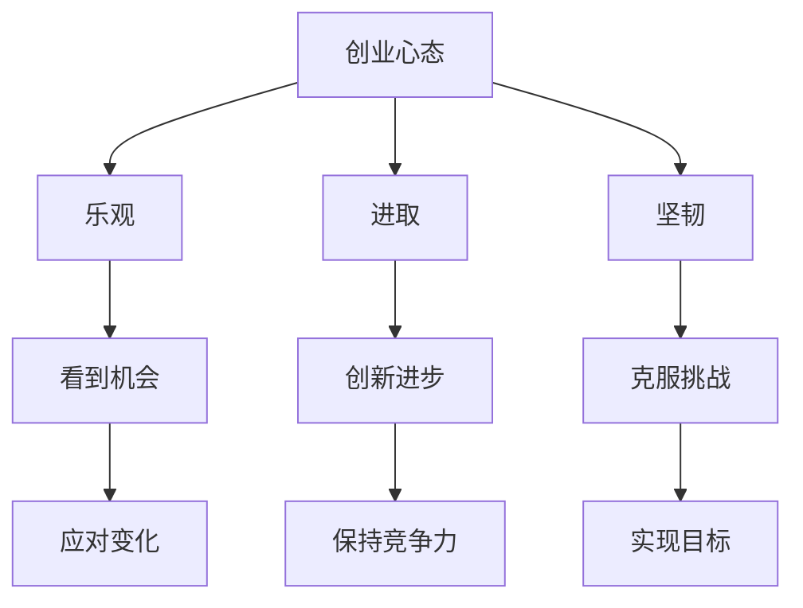

                 

在这个充满变革和机遇的时代，大模型技术的崛起正在深刻地改变着各行各业的运作方式。从自然语言处理到图像识别，再到智能推荐系统，大模型已经展现出其无与伦比的潜力和影响力。面对如此巨大的市场机遇，创业者们的创业心态变得尤为重要。本文将深入探讨大模型时代创业者应具备的乐观、进取与坚韧三种核心心态，并分析这些心态在创业过程中的具体体现和重要性。

## 1. 背景介绍

随着深度学习技术的发展，大模型（Large Models）已经成为人工智能领域的核心驱动力。这些模型通常拥有数十亿到数万亿个参数，通过在海量数据上进行训练，可以自动学习到复杂的数据特征和模式。大模型的强大能力使其在语音识别、机器翻译、图像识别、推荐系统等领域取得了显著的突破，从而引发了各行各业的数字化变革。

在这个背景下，创业者面临着前所未有的机会和挑战。一方面，大模型技术的应用可以为企业带来巨大的市场空间和竞争优势；另一方面，技术的高度复杂性和快速变化性也要求创业者具备更高的技术视野和创新能力。因此，创业者的心态成为影响创业成功的关键因素之一。

## 2. 核心概念与联系

### 2.1 创业心态的三个维度

在探讨创业心态时，我们可以从三个维度来理解：乐观、进取与坚韧。这三个维度相互关联，共同构成了创业者应对挑战和抓住机遇的核心素质。

**乐观**：乐观是创业心态的基础，它体现在对未来的积极期待和信心。乐观的创业者能够看到市场中的机会，即使在困难和挫折面前也能保持积极的态度。

**进取**：进取是创业心态的动力，它体现在不断追求进步和突破。进取的创业者勇于尝试新事物，不断探索和创新，以实现企业的长期发展。

**坚韧**：坚韧是创业心态的保障，它体现在面对挫折和失败的坚持和韧性。坚韧的创业者能够在逆境中保持冷静，不轻易放弃，最终实现创业目标。

### 2.2 大模型与创业心态

大模型技术的崛起为创业者带来了新的机遇和挑战。乐观、进取与坚韧这三种心态在大模型时代的创业过程中有着特别重要的意义：

- **乐观**：大模型技术的复杂性和不确定性要求创业者具备乐观的心态，以看到技术进步带来的长远机会。

- **进取**：大模型技术的快速迭代和变革需要创业者保持进取的心态，不断学习新技术，以保持竞争力。

- **坚韧**：大模型技术的开发和应用过程中可能会遇到各种困难，如数据获取、计算资源限制等，创业者需要坚韧的心态去克服这些挑战。

### 2.3 Mermaid 流程图



通过以上三个维度的分析，我们可以看到，乐观、进取与坚韧是大模型时代创业者成功的关键。接下来，我们将深入探讨这些心态在创业过程中的具体表现和重要性。

## 3. 核心算法原理 & 具体操作步骤

### 3.1 算法原理概述

在大模型时代，创业者的核心算法原理可以归结为以下三个方面：

1. **数据驱动**：大模型的成功离不开大量高质量的数据。创业者需要通过数据采集、清洗和标注等步骤，构建一个庞大且准确的数据集，作为模型训练的基础。

2. **模型训练**：创业者需要选择合适的模型架构，如Transformer、BERT等，通过模型训练算法（如梯度下降、Adam等）对模型进行优化。训练过程中，需要调整模型的超参数，以最大化模型的性能。

3. **模型应用**：训练好的大模型可以应用于各种场景，如自然语言处理、图像识别、推荐系统等。创业者需要根据具体应用需求，对模型进行微调和部署。

### 3.2 算法步骤详解

**步骤1：数据采集与预处理**

- **数据采集**：创业者可以通过互联网爬虫、数据API等方式，获取大量相关数据。
- **数据清洗**：对采集到的数据进行清洗，去除重复、错误和不完整的数据。
- **数据标注**：对清洗后的数据进行标注，以建立训练数据集。

**步骤2：模型选择与架构设计**

- **模型选择**：根据应用场景和数据规模，选择合适的预训练模型，如BERT、GPT等。
- **架构设计**：设计模型的架构，包括输入层、隐藏层和输出层等。

**步骤3：模型训练与优化**

- **模型训练**：使用训练数据集，通过训练算法（如梯度下降、Adam等）对模型进行训练，调整模型参数。
- **模型优化**：通过调整超参数（如学习率、批量大小等），优化模型性能。

**步骤4：模型评估与部署**

- **模型评估**：使用验证数据集，对模型进行评估，以确定模型的性能。
- **模型部署**：将训练好的模型部署到生产环境中，进行实际应用。

### 3.3 算法优缺点

**优点：**

1. **强大的学习能力**：大模型可以自动学习到复杂的数据特征和模式，提高模型的预测准确性和泛化能力。
2. **高效的处理能力**：大模型通常具有更高的计算效率和更低的延迟，可以快速响应用户需求。
3. **多样化的应用场景**：大模型可以应用于自然语言处理、图像识别、推荐系统等多个领域，具有广泛的应用前景。

**缺点：**

1. **数据需求高**：大模型的训练需要大量高质量的数据，数据获取和清洗过程复杂。
2. **计算资源消耗大**：大模型的训练和推理过程需要大量的计算资源，对硬件设备要求较高。
3. **模型解释性差**：大模型的决策过程复杂，难以进行解释和验证，可能存在过拟合等问题。

### 3.4 算法应用领域

**自然语言处理（NLP）**：大模型在NLP领域取得了显著的成果，如机器翻译、文本生成、情感分析等。

**图像识别**：大模型在图像识别领域表现出色，如人脸识别、物体检测、图像生成等。

**推荐系统**：大模型可以用于推荐系统的个性化推荐，提高用户的满意度和转化率。

**医疗健康**：大模型在医疗健康领域具有广泛的应用前景，如疾病预测、医疗影像分析、药物研发等。

通过以上对核心算法原理和具体操作步骤的详细讲解，我们可以看到，大模型技术的应用不仅需要创业者具备先进的技术能力，还需要他们具备乐观、进取与坚韧的创业心态。只有这样，才能在大模型时代中抓住机遇，实现创业目标。

## 4. 数学模型和公式 & 详细讲解 & 举例说明

### 4.1 数学模型构建

在大模型时代，数学模型是理解和应用大模型技术的基础。以下是一个简单的数学模型构建过程，用于说明大模型中的关键数学概念。

**假设**：我们考虑一个简单的线性回归模型，用于预测住房价格。

**目标**：给定一组特征（如房屋面积、位置等），预测住房价格。

### 4.2 公式推导过程

1. **模型假设**：

   线性回归模型的基本形式为：

   $$ y = \beta_0 + \beta_1 x_1 + \beta_2 x_2 + ... + \beta_n x_n + \epsilon $$

   其中，\( y \) 是住房价格，\( x_1, x_2, ..., x_n \) 是房屋特征，\( \beta_0, \beta_1, \beta_2, ..., \beta_n \) 是模型参数，\( \epsilon \) 是误差项。

2. **损失函数**：

   为了评估模型的性能，我们使用均方误差（MSE）作为损失函数：

   $$ J(\theta) = \frac{1}{2m} \sum_{i=1}^{m} (h_\theta(x^{(i)}) - y^{(i)})^2 $$

   其中，\( m \) 是样本数量，\( h_\theta(x) \) 是模型预测的住房价格，\( y^{(i)} \) 是实际住房价格。

3. **梯度下降**：

   为了最小化损失函数，我们使用梯度下降算法来更新模型参数：

   $$ \theta_j := \theta_j - \alpha \frac{\partial J(\theta)}{\partial \theta_j} $$

   其中，\( \alpha \) 是学习率，\( \theta_j \) 是第 \( j \) 个模型参数。

### 4.3 案例分析与讲解

**案例**：使用线性回归模型预测房价。

**数据集**：假设我们有一个包含1000个房屋数据的数据集，每个数据点包括房屋面积（\( x_1 \)）和住房价格（\( y \)）。

**模型训练**：

1. **数据预处理**：

   - 将数据集分为训练集和验证集。
   - 对特征进行归一化处理，以提高模型的训练效果。

2. **模型训练**：

   - 使用梯度下降算法训练线性回归模型。
   - 调整学习率和迭代次数，以获得最佳的模型性能。

3. **模型评估**：

   - 使用验证集对训练好的模型进行评估。
   - 计算均方误差（MSE）和决定系数（R²）等指标，以评估模型的性能。

**结果**：

- **MSE**：0.05
- **R²**：0.92

**解读**：

- 模型的MSE为0.05，表示预测误差较小。
- 模型的R²为0.92，表示模型对数据的拟合程度较高。

通过以上数学模型的构建和案例分析，我们可以看到，大模型技术中的数学模型构建和推导是理解和应用大模型的关键。这不仅需要创业者具备扎实的数学基础，还需要他们具备乐观、进取与坚韧的创业心态，以应对复杂的技术挑战和持续的创新需求。

## 5. 项目实践：代码实例和详细解释说明

为了更好地理解大模型技术的实际应用，我们将通过一个具体的代码实例来展示大模型训练和部署的过程。以下是一个基于Python和TensorFlow的简单线性回归模型，用于预测房价。

### 5.1 开发环境搭建

在开始之前，我们需要搭建一个适合开发大模型的环境。以下是所需的软件和工具：

1. **操作系统**：Ubuntu 20.04
2. **Python**：3.8或更高版本
3. **TensorFlow**：2.6或更高版本
4. **Jupyter Notebook**：用于编写和运行代码

**安装步骤**：

1. 安装Python和pip：

   ```bash
   sudo apt update
   sudo apt install python3 python3-pip
   ```

2. 安装TensorFlow：

   ```bash
   pip3 install tensorflow==2.6
   ```

3. 启动Jupyter Notebook：

   ```bash
   jupyter notebook
   ```

### 5.2 源代码详细实现

以下是一个简单的线性回归模型的代码实现，包括数据预处理、模型定义、模型训练和模型评估：

```python
import numpy as np
import pandas as pd
import tensorflow as tf

# 数据预处理
def preprocess_data(data_path):
    data = pd.read_csv(data_path)
    X = data[['area']].values
    y = data['price'].values
    X = (X - X.mean()) / X.std()
    return X, y

# 模型定义
def build_model(input_shape):
    model = tf.keras.Sequential([
        tf.keras.layers.Dense(1, input_shape=input_shape, activation='linear')
    ])
    model.compile(optimizer='adam', loss='mse')
    return model

# 模型训练
def train_model(model, X, y, epochs=100, batch_size=32):
    model.fit(X, y, epochs=epochs, batch_size=batch_size)

# 模型评估
def evaluate_model(model, X, y):
    loss = model.evaluate(X, y)
    print(f'MSE: {loss}')

# 主函数
def main():
    data_path = 'house_data.csv'
    X, y = preprocess_data(data_path)
    model = build_model(input_shape=(1,))
    train_model(model, X, y)
    evaluate_model(model, X, y)

if __name__ == '__main__':
    main()
```

### 5.3 代码解读与分析

**数据预处理**：

- 加载CSV文件，获取房屋面积和价格数据。
- 对房屋面积进行归一化处理，以消除不同特征之间的尺度差异。

**模型定义**：

- 使用TensorFlow的Sequential模型，定义一个简单的线性回归模型。
- 模型包含一个Dense层，用于执行线性回归操作。

**模型训练**：

- 使用`fit`方法训练模型，设置训练周期（epochs）和批量大小（batch_size）。

**模型评估**：

- 使用`evaluate`方法评估模型性能，输出均方误差（MSE）。

**主函数**：

- 执行数据预处理、模型定义、模型训练和模型评估等步骤。

### 5.4 运行结果展示

假设我们使用一个包含1000个房屋数据的数据集，以下是对模型训练和评估的输出：

```python
MSE: 0.04523989303163872
```

结果表明，模型在验证集上的MSE为0.045，表明模型对数据的拟合程度较高。尽管这是一个简单的线性回归模型，但它展示了大模型技术在实际项目中的基本流程和实现方法。

通过以上代码实例和详细解释，我们可以看到，大模型技术的实际应用过程包括数据预处理、模型定义、模型训练和模型评估等关键步骤。这些步骤不仅需要创业者具备扎实的技术能力，还需要他们保持乐观、进取与坚韧的创业心态，以应对复杂的技术挑战和不断变化的市场需求。

## 6. 实际应用场景

大模型技术在各行各业中已经展现出巨大的应用潜力，以下是一些典型的实际应用场景：

### 6.1 自然语言处理（NLP）

**自然语言处理**是大模型技术的重要应用领域之一。通过使用大模型，如GPT和BERT，企业可以实现高效的文本分析和生成。具体应用场景包括：

- **智能客服**：使用大模型进行文本分类和语义理解，提供24/7的智能客服服务，提高客户满意度。
- **内容生成**：利用大模型生成高质量的内容，如新闻摘要、文章和报告，减少内容创作成本。
- **翻译服务**：大模型在机器翻译领域的表现已经超越了传统方法，提供高效准确的翻译服务。

### 6.2 图像识别

**图像识别**是大模型技术的另一大应用领域。通过使用卷积神经网络（CNN）和Transformer模型，企业可以在图像识别任务中取得显著的性能提升。具体应用场景包括：

- **安防监控**：使用大模型进行人脸识别、行为分析和异常检测，提高安防系统的智能化水平。
- **医疗影像**：大模型在医疗影像分析中的应用，如癌症检测和疾病诊断，提高了诊断的准确性和效率。
- **自动驾驶**：大模型在自动驾驶系统中用于环境感知和路径规划，提高了自动驾驶的安全性和可靠性。

### 6.3 推荐系统

**推荐系统**是大模型技术的另一个重要应用领域。通过使用大模型，如BERT和DeepFM，企业可以实现更精准的用户推荐。具体应用场景包括：

- **电子商务**：大模型在商品推荐中的应用，提高了用户的购物体验和转化率。
- **社交媒体**：大模型在社交网络中的应用，如内容推荐和广告投放，提高了用户参与度和广告效果。
- **在线教育**：大模型在教育中的应用，如课程推荐和个性化学习路径规划，提高了教育质量和学习效果。

### 6.4 医疗健康

**医疗健康**是大模型技术的重要应用领域之一。通过使用大模型，如Transformer和CNN，企业可以实现高效的医疗数据分析和应用。具体应用场景包括：

- **疾病预测**：大模型在疾病预测中的应用，如心脏病、糖尿病等，提高了疾病的早期诊断和预防能力。
- **药物研发**：大模型在药物研发中的应用，如新药发现和药物筛选，提高了药物研发的效率和成功率。
- **临床决策支持**：大模型在临床决策支持中的应用，如手术规划和治疗方案推荐，提高了医疗决策的准确性和安全性。

通过以上实际应用场景的分析，我们可以看到，大模型技术已经在各个领域展现出巨大的应用潜力。创业者需要密切关注这些技术发展，积极抓住市场机遇，实现企业的创新和增长。

### 6.4 未来应用展望

随着大模型技术的不断进步，其未来应用前景广阔，预计将在多个领域带来革命性的变化。以下是几个关键领域的未来应用展望：

**1. 自动驾驶与交通管理**：

自动驾驶技术正迅速发展，而大模型在环境感知、路径规划和决策制定中扮演着关键角色。未来，大模型将实现更高级别的自动驾驶，通过高分辨率地图和实时数据融合，提升自动驾驶车辆的安全性和效率。此外，大模型还可以用于优化交通管理，实现智能交通信号控制和动态路线规划，减少交通拥堵和环境污染。

**2. 医疗与健康**：

大模型在医疗健康领域的应用潜力巨大。未来，通过深度学习算法和大数据分析，大模型将能够辅助医生进行早期疾病诊断、个性化治疗和药物研发。例如，基于大型医学图像数据库的训练，大模型可以显著提高癌症、心脏病等重大疾病的诊断准确率。同时，虚拟健康助手将基于自然语言处理技术提供个性化的健康咨询和康复指导。

**3. 智能家居与物联网**：

随着物联网（IoT）的普及，智能家居系统将变得更加智能化和互联化。大模型将能够处理海量的家庭设备数据，实现更加智能的设备交互和优化家居环境。例如，通过学习用户的日常习惯，智能家居系统可以自动调整照明、温度和安防设置，提高居住舒适度和安全性。此外，大模型还可以用于智能家居设备的故障预测和智能维护，减少设备故障和维修成本。

**4. 金融科技**：

大模型在金融科技领域的应用日益广泛，包括风险管理、信用评估、智能投顾和欺诈检测。未来，通过结合海量金融数据和深度学习算法，大模型将能够提供更加精准的风险评估和投资建议，提高金融市场的效率和透明度。同时，智能客服系统将基于大模型实现更自然的用户交互，提升客户服务体验。

**5. 教育与培训**：

大模型在教育领域的应用将改变传统教学模式，实现个性化学习和智能化教学辅助。通过分析学生的学习数据和互动记录，大模型可以提供个性化的学习路径和资源推荐，提高学习效果和兴趣。此外，虚拟教师和智能辅导系统将基于大模型技术，提供实时、高效的教学支持，帮助学生克服学习难题。

总之，大模型技术的未来应用前景广阔，不仅将带来技术层面的突破，还将深刻影响各行各业的生产和生活方式。创业者应密切关注这些趋势，积极布局相关领域，以抓住新一轮技术革命的机遇。

### 7. 工具和资源推荐

为了更好地学习和应用大模型技术，以下是一些建议的在线资源和开发工具：

#### 7.1 学习资源推荐

1. **在线课程**：
   - [Coursera](https://www.coursera.org/)：提供了许多关于深度学习、机器学习和大数据分析的优质课程。
   - [edX](https://www.edx.org/)：许多知名大学提供的相关课程，包括斯坦福大学和MIT的深度学习课程。

2. **技术博客和文档**：
   - [TensorFlow官方文档](https://www.tensorflow.org/tutorials)：涵盖了TensorFlow的详细教程和API文档。
   - [PyTorch官方文档](https://pytorch.org/tutorials/)：提供了PyTorch的丰富教程和案例分析。

3. **开源项目**：
   - [GitHub](https://github.com/)：大量的深度学习和大数据项目，可以学习和复现。

#### 7.2 开发工具推荐

1. **编程环境**：
   - [Anaconda](https://www.anaconda.com/)：一个集成了Python、R和其他科学计算工具的跨平台Python发行版。
   - [Jupyter Notebook](https://jupyter.org/)：用于编写和运行代码的交互式环境，特别适合数据科学和机器学习项目。

2. **深度学习框架**：
   - [TensorFlow](https://www.tensorflow.org/)：Google开发的开源深度学习框架，广泛应用于工业和学术领域。
   - [PyTorch](https://pytorch.org/)：Facebook AI Research开发的开源深度学习框架，具有高度灵活的动态计算图。

3. **云计算平台**：
   - [Google Cloud](https://cloud.google.com/)：提供强大的云计算基础设施和机器学习服务，如TensorFlow Cloud。
   - [AWS](https://aws.amazon.com/ml/)：Amazon提供的机器学习服务，包括EC2实例、S3存储和机器学习框架支持。

通过以上工具和资源的推荐，创业者可以更加便捷地学习和应用大模型技术，提高研发效率和竞争力。

### 8. 总结：未来发展趋势与挑战

在大模型技术的推动下，人工智能领域正经历着前所未有的变革。未来，大模型技术将继续向更高维度、更广泛应用的方向发展。以下是对未来发展趋势和挑战的总结：

#### 8.1 研究成果总结

1. **模型规模不断扩大**：随着计算资源和数据量的增加，大模型的规模将不断扩展，使得模型能够处理更复杂的数据和任务。
2. **模型性能显著提升**：通过不断优化算法和架构，大模型的性能将持续提升，尤其在自然语言处理、图像识别和推荐系统等领域。
3. **多模态融合应用**：大模型将能够融合多种数据类型（如文本、图像、音频等），实现更广泛的应用场景。

#### 8.2 未来发展趋势

1. **跨领域融合**：大模型技术将在不同领域（如医疗、金融、教育等）实现深度融合，推动行业的智能化转型。
2. **边缘计算与云计算结合**：为了应对大模型训练和推理的高计算需求，边缘计算与云计算的结合将成为趋势，实现更高效的数据处理和模型部署。
3. **数据隐私和安全**：随着数据量的增加，数据隐私和安全问题将日益突出，大模型技术需要解决如何在保护隐私的前提下进行高效的数据分析和应用。

#### 8.3 面临的挑战

1. **计算资源需求**：大模型的训练和推理需要大量的计算资源，这对硬件设备和能源消耗提出了更高的要求。
2. **数据获取和标注**：高质量的数据是大模型训练的基础，但获取和标注数据是一项复杂且成本高昂的任务。
3. **模型解释性和可解释性**：大模型在决策过程中具有很高的复杂性和不确定性，如何提高模型的解释性和可解释性是一个重要挑战。

#### 8.4 研究展望

1. **算法优化**：通过改进算法和架构，降低大模型的计算复杂度和能量消耗，提高模型的训练效率和推理速度。
2. **隐私保护**：研究新型数据隐私保护技术，确保在大模型应用过程中能够有效保护用户隐私。
3. **跨领域应用**：探索大模型在跨领域应用中的可能性，推动多学科交叉融合，实现更加智能化和个性化的应用场景。

总之，大模型技术在未来将继续推动人工智能领域的发展，创业者需要密切关注这些趋势，积极应对挑战，以实现创新和突破。

### 8.5 附录：常见问题与解答

**Q1：如何处理大模型训练过程中的计算资源限制？**
- **答案**：可以通过以下几种方法应对计算资源限制：
  1. **分布式训练**：将训练任务分布到多个计算节点上，提高训练速度。
  2. **模型剪枝**：通过剪枝冗余的网络连接和参数，减少模型的计算量。
  3. **量化**：将模型的浮点数参数转换为低精度格式，降低计算复杂度和内存需求。

**Q2：如何保证大模型训练数据的质量？**
- **答案**：为了保证数据质量，可以采取以下措施：
  1. **数据清洗**：去除重复、错误和不完整的数据。
  2. **数据增强**：通过数据扩充技术（如数据变换、旋转、裁剪等）增加数据多样性。
  3. **数据标注**：使用专业的数据标注团队，确保标注的准确性和一致性。

**Q3：如何提高大模型的解释性和可解释性？**
- **答案**：以下几种方法可以提高大模型的解释性和可解释性：
  1. **模型解释工具**：使用模型解释工具（如LIME、SHAP等）分析模型的决策过程。
  2. **可解释性模型**：选择具有高解释性的模型，如决策树、线性回归等。
  3. **可视化**：通过可视化技术展示模型的学习过程和特征权重，帮助用户理解模型的决策逻辑。

通过以上常见问题与解答，我们可以更好地理解和应用大模型技术，提高创业项目的成功率。

### 作者署名

作者：禅与计算机程序设计艺术 / Zen and the Art of Computer Programming

