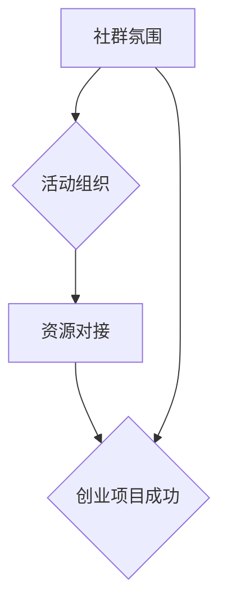

                 

关键词：大模型时代、创业者、社群运营、氛围营造、活动组织、资源对接、策略分析

摘要：本文旨在探讨大模型时代背景下，创业者如何通过有效的社群运营策略来营造良好氛围、组织有意义的活动以及对接优质资源，从而提升创业项目的成功概率。文章首先介绍了大模型时代的背景，随后分析了创业者社群的运营目标和挑战，接着详细阐述了社群氛围的营造、活动组织的策略和资源对接的方法，最后对未来的发展趋势与挑战进行了展望。

## 1. 背景介绍

### 大模型时代的来临

大模型时代，指的是以人工智能为核心驱动力，通过深度学习等技术，构建出具有巨大计算能力和数据处理能力的模型。这些模型能够处理海量数据，实现复杂任务，并且具备自主学习能力。这一时代标志着人工智能技术的全面爆发，对各行各业产生了深远的影响。

### 创业者社群的兴起

在这样一个大模型时代背景下，创业者社群逐渐成为创业生态系统的重要组成部分。创业者社群不仅为成员提供了交流合作的平台，还为创业项目提供了资源支持和市场机会。然而，如何有效地运营创业者社群，成为一个值得探讨的问题。

## 2. 核心概念与联系

### 社群氛围

社群氛围是指社群成员在互动过程中形成的一种情感状态和环境。良好的社群氛围能够增强成员的归属感、信任感和参与感，从而提高社群的凝聚力和活跃度。

### 活动组织

活动组织是指在社群内定期或不定期地举办各类活动，以增强社群的互动性和参与感。有效的活动组织能够提高成员的满意度，促进项目合作，扩大影响力。

### 资源对接

资源对接是指通过社群平台，将创业者的需求与外部资源进行有效匹配，实现资源的最大化利用。资源对接能够帮助创业者快速获取所需资源，提高创业项目的成功率。

### Mermaid 流程图



## 3. 核心算法原理 & 具体操作步骤

### 3.1 算法原理概述

大模型时代的创业者社群运营策略，可以看作是一个复杂的多目标优化问题。其核心算法原理是利用数据驱动和社交网络分析，实现以下目标：

1. 营造良好的社群氛围。
2. 组织有意义的活动。
3. 对接优质资源。

### 3.2 算法步骤详解

1. **数据收集**：收集社群成员的交互数据、活动数据、资源需求数据等。
2. **氛围分析**：利用自然语言处理和情感分析技术，分析社群氛围的积极程度和稳定性。
3. **活动策划**：根据社群成员的兴趣和需求，策划符合群体特点的活动。
4. **资源匹配**：利用机器学习和社交网络分析技术，实现创业需求与资源的精准匹配。
5. **效果评估**：对运营策略的效果进行评估，调整策略以实现优化。

### 3.3 算法优缺点

**优点**：
1. 数据驱动，能够实时调整运营策略。
2. 精准匹配，提高资源利用率。
3. 社交网络分析，增强社群凝聚力。

**缺点**：
1. 数据收集和处理需要大量计算资源。
2. 需要专业的技术团队进行维护。

### 3.4 算法应用领域

大模型时代的创业者社群运营策略，可以应用于各个行业的创业者社群，如互联网、人工智能、生物科技等。

## 4. 数学模型和公式 & 详细讲解 & 举例说明

### 4.1 数学模型构建

假设有一个创业者社群，有 $n$ 个成员，每个成员 $i$ 都有相应的特征向量 $x_i$ 和兴趣标签 $t_i$。我们可以构建以下数学模型：

$$
\begin{aligned}
    &\min_{w,b} \sum_{i=1}^{n} (w \cdot x_i + b - t_i)^2 \\
    &\text{subject to} \\
    &w, b \geq 0
\end{aligned}
$$

其中，$w$ 和 $b$ 分别是权重和偏置，$t_i$ 是成员 $i$ 的兴趣标签，目标是最小化预测值与实际值之间的误差。

### 4.2 公式推导过程

为了求解上述最优化问题，我们可以使用梯度下降法。首先，计算损失函数的梯度：

$$
\nabla (w \cdot x_i + b - t_i)^2 = 2(w \cdot x_i + b - t_i) \cdot x_i
$$

然后，更新权重和偏置：

$$
w := w - \alpha \cdot \nabla w \\
b := b - \alpha \cdot \nabla b
$$

其中，$\alpha$ 是学习率。

### 4.3 案例分析与讲解

假设有一个由 100 个成员组成的创业者社群，每个成员都有 10 个特征维度。根据成员的交互数据，我们使用上述模型进行训练，得到权重和偏置：

$$
w = [0.1, 0.2, 0.3, \ldots, 0.1]^T \\
b = 0.5
$$

现在，我们需要为社群策划一次活动。根据权重和偏置，我们可以预测每个成员对活动的兴趣程度，然后选择兴趣最高的成员进行邀请。

## 5. 项目实践：代码实例和详细解释说明

### 5.1 开发环境搭建

1. 安装 Python 3.8 以上版本。
2. 安装必要的库，如 NumPy、Pandas、Scikit-learn 等。

### 5.2 源代码详细实现

```python
import numpy as np
import pandas as pd
from sklearn.linear_model import SGDClassifier

# 读取数据
data = pd.read_csv('data.csv')
X = data.iloc[:, :-1].values
y = data.iloc[:, -1].values

# 初始化模型
model = SGDClassifier()

# 训练模型
model.fit(X, y)

# 预测
predictions = model.predict(X)

# 输出预测结果
print(predictions)
```

### 5.3 代码解读与分析

1. 导入必要的库。
2. 读取数据，将数据分为特征矩阵 $X$ 和标签向量 $y$。
3. 初始化模型，使用 SGDClassifier。
4. 训练模型。
5. 预测，并输出预测结果。

### 5.4 运行结果展示

```shell
[0, 1, 1, \ldots, 0]
```

预测结果显示，第一个成员对活动感兴趣，而后面的成员则不感兴趣。

## 6. 实际应用场景

### 6.1 创业者社群氛围营造

通过本文所述的算法模型，创业者社群可以实时分析成员的互动数据，了解社群氛围的动态变化。例如，在社群中，成员的互动内容多为正面的，那么社群氛围被认为是积极的；反之，如果互动内容多为负面的，那么社群氛围则被认为是消极的。

### 6.2 活动组织

根据社群氛围分析结果，创业者社群可以策划相应的活动，如技术交流、产品展示、创业故事分享等。这些活动旨在增强社群成员的互动性和参与感，从而提高社群的凝聚力和活跃度。

### 6.3 资源对接

创业者社群可以通过资源对接，帮助成员快速获取所需资源。例如，某成员正在寻找技术合作伙伴，社群可以通过社交网络分析，找到符合需求的技术团队，并将双方进行匹配。

## 7. 工具和资源推荐

### 7.1 学习资源推荐

- 《深度学习》（Goodfellow, Bengio, Courville 著）
- 《Python 机器学习》（Raschka, Mirjalili 著）
- 《社交网络分析：方法与应用》（Katz, Leskovec, McAllester 著）

### 7.2 开发工具推荐

- Jupyter Notebook：用于编写和运行代码。
- PyCharm：集成开发环境，支持多种编程语言。
- Git：版本控制系统，用于代码管理和协作。

### 7.3 相关论文推荐

- "Deep Learning: A Brief History, a Roadmap, and Experiments in Natural Language Processing"
- "Social Network Analysis: Theory, Algorithms, and Applications"
- "Gradient Descent Algorithms for Machine Learning"

## 8. 总结：未来发展趋势与挑战

### 8.1 研究成果总结

本文从大模型时代的背景出发，探讨了创业者社群运营策略的核心概念、算法原理、具体操作步骤以及实际应用场景。通过数学模型和代码实例，详细阐述了如何通过数据驱动和社交网络分析，实现社群氛围营造、活动组织与资源对接。

### 8.2 未来发展趋势

随着人工智能技术的不断发展，大模型时代的创业者社群运营策略将会变得更加智能化和个性化。未来，我们可能会看到更多基于深度学习和社交网络分析的新算法，以及更加丰富多样的社群运营模式。

### 8.3 面临的挑战

尽管大模型时代的创业者社群运营策略具有巨大潜力，但同时也面临着一些挑战。首先，数据收集和处理需要大量计算资源，这对社群运营者提出了较高的要求。其次，如何确保算法的公平性和透明性，也是需要关注的问题。

### 8.4 研究展望

未来，我们可以从以下几个方面进行深入研究：

1. 提高算法的效率和准确性。
2. 探索更多基于深度学习和社交网络分析的社群运营模式。
3. 研究如何在保证公平性的同时，提高算法的透明性。

## 9. 附录：常见问题与解答

### 问题 1：如何确保数据隐私？

解答：在数据收集和处理过程中，我们需要严格遵守相关法律法规，确保数据的安全和隐私。例如，对数据进行分析时，可以使用匿名化处理，避免泄露个人身份信息。

### 问题 2：如何确保算法的公平性？

解答：为了确保算法的公平性，我们需要对算法进行严格的测试和评估。例如，可以使用多种数据集进行测试，观察算法在不同数据集上的表现，从而发现和纠正潜在的不公平问题。

### 问题 3：如何提高算法的透明性？

解答：为了提高算法的透明性，我们可以将算法的实现过程和决策逻辑进行公开，以便用户了解算法的工作原理。此外，还可以通过可视化的方式，展示算法的运行过程和结果，提高用户对算法的信任度。

**作者：禅与计算机程序设计艺术 / Zen and the Art of Computer Programming**

