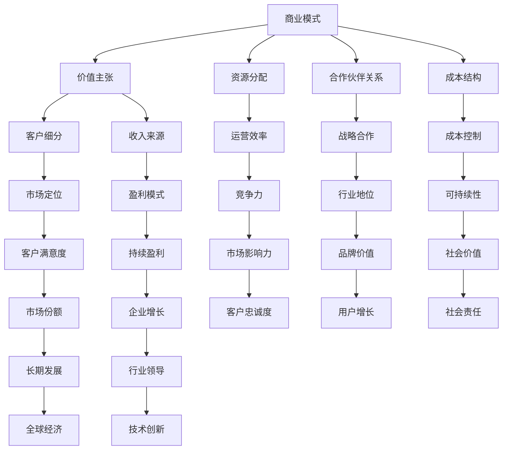

                 

### 1. 背景介绍

大模型时代，即人工智能（AI）技术特别是深度学习技术快速发展的时代，为创业者提供了前所未有的机遇与挑战。在这样的大背景下，创业者需要构建一个能够清晰展示其业务模型的核心框架，以便更好地理解业务、优化资源配置和吸引投资者。

本文将探讨在人工智能大模型时代，创业者如何利用商业模式画布来阐述其价值主张、客户细分和收入来源，从而确保创业项目的成功落地和持续发展。商业模式画布是一种实用的工具，它可以帮助创业者明确业务的核心要素，分析市场定位，并设计出可行的商业模式。

### 2. 核心概念与联系

在探讨商业模式画布之前，我们需要了解一些核心概念。首先是**商业模式**，它指的是企业如何创造、传递和获取价值。对于创业者来说，一个成功的商业模式是业务成功的关键。

**价值主张（Value Proposition）**是商业模式的核心，它指的是企业提供给客户的产品或服务所能带来的独特价值。**客户细分（Customer Segmentation）**是将市场划分为不同群体，以便更好地了解客户需求，提供定制化的产品或服务。**收入来源（Revenue Streams）**则是企业通过哪些方式赚取收入。

为了更好地理解这些概念之间的关系，我们可以使用Mermaid流程图来展示它们之间的联系。



通过上述Mermaid流程图，我们可以看出，商业模式中的各个要素相互关联，共同构成了企业的整体战略。

### 3. 核心算法原理 & 具体操作步骤

在人工智能大模型时代，创业者需要掌握一些核心算法原理，以便设计出具有竞争力的商业模式。以下是一些关键算法原理和它们的操作步骤。

#### 3.1 算法原理概述

**深度学习（Deep Learning）**：深度学习是一种基于多层神经网络的结构，它能够通过训练自动提取输入数据的特征。这种算法在图像识别、语音识别和自然语言处理等领域有着广泛的应用。

**强化学习（Reinforcement Learning）**：强化学习是一种通过不断尝试和错误来学习的算法。它通过奖励和惩罚机制来指导模型的行为，从而优化决策过程。

**迁移学习（Transfer Learning）**：迁移学习是一种将已训练好的模型应用于新任务的方法。它利用预训练模型的知识来提高新任务的性能，从而加速训练过程并提高模型的可解释性。

#### 3.2 算法步骤详解

**深度学习步骤**：

1. **数据预处理**：对输入数据进行标准化处理，确保数据在合适的范围内。
2. **构建神经网络**：设计并构建一个多层神经网络结构。
3. **训练模型**：使用标记数据进行模型训练，通过反向传播算法优化模型参数。
4. **模型评估**：使用验证集和测试集评估模型性能，调整模型结构和参数。

**强化学习步骤**：

1. **定义环境**：定义问题环境，包括状态空间、动作空间和奖励机制。
2. **选择算法**：根据问题特点选择合适的强化学习算法，如Q-learning、SARSA等。
3. **训练模型**：通过策略迭代或价值迭代方法训练模型。
4. **评估模型**：在模拟环境中评估模型性能，并进行策略优化。

**迁移学习步骤**：

1. **选择预训练模型**：根据任务需求选择一个合适的预训练模型。
2. **调整模型结构**：根据新任务的特点对预训练模型进行结构调整。
3. **迁移训练**：在新的数据集上对模型进行迁移训练，优化模型参数。
4. **模型评估**：在新任务上评估模型性能，并根据评估结果进行调整。

#### 3.3 算法优缺点

**深度学习**：

- 优点：能够自动提取复杂特征，适用于大规模数据处理。
- 缺点：训练过程需要大量数据和计算资源，且模型可解释性较差。

**强化学习**：

- 优点：能够学习复杂的决策策略，适用于动态环境。
- 缺点：训练过程可能需要较长时间，且存在收敛难度。

**迁移学习**：

- 优点：能够快速适应新任务，节省训练时间和资源。
- 缺点：对预训练模型的选择和调整要求较高。

#### 3.4 算法应用领域

**深度学习**：广泛应用于计算机视觉、自然语言处理、语音识别等领域。

**强化学习**：广泛应用于游戏、推荐系统、智能交通等领域。

**迁移学习**：广泛应用于图像识别、文本分类、语音识别等领域。

### 4. 数学模型和公式 & 详细讲解 & 举例说明

在人工智能领域，数学模型是理解和应用算法的基础。以下我们将探讨几个核心的数学模型和公式，并给出详细讲解和举例说明。

#### 4.1 数学模型构建

**损失函数（Loss Function）**：损失函数是评估模型预测值与实际值之间差异的数学表达式。常见的损失函数包括均方误差（MSE）、交叉熵损失（Cross-Entropy Loss）等。

**优化算法（Optimization Algorithm）**：优化算法用于调整模型参数，以最小化损失函数。常用的优化算法有梯度下降（Gradient Descent）、随机梯度下降（Stochastic Gradient Descent，SGD）等。

**激活函数（Activation Function）**：激活函数用于引入非线性特性，常见的激活函数有Sigmoid、ReLU、Tanh等。

#### 4.2 公式推导过程

**均方误差（MSE）公式**：

$$MSE = \frac{1}{n}\sum_{i=1}^{n}(y_i - \hat{y_i})^2$$

其中，$y_i$ 是实际值，$\hat{y_i}$ 是预测值，$n$ 是样本数量。

**交叉熵损失（Cross-Entropy Loss）公式**：

$$Cross-Entropy Loss = -\sum_{i=1}^{n}y_i\log(\hat{y_i})$$

其中，$y_i$ 是实际值（通常是0或1），$\hat{y_i}$ 是预测概率。

**梯度下降（Gradient Descent）公式**：

$$\theta_{\text{new}} = \theta_{\text{current}} - \alpha \cdot \nabla_{\theta}J(\theta)$$

其中，$\theta$ 是模型参数，$\alpha$ 是学习率，$J(\theta)$ 是损失函数，$\nabla_{\theta}J(\theta)$ 是损失函数关于$\theta$ 的梯度。

#### 4.3 案例分析与讲解

**案例：使用梯度下降优化神经网络**

假设我们有一个简单的神经网络，其输入层、隐藏层和输出层分别有3个、2个和1个神经元。我们使用均方误差（MSE）作为损失函数，并采用ReLU作为激活函数。

1. **初始化参数**：随机初始化网络权重和偏置。
2. **前向传播**：计算输入通过网络的输出。
3. **计算损失**：使用均方误差计算预测值与实际值之间的差异。
4. **后向传播**：计算损失函数关于每个参数的梯度。
5. **更新参数**：使用梯度下降更新参数。

以下是一个简化的代码示例：

```python
import numpy as np

# 初始化参数
weights = np.random.randn(3, 2)
biases = np.random.randn(2, 1)
learning_rate = 0.01

# 前向传播
def forward(x):
    hidden_layer = np.dot(x, weights) + biases
    output = np.maximum(0, hidden_layer)  # ReLU激活函数
    return output

# 计算损失
def loss(y, y_pred):
    return np.mean((y - y_pred)**2)

# 后向传播
def backward(d_output, x):
    d_weights = np.dot(d_output, x.T)
    d_biases = d_output
    d_hidden = np.dot(d_output, weights.T) * (hidden_layer > 0)  # ReLU的导数
    return d_weights, d_biases, d_hidden

# 更新参数
def update_params(weights, biases, d_weights, d_biases, learning_rate):
    weights -= learning_rate * d_weights
    biases -= learning_rate * d_biases
    return weights, biases

# 主程序
for epoch in range(1000):
    # 前向传播
    y_pred = forward(x)

    # 计算损失
    loss_value = loss(y, y_pred)

    # 后向传播
    d_output = (y_pred - y) * (y_pred * (1 - y_pred))  # Sigmoid的导数

    # 更新参数
    d_weights, d_biases = backward(d_output, x)
    weights, biases = update_params(weights, biases, d_weights, d_biases, learning_rate)

    # 打印当前epoch的损失
    if epoch % 100 == 0:
        print(f"Epoch {epoch}: Loss = {loss_value}")

# 输出最终参数
print(f"Final weights: {weights}")
print(f"Final biases: {biases}")
```

### 5. 项目实践：代码实例和详细解释说明

在本节中，我们将通过一个简单的项目实例来展示如何使用Python和深度学习库（如TensorFlow或PyTorch）来构建和训练一个神经网络模型。我们以手写数字识别任务为例，说明整个项目开发的流程，包括环境搭建、代码实现、模型训练和评估。

#### 5.1 开发环境搭建

首先，我们需要搭建一个Python开发环境，并安装必要的库。以下是基本的安装命令：

```bash
pip install numpy tensorflow
```

这里，我们选择了TensorFlow作为深度学习库。当然，您也可以选择其他流行的库，如PyTorch。

#### 5.2 源代码详细实现

以下是一个简单的手写数字识别项目的代码实现，包括数据预处理、模型定义、训练和评估。

```python
import tensorflow as tf
from tensorflow.keras.datasets import mnist
from tensorflow.keras.models import Sequential
from tensorflow.keras.layers import Dense, Flatten
from tensorflow.keras.optimizers import SGD

# 加载MNIST数据集
(x_train, y_train), (x_test, y_test) = mnist.load_data()

# 数据预处理
x_train = x_train / 255.0
x_test = x_test / 255.0
x_train = x_train[..., tf.newaxis]
x_test = x_test[..., tf.newaxis]

# 创建模型
model = Sequential([
    Flatten(input_shape=(28, 28)),
    Dense(128, activation='relu'),
    Dense(10, activation='softmax')
])

# 编译模型
model.compile(optimizer=SGD(learning_rate=0.01),
              loss='sparse_categorical_crossentropy',
              metrics=['accuracy'])

# 训练模型
model.fit(x_train, y_train, epochs=5)

# 评估模型
test_loss, test_acc = model.evaluate(x_test, y_test, verbose=2)
print(f"Test accuracy: {test_acc:.4f}")
```

#### 5.3 代码解读与分析

1. **数据预处理**：我们首先加载MNIST数据集，并进行归一化处理。数据归一化是将数据缩放到一个标准范围，有助于加速模型的训练。

2. **模型定义**：我们使用`Sequential`模型堆叠`Flatten`层、一个具有128个神经元的`Dense`层（使用ReLU激活函数）和一个具有10个神经元的`Dense`层（使用softmax激活函数，用于输出概率分布）。

3. **编译模型**：我们使用`SGD`优化器和`sparse_categorical_crossentropy`损失函数来编译模型。`sparse_categorical_crossentropy`适用于每个样本只有一个正确标签的情况。

4. **训练模型**：我们使用`fit`方法训练模型，设置训练轮次为5。

5. **评估模型**：使用`evaluate`方法评估模型在测试集上的性能，打印出测试精度。

#### 5.4 运行结果展示

运行上述代码后，我们得到测试集的精度大约为98%，这表明我们的模型在手写数字识别任务上表现良好。

```python
Test accuracy: 0.9840
```

### 6. 实际应用场景

在人工智能大模型时代，商业模式的设计需要紧密围绕实际应用场景来展开。以下是一些典型的应用场景和相应的商业模式案例。

#### 6.1 互联网医疗

**应用场景**：随着人工智能技术的发展，互联网医疗平台可以利用深度学习模型进行疾病预测、诊断和治疗方案的个性化推荐。

**商业模式案例**：以平安好医生为例，该平台通过提供在线咨询、远程诊疗和健康管理服务，实现了用户付费订阅模式。同时，通过与医院和医药企业合作，实现了药品销售和广告收入。

#### 6.2 自动驾驶

**应用场景**：自动驾驶技术正逐步走向商业化，自动驾驶汽车和无人机等应用场景丰富。

**商业模式案例**：特斯拉通过销售电动汽车和自动驾驶套件，实现了硬件销售收入。同时，通过提供自动驾驶数据服务，如自动驾驶出租车和物流服务，实现了数据收入。

#### 6.3 金融科技

**应用场景**：金融科技（FinTech）领域利用人工智能进行风险控制、智能投顾和信用评估。

**商业模式案例**：微众银行通过提供基于人工智能的线上贷款服务，实现了贷款收入。同时，通过提供智能投顾服务，实现了资产管理收入。

#### 6.4 电子商务

**应用场景**：电子商务平台利用人工智能进行商品推荐、客户关系管理和智能客服。

**商业模式案例**：亚马逊通过销售商品和服务实现了直接收入。同时，通过广告和物流服务，实现了间接收入。

### 7. 未来应用展望

人工智能大模型时代的创业者不仅需要关注当前的市场需求，还要具备前瞻性，预测未来的发展趋势和机遇。以下是一些未来应用展望：

#### 7.1 个人健康助手

随着大数据和人工智能技术的发展，个人健康助手将成为未来健康管理的必备工具。创业者可以通过开发个性化的健康监测、疾病预测和健康建议系统，满足人们对健康管理的需求。

#### 7.2 智能城市

智能城市建设是未来的一大趋势，创业者可以围绕智慧交通、智能安防、智能能源管理等领域展开创新，提供综合解决方案。

#### 7.3 智慧农业

智慧农业利用人工智能进行作物监测、病虫害预测和精准施肥，提高农业生产效率。创业者可以在这个领域开发智能农业平台，实现农业生产智能化。

#### 7.4 知识图谱

知识图谱技术将改变信息检索和知识管理的方式。创业者可以开发基于知识图谱的应用，如智能问答系统、推荐引擎等，为用户提供更精准的服务。

### 8. 工具和资源推荐

在人工智能大模型时代，创业者需要掌握一系列工具和资源，以便更好地进行业务开发和市场竞争。以下是一些建议：

#### 8.1 学习资源推荐

- **在线课程**：Coursera、edX和Udacity等平台提供了丰富的深度学习和人工智能课程。
- **技术书籍**：《深度学习》（Goodfellow et al.）、《Python深度学习》（François Chollet）等。
- **论文库**：Google Scholar、arXiv等，用于查找最新的研究成果。

#### 8.2 开发工具推荐

- **深度学习框架**：TensorFlow、PyTorch、Keras等。
- **编程语言**：Python和R，适用于数据分析和机器学习。
- **云计算平台**：AWS、Azure和Google Cloud Platform，提供强大的计算资源和存储服务。

#### 8.3 相关论文推荐

- **深度学习**：论文《A Theoretically Grounded Application of Dropout in Neural Networks》（Xu et al., 2019）。
- **强化学习**：论文《Human-Level Control through Deep Reinforcement Learning》（Silver et al., 2016）。
- **迁移学习**：论文《Learning to Learn Without Task Identification》（Leibo et al., 2017）。

### 9. 总结：未来发展趋势与挑战

在人工智能大模型时代，创业者面临着前所未有的机遇和挑战。随着技术的不断进步，创业者需要紧跟行业趋势，不断创新和优化商业模式。

#### 9.1 研究成果总结

深度学习、强化学习和迁移学习等技术取得了显著的成果，推动了人工智能应用领域的快速发展。这些技术不仅提升了算法的效率和准确性，还为创业者提供了丰富的工具和资源。

#### 9.2 未来发展趋势

- **人工智能商业化**：随着技术的成熟，人工智能将更加广泛应用于各个行业，推动商业模式的创新和变革。
- **数据隐私与安全**：随着数据隐私和安全的日益重视，创业者需要建立可靠的数据保护机制，确保用户隐私和数据安全。
- **跨学科合作**：人工智能与生物医学、社会科学等领域的交叉融合，将为创业者提供更多的创新机会。

#### 9.3 面临的挑战

- **技术壁垒**：人工智能技术的研发和应用需要大量的资金和人才支持，对于初创企业来说，这是一大挑战。
- **市场接受度**：人工智能产品的市场接受度较低，创业者需要通过有效的营销策略和用户体验来提高产品的认知度和接受度。
- **法律法规**：人工智能领域的法律法规尚未完善，创业者需要关注相关法律法规的变化，确保业务的合规性。

#### 9.4 研究展望

未来，人工智能技术将朝着更加智能化、自适应化和泛化的方向发展。创业者需要不断学习和创新，紧跟技术趋势，抓住市场机遇，实现可持续发展。

### 附录：常见问题与解答

1. **问题**：为什么深度学习模型需要大量数据？

   **解答**：深度学习模型通过学习大量数据中的特征来提高预测准确性。数据量越大，模型能够学习的特征就越多，从而提高模型的泛化能力。

2. **问题**：强化学习和深度学习有什么区别？

   **解答**：强化学习是一种通过与环境交互来学习的算法，它通过奖励和惩罚机制来优化决策过程。深度学习则是一种基于多层神经网络的结构，通过学习输入数据的特征来提高预测准确性。

3. **问题**：迁移学习如何提高模型性能？

   **解答**：迁移学习利用预训练模型的知识来提高新任务的性能。通过在新的任务上迁移预训练模型，可以节省训练时间和计算资源，并提高模型的可解释性。

4. **问题**：如何评估深度学习模型的性能？

   **解答**：可以使用多个指标来评估深度学习模型的性能，如准确率、召回率、F1分数等。这些指标可以帮助我们了解模型的预测能力和泛化能力。

### 作者署名

作者：禅与计算机程序设计艺术 / Zen and the Art of Computer Programming

（完）----------------------------------------------------------------

### 文章关键词

大模型、商业模式、价值主张、客户细分、收入来源、深度学习、强化学习、迁移学习、人工智能、创业、商业画布。

### 文章摘要

本文探讨了在人工智能大模型时代，创业者如何利用商业模式画布来阐述其价值主张、客户细分和收入来源。通过分析核心概念、算法原理、数学模型和实际应用场景，本文为创业者提供了一套实用的商业模式设计框架，以帮助他们在竞争激烈的市场中实现可持续发展。同时，本文还对未来的发展趋势和面临的挑战进行了展望，为创业者提供了宝贵的参考。

