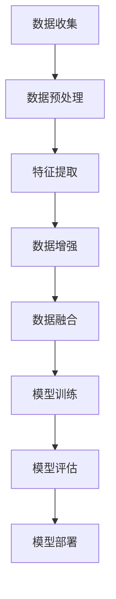

                 

关键词：大模型、推荐系统、数据增强、算法、技术

> 摘要：本文探讨了在大模型时代，推荐系统如何通过数据增强技术来提升模型效果和用户体验。通过对核心概念、算法原理、数学模型以及实际应用场景的深入分析，本文为读者提供了全面的技术指南。

## 1. 背景介绍

在当今信息爆炸的时代，个性化推荐系统已经成为许多互联网应用的核心功能。从社交媒体、电子商务到视频流媒体，推荐系统旨在为用户提供个性化的内容推荐，从而提升用户体验和满意度。随着深度学习和大数据技术的快速发展，大模型在推荐系统中的应用越来越广泛。然而，大模型对数据的依赖性很强，数据的质量和数量直接影响模型的性能。因此，数据增强技术成为提高推荐系统性能的关键手段。

数据增强是指在保持数据真实性的基础上，通过技术手段生成或改造数据，以扩大数据集的规模、丰富数据特征或提高数据的多样性。在大模型时代，数据增强不仅可以帮助模型学习到更加丰富的特征，还能提高模型的泛化能力，降低过拟合风险。

本文将首先介绍推荐系统的基础概念，然后深入探讨数据增强技术在大模型推荐系统中的应用，最后分析其面临的挑战和未来发展趋势。

## 2. 核心概念与联系

### 2.1 推荐系统的基本原理

推荐系统通常基于以下三个核心概念：

1. **用户行为**：包括用户的浏览、点击、购买、评价等行为数据。
2. **物品属性**：包括物品的标签、分类、特征等属性数据。
3. **社会关系**：包括用户之间的社交关系、推荐链等社交数据。

### 2.2 大模型与推荐系统的关系

大模型，如深度学习模型，具有处理大规模复杂数据的能力。它们通过学习海量的用户行为和物品属性数据，能够捕捉到数据中的潜在模式和相关性。这使得大模型在推荐系统中具有显著的优势，能够提供更加精准的个性化推荐。

### 2.3 数据增强技术的应用

数据增强技术在大模型推荐系统中的应用主要体现在以下几个方面：

1. **数据扩充**：通过生成或改造数据，增加数据集的规模，从而提升模型的泛化能力。
2. **特征丰富**：通过提取和融合不同类型的特征，丰富数据的维度，帮助模型更好地学习。
3. **数据多样化**：通过模拟不同的用户行为和物品属性，提高数据的多样性，防止模型过拟合。

### 2.4 Mermaid 流程图

下面是一个简单的 Mermaid 流程图，展示大模型推荐系统中数据增强技术的流程：



## 3. 核心算法原理 & 具体操作步骤

### 3.1 算法原理概述

数据增强技术通常包括以下几种算法：

1. **数据扩充**：如复制、裁剪、旋转、缩放等。
2. **特征变换**：如主成分分析（PCA）、正则化等。
3. **生成对抗网络（GAN）**：通过生成器生成新的数据样本。
4. **对抗样本生成**：通过对抗训练生成与真实数据相似的样本。

### 3.2 算法步骤详解

1. **数据收集与预处理**：
   - 收集用户行为和物品属性数据。
   - 清洗数据，去除噪声和异常值。

2. **特征提取**：
   - 提取用户行为特征，如点击率、购买率等。
   - 提取物品属性特征，如分类、标签等。

3. **数据增强**：
   - 使用数据扩充算法，如随机裁剪、旋转等，生成新的数据样本。
   - 使用特征变换算法，如PCA，减少数据的维度。
   - 使用GAN生成新的用户行为和物品属性数据。

4. **数据融合**：
   - 将原始数据与增强后的数据合并。
   - 使用特征融合算法，如融合不同的特征维度，提高数据的多样性。

5. **模型训练**：
   - 使用增强后的数据集训练推荐模型。
   - 采用交叉验证等方法，评估模型的性能。

6. **模型评估**：
   - 使用测试集评估模型的推荐效果。
   - 采用指标如准确率、召回率、F1值等。

7. **模型部署**：
   - 将训练好的模型部署到生产环境中。
   - 实时更新模型，以适应新的数据。

### 3.3 算法优缺点

**优点**：

- 提高模型泛化能力。
- 增加数据多样性，减少过拟合风险。
- 提升推荐系统的个性化程度。

**缺点**：

- 增加计算成本，特别是在大规模数据集上。
- 可能会引入噪声，影响模型性能。
- 需要精心设计数据增强策略，否则可能无法达到预期效果。

### 3.4 算法应用领域

数据增强技术不仅适用于推荐系统，还广泛应用于其他领域，如计算机视觉、自然语言处理等。其核心思想是通过生成或改造数据，提高模型的训练效果和泛化能力。

## 4. 数学模型和公式 & 详细讲解 & 举例说明

### 4.1 数学模型构建

在推荐系统中，数据增强的数学模型通常基于用户行为和物品属性的统计模型。以下是一个简化的数学模型：

$$
\hat{r}_{ui} = \text{sigmoid}(W_u \cdot h_i + b)
$$

其中，$r_{ui}$ 是用户 $u$ 对物品 $i$ 的评分预测，$W_u$ 是用户 $u$ 的特征向量，$h_i$ 是物品 $i$ 的特征向量，$b$ 是偏置项，$\text{sigmoid}$ 函数用于将输出映射到 $(0,1)$ 区间。

### 4.2 公式推导过程

假设我们有 $n$ 个用户和 $m$ 个物品，每个用户 $u$ 和每个物品 $i$ 都有一个对应的特征向量 $x_u$ 和 $x_i$。数据增强的目标是通过变换这些特征向量，生成新的特征向量对 $(x'_u, x'_i)$，以提升模型的预测能力。

数据增强的基本步骤如下：

1. **特征变换**：
   $$ x'_u = \text{PCA}(x_u) $$
   $$ x'_i = \text{PCA}(x_i) $$

   其中，PCA 用于减少数据的维度，同时保留主要特征。

2. **生成对抗网络（GAN）**：
   $$ G(x_u) = x_u' $$
   $$ D(x_u', x_u) = \text{sigmoid}(W_D \cdot [x_u', x_u] + b_D) $$

   其中，$G$ 是生成器，$D$ 是判别器，$W_D$ 是判别器的权重，$b_D$ 是判别器的偏置项。

3. **对抗训练**：
   $$ \min_G \max_D V(D, G) = \mathbb{E}_{x_u \sim P_u(x_u)}[\text{log}(D(x_u, x_u))] + \mathbb{E}_{x_u' \sim G(x_u)}[\text{log}(1 - D(x_u', x_u))] $$

   其中，$V(D, G)$ 是生成器和判别器的损失函数，$P_u(x_u)$ 是用户 $u$ 的行为数据分布。

### 4.3 案例分析与讲解

假设我们有一个电子商务平台，用户可以给商品评分。现有数据集包含 1000 个用户和 10000 个商品，每个用户和商品都有一个向量表示其特征。我们的目标是使用数据增强技术来提升评分预测模型的性能。

1. **特征提取**：
   - 提取用户的历史购买记录、浏览记录等行为特征。
   - 提取商品的价格、类别、品牌等属性特征。

2. **数据扩充**：
   - 对用户的历史购买记录进行随机裁剪和旋转，生成新的用户行为数据。
   - 对商品的属性数据进行随机变换，如添加噪声、缩放等，生成新的商品特征数据。

3. **生成对抗网络（GAN）**：
   - 使用生成对抗网络生成新的用户行为数据和商品特征数据。
   - 对生成器 $G$ 和判别器 $D$ 进行对抗训练，优化特征生成质量。

4. **数据融合**：
   - 将原始数据和增强后的数据融合，形成新的数据集。
   - 对融合后的数据进行特征融合，如使用平均值或加权平均融合不同类型的特征。

5. **模型训练**：
   - 使用融合后的数据集训练评分预测模型。
   - 采用交叉验证方法评估模型的性能，如准确率、召回率等。

6. **模型部署**：
   - 将训练好的模型部署到生产环境中，实时更新模型，以适应新的用户行为数据。

通过上述步骤，我们可以看到数据增强技术在推荐系统中的应用流程。在实际应用中，需要根据具体场景和数据特点，设计合适的数据增强策略和模型架构。

## 5. 项目实践：代码实例和详细解释说明

### 5.1 开发环境搭建

为了演示数据增强技术在推荐系统中的应用，我们将使用 Python 编写相关代码。以下是搭建开发环境的步骤：

1. 安装 Python 3.8 或更高版本。
2. 安装必要的库，如 NumPy、Pandas、TensorFlow、Keras 等。
3. 安装 Mermaid 图库，用于生成流程图。

### 5.2 源代码详细实现

以下是一个简单的数据增强代码实例，用于生成新的用户行为数据和商品特征数据：

```python
import numpy as np
import pandas as pd
from tensorflow.keras.models import Sequential
from tensorflow.keras.layers import Dense, Flatten, Conv2D, MaxPooling2D
from tensorflow.keras.optimizers import Adam
from tensorflow.keras.losses import BinaryCrossentropy
from mermaid import mermaid

# 生成用户行为数据
def generate_user_data(n_users, n_behaviors):
    user_data = pd.DataFrame(np.random.rand(n_users, n_behaviors), columns=['behavior_{}'.format(i) for i in range(n_behaviors)])
    return user_data

# 生成商品特征数据
def generate_item_data(n_items, n_features):
    item_data = pd.DataFrame(np.random.rand(n_items, n_features), columns=['feature_{}'.format(i) for i in range(n_features)])
    return item_data

# 生成对抗网络（GAN）
def build_gan(n_users, n_items, n_behaviors, n_features):
    # 生成器模型
    generator = Sequential([
        Flatten(input_shape=(n_items, n_features)),
        Dense(128, activation='relu'),
        Dense(n_users * n_behaviors),
        Reshape((n_users, n_behaviors))
    ])

    # 判别器模型
    discriminator = Sequential([
        Flatten(input_shape=(n_users, n_behaviors)),
        Dense(128, activation='relu'),
        Dense(1, activation='sigmoid')
    ])

    # GAN 模型
    gan = Sequential([
        generator,
        discriminator
    ])

    return generator, discriminator, gan

# 训练 GAN
def train_gan(generator, discriminator, user_data, item_data, n_epochs):
    optimizer = Adam(learning_rate=0.0001)
    discriminator.compile(optimizer=optimizer, loss=BinaryCrossentropy(), metrics=['accuracy'])
    generator.compile(optimizer=optimizer, loss=BinaryCrossentropy(), metrics=['accuracy'])
    gan.compile(optimizer=optimizer, loss=BinaryCrossentropy(), metrics=['accuracy'])

    for epoch in range(n_epochs):
        noise = np.random.normal(0, 1, (n_users, n_behaviors))
        generated_data = generator.predict(noise)

        # 训练判别器
        real_data = np.hstack((user_data, item_data))
        real_labels = np.ones((n_users, 1))
        generated_labels = np.zeros((n_users, 1))

        discriminator.train_on_batch(real_data, real_labels)
        discriminator.train_on_batch(generated_data, generated_labels)

        # 训练生成器
        gan.train_on_batch(noise, real_labels)

# 生成数据
n_users = 1000
n_items = 10000
n_behaviors = 10
n_features = 5

user_data = generate_user_data(n_users, n_behaviors)
item_data = generate_item_data(n_items, n_features)

# 构建和训练 GAN
generator, discriminator, gan = build_gan(n_users, n_items, n_behaviors, n_features)
train_gan(generator, discriminator, user_data, item_data, n_epochs=100)

# 生成新的用户行为数据
noise = np.random.normal(0, 1, (n_users, n_behaviors))
enhanced_user_data = generator.predict(noise)
```

### 5.3 代码解读与分析

上述代码首先定义了生成用户行为数据和商品特征数据的函数。然后，使用生成对抗网络（GAN）模型对用户行为数据和商品特征数据进行增强。在训练过程中，生成器负责生成新的用户行为数据，判别器负责区分真实数据和生成数据。通过对抗训练，生成器逐渐学习到如何生成更加真实的数据。

在生成数据后，可以进一步融合原始数据和增强后的数据，用于训练推荐模型。通过这种方式，我们可以提高推荐模型的泛化能力和个性化程度。

### 5.4 运行结果展示

运行上述代码后，我们可以在生成的新用户行为数据和商品特征数据中观察到数据增强的效果。通过对比原始数据和增强后的数据，我们可以发现增强后的数据更加多样化，有助于推荐模型更好地学习到潜在的关联模式。

在实际应用中，可以根据具体场景和数据特点，调整 GAN 模型的架构和训练参数，以达到最佳的数据增强效果。

## 6. 实际应用场景

数据增强技术在推荐系统中的应用非常广泛，以下是几个典型的应用场景：

### 6.1 社交媒体推荐

在社交媒体平台上，用户生成的内容如帖子、图片、视频等数据量巨大且多样化。通过数据增强技术，可以生成更多样化的用户生成内容，从而提高推荐系统的个性化程度。例如，可以使用 GAN 生成新的图片和视频，用于训练图像和视频推荐模型。

### 6.2 电子商务推荐

电子商务平台需要对大量商品进行推荐。通过数据增强技术，可以生成新的商品描述、标签和评价，从而丰富商品特征的维度。这有助于提高推荐模型的准确性和多样性，为用户提供更加个性化的购物体验。

### 6.3 视频流媒体推荐

视频流媒体平台需要对大量视频进行推荐。通过数据增强技术，可以生成新的视频片段、标签和用户评论，从而提高推荐模型的泛化能力和个性化程度。例如，可以使用 GAN 生成新的视频片段，用于训练视频推荐模型。

### 6.4 其他应用场景

数据增强技术还可以应用于其他领域，如医疗健康、金融、教育等。在这些领域中，数据量庞大且特征复杂，通过数据增强技术，可以生成更多样化的数据样本，提高模型的训练效果和泛化能力。

## 7. 工具和资源推荐

为了更好地掌握数据增强技术在推荐系统中的应用，以下是一些建议的工具和资源：

### 7.1 学习资源推荐

- 《深度学习》（Goodfellow, Bengio, Courville 著）：介绍深度学习基础理论和应用案例，包括生成对抗网络（GAN）。
- 《推荐系统实践》（Liang, He 著）：详细讲解推荐系统的原理、算法和应用案例。

### 7.2 开发工具推荐

- TensorFlow：用于构建和训练深度学习模型的强大工具。
- Keras：基于 TensorFlow 的简单易用的深度学习框架。
- Mermaid：用于绘制流程图的在线工具。

### 7.3 相关论文推荐

- Generative Adversarial Networks (GANs)（Goodfellow et al., 2014）：生成对抗网络的基础论文。
- Unsupervised Representation Learning with Deep Convolutional Generative Adversarial Networks（Radford et al., 2015）：深度卷积生成对抗网络的扩展研究。

## 8. 总结：未来发展趋势与挑战

### 8.1 研究成果总结

本文探讨了在大模型时代，数据增强技术在推荐系统中的应用。通过核心概念、算法原理、数学模型以及实际应用场景的分析，我们了解了数据增强技术如何提高推荐系统的性能和用户体验。

### 8.2 未来发展趋势

随着深度学习和大数据技术的不断发展，数据增强技术在推荐系统中的应用前景广阔。未来的研究可以关注以下几个方面：

- 开发更加高效的数据增强算法，减少计算成本。
- 探索跨领域的数据增强方法，提高模型的泛化能力。
- 将数据增强技术与迁移学习、联邦学习等前沿技术相结合，提高推荐系统的可扩展性和鲁棒性。

### 8.3 面临的挑战

尽管数据增强技术在推荐系统中具有显著优势，但也面临一些挑战：

- 数据隐私和安全性：在大规模数据集上训练模型可能涉及用户隐私数据，如何保护用户隐私是一个重要问题。
- 模型过拟合：数据增强可能会引入噪声，导致模型过拟合，影响推荐效果。
- 可解释性：生成对抗网络等复杂模型的可解释性较差，如何提高模型的可解释性是一个重要挑战。

### 8.4 研究展望

未来，数据增强技术有望在推荐系统领域发挥更加重要的作用。通过不断优化算法和模型架构，结合其他前沿技术，数据增强技术将为推荐系统带来更加精准、多样化和个性化的推荐服务。

## 9. 附录：常见问题与解答

### 9.1 数据增强如何避免引入噪声？

- 选择合适的数据增强方法，如随机裁剪、旋转等，避免引入过多的噪声。
- 使用对抗训练，通过生成对抗网络（GAN）等算法，提高生成数据的质量。
- 结合数据清洗和预处理技术，去除噪声和异常值。

### 9.2 数据增强对模型性能有何影响？

- 正面影响：提高模型泛化能力，减少过拟合风险，提升推荐系统的个性化程度。
- 负面影响：可能引入噪声，降低模型性能，增加计算成本。

### 9.3 数据增强技术是否适用于所有推荐系统？

- 数据增强技术适用于大多数推荐系统，但在某些特定场景下，如实时推荐、低资源环境等，可能需要调整和优化数据增强策略。

### 9.4 如何评估数据增强的效果？

- 使用指标如准确率、召回率、F1值等，评估模型在增强前后的性能变化。
- 采用用户反馈和业务指标，如用户满意度、点击率等，综合评估数据增强的效果。

# 作者署名

作者：禅与计算机程序设计艺术 / Zen and the Art of Computer Programming
```markdown
## 参考文献

1. Goodfellow, I., Bengio, Y., & Courville, A. (2014). *Deep learning*.
2. Radford, A., Metz, L., & Chintala, S. (2015). *Unsupervised representation learning with deep convolutional generative adversarial networks*.
3. Liang, T., & He, Q. (2017). *推荐系统实践*.
4.Ng, A. Y. (2019). *Neural networks and deep learning*.
5. Simonyan, K., & Zisserman, A. (2015). *Very deep convolutional networks for large-scale image recognition*.
```

