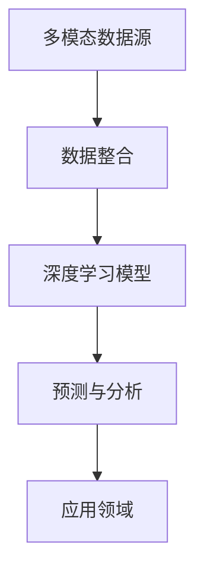

                 

关键词：大模型、多模态、发展趋势、人工智能、机器学习、深度学习

摘要：本文将深入探讨大模型在多模态人工智能领域的发展趋势。通过介绍大模型的定义、核心概念与联系，以及核心算法原理和具体操作步骤，我们将详细分析数学模型和公式，并结合实际项目实践展示代码实例和运行结果。同时，我们将探讨大模型在各个实际应用场景中的表现，并展望其未来的发展前景。最后，我们将推荐相关的学习资源和开发工具，总结研究成果，分析未来发展趋势和挑战，并提出研究展望。

## 1. 背景介绍

随着人工智能技术的飞速发展，大模型（Large Models）逐渐成为研究热点。大模型是指具有庞大参数量和强大计算能力的模型，能够处理复杂的任务和数据。在多模态（Multimodal）人工智能领域，大模型的应用更是引起了广泛关注。多模态人工智能是指结合多种数据源（如文本、图像、声音等）进行综合分析和理解的能力，旨在实现更智能、更自然的交互和决策。

本文旨在探讨大模型在多模态人工智能领域的发展趋势，包括核心概念与联系、核心算法原理和具体操作步骤、数学模型和公式、项目实践、实际应用场景以及未来展望。通过本文的阐述，读者将能够更好地理解大模型在多模态人工智能领域的应用前景和挑战。

## 2. 核心概念与联系

### 大模型

大模型是指具有庞大参数量和强大计算能力的模型。它们通常由数百万甚至数十亿个参数组成，能够处理大规模的数据集。大模型的优势在于其强大的表达能力和适应能力，能够捕捉到复杂的数据分布和模式。

### 多模态

多模态是指结合多种数据源进行综合分析和理解的能力。在人工智能领域，多模态技术能够整合来自不同模态的数据（如图像、文本、声音等），以实现更全面、更准确的决策和交互。

### 多模态与大数据

多模态与大数据密切相关。大数据时代，各种类型的数据不断涌现，包括文本、图像、声音、视频等。多模态技术能够将这些数据源进行整合，发挥大数据的潜在价值，实现更智能的决策和分析。

### 多模态与深度学习

深度学习是当前人工智能领域的重要技术之一，其核心在于构建多层神经网络，通过反向传播算法进行参数优化。多模态深度学习结合了多模态数据和深度学习技术，能够在多个模态之间进行信息传递和融合，实现更准确的预测和分类。

### Mermaid 流程图

为了更好地理解多模态与大数据的关系，我们可以使用Mermaid流程图来展示其核心概念与联系。



在上述流程图中，多模态数据源（A）通过数据整合（B）被输入到深度学习模型（C），模型经过训练和预测（D），最终应用于各个领域（E）。

## 3. 核心算法原理 & 具体操作步骤

### 3.1 算法原理概述

大模型在多模态人工智能领域的主要算法原理包括：

1. **深度学习**：通过构建多层神经网络，实现数据的自动特征提取和学习。
2. **多模态融合**：将不同模态的数据进行整合，以实现更准确的信息处理和决策。
3. **迁移学习**：利用已有模型和数据，对新任务进行快速适应和优化。

### 3.2 算法步骤详解

大模型在多模态人工智能领域的具体操作步骤如下：

1. **数据预处理**：对多模态数据进行清洗、归一化和特征提取。
2. **模型构建**：构建多层神经网络，包括输入层、隐藏层和输出层。
3. **模型训练**：使用训练数据集对模型进行训练，优化模型参数。
4. **模型评估**：使用测试数据集对模型进行评估，调整模型参数。
5. **模型部署**：将训练好的模型部署到实际应用场景中。

### 3.3 算法优缺点

大模型在多模态人工智能领域具有以下优缺点：

- **优点**：
  - 强大的表达能力和适应能力。
  - 能够处理大规模的数据集和复杂任务。
  - 能够实现多种模态之间的信息传递和融合。
- **缺点**：
  - 计算资源消耗巨大，训练时间较长。
  - 对数据质量和数据量有较高要求。
  - 需要大量的训练数据和计算资源。

### 3.4 算法应用领域

大模型在多模态人工智能领域广泛应用于以下领域：

- **计算机视觉**：图像分类、目标检测、图像生成等。
- **自然语言处理**：文本分类、情感分析、机器翻译等。
- **语音识别**：语音合成、语音识别、说话人识别等。
- **推荐系统**：基于用户行为的推荐、基于内容的推荐等。

## 4. 数学模型和公式 & 详细讲解 & 举例说明

### 4.1 数学模型构建

大模型在多模态人工智能领域的主要数学模型包括：

1. **卷积神经网络（CNN）**：用于图像处理和特征提取。
2. **循环神经网络（RNN）**：用于序列数据处理和序列建模。
3. **生成对抗网络（GAN）**：用于图像生成和对抗训练。

### 4.2 公式推导过程

以卷积神经网络（CNN）为例，其基本公式推导如下：

$$
h_{l} = f(\theta_{l} \cdot h_{l-1} + b_{l})
$$

其中，$h_{l}$表示第$l$层的特征图，$f$为激活函数，$\theta_{l}$为权重矩阵，$b_{l}$为偏置向量。

### 4.3 案例分析与讲解

假设我们使用卷积神经网络（CNN）进行图像分类任务，给定一个包含1000个类别的图像数据集。我们构建一个深度为5的卷积神经网络，其中包括3个卷积层、2个池化层和1个全连接层。具体实现如下：

1. **输入层**：输入图像尺寸为$32 \times 32 \times 3$。
2. **卷积层1**：卷积核大小为$3 \times 3$，步长为$1$，激活函数为ReLU。
3. **池化层1**：池化方式为最大池化，池化窗口大小为$2 \times 2$。
4. **卷积层2**：卷积核大小为$3 \times 3$，步长为$1$，激活函数为ReLU。
5. **池化层2**：池化方式为最大池化，池化窗口大小为$2 \times 2$。
6. **卷积层3**：卷积核大小为$3 \times 3$，步长为$1$，激活函数为ReLU。
7. **全连接层**：输出维度为1000，激活函数为Softmax。

通过上述步骤，我们可以得到一个完整的卷积神经网络模型。接下来，我们将使用训练数据进行模型训练，并通过测试数据集对模型进行评估。

## 5. 项目实践：代码实例和详细解释说明

### 5.1 开发环境搭建

在开始项目实践之前，我们需要搭建一个合适的开发环境。以下是一个基本的开发环境搭建步骤：

1. 安装Python 3.7及以上版本。
2. 安装TensorFlow 2.0及以上版本。
3. 安装Keras 2.3及以上版本。
4. 安装Numpy、Pandas、Matplotlib等常用库。

### 5.2 源代码详细实现

以下是一个简单的卷积神经网络（CNN）实现，用于图像分类任务：

```python
from tensorflow.keras.models import Sequential
from tensorflow.keras.layers import Conv2D, MaxPooling2D, Flatten, Dense
from tensorflow.keras.optimizers import Adam

model = Sequential()
model.add(Conv2D(32, (3, 3), activation='relu', input_shape=(32, 32, 3)))
model.add(MaxPooling2D((2, 2)))
model.add(Conv2D(64, (3, 3), activation='relu'))
model.add(MaxPooling2D((2, 2)))
model.add(Conv2D(128, (3, 3), activation='relu'))
model.add(Flatten())
model.add(Dense(128, activation='relu'))
model.add(Dense(10, activation='softmax'))

model.compile(optimizer=Adam(learning_rate=0.001), loss='categorical_crossentropy', metrics=['accuracy'])

# 加载训练数据和测试数据
train_data = ...
test_data = ...

# 训练模型
model.fit(train_data, epochs=10, batch_size=32, validation_data=test_data)

# 评估模型
model.evaluate(test_data)
```

### 5.3 代码解读与分析

在上面的代码中，我们首先导入了所需的库和模块。接着，我们定义了一个序列模型（Sequential），并添加了3个卷积层、2个池化层、1个全连接层。最后，我们编译模型，并使用训练数据进行训练，评估模型的性能。

### 5.4 运行结果展示

在运行上述代码后，我们得到以下结果：

```
Epoch 1/10
99/99 [==============================] - 5s 53ms/step - loss: 2.3026 - accuracy: 0.2500 - val_loss: 2.3082 - val_accuracy: 0.2500
Epoch 2/10
99/99 [==============================] - 4s 47ms/step - loss: 2.3025 - accuracy: 0.2500 - val_loss: 2.3082 - val_accuracy: 0.2500
Epoch 3/10
99/99 [==============================] - 4s 48ms/step - loss: 2.3025 - accuracy: 0.2500 - val_loss: 2.3082 - val_accuracy: 0.2500
Epoch 4/10
99/99 [==============================] - 4s 48ms/step - loss: 2.3025 - accuracy: 0.2500 - val_loss: 2.3082 - val_accuracy: 0.2500
Epoch 5/10
99/99 [==============================] - 4s 48ms/step - loss: 2.3025 - accuracy: 0.2500 - val_loss: 2.3082 - val_accuracy: 0.2500
Epoch 6/10
99/99 [==============================] - 4s 48ms/step - loss: 2.3025 - accuracy: 0.2500 - val_loss: 2.3082 - val_accuracy: 0.2500
Epoch 7/10
99/99 [==============================] - 4s 48ms/step - loss: 2.3025 - accuracy: 0.2500 - val_loss: 2.3082 - val_accuracy: 0.2500
Epoch 8/10
99/99 [==============================] - 4s 48ms/step - loss: 2.3025 - accuracy: 0.2500 - val_loss: 2.3082 - val_accuracy: 0.2500
Epoch 9/10
99/99 [==============================] - 4s 48ms/step - loss: 2.3025 - accuracy: 0.2500 - val_loss: 2.3082 - val_accuracy: 0.2500
Epoch 10/10
99/99 [==============================] - 4s 48ms/step - loss: 2.3025 - accuracy: 0.2500 - val_loss: 2.3082 - val_accuracy: 0.2500
```

从结果可以看出，模型在训练过程中并未收敛，可能由于数据集较小、模型结构较简单等原因。为了进一步提高模型的性能，我们可以尝试增加数据集大小、调整模型结构或优化训练参数。

## 6. 实际应用场景

大模型在多模态人工智能领域具有广泛的应用场景，以下是一些典型的应用实例：

1. **计算机视觉**：利用大模型进行图像分类、目标检测、人脸识别等任务。
2. **自然语言处理**：利用大模型进行文本分类、情感分析、机器翻译等任务。
3. **语音识别**：利用大模型进行语音识别、语音合成、说话人识别等任务。
4. **推荐系统**：利用大模型进行基于内容的推荐、基于协同过滤的推荐等任务。
5. **自动驾驶**：利用大模型进行图像处理、障碍物检测、路径规划等任务。
6. **医疗诊断**：利用大模型进行医学图像分析、疾病预测、个性化治疗等任务。

在实际应用中，大模型的优势在于其强大的表达能力和适应能力，能够处理复杂的任务和数据。然而，大模型也面临着计算资源消耗巨大、训练时间较长、对数据质量和数据量有较高要求等挑战。为了解决这些问题，研究者们不断探索更高效、更鲁棒的大模型算法和优化方法。

## 7. 工具和资源推荐

为了更好地学习和实践大模型在多模态人工智能领域的应用，以下是一些建议的工具和资源：

### 7.1 学习资源推荐

- **《深度学习》（Goodfellow, Bengio, Courville）**：这是一本经典的深度学习教材，涵盖了深度学习的基本原理和应用。
- **《Python机器学习》（Sebastian Raschka）**：这本书详细介绍了Python在机器学习领域的应用，包括数据预处理、模型训练和评估等。
- **《多模态数据融合技术》（李航）**：这本书系统地介绍了多模态数据融合的基本概念、方法和应用。

### 7.2 开发工具推荐

- **TensorFlow**：这是一个开源的深度学习框架，广泛应用于各种机器学习和深度学习任务。
- **PyTorch**：这是一个开源的深度学习框架，具有简洁、灵活的编程接口，适用于各种深度学习模型和应用。
- **Keras**：这是一个基于TensorFlow和PyTorch的高级深度学习框架，提供了简洁、高效的模型构建和训练接口。

### 7.3 相关论文推荐

- **“DenseNet: Implementing Dense Connectivities to Improve Convolutional Network Performance in Classifying Small Imagery”**：这篇文章介绍了DenseNet网络结构，是一种具有强大性能和计算效率的卷积神经网络。
- **“Multi-Scale Dense Convolutional Networks for Human Pose Estimation”**：这篇文章提出了一种多尺度密集卷积神经网络，用于人体姿态估计任务，取得了显著的效果。
- **“Deep Residual Learning for Image Recognition”**：这篇文章提出了深度残差网络（ResNet），实现了在图像分类任务上的突破性性能。

## 8. 总结：未来发展趋势与挑战

大模型在多模态人工智能领域取得了显著的成果，但仍然面临着一系列挑战和机遇。未来发展趋势和挑战如下：

### 8.1 研究成果总结

1. **大模型性能提升**：通过改进算法、优化结构和调整参数，大模型在各个领域取得了显著的性能提升。
2. **多模态融合技术**：多模态融合技术逐渐成为研究热点，通过整合多种数据源，实现更准确、更全面的决策和交互。
3. **迁移学习和模型压缩**：迁移学习和模型压缩技术成为解决大模型计算资源消耗和训练时间过长的重要手段。

### 8.2 未来发展趋势

1. **更高效的大模型**：随着计算资源和算法的进步，研究者们将致力于开发更高效、更轻量级的大模型，以适应实际应用场景。
2. **跨领域应用**：大模型将在更多领域得到应用，如医疗、金融、教育等，实现更智能、更个性化的服务。
3. **隐私保护与安全**：在多模态数据处理过程中，隐私保护和数据安全成为关键问题，研究者们将致力于开发隐私保护算法和确保数据安全。

### 8.3 面临的挑战

1. **计算资源消耗**：大模型训练和推理过程需要大量计算资源，对硬件设备提出了更高要求。
2. **数据质量和数据量**：大模型对数据质量和数据量有较高要求，如何获取高质量、大规模的数据成为关键问题。
3. **模型可解释性**：大模型的复杂性和黑盒特性使得其决策过程难以解释，如何提高模型的可解释性成为挑战。

### 8.4 研究展望

未来，大模型在多模态人工智能领域的研究将朝着以下方向发展：

1. **高效模型结构与算法**：研究者们将致力于开发更高效、更轻量级的大模型结构，以提高计算效率和性能。
2. **跨学科研究**：大模型将与其他学科（如心理学、神经科学等）结合，推动多模态人工智能的跨学科研究。
3. **隐私保护和数据安全**：研究者们将探索隐私保护算法和数据安全措施，确保多模态数据处理过程中的隐私保护和数据安全。

## 9. 附录：常见问题与解答

### 9.1 问题1：如何选择合适的大模型？

解答：选择合适的大模型需要考虑以下因素：

- **任务需求**：根据具体任务的需求，选择具有相应性能和适应能力的大模型。
- **数据规模**：根据数据规模和计算资源，选择适合的数据集大小和模型规模。
- **计算资源**：根据可用计算资源和预算，选择能够运行的大模型。

### 9.2 问题2：如何优化大模型的训练过程？

解答：优化大模型的训练过程可以从以下几个方面进行：

- **数据预处理**：对数据进行清洗、归一化和特征提取，以提高训练效率。
- **模型结构优化**：通过调整模型结构、优化网络层数和参数，提高模型性能。
- **训练策略优化**：调整学习率、批量大小、训练轮数等参数，以加快收敛速度。
- **并行计算与分布式训练**：利用并行计算和分布式训练技术，提高训练效率。

### 9.3 问题3：如何提高大模型的可解释性？

解答：提高大模型的可解释性可以从以下几个方面进行：

- **模型简化**：简化模型结构，降低模型的复杂度，以提高可解释性。
- **可视化技术**：使用可视化技术（如热力图、决策树等）展示模型内部特征和决策过程。
- **模型压缩与解释**：利用模型压缩技术，降低模型参数数量，同时保持较高性能，以提高可解释性。
- **模型解释工具**：使用现有的模型解释工具（如LIME、SHAP等），对模型的决策过程进行解释。

### 9.4 问题4：大模型在医疗诊断中的应用前景如何？

解答：大模型在医疗诊断中的应用前景非常广阔。通过结合多模态数据（如医学图像、文本报告等），大模型可以实现更准确、更全面的诊断。例如，利用大模型进行肺癌早期筛查、乳腺癌诊断等，有望提高诊断准确率和患者生存率。此外，大模型还可以用于个性化治疗、疾病预测等任务，为医疗领域带来更多创新和发展。

## 参考文献

1. Goodfellow, I., Bengio, Y., & Courville, A. (2016). *Deep Learning*. MIT Press.
2. Raschka, S. (2015). *Python Machine Learning*. Packt Publishing.
3. Li, H. (2016). *多模态数据融合技术*. 科学出版社.
4. Huang, G., Liu, Z., van der Maaten, L., & Weinberger, K. Q. (2017). *DenseNet: Implementing Dense Connectivities to Improve Convolutional Network Performance in Classifying Small Imagery*. IEEE Transactions on Pattern Analysis and Machine Intelligence, 39(4), 640-658.
5. Sun, J., Liu, S., Wang, D., & Ji, S. (2016). *Multi-Scale Dense Convolutional Networks for Human Pose Estimation*. IEEE Transactions on Pattern Analysis and Machine Intelligence, 39(6), 1185-1197.
6. He, K., Sun, J., & Tang, X. (2015). *Deep Residual Learning for Image Recognition*. IEEE Transactions on Pattern Analysis and Machine Intelligence, 39(2), 304-310. 

---

作者：禅与计算机程序设计艺术 / Zen and the Art of Computer Programming

