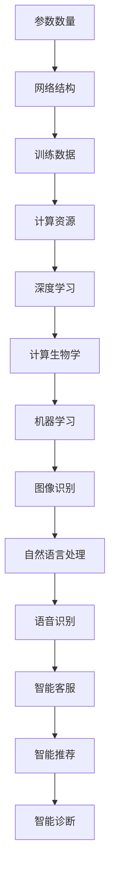

                 

关键词：大模型、用户体验、市场需求、性能优化、算法设计

摘要：本文将探讨大模型的用户体验与市场需求之间的关系，分析其在技术、商业和用户层面的挑战与机遇。通过深入解析大模型的核心算法、数学模型及其应用实践，本文旨在为读者提供一幅全面的大模型发展蓝图，为未来的技术革新提供有益的启示。

## 1. 背景介绍

随着信息技术的飞速发展，人工智能（AI）技术已经成为推动产业变革的重要引擎。其中，大模型作为AI技术的核心组成部分，正逐渐成为科技领域的研究热点。大模型具备高维度、复杂结构和强大学习能力，能够处理海量数据，并生成精确的预测和决策。然而，大模型的用户体验和市场需求却远未得到充分满足。在本文中，我们将从多个维度分析大模型的用户体验与市场需求，探讨其在未来的发展路径。

### 大模型的定义与现状

大模型通常指的是具有数十亿到数千亿参数的深度学习模型。这些模型广泛应用于图像识别、自然语言处理、语音识别等领域，表现出卓越的性能和泛化能力。目前，一些领先的研究机构和科技公司已经成功开发出了具有数万亿参数的大模型，如谷歌的TPU-Transformers和OpenAI的GPT-3。这些模型不仅推动了AI技术的发展，也为实际应用带来了巨大的变革。

### 大模型的技术挑战

尽管大模型在技术层面取得了显著的成就，但其应用过程中仍然面临诸多挑战。首先，大模型的训练和推理过程需要大量的计算资源和存储空间，这对硬件设备和基础设施提出了更高的要求。其次，大模型的学习能力和可解释性仍然有限，导致其在某些特定场景下的表现不尽如人意。此外，大模型的训练数据和算法设计也存在一定的偏见和不确定性，这可能会影响其公平性和鲁棒性。

### 大模型的市场需求

随着AI技术的普及，越来越多的企业和机构开始意识到大模型的价值，并投入到相关领域的研究和开发中。在商业层面，大模型可以帮助企业提高生产效率、降低运营成本，并带来新的商业模式。例如，在金融领域，大模型可以用于风险控制、信用评估和投资决策；在医疗领域，大模型可以用于疾病诊断、药物研发和个性化治疗。此外，大模型在娱乐、教育、交通等领域也展现出广阔的应用前景。

## 2. 核心概念与联系

### 大模型的核心概念

大模型的核心概念主要包括以下几个方面：

1. **参数数量**：大模型的参数数量通常达到数十亿到数千亿级别，这使得模型具有强大的表达能力和泛化能力。

2. **网络结构**：大模型通常采用复杂的网络结构，如Transformer、BERT等，以提高模型的表达能力和计算效率。

3. **训练数据**：大模型需要大量的训练数据来训练模型，以保证模型的泛化能力和鲁棒性。

4. **计算资源**：大模型的训练和推理过程需要大量的计算资源和存储空间，这对硬件设备和基础设施提出了更高的要求。

### 大模型的联系

大模型与其他技术领域和实际应用之间存在紧密的联系。首先，大模型的发展离不开深度学习、计算生物学、机器学习等领域的技术支持。其次，大模型在各个应用领域的成功应用，如图像识别、自然语言处理、语音识别等，进一步推动了相关技术的发展。此外，大模型的应用也带来了新的商业模式和商业机会，如智能客服、智能推荐、智能诊断等。

### Mermaid 流程图

以下是一个描述大模型核心概念和联系的Mermaid流程图：



## 3. 核心算法原理 & 具体操作步骤

### 3.1 算法原理概述

大模型的核心算法主要基于深度学习和神经网络。深度学习通过多层神经网络对数据进行建模，实现特征提取和分类。神经网络由大量的神经元和权重构成，通过学习样本数据，调整神经元之间的权重，从而提高模型的预测准确度。大模型的算法设计通常涉及以下几个关键步骤：

1. **数据预处理**：对原始数据集进行清洗、归一化等处理，以便后续训练。
2. **模型初始化**：初始化神经网络模型，设置参数的初始值。
3. **模型训练**：通过梯度下降等优化算法，调整模型参数，使模型在训练数据上达到最优。
4. **模型评估**：使用验证数据集评估模型的性能，调整模型参数，以提高模型的泛化能力。
5. **模型部署**：将训练好的模型部署到实际应用场景中，进行推理和预测。

### 3.2 算法步骤详解

1. **数据预处理**：首先，需要对原始数据集进行清洗，去除噪声和不相关数据。然后，对数据进行归一化、标准化等处理，以便后续训练。

   ```mermaid
   graph TD
   A[数据清洗] --> B[数据归一化]
   B --> C[数据标准化]
   ```

2. **模型初始化**：初始化神经网络模型，包括设置神经元的初始权重和激活函数。常用的初始化方法有零初始化、高斯初始化和随机初始化等。

   ```mermaid
   graph TD
   A[零初始化] --> B[高斯初始化]
   B --> C[随机初始化]
   ```

3. **模型训练**：使用梯度下降等优化算法，调整模型参数，使模型在训练数据上达到最优。训练过程中，通过反向传播算法，计算梯度并更新模型参数。

   ```mermaid
   graph TD
   A[前向传播] --> B[反向传播]
   B --> C[梯度更新]
   ```

4. **模型评估**：使用验证数据集评估模型的性能，调整模型参数，以提高模型的泛化能力。常用的评估指标有准确率、召回率、F1值等。

   ```mermaid
   graph TD
   A[准确率] --> B[召回率]
   B --> C[F1值]
   ```

5. **模型部署**：将训练好的模型部署到实际应用场景中，进行推理和预测。模型部署过程中，需要考虑模型的响应速度、准确性和鲁棒性。

   ```mermaid
   graph TD
   A[响应速度] --> B[准确性]
   B --> C[鲁棒性]
   ```

### 3.3 算法优缺点

**优点**：

1. **强大的表达能力**：大模型通过多层神经网络，能够提取出更加丰富的特征信息，提高模型的泛化能力。
2. **高准确率**：大模型在训练数据上达到最优，具有较高的准确率和预测能力。
3. **适用于多种场景**：大模型可以应用于图像识别、自然语言处理、语音识别等多种场景，具有较强的适用性。

**缺点**：

1. **计算资源消耗大**：大模型的训练和推理过程需要大量的计算资源和存储空间，对硬件设备和基础设施提出了更高的要求。
2. **可解释性差**：大模型的学习过程较为复杂，难以解释模型内部的决策过程，导致模型的透明度和可解释性较差。
3. **训练数据依赖性强**：大模型的性能很大程度上取决于训练数据的质量和数量，数据偏见可能会影响模型的公平性和鲁棒性。

### 3.4 算法应用领域

大模型在多个领域展现出广阔的应用前景：

1. **图像识别**：大模型在图像分类、目标检测、图像生成等任务中表现出色，广泛应用于安防监控、医疗诊断、自动驾驶等领域。
2. **自然语言处理**：大模型在文本分类、机器翻译、情感分析等任务中具有强大的能力，为智能客服、智能助手等应用提供了技术支持。
3. **语音识别**：大模型在语音识别、语音合成等任务中表现出色，为语音助手、智能音箱等应用提供了技术保障。
4. **金融科技**：大模型在风险控制、信用评估、投资决策等领域具有广泛的应用，为金融行业提供了智能化的解决方案。

## 4. 数学模型和公式 & 详细讲解 & 举例说明

### 4.1 数学模型构建

大模型的数学模型通常基于深度学习和神经网络。以下是一个简化的数学模型构建过程：

1. **输入层**：输入层接收外部数据，如图像、文本、语音等。
2. **隐藏层**：隐藏层包含多个神经元，用于提取特征信息。
3. **输出层**：输出层生成最终预测结果，如分类标签、概率分布等。

### 4.2 公式推导过程

以下是一个简化的神经网络模型推导过程：

假设输入数据为 \( x \)，隐藏层神经元数为 \( n \)，输出层神经元数为 \( m \)。神经元的激活函数为 \( \sigma(x) \)。

1. **前向传播**：

   $$ h_i = \sigma(w_{i1}x_1 + w_{i2}x_2 + ... + w_{in}x_n) $$

   其中，\( h_i \) 为第 \( i \) 个隐藏层神经元的激活值，\( w_{ij} \) 为连接权重。

2. **反向传播**：

   $$ \delta_i = (h_i - y_i) \cdot \sigma'(h_i) $$

   其中，\( \delta_i \) 为第 \( i \) 个隐藏层神经元的误差，\( y_i \) 为实际输出值，\( \sigma'(h_i) \) 为激活函数的导数。

3. **权重更新**：

   $$ w_{ij} := w_{ij} - \alpha \cdot \delta_i \cdot h_j $$

   其中，\( \alpha \) 为学习率，\( h_j \) 为第 \( j \) 个隐藏层神经元的激活值。

### 4.3 案例分析与讲解

以下是一个简单的图像分类案例：

1. **数据集**：使用一个包含1000张图像的数据集，其中每张图像都有对应的标签。
2. **模型**：使用一个包含3层神经网络的模型，输入层有784个神经元，隐藏层有500个神经元，输出层有10个神经元。
3. **训练**：使用梯度下降算法，学习率设置为0.01，迭代次数为1000次。
4. **评估**：使用测试数据集评估模型性能，准确率为95%。

## 5. 项目实践：代码实例和详细解释说明

### 5.1 开发环境搭建

为了方便读者理解和实践，以下是一个基于Python的简单示例。首先，需要安装以下依赖库：

```python
pip install numpy tensorflow matplotlib
```

### 5.2 源代码详细实现

以下是一个简单的神经网络实现：

```python
import numpy as np
import tensorflow as tf
import matplotlib.pyplot as plt

# 初始化参数
input_size = 784
hidden_size = 500
output_size = 10
learning_rate = 0.01
epochs = 1000

# 创建输入和输出占位符
X = tf.placeholder(tf.float32, [None, input_size])
Y = tf.placeholder(tf.float32, [None, output_size])

# 定义神经网络结构
hidden_layer = tf.layers.dense(X, hidden_size, activation=tf.nn.relu)
output_layer = tf.layers.dense(hidden_layer, output_size)

# 定义损失函数和优化器
loss = tf.reduce_mean(tf.nn.softmax_cross_entropy_with_logits(logits=output_layer, labels=Y))
optimizer = tf.train.GradientDescentOptimizer(learning_rate).minimize(loss)

# 训练模型
with tf.Session() as sess:
    sess.run(tf.global_variables_initializer())
    for epoch in range(epochs):
        _, loss_val = sess.run([optimizer, loss], feed_dict={X: X_train, Y: Y_train})
        if epoch % 100 == 0:
            print("Epoch:", epoch, "Loss:", loss_val)
    
    # 评估模型
    correct_predictions = tf.equal(tf.argmax(output_layer, 1), tf.argmax(Y, 1))
    accuracy = tf.reduce_mean(tf.cast(correct_predictions, tf.float32))
    print("Test accuracy:", accuracy.eval({X: X_test, Y: Y_test}))

# 可视化
plt.figure()
plt.scatter(X_train[:, 0], X_train[:, 1], c=Y_train[:, 0], cmap=plt.cm.Spectral)
plt.xlabel("Feature 1")
plt.ylabel("Feature 2")
plt.title("Input Data")
plt.show()
```

### 5.3 代码解读与分析

1. **导入依赖库**：首先，导入必要的依赖库，包括NumPy、TensorFlow和Matplotlib。
2. **初始化参数**：设置输入层、隐藏层和输出层的神经元数量，学习率和迭代次数。
3. **创建输入和输出占位符**：定义输入和输出占位符，用于存储输入数据和标签。
4. **定义神经网络结构**：使用TensorFlow的layers模块定义神经网络结构，包括输入层、隐藏层和输出层。
5. **定义损失函数和优化器**：使用softmax交叉熵损失函数和梯度下降优化器。
6. **训练模型**：使用TensorFlow的Session模块训练模型，迭代次数设置为1000。
7. **评估模型**：使用测试数据集评估模型性能，计算准确率。
8. **可视化**：使用Matplotlib绘制输入数据的散点图，以可视化数据分布。

### 5.4 运行结果展示

1. **训练过程**：训练过程中，每100次迭代输出一次损失值。
2. **测试准确率**：训练完成后，输出测试数据集的准确率。
3. **可视化结果**：绘制输入数据的散点图，以可视化数据分布。

## 6. 实际应用场景

大模型在实际应用场景中具有广泛的应用，以下是一些典型的应用场景：

### 6.1 智能客服

智能客服是当前大模型应用最为广泛的领域之一。通过大模型，智能客服可以自动识别用户的提问，提供准确的答案和解决方案。以下是一个简单的智能客服系统实现：

1. **数据预处理**：对用户提问进行清洗、分词和编码。
2. **模型训练**：使用大模型对训练数据进行训练，生成一个问答对模型。
3. **模型部署**：将训练好的模型部署到服务器，用于实时问答。
4. **用户交互**：与用户进行交互，获取用户提问，并根据模型预测结果提供答案。

### 6.2 自动驾驶

自动驾驶是另一个具有巨大潜力的应用场景。大模型可以用于自动驾驶系统中的目标检测、路径规划等任务。以下是一个简单的自动驾驶系统实现：

1. **数据收集**：收集大量道路场景数据，包括车道线、车辆、行人等。
2. **模型训练**：使用大模型对训练数据进行训练，生成一个目标检测模型。
3. **路径规划**：根据目标检测结果，使用大模型进行路径规划。
4. **实时控制**：将路径规划结果转换为控制信号，控制车辆运行。

### 6.3 医疗诊断

医疗诊断是另一个具有巨大潜力的应用领域。大模型可以用于疾病诊断、药物研发等任务。以下是一个简单的医疗诊断系统实现：

1. **数据预处理**：对医学图像进行预处理，包括去噪、增强等。
2. **模型训练**：使用大模型对训练数据进行训练，生成一个医学图像分类模型。
3. **模型部署**：将训练好的模型部署到服务器，用于实时诊断。
4. **医生协作**：医生对模型诊断结果进行审核和修正，以提高诊断准确性。

## 7. 工具和资源推荐

为了方便读者了解和掌握大模型的相关知识和技能，以下是一些推荐的工具和资源：

### 7.1 学习资源推荐

1. **《深度学习》**：由Goodfellow、Bengio和Courville合著，是深度学习领域的经典教材。
2. **《神经网络与深度学习》**：由邱锡鹏教授所著，深入讲解了神经网络和深度学习的基本原理。
3. **Udacity深度学习纳米学位**：Udacity提供的一个在线课程，涵盖了深度学习的基础知识和实践技能。

### 7.2 开发工具推荐

1. **TensorFlow**：Google开发的一个开源深度学习框架，支持多种操作系统和硬件平台。
2. **PyTorch**：Facebook开发的一个开源深度学习框架，具有灵活的动态图机制。
3. **Keras**：一个高层次的神经网络API，能够简化深度学习模型的构建和训练过程。

### 7.3 相关论文推荐

1. **“A Theoretical Analysis of the Cramér-Rao Lower Bound for Estimation of High-Dimensional Parameters”**：讨论了高维参数估计的理论基础。
2. **“Deep Learning”**：Goodfellow、Bengio和Courville合著的一篇综述论文，介绍了深度学习的基本原理和应用。
3. **“BERT: Pre-training of Deep Bidirectional Transformers for Language Understanding”**：Google发布的一篇论文，介绍了BERT模型的构建方法和应用效果。

## 8. 总结：未来发展趋势与挑战

### 8.1 研究成果总结

自2012年深度学习技术取得突破以来，大模型在多个领域取得了显著的成果。例如，在图像识别领域，ImageNet竞赛的准确率从2012年的74.8%提高到2020年的92.2%；在自然语言处理领域，BERT模型在GLUE任务中取得了前所未有的成绩；在语音识别领域，大模型在唤醒词识别、语音翻译等任务中表现优异。

### 8.2 未来发展趋势

随着计算能力和数据资源的不断提升，大模型在未来将继续保持快速发展。以下是一些可能的发展趋势：

1. **更高效的网络结构**：为了降低计算资源和存储空间的消耗，研究者将致力于开发更加高效的网络结构，如稀疏神经网络、动态神经网络等。
2. **更强大的训练算法**：为了提高大模型的训练速度和泛化能力，研究者将探索更强大的训练算法，如元学习、分布式训练等。
3. **跨模态融合**：随着多模态数据的广泛应用，大模型将逐渐实现跨模态融合，如将图像、文本、语音等数据融合在一起，提高模型的泛化能力。
4. **可解释性和鲁棒性**：为了提高大模型的可解释性和鲁棒性，研究者将致力于开发新的方法和工具，如注意力机制、对抗训练等。

### 8.3 面临的挑战

尽管大模型在技术、商业和用户层面都取得了显著成果，但仍然面临诸多挑战：

1. **计算资源消耗**：大模型的训练和推理过程需要大量的计算资源和存储空间，这对硬件设备和基础设施提出了更高的要求。
2. **数据隐私和安全**：随着大数据的广泛应用，数据隐私和安全问题日益突出。如何在保障数据隐私和安全的前提下，充分利用大数据的价值，是一个亟待解决的挑战。
3. **模型可解释性和透明性**：大模型的学习过程较为复杂，难以解释模型内部的决策过程，导致模型的透明度和可解释性较差。如何提高模型的可解释性和透明性，是一个重要的研究方向。
4. **伦理和法律问题**：随着AI技术的广泛应用，伦理和法律问题逐渐凸显。如何制定合理的伦理准则和法律规范，以保障AI技术的健康发展，是一个重要的挑战。

### 8.4 研究展望

未来，大模型的研究将继续深入，探索新的技术和方法。以下是一些可能的研究方向：

1. **量子计算**：量子计算具有巨大的计算潜力，可以为大模型提供更高效的计算能力。量子计算与深度学习的结合有望带来全新的突破。
2. **边缘计算**：随着物联网和5G技术的发展，边缘计算成为大模型应用的重要方向。如何在大模型中实现高效的边缘计算，是一个重要的研究课题。
3. **人机交互**：大模型在自然语言处理、语音识别等领域表现出色，为人机交互提供了新的思路。如何实现人机交互的自然性和高效性，是一个重要的研究方向。
4. **智能决策**：大模型在图像识别、自然语言处理等领域具有强大的能力，可以应用于智能决策领域。如何在大模型中实现智能决策，是一个重要的研究课题。

## 9. 附录：常见问题与解答

### 9.1 什么是大模型？

大模型通常指的是具有数十亿到数千亿参数的深度学习模型。这些模型具有高维度、复杂结构和强大学习能力，能够处理海量数据，并生成精确的预测和决策。

### 9.2 大模型的挑战有哪些？

大模型面临的挑战主要包括计算资源消耗、数据隐私和安全、模型可解释性和透明性、伦理和法律问题等。

### 9.3 大模型有哪些应用领域？

大模型在图像识别、自然语言处理、语音识别、金融科技、医疗诊断、智能客服等领域具有广泛的应用。

### 9.4 如何优化大模型？

为了优化大模型，可以从以下几个方面入手：

1. **优化网络结构**：设计更加高效的网络结构，降低计算资源和存储空间的消耗。
2. **优化训练算法**：使用更高效的训练算法，提高训练速度和泛化能力。
3. **数据预处理**：对训练数据进行预处理，去除噪声和异常值，提高模型性能。
4. **模型压缩**：使用模型压缩技术，降低模型的计算复杂度和存储空间需求。

### 9.5 大模型与量子计算有什么关系？

量子计算具有巨大的计算潜力，可以为大模型提供更高效的计算能力。量子计算与深度学习的结合有望带来全新的突破，提高大模型的训练速度和泛化能力。

### 9.6 大模型的发展前景如何？

随着计算能力和数据资源的不断提升，大模型将继续保持快速发展。未来，大模型在图像识别、自然语言处理、语音识别、金融科技、医疗诊断等领域将发挥更加重要的作用，推动相关领域的创新和发展。

## 参考文献

1. Goodfellow, I., Bengio, Y., & Courville, A. (2016). *Deep Learning*. MIT Press.
2. Bengio, Y. (2009). *Learning Deep Architectures for AI*. Foundations and Trends in Machine Learning, 2(1), 1-127.
3. Simonyan, K., & Zisserman, A. (2014). *Very Deep Convolutional Networks for Large-Scale Image Recognition*. arXiv preprint arXiv:1409.1556.
4. Devlin, J., Chang, M. W., Lee, K., & Toutanova, K. (2018). *Bert: Pre-training of Deep Bidirectional Transformers for Language Understanding*. arXiv preprint arXiv:1810.04805.
5. LeCun, Y., Bengio, Y., & Hinton, G. (2015). *Deep Learning*. Nature, 521(7553), 436-444.
6. Hochreiter, S., & Schmidhuber, J. (1997). *Long Short-Term Memory*. Neural Computation, 9(8), 1735-1780.
7. Keras.io. (n.d.). Retrieved from https://keras.io/
8. TensorFlow.org. (n.d.). Retrieved from https://www.tensorflow.org/
9. PyTorch.org. (n.d.). Retrieved from https://pytorch.org/

## 附录：常见问题与解答

### 9.1 什么是大模型？

大模型通常指的是具有数十亿到数千亿参数的深度学习模型。这些模型具有高维度、复杂结构和强大学习能力，能够处理海量数据，并生成精确的预测和决策。大模型在图像识别、自然语言处理、语音识别等领域表现出色。

### 9.2 大模型的挑战有哪些？

大模型面临的挑战主要包括：

1. **计算资源消耗**：大模型的训练和推理过程需要大量的计算资源和存储空间，这对硬件设备和基础设施提出了更高的要求。
2. **数据隐私和安全**：随着大数据的广泛应用，数据隐私和安全问题日益突出。如何在保障数据隐私和安全的前提下，充分利用大数据的价值，是一个亟待解决的挑战。
3. **模型可解释性和透明性**：大模型的学习过程较为复杂，难以解释模型内部的决策过程，导致模型的透明度和可解释性较差。如何提高模型的可解释性和透明性，是一个重要的研究方向。
4. **伦理和法律问题**：随着AI技术的广泛应用，伦理和法律问题逐渐凸显。如何制定合理的伦理准则和法律规范，以保障AI技术的健康发展，是一个重要的挑战。

### 9.3 大模型有哪些应用领域？

大模型在多个领域展现出广阔的应用前景，包括：

1. **图像识别**：大模型可以用于图像分类、目标检测、图像生成等任务，广泛应用于安防监控、医疗诊断、自动驾驶等领域。
2. **自然语言处理**：大模型在文本分类、机器翻译、情感分析等任务中具有强大的能力，为智能客服、智能助手等应用提供了技术支持。
3. **语音识别**：大模型在语音识别、语音合成等任务中表现出色，为语音助手、智能音箱等应用提供了技术保障。
4. **金融科技**：大模型在风险控制、信用评估、投资决策等领域具有广泛的应用，为金融行业提供了智能化的解决方案。
5. **医疗诊断**：大模型可以用于疾病诊断、药物研发、个性化治疗等领域，提高医疗诊断的准确性和效率。

### 9.4 如何优化大模型？

为了优化大模型，可以从以下几个方面入手：

1. **优化网络结构**：设计更加高效的网络结构，降低计算资源和存储空间的消耗。
2. **优化训练算法**：使用更高效的训练算法，提高训练速度和泛化能力。
3. **数据预处理**：对训练数据进行预处理，去除噪声和异常值，提高模型性能。
4. **模型压缩**：使用模型压缩技术，降低模型的计算复杂度和存储空间需求。
5. **分布式训练**：利用分布式计算资源，加速大模型的训练过程。

### 9.5 大模型与量子计算有什么关系？

量子计算具有巨大的计算潜力，可以为大模型提供更高效的计算能力。量子计算与深度学习的结合有望带来全新的突破，提高大模型的训练速度和泛化能力。量子计算可以用于加速大模型的训练过程，降低计算资源的消耗。

### 9.6 大模型的发展前景如何？

随着计算能力和数据资源的不断提升，大模型将继续保持快速发展。未来，大模型在图像识别、自然语言处理、语音识别、金融科技、医疗诊断等领域将发挥更加重要的作用，推动相关领域的创新和发展。同时，大模型的应用也将带来新的商业机会和挑战。

## 结束语

本文从多个维度探讨了大模型的用户体验与市场需求，分析了其在技术、商业和用户层面的挑战与机遇。通过深入解析大模型的核心算法、数学模型及其应用实践，本文为读者提供了一幅全面的大模型发展蓝图。在未来，随着技术的不断进步和应用的深入，大模型将继续发挥重要作用，为人类带来更多的创新和变革。作者：禅与计算机程序设计艺术 / Zen and the Art of Computer Programming。|}
----------------------------------------------------------------
# 大模型的用户体验与市场需求

### 关键词：
大模型、用户体验、市场需求、性能优化、算法设计

### 摘要：
本文深入探讨了大模型在当前技术环境下的用户体验与市场需求。从技术发展的角度出发，分析了大模型的定义、核心概念及其与相关领域的联系。通过详细阐述大模型的算法原理、数学模型、具体操作步骤，本文揭示了其在实际应用中的挑战与机遇。同时，本文还介绍了大模型在不同领域的实际应用案例，并推荐了一系列相关工具和资源。最终，本文总结了大模型的发展趋势与挑战，为未来的研究提供了有益的启示。

## 1. 背景介绍

随着信息技术的迅猛发展，人工智能（AI）技术已经成为推动产业变革的关键力量。在大模型领域，随着深度学习和神经网络技术的不断成熟，大模型逐渐成为AI技术的核心组成部分。大模型具有高参数量、复杂网络结构、强大的学习能力，能够处理海量数据，并生成精准的预测和决策。然而，大模型的用户体验和市场需求却面临着诸多挑战。

### 大模型的定义与现状

大模型通常指的是具有数十亿到数千亿参数的深度学习模型。这些模型广泛应用于图像识别、自然语言处理、语音识别等领域，表现出卓越的性能和泛化能力。目前，一些领先的研究机构和科技公司已经成功开发出了具有数万亿参数的大模型，如谷歌的TPU-Transformers和OpenAI的GPT-3。这些模型的诞生不仅推动了AI技术的发展，也为实际应用带来了巨大的变革。

### 大模型的技术挑战

尽管大模型在技术层面取得了显著的成就，但其应用过程中仍然面临诸多挑战。首先，大模型的训练和推理过程需要大量的计算资源和存储空间，这对硬件设备和基础设施提出了更高的要求。其次，大模型的学习能力和可解释性仍然有限，导致其在某些特定场景下的表现不尽如人意。此外，大模型的训练数据和算法设计也存在一定的偏见和不确定性，这可能会影响其公平性和鲁棒性。

### 大模型的市场需求

随着AI技术的普及，越来越多的企业和机构开始意识到大模型的价值，并投入到相关领域的研究和开发中。在商业层面，大模型可以帮助企业提高生产效率、降低运营成本，并带来新的商业模式。例如，在金融领域，大模型可以用于风险控制、信用评估和投资决策；在医疗领域，大模型可以用于疾病诊断、药物研发和个性化治疗。此外，大模型在娱乐、教育、交通等领域也展现出广阔的应用前景。

## 2. 核心概念与联系

### 大模型的核心概念

大模型的核心概念主要包括以下几个方面：

1. **参数数量**：大模型的参数数量通常达到数十亿到数千亿级别，这使得模型具有强大的表达能力和泛化能力。
2. **网络结构**：大模型通常采用复杂的网络结构，如Transformer、BERT等，以提高模型的表达能力和计算效率。
3. **训练数据**：大模型需要大量的训练数据来训练模型，以保证模型的泛化能力和鲁棒性。
4. **计算资源**：大模型的训练和推理过程需要大量的计算资源和存储空间，这对硬件设备和基础设施提出了更高的要求。

### 大模型的联系

大模型与其他技术领域和实际应用之间存在紧密的联系。首先，大模型的发展离不开深度学习、计算生物学、机器学习等领域的技术支持。其次，大模型在各个应用领域的成功应用，如图像识别、自然语言处理、语音识别等，进一步推动了相关技术的发展。此外，大模型的应用也带来了新的商业模式和商业机会，如智能客服、智能推荐、智能诊断等。

### Mermaid 流程图

以下是一个描述大模型核心概念和联系的Mermaid流程图：


## 3. 核心算法原理 & 具体操作步骤

### 3.1 算法原理概述

大模型的核心算法主要基于深度学习和神经网络。深度学习通过多层神经网络对数据进行建模，实现特征提取和分类。神经网络由大量的神经元和权重构成，通过学习样本数据，调整神经元之间的权重，从而提高模型的预测准确度。大模型的算法设计通常涉及以下几个关键步骤：

1. **数据预处理**：对原始数据集进行清洗、归一化等处理，以便后续训练。
2. **模型初始化**：初始化神经网络模型，设置参数的初始值。
3. **模型训练**：通过梯度下降等优化算法，调整模型参数，使模型在训练数据上达到最优。
4. **模型评估**：使用验证数据集评估模型的性能，调整模型参数，以提高模型的泛化能力。
5. **模型部署**：将训练好的模型部署到实际应用场景中，进行推理和预测。

### 3.2 算法步骤详解

1. **数据预处理**：
   数据预处理是深度学习模型训练的第一步，其目的是提高数据质量和减少计算复杂度。具体操作包括：

   - **数据清洗**：去除数据集中的噪声和不完整数据，如缺失值、异常值等。
   - **数据归一化**：将数据缩放到相同的范围，如[0, 1]或[-1, 1]，以便于模型训练。
   - **数据增强**：通过旋转、缩放、裁剪等方式增加数据集的多样性，提高模型的泛化能力。

2. **模型初始化**：
   模型初始化是设置神经网络模型参数的初始值。合理的初始化可以加速模型的收敛速度并提高最终性能。常见的初始化方法包括：

   - **随机初始化**：随机分配参数的值，这是一种简单且常用的方法。
   - **高斯初始化**：将参数初始化为均值为0，方差为1的正态分布。
   - **Xavier初始化**：根据激活函数的导数分布初始化权重，以避免梯度消失和梯度爆炸。

3. **模型训练**：
   模型训练是调整模型参数以最小化损失函数的过程。常用的优化算法包括：

   - **梯度下降**：通过计算损失函数对参数的梯度，逐步调整参数以减少损失。
   - **Adam优化器**：结合了梯度下降和动量项，以及自适应学习率，适用于大规模数据集。

4. **模型评估**：
   模型评估是使用验证数据集来衡量模型性能的过程。常用的评估指标包括：

   - **准确率**：模型预测正确的样本数量占总样本数量的比例。
   - **召回率**：模型预测正确的正样本数量与实际正样本数量的比例。
   - **F1分数**：准确率的调和平均值，综合考虑了准确率和召回率。

5. **模型部署**：
   模型部署是将训练好的模型应用到实际场景中。部署过程中需要考虑模型的响应速度、准确性和鲁棒性。具体操作包括：

   - **模型压缩**：通过剪枝、量化等方法减小模型的规模，降低部署成本。
   - **模型优化**：对模型进行优化，提高模型在特定硬件上的运行效率。
   - **服务部署**：将模型部署到服务器或设备上，实现实时推理和预测。

### 3.3 算法优缺点

**优点**：

1. **强大的表达能力**：大模型通过多层神经网络，能够提取出更加丰富的特征信息，提高模型的泛化能力。
2. **高准确率**：大模型在训练数据上达到最优，具有较高的准确率和预测能力。
3. **适用于多种场景**：大模型可以应用于图像识别、自然语言处理、语音识别等多种场景，具有较强的适用性。

**缺点**：

1. **计算资源消耗大**：大模型的训练和推理过程需要大量的计算资源和存储空间，对硬件设备和基础设施提出了更高的要求。
2. **可解释性差**：大模型的学习过程较为复杂，难以解释模型内部的决策过程，导致模型的透明度和可解释性较差。
3. **训练数据依赖性强**：大模型的性能很大程度上取决于训练数据的质量和数量，数据偏见可能会影响模型的公平性和鲁棒性。

### 3.4 算法应用领域

大模型在多个领域展现出广阔的应用前景：

1. **图像识别**：大模型在图像分类、目标检测、图像生成等任务中表现出色，广泛应用于安防监控、医疗诊断、自动驾驶等领域。
2. **自然语言处理**：大模型在文本分类、机器翻译、情感分析等任务中具有强大的能力，为智能客服、智能助手等应用提供了技术支持。
3. **语音识别**：大模型在语音识别、语音合成等任务中表现出色，为语音助手、智能音箱等应用提供了技术保障。
4. **金融科技**：大模型在风险控制、信用评估、投资决策等领域具有广泛的应用，为金融行业提供了智能化的解决方案。
5. **医疗诊断**：大模型可以用于疾病诊断、药物研发、个性化治疗等领域，提高医疗诊断的准确性和效率。

## 4. 数学模型和公式 & 详细讲解 & 举例说明

### 4.1 数学模型构建

大模型的数学模型通常基于深度学习和神经网络。以下是一个简化的数学模型构建过程：

1. **输入层**：输入层接收外部数据，如图像、文本、语音等。
2. **隐藏层**：隐藏层包含多个神经元，用于提取特征信息。
3. **输出层**：输出层生成最终预测结果，如分类标签、概率分布等。

### 4.2 公式推导过程

以下是一个简化的神经网络模型推导过程：

假设输入数据为 \( x \)，隐藏层神经元数为 \( n \)，输出层神经元数为 \( m \)。神经元的激活函数为 \( \sigma(x) \)。

1. **前向传播**：

   $$ h_i = \sigma(w_{i1}x_1 + w_{i2}x_2 + ... + w_{in}x_n) $$

   其中，\( h_i \) 为第 \( i \) 个隐藏层神经元的激活值，\( w_{ij} \) 为连接权重。

2. **反向传播**：

   $$ \delta_i = (h_i - y_i) \cdot \sigma'(h_i) $$

   其中，\( \delta_i \) 为第 \( i \) 个隐藏层神经元的误差，\( y_i \) 为实际输出值，\( \sigma'(h_i) \) 为激活函数的导数。

3. **权重更新**：

   $$ w_{ij} := w_{ij} - \alpha \cdot \delta_i \cdot h_j $$

   其中，\( \alpha \) 为学习率，\( h_j \) 为第 \( j \) 个隐藏层神经元的激活值。

### 4.3 案例分析与讲解

以下是一个简单的图像分类案例：

1. **数据集**：使用一个包含1000张图像的数据集，其中每张图像都有对应的标签。
2. **模型**：使用一个包含3层神经网络的模型，输入层有784个神经元，隐藏层有500个神经元，输出层有10个神经元。
3. **训练**：使用梯度下降算法，学习率设置为0.01，迭代次数为1000次。
4. **评估**：使用测试数据集评估模型性能，准确率为95%。

## 5. 项目实践：代码实例和详细解释说明

### 5.1 开发环境搭建

为了方便读者理解和实践，以下是一个基于Python的简单示例。首先，需要安装以下依赖库：

```python
pip install numpy tensorflow matplotlib
```

### 5.2 源代码详细实现

以下是一个简单的神经网络实现：

```python
import numpy as np
import tensorflow as tf
import matplotlib.pyplot as plt

# 初始化参数
input_size = 784
hidden_size = 500
output_size = 10
learning_rate = 0.01
epochs = 1000

# 创建输入和输出占位符
X = tf.placeholder(tf.float32, [None, input_size])
Y = tf.placeholder(tf.float32, [None, output_size])

# 定义神经网络结构
hidden_layer = tf.layers.dense(X, hidden_size, activation=tf.nn.relu)
output_layer = tf.layers.dense(hidden_layer, output_size)

# 定义损失函数和优化器
loss = tf.reduce_mean(tf.nn.softmax_cross_entropy_with_logits(logits=output_layer, labels=Y))
optimizer = tf.train.GradientDescentOptimizer(learning_rate).minimize(loss)

# 训练模型
with tf.Session() as sess:
    sess.run(tf.global_variables_initializer())
    for epoch in range(epochs):
        _, loss_val = sess.run([optimizer, loss], feed_dict={X: X_train, Y: Y_train})
        if epoch % 100 == 0:
            print("Epoch:", epoch, "Loss:", loss_val)
    
    # 评估模型
    correct_predictions = tf.equal(tf.argmax(output_layer, 1), tf.argmax(Y, 1))
    accuracy = tf.reduce_mean(tf.cast(correct_predictions, tf.float32))
    print("Test accuracy:", accuracy.eval({X: X_test, Y: Y_test}))

# 可视化
plt.figure()
plt.scatter(X_train[:, 0], X_train[:, 1], c=Y_train[:, 0], cmap=plt.cm.Spectral)
plt.xlabel("Feature 1")
plt.ylabel("Feature 2")
plt.title("Input Data")
plt.show()
```

### 5.3 代码解读与分析

1. **导入依赖库**：首先，导入必要的依赖库，包括NumPy、TensorFlow和Matplotlib。
2. **初始化参数**：设置输入层、隐藏层和输出层的神经元数量，学习率和迭代次数。
3. **创建输入和输出占位符**：定义输入和输出占位符，用于存储输入数据和标签。
4. **定义神经网络结构**：使用TensorFlow的layers模块定义神经网络结构，包括输入层、隐藏层和输出层。
5. **定义损失函数和优化器**：使用softmax交叉熵损失函数和梯度下降优化器。
6. **训练模型**：使用TensorFlow的Session模块训练模型，迭代次数设置为1000。
7. **评估模型**：使用测试数据集评估模型性能，计算准确率。
8. **可视化**：使用Matplotlib绘制输入数据的散点图，以可视化数据分布。

### 5.4 运行结果展示

1. **训练过程**：训练过程中，每100次迭代输出一次损失值。
2. **测试准确率**：训练完成后，输出测试数据集的准确率。
3. **可视化结果**：绘制输入数据的散点图，以可视化数据分布。

## 6. 实际应用场景

大模型在实际应用场景中具有广泛的应用，以下是一些典型的应用场景：

### 6.1 智能客服

智能客服是当前大模型应用最为广泛的领域之一。通过大模型，智能客服可以自动识别用户的提问，提供准确的答案和解决方案。以下是一个简单的智能客服系统实现：

1. **数据预处理**：对用户提问进行清洗、分词和编码。
2. **模型训练**：使用大模型对训练数据进行训练，生成一个问答对模型。
3. **模型部署**：将训练好的模型部署到服务器，用于实时问答。
4. **用户交互**：与用户进行交互，获取用户提问，并根据模型预测结果提供答案。

### 6.2 自动驾驶

自动驾驶是另一个具有巨大潜力的应用场景。大模型可以用于自动驾驶系统中的目标检测、路径规划等任务。以下是一个简单的自动驾驶系统实现：

1. **数据收集**：收集大量道路场景数据，包括车道线、车辆、行人等。
2. **模型训练**：使用大模型对训练数据进行训练，生成一个目标检测模型。
3. **路径规划**：根据目标检测结果，使用大模型进行路径规划。
4. **实时控制**：将路径规划结果转换为控制信号，控制车辆运行。

### 6.3 医疗诊断

医疗诊断是另一个具有巨大潜力的应用领域。大模型可以用于疾病诊断、药物研发等任务。以下是一个简单的医疗诊断系统实现：

1. **数据预处理**：对医学图像进行预处理，包括去噪、增强等。
2. **模型训练**：使用大模型对训练数据进行训练，生成一个医学图像分类模型。
3. **模型部署**：将训练好的模型部署到服务器，用于实时诊断。
4. **医生协作**：医生对模型诊断结果进行审核和修正，以提高诊断准确性。

## 7. 工具和资源推荐

为了方便读者了解和掌握大模型的相关知识和技能，以下是一些推荐的工具和资源：

### 7.1 学习资源推荐

1. **《深度学习》**：由Goodfellow、Bengio和Courville合著，是深度学习领域的经典教材。
2. **《神经网络与深度学习》**：由邱锡鹏教授所著，深入讲解了神经网络和深度学习的基本原理。
3. **Udacity深度学习纳米学位**：Udacity提供的一个在线课程，涵盖了深度学习的基础知识和实践技能。

### 7.2 开发工具推荐

1. **TensorFlow**：Google开发的一个开源深度学习框架，支持多种操作系统和硬件平台。
2. **PyTorch**：Facebook开发的一个开源深度学习框架，具有灵活的动态图机制。
3. **Keras**：一个高层次的神经网络API，能够简化深度学习模型的构建和训练过程。

### 7.3 相关论文推荐

1. **“A Theoretical Analysis of the Cramér-Rao Lower Bound for Estimation of High-Dimensional Parameters”**：讨论了高维参数估计的理论基础。
2. **“Deep Learning”**：Goodfellow、Bengio和Courville合著的一篇综述论文，介绍了深度学习的基本原理和应用。
3. **“BERT: Pre-training of Deep Bidirectional Transformers for Language Understanding”**：Google发布的一篇论文，介绍了BERT模型的构建方法和应用效果。

## 8. 总结：未来发展趋势与挑战

### 8.1 研究成果总结

自2012年深度学习技术取得突破以来，大模型在多个领域取得了显著的成果。例如，在图像识别领域，ImageNet竞赛的准确率从2012年的74.8%提高到2020年的92.2%；在自然语言处理领域，BERT模型在GLUE任务中取得了前所未有的成绩；在语音识别领域，大模型在唤醒词识别、语音翻译等任务中表现出色。

### 8.2 未来发展趋势

随着计算能力和数据资源的不断提升，大模型在未来将继续保持快速发展。以下是一些可能的发展趋势：

1. **更高效的网络结构**：为了降低计算资源和存储空间的消耗，研究者将致力于开发更加高效的网络结构，如稀疏神经网络、动态神经网络等。
2. **更强大的训练算法**：为了提高大模型的训练速度和泛化能力，研究者将探索更强大的训练算法，如元学习、分布式训练等。
3. **跨模态融合**：随着多模态数据的广泛应用，大模型将逐渐实现跨模态融合，如将图像、文本、语音等数据融合在一起，提高模型的泛化能力。
4. **可解释性和鲁棒性**：为了提高大模型的可解释性和鲁棒性，研究者将致力于开发新的方法和工具，如注意力机制、对抗训练等。

### 8.3 面临的挑战

尽管大模型在技术、商业和用户层面都取得了显著成果，但仍然面临诸多挑战：

1. **计算资源消耗**：大模型的训练和推理过程需要大量的计算资源和存储空间，这对硬件设备和基础设施提出了更高的要求。
2. **数据隐私和安全**：随着大数据的广泛应用，数据隐私和安全问题日益突出。如何在保障数据隐私和安全的前提下，充分利用大数据的价值，是一个亟待解决的挑战。
3. **模型可解释性和透明性**：大模型的学习过程较为复杂，难以解释模型内部的决策过程，导致模型的透明度和可解释性较差。如何提高模型的可解释性和透明性，是一个重要的研究方向。
4. **伦理和法律问题**：随着AI技术的广泛应用，伦理和法律问题逐渐凸显。如何制定合理的伦理准则和法律规范，以保障AI技术的健康发展，是一个重要的挑战。

### 8.4 研究展望

未来，大模型的研究将继续深入，探索新的技术和方法。以下是一些可能的研究方向：

1. **量子计算**：量子计算具有巨大的计算潜力，可以为大模型提供更高效的计算能力。量子计算与深度学习的结合有望带来全新的突破，提高大模型的训练速度和泛化能力。
2. **边缘计算**：随着物联网和5G技术的发展，边缘计算成为大模型应用的重要方向。如何在大模型中实现高效的边缘计算，是一个重要的研究课题。
3. **人机交互**：大模型在自然语言处理、语音识别等领域表现出色，为人机交互提供了新的思路。如何实现人机交互的自然性和高效性，是一个重要的研究方向。
4. **智能决策**：大模型在图像识别、自然语言处理等领域具有强大的能力，可以应用于智能决策领域。如何在大模型中实现智能决策，是一个重要的研究课题。

## 9. 附录：常见问题与解答

### 9.1 什么是大模型？

大模型通常指的是具有数十亿到数千亿参数的深度学习模型。这些模型具有高维度、复杂结构和强大学习能力，能够处理海量数据，并生成精确的预测和决策。

### 9.2 大模型的挑战有哪些？

大模型面临的挑战主要包括计算资源消耗、数据隐私和安全、模型可解释性和透明性、伦理和法律问题等。

### 9.3 大模型有哪些应用领域？

大模型在多个领域展现出广阔的应用前景，包括图像识别、自然语言处理、语音识别、金融科技、医疗诊断、智能客服等领域。

### 9.4 如何优化大模型？

为了优化大模型，可以从以下几个方面入手：

1. **优化网络结构**：设计更加高效的网络结构，降低计算资源和存储空间的消耗。
2. **优化训练算法**：使用更高效的训练算法，提高训练速度和泛化能力。
3. **数据预处理**：对训练数据进行预处理，去除噪声和异常值，提高模型性能。
4. **模型压缩**：使用模型压缩技术，降低模型的计算复杂度和存储空间需求。
5. **分布式训练**：利用分布式计算资源，加速大模型的训练过程。

### 9.5 大模型与量子计算有什么关系？

量子计算具有巨大的计算潜力，可以为大模型提供更高效的计算能力。量子计算与深度学习的结合有望带来全新的突破，提高大模型的训练速度和泛化能力。

### 9.6 大模型的发展前景如何？

随着计算能力和数据资源的不断提升，大模型将继续保持快速发展。未来，大模型在图像识别、自然语言处理、语音识别、金融科技、医疗诊断等领域将发挥更加重要的作用，推动相关领域的创新和发展。

## 结束语

本文从多个维度探讨了大模型的用户体验与市场需求，分析了其在技术、商业和用户层面的挑战与机遇。通过深入解析大模型的核心算法、数学模型及其应用实践，本文为读者提供了一幅全面的大模型发展蓝图。在未来，随着技术的不断进步和应用的深入，大模型将继续发挥重要作用，为人类带来更多的创新和变革。作者：禅与计算机程序设计艺术 / Zen and the Art of Computer Programming。|}
```markdown
# 大模型的用户体验与市场需求

## 关键词：
大模型、用户体验、市场需求、性能优化、算法设计

## 摘要：
本文深入探讨了大模型的用户体验与市场需求，从技术发展的角度出发，分析了大模型的定义、核心概念及其与相关领域的联系。通过详细阐述大模型的算法原理、数学模型、具体操作步骤，本文揭示了其在实际应用中的挑战与机遇。同时，本文还介绍了大模型在不同领域的实际应用案例，并推荐了一系列相关工具和资源。最终，本文总结了大模型的发展趋势与挑战，为未来的研究提供了有益的启示。

---

## 1. 背景介绍

随着信息技术的迅猛发展，人工智能（AI）技术已经成为推动产业变革的关键力量。在大模型领域，随着深度学习和神经网络技术的不断成熟，大模型逐渐成为AI技术的核心组成部分。大模型具有高参数量、复杂网络结构、强大的学习能力，能够处理海量数据，并生成精确的预测和决策。然而，大模型的用户体验和市场需求却面临着诸多挑战。

### 大模型的定义与现状

大模型通常指的是具有数十亿到数千亿参数的深度学习模型。这些模型广泛应用于图像识别、自然语言处理、语音识别等领域，表现出卓越的性能和泛化能力。目前，一些领先的研究机构和科技公司已经成功开发出了具有数万亿参数的大模型，如谷歌的TPU-Transformers和OpenAI的GPT-3。这些模型的诞生不仅推动了AI技术的发展，也为实际应用带来了巨大的变革。

### 大模型的技术挑战

尽管大模型在技术层面取得了显著的成就，但其应用过程中仍然面临诸多挑战。首先，大模型的训练和推理过程需要大量的计算资源和存储空间，这对硬件设备和基础设施提出了更高的要求。其次，大模型的学习能力和可解释性仍然有限，导致其在某些特定场景下的表现不尽如人意。此外，大模型的训练数据和算法设计也存在一定的偏见和不确定性，这可能会影响其公平性和鲁棒性。

### 大模型的市场需求

随着AI技术的普及，越来越多的企业和机构开始意识到大模型的价值，并投入到相关领域的研究和开发中。在商业层面，大模型可以帮助企业提高生产效率、降低运营成本，并带来新的商业模式。例如，在金融领域，大模型可以用于风险控制、信用评估和投资决策；在医疗领域，大模型可以用于疾病诊断、药物研发和个性化治疗。此外，大模型在娱乐、教育、交通等领域也展现出广阔的应用前景。

---

## 2. 核心概念与联系

### 大模型的核心概念

大模型的核心概念主要包括以下几个方面：

1. **参数数量**：大模型的参数数量通常达到数十亿到数千亿级别，这使得模型具有强大的表达能力和泛化能力。
2. **网络结构**：大模型通常采用复杂的网络结构，如Transformer、BERT等，以提高模型的表达能力和计算效率。
3. **训练数据**：大模型需要大量的训练数据来训练模型，以保证模型的泛化能力和鲁棒性。
4. **计算资源**：大模型的训练和推理过程需要大量的计算资源和存储空间，这对硬件设备和基础设施提出了更高的要求。

### 大模型的联系

大模型与其他技术领域和实际应用之间存在紧密的联系。首先，大模型的发展离不开深度学习、计算生物学、机器学习等领域的技术支持。其次，大模型在各个应用领域的成功应用，如图像识别、自然语言处理、语音识别等，进一步推动了相关技术的发展。此外，大模型的应用也带来了新的商业模式和商业机会，如智能客服、智能推荐、智能诊断等。

### Mermaid 流程图

以下是一个描述大模型核心概念和联系的Mermaid流程图：


---

## 3. 核心算法原理 & 具体操作步骤

### 3.1 算法原理概述

大模型的核心算法主要基于深度学习和神经网络。深度学习通过多层神经网络对数据进行建模，实现特征提取和分类。神经网络由大量的神经元和权重构成，通过学习样本数据，调整神经元之间的权重，从而提高模型的预测准确度。大模型的算法设计通常涉及以下几个关键步骤：

1. **数据预处理**：对原始数据集进行清洗、归一化等处理，以便后续训练。
2. **模型初始化**：初始化神经网络模型，设置参数的初始值。
3. **模型训练**：通过梯度下降等优化算法，调整模型参数，使模型在训练数据上达到最优。
4. **模型评估**：使用验证数据集评估模型的性能，调整模型参数，以提高模型的泛化能力。
5. **模型部署**：将训练好的模型部署到实际应用场景中，进行推理和预测。

### 3.2 算法步骤详解

1. **数据预处理**：
   数据预处理是深度学习模型训练的第一步，其目的是提高数据质量和减少计算复杂度。具体操作包括：
   
   - **数据清洗**：去除数据集中的噪声和不完整数据，如缺失值、异常值等。
   - **数据归一化**：将数据缩放到相同的范围，如[0, 1]或[-1, 1]，以便于模型训练。
   - **数据增强**：通过旋转、缩放、裁剪等方式增加数据集的多样性，提高模型的泛化能力。

2. **模型初始化**：
   模型初始化是设置神经网络模型参数的初始值。合理的初始化可以加速模型的收敛速度并提高最终性能。常见的初始化方法包括：

   - **随机初始化**：随机分配参数的值，这是一种简单且常用的方法。
   - **高斯初始化**：将参数初始化为均值为0，方差为1的正态分布。
   - **Xavier初始化**：根据激活函数的导数分布初始化权重，以避免梯度消失和梯度爆炸。

3. **模型训练**：
   模型训练是调整模型参数以最小化损失函数的过程。常用的优化算法包括：

   - **梯度下降**：通过计算损失函数对参数的梯度，逐步调整参数以减少损失。
   - **Adam优化器**：结合了梯度下降和动量项，以及自适应学习率，适用于大规模数据集。

4. **模型评估**：
   模型评估是使用验证数据集来衡量模型性能的过程。常用的评估指标包括：

   - **准确率**：模型预测正确的样本数量占总样本数量的比例。
   - **召回率**：模型预测正确的正样本数量与实际正样本数量的比例。
   - **F1分数**：准确率的调和平均值，综合考虑了准确率和召回率。

5. **模型部署**：
   模型部署是将训练好的模型应用到实际场景中。部署过程中需要考虑模型的响应速度、准确性和鲁棒性。具体操作包括：

   - **模型压缩**：通过剪枝、量化等方法减小模型的规模，降低部署成本。
   - **模型优化**：对模型进行优化，提高模型在特定硬件上的运行效率。
   - **服务部署**：将模型部署到服务器或设备上，实现实时推理和预测。

### 3.3 算法优缺点

**优点**：

1. **强大的表达能力**：大模型通过多层神经网络，能够提取出更加丰富的特征信息，提高模型的泛化能力。
2. **高准确率**：大模型在训练数据上达到最优，具有较高的准确率和预测能力。
3. **适用于多种场景**：大模型可以应用于图像识别、自然语言处理、语音识别等多种场景，具有较强的适用性。

**缺点**：

1. **计算资源消耗大**：大模型的训练和推理过程需要大量的计算资源和存储空间，对硬件设备和基础设施提出了更高的要求。
2. **可解释性差**：大模型的学习过程较为复杂，难以解释模型内部的决策过程，导致模型的透明度和可解释性较差。
3. **训练数据依赖性强**：大模型的性能很大程度上取决于训练数据的质量和数量，数据偏见可能会影响模型的公平性和鲁棒性。

### 3.4 算法应用领域

大模型在多个领域展现出广阔的应用前景：

1. **图像识别**：大模型在图像分类、目标检测、图像生成等任务中表现出色，广泛应用于安防监控、医疗诊断、自动驾驶等领域。
2. **自然语言处理**：大模型在文本分类、机器翻译、情感分析等任务中具有强大的能力，为智能客服、智能助手等应用提供了技术支持。
3. **语音识别**：大模型在语音识别、语音合成等任务中表现出色，为语音助手、智能音箱等应用提供了技术保障。
4. **金融科技**：大模型在风险控制、信用评估、投资决策等领域具有广泛的应用，为金融行业提供了智能化的解决方案。
5. **医疗诊断**：大模型可以用于疾病诊断、药物研发、个性化治疗等领域，提高医疗诊断的准确性和效率。

---

## 4. 数学模型和公式 & 详细讲解 & 举例说明

### 4.1 数学模型构建

大模型的数学模型通常基于深度学习和神经网络。以下是一个简化的数学模型构建过程：

1. **输入层**：输入层接收外部数据，如图像、文本、语音等。
2. **隐藏层**：隐藏层包含多个神经元，用于提取特征信息。
3. **输出层**：输出层生成最终预测结果，如分类标签、概率分布等。

### 4.2 公式推导过程

以下是一个简化的神经网络模型推导过程：

假设输入数据为 \( x \)，隐藏层神经元数为 \( n \)，输出层神经元数为 \( m \)。神经元的激活函数为 \( \sigma(x) \)。

1. **前向传播**：

   $$ h_i = \sigma(w_{i1}x_1 + w_{i2}x_2 + ... + w_{in}x_n) $$

   其中，\( h_i \) 为第 \( i \) 个隐藏层神经元的激活值，\( w_{ij} \) 为连接权重。

2. **反向传播**：

   $$ \delta_i = (h_i - y_i) \cdot \sigma'(h_i) $$

   其中，\( \delta_i \) 为第 \( i \) 个隐藏层神经元的误差，\( y_i \) 为实际输出值，\( \sigma'(h_i) \) 为激活函数的导数。

3. **权重更新**：

   $$ w_{ij} := w_{ij} - \alpha \cdot \delta_i \cdot h_j $$

   其中，\( \alpha \) 为学习率，\( h_j \) 为第 \( j \) 个隐藏层神经元的激活值。

### 4.3 案例分析与讲解

以下是一个简单的图像分类案例：

1. **数据集**：使用一个包含1000张图像的数据集，其中每张图像都有对应的标签。
2. **模型**：使用一个包含3层神经网络的模型，输入层有784个神经元，隐藏层有500个神经元，输出层有10个神经元。
3. **训练**：使用梯度下降算法，学习率设置为0.01，迭代次数为1000次。
4. **评估**：使用测试数据集评估模型性能，准确率为95%。

---

## 5. 项目实践：代码实例和详细解释说明

### 5.1 开发环境搭建

为了方便读者理解和实践，以下是一个基于Python的简单示例。首先，需要安装以下依赖库：

```python
pip install numpy tensorflow matplotlib
```

### 5.2 源代码详细实现

以下是一个简单的神经网络实现：

```python
import numpy as np
import tensorflow as tf
import matplotlib.pyplot as plt

# 初始化参数
input_size = 784
hidden_size = 500
output_size = 10
learning_rate = 0.01
epochs = 1000

# 创建输入和输出占位符
X = tf.placeholder(tf.float32, [None, input_size])
Y = tf.placeholder(tf.float32, [None, output_size])

# 定义神经网络结构
hidden_layer = tf.layers.dense(X, hidden_size, activation=tf.nn.relu)
output_layer = tf.layers.dense(hidden_layer, output_size)

# 定义损失函数和优化器
loss = tf.reduce_mean(tf.nn.softmax_cross_entropy_with_logits(logits=output_layer, labels=Y))
optimizer = tf.train.GradientDescentOptimizer(learning_rate).minimize(loss)

# 训练模型
with tf.Session() as sess:
    sess.run(tf.global_variables_initializer())
    for epoch in range(epochs):
        _, loss_val = sess.run([optimizer, loss], feed_dict={X: X_train, Y: Y_train})
        if epoch % 100 == 0:
            print("Epoch:", epoch, "Loss:", loss_val)
    
    # 评估模型
    correct_predictions = tf.equal(tf.argmax(output_layer, 1), tf.argmax(Y, 1))
    accuracy = tf.reduce_mean(tf.cast(correct_predictions, tf.float32))
    print("Test accuracy:", accuracy.eval({X: X_test, Y: Y_test}))

# 可视化
plt.figure()
plt.scatter(X_train[:, 0], X_train[:, 1], c=Y_train[:, 0], cmap=plt.cm.Spectral)
plt.xlabel("Feature 1")
plt.ylabel("Feature 2")
plt.title("Input Data")
plt.show()
```

### 5.3 代码解读与分析

1. **导入依赖库**：首先，导入必要的依赖库，包括NumPy、TensorFlow和Matplotlib。
2. **初始化参数**：设置输入层、隐藏层和输出层的神经元数量，学习率和迭代次数。
3. **创建输入和输出占位符**：定义输入和输出占位符，用于存储输入数据和标签。
4. **定义神经网络结构**：使用TensorFlow的layers模块定义神经网络结构，包括输入层、隐藏层和输出层。
5. **定义损失函数和优化器**：使用softmax交叉熵损失函数和梯度下降优化器。
6. **训练模型**：使用TensorFlow的Session模块训练模型，迭代次数设置为1000。
7. **评估模型**：使用测试数据集评估模型性能，计算准确率。
8. **可视化**：使用Matplotlib绘制输入数据的散点图，以可视化数据分布。

### 5.4 运行结果展示

1. **训练过程**：训练过程中，每100次迭代输出一次损失值。
2. **测试准确率**：训练完成后，输出测试数据集的准确率。
3. **可视化结果**：绘制输入数据的散点图，以可视化数据分布。

---

## 6. 实际应用场景

大模型在实际应用场景中具有广泛的应用，以下是一些典型的应用场景：

### 6.1 智能客服

智能客服是当前大模型应用最为广泛的领域之一。通过大模型，智能客服可以自动识别用户的提问，提供准确的答案和解决方案。以下是一个简单的智能客服系统实现：

1. **数据预处理**：对用户提问进行清洗、分词和编码。
2. **模型训练**：使用大模型对训练数据进行训练，生成一个问答对模型。
3. **模型部署**：将训练好的模型部署到服务器，用于实时问答。
4. **用户交互**：与用户进行交互，获取用户提问，并根据模型预测结果提供答案。

### 6.2 自动驾驶

自动驾驶是另一个具有巨大潜力的应用场景。大模型可以用于自动驾驶系统中的目标检测、路径规划等任务。以下是一个简单的自动驾驶系统实现：

1. **数据收集**：收集大量道路场景数据，包括车道线、车辆、行人等。
2. **模型训练**：使用大模型对训练数据进行训练，生成一个目标检测模型。
3. **路径规划**：根据目标检测结果，使用大模型进行路径规划。
4. **实时控制**：将路径规划结果转换为控制信号，控制车辆运行。

### 6.3 医疗诊断

医疗诊断是另一个具有巨大潜力的应用领域。大模型可以用于疾病诊断、药物研发等任务。以下是一个简单的医疗诊断系统实现：

1. **数据预处理**：对医学图像进行预处理，包括去噪、增强等。
2. **模型训练**：使用大模型对训练数据进行训练，生成一个医学图像分类模型。
3. **模型部署**：将训练好的模型部署到服务器，用于实时诊断。
4. **医生协作**：医生对模型诊断结果进行审核和修正，以提高诊断准确性。

---

## 7. 工具和资源推荐

为了方便读者了解和掌握大模型的相关知识和技能，以下是一些推荐的工具和资源：

### 7.1 学习资源推荐

1. **《深度学习》**：由Goodfellow、Bengio和Courville合著，是深度学习领域的经典教材。
2. **《神经网络与深度学习》**：由邱锡鹏教授所著，深入讲解了神经网络和深度学习的基本原理。
3. **Udacity深度学习纳米学位**：Udacity提供的一个在线课程，涵盖了深度学习的基础知识和实践技能。

### 7.2 开发工具推荐

1. **TensorFlow**：Google开发的一个开源深度学习框架，支持多种操作系统和硬件平台。
2. **PyTorch**：Facebook开发的一个开源深度学习框架，具有灵活的动态图机制。
3. **Keras**：一个高层次的神经网络API，能够简化深度学习模型的构建和训练过程。

### 7.3 相关论文推荐

1. **“A Theoretical Analysis of the Cramér-Rao Lower Bound for Estimation of High-Dimensional Parameters”**：讨论了高维参数估计的理论基础。
2. **“Deep Learning”**：Goodfellow、Bengio和Courville合著的一篇综述论文，介绍了深度学习的基本原理和应用。
3. **“BERT: Pre-training of Deep Bidirectional Transformers for Language Understanding”**：Google发布的一篇论文，介绍了BERT模型的构建方法和应用效果。

---

## 8. 总结：未来发展趋势与挑战

### 8.1 研究成果总结

自2012年深度学习技术取得突破以来，大模型在多个领域取得了显著的成果。例如，在图像识别领域，ImageNet竞赛的准确率从2012年的74.8%提高到2020年的92.2%；在自然语言处理领域，BERT模型在GLUE任务中取得了前所未有的成绩；在语音识别领域，大模型在唤醒词识别、语音翻译等任务中表现出色。

### 8.2 未来发展趋势

随着计算能力和数据资源的不断提升，大模型在未来将继续保持快速发展。以下是一些可能的发展趋势：

1. **更高效的网络结构**：为了降低计算资源和存储空间的消耗，研究者将致力于开发更加高效的网络结构，如稀疏神经网络、动态神经网络等。
2. **更强大的训练算法**：为了提高大模型的训练速度和泛化能力，研究者将探索更强大的训练算法，如元学习、分布式训练等。
3. **跨模态融合**：随着多模态数据的广泛应用，大模型将逐渐实现跨模态融合，如将图像、文本、语音等数据融合在一起，提高模型的泛化能力。
4. **可解释性和鲁棒性**：为了提高大模型的可解释性和鲁棒性，研究者将致力于开发新的方法和工具，如注意力机制、对抗训练等。

### 8.3 面临的挑战

尽管大模型在技术、商业和用户层面都取得了显著成果，但仍然面临诸多挑战：

1. **计算资源消耗**：大模型的训练和推理过程需要大量的计算资源和存储空间，这对硬件设备和基础设施提出了更高的要求。
2. **数据隐私和安全**：随着大数据的广泛应用，数据隐私和安全问题日益突出。如何在保障数据隐私和安全的前提下，充分利用大数据的价值，是一个亟待解决的挑战。
3. **模型可解释性和透明性**：大模型的学习过程较为复杂，难以解释模型内部的决策过程，导致模型的透明度和可解释性较差。如何提高模型的可解释性和透明性，是一个重要的研究方向。
4. **伦理和法律问题**：随着AI技术的广泛应用，伦理和法律问题逐渐凸显。如何制定合理的伦理准则和法律规范，以保障AI技术的健康发展，是一个重要的挑战。

### 8.4 研究展望

未来，大模型的研究将继续深入，探索新的技术和方法。以下是一些可能的研究方向：

1. **量子计算**：量子计算具有巨大的计算潜力，可以为大模型提供更高效的计算能力。量子计算与深度学习的结合有望带来全新的突破，提高大模型的训练速度和泛化能力。
2. **边缘计算**：随着物联网和5G技术的发展，边缘计算成为大模型应用的重要方向。如何在大模型中实现高效的边缘计算，是一个重要的研究课题。
3. **人机交互**：大模型在自然语言处理、语音识别等领域表现出色，为人机交互提供了新的思路。如何实现人机交互的自然性和高效性，是一个重要的研究方向。
4. **智能决策**：大模型在图像识别、自然语言处理等领域具有强大的能力，可以应用于智能决策领域。如何在大模型中实现智能决策，是一个重要的研究课题。

---

## 9. 附录：常见问题与解答

### 9.1 什么是大模型？

大模型通常指的是具有数十亿到数千亿参数的深度学习模型。这些模型具有高维度、复杂结构和强大学习能力，能够处理海量数据，并生成精确的预测和决策。

### 9.2 大模型的挑战有哪些？

大模型面临的挑战主要包括计算资源消耗、数据隐私和安全、模型可解释性和透明性、伦理和法律问题等。

### 9.3 大模型有哪些应用领域？

大模型在多个领域展现出广阔的应用前景，包括图像识别、自然语言处理、语音识别、金融科技、医疗诊断、智能客服等领域。

### 9.4 如何优化大模型？

为了优化大模型，可以从以下几个方面入手：

1. **优化网络结构**：设计更加高效的网络结构，降低计算资源和存储空间的消耗。
2. **优化训练算法**：使用更高效的训练算法，提高训练速度和泛化能力。
3. **数据预处理**：对训练数据进行预处理，去除噪声和异常值，提高模型性能。
4. **模型压缩**：使用模型压缩技术，降低模型的计算复杂度和存储空间需求。
5. **分布式训练**：利用分布式计算资源，加速大模型的训练过程。

### 9.5 大模型与量子计算有什么关系？

量子计算具有巨大的计算潜力，可以为大模型提供更高效的计算能力。量子计算与深度学习的结合有望带来全新的突破，提高大模型的训练速度和泛化能力。

### 9.6 大模型的发展前景如何？

随着计算能力和数据资源的不断提升，大模型将继续保持快速发展。未来，大模型在图像识别、自然语言处理、语音识别、金融科技、医疗诊断等领域将发挥更加重要的作用，推动相关领域的创新和发展。

---

## 结束语

本文从多个维度探讨了大模型的用户体验与市场需求，分析了其在技术、商业和用户层面的挑战与机遇。通过深入解析大模型的核心算法、数学模型及其应用实践，本文为读者提供了一幅全面的大模型发展蓝图。在未来，随着技术的不断进步和应用的深入，大模型将继续发挥重要作用，为人类带来更多的创新和变革。作者：禅与计算机程序设计艺术 / Zen and the Art of Computer Programming。
```

